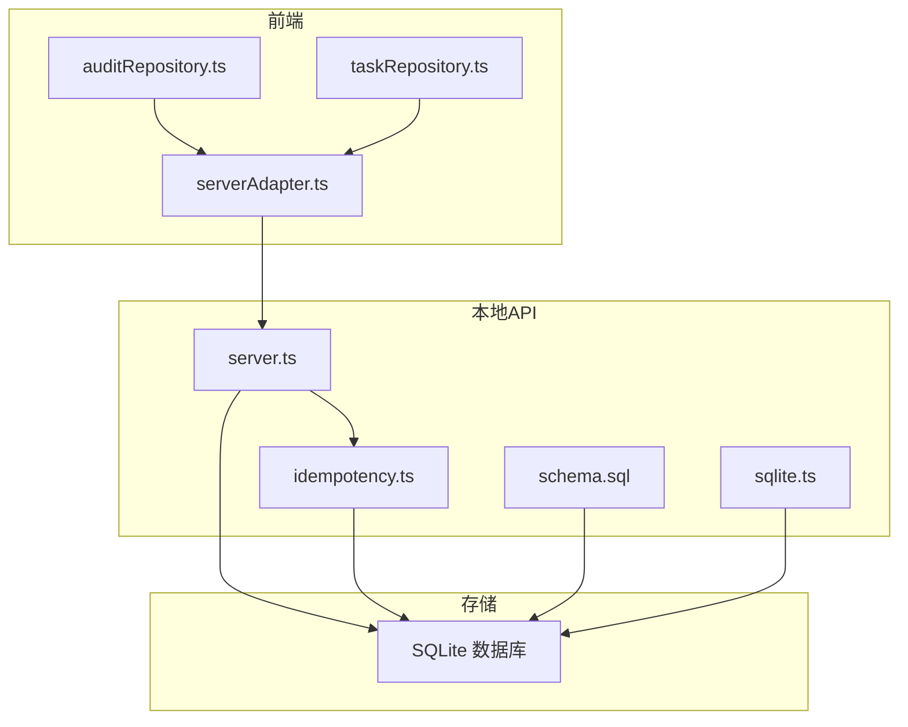
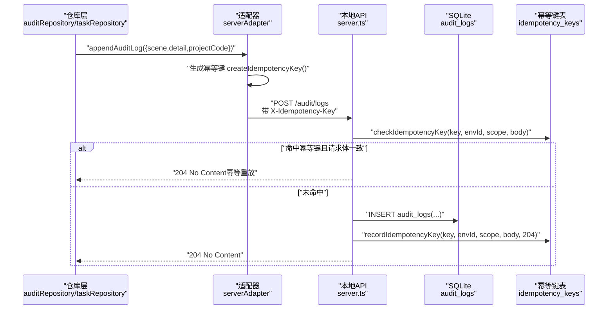
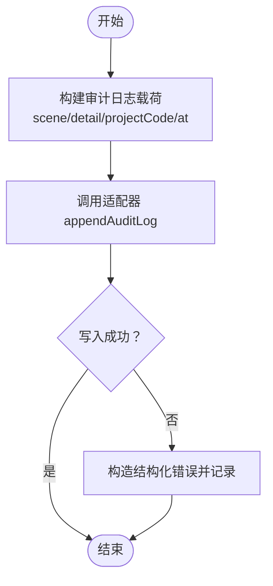
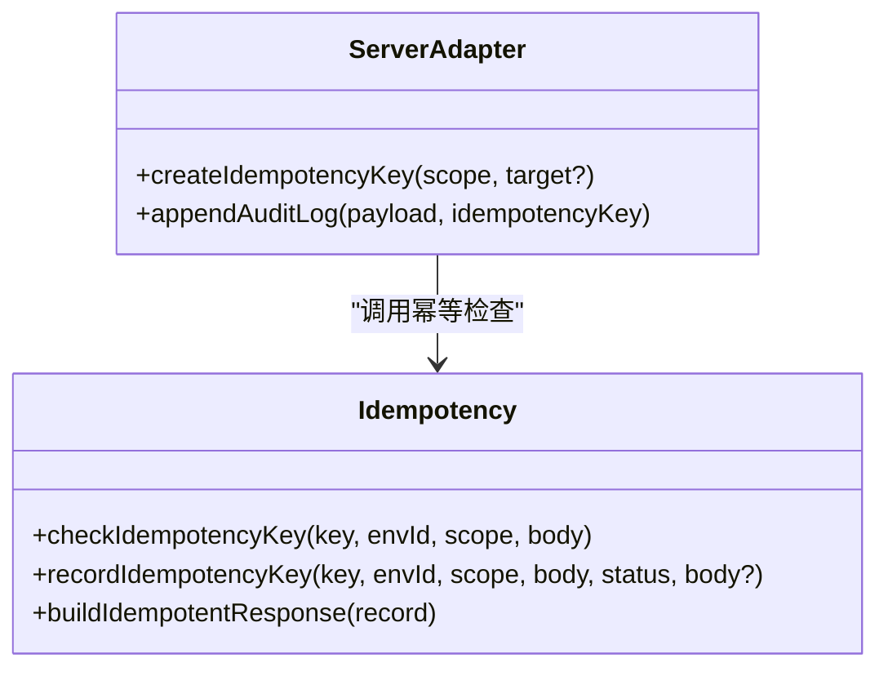
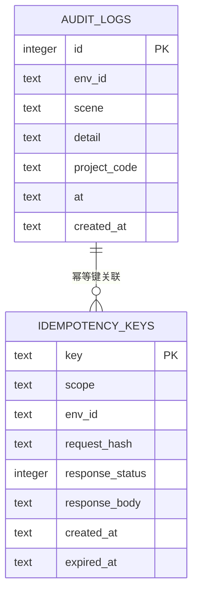
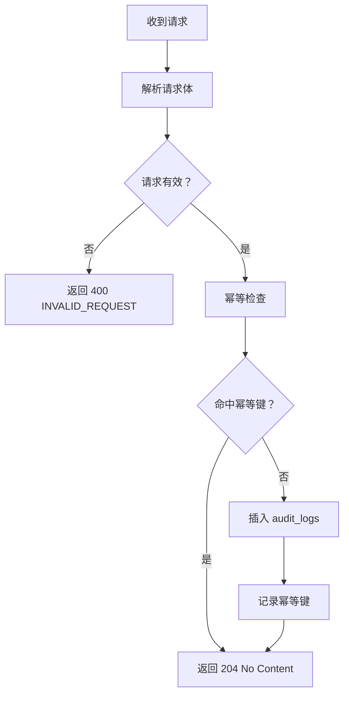
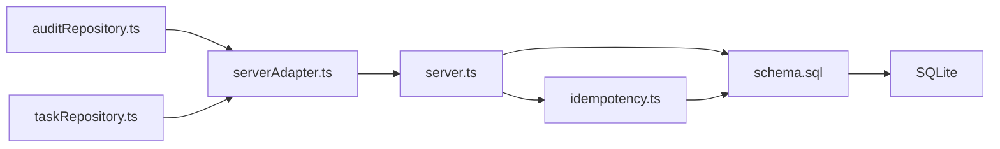

# 审计日志系统

<cite>
**本文引用的文件**
- [auditRepository.ts](file://src/services/repositories/auditRepository.ts)
- [serverAdapter.ts](file://src/services/api/serverAdapter.ts)
- [taskRepository.ts](file://src/services/repositories/taskRepository.ts)
- [server.ts](file://local-api/server.ts)
- [schema.sql](file://local-api/store/schema.sql)
- [idempotency.ts](file://local-api/store/idempotency.ts)
- [sqlite.ts](file://local-api/store/sqlite.ts)
- [contracts.ts](file://local-api/contracts.ts)
- [StructuredError.ts](file://src/services/errors/StructuredError.ts)
- [test-api.sh](file://local-api/test-api.sh)
</cite>

## 目录

1. [简介](#简介)
2. [项目结构](#项目结构)
3. [核心组件](#核心组件)
4. [架构总览](#架构总览)
5. [详细组件分析](#详细组件分析)
6. [依赖关系分析](#依赖关系分析)
7. [性能考量](#性能考量)
8. [故障排查指南](#故障排查指南)
9. [结论](#结论)
10. [附录](#附录)

## 简介

本文件为 CodeBuddy 项目的审计日志系统提供系统性文档，涵盖设计目标、日志格式、存储策略、查询能力、完整性保障、使用场景以及扩展与维护指南。审计日志旨在：

- 追踪关键操作与变更，支撑问题诊断与根因定位
- 满足合规要求，提供可追溯的操作证据
- 支撑性能分析与运营洞察，辅助决策与优化

当前实现采用“前端仓库层 -> 适配器 -> 本地 API -> SQLite 存储”的链路，并内置幂等性保障与错误增强记录，确保在弱网或重放场景下的稳定性与一致性。

## 项目结构

围绕审计日志的关键文件分布如下：

- 前端仓库层：负责调用适配器发起审计日志写入，并进行失败兜底记录
- 适配器层：封装环境参数、幂等键生成与 API 请求
- 本地 API：提供 /audit/logs 接口，执行幂等检查与落库
- 存储层：SQLite 表结构与索引，幂等键表与清理逻辑
- 类型契约：统一输入输出结构，便于前后端对齐
- 错误模型：统一错误结构化表示，便于日志与告警

图表来源

- [auditRepository.ts:1-26](file://src/services/repositories/auditRepository.ts#L1-L26)
- [serverAdapter.ts:1-87](file://src/services/api/serverAdapter.ts#L1-L87)
- [taskRepository.ts:1-318](file://src/services/repositories/taskRepository.ts#L1-L318)
- [server.ts:280-334](file://local-api/server.ts#L280-L334)
- [schema.sql:1-72](file://local-api/store/schema.sql#L1-L72)
- [idempotency.ts:1-99](file://local-api/store/idempotency.ts#L1-L99)
- [sqlite.ts:65-98](file://local-api/store/sqlite.ts#L65-L98)

章节来源

- [auditRepository.ts:1-26](file://src/services/repositories/auditRepository.ts#L1-L26)
- [serverAdapter.ts:1-87](file://src/services/api/serverAdapter.ts#L1-L87)
- [taskRepository.ts:1-318](file://src/services/repositories/taskRepository.ts#L1-L318)
- [server.ts:280-334](file://local-api/server.ts#L280-L334)
- [schema.sql:1-72](file://local-api/store/schema.sql#L1-L72)
- [idempotency.ts:1-99](file://local-api/store/idempotency.ts#L1-L99)
- [sqlite.ts:65-98](file://local-api/store/sqlite.ts#L65-L98)
- [contracts.ts:1-89](file://local-api/contracts.ts#L1-L89)

## 核心组件

- 审计场景枚举与仓库
  - 场景类型：project | task | acceptance | settlement | system
  - 提供 append(scene, detail, projectCode?) 方法，内部通过适配器发起写入，并在失败时记录结构化错误
- 适配器
  - 生成幂等键 createIdempotencyKey
  - 封装 appendAuditLog，统一注入 at 时间戳与 envId 查询参数
- 本地 API
  - /audit/logs 接口：POST 写入；支持 X-Idempotency-Key 头部进行幂等检查；成功返回 204
  - 幂等记录：命中则直接返回 204，避免重复写入
- 存储与索引
  - 审计日志表 audit_logs：包含 env_id、scene、detail、project_code、at、created_at
  - 幂等键表 idempotency_keys：用于去重与重放一致性
  - 为 audit_logs 的 env_id、project_code、scene 建立索引，提升查询效率
- 错误模型
  - StructuredError：统一错误结构，包含 code、scope、scenario、status、idempotencyKey、at 等字段，便于日志与监控

章节来源

- [auditRepository.ts:4-25](file://src/services/repositories/auditRepository.ts#L4-L25)
- [serverAdapter.ts:38-86](file://src/services/api/serverAdapter.ts#L38-L86)
- [server.ts:282-329](file://local-api/server.ts#L282-L329)
- [schema.sql:42-71](file://local-api/store/schema.sql#L42-L71)
- [StructuredError.ts:7-127](file://src/services/errors/StructuredError.ts#L7-L127)

## 架构总览

下图展示一次典型审计日志写入的端到端流程，包括幂等检查、落库与响应：

图表来源

- [auditRepository.ts:7-24](file://src/services/repositories/auditRepository.ts#L7-L24)
- [taskRepository.ts:183-195](file://src/services/repositories/taskRepository.ts#L183-L195)
- [serverAdapter.ts:76-85](file://src/services/api/serverAdapter.ts#L76-L85)
- [server.ts:288-321](file://local-api/server.ts#L288-L321)
- [idempotency.ts:23-58](file://local-api/store/idempotency.ts#L23-L58)

## 详细组件分析

### 审计场景与仓库层

- 场景类型
  - 通过枚举限定场景集合，便于后续查询与统计
- 写入流程
  - 仓库层调用适配器发起写入
  - 失败时构造结构化错误并记录，不影响主流程
- 使用示例
  - 任务操作日志：在任务操作后追加一条审计日志，携带场景、详情与项目编码
  - 验收整改：在创建整改任务后追加验收场景的审计日志

图表来源

- [auditRepository.ts:7-24](file://src/services/repositories/auditRepository.ts#L7-L24)
- [taskRepository.ts:183-195](file://src/services/repositories/taskRepository.ts#L183-L195)

章节来源

- [auditRepository.ts:4-25](file://src/services/repositories/auditRepository.ts#L4-L25)
- [taskRepository.ts:175-273](file://src/services/repositories/taskRepository.ts#L175-L273)

### 适配器与幂等键

- 幂等键生成
  - createIdempotencyKey(scope, target?) 生成唯一键，包含随机片段与时间戳，降低冲突概率
- 请求封装
  - appendAuditLog 自动注入 at 字段与 envId 查询参数，设置 scope 与幂等键
- 幂等检查
  - 本地 API 在收到 X-Idempotency-Key 时，先校验键与请求体哈希是否一致
  - 命中则直接返回 204，避免重复写入

图表来源

- [serverAdapter.ts:38-86](file://src/services/api/serverAdapter.ts#L38-L86)
- [idempotency.ts:23-99](file://local-api/store/idempotency.ts#L23-L99)

章节来源

- [serverAdapter.ts:38-86](file://src/services/api/serverAdapter.ts#L38-L86)
- [idempotency.ts:1-99](file://local-api/store/idempotency.ts#L1-L99)

### 本地 API 与存储

- 接口定义
  - POST /audit/logs：写入审计日志；支持 X-Idempotency-Key；成功返回 204
- 存储设计
  - 审计日志表：包含 env_id、scene、detail、project_code、at、created_at
  - 幂等键表：记录 key、scope、env_id、request_hash、response_status、response_body、expired_at
- 索引策略
  - 为 audit_logs 的 env_id、project_code、scene 建立索引，提升按环境、项目、场景的查询性能
- 清理策略
  - 定期清理过期幂等键（默认 7 天）

图表来源

- [schema.sql:42-71](file://local-api/store/schema.sql#L42-L71)
- [contracts.ts:48-70](file://local-api/contracts.ts#L48-L70)

章节来源

- [server.ts:282-329](file://local-api/server.ts#L282-L329)
- [schema.sql:42-71](file://local-api/store/schema.sql#L42-L71)
- [sqlite.ts:65-98](file://local-api/store/sqlite.ts#L65-L98)

### 日志格式与字段规范

- 必填字段
  - scene：场景标识（如 task_operation、acceptance 等）
  - detail：详细描述，承载上下文信息
  - at：ISO 8601 时间戳，记录事件发生时刻
- 可选字段
  - projectCode：项目编码，用于跨模块关联
  - envId：通过查询参数注入，用于多环境隔离
- 生成时机
  - 适配器在发起请求前自动注入 at 字段，确保时间精度

章节来源

- [contracts.ts:48-58](file://local-api/contracts.ts#L48-L58)
- [serverAdapter.ts:79-82](file://src/services/api/serverAdapter.ts#L79-L82)

### 查询能力与接口扩展建议

- 当前实现
  - 本地 API 仅提供写入接口，未提供查询接口
- 扩展建议
  - 新增 GET /audit/logs，支持以下过滤条件：
    - 场景过滤：scene
    - 项目筛选：projectCode
    - 时间范围：at 起止时间
    - 环境筛选：envId
  - 返回结构：兼容现有审计日志记录结构，包含 id、scene、detail、projectCode、at、createdAt
  - 性能优化：基于现有索引，确保常见组合查询具备良好性能

章节来源

- [server.ts:282-329](file://local-api/server.ts#L282-L329)
- [schema.sql:53-56](file://local-api/store/schema.sql#L53-L56)

### 完整性保障

- 幂等性
  - 通过 X-Idempotency-Key 与请求体哈希校验，避免重复写入
  - 命中幂等键时直接返回 204，确保重放安全
- 数据验证
  - 本地 API 对请求体进行解析与错误处理，非法请求返回 400
- 错误记录
  - 仓库层在写入失败时构造结构化错误并记录，便于后续排查
- 清理策略
  - 定期清理过期幂等键，避免存储膨胀

图表来源

- [server.ts:291-325](file://local-api/server.ts#L291-L325)
- [idempotency.ts:23-58](file://local-api/store/idempotency.ts#L23-L58)

章节来源

- [server.ts:288-329](file://local-api/server.ts#L288-L329)
- [idempotency.ts:1-99](file://local-api/store/idempotency.ts#L1-L99)
- [StructuredError.ts:179-194](file://src/services/errors/StructuredError.ts#L179-L194)

## 依赖关系分析

- 组件耦合
  - 仓库层依赖适配器；适配器依赖本地 API；本地 API 依赖存储与幂等模块
- 外部依赖
  - 本地 API 使用 SQLite 作为存储后端
  - 通过 X-Idempotency-Key 头部实现幂等性
- 循环依赖
  - 未发现循环依赖迹象

图表来源

- [auditRepository.ts:1-2](file://src/services/repositories/auditRepository.ts#L1-L2)
- [taskRepository.ts:1-3](file://src/services/repositories/taskRepository.ts#L1-L3)
- [serverAdapter.ts:5-6](file://src/services/api/serverAdapter.ts#L5-L6)
- [server.ts:280-334](file://local-api/server.ts#L280-L334)
- [schema.sql:1-72](file://local-api/store/schema.sql#L1-L72)
- [idempotency.ts:6-8](file://local-api/store/idempotency.ts#L6-L8)

章节来源

- [auditRepository.ts:1-26](file://src/services/repositories/auditRepository.ts#L1-L26)
- [taskRepository.ts:1-318](file://src/services/repositories/taskRepository.ts#L1-L318)
- [serverAdapter.ts:1-87](file://src/services/api/serverAdapter.ts#L1-L87)
- [server.ts:280-334](file://local-api/server.ts#L280-L334)
- [schema.sql:1-72](file://local-api/store/schema.sql#L1-L72)
- [idempotency.ts:1-99](file://local-api/store/idempotency.ts#L1-L99)

## 性能考量

- 索引优化
  - 已为 audit_logs 的 env_id、project_code、scene 建立索引，建议在高频查询场景下保持这些字段的使用
- 幂等键 TTL
  - 默认 7 天，可根据业务规模调整；定期清理可减少索引扫描压力
- 写入路径
  - 204 无响应体，减少网络传输；幂等命中直接返回，避免数据库写入
- 扩展查询
  - 若引入查询接口，建议在 at 字段上建立索引以支持时间范围查询

章节来源

- [schema.sql:53-56](file://local-api/store/schema.sql#L53-L56)
- [sqlite.ts:68-80](file://local-api/store/sqlite.ts#L68-L80)

## 故障排查指南

- 常见问题
  - 写入失败：检查网络与本地 API 健康状态；查看仓库层错误记录
  - 重复请求：确认 X-Idempotency-Key 是否正确传递；幂等键冲突会直接返回 204
  - 查询不到数据：确认查询参数（envId、scene、projectCode、时间范围）是否合理
- 排查步骤
  - 确认本地 API 健康：GET /health
  - 使用测试脚本验证写入与幂等行为
  - 查看控制台日志中的结构化错误输出
- 相关工具
  - 测试脚本包含审计日志写入与幂等重放示例

章节来源

- [server.ts:332-334](file://local-api/server.ts#L332-L334)
- [test-api.sh:125-155](file://local-api/test-api.sh#L125-L155)
- [StructuredError.ts:179-194](file://src/services/errors/StructuredError.ts#L179-L194)

## 结论

CodeBuddy 的审计日志系统以轻量、可扩展为目标，通过仓库层、适配器与本地 API 的清晰分层，结合 SQLite 存储与幂等键机制，实现了稳定、可追溯的日志写入能力。当前重点在于完善查询接口与索引策略，以支撑更丰富的运营与合规需求。

## 附录

### 使用场景

- 问题排查
  - 通过场景与项目编码快速定位问题上下文
  - 结合 at 时间戳回溯事件序列
- 性能分析
  - 统计高频场景与项目维度的事件分布
  - 分析操作延迟与异常模式
- 合规报告
  - 提供可审计的时间线与操作证据
  - 支持按环境与项目导出审计记录

### 扩展与维护指南

- 新增场景
  - 在仓库层与适配器中补充场景枚举与命名规范
- 查询接口
  - 按建议新增 GET /audit/logs，支持场景、项目、时间范围与环境筛选
- 监控与告警
  - 基于结构化错误与审计日志构建告警规则
- 数据保留
  - 根据合规要求设定审计日志保留周期与归档策略
