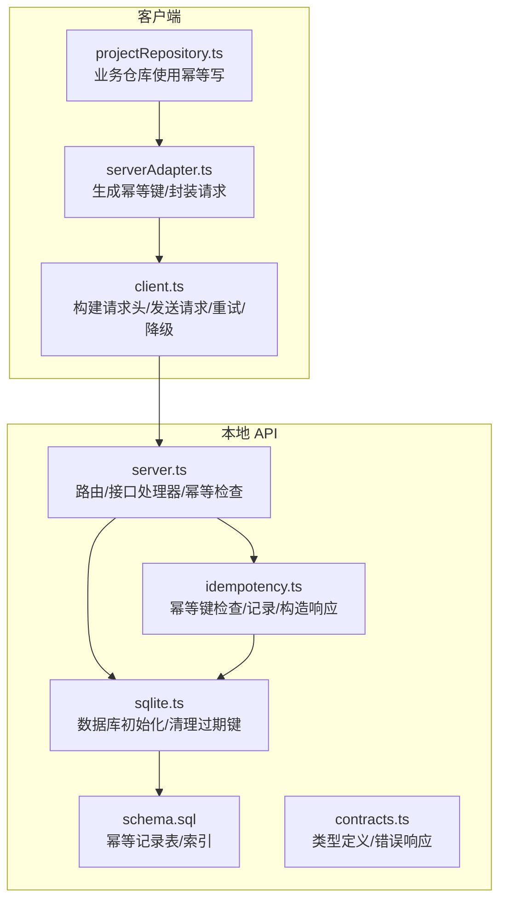
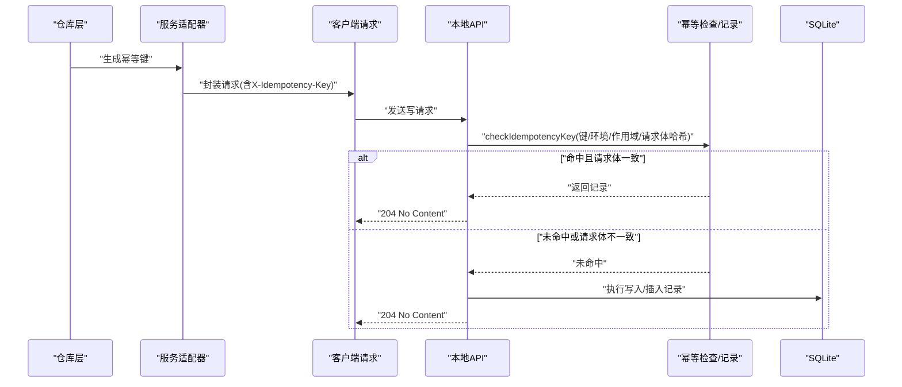
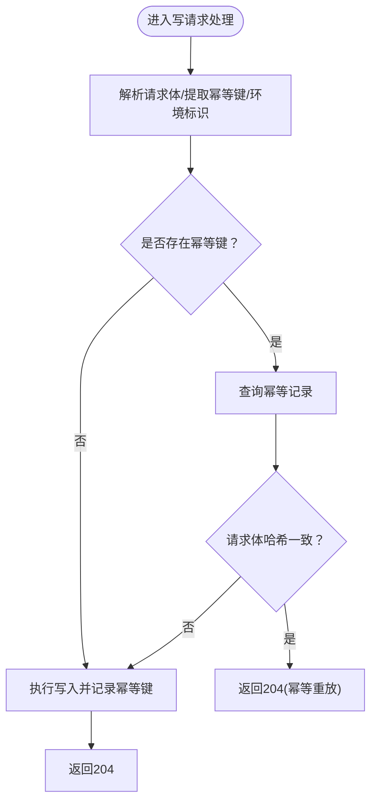
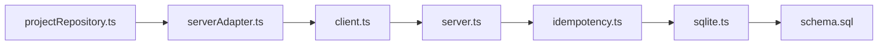

# 幂等性机制

<cite>
**本文引用的文件**
- [local-api/store/idempotency.ts](file://local-api/store/idempotency.ts)
- [local-api/store/schema.sql](file://local-api/store/schema.sql)
- [local-api/server.ts](file://local-api/server.ts)
- [local-api/store/sqlite.ts](file://local-api/store/sqlite.ts)
- [local-api/contracts.ts](file://local-api/contracts.ts)
- [src/services/api/serverAdapter.ts](file://src/services/api/serverAdapter.ts)
- [src/services/api/client.ts](file://src/services/api/client.ts)
- [src/services/repositories/projectRepository.ts](file://src/services/repositories/projectRepository.ts)
- [local-api/test-api.sh](file://local-api/test-api.sh)
</cite>

## 目录

1. [简介](#简介)
2. [项目结构](#项目结构)
3. [核心组件](#核心组件)
4. [架构总览](#架构总览)
5. [详细组件分析](#详细组件分析)
6. [依赖关系分析](#依赖关系分析)
7. [性能考量](#性能考量)
8. [故障排查指南](#故障排查指南)
9. [结论](#结论)
10. [附录](#附录)

## 简介

本文件系统性阐述 CodeBuddy 项目中的幂等性机制，覆盖设计原理、幂等键生成策略、幂等记录存储、幂等检查流程、不同操作类型的幂等处理、最佳实践以及测试与调试方法。目标是帮助开发者在面对网络重试、重复提交、重放攻击等场景时，确保状态一致性与用户体验。

## 项目结构

幂等性相关代码主要分布在以下位置：

- 本地 API 层：路由与业务处理、幂等键检查与记录、数据库初始化与清理
- 存储层：幂等记录表结构、SQLite 初始化与索引
- 客户端适配层：幂等键生成、请求头注入、错误降级与回退事件
- 仓库层：调用适配器发起幂等写请求

图表来源

- [src/services/api/serverAdapter.ts:38-42](file://src/services/api/serverAdapter.ts#L38-L42)
- [src/services/api/client.ts:83-171](file://src/services/api/client.ts#L83-L171)
- [src/services/repositories/projectRepository.ts:76-88](file://src/services/repositories/projectRepository.ts#L76-L88)
- [local-api/server.ts:70-129](file://local-api/server.ts#L70-L129)
- [local-api/store/idempotency.ts:23-86](file://local-api/store/idempotency.ts#L23-L86)
- [local-api/store/sqlite.ts:18-80](file://local-api/store/sqlite.ts#L18-L80)
- [local-api/store/schema.sql:57-71](file://local-api/store/schema.sql#L57-L71)
- [local-api/contracts.ts:62-89](file://local-api/contracts.ts#L62-L89)

章节来源

- [local-api/server.ts:1-414](file://local-api/server.ts#L1-L414)
- [local-api/store/idempotency.ts:1-100](file://local-api/store/idempotency.ts#L1-L100)
- [local-api/store/schema.sql:1-72](file://local-api/store/schema.sql#L1-L72)
- [local-api/store/sqlite.ts:1-99](file://local-api/store/sqlite.ts#L1-L99)
- [local-api/contracts.ts:1-89](file://local-api/contracts.ts#L1-L89)
- [src/services/api/serverAdapter.ts:1-87](file://src/services/api/serverAdapter.ts#L1-L87)
- [src/services/api/client.ts:1-172](file://src/services/api/client.ts#L1-L172)
- [src/services/repositories/projectRepository.ts:1-90](file://src/services/repositories/projectRepository.ts#L1-L90)
- [local-api/test-api.sh:1-156](file://local-api/test-api.sh#L1-L156)

## 核心组件

- 幂等键生成器：基于作用域、可选目标标识、时间戳与随机数拼接，形成全局唯一的幂等键
- 幂等检查器：根据幂等键与环境标识查询记录，同时校验请求体哈希，确保语义一致
- 幂等记录器：写入幂等记录，包含请求哈希、响应状态与可选响应体、过期时间
- 本地 API 接口：对写请求启用幂等检查；命中则直接返回无内容，避免重复副作用
- SQLite 存储：幂等记录表与索引；启动时清理过期记录
- 客户端适配器：统一生成幂等键并注入请求头；封装错误降级事件
- 仓库层：业务侧通过适配器发起幂等写请求，失败时进行本地降级

章节来源

- [src/services/api/serverAdapter.ts:38-42](file://src/services/api/serverAdapter.ts#L38-L42)
- [local-api/store/idempotency.ts:23-86](file://local-api/store/idempotency.ts#L23-L86)
- [local-api/server.ts:70-129](file://local-api/server.ts#L70-L129)
- [local-api/store/sqlite.ts:68-80](file://local-api/store/sqlite.ts#L68-L80)
- [src/services/api/client.ts:83-171](file://src/services/api/client.ts#L83-L171)
- [src/services/repositories/projectRepository.ts:76-88](file://src/services/repositories/projectRepository.ts#L76-L88)

## 架构总览

下图展示从客户端到本地 API 的完整幂等写流程，包括幂等键生成、请求头注入、服务器幂等检查与记录、以及命中重放时的快速返回。

图表来源

- [src/services/repositories/projectRepository.ts:76-88](file://src/services/repositories/projectRepository.ts#L76-L88)
- [src/services/api/serverAdapter.ts:46-52](file://src/services/api/serverAdapter.ts#L46-L52)
- [src/services/api/client.ts:83-102](file://src/services/api/client.ts#L83-L102)
- [local-api/server.ts:87-122](file://local-api/server.ts#L87-L122)
- [local-api/store/idempotency.ts:23-58](file://local-api/store/idempotency.ts#L23-L58)
- [local-api/store/idempotency.ts:63-86](file://local-api/store/idempotency.ts#L63-L86)

## 详细组件分析

### 幂等键生成策略

- 唯一标识符创建：作用域 + 可选目标标识 + 时间戳 + 随机串，保证跨环境、跨作用域的唯一性
- 时间戳处理：使用毫秒级时间戳，降低冲突概率
- 负载哈希计算：对请求体进行序列化后做 SHA-256 哈希，用于后续幂等检查的一致性校验

章节来源

- [src/services/api/serverAdapter.ts:38-42](file://src/services/api/serverAdapter.ts#L38-L42)
- [local-api/store/idempotency.ts:15-18](file://local-api/store/idempotency.ts#L15-L18)

### 幂等记录存储机制

- 记录表设计：主键为幂等键，包含作用域、环境标识、请求体哈希、响应状态、响应体、创建与过期时间
- 过期时间管理：默认保留 7 天；服务启动时自动清理过期记录
- 索引策略：按环境与作用域建立索引，加速查询与清理

章节来源

- [local-api/store/schema.sql:57-71](file://local-api/store/schema.sql#L57-L71)
- [local-api/store/sqlite.ts:68-80](file://local-api/store/sqlite.ts#L68-L80)
- [local-api/store/idempotency.ts:10](file://local-api/store/idempotency.ts#L10)

### 幂等检查流程

- 请求验证：解析请求体、提取幂等键与环境标识
- 重复检测：查询幂等记录，校验请求体哈希一致性
- 重放处理：命中则直接返回 204，避免重复副作用；未命中则执行写入并记录幂等键

图表来源

- [local-api/server.ts:87-122](file://local-api/server.ts#L87-L122)
- [local-api/store/idempotency.ts:23-58](file://local-api/store/idempotency.ts#L23-L58)
- [local-api/store/idempotency.ts:63-86](file://local-api/store/idempotency.ts#L63-L86)

章节来源

- [local-api/server.ts:87-122](file://local-api/server.ts#L87-L122)
- [local-api/store/idempotency.ts:23-86](file://local-api/store/idempotency.ts#L23-L86)

### 不同操作类型的幂等处理

- 项目状态写入：PUT /api/projects/state，支持幂等键，命中则返回 204
- 任务状态写入：PUT /api/tasks/state，支持幂等键，命中则返回 204
- 验收状态写入：PUT /api/acceptance/state，支持幂等键，命中则返回 204
- 审计日志写入：POST /api/audit/logs，支持幂等键，命中则返回 204
- 结算状态：仅 GET，无写入，无需幂等

章节来源

- [local-api/server.ts:70-129](file://local-api/server.ts#L70-L129)
- [local-api/server.ts:131-197](file://local-api/server.ts#L131-L197)
- [local-api/server.ts:199-259](file://local-api/server.ts#L199-L259)
- [local-api/server.ts:282-329](file://local-api/server.ts#L282-L329)
- [local-api/server.ts:261-280](file://local-api/server.ts#L261-L280)

### 客户端实现与错误处理

- 幂等键生成：统一在适配器中生成，便于集中管理
- 请求头注入：通过客户端将 X-Idempotency-Key 注入请求头
- 错误处理：网络异常或可重试错误会触发重试；最终失败时发出“远程降级”事件，便于前端感知并回退到本地状态

章节来源

- [src/services/api/serverAdapter.ts:38-42](file://src/services/api/serverAdapter.ts#L38-L42)
- [src/services/api/client.ts:37-48](file://src/services/api/client.ts#L37-L48)
- [src/services/api/client.ts:134-159](file://src/services/api/client.ts#L134-L159)
- [src/services/api/client.ts:54-81](file://src/services/api/client.ts#L54-L81)

### 类型与契约

- 幂等记录类型：包含键、作用域、请求哈希、响应状态、响应体、创建与过期时间
- 统一错误响应：包含消息、代码、状态码与时间戳

章节来源

- [local-api/contracts.ts:62-70](file://local-api/contracts.ts#L62-L70)
- [local-api/contracts.ts:74-89](file://local-api/contracts.ts#L74-L89)

## 依赖关系分析

- 本地 API 依赖幂等模块进行重复检测与记录
- 幂等模块依赖 SQLite 存储进行持久化
- 客户端适配器负责生成幂等键并注入请求头
- 仓库层通过适配器发起幂等写请求

图表来源

- [src/services/repositories/projectRepository.ts:76-88](file://src/services/repositories/projectRepository.ts#L76-L88)
- [src/services/api/serverAdapter.ts:46-52](file://src/services/api/serverAdapter.ts#L46-L52)
- [src/services/api/client.ts:83-102](file://src/services/api/client.ts#L83-L102)
- [local-api/server.ts:87-122](file://local-api/server.ts#L87-L122)
- [local-api/store/idempotency.ts:23-86](file://local-api/store/idempotency.ts#L23-L86)
- [local-api/store/sqlite.ts:18-80](file://local-api/store/sqlite.ts#L18-L80)
- [local-api/store/schema.sql:57-71](file://local-api/store/schema.sql#L57-L71)

章节来源

- [src/services/repositories/projectRepository.ts:1-90](file://src/services/repositories/projectRepository.ts#L1-L90)
- [src/services/api/serverAdapter.ts:1-87](file://src/services/api/serverAdapter.ts#L1-L87)
- [src/services/api/client.ts:1-172](file://src/services/api/client.ts#L1-L172)
- [local-api/server.ts:1-414](file://local-api/server.ts#L1-L414)
- [local-api/store/idempotency.ts:1-100](file://local-api/store/idempotency.ts#L1-L100)
- [local-api/store/sqlite.ts:1-99](file://local-api/store/sqlite.ts#L1-L99)
- [local-api/store/schema.sql:1-72](file://local-api/store/schema.sql#L1-L72)

## 性能考量

- 幂等键 TTL：默认 7 天，平衡存储占用与重放窗口
- 索引优化：按环境与作用域建立索引，减少查询与清理成本
- WAL 模式：启用 WAL 提升并发读写性能
- 幂等命中快速返回：命中时直接返回 204，避免重复写入与数据库压力

章节来源

- [local-api/store/schema.sql:69-71](file://local-api/store/schema.sql#L69-L71)
- [local-api/store/sqlite.ts:32-33](file://local-api/store/sqlite.ts#L32-L33)
- [local-api/store/sqlite.ts:68-80](file://local-api/store/sqlite.ts#L68-L80)
- [local-api/server.ts:92-104](file://local-api/server.ts#L92-L104)

## 故障排查指南

- 幂等键冲突：记录器捕获插入异常并忽略（并发场景），确保幂等键唯一性
- 请求体不一致：若请求体哈希不匹配，视为新请求而非重放，继续执行写入
- 过期记录清理：服务启动时自动清理过期记录，避免无限增长
- 降级事件：客户端在重试耗尽或网络异常时发出“远程降级”事件，便于前端感知并回退到本地状态

章节来源

- [local-api/store/idempotency.ts:82-85](file://local-api/store/idempotency.ts#L82-L85)
- [local-api/store/idempotency.ts:48-51](file://local-api/store/idempotency.ts#L48-L51)
- [local-api/store/sqlite.ts:68-80](file://local-api/store/sqlite.ts#L68-L80)
- [src/services/api/client.ts:54-81](file://src/services/api/client.ts#L54-L81)
- [src/services/api/client.ts:169-171](file://src/services/api/client.ts#L169-L171)

## 结论

CodeBuddy 的幂等性机制通过“幂等键 + 请求体哈希 + TTL + 快速重放返回”的组合，在不牺牲用户体验的前提下，有效防止了重复提交与重放攻击带来的副作用。配合客户端的重试与降级策略，系统在弱网与异常环境下仍能保持稳定与一致。

## 附录

### 幂等性最佳实践

- 客户端实现
  - 为每个写请求生成唯一幂等键，作用域与目标明确，便于定位与排障
  - 在请求头中携带 X-Idempotency-Key，确保服务端可识别
  - 对可重试错误进行指数退避重试，超过阈值后触发降级
- 服务端实现
  - 所有写请求均应支持幂等键检查，命中即返回 204
  - 请求体哈希必须严格校验，避免语义不一致导致的错误重放
  - 定期清理过期幂等记录，控制存储规模
- 性能与可靠性
  - 合理设置幂等 TTL，兼顾重放窗口与资源占用
  - 使用 WAL 模式与必要索引，提升并发性能
  - 对关键写接口进行压测，评估幂等检查与记录的开销

### 幂等性测试与调试方法

- 使用测试脚本对各写接口进行幂等重放测试，验证重复请求被正确拦截
- 观察服务端日志中的幂等命中与记录行为，确认键名、环境标识与哈希一致
- 检查幂等记录表的过期清理是否按预期执行
- 在客户端模拟网络异常与超时，验证降级事件是否正确触发

章节来源

- [local-api/test-api.sh:25-65](file://local-api/test-api.sh#L25-L65)
- [local-api/test-api.sh:100-151](file://local-api/test-api.sh#L100-L151)
- [local-api/store/idempotency.ts:53-54](file://local-api/store/idempotency.ts#L53-L54)
- [local-api/store/sqlite.ts:68-80](file://local-api/store/sqlite.ts#L68-L80)
- [src/services/api/client.ts:134-159](file://src/services/api/client.ts#L134-L159)
- [src/services/api/client.ts:54-81](file://src/services/api/client.ts#L54-L81)
