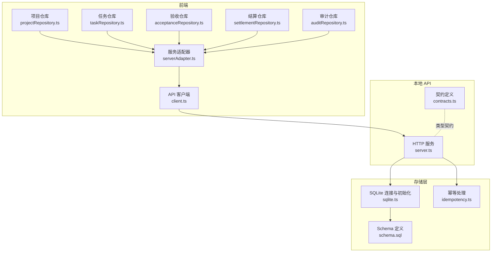
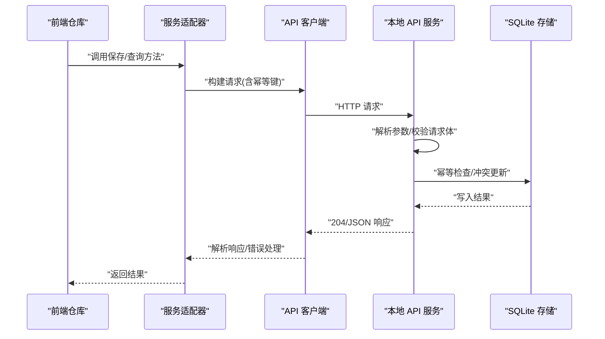
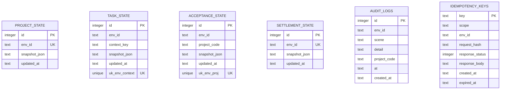
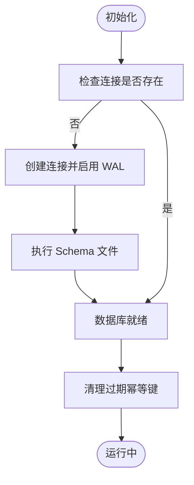
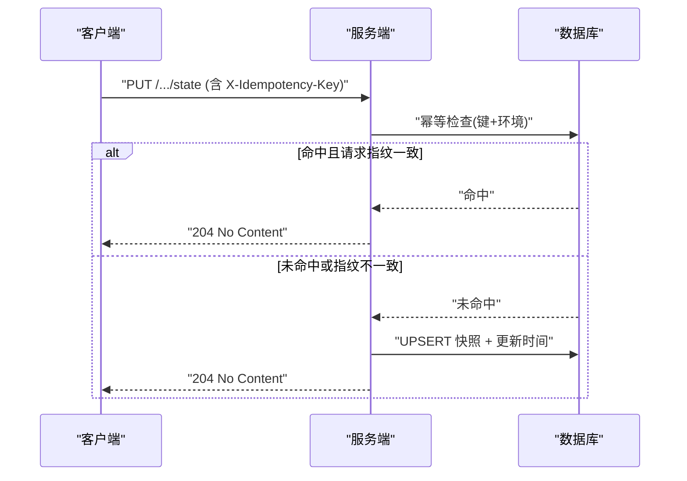
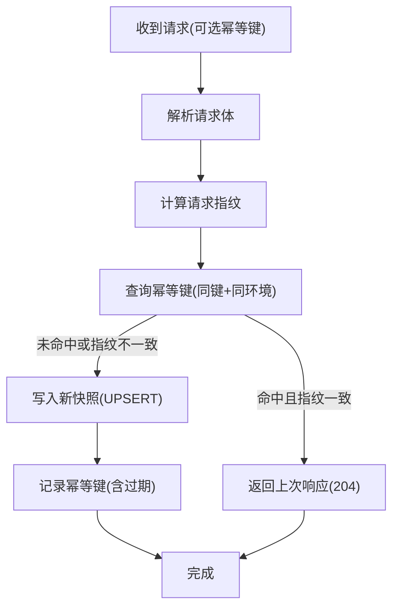
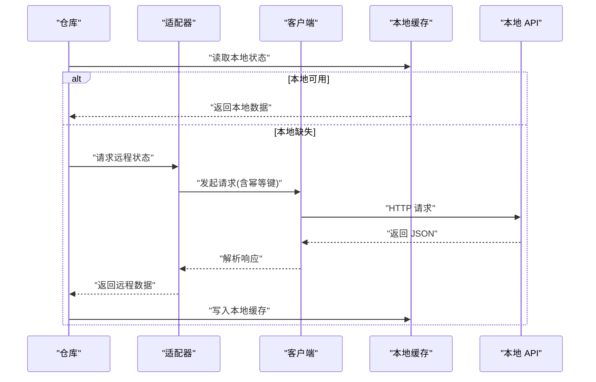
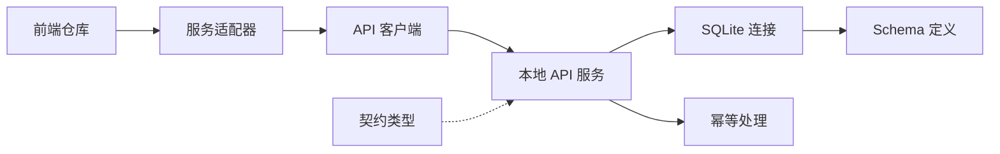

# 数据库集成

<cite>
**本文引用的文件**
- [local-api/store/schema.sql](file://local-api/store/schema.sql)
- [local-api/store/sqlite.ts](file://local-api/store/sqlite.ts)
- [local-api/store/idempotency.ts](file://local-api/store/idempotency.ts)
- [local-api/server.ts](file://local-api/server.ts)
- [local-api/contracts.ts](file://local-api/contracts.ts)
- [src/services/api/serverAdapter.ts](file://src/services/api/serverAdapter.ts)
- [src/services/api/client.ts](file://src/services/api/client.ts)
- [src/services/repositories/projectRepository.ts](file://src/services/repositories/projectRepository.ts)
- [src/services/repositories/taskRepository.ts](file://src/services/repositories/taskRepository.ts)
- [src/services/repositories/acceptanceRepository.ts](file://src/services/repositories/acceptanceRepository.ts)
- [src/services/repositories/settlementRepository.ts](file://src/services/repositories/settlementRepository.ts)
- [src/services/repositories/auditRepository.ts](file://src/services/repositories/auditRepository.ts)
</cite>

## 目录

1. [简介](#简介)
2. [项目结构](#项目结构)
3. [核心组件](#核心组件)
4. [架构总览](#架构总览)
5. [详细组件分析](#详细组件分析)
6. [依赖关系分析](#依赖关系分析)
7. [性能考量](#性能考量)
8. [故障排查指南](#故障排查指南)
9. [结论](#结论)
10. [附录](#附录)

## 简介

本文件系统性梳理 CodeBuddy 项目的数据库集成方案，聚焦本地 SQLite 存储与本地 HTTP API 的协同实现。内容涵盖数据库初始化与连接管理、事务与冲突处理、表结构设计与约束、幂等性保障、查询与写入模式、索引与性能优化、以及调试与维护建议。目标是帮助开发者快速理解并高效扩展数据库层能力。

## 项目结构

数据库相关能力主要分布在以下位置：

- 本地 API 层：提供五类状态与审计日志的 REST 接口，内置 SQLite 存储与幂等处理。
- 存储层：SQLite 初始化、表结构、索引、幂等键清理与重置工具。
- 前端适配层：统一的 API 客户端与服务适配器，负责请求构建、幂等键生成与错误处理。
- 业务仓库层：各领域（项目、任务、验收、结算、审计）的状态读写与本地缓存策略。

图表来源

- [local-api/server.ts:1-414](file://local-api/server.ts#L1-L414)
- [local-api/store/sqlite.ts:1-99](file://local-api/store/sqlite.ts#L1-L99)
- [local-api/store/schema.sql:1-72](file://local-api/store/schema.sql#L1-L72)
- [local-api/store/idempotency.ts:1-100](file://local-api/store/idempotency.ts#L1-L100)
- [src/services/api/serverAdapter.ts:1-87](file://src/services/api/serverAdapter.ts#L1-L87)
- [src/services/api/client.ts:1-172](file://src/services/api/client.ts#L1-L172)

章节来源

- [local-api/server.ts:1-414](file://local-api/server.ts#L1-L414)
- [local-api/store/sqlite.ts:1-99](file://local-api/store/sqlite.ts#L1-L99)
- [local-api/store/schema.sql:1-72](file://local-api/store/schema.sql#L1-L72)
- [local-api/store/idempotency.ts:1-100](file://local-api/store/idempotency.ts#L1-L100)
- [src/services/api/serverAdapter.ts:1-87](file://src/services/api/serverAdapter.ts#L1-L87)
- [src/services/api/client.ts:1-172](file://src/services/api/client.ts#L1-L172)

## 核心组件

- SQLite 连接与初始化：集中管理数据库连接生命周期、WAL 模式启用、Schema 执行与目录准备。
- 幂等处理：基于请求指纹与 TTL 的幂等键管理，支持重复请求安全重放。
- 本地 API：提供项目/任务/验收/结算/审计五类接口，内置幂等检查与冲突更新。
- 前端适配：统一的 API 客户端与服务适配器，负责重试、错误映射与幂等键注入。
- 业务仓库：各领域状态的读写封装，结合本地缓存与远程回退策略。

章节来源

- [local-api/store/sqlite.ts:1-99](file://local-api/store/sqlite.ts#L1-L99)
- [local-api/store/idempotency.ts:1-100](file://local-api/store/idempotency.ts#L1-L100)
- [local-api/server.ts:1-414](file://local-api/server.ts#L1-L414)
- [src/services/api/serverAdapter.ts:1-87](file://src/services/api/serverAdapter.ts#L1-L87)
- [src/services/api/client.ts:1-172](file://src/services/api/client.ts#L1-L172)

## 架构总览

本地 API 作为统一入口，接收前端请求，进行幂等性校验与数据校验后，写入 SQLite；同时提供查询接口返回 JSON 快照。SQLite 使用 WAL 模式提升并发读写性能，并通过索引优化常见查询场景。前端通过适配器与客户端完成请求构建、重试与错误处理，仓库层负责状态合并与本地缓存降级。

图表来源

- [src/services/api/serverAdapter.ts:38-86](file://src/services/api/serverAdapter.ts#L38-L86)
- [src/services/api/client.ts:83-171](file://src/services/api/client.ts#L83-L171)
- [local-api/server.ts:70-329](file://local-api/server.ts#L70-L329)
- [local-api/store/sqlite.ts:18-42](file://local-api/store/sqlite.ts#L18-L42)

## 详细组件分析

### 表结构与约束设计

- 项目状态表：按环境维度唯一存储 JSON 快照，包含更新时间戳。
- 任务状态表：按环境+上下文键唯一存储 JSON 快照，便于多视图隔离。
- 验收状态表：按环境+项目编码唯一存储 JSON 快照，支持项目级验收状态。
- 结算状态表：按环境维度唯一存储 JSON 快照，提供结算建议集合。
- 审计日志表：记录场景、详情、项目编码、时间戳等，具备多字段索引。
- 幂等记录表：以键为主键，记录作用域、环境、请求指纹、响应状态与过期时间。

图表来源

- [local-api/store/schema.sql:4-71](file://local-api/store/schema.sql#L4-L71)

章节来源

- [local-api/store/schema.sql:1-72](file://local-api/store/schema.sql#L1-L72)

### 连接管理与事务处理

- 单例连接：全局持有 SQLite 连接，避免重复打开；首次使用时初始化并启用 WAL。
- 事务语义：采用 SQLite 的 UPSERT（ON CONFLICT）实现“读-比较-写”原子性，避免竞态。
- 资源清理：优雅关闭时释放连接，进程退出钩子确保资源回收。
- 幂等清理：启动时清理过期幂等键，降低表膨胀。

图表来源

- [local-api/store/sqlite.ts:18-42](file://local-api/store/sqlite.ts#L18-L42)
- [local-api/store/sqlite.ts:68-80](file://local-api/store/sqlite.ts#L68-L80)

章节来源

- [local-api/store/sqlite.ts:1-99](file://local-api/store/sqlite.ts#L1-L99)

### 查询与写入模式

- 查询：按唯一键检索 JSON 字段，不存在则返回空快照对象。
- 写入：序列化快照为 JSON，使用 UPSERT 更新，同时记录幂等键。
- 冲突处理：通过唯一约束触发 ON CONFLICT，保证同一维度下仅保留最新快照。
- 幂等检查：若请求携带幂等键且命中相同请求指纹，则直接返回 204。

图表来源

- [local-api/server.ts:86-129](file://local-api/server.ts#L86-L129)
- [local-api/server.ts:148-197](file://local-api/server.ts#L148-L197)
- [local-api/server.ts:216-259](file://local-api/server.ts#L216-L259)
- [local-api/server.ts:288-329](file://local-api/server.ts#L288-L329)
- [local-api/store/idempotency.ts:23-58](file://local-api/store/idempotency.ts#L23-L58)

章节来源

- [local-api/server.ts:70-329](file://local-api/server.ts#L70-L329)
- [local-api/store/idempotency.ts:1-100](file://local-api/store/idempotency.ts#L1-L100)

### 幂等性与冲突处理机制

- 请求指纹：对请求体进行哈希，确保重放时请求内容一致。
- TTL 策略：幂等键带过期时间，定期清理，避免无限增长。
- 写入保护：幂等键冲突时忽略（并发场景），保证最终一致性。
- 响应复用：命中幂等键时，直接复用上次响应状态与体。

图表来源

- [local-api/store/idempotency.ts:23-86](file://local-api/store/idempotency.ts#L23-L86)
- [local-api/store/sqlite.ts:68-80](file://local-api/store/sqlite.ts#L68-L80)

章节来源

- [local-api/store/idempotency.ts:1-100](file://local-api/store/idempotency.ts#L1-L100)
- [local-api/store/sqlite.ts:68-80](file://local-api/store/sqlite.ts#L68-L80)

### 数据访问模式与前端集成

- 项目/任务/验收/结算/审计仓库：统一读取本地缓存，失败时降级；成功后持久化至本地。
- 服务适配器：为每类状态提供 GET/PUT 方法，自动注入环境标识与幂等键。
- API 客户端：统一的 fetch 封装，支持重试、错误码映射与“远程降级”事件。

图表来源

- [src/services/repositories/projectRepository.ts:54-74](file://src/services/repositories/projectRepository.ts#L54-L74)
- [src/services/repositories/taskRepository.ts:142-152](file://src/services/repositories/taskRepository.ts#L142-L152)
- [src/services/repositories/acceptanceRepository.ts:33-43](file://src/services/repositories/acceptanceRepository.ts#L33-L43)
- [src/services/repositories/settlementRepository.ts:21-30](file://src/services/repositories/settlementRepository.ts#L21-L30)
- [src/services/api/serverAdapter.ts:44-86](file://src/services/api/serverAdapter.ts#L44-L86)
- [src/services/api/client.ts:83-171](file://src/services/api/client.ts#L83-L171)

章节来源

- [src/services/repositories/projectRepository.ts:1-90](file://src/services/repositories/projectRepository.ts#L1-L90)
- [src/services/repositories/taskRepository.ts:1-318](file://src/services/repositories/taskRepository.ts#L1-L318)
- [src/services/repositories/acceptanceRepository.ts:1-56](file://src/services/repositories/acceptanceRepository.ts#L1-L56)
- [src/services/repositories/settlementRepository.ts:1-32](file://src/services/repositories/settlementRepository.ts#L1-L32)
- [src/services/repositories/auditRepository.ts:1-26](file://src/services/repositories/auditRepository.ts#L1-L26)
- [src/services/api/serverAdapter.ts:1-87](file://src/services/api/serverAdapter.ts#L1-L87)
- [src/services/api/client.ts:1-172](file://src/services/api/client.ts#L1-L172)

### 数据迁移与版本管理

- 任务状态引入 schemaVersion 字段，用于未来结构演进的兼容与迁移。
- 建议后续迁移策略：
  - 新增字段：默认值与向后兼容。
  - 删除字段：保留读取兼容，写入时剔除。
  - 结构变更：通过版本号区分读写路径，逐步替换。
- 本地 API 可在写入前进行快照校验，拒绝不兼容结构。

章节来源

- [src/services/repositories/taskRepository.ts:17-58](file://src/services/repositories/taskRepository.ts#L17-L58)
- [local-api/server.ts:153-157](file://local-api/server.ts#L153-L157)

### 索引与查询优化

- 审计日志：按环境、项目编码、场景建立索引，加速筛选与聚合。
- 幂等键：按环境、作用域与过期时间建立索引，支持高效清理与查找。
- 建议优化点：
  - 为常用过滤字段添加复合索引（如 env_id+context_key）。
  - 控制 JSON 字段大小，必要时拆分表或转为规范化结构。
  - 对高频查询增加覆盖索引，减少回表。

章节来源

- [local-api/store/schema.sql:53-71](file://local-api/store/schema.sql#L53-L71)

## 依赖关系分析

- 本地 API 依赖存储层（SQLite 初始化、幂等处理）。
- 本地 API 与前端适配器共享契约类型，确保请求/响应结构一致。
- 前端仓库依赖适配器与客户端，形成清晰的分层。

图表来源

- [src/services/repositories/projectRepository.ts:1-90](file://src/services/repositories/projectRepository.ts#L1-L90)
- [src/services/api/serverAdapter.ts:1-87](file://src/services/api/serverAdapter.ts#L1-L87)
- [src/services/api/client.ts:1-172](file://src/services/api/client.ts#L1-L172)
- [local-api/server.ts:1-414](file://local-api/server.ts#L1-L414)
- [local-api/store/sqlite.ts:1-99](file://local-api/store/sqlite.ts#L1-L99)
- [local-api/store/idempotency.ts:1-100](file://local-api/store/idempotency.ts#L1-L100)
- [local-api/contracts.ts:1-89](file://local-api/contracts.ts#L1-L89)

章节来源

- [src/services/repositories/projectRepository.ts:1-90](file://src/services/repositories/projectRepository.ts#L1-L90)
- [src/services/api/serverAdapter.ts:1-87](file://src/services/api/serverAdapter.ts#L1-L87)
- [src/services/api/client.ts:1-172](file://src/services/api/client.ts#L1-L172)
- [local-api/server.ts:1-414](file://local-api/server.ts#L1-L414)
- [local-api/store/sqlite.ts:1-99](file://local-api/store/sqlite.ts#L1-L99)
- [local-api/store/idempotency.ts:1-100](file://local-api/store/idempotency.ts#L1-L100)
- [local-api/contracts.ts:1-89](file://local-api/contracts.ts#L1-L89)

## 性能考量

- 并发与一致性：启用 WAL 模式，提升并发读写吞吐；UPSERT 保证单记录原子更新。
- 索引策略：为高频查询字段建立索引，减少全表扫描；注意写入成本与空间占用平衡。
- 缓存与降级：前端仓库优先读取本地缓存，网络异常时快速降级，提升用户体验。
- 幂等键清理：定期清理过期幂等键，控制表规模与查询效率。
- 请求重试：客户端对可重试状态码进行指数退避重试，避免瞬时抖动影响。

章节来源

- [local-api/store/sqlite.ts:32-33](file://local-api/store/sqlite.ts#L32-L33)
- [local-api/store/sqlite.ts:68-80](file://local-api/store/sqlite.ts#L68-L80)
- [src/services/api/client.ts:32-35](file://src/services/api/client.ts#L32-L35)
- [src/services/api/client.ts:142-155](file://src/services/api/client.ts#L142-L155)

## 故障排查指南

- 环境未配置：当 envId 为占位值时，客户端抛出错误并触发“远程降级”，检查环境变量配置。
- 网络异常：客户端捕获网络错误与非 2xx 响应，输出详细日志并触发降级事件。
- 幂等键冲突：并发写入时可能出现幂等键冲突，系统会忽略并记录日志，不影响主流程。
- 数据不一致：检查唯一约束与 UPSERT 逻辑，确认请求指纹是否一致。
- 服务关闭：优雅关闭时会释放数据库连接，确保无残留句柄。

章节来源

- [src/services/api/client.ts:89-92](file://src/services/api/client.ts#L89-L92)
- [src/services/api/client.ts:103-121](file://src/services/api/client.ts#L103-L121)
- [src/services/api/client.ts:156-171](file://src/services/api/client.ts#L156-L171)
- [local-api/store/idempotency.ts:82-85](file://local-api/store/idempotency.ts#L82-L85)
- [local-api/server.ts:403-410](file://local-api/server.ts#L403-L410)

## 结论

该数据库集成方案以 SQLite 为核心，结合本地 API 的幂等与冲突处理，实现了轻量、可靠且易维护的数据持久化能力。通过 WAL 模式、索引优化与本地缓存降级，兼顾了性能与可用性。建议在后续迭代中完善任务状态的版本迁移策略与更细粒度的查询索引，持续提升系统的可扩展性与稳定性。

## 附录

- 开发者建议
  - 新增字段时遵循向后兼容原则，必要时引入版本号。
  - 对高频查询字段补充索引，定期评估查询计划。
  - 在生产环境开启 WAL 并监控锁等待与写放大。
  - 使用幂等键保障关键写入的可重复性与一致性。
