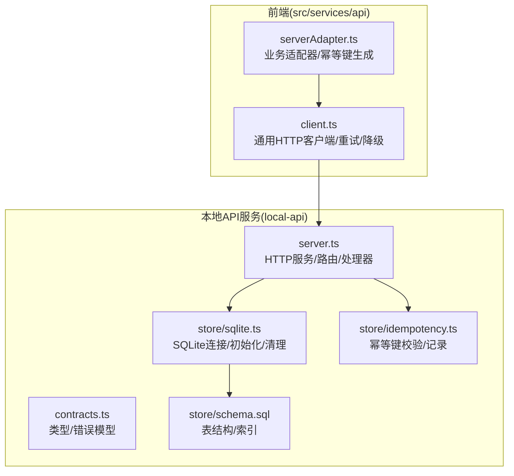
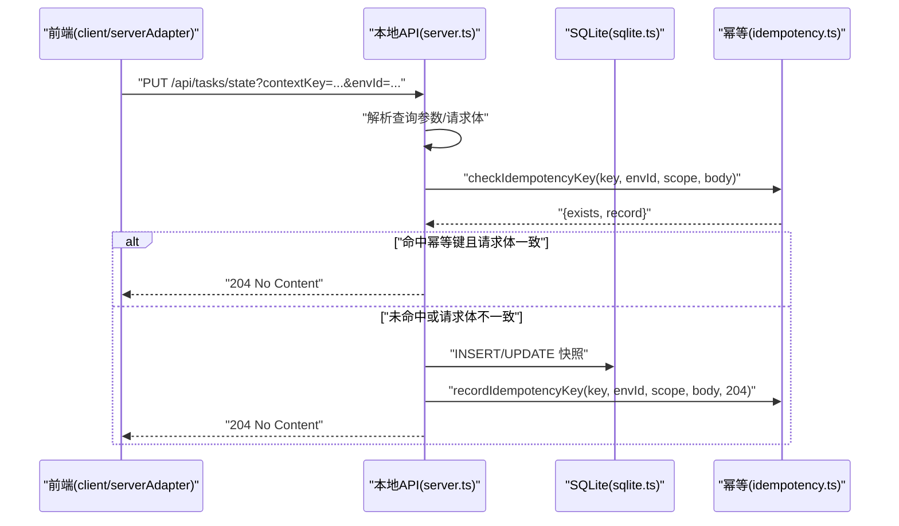
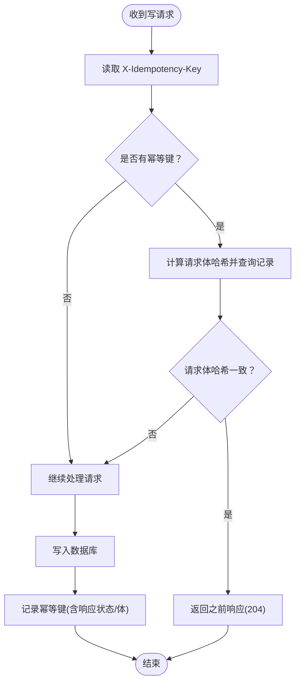
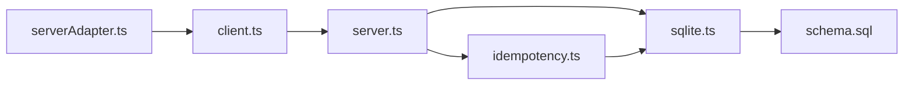

# 本地API服务

<cite>
**本文引用的文件列表**
- [server.ts](file://local-api/server.ts)
- [sqlite.ts](file://local-api/store/sqlite.ts)
- [idempotency.ts](file://local-api/store/idempotency.ts)
- [schema.sql](file://local-api/store/schema.sql)
- [contracts.ts](file://local-api/contracts.ts)
- [test-api.sh](file://local-api/test-api.sh)
- [package.json](file://package.json)
- [serverAdapter.ts](file://src/services/api/serverAdapter.ts)
- [client.ts](file://src/services/api/client.ts)
</cite>

## 目录

1. [简介](#简介)
2. [项目结构](#项目结构)
3. [核心组件](#核心组件)
4. [架构总览](#架构总览)
5. [详细组件分析](#详细组件分析)
6. [依赖关系分析](#依赖关系分析)
7. [性能考量](#性能考量)
8. [故障排查指南](#故障排查指南)
9. [结论](#结论)
10. [附录：API参考与部署运维](#附录api参考与部署运维)

## 简介

本文件面向后端开发者，系统化梳理 CodeBuddy 本地API服务的设计与实现，涵盖：

- HTTP服务架构与路由、中间件（CORS预检）设计
- SQLite数据库集成与表结构、索引、查询优化
- 幂等性实现机制（重复请求检测、X-Idempotency-Key处理、状态一致性）
- 审计日志系统（记录格式、存储策略、查询接口）
- RESTful API设计（端点、请求/响应格式、错误处理）
- 完整API参考与使用示例
- 部署与维护指南

## 项目结构

本地API服务位于 local-api 目录，采用“按功能域划分”的组织方式：

- server.ts：HTTP服务入口、路由分发、接口处理器
- store/sqlite.ts：SQLite连接初始化、生命周期管理、清理过期幂等键
- store/idempotency.ts：幂等键生成、校验、记录与重放
- store/schema.sql：数据库Schema与索引定义
- contracts.ts：统一契约与错误响应模型
- test-api.sh：端到端测试脚本（含幂等性验证）

前端通过 src/services/api 下的 client.ts 与 serverAdapter.ts 与本地API交互，支持自动重试、幂等键注入、降级回退等能力。

图表来源

- [server.ts:1-414](file://local-api/server.ts#L1-L414)
- [sqlite.ts:1-99](file://local-api/store/sqlite.ts#L1-L99)
- [idempotency.ts:1-100](file://local-api/store/idempotency.ts#L1-L100)
- [contracts.ts:1-89](file://local-api/contracts.ts#L1-L89)
- [schema.sql:1-72](file://local-api/store/schema.sql#L1-L72)
- [client.ts:1-172](file://src/services/api/client.ts#L1-L172)
- [serverAdapter.ts:1-87](file://src/services/api/serverAdapter.ts#L1-L87)

章节来源

- [server.ts:1-414](file://local-api/server.ts#L1-L414)
- [sqlite.ts:1-99](file://local-api/store/sqlite.ts#L1-L99)
- [idempotency.ts:1-100](file://local-api/store/idempotency.ts#L1-L100)
- [schema.sql:1-72](file://local-api/store/schema.sql#L1-L72)
- [contracts.ts:1-89](file://local-api/contracts.ts#L1-L89)
- [client.ts:1-172](file://src/services/api/client.ts#L1-L172)
- [serverAdapter.ts:1-87](file://src/services/api/serverAdapter.ts#L1-L87)

## 核心组件

- HTTP服务与路由
  - 使用原生 http.createServer 提供服务，默认端口可通过环境变量 LOCAL_API_PORT 指定；默认基础路径为 /api。
  - 路由分发支持 OPTIONS 预检、/health 健康检查、以及五条核心API端点。
- 数据库层
  - better-sqlite3 连接，启用 WAL 模式以提升并发写入性能；首次启动时自动执行 schema.sql 初始化表结构。
  - 提供数据库连接获取、关闭、清理过期幂等键、重置数据库等工具方法。
- 幂等性模块
  - 通过 X-Idempotency-Key 识别重复请求；对请求体进行哈希比对，确保语义一致；记录幂等键有效期（默认7天），并支持幂等重放返回之前响应。
- 契约与错误模型
  - 统一的错误响应结构，包含 message、code、status、timestamp；各业务快照类型与审计日志输入/记录类型均在 contracts.ts 中定义。
- 前端适配器
  - serverAdapter.ts 负责拼接 envId、生成幂等键、封装各端点调用；client.ts 提供通用 fetch 封装、重试、降级回退逻辑。

章节来源

- [server.ts:18-66](file://local-api/server.ts#L18-L66)
- [sqlite.ts:18-63](file://local-api/store/sqlite.ts#L18-L63)
- [idempotency.ts:10-86](file://local-api/store/idempotency.ts#L10-L86)
- [contracts.ts:72-89](file://local-api/contracts.ts#L72-L89)
- [serverAdapter.ts:34-86](file://src/services/api/serverAdapter.ts#L34-L86)
- [client.ts:83-171](file://src/services/api/client.ts#L83-L171)

## 架构总览

本地API服务采用单进程HTTP服务器 + SQLite 的轻量方案，核心流程如下：

- 启动时初始化数据库并执行Schema；定时清理过期幂等键。
- 路由根据路径匹配到具体处理器；处理器解析查询参数与请求体，执行幂等检查，再进行数据库读写。
- 响应统一设置CORS头，JSON序列化或204 No Content；错误通过统一错误模型返回。

图表来源

- [server.ts:131-197](file://local-api/server.ts#L131-L197)
- [idempotency.ts:23-58](file://local-api/store/idempotency.ts#L23-L58)
- [sqlite.ts:18-42](file://local-api/store/sqlite.ts#L18-L42)

## 详细组件分析

### HTTP服务与路由

- 端口与前缀
  - 端口：LOCAL_API_PORT（默认3100）；基础路径：/api。
- 路由分发
  - OPTIONS 预检：允许跨域方法与头部（含 X-Idempotency-Key）。
  - /health：返回服务健康状态。
  - /api/projects/state：GET/PUT 项目状态快照。
  - /api/tasks/state：GET/PUT 任务状态快照（带 contextKey）。
  - /api/acceptance/state：GET/PUT 验收状态快照（带 projectCode）。
  - /api/settlement/state：GET 结算状态快照。
  - /api/audit/logs：POST 审计日志。
- 响应与错误
  - JSON 响应统一设置 Access-Control-Allow-\* 头；204 No Content 用于幂等写入成功。
  - 错误通过 createErrorResponse 统一返回，包含 message、code、status、timestamp。

章节来源

- [server.ts:18-66](file://local-api/server.ts#L18-L66)
- [server.ts:338-386](file://local-api/server.ts#L338-L386)
- [server.ts:332-334](file://local-api/server.ts#L332-L334)
- [server.ts:70-129](file://local-api/server.ts#L70-L129)
- [server.ts:131-197](file://local-api/server.ts#L131-L197)
- [server.ts:199-259](file://local-api/server.ts#L199-L259)
- [server.ts:261-280](file://local-api/server.ts#L261-L280)
- [server.ts:282-329](file://local-api/server.ts#L282-L329)
- [contracts.ts:72-89](file://local-api/contracts.ts#L72-L89)

### SQLite数据库集成

- 连接与初始化
  - 单例连接，首次访问时创建目录、建立连接、启用 WAL、执行 schema.sql。
  - 提供 getDatabase、closeDatabase、cleanupExpiredIdempotencyKeys、resetDatabase 等工具。
- 表结构与索引
  - project_state、task_state、acceptance_state、settlement_state：主键自增，唯一约束覆盖 env_id 或复合唯一键。
  - audit_logs：包含场景、详情、项目编码、时间戳、创建时间；为 env_id、project_code、scene 建立索引。
  - idempotency_keys：幂等键主键、作用域、环境、请求体哈希、响应状态与体、创建/过期时间；为 env_id、scope、expired_at 建立索引。
- 查询优化
  - 使用 ON CONFLICT 子句进行 UPSERT，避免重复插入。
  - 幂等键查询基于 key+env_id 联合条件，结合请求体哈希校验，减少重复写入。
  - 审计日志查询通过多字段索引支持常见过滤（env_id、projectCode、scene）。

章节来源

- [sqlite.ts:18-63](file://local-api/store/sqlite.ts#L18-L63)
- [schema.sql:4-72](file://local-api/store/schema.sql#L4-L72)

### 幂等性实现机制

- 幂等键生成
  - 前端 serverAdapter.createIdempotencyKey 生成形如 scope-target-时间戳-随机串 的键，便于区分作用域与目标。
- 幂等检查
  - 服务端处理器在 PUT/POST 时读取 X-Idempotency-Key，计算请求体哈希，查询 idempotency_keys。
  - 若命中且请求体哈希一致，则直接返回 204（幂等重放）。
- 幂等记录
  - 成功写入后记录幂等键及其响应状态与体，设置过期时间（默认7天）。
- 过期清理
  - 启动时与定期清理过期幂等键，释放空间并保持表整洁。

图表来源

- [idempotency.ts:23-58](file://local-api/store/idempotency.ts#L23-L58)
- [idempotency.ts:63-86](file://local-api/store/idempotency.ts#L63-L86)
- [server.ts:87-125](file://local-api/server.ts#L87-L125)
- [server.ts:149-193](file://local-api/server.ts#L149-L193)
- [server.ts:217-255](file://local-api/server.ts#L217-L255)
- [server.ts:289-325](file://local-api/server.ts#L289-L325)

章节来源

- [idempotency.ts:10-86](file://local-api/store/idempotency.ts#L10-L86)
- [server.ts:87-125](file://local-api/server.ts#L87-L125)
- [server.ts:149-193](file://local-api/server.ts#L149-L193)
- [server.ts:217-255](file://local-api/server.ts#L217-L255)
- [server.ts:289-325](file://local-api/server.ts#L289-L325)

### 审计日志系统

- 记录格式
  - 输入：scene（场景）、detail（详情）、projectCode（可选）、at（ISO 8601 时间）。
  - 存储：env_id、scene、detail、project_code、at、created_at。
- 存储策略
  - 写入时记录 created_at；幂等键用于防止重复写入。
- 查询接口
  - 当前仅提供写入接口；查询能力需在前端或上层服务扩展（例如基于 env_id、projectCode、scene 的筛选）。

章节来源

- [contracts.ts:46-58](file://local-api/contracts.ts#L46-L58)
- [server.ts:282-329](file://local-api/server.ts#L282-L329)
- [schema.sql:42-56](file://local-api/store/schema.sql#L42-L56)

### RESTful API设计与错误处理

- 端点与方法
  - /api/projects/state：GET（读取）、PUT（写入）
  - /api/tasks/state：GET（读取）、PUT（写入，带 contextKey）
  - /api/acceptance/state：GET（读取）、PUT（写入，带 projectCode）
  - /api/settlement/state：GET（读取）
  - /api/audit/logs：POST（写入）
- 请求/响应格式
  - JSON；204 用于幂等写入成功；GET 默认返回空快照对象（如无数据）。
- 错误处理
  - 统一错误模型：message、code、status、timestamp；常见错误码包括 INVALID_REQUEST、METHOD_NOT_ALLOWED、NOT_FOUND 等。

章节来源

- [server.ts:70-129](file://local-api/server.ts#L70-L129)
- [server.ts:131-197](file://local-api/server.ts#L131-L197)
- [server.ts:199-259](file://local-api/server.ts#L199-L259)
- [server.ts:261-280](file://local-api/server.ts#L261-L280)
- [server.ts:282-329](file://local-api/server.ts#L282-L329)
- [contracts.ts:72-89](file://local-api/contracts.ts#L72-L89)

## 依赖关系分析

- 组件耦合
  - server.ts 依赖 sqlite.ts（连接管理）、idempotency.ts（幂等）、contracts.ts（类型/错误）。
  - idempotency.ts 依赖 sqlite.ts（数据库）、contracts.ts（记录类型）。
  - 前端 client.ts 与 serverAdapter.ts 通过 X-Idempotency-Key 与本地API协作。
- 外部依赖
  - better-sqlite3：SQLite驱动；tsx：运行TS脚本；concurrently：并行启动本地API与前端开发服务器。

图表来源

- [serverAdapter.ts:1-87](file://src/services/api/serverAdapter.ts#L1-L87)
- [client.ts:1-172](file://src/services/api/client.ts#L1-L172)
- [server.ts:1-414](file://local-api/server.ts#L1-L414)
- [sqlite.ts:1-99](file://local-api/store/sqlite.ts#L1-L99)
- [idempotency.ts:1-100](file://local-api/store/idempotency.ts#L1-L100)
- [schema.sql:1-72](file://local-api/store/schema.sql#L1-L72)

章节来源

- [package.json:17-46](file://package.json#L17-L46)
- [server.ts:8-16](file://local-api/server.ts#L8-L16)
- [sqlite.ts:5-8](file://local-api/store/sqlite.ts#L5-L8)
- [idempotency.ts:6-8](file://local-api/store/idempotency.ts#L6-L8)

## 性能考量

- 数据库并发
  - 启用 WAL 模式提升写入吞吐；ON CONFLICT UPSERT 减少重复写入。
- 幂等键清理
  - 启动时清理过期幂等键，避免索引膨胀与查询开销增加。
- 索引策略
  - 审计日志与幂等键表的关键字段均建有索引，满足常见查询场景。
- 前端重试与降级
  - client.ts 提供有限重试与网络异常降级回退，提升用户体验与稳定性。

章节来源

- [sqlite.ts:32-33](file://local-api/store/sqlite.ts#L32-L33)
- [sqlite.ts:68-80](file://local-api/store/sqlite.ts#L68-L80)
- [schema.sql:53-71](file://local-api/store/schema.sql#L53-L71)
- [client.ts:32-34](file://src/services/api/client.ts#L32-L34)
- [client.ts:142-155](file://src/services/api/client.ts#L142-L155)

## 故障排查指南

- 常见错误与定位
  - METHOD_NOT_ALLOWED：请求方法不被允许（例如对只读端点使用 PUT/POST）。
  - INVALID_REQUEST：请求体非JSON或格式不符。
  - NOT_FOUND：路径不存在。
  - REMOTE_DISABLED/NETWORK_ERROR/RETRY_EXHAUSTED：前端侧网络或环境配置问题。
- 日志与调试
  - 服务端输出：幂等命中/重放、数据库初始化/关闭、过期键清理。
  - 前端输出：网络错误、重试过程、降级事件触发。
- 快速验证
  - 使用 test-api.sh 脚本一键验证健康检查、各端点读写与幂等重放。

章节来源

- [server.ts:64-66](file://local-api/server.ts#L64-L66)
- [server.ts:126-128](file://local-api/server.ts#L126-L128)
- [server.ts:194-196](file://local-api/server.ts#L194-L196)
- [server.ts:256-258](file://local-api/server.ts#L256-L258)
- [server.ts:277-279](file://local-api/server.ts#L277-L279)
- [client.ts:13-30](file://src/services/api/client.ts#L13-L30)
- [client.ts:103-121](file://src/services/api/client.ts#L103-L121)
- [client.ts:157-171](file://src/services/api/client.ts#L157-L171)
- [test-api.sh:14-156](file://local-api/test-api.sh#L14-L156)

## 结论

本地API服务以简洁的HTTP + SQLite 方案，提供了稳定的项目/任务/验收/结算状态与审计日志能力，并通过幂等性保障在复杂网络环境下的一致性与可靠性。配合前端的重试与降级机制，整体具备良好的可用性与可维护性。后续可在审计日志查询、指标监控、限流与鉴权等方面进一步增强。

## 附录：API参考与部署运维

### 端点一览与使用示例

- 健康检查
  - 方法：GET
  - 路径：/health
  - 示例：curl http://localhost:3100/health
- 项目状态
  - GET /api/projects/state?envId={envId}
  - PUT /api/projects/state?envId={envId}
  - 请求体：ProjectStateSnapshot
  - 响应：200 JSON 或 204（幂等）
- 任务状态
  - GET /api/tasks/state?contextKey={contextKey}&envId={envId}
  - PUT /api/tasks/state?contextKey={contextKey}&envId={envId}
  - 请求体：TaskStateSnapshot
  - 响应：200 JSON 或 204（幂等）
- 验收状态
  - GET /api/acceptance/state?projectCode={projectCode}&envId={envId}
  - PUT /api/acceptance/state?projectCode={projectCode}&envId={envId}
  - 请求体：AcceptanceStateSnapshot
  - 响应：200 JSON 或 204（幂等）
- 结算状态
  - GET /api/settlement/state?envId={envId}
  - 响应：200 JSON
- 审计日志
  - POST /api/audit/logs?envId={envId}
  - 请求体：AuditLogInput
  - 响应：204（幂等）

章节来源

- [server.ts:354-386](file://local-api/server.ts#L354-L386)
- [server.ts:70-129](file://local-api/server.ts#L70-L129)
- [server.ts:131-197](file://local-api/server.ts#L131-L197)
- [server.ts:199-259](file://local-api/server.ts#L199-L259)
- [server.ts:261-280](file://local-api/server.ts#L261-L280)
- [server.ts:282-329](file://local-api/server.ts#L282-L329)

### 幂等性最佳实践

- 生成幂等键
  - 使用 serverAdapter.createIdempotencyKey(scope, target?) 生成唯一键。
- 作用域与目标
  - scope 区分业务域（如 project_state_write、task_state_write 等）；target 可附加具体对象标识。
- TTL与清理
  - 默认7天；服务启动时会清理过期键，避免长期占用空间。

章节来源

- [serverAdapter.ts:38-42](file://src/services/api/serverAdapter.ts#L38-L42)
- [idempotency.ts:10](file://local-api/store/idempotency.ts#L10)
- [sqlite.ts:68-80](file://local-api/store/sqlite.ts#L68-L80)

### 部署与维护

- 启动命令
  - npm run local-api：启动本地API服务（tsx 运行 server.ts）。
  - npm run dev:local：并行启动本地API与前端开发服务器。
- 环境变量
  - LOCAL_API_PORT：服务端口，默认3100。
  - VITE_API_BASE_URL：前端API基础URL，默认 /api。
  - VITE_TCB_ENV_ID：环境标识，用于拼接 envId。
- 数据库位置
  - SQLite 文件位于 local-api/store/local.db；首次启动自动创建目录与表。
- 健康检查
  - /health：用于容器/进程监控。

章节来源

- [package.json:6-16](file://package.json#L6-L16)
- [server.ts:18-19](file://local-api/server.ts#L18-L19)
- [server.ts:390-411](file://local-api/server.ts#L390-L411)
- [sqlite.ts:10-11](file://local-api/store/sqlite.ts#L10-L11)
- [serverAdapter.ts:34](file://src/services/api/serverAdapter.ts#L34)

### 测试与验证

- 使用 test-api.sh 脚本
  - 自动执行健康检查、各端点读写、幂等重放验证。
- 建议的测试步骤
  - 先 GET 验证初始状态为空；
  - 再 PUT 保存快照并验证 GET 返回；
  - 最后幂等 PUT 重复提交，确认返回 204。

章节来源

- [test-api.sh:14-156](file://local-api/test-api.sh#L14-L156)
