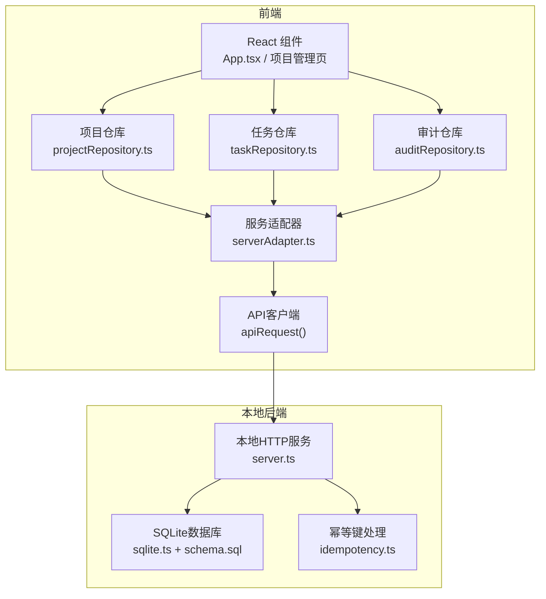
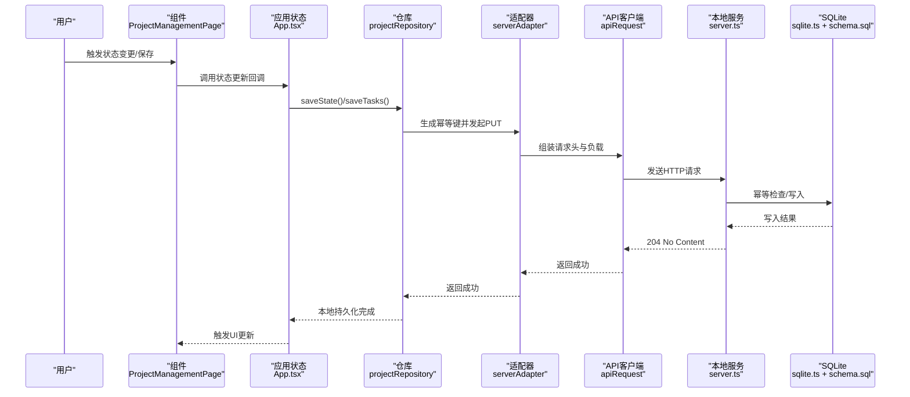
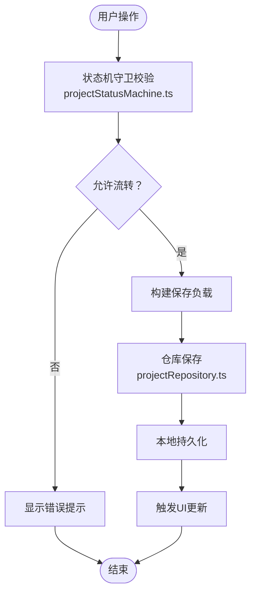
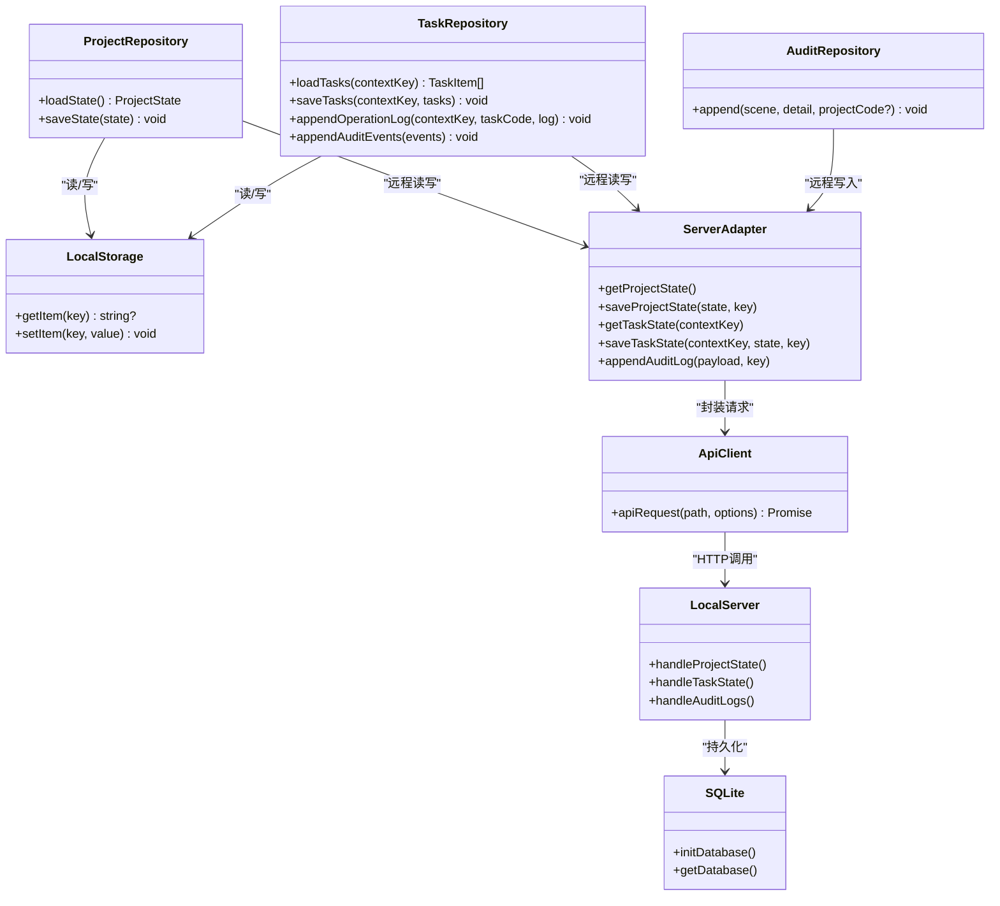
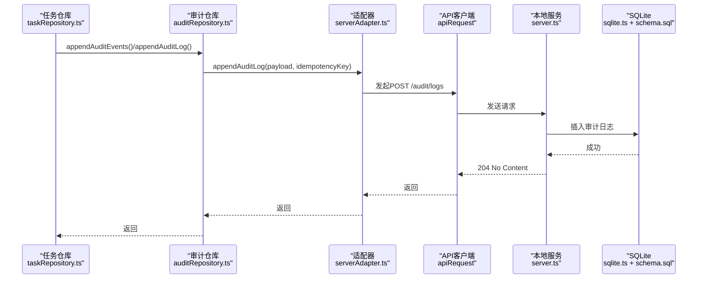
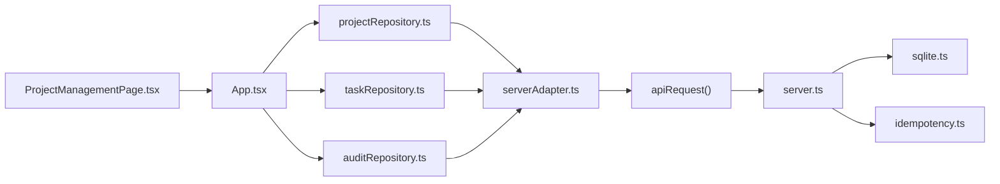

# 数据流架构

<cite>
**本文引用的文件**
- [src/services/api/client.ts](file://src/services/api/client.ts)
- [src/services/api/serverAdapter.ts](file://src/services/api/serverAdapter.ts)
- [local-api/server.ts](file://local-api/server.ts)
- [local-api/store/sqlite.ts](file://local-api/store/sqlite.ts)
- [local-api/store/schema.sql](file://local-api/store/schema.sql)
- [local-api/store/idempotency.ts](file://local-api/store/idempotency.ts)
- [src/services/repositories/projectRepository.ts](file://src/services/repositories/projectRepository.ts)
- [src/services/repositories/taskRepository.ts](file://src/services/repositories/taskRepository.ts)
- [src/services/repositories/auditRepository.ts](file://src/services/repositories/auditRepository.ts)
- [src/services/errors/StructuredError.ts](file://src/services/errors/StructuredError.ts)
- [src/domain/projectStatusMachine.ts](file://src/domain/projectStatusMachine.ts)
- [src/App.tsx](file://src/App.tsx)
- [src/components/project/ProjectManagementPage.tsx](file://src/components/project/ProjectManagementPage.tsx)
- [src/components/personnel/projectManagement.selectors.ts](file://src/components/personnel/projectManagement.selectors.ts)
- [src/data/projects.ts](file://src/data/projects.ts)
</cite>

## 目录

1. [简介](#简介)
2. [项目结构](#项目结构)
3. [核心组件](#核心组件)
4. [架构总览](#架构总览)
5. [详细组件分析](#详细组件分析)
6. [依赖关系分析](#依赖关系分析)
7. [性能考量](#性能考量)
8. [故障排查指南](#故障排查指南)
9. [结论](#结论)
10. [附录](#附录)

## 简介

本文件面向CodeBuddy项目，系统化梳理“数据流架构”。内容涵盖：

- 用户操作到状态机验证、仓储层持久化、本地存储与UI更新的完整流程
- 远程数据到API适配器、状态管理到组件渲染的数据传输过程
- 审计日志系统的数据流向与SQLite数据库查询接口
- 双存储架构（浏览器localStorage + 本地SQLite后端）的协同工作机制与数据一致性保障
- 数据流向图、状态同步机制与持久化策略
- 面向初学者的概念解释与面向高级开发者的性能优化与故障排查建议

## 项目结构

项目采用前端React应用 + 本地HTTP服务（Node.js）的混合架构：

- 前端负责UI渲染、状态管理、仓库层调用与事件上报
- 本地服务提供REST风格接口，对接SQLite数据库，实现幂等写入与审计日志
- 仓库层封装远程与本地数据源，统一对外暴露读写接口

图表来源

- [src/App.tsx:391-420](file://src/App.tsx#L391-L420)
- [src/services/repositories/projectRepository.ts:53-89](file://src/services/repositories/projectRepository.ts#L53-L89)
- [src/services/repositories/taskRepository.ts:141-195](file://src/services/repositories/taskRepository.ts#L141-L195)
- [src/services/repositories/auditRepository.ts:6-25](file://src/services/repositories/auditRepository.ts#L6-L25)
- [src/services/api/serverAdapter.ts:44-86](file://src/services/api/serverAdapter.ts#L44-L86)
- [src/services/api/client.ts:83-171](file://src/services/api/client.ts#L83-L171)
- [local-api/server.ts:70-329](file://local-api/server.ts#L70-L329)
- [local-api/store/sqlite.ts:18-52](file://local-api/store/sqlite.ts#L18-L52)
- [local-api/store/schema.sql:4-72](file://local-api/store/schema.sql#L4-L72)
- [local-api/store/idempotency.ts:23-86](file://local-api/store/idempotency.ts#L23-L86)

章节来源

- [src/App.tsx:391-420](file://src/App.tsx#L391-L420)
- [src/services/repositories/projectRepository.ts:53-89](file://src/services/repositories/projectRepository.ts#L53-L89)
- [src/services/repositories/taskRepository.ts:141-195](file://src/services/repositories/taskRepository.ts#L141-L195)
- [src/services/repositories/auditRepository.ts:6-25](file://src/services/repositories/auditRepository.ts#L6-L25)
- [src/services/api/serverAdapter.ts:44-86](file://src/services/api/serverAdapter.ts#L44-L86)
- [src/services/api/client.ts:83-171](file://src/services/api/client.ts#L83-L171)
- [local-api/server.ts:70-329](file://local-api/server.ts#L70-L329)
- [local-api/store/sqlite.ts:18-52](file://local-api/store/sqlite.ts#L18-L52)
- [local-api/store/schema.sql:4-72](file://local-api/store/schema.sql#L4-L72)
- [local-api/store/idempotency.ts:23-86](file://local-api/store/idempotency.ts#L23-L86)

## 核心组件

- API客户端与错误模型
  - 提供统一的HTTP请求封装、重试、幂等头注入与降级事件派发；定义结构化错误类型与日志格式
- 服务适配器
  - 将前端领域对象映射为后端接口契约，生成幂等键，封装读写操作
- 本地HTTP服务与SQLite
  - 提供项目/任务/验收/结算/审计接口；基于SQLite持久化；实现幂等键去重与重放
- 仓库层
  - 项目仓库：结合localStorage与远程状态，实现读写降级与一致性
  - 任务仓库：维护任务状态、操作日志与审计事件上报
  - 审计仓库：异步追加审计日志，失败不阻塞主流程
- 前端状态与UI
  - App.tsx负责全局状态初始化与持久化；项目管理页负责展示与交互；选择器与数据模型支撑UI计算

章节来源

- [src/services/api/client.ts:83-171](file://src/services/api/client.ts#L83-L171)
- [src/services/api/serverAdapter.ts:44-86](file://src/services/api/serverAdapter.ts#L44-L86)
- [local-api/server.ts:70-329](file://local-api/server.ts#L70-L329)
- [local-api/store/sqlite.ts:18-52](file://local-api/store/sqlite.ts#L18-L52)
- [src/services/repositories/projectRepository.ts:53-89](file://src/services/repositories/projectRepository.ts#L53-L89)
- [src/services/repositories/taskRepository.ts:141-195](file://src/services/repositories/taskRepository.ts#L141-L195)
- [src/services/repositories/auditRepository.ts:6-25](file://src/services/repositories/auditRepository.ts#L6-L25)
- [src/App.tsx:391-420](file://src/App.tsx#L391-L420)

## 架构总览

下图展示从用户操作到状态机验证、仓储层持久化、本地存储与UI更新的完整数据流，以及远程数据到API适配器、状态管理到组件渲染的数据传输过程。

图表来源

- [src/components/project/ProjectManagementPage.tsx:105-122](file://src/components/project/ProjectManagementPage.tsx#L105-L122)
- [src/App.tsx:391-420](file://src/App.tsx#L391-L420)
- [src/services/repositories/projectRepository.ts:76-88](file://src/services/repositories/projectRepository.ts#L76-L88)
- [src/services/api/serverAdapter.ts:44-86](file://src/services/api/serverAdapter.ts#L44-L86)
- [src/services/api/client.ts:83-171](file://src/services/api/client.ts#L83-L171)
- [local-api/server.ts:70-129](file://local-api/server.ts#L70-L129)
- [local-api/store/sqlite.ts:18-52](file://local-api/store/sqlite.ts#L18-L52)

## 详细组件分析

### 项目状态流（含状态机验证）

- 用户在项目管理页发起状态变更请求
- 应用层根据状态机规则进行守卫校验，生成过渡选项与钩子提示
- 通过仓库层保存状态，同时写入审计日志
- 本地持久化完成后触发UI更新

图表来源

- [src/domain/projectStatusMachine.ts:105-163](file://src/domain/projectStatusMachine.ts#L105-L163)
- [src/App.tsx:439-444](file://src/App.tsx#L439-L444)
- [src/services/repositories/projectRepository.ts:76-88](file://src/services/repositories/projectRepository.ts#L76-L88)

章节来源

- [src/domain/projectStatusMachine.ts:105-163](file://src/domain/projectStatusMachine.ts#L105-L163)
- [src/App.tsx:439-444](file://src/App.tsx#L439-L444)
- [src/services/repositories/projectRepository.ts:76-88](file://src/services/repositories/projectRepository.ts#L76-L88)

### 仓库层与双存储架构

- 项目仓库
  - 读：优先远程，失败则回退本地；写：先本地再远程，远程失败记录错误但不阻塞
- 任务仓库
  - 读：优先远程；写：先本地再远程；操作日志本地缓存，异步上报审计
- 审计仓库
  - 异步追加审计日志，失败不阻塞主流程

图表来源

- [src/services/repositories/projectRepository.ts:53-89](file://src/services/repositories/projectRepository.ts#L53-L89)
- [src/services/repositories/taskRepository.ts:141-317](file://src/services/repositories/taskRepository.ts#L141-L317)
- [src/services/repositories/auditRepository.ts:6-25](file://src/services/repositories/auditRepository.ts#L6-L25)
- [src/services/api/serverAdapter.ts:44-86](file://src/services/api/serverAdapter.ts#L44-L86)
- [src/services/api/client.ts:83-171](file://src/services/api/client.ts#L83-L171)
- [local-api/server.ts:70-329](file://local-api/server.ts#L70-L329)
- [local-api/store/sqlite.ts:18-52](file://local-api/store/sqlite.ts#L18-L52)

章节来源

- [src/services/repositories/projectRepository.ts:53-89](file://src/services/repositories/projectRepository.ts#L53-L89)
- [src/services/repositories/taskRepository.ts:141-317](file://src/services/repositories/taskRepository.ts#L141-L317)
- [src/services/repositories/auditRepository.ts:6-25](file://src/services/repositories/auditRepository.ts#L6-L25)
- [src/services/api/serverAdapter.ts:44-86](file://src/services/api/serverAdapter.ts#L44-L86)
- [src/services/api/client.ts:83-171](file://src/services/api/client.ts#L83-L171)
- [local-api/server.ts:70-329](file://local-api/server.ts#L70-L329)
- [local-api/store/sqlite.ts:18-52](file://local-api/store/sqlite.ts#L18-L52)

### 审计日志系统数据流

- 任务仓库在关键操作（如创建整改任务、模板审计事件）时异步上报审计
- 本地服务接收审计请求，进行幂等检查后写入数据库

图表来源

- [src/services/repositories/taskRepository.ts:183-195](file://src/services/repositories/taskRepository.ts#L183-L195)
- [src/services/repositories/auditRepository.ts:6-25](file://src/services/repositories/auditRepository.ts#L6-L25)
- [src/services/api/serverAdapter.ts:76-85](file://src/services/api/serverAdapter.ts#L76-L85)
- [src/services/api/client.ts:83-171](file://src/services/api/client.ts#L83-L171)
- [local-api/server.ts:282-329](file://local-api/server.ts#L282-L329)
- [local-api/store/sqlite.ts:18-52](file://local-api/store/sqlite.ts#L18-L52)

章节来源

- [src/services/repositories/taskRepository.ts:183-195](file://src/services/repositories/taskRepository.ts#L183-L195)
- [src/services/repositories/auditRepository.ts:6-25](file://src/services/repositories/auditRepository.ts#L6-L25)
- [src/services/api/serverAdapter.ts:76-85](file://src/services/api/serverAdapter.ts#L76-L85)
- [src/services/api/client.ts:83-171](file://src/services/api/client.ts#L83-L171)
- [local-api/server.ts:282-329](file://local-api/server.ts#L282-L329)
- [local-api/store/sqlite.ts:18-52](file://local-api/store/sqlite.ts#L18-L52)

### SQLite数据库查询接口

- 本地服务提供以下接口：
  - GET /api/projects/state → 返回项目状态快照
  - PUT /api/projects/state → 保存项目状态快照（幂等）
  - GET /api/tasks/state?contextKey=... → 返回任务状态快照
  - PUT /api/tasks/state?contextKey=... → 保存任务状态快照（幂等）
  - POST /api/audit/logs → 追加审计日志（幂等）
- 幂等键通过请求头X-Idempotency-Key传递，服务端进行一致性校验与重放保护

章节来源

- [local-api/server.ts:70-329](file://local-api/server.ts#L70-L329)
- [local-api/store/schema.sql:4-72](file://local-api/store/schema.sql#L4-L72)
- [local-api/store/idempotency.ts:23-86](file://local-api/store/idempotency.ts#L23-L86)

## 依赖关系分析

- 组件到仓库：项目管理页通过回调驱动仓库保存；App.tsx在初始化与状态变化时触发仓库读写
- 仓库到适配器：仓库层统一封装远程调用，隐藏幂等键生成与错误处理细节
- 适配器到API客户端：统一请求构造、头部注入与重试策略
- 本地服务到数据库：基于SQLite实现原子写入与索引优化
- 幂等模块：独立于业务逻辑，提供请求指纹与重放保护

图表来源

- [src/components/project/ProjectManagementPage.tsx:105-122](file://src/components/project/ProjectManagementPage.tsx#L105-L122)
- [src/App.tsx:391-420](file://src/App.tsx#L391-L420)
- [src/services/repositories/projectRepository.ts:53-89](file://src/services/repositories/projectRepository.ts#L53-L89)
- [src/services/repositories/taskRepository.ts:141-195](file://src/services/repositories/taskRepository.ts#L141-L195)
- [src/services/repositories/auditRepository.ts:6-25](file://src/services/repositories/auditRepository.ts#L6-L25)
- [src/services/api/serverAdapter.ts:44-86](file://src/services/api/serverAdapter.ts#L44-L86)
- [src/services/api/client.ts:83-171](file://src/services/api/client.ts#L83-L171)
- [local-api/server.ts:70-329](file://local-api/server.ts#L70-L329)
- [local-api/store/sqlite.ts:18-52](file://local-api/store/sqlite.ts#L18-L52)
- [local-api/store/idempotency.ts:23-86](file://local-api/store/idempotency.ts#L23-L86)

章节来源

- [src/components/project/ProjectManagementPage.tsx:105-122](file://src/components/project/ProjectManagementPage.tsx#L105-L122)
- [src/App.tsx:391-420](file://src/App.tsx#L391-L420)
- [src/services/repositories/projectRepository.ts:53-89](file://src/services/repositories/projectRepository.ts#L53-L89)
- [src/services/repositories/taskRepository.ts:141-195](file://src/services/repositories/taskRepository.ts#L141-L195)
- [src/services/repositories/auditRepository.ts:6-25](file://src/services/repositories/auditRepository.ts#L6-L25)
- [src/services/api/serverAdapter.ts:44-86](file://src/services/api/serverAdapter.ts#L44-L86)
- [src/services/api/client.ts:83-171](file://src/services/api/client.ts#L83-L171)
- [local-api/server.ts:70-329](file://local-api/server.ts#L70-L329)
- [local-api/store/sqlite.ts:18-52](file://local-api/store/sqlite.ts#L18-L52)
- [local-api/store/idempotency.ts:23-86](file://local-api/store/idempotency.ts#L23-L86)

## 性能考量

- 并发与一致性
  - 本地服务启用SQLite WAL模式，提升并发读写性能
  - 幂等键通过SHA-256指纹与过期时间控制，避免重复写入与重放开销
- 网络重试与降级
  - API客户端对特定状态码进行指数回退重试，失败时派发降级事件，前端可切换本地模式
- 存储策略
  - 项目/任务状态采用localStorage作为快速回退，远程作为最终一致性来源
  - 审计日志异步上报，避免阻塞主流程
- 查询优化
  - SQLite为审计日志建立索引，加速按场景/项目/环境维度检索

章节来源

- [local-api/store/sqlite.ts:32-41](file://local-api/store/sqlite.ts#L32-L41)
- [local-api/store/idempotency.ts:10-18](file://local-api/store/idempotency.ts#L10-L18)
- [src/services/api/client.ts:32-34](file://src/services/api/client.ts#L32-L34)
- [src/services/api/client.ts:142-155](file://src/services/api/client.ts#L142-L155)
- [local-api/store/schema.sql:53-55](file://local-api/store/schema.sql#L53-L55)

## 故障排查指南

- 常见错误类型
  - 网络错误：API客户端捕获网络异常并抛出结构化错误，前端可监听降级事件
  - 幂等冲突：服务端检测到重复请求，返回重放结果；仓库层记录结构化错误
  - 业务错误：状态机守卫校验失败或远程接口返回错误，统一记录并输出日志
- 排查步骤
  - 检查本地服务健康状态与日志输出
  - 核对请求头X-Idempotency-Key是否正确传递
  - 查看SQLite数据库中幂等键与审计日志表是否正常
  - 在前端控制台查看StructuredError日志与降级事件
- 相关实现参考
  - API客户端错误模型与重试策略
  - 本地服务幂等键检查与响应构建
  - 仓库层错误捕获与日志记录

章节来源

- [src/services/errors/StructuredError.ts:27-127](file://src/services/errors/StructuredError.ts#L27-L127)
- [src/services/api/client.ts:13-30](file://src/services/api/client.ts#L13-L30)
- [src/services/api/client.ts:142-171](file://src/services/api/client.ts#L142-L171)
- [local-api/store/idempotency.ts:23-86](file://local-api/store/idempotency.ts#L23-L86)
- [local-api/server.ts:282-329](file://local-api/server.ts#L282-L329)

## 结论

本架构通过“前端仓库层 + 本地HTTP服务 + SQLite”的组合，在保证用户体验的同时实现了数据一致性与可观测性：

- 双存储策略确保在网络异常时仍可继续工作
- 幂等键机制有效防止重复写入与重放问题
- 审计日志异步上报，兼顾性能与合规
- 状态机守卫与结构化错误模型提升了系统的可维护性与可诊断性

## 附录

- 初始数据与UI选择器
  - 初始项目数据与UI选择器函数支撑前端渲染与交互
- 环境变量与基础路径
  - 前端通过VITE环境变量配置后端基础URL，本地服务通过环境变量决定环境ID

章节来源

- [src/data/projects.ts:333-344](file://src/data/projects.ts#L333-L344)
- [src/components/personnel/projectManagement.selectors.ts:17-24](file://src/components/personnel/projectManagement.selectors.ts#L17-L24)
- [src/services/api/serverAdapter.ts:34](file://src/services/api/serverAdapter.ts#L34)
- [src/services/api/client.ts:50](file://src/services/api/client.ts#L50)
