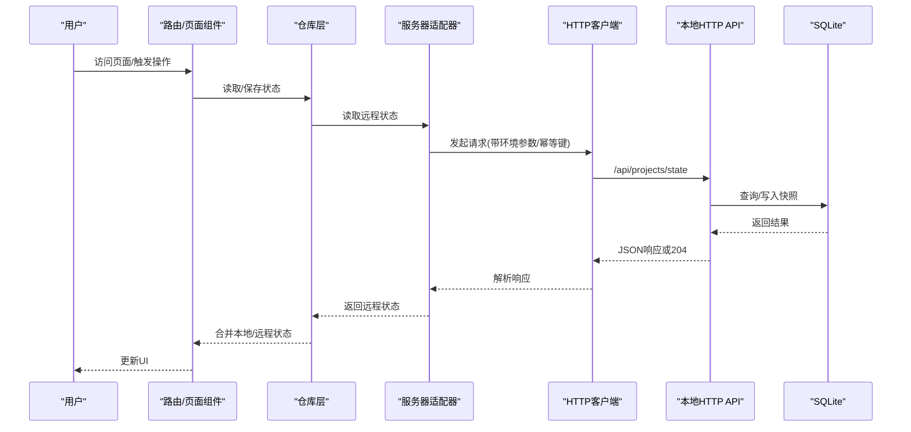
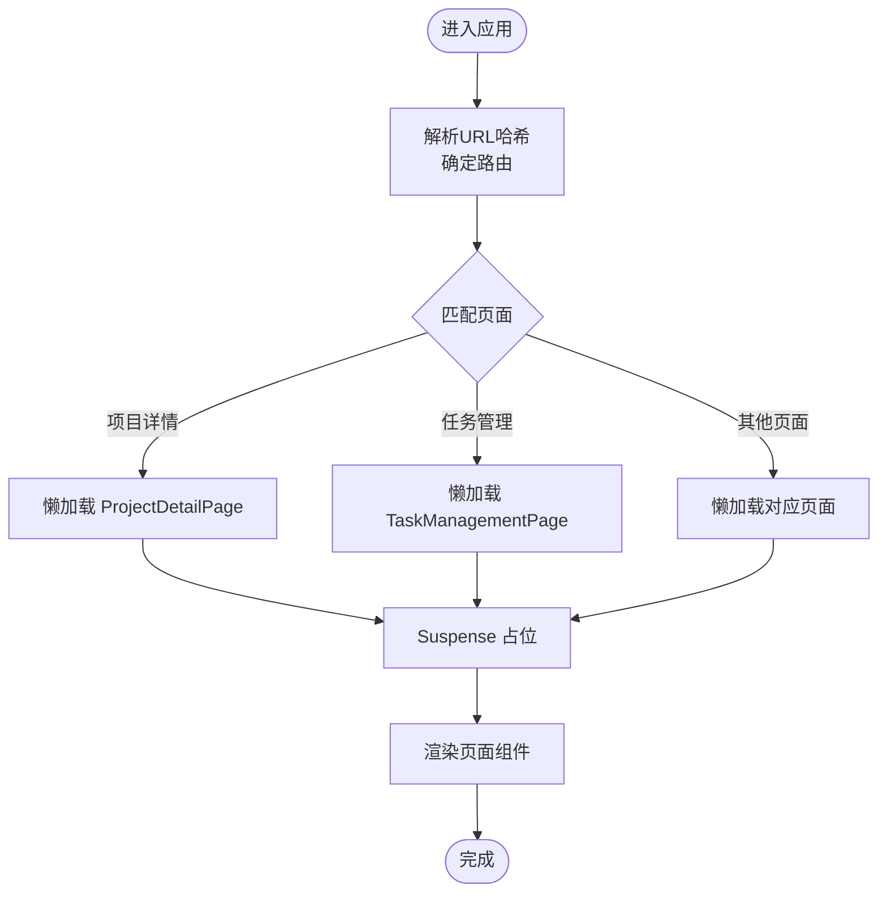
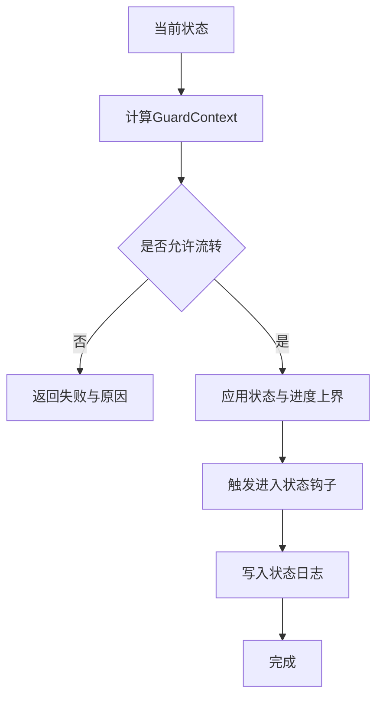
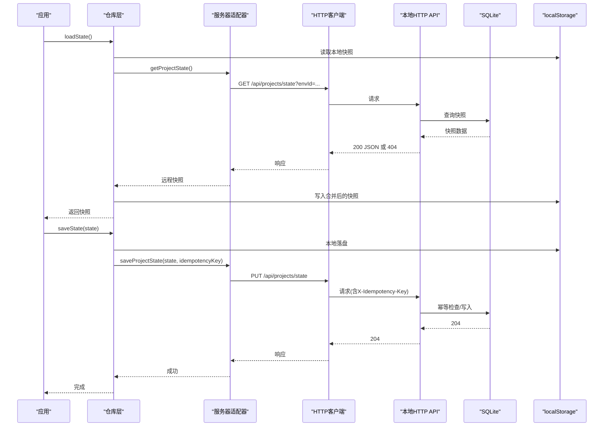
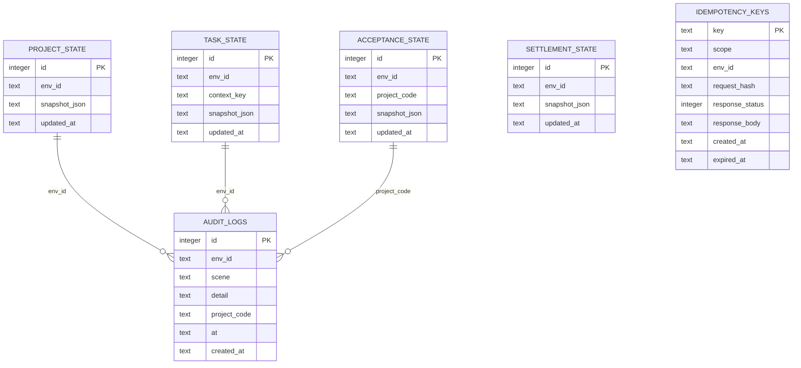
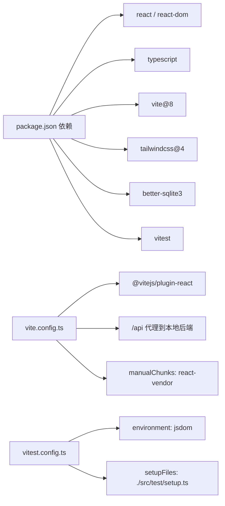

# 整体架构设计

<cite>
**本文引用的文件**
- [package.json](file://package.json)
- [vite.config.ts](file://vite.config.ts)
- [tailwind.config.js](file://tailwind.config.js)
- [src/main.tsx](file://src/main.tsx)
- [src/App.tsx](file://src/App.tsx)
- [src/services/repositories/projectRepository.ts](file://src/services/repositories/projectRepository.ts)
- [src/services/api/client.ts](file://src/services/api/client.ts)
- [src/services/api/serverAdapter.ts](file://src/services/api/serverAdapter.ts)
- [src/domain/projectStatusMachine.ts](file://src/domain/projectStatusMachine.ts)
- [src/components/project/ProjectDetailPage.tsx](file://src/components/project/ProjectDetailPage.tsx)
- [src/components/layout/Header.tsx](file://src/components/layout/Header.tsx)
- [local-api/server.ts](file://local-api/server.ts)
- [local-api/store/sqlite.ts](file://local-api/store/sqlite.ts)
- [local-api/store/schema.sql](file://local-api/store/schema.sql)
- [local-api/store/idempotency.ts](file://local-api/store/idempotency.ts)
- [vitest.config.ts](file://vitest.config.ts)
</cite>

## 目录

1. [简介](#简介)
2. [项目结构](#项目结构)
3. [核心组件](#核心组件)
4. [架构总览](#架构总览)
5. [详细组件分析](#详细组件分析)
6. [依赖分析](#依赖分析)
7. [性能考虑](#性能考虑)
8. [故障排查指南](#故障排查指南)
9. [结论](#结论)
10. [附录](#附录)

## 简介

本文件面向CodeBuddy项目的前端架构设计，围绕基于React 19 + TypeScript的单页应用，结合Vite 8、Tailwind CSS 4、Better SQLite3与Vitest测试框架，系统阐述分层架构（UI层、业务层、数据层）、组件化开发与懒加载策略、以及“本地缓存 + 远程同步”的双存储架构设计理念与实现方式。文档同时提供系统边界、组件交互关系与数据流向图，既帮助初学者建立概念性理解，也为高级开发者提供实现细节与最佳实践参考。

## 项目结构

项目采用“功能域 + 分层”的组织方式：

- UI层：组件化开发，页面组件通过React.lazy实现路由级懒加载，减少首屏体积。
- 业务层：领域模型与状态机、仓库层（Repository）封装数据访问与同步策略。
- 数据层：本地持久化（localStorage）与本地HTTP API（Better SQLite3）双通道，支持幂等与降级。

```mermaid
graph TB
subgraph "浏览器端"
UI["UI层<br/>React组件与页面"]
Biz["业务层<br/>领域模型/状态机/仓库"]
Net["网络层<br/>适配器/客户端"]
LocalStore["本地存储<br/>localStorage"]
end
subgraph "本地后端"
API["本地HTTP API<br/>/api/*"]
DB["SQLite数据库<br/>better-sqlite3"]
end
UI --> Biz
Biz --> Net
Net --> API
Biz <- --> LocalStore
API --> DB
```

**图表来源**

- [src/App.tsx:1-800](file://src/App.tsx#L1-L800)
- [src/services/repositories/projectRepository.ts:1-90](file://src/services/repositories/projectRepository.ts#L1-L90)
- [src/services/api/serverAdapter.ts:1-87](file://src/services/api/serverAdapter.ts#L1-L87)
- [local-api/server.ts:1-414](file://local-api/server.ts#L1-L414)
- [local-api/store/sqlite.ts:1-99](file://local-api/store/sqlite.ts#L1-L99)

**章节来源**

- [src/main.tsx:1-11](file://src/main.tsx#L1-L11)
- [src/App.tsx:1-800](file://src/App.tsx#L1-L800)
- [vite.config.ts:1-35](file://vite.config.ts#L1-L35)
- [tailwind.config.js:1-12](file://tailwind.config.js#L1-L12)

## 核心组件

- 应用入口与路由懒加载：应用根节点负责解析URL哈希、按需加载页面组件，并通过Suspense提供加载占位。
- 项目状态机与守卫：定义项目生命周期状态与流转规则，提供可用流转选项与守卫校验。
- 仓库层：封装本地与远程状态的读取与持久化，实现“先本地、后远程”的降级策略。
- 网络层：统一的HTTP客户端与适配器，支持重试、幂等键、环境注入与降级事件派发。
- 本地HTTP API：提供项目/任务/验收/结算/审计等快照接口，基于SQLite存储与幂等机制。

**章节来源**

- [src/App.tsx:1-800](file://src/App.tsx#L1-L800)
- [src/domain/projectStatusMachine.ts:1-164](file://src/domain/projectStatusMachine.ts#L1-L164)
- [src/services/repositories/projectRepository.ts:1-90](file://src/services/repositories/projectRepository.ts#L1-L90)
- [src/services/api/client.ts:1-172](file://src/services/api/client.ts#L1-L172)
- [src/services/api/serverAdapter.ts:1-87](file://src/services/api/serverAdapter.ts#L1-L87)
- [local-api/server.ts:1-414](file://local-api/server.ts#L1-L414)

## 架构总览

系统边界与交互关系如下：

- 浏览器端：React应用通过Vite构建，使用Tailwind进行样式管理；页面组件按需加载；状态机驱动业务逻辑；仓库层协调本地与远程数据。
- 本地后端：提供REST风格的本地HTTP API，统一CORS与幂等处理；SQLite作为持久化存储；健康检查接口便于调试。



**图表来源**

- [src/App.tsx:1-800](file://src/App.tsx#L1-L800)
- [src/services/repositories/projectRepository.ts:1-90](file://src/services/repositories/projectRepository.ts#L1-L90)
- [src/services/api/serverAdapter.ts:1-87](file://src/services/api/serverAdapter.ts#L1-L87)
- [src/services/api/client.ts:1-172](file://src/services/api/client.ts#L1-L172)
- [local-api/server.ts:1-414](file://local-api/server.ts#L1-L414)
- [local-api/store/sqlite.ts:1-99](file://local-api/store/sqlite.ts#L1-L99)

## 详细组件分析

### UI层：组件化与懒加载

- 页面组件通过React.lazy按路由懒加载，配合Suspense提供加载占位，降低首屏资源压力。
- 典型页面如项目详情页、任务管理页等均采用该模式，确保按需加载。
- 布局组件（如Header）以纯展示为主，遵循原子化与语义化命名。



**图表来源**

- [src/App.tsx:1-800](file://src/App.tsx#L1-L800)
- [src/components/layout/Header.tsx:1-37](file://src/components/layout/Header.tsx#L1-L37)

**章节来源**

- [src/App.tsx:1-800](file://src/App.tsx#L1-L800)
- [src/components/layout/Header.tsx:1-37](file://src/components/layout/Header.tsx#L1-L37)

### 业务层：状态机与守卫

- 项目状态机定义了状态集合、允许流转、过渡标签与进入钩子。
- 守卫规则根据上下文（里程碑、任务树、验收反馈等）动态判断是否允许状态变更。
- 项目详情页接收守卫计算结果，渲染可用按钮与禁用提示。



**图表来源**

- [src/domain/projectStatusMachine.ts:1-164](file://src/domain/projectStatusMachine.ts#L1-L164)
- [src/App.tsx:439-504](file://src/App.tsx#L439-L504)

**章节来源**

- [src/domain/projectStatusMachine.ts:1-164](file://src/domain/projectStatusMachine.ts#L1-L164)
- [src/App.tsx:439-504](file://src/App.tsx#L439-L504)

### 数据层：双存储架构（本地缓存 + 远程同步）

- 本地缓存：使用localStorage存储项目列表与状态日志，作为初始态与兜底态。
- 远程同步：通过仓库层先读取远程快照，合并后持久化至本地；写入时同样先本地落盘，再异步写远程。
- 降级策略：当远程不可用时，抛出自定义事件并弹窗提示，保证可用性。
- 幂等机制：服务端与客户端均维护幂等键，避免重复写入与重放不一致。



**图表来源**

- [src/services/repositories/projectRepository.ts:1-90](file://src/services/repositories/projectRepository.ts#L1-L90)
- [src/services/api/serverAdapter.ts:1-87](file://src/services/api/serverAdapter.ts#L1-L87)
- [src/services/api/client.ts:1-172](file://src/services/api/client.ts#L1-L172)
- [local-api/server.ts:1-414](file://local-api/server.ts#L1-L414)
- [local-api/store/sqlite.ts:1-99](file://local-api/store/sqlite.ts#L1-L99)
- [local-api/store/idempotency.ts:1-100](file://local-api/store/idempotency.ts#L1-L100)

**章节来源**

- [src/services/repositories/projectRepository.ts:1-90](file://src/services/repositories/projectRepository.ts#L1-L90)
- [src/services/api/serverAdapter.ts:1-87](file://src/services/api/serverAdapter.ts#L1-L87)
- [src/services/api/client.ts:1-172](file://src/services/api/client.ts#L1-L172)
- [local-api/server.ts:1-414](file://local-api/server.ts#L1-L414)
- [local-api/store/sqlite.ts:1-99](file://local-api/store/sqlite.ts#L1-L99)
- [local-api/store/idempotency.ts:1-100](file://local-api/store/idempotency.ts#L1-L100)

### 本地HTTP API与数据库

- 接口覆盖：项目状态、任务状态、验收状态、结算状态、审计日志。
- 存储：SQLite表结构包含项目/任务/验收/结算建议/审计日志/幂等键等。
- 幂等：服务端对请求体做哈希校验，避免重复写入；客户端生成随机幂等键并透传。
- 健康检查：提供/health接口便于联调与CI检测。



**图表来源**

- [local-api/store/schema.sql:1-72](file://local-api/store/schema.sql#L1-L72)
- [local-api/server.ts:1-414](file://local-api/server.ts#L1-L414)

**章节来源**

- [local-api/server.ts:1-414](file://local-api/server.ts#L1-L414)
- [local-api/store/schema.sql:1-72](file://local-api/store/schema.sql#L1-L72)
- [local-api/store/sqlite.ts:1-99](file://local-api/store/sqlite.ts#L1-L99)
- [local-api/store/idempotency.ts:1-100](file://local-api/store/idempotency.ts#L1-L100)

## 依赖分析

- 技术栈与版本
  - React 19、TypeScript、Vite 8、Tailwind CSS 4、Better SQLite3、Vitest
- 构建与打包
  - Vite配置启用React插件与代理，手动分包策略将React生态独立打包，提升缓存命中率。
- 开发与测试
  - Vitest配置使用jsdom环境、全局测试API与覆盖率报告。



**图表来源**

- [package.json:1-48](file://package.json#L1-L48)
- [vite.config.ts:1-35](file://vite.config.ts#L1-L35)
- [vitest.config.ts:1-20](file://vitest.config.ts#L1-L20)

**章节来源**

- [package.json:1-48](file://package.json#L1-L48)
- [vite.config.ts:1-35](file://vite.config.ts#L1-L35)
- [vitest.config.ts:1-20](file://vitest.config.ts#L1-L20)

## 性能考虑

- 代码分割与懒加载：路由级懒加载与手动分包策略降低首屏体积，提升首屏渲染速度。
- 缓存与降级：本地localStorage作为初始态与兜底态，保障在网络异常时仍可使用。
- 幂等与重试：客户端对可重试状态码进行指数退避重试，服务端幂等键避免重复写入。
- 样式与构建：Tailwind自动扫描内容，按需生成样式，减少CSS体积。

[本节为通用性能建议，无需特定文件引用]

## 故障排查指南

- 网络异常与降级
  - 当远程请求失败或超时时，客户端会派发“远程降级”自定义事件，应用弹窗提示并切换到本地模式。
  - 可通过控制台查看重试日志与降级上下文。
- 环境变量与本地模式
  - 若未配置云端环境参数，请求会被视为本地模式并抛出相应错误，避免误触远程接口。
- 幂等问题
  - 服务端对幂等键进行哈希校验，若请求体不一致会拒绝；客户端需确保幂等键唯一且稳定。
- 本地数据库
  - SQLite WAL模式提升并发；可通过健康检查接口确认服务可用；必要时清理过期幂等键。

**章节来源**

- [src/services/api/client.ts:1-172](file://src/services/api/client.ts#L1-L172)
- [src/services/api/serverAdapter.ts:1-87](file://src/services/api/serverAdapter.ts#L1-L87)
- [local-api/server.ts:1-414](file://local-api/server.ts#L1-L414)
- [local-api/store/sqlite.ts:1-99](file://local-api/store/sqlite.ts#L1-L99)
- [local-api/store/idempotency.ts:1-100](file://local-api/store/idempotency.ts#L1-L100)

## 结论

本架构以React 19 + TypeScript为核心，结合Vite与Tailwind实现现代化前端工程化；通过“本地缓存 + 远程同步”的双存储策略与本地HTTP API，兼顾可用性与一致性；状态机驱动业务规则，仓库层抽象数据访问，网络层统一处理幂等与降级。整体设计在保证开发效率的同时，提供了良好的可维护性与扩展性。

[本节为总结性内容，无需特定文件引用]

## 附录

- 关键实现路径参考
  - 应用入口与懒加载：[src/main.tsx:1-11](file://src/main.tsx#L1-L11)、[src/App.tsx:1-800](file://src/App.tsx#L1-L800)
  - 仓库层与双存储：[src/services/repositories/projectRepository.ts:1-90](file://src/services/repositories/projectRepository.ts#L1-L90)
  - 网络层与适配器：[src/services/api/client.ts:1-172](file://src/services/api/client.ts#L1-L172)、[src/services/api/serverAdapter.ts:1-87](file://src/services/api/serverAdapter.ts#L1-L87)
  - 本地HTTP API与数据库：[local-api/server.ts:1-414](file://local-api/server.ts#L1-L414)、[local-api/store/sqlite.ts:1-99](file://local-api/store/sqlite.ts#L1-L99)、[local-api/store/schema.sql:1-72](file://local-api/store/schema.sql#L1-L72)、[local-api/store/idempotency.ts:1-100](file://local-api/store/idempotency.ts#L1-L100)
  - 构建与测试：[vite.config.ts:1-35](file://vite.config.ts#L1-L35)、[vitest.config.ts:1-20](file://vitest.config.ts#L1-L20)

[本节为补充材料，无需特定文件引用]
