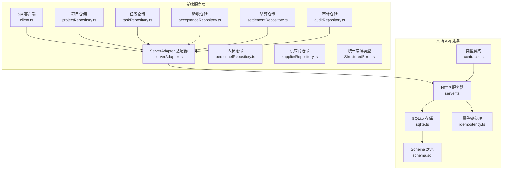
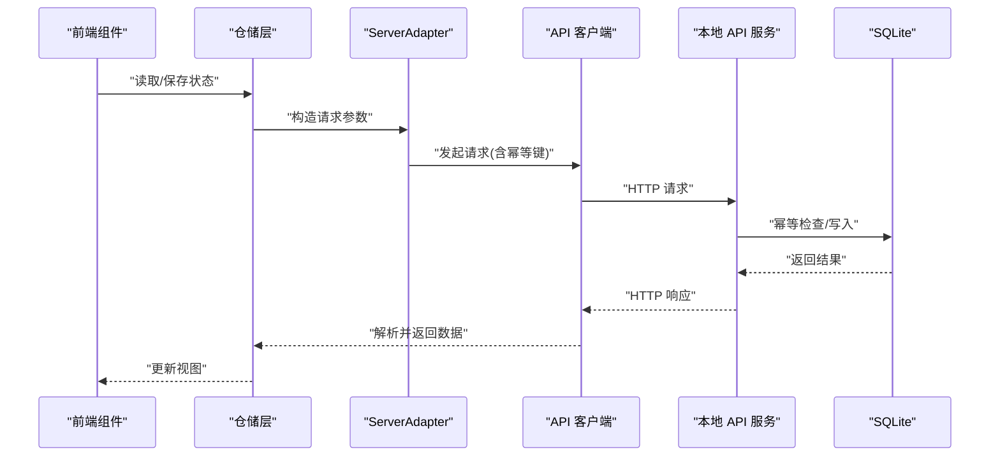
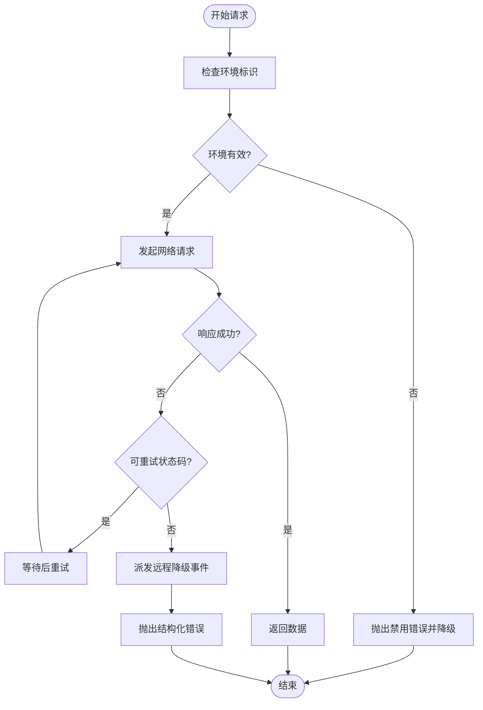
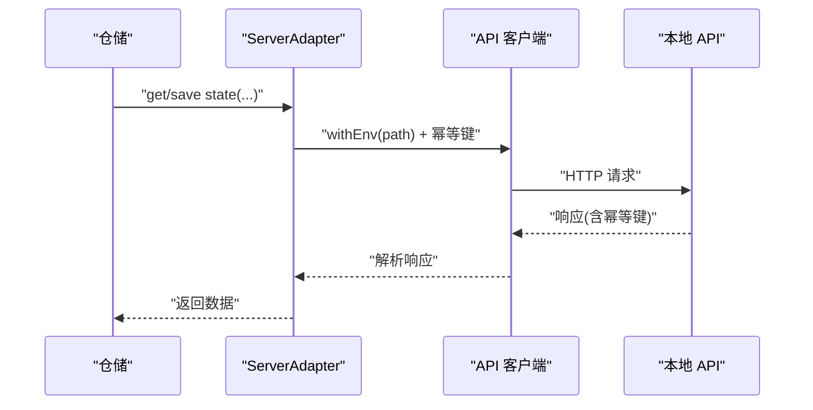
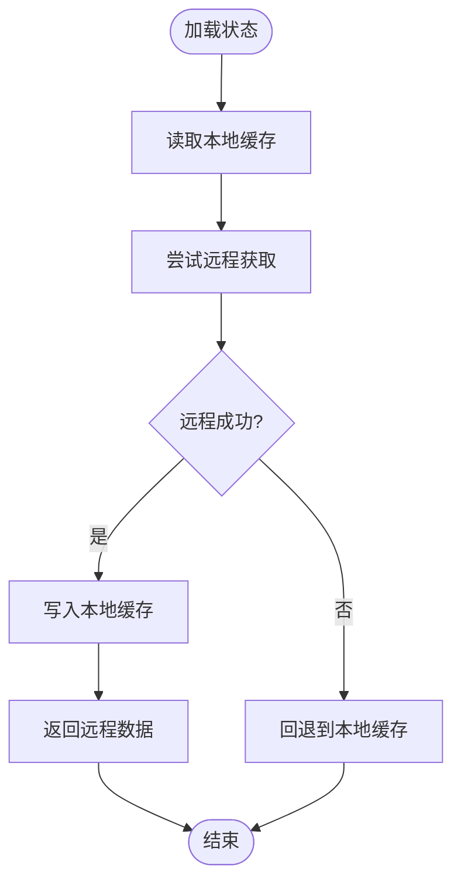
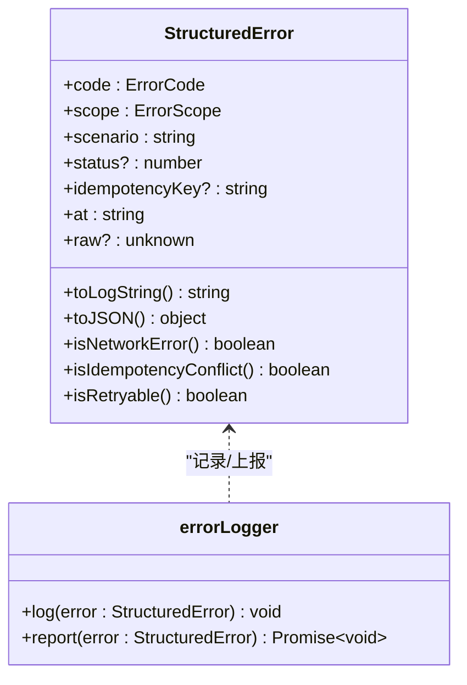
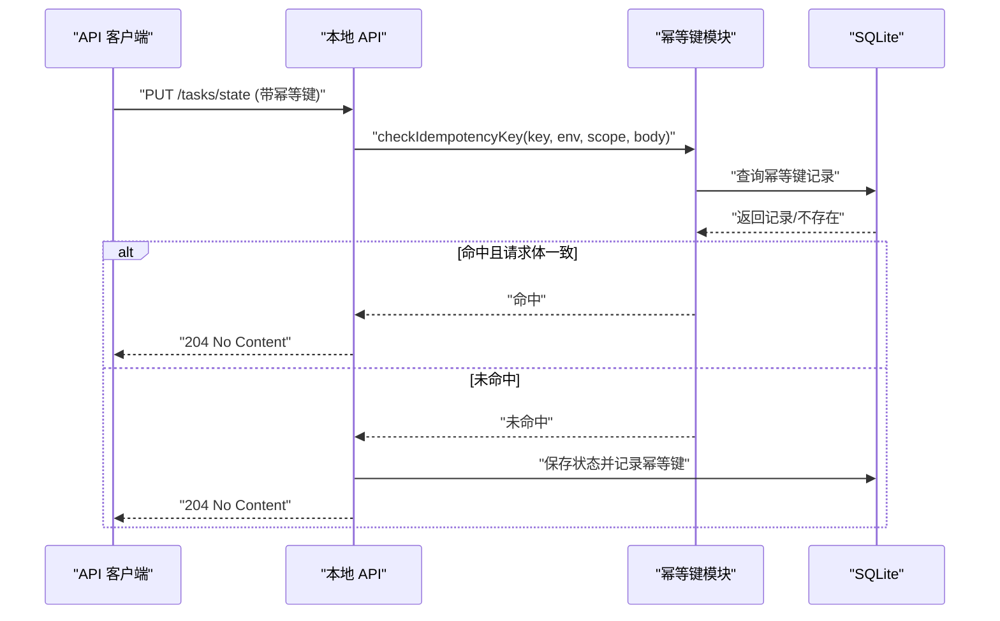
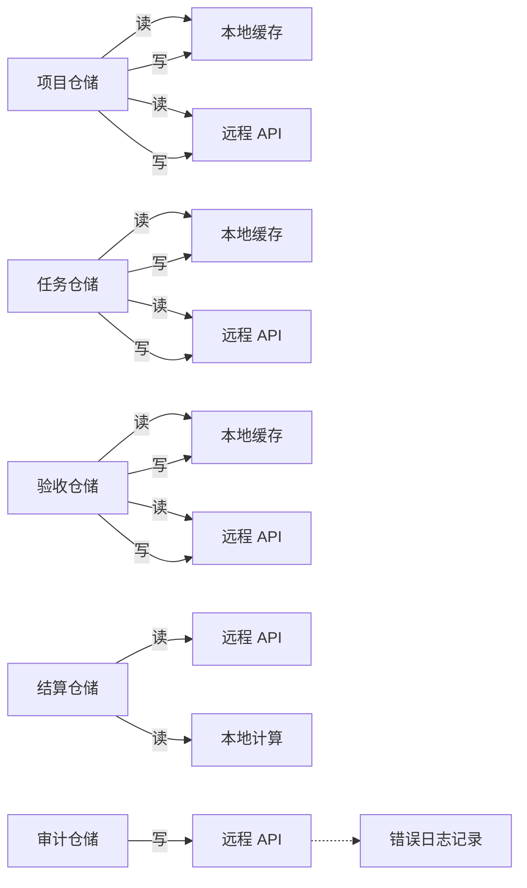
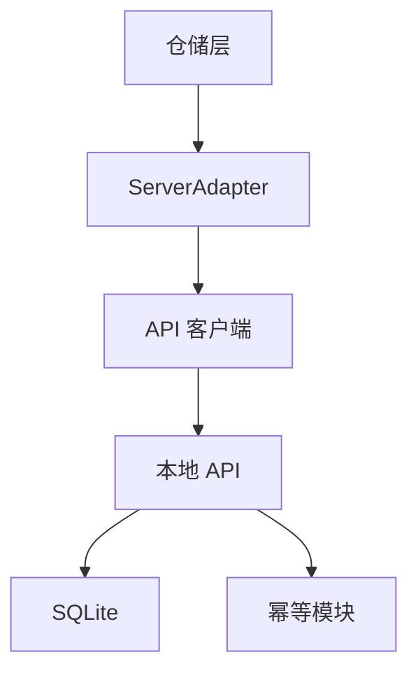

# 服务层架构

<cite>
**本文引用的文件**
- [src/services/api/client.ts](file://src/services/api/client.ts)
- [src/services/api/serverAdapter.ts](file://src/services/api/serverAdapter.ts)
- [src/services/errors/StructuredError.ts](file://src/services/errors/StructuredError.ts)
- [src/services/repositories/projectRepository.ts](file://src/services/repositories/projectRepository.ts)
- [src/services/repositories/taskRepository.ts](file://src/services/repositories/taskRepository.ts)
- [src/services/repositories/acceptanceRepository.ts](file://src/services/repositories/acceptanceRepository.ts)
- [src/services/repositories/settlementRepository.ts](file://src/services/repositories/settlementRepository.ts)
- [src/services/repositories/auditRepository.ts](file://src/services/repositories/auditRepository.ts)
- [src/services/repositories/personnelRepository.ts](file://src/services/repositories/personnelRepository.ts)
- [src/services/repositories/supplierRepository.ts](file://src/services/repositories/supplierRepository.ts)
- [local-api/server.ts](file://local-api/server.ts)
- [local-api/store/idempotency.ts](file://local-api/store/idempotency.ts)
- [local-api/store/sqlite.ts](file://local-api/store/sqlite.ts)
- [local-api/store/schema.sql](file://local-api/store/schema.sql)
- [local-api/contracts.ts](file://local-api/contracts.ts)
</cite>

## 目录

1. [简介](#简介)
2. [项目结构](#项目结构)
3. [核心组件](#核心组件)
4. [架构总览](#架构总览)
5. [详细组件分析](#详细组件分析)
6. [依赖分析](#依赖分析)
7. [性能考虑](#性能考虑)
8. [故障排查指南](#故障排查指南)
9. [结论](#结论)
10. [附录](#附录)

## 简介

本文件系统性梳理 CodeBuddy 服务层架构，重点覆盖以下主题：

- API 客户端设计与重试、降级与幂等机制
- 仓储模式实现与本地状态管理策略
- 错误处理与统一结构化错误模型
- ServerAdapter 的作用与本地 API 通信协议
- 幂等性设计与远程降级机制
- 服务层组件交互关系、数据流向与异常处理流程
- 扩展与定制化实践建议

目标读者分为两类：

- 初学者：理解服务层的概念、职责与常见模式
- 高级开发者：掌握实现细节、性能优化与工程化最佳实践

## 项目结构

服务层主要分布在 src/services 下，按关注点划分为：

- api：对外 API 客户端与适配器
- repositories：各领域仓储实现（项目、任务、验收、结算、审计、人员、供应商）
- errors：统一错误模型与日志记录器

本地 API 服务位于 local-api，提供与前端一致的契约与幂等保障。

图表来源

- [src/services/api/client.ts:1-172](file://src/services/api/client.ts#L1-L172)
- [src/services/api/serverAdapter.ts:1-87](file://src/services/api/serverAdapter.ts#L1-L87)
- [src/services/repositories/projectRepository.ts:1-90](file://src/services/repositories/projectRepository.ts#L1-L90)
- [src/services/repositories/taskRepository.ts:1-318](file://src/services/repositories/taskRepository.ts#L1-L318)
- [src/services/repositories/acceptanceRepository.ts:1-56](file://src/services/repositories/acceptanceRepository.ts#L1-L56)
- [src/services/repositories/settlementRepository.ts:1-32](file://src/services/repositories/settlementRepository.ts#L1-L32)
- [src/services/repositories/auditRepository.ts:1-26](file://src/services/repositories/auditRepository.ts#L1-L26)
- [src/services/repositories/personnelRepository.ts:1-58](file://src/services/repositories/personnelRepository.ts#L1-L58)
- [src/services/repositories/supplierRepository.ts:1-56](file://src/services/repositories/supplierRepository.ts#L1-L56)
- [src/services/errors/StructuredError.ts:1-195](file://src/services/errors/StructuredError.ts#L1-L195)
- [local-api/server.ts:1-414](file://local-api/server.ts#L1-L414)
- [local-api/store/sqlite.ts:1-99](file://local-api/store/sqlite.ts#L1-L99)
- [local-api/store/idempotency.ts:1-100](file://local-api/store/idempotency.ts#L1-L100)
- [local-api/contracts.ts:1-89](file://local-api/contracts.ts#L1-L89)
- [local-api/store/schema.sql:1-72](file://local-api/store/schema.sql#L1-L72)

章节来源

- [src/services/api/client.ts:1-172](file://src/services/api/client.ts#L1-L172)
- [src/services/api/serverAdapter.ts:1-87](file://src/services/api/serverAdapter.ts#L1-L87)
- [src/services/errors/StructuredError.ts:1-195](file://src/services/errors/StructuredError.ts#L1-L195)
- [src/services/repositories/projectRepository.ts:1-90](file://src/services/repositories/projectRepository.ts#L1-L90)
- [src/services/repositories/taskRepository.ts:1-318](file://src/services/repositories/taskRepository.ts#L1-L318)
- [src/services/repositories/acceptanceRepository.ts:1-56](file://src/services/repositories/acceptanceRepository.ts#L1-L56)
- [src/services/repositories/settlementRepository.ts:1-32](file://src/services/repositories/settlementRepository.ts#L1-L32)
- [src/services/repositories/auditRepository.ts:1-26](file://src/services/repositories/auditRepository.ts#L1-L26)
- [src/services/repositories/personnelRepository.ts:1-58](file://src/services/repositories/personnelRepository.ts#L1-L58)
- [src/services/repositories/supplierRepository.ts:1-56](file://src/services/repositories/supplierRepository.ts#L1-L56)
- [local-api/server.ts:1-414](file://local-api/server.ts#L1-L414)
- [local-api/store/sqlite.ts:1-99](file://local-api/store/sqlite.ts#L1-L99)
- [local-api/store/idempotency.ts:1-100](file://local-api/store/idempotency.ts#L1-L100)
- [local-api/contracts.ts:1-89](file://local-api/contracts.ts#L1-L89)
- [local-api/store/schema.sql:1-72](file://local-api/store/schema.sql#L1-L72)

## 核心组件

- API 客户端与重试/降级
  - 提供统一的请求封装、头部构建、重试策略与网络异常降级事件派发
  - 支持幂等键透传与环境参数注入
- ServerAdapter 适配器
  - 将前端业务调用映射为具体 API 路径与参数，并负责环境标识拼接
  - 生成幂等键以保障写操作幂等
- 仓储层
  - 采用“远程优先 + 本地回退”的策略：先拉取远程状态，成功后持久化到本地；远程失败则回退到本地缓存
  - 针对不同领域（项目、任务、验收、结算、审计、人员、供应商）实现各自的状态快照与操作日志
- 统一错误模型
  - 结构化错误类型、作用域、场景、状态码、幂等键、时间戳与原始错误
  - 提供可序列化日志字符串与网络/幂等/可重试判定方法
- 本地 API 服务
  - 提供五类核心接口：项目状态、任务状态、验收状态、结算状态、审计日志
  - 基于 SQLite 存储，支持幂等键去重与重放一致性
  - 提供健康检查与 CORS 支持

章节来源

- [src/services/api/client.ts:1-172](file://src/services/api/client.ts#L1-L172)
- [src/services/api/serverAdapter.ts:1-87](file://src/services/api/serverAdapter.ts#L1-L87)
- [src/services/errors/StructuredError.ts:1-195](file://src/services/errors/StructuredError.ts#L1-L195)
- [src/services/repositories/projectRepository.ts:1-90](file://src/services/repositories/projectRepository.ts#L1-L90)
- [src/services/repositories/taskRepository.ts:1-318](file://src/services/repositories/taskRepository.ts#L1-L318)
- [src/services/repositories/acceptanceRepository.ts:1-56](file://src/services/repositories/acceptanceRepository.ts#L1-L56)
- [src/services/repositories/settlementRepository.ts:1-32](file://src/services/repositories/settlementRepository.ts#L1-L32)
- [src/services/repositories/auditRepository.ts:1-26](file://src/services/repositories/auditRepository.ts#L1-L26)
- [local-api/server.ts:1-414](file://local-api/server.ts#L1-L414)
- [local-api/store/sqlite.ts:1-99](file://local-api/store/sqlite.ts#L1-L99)
- [local-api/store/idempotency.ts:1-100](file://local-api/store/idempotency.ts#L1-L100)
- [local-api/contracts.ts:1-89](file://local-api/contracts.ts#L1-L89)
- [local-api/store/schema.sql:1-72](file://local-api/store/schema.sql#L1-L72)

## 架构总览

服务层整体交互链路如下：

- 前端通过 ServerAdapter 发起请求，自动附加环境标识与幂等键
- API 客户端负责网络请求、重试与异常转换
- 本地 API 服务接收请求，进行幂等检查、数据校验与持久化
- 仓储层负责状态同步与本地回退策略

图表来源

- [src/services/api/serverAdapter.ts:44-86](file://src/services/api/serverAdapter.ts#L44-L86)
- [src/services/api/client.ts:83-171](file://src/services/api/client.ts#L83-L171)
- [local-api/server.ts:338-386](file://local-api/server.ts#L338-L386)
- [local-api/store/sqlite.ts:18-42](file://local-api/store/sqlite.ts#L18-L42)

## 详细组件分析

### API 客户端设计与重试/降级/幂等

- 请求选项与默认值
  - 方法、请求体、幂等键、自定义头、重试次数、作用域、场景
- 幂等键透传
  - 自动添加 X-Idempotency-Key 头部
- 重试策略
  - 默认重试次数、针对特定状态码进行指数退避等待
- 降级机制
  - 环境未配置或网络异常时抛出结构化错误并派发“远程降级”事件
- 错误建模
  - 统一 ApiError 类型，支持日志字符串格式化

图表来源

- [src/services/api/client.ts:83-171](file://src/services/api/client.ts#L83-L171)

章节来源

- [src/services/api/client.ts:1-172](file://src/services/api/client.ts#L1-L172)

### ServerAdapter 的作用与本地 API 通信协议

- 作用
  - 将业务调用映射为具体路径与查询参数，自动附加环境标识
  - 生成幂等键，确保写操作幂等
- 协议要点
  - 基础路径为 /api，环境标识通过 envId 查询参数注入
  - 写操作携带 X-Idempotency-Key 头部
  - GET 返回 204 时返回 undefined，否则解析 JSON
- 支持接口
  - 项目状态读写、任务状态读写、验收状态读写、结算状态读取、审计日志追加

图表来源

- [src/services/api/serverAdapter.ts:34-86](file://src/services/api/serverAdapter.ts#L34-L86)
- [src/services/api/client.ts:83-171](file://src/services/api/client.ts#L83-L171)
- [local-api/server.ts:338-386](file://local-api/server.ts#L338-L386)

章节来源

- [src/services/api/serverAdapter.ts:1-87](file://src/services/api/serverAdapter.ts#L1-L87)
- [local-api/server.ts:1-414](file://local-api/server.ts#L1-L414)
- [local-api/contracts.ts:1-89](file://local-api/contracts.ts#L1-L89)

### 仓储层的数据访问抽象与状态管理策略

- 抽象原则
  - 远程优先：优先从远程获取最新状态，成功后写入本地
  - 本地回退：远程失败时回退到本地缓存，保证可用性
  - 幂等写入：写操作通过幂等键避免重复提交
- 典型流程（以项目仓储为例）
  - 加载：读取本地 -> 远程获取 -> 成功后持久化本地 -> 返回
  - 保存：本地持久化 -> 异步远程写入（失败仅记录日志）

图表来源

- [src/services/repositories/projectRepository.ts:54-74](file://src/services/repositories/projectRepository.ts#L54-L74)

章节来源

- [src/services/repositories/projectRepository.ts:1-90](file://src/services/repositories/projectRepository.ts#L1-L90)
- [src/services/repositories/taskRepository.ts:141-169](file://src/services/repositories/taskRepository.ts#L141-L169)
- [src/services/repositories/acceptanceRepository.ts:32-54](file://src/services/repositories/acceptanceRepository.ts#L32-L54)
- [src/services/repositories/settlementRepository.ts:20-31](file://src/services/repositories/settlementRepository.ts#L20-L31)
- [src/services/repositories/auditRepository.ts:6-25](file://src/services/repositories/auditRepository.ts#L6-L25)
- [src/services/repositories/personnelRepository.ts:1-58](file://src/services/repositories/personnelRepository.ts#L1-L58)
- [src/services/repositories/supplierRepository.ts:1-56](file://src/services/repositories/supplierRepository.ts#L1-L56)

### 错误处理机制

- 统一错误模型
  - 结构化字段：code、scope、scenario、status、idempotencyKey、at、raw
  - 日志格式化与序列化，便于监控与上报
- 错误分类与判定
  - 网络错误、幂等冲突、可重试错误等
- 使用方式
  - 仓储层捕获远程错误并转换为结构化错误，记录日志并回退本地
  - 审计日志写入失败不阻塞主流程，仅记录错误

图表来源

- [src/services/errors/StructuredError.ts:27-127](file://src/services/errors/StructuredError.ts#L27-L127)
- [src/services/errors/StructuredError.ts:179-194](file://src/services/errors/StructuredError.ts#L179-L194)

章节来源

- [src/services/errors/StructuredError.ts:1-195](file://src/services/errors/StructuredError.ts#L1-L195)
- [src/services/repositories/projectRepository.ts:26-37](file://src/services/repositories/projectRepository.ts#L26-L37)
- [src/services/repositories/taskRepository.ts:183-194](file://src/services/repositories/taskRepository.ts#L183-L194)
- [src/services/repositories/acceptanceRepository.ts:49-53](file://src/services/repositories/acceptanceRepository.ts#L49-L53)
- [src/services/repositories/auditRepository.ts:17-24](file://src/services/repositories/auditRepository.ts#L17-L24)

### 幂等性设计与远程降级机制

- 幂等键生成
  - 基于 scope、随机数、时间戳与可选 target 组合
- 本地 API 幂等保障
  - 写请求前检查幂等键与请求体哈希，命中则直接返回 204
  - 记录幂等键及其响应，支持重放一致性
- 远程降级
  - 客户端在环境未配置、网络异常或重试耗尽时触发降级事件
  - 仓储层捕获错误并回退本地缓存

图表来源

- [src/services/api/serverAdapter.ts:38-42](file://src/services/api/serverAdapter.ts#L38-L42)
- [local-api/server.ts:148-196](file://local-api/server.ts#L148-L196)
- [local-api/store/idempotency.ts:23-58](file://local-api/store/idempotency.ts#L23-L58)
- [local-api/store/idempotency.ts:63-86](file://local-api/store/idempotency.ts#L63-L86)

章节来源

- [src/services/api/serverAdapter.ts:38-42](file://src/services/api/serverAdapter.ts#L38-L42)
- [src/services/api/client.ts:54-81](file://src/services/api/client.ts#L54-L81)
- [local-api/server.ts:148-196](file://local-api/server.ts#L148-L196)
- [local-api/store/idempotency.ts:1-100](file://local-api/store/idempotency.ts#L1-L100)

### 服务层组件交互关系与数据流向

- 读取流程
  - 仓储层先读本地，再尝试远程，成功后写回本地
- 写入流程
  - 本地立即持久化，异步远程写入；远程失败不影响本地状态
- 审计流程
  - 事件收集后批量异步上报，失败仅记录错误

图表来源

- [src/services/repositories/projectRepository.ts:54-88](file://src/services/repositories/projectRepository.ts#L54-L88)
- [src/services/repositories/taskRepository.ts:141-317](file://src/services/repositories/taskRepository.ts#L141-L317)
- [src/services/repositories/acceptanceRepository.ts:32-54](file://src/services/repositories/acceptanceRepository.ts#L32-L54)
- [src/services/repositories/settlementRepository.ts:20-31](file://src/services/repositories/settlementRepository.ts#L20-L31)
- [src/services/repositories/auditRepository.ts:6-25](file://src/services/repositories/auditRepository.ts#L6-L25)

章节来源

- [src/services/repositories/projectRepository.ts:1-90](file://src/services/repositories/projectRepository.ts#L1-L90)
- [src/services/repositories/taskRepository.ts:1-318](file://src/services/repositories/taskRepository.ts#L1-L318)
- [src/services/repositories/acceptanceRepository.ts:1-56](file://src/services/repositories/acceptanceRepository.ts#L1-L56)
- [src/services/repositories/settlementRepository.ts:1-32](file://src/services/repositories/settlementRepository.ts#L1-L32)
- [src/services/repositories/auditRepository.ts:1-26](file://src/services/repositories/auditRepository.ts#L1-L26)

## 依赖分析

- 组件耦合
  - 仓储层依赖 ServerAdapter，ServerAdapter 依赖 API 客户端
  - 本地 API 服务依赖 SQLite 与幂等模块
- 外部依赖
  - 浏览器 fetch、better-sqlite3、CORS、环境变量
- 循环依赖
  - 当前结构无循环依赖，职责清晰

图表来源

- [src/services/api/serverAdapter.ts:1-87](file://src/services/api/serverAdapter.ts#L1-L87)
- [src/services/api/client.ts:1-172](file://src/services/api/client.ts#L1-L172)
- [local-api/server.ts:1-414](file://local-api/server.ts#L1-L414)
- [local-api/store/sqlite.ts:1-99](file://local-api/store/sqlite.ts#L1-L99)
- [local-api/store/idempotency.ts:1-100](file://local-api/store/idempotency.ts#L1-L100)

章节来源

- [src/services/api/serverAdapter.ts:1-87](file://src/services/api/serverAdapter.ts#L1-L87)
- [src/services/api/client.ts:1-172](file://src/services/api/client.ts#L1-L172)
- [local-api/server.ts:1-414](file://local-api/server.ts#L1-L414)
- [local-api/store/sqlite.ts:1-99](file://local-api/store/sqlite.ts#L1-L99)
- [local-api/store/idempotency.ts:1-100](file://local-api/store/idempotency.ts#L1-L100)

## 性能考虑

- 并发与一致性
  - SQLite 启用 WAL 模式以提升并发读写性能
  - 幂等键 TTL 为 7 天，定期清理过期记录
- 网络与重试
  - 指数退避等待减少抖动，降低对远端压力
  - 本地回退保证在网络波动时仍可工作
- 本地缓存
  - 读取优先本地，减少远程往返；写入异步远程，避免阻塞 UI
- 可扩展性
  - 新增领域可通过类似模式快速落地：定义契约、实现仓储、注册路由与幂等键

章节来源

- [local-api/store/sqlite.ts:32-42](file://local-api/store/sqlite.ts#L32-L42)
- [local-api/store/sqlite.ts:68-80](file://local-api/store/sqlite.ts#L68-L80)
- [src/services/api/client.ts:35-35](file://src/services/api/client.ts#L35-L35)
- [src/services/api/client.ts:142-155](file://src/services/api/client.ts#L142-L155)

## 故障排查指南

- 常见症状与定位
  - 网络错误：查看客户端日志与重试次数，确认环境变量与基础路径
  - 幂等冲突：检查幂等键是否重复或请求体不一致
  - 远程降级：监听“远程降级”事件，确认降级原因与场景
  - 本地回退：确认本地缓存是否被正确读取与写入
- 日志与上报
  - 使用结构化错误日志字符串与 JSON 化对象，便于检索与上报
  - 审计日志写入失败不会阻塞主流程，但会记录错误

章节来源

- [src/services/api/client.ts:54-81](file://src/services/api/client.ts#L54-L81)
- [src/services/api/client.ts:104-121](file://src/services/api/client.ts#L104-L121)
- [src/services/api/client.ts:142-159](file://src/services/api/client.ts#L142-L159)
- [src/services/errors/StructuredError.ts:57-88](file://src/services/errors/StructuredError.ts#L57-L88)
- [src/services/repositories/auditRepository.ts:17-24](file://src/services/repositories/auditRepository.ts#L17-L24)

## 结论

本服务层架构以“远程优先 + 本地回退”为核心策略，结合幂等键与统一错误模型，实现了高可用、可观测与可扩展的服务层。前端通过 ServerAdapter 与本地 API 服务保持一致的契约，仓储层在复杂业务场景下提供了稳定的读写抽象。建议在新功能开发中遵循现有模式，确保一致性与可维护性。

## 附录

- 服务扩展与自定义建议
  - 新增领域：定义快照类型与仓储接口，实现 load/save/append 等方法
  - 新增接口：在本地 API 中新增路由与处理器，补充幂等逻辑
  - 错误上报：扩展 errorLogger.report，接入统一监控平台
  - 性能优化：根据业务热点增加索引、调整重试策略与批量化写入
