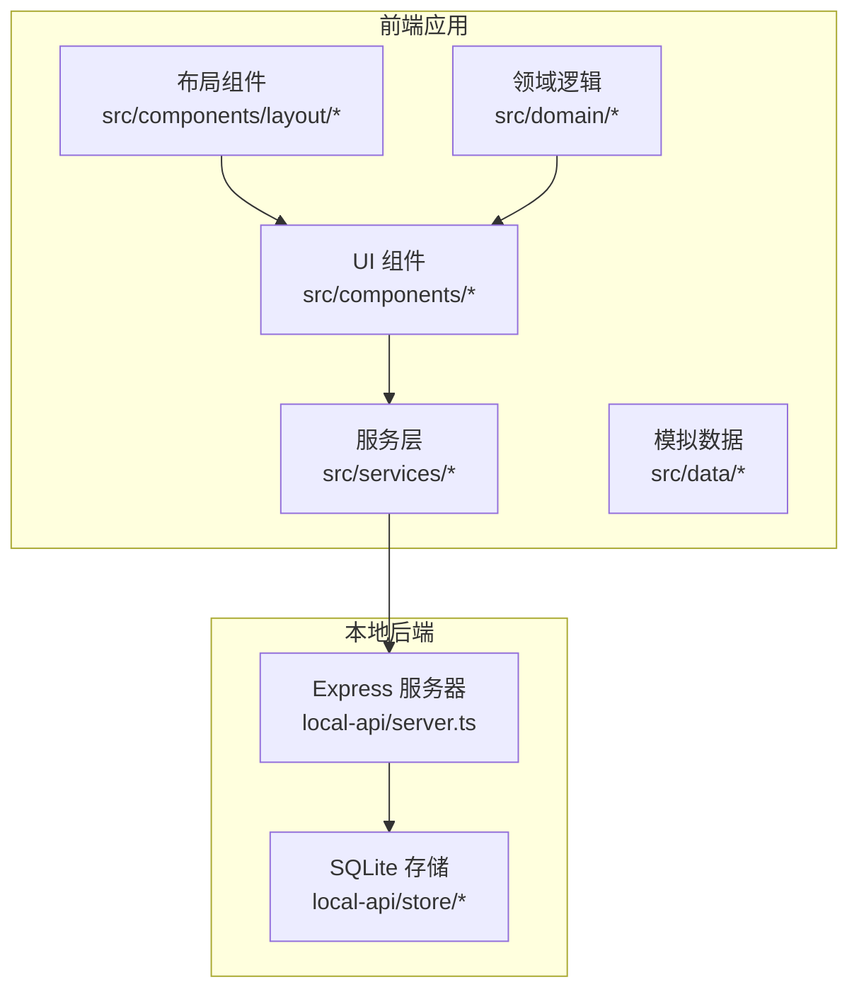
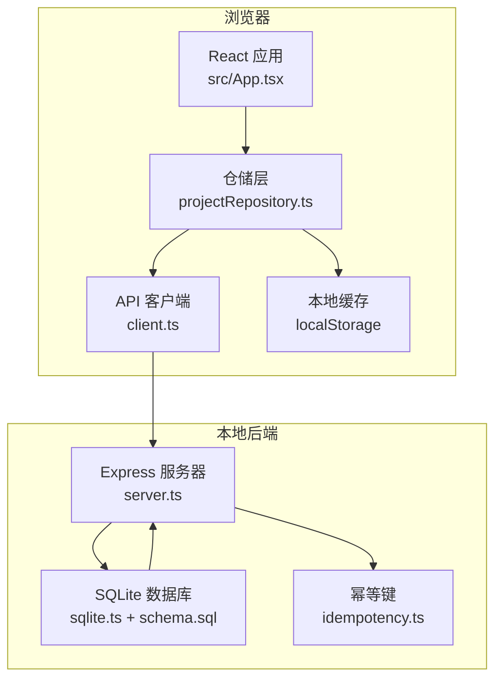
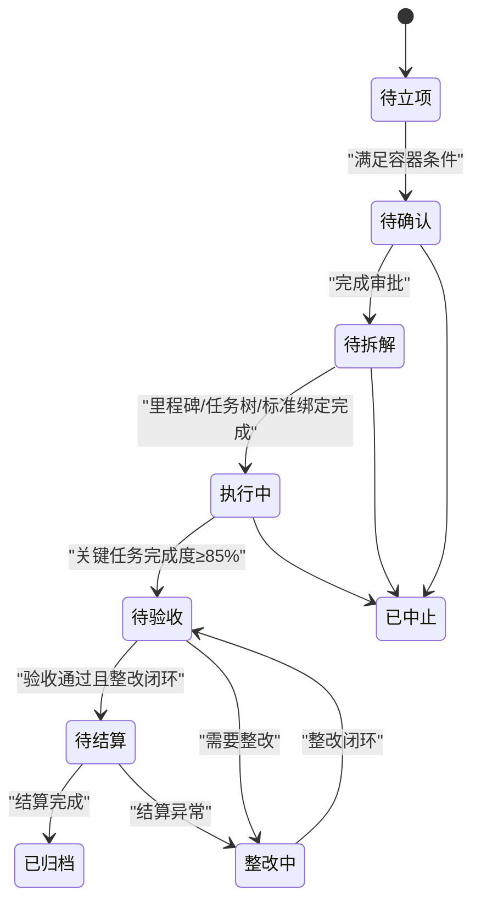
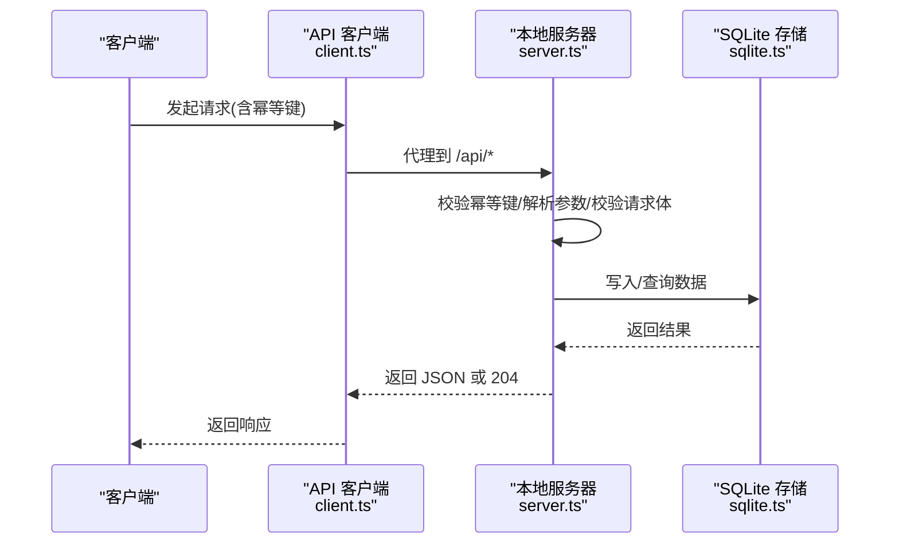
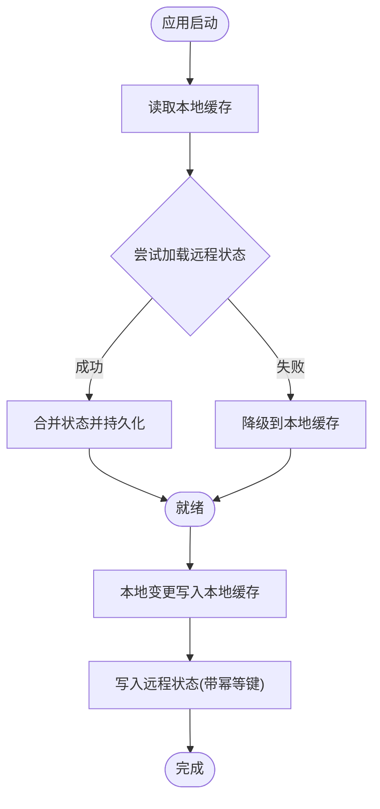
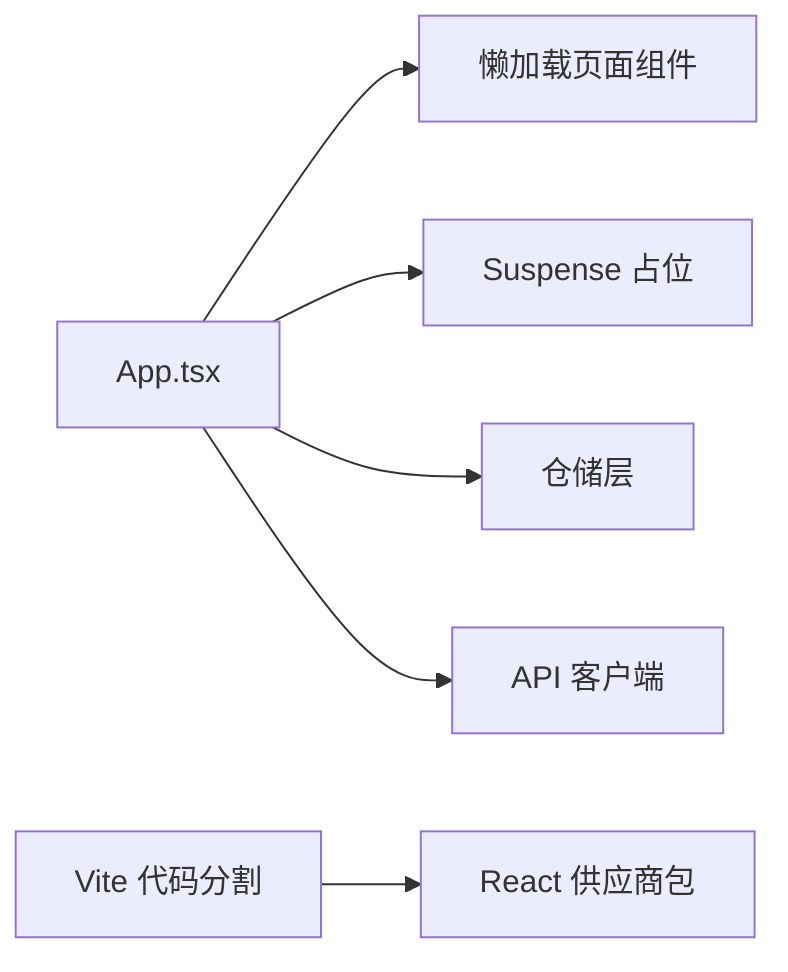
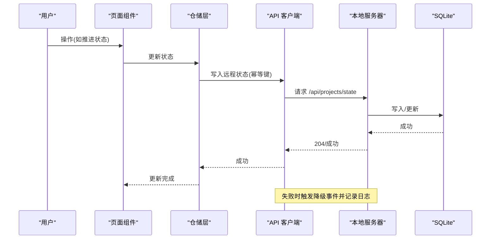
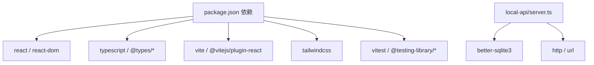

# 架构概览

<cite>
**本文引用的文件**
- [package.json](file://package.json)
- [vite.config.ts](file://vite.config.ts)
- [tailwind.config.js](file://tailwind.config.js)
- [src/App.tsx](file://src/App.tsx)
- [src/main.tsx](file://src/main.tsx)
- [local-api/server.ts](file://local-api/server.ts)
- [local-api/store/sqlite.ts](file://local-api/store/sqlite.ts)
- [local-api/store/schema.sql](file://local-api/store/schema.sql)
- [local-api/store/idempotency.ts](file://local-api/store/idempotency.ts)
- [src/services/repositories/projectRepository.ts](file://src/services/repositories/projectRepository.ts)
- [src/services/api/client.ts](file://src/services/api/client.ts)
- [src/domain/projectStatusMachine.ts](file://src/domain/projectStatusMachine.ts)
- [src/components/layout/Header.tsx](file://src/components/layout/Header.tsx)
- [src/components/layout/Sidebar.tsx](file://src/components/layout/Sidebar.tsx)
- [src/domain/__tests__/projectStatusMachine.test.ts](file://src/domain/__tests__/projectStatusMachine.test.ts)
- [docs/02-architecture/state-machine-design.md](file://docs/02-architecture/state-machine-design.md)
- [vitest.config.ts](file://vitest.config.ts)
- [README.md](file://README.md)
</cite>

## 目录

1. [简介](#简介)
2. [项目结构](#项目结构)
3. [核心组件](#核心组件)
4. [架构总览](#架构总览)
5. [详细组件分析](#详细组件分析)
6. [依赖分析](#依赖分析)
7. [性能考量](#性能考量)
8. [故障排查指南](#故障排查指南)
9. [结论](#结论)
10. [附录](#附录)

## 简介

本项目是一个基于 React 19 + TypeScript 的多模块项目管理平台，采用分层架构设计，结合本地 API 服务与 SQLite 数据库存储，提供项目全生命周期管理能力。前端通过 Vite 8 构建，Tailwind CSS 4 实现样式，Vitest 提供单元测试支撑；后端以本地 Express 服务器承载五类核心状态接口，配合 SQLite 与幂等键机制，确保数据一致性与可恢复性。

## 项目结构

项目采用按功能域划分的目录组织方式，主要层次如下：

- UI 层：页面组件位于 src/components，布局组件位于 src/components/layout
- 业务层：领域逻辑位于 src/domain，仓储层位于 src/services/repositories，API 客户端位于 src/services/api
- 数据层：本地持久化使用 localStorage，远程持久化通过本地 API 服务对接 SQLite
- 本地后端：local-api 目录提供 Express 服务器与 SQLite 存储

**图表来源**

- [src/App.tsx](file://src/App.tsx)
- [src/main.tsx](file://src/main.tsx)
- [local-api/server.ts](file://local-api/server.ts)
- [local-api/store/sqlite.ts](file://local-api/store/sqlite.ts)

**章节来源**

- [README.md](file://README.md)
- [src/App.tsx](file://src/App.tsx)

## 核心组件

- 应用入口与路由编排：src/main.tsx 负责渲染根组件；src/App.tsx 实现 Hash 路由解析、页面懒加载、状态机守卫与本地/远程状态同步
- 本地 API 服务：local-api/server.ts 提供项目/任务/验收/结算/审计五类状态接口，支持幂等键与 CORS
- SQLite 存储：local-api/store/sqlite.ts 初始化数据库与表结构，local-api/store/schema.sql 定义表结构，local-api/store/idempotency.ts 实现幂等键校验与记录
- 仓储层：src/services/repositories/projectRepository.ts 负责本地与远程状态的读写与降级策略
- API 客户端：src/services/api/client.ts 封装 fetch 请求、重试与降级事件派发
- 领域逻辑：src/domain/projectStatusMachine.ts 定义项目状态机、守卫条件与联动钩子
- 样式与构建：tailwind.config.js 配置 Tailwind，vite.config.ts 配置代理与代码分割，package.json 管理依赖与脚本

**章节来源**

- [src/main.tsx](file://src/main.tsx)
- [src/App.tsx](file://src/App.tsx)
- [local-api/server.ts](file://local-api/server.ts)
- [local-api/store/sqlite.ts](file://local-api/store/sqlite.ts)
- [local-api/store/schema.sql](file://local-api/store/schema.sql)
- [local-api/store/idempotency.ts](file://local-api/store/idempotency.ts)
- [src/services/repositories/projectRepository.ts](file://src/services/repositories/projectRepository.ts)
- [src/services/api/client.ts](file://src/services/api/client.ts)
- [src/domain/projectStatusMachine.ts](file://src/domain/projectStatusMachine.ts)
- [tailwind.config.js](file://tailwind.config.js)
- [vite.config.ts](file://vite.config.ts)
- [package.json](file://package.json)

## 架构总览

系统采用“前端分层 + 本地后端”的混合架构：

- 前端分层
  - UI 层：页面与布局组件，负责用户交互与视图渲染
  - 业务层：领域逻辑与仓储层，负责状态机与数据持久化策略
  - 数据层：localStorage 与本地 API 服务，提供离线与在线两种数据来源
- 本地后端
  - Express 服务器：提供五类状态接口，支持 GET/PUT/POST，CORS 与幂等键
  - SQLite 数据库：持久化项目/任务/验收/结算/审计数据，配合索引与 WAL 模式提升并发性能

**图表来源**

- [src/App.tsx](file://src/App.tsx)
- [src/services/repositories/projectRepository.ts](file://src/services/repositories/projectRepository.ts)
- [src/services/api/client.ts](file://src/services/api/client.ts)
- [local-api/server.ts](file://local-api/server.ts)
- [local-api/store/sqlite.ts](file://local-api/store/sqlite.ts)
- [local-api/store/schema.sql](file://local-api/store/schema.sql)
- [local-api/store/idempotency.ts](file://local-api/store/idempotency.ts)

## 详细组件分析

### 状态机设计与实现

- 状态定义与流转：项目状态机包含九个主状态，定义了主路径与异常路径，以及每条路径的前置条件与联动规则
- 守卫逻辑：通过 GuardContext 与 canTransition 实现严格的前置条件校验，对需要原因的流转进行强制约束
- 联动钩子：进入特定状态时触发系统级联动（如任务树生成、风险重算、验收摘要生成等）

**图表来源**

- [src/domain/projectStatusMachine.ts](file://src/domain/projectStatusMachine.ts)
- [docs/02-architecture/state-machine-design.md](file://docs/02-architecture/state-machine-design.md)

**章节来源**

- [src/domain/projectStatusMachine.ts](file://src/domain/projectStatusMachine.ts)
- [src/domain/**tests**/projectStatusMachine.test.ts](file://src/domain/__tests__/projectStatusMachine.test.ts)
- [docs/02-architecture/state-machine-design.md](file://docs/02-architecture/state-machine-design.md)

### 本地 API 服务架构

- 接口设计：提供项目状态、任务状态、验收状态、结算状态与审计日志五类接口，均支持幂等键
- 幂等机制：通过 idempotency.ts 校验请求指纹，避免重复写入；记录幂等键并在命中时返回 204
- 数据模型：schema.sql 定义项目/任务/验收/结算/审计表及索引；sqlite.ts 初始化数据库并启用 WAL 模式
- 错误处理：统一错误响应格式，支持 CORS 预检与健康检查

**图表来源**

- [src/services/api/client.ts](file://src/services/api/client.ts)
- [local-api/server.ts](file://local-api/server.ts)
- [local-api/store/sqlite.ts](file://local-api/store/sqlite.ts)
- [local-api/store/idempotency.ts](file://local-api/store/idempotency.ts)

**章节来源**

- [local-api/server.ts](file://local-api/server.ts)
- [local-api/store/sqlite.ts](file://local-api/store/sqlite.ts)
- [local-api/store/schema.sql](file://local-api/store/schema.sql)
- [local-api/store/idempotency.ts](file://local-api/store/idempotency.ts)

### 仓储层与双存储架构

- 本地优先策略：优先读取 localStorage，失败时降级；远程失败时保留本地缓存并发出降级事件
- 状态同步：应用启动时加载远程状态并持久化到本地；后续变更同时写入远程与本地
- 事件通知：远程失败时通过自定义事件 pm:remote-fallback 通知 UI，触发用户提示

**图表来源**

- [src/services/repositories/projectRepository.ts](file://src/services/repositories/projectRepository.ts)
- [src/App.tsx](file://src/App.tsx)

**章节来源**

- [src/services/repositories/projectRepository.ts](file://src/services/repositories/projectRepository.ts)
- [src/App.tsx](file://src/App.tsx)

### 组件化开发与懒加载策略

- 页面级懒加载：App.tsx 对 14+ 页面组件进行按需加载，结合 Suspense 提供加载占位
- 代码分割：Vite 配置将 React 生态核心库独立打包，降低首屏体积
- 布局组件：Header 与 Sidebar 提供统一的顶部导航与侧边菜单，支持 Hash 路由跳转

**图表来源**

- [src/App.tsx](file://src/App.tsx)
- [vite.config.ts](file://vite.config.ts)
- [src/components/layout/Header.tsx](file://src/components/layout/Header.tsx)
- [src/components/layout/Sidebar.tsx](file://src/components/layout/Sidebar.tsx)

**章节来源**

- [src/App.tsx](file://src/App.tsx)
- [vite.config.ts](file://vite.config.ts)
- [src/components/layout/Header.tsx](file://src/components/layout/Header.tsx)
- [src/components/layout/Sidebar.tsx](file://src/components/layout/Sidebar.tsx)

### 系统边界、组件交互与数据流

- 系统边界
  - 前端边界：React 应用、Vite 构建、Tailwind 样式
  - 后端边界：本地 Express 服务器、SQLite 数据库、幂等键机制
- 组件交互
  - UI 通过仓储层访问远程/本地状态；API 客户端封装网络请求与重试；状态机提供守卫与联动
- 数据流
  - 读：本地缓存优先，远程失败则降级；写：本地变更先落盘，再异步写远程，失败时保留本地并降级

**图表来源**

- [src/App.tsx](file://src/App.tsx)
- [src/services/repositories/projectRepository.ts](file://src/services/repositories/projectRepository.ts)
- [src/services/api/client.ts](file://src/services/api/client.ts)
- [local-api/server.ts](file://local-api/server.ts)
- [local-api/store/sqlite.ts](file://local-api/store/sqlite.ts)

**章节来源**

- [src/App.tsx](file://src/App.tsx)
- [src/services/repositories/projectRepository.ts](file://src/services/repositories/projectRepository.ts)
- [src/services/api/client.ts](file://src/services/api/client.ts)
- [local-api/server.ts](file://local-api/server.ts)

## 依赖分析

- 前端依赖
  - React 19 + TypeScript：核心框架与类型系统
  - Vite 8：构建与开发服务器，配置代理到本地 API
  - Tailwind CSS 4：原子化样式框架
  - Vitest：单元测试框架，配置 jsdom 环境
- 本地后端依赖
  - better-sqlite3：高性能 SQLite 驱动
  - http/url：内置模块，实现路由与请求解析

**图表来源**

- [package.json](file://package.json)
- [local-api/server.ts](file://local-api/server.ts)

**章节来源**

- [package.json](file://package.json)
- [vite.config.ts](file://vite.config.ts)
- [tailwind.config.js](file://tailwind.config.js)
- [vitest.config.ts](file://vitest.config.ts)

## 性能考量

- 代码分割：Vite 将 React 生态独立打包，减小主包体积，提升首屏加载速度
- 懒加载：页面组件按需加载，结合 Suspense 提升用户体验
- SQLite 性能：启用 WAL 模式提升并发读写性能，合理索引加速查询
- 构建优化：调整 chunkSizeWarningLimit，配合按需加载策略

**章节来源**

- [vite.config.ts](file://vite.config.ts)
- [local-api/store/sqlite.ts](file://local-api/store/sqlite.ts)
- [README.md](file://README.md)

## 故障排查指南

- 网络请求失败
  - 检查本地 API 服务是否启动（默认端口 3100）
  - 查看浏览器控制台的降级日志与事件派发
  - 验证 Vite 代理配置与请求头中的幂等键
- 状态流转失败
  - 检查状态机守卫条件与 GuardContext 构造
  - 查看控制台日志与审计仓库记录
- 本地缓存不一致
  - 清空 localStorage 后刷新页面
  - 校验仓储层 loadState/saveState 的行为

**章节来源**

- [src/services/api/client.ts](file://src/services/api/client.ts)
- [src/services/repositories/projectRepository.ts](file://src/services/repositories/projectRepository.ts)
- [src/domain/projectStatusMachine.ts](file://src/domain/projectStatusMachine.ts)
- [README.md](file://README.md)

## 结论

本项目通过清晰的分层架构与本地 API 服务，实现了前端与后端的解耦与高可用。状态机驱动的业务规则确保了流程的严谨性，双存储架构提供了可靠的离线与在线体验。结合懒加载与代码分割策略，系统在性能与可维护性之间取得了良好平衡。建议在后续迭代中持续完善测试覆盖与文档规范，强化跨对象联动与审计追踪能力。

## 附录

- 开发与测试
  - 启动本地后端与前端：npm run dev:local
  - 运行测试：npm run test / test:run / test:coverage
- 路由与页面
  - Hash 路由支持项目列表、详情、任务中心、人员管理、采购管理、合同结算、订单管理、设施管理、资源池、客户管理、标准管理、数字员工、系统设置等页面

**章节来源**

- [README.md](file://README.md)
- [vitest.config.ts](file://vitest.config.ts)
- [src/App.tsx](file://src/App.tsx)
