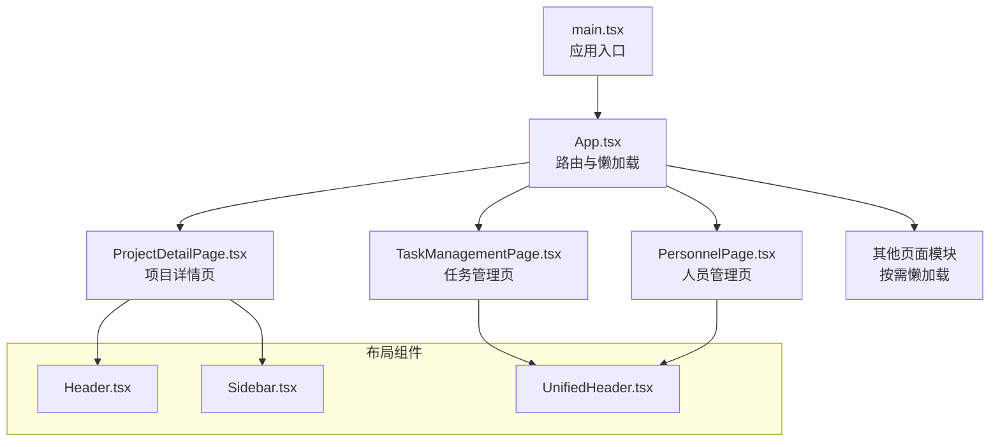
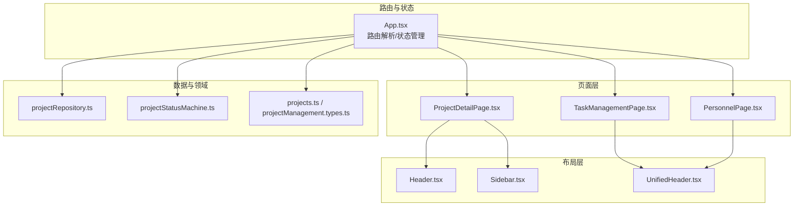
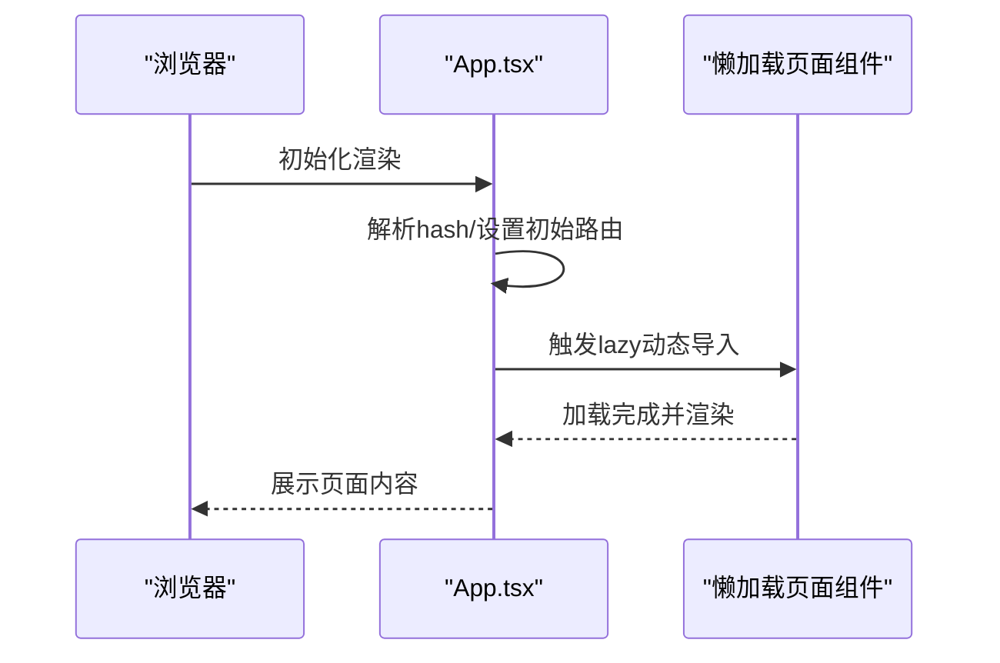
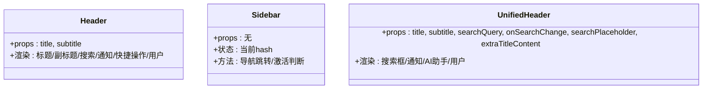
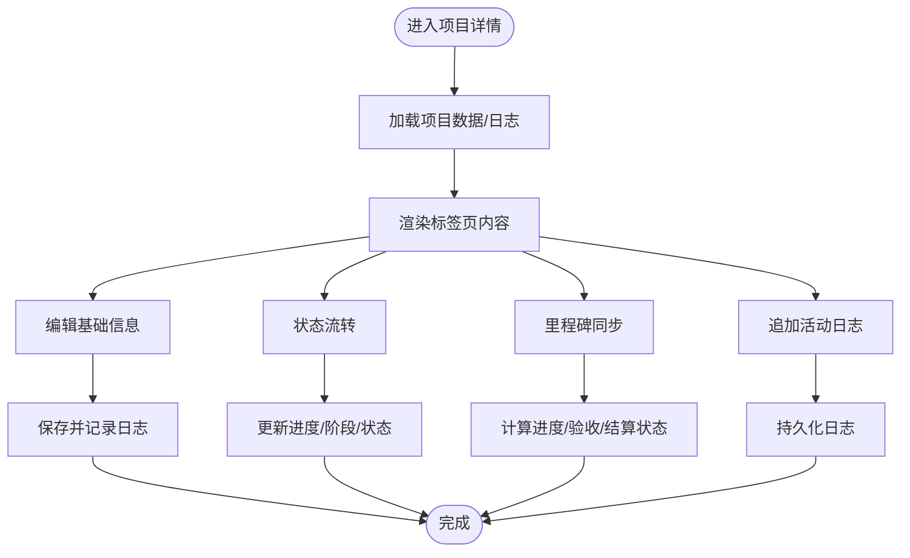
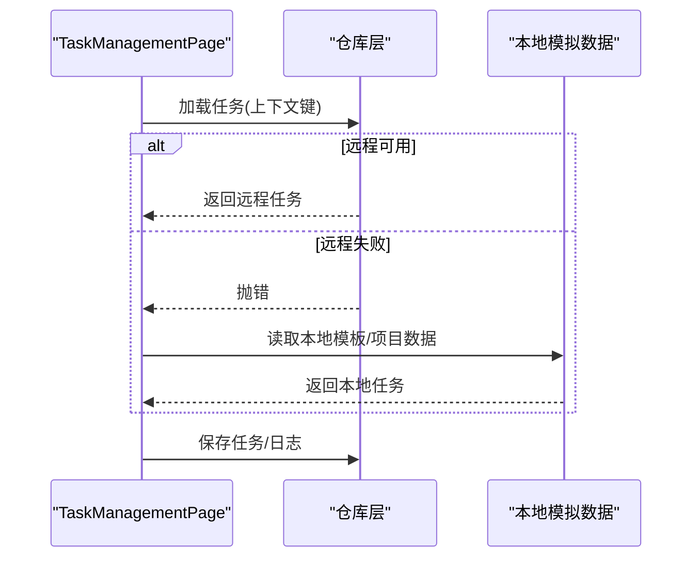
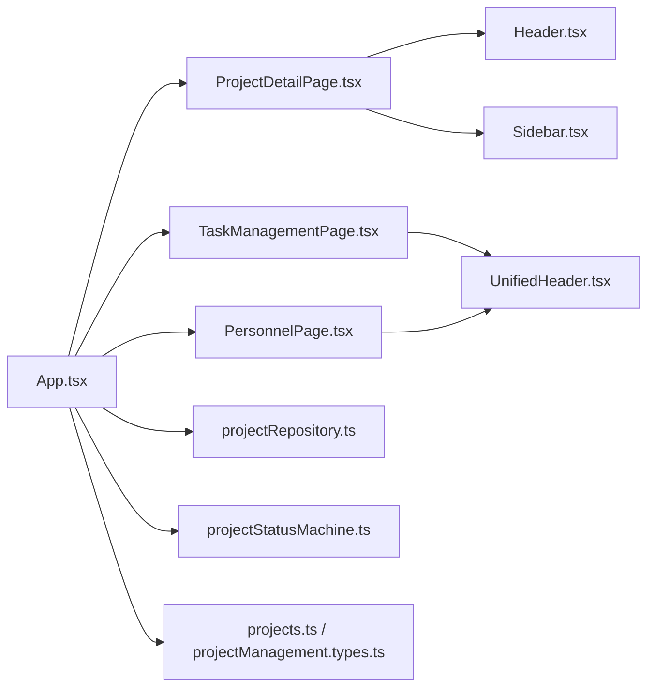

# 组件架构

<cite>
**本文引用的文件**
- [src/App.tsx](file://src/App.tsx)
- [src/main.tsx](file://src/main.tsx)
- [src/components/layout/Header.tsx](file://src/components/layout/Header.tsx)
- [src/components/layout/Sidebar.tsx](file://src/components/layout/Sidebar.tsx)
- [src/components/layout/UnifiedHeader.tsx](file://src/components/layout/UnifiedHeader.tsx)
- [src/components/personnel/PersonnelPage.tsx](file://src/components/personnel/PersonnelPage.tsx)
- [src/components/project/ProjectDetailPage.tsx](file://src/components/project/ProjectDetailPage.tsx)
- [src/components/task/TaskManagementPage.tsx](file://src/components/task/TaskManagementPage.tsx)
- [src/domain/projectStatusMachine.ts](file://src/domain/projectStatusMachine.ts)
- [src/services/repositories/projectRepository.ts](file://src/services/repositories/projectRepository.ts)
- [src/data/projects.ts](file://src/data/projects.ts)
- [src/components/personnel/projectManagement.types.ts](file://src/components/personnel/projectManagement.types.ts)
- [src/components/project/projectTabs.shared.ts](file://src/components/project/projectTabs.shared.ts)
- [package.json](file://package.json)
- [vite.config.ts](file://vite.config.ts)
- [src/index.css](file://src/index.css)
</cite>

## 目录

1. [简介](#简介)
2. [项目结构](#项目结构)
3. [核心组件](#核心组件)
4. [架构总览](#架构总览)
5. [组件详解](#组件详解)
6. [依赖关系分析](#依赖关系分析)
7. [性能考量](#性能考量)
8. [故障排查指南](#故障排查指南)
9. [结论](#结论)
10. [附录](#附录)

## 简介

本文件为 CodeBuddy 项目的组件架构文档，聚焦于组件层次结构、布局组件设计与共享规范，阐述路由级懒加载优化策略与组件通信机制，解释 Header、Sidebar、UnifiedHeader 等布局组件的设计理念与使用场景，总结 Props 传递模式、事件处理机制、生命周期管理、状态提升与局部状态设计，并给出扩展与自定义指导。文档同时兼顾初学者与高级开发者的需求。

## 项目结构

项目采用“按功能域分层 + 组件化”的组织方式：

- 应用入口与路由：App.tsx 负责路由解析与页面级懒加载；main.tsx 渲染根组件。
- 布局组件：位于 src/components/layout，提供通用 Header、Sidebar、UnifiedHeader。
- 功能页面：按业务域划分，如 personnel、project、task、procurement、resource、settings 等。
- 数据与状态：src/data 提供项目数据与类型定义；src/domain 提供状态机与视图逻辑；src/services 提供仓库层与错误处理。
- 样式与构建：TailwindCSS 与自定义 CSS 变量；Vite 构建配置实现代码分割与代理。

**图表来源**

- [src/main.tsx:1-11](file://src/main.tsx#L1-L11)
- [src/App.tsx:1-800](file://src/App.tsx#L1-L800)
- [src/components/project/ProjectDetailPage.tsx:1-800](file://src/components/project/ProjectDetailPage.tsx#L1-L800)
- [src/components/task/TaskManagementPage.tsx:1-800](file://src/components/task/TaskManagementPage.tsx#L1-L800)
- [src/components/personnel/PersonnelPage.tsx:1-37](file://src/components/personnel/PersonnelPage.tsx#L1-L37)
- [src/components/layout/Header.tsx:1-37](file://src/components/layout/Header.tsx#L1-L37)
- [src/components/layout/Sidebar.tsx:1-108](file://src/components/layout/Sidebar.tsx#L1-L108)
- [src/components/layout/UnifiedHeader.tsx:1-57](file://src/components/layout/UnifiedHeader.tsx#L1-L57)

**章节来源**

- [src/main.tsx:1-11](file://src/main.tsx#L1-L11)
- [src/App.tsx:1-800](file://src/App.tsx#L1-L800)
- [package.json:1-48](file://package.json#L1-L48)
- [vite.config.ts:1-35](file://vite.config.ts#L1-L35)

## 核心组件

- 应用根组件与路由：App.tsx 使用 hash 路由解析与 React.lazy 实现页面级懒加载，结合 Suspense 提供加载占位，统一管理项目状态与审计日志。
- 布局组件：
  - Header：传统顶部区域，含标题、副标题与操作区。
  - Sidebar：导航侧边栏，基于当前 hash 判断激活项，支持跳转与折叠。
  - UnifiedHeader：统一头部，强调搜索与用户操作，适合通用业务页。
- 页面组件：
  - ProjectDetailPage：项目详情页，承载仪表盘、启动、计划、执行、监控、收尾、设置等标签页。
  - TaskManagementPage：任务管理页，支持模板/项目筛选、视图切换、分页与任务操作。
  - PersonnelPage：人员管理页，组合 Sidebar、Header、Tabs、StatsCards、UserTable 等子组件。

**章节来源**

- [src/App.tsx:1-800](file://src/App.tsx#L1-L800)
- [src/components/layout/Header.tsx:1-37](file://src/components/layout/Header.tsx#L1-L37)
- [src/components/layout/Sidebar.tsx:1-108](file://src/components/layout/Sidebar.tsx#L1-L108)
- [src/components/layout/UnifiedHeader.tsx:1-57](file://src/components/layout/UnifiedHeader.tsx#L1-L57)
- [src/components/project/ProjectDetailPage.tsx:1-800](file://src/components/project/ProjectDetailPage.tsx#L1-L800)
- [src/components/task/TaskManagementPage.tsx:1-800](file://src/components/task/TaskManagementPage.tsx#L1-L800)
- [src/components/personnel/PersonnelPage.tsx:1-37](file://src/components/personnel/PersonnelPage.tsx#L1-L37)

## 架构总览

应用采用“路由驱动 + 组件组合 + 状态提升”的架构模式：

- 路由层：hash 路由解析与页面级懒加载，减少首屏体积。
- 组件层：布局组件与业务页面解耦，通过 Props 传递数据与回调。
- 状态层：App.tsx 提供全局状态与业务方法，页面内维持局部状态。
- 数据层：仓库层负责本地/远程状态持久化与降级容错。

**图表来源**

- [src/App.tsx:1-800](file://src/App.tsx#L1-L800)
- [src/components/project/ProjectDetailPage.tsx:1-800](file://src/components/project/ProjectDetailPage.tsx#L1-L800)
- [src/components/task/TaskManagementPage.tsx:1-800](file://src/components/task/TaskManagementPage.tsx#L1-L800)
- [src/components/personnel/PersonnelPage.tsx:1-37](file://src/components/personnel/PersonnelPage.tsx#L1-L37)
- [src/components/layout/Header.tsx:1-37](file://src/components/layout/Header.tsx#L1-L37)
- [src/components/layout/Sidebar.tsx:1-108](file://src/components/layout/Sidebar.tsx#L1-L108)
- [src/components/layout/UnifiedHeader.tsx:1-57](file://src/components/layout/UnifiedHeader.tsx#L1-L57)
- [src/services/repositories/projectRepository.ts:1-90](file://src/services/repositories/projectRepository.ts#L1-L90)
- [src/domain/projectStatusMachine.ts:1-164](file://src/domain/projectStatusMachine.ts#L1-L164)
- [src/data/projects.ts:1-451](file://src/data/projects.ts#L1-L451)
- [src/components/personnel/projectManagement.types.ts:1-168](file://src/components/personnel/projectManagement.types.ts#L1-L168)

## 组件详解

### 路由与懒加载策略

- 页面级懒加载：App.tsx 对多个页面组件使用 React.lazy 按需加载，结合 Suspense 提供加载占位，显著降低首屏体积。
- 路由解析：基于 window.location.hash 解析路由，支持项目详情、任务、人员、采购、合同、订单、设施、资源、标准、数字员工、系统设置等。
- 降级提示：监听自定义事件“云端服务不可用”时弹窗提示并启用本地兜底。

**图表来源**

- [src/App.tsx:1-800](file://src/App.tsx#L1-L800)

**章节来源**

- [src/App.tsx:1-800](file://src/App.tsx#L1-L800)

### 布局组件设计与使用场景

- Header（传统顶部区）：适用于项目详情页等需要简洁标题与操作区的场景。
- Sidebar（导航侧边栏）：基于当前 hash 判断激活项，支持点击跳转与刷新行为，适合全局导航。
- UnifiedHeader（统一头部）：强调搜索与用户操作，适合通用业务页（如任务、人员）。

**图表来源**

- [src/components/layout/Header.tsx:1-37](file://src/components/layout/Header.tsx#L1-L37)
- [src/components/layout/Sidebar.tsx:1-108](file://src/components/layout/Sidebar.tsx#L1-L108)
- [src/components/layout/UnifiedHeader.tsx:1-57](file://src/components/layout/UnifiedHeader.tsx#L1-L57)

**章节来源**

- [src/components/layout/Header.tsx:1-37](file://src/components/layout/Header.tsx#L1-L37)
- [src/components/layout/Sidebar.tsx:1-108](file://src/components/layout/Sidebar.tsx#L1-L108)
- [src/components/layout/UnifiedHeader.tsx:1-57](file://src/components/layout/UnifiedHeader.tsx#L1-L57)

### 项目详情页（ProjectDetailPage）

- 组合布局：Header、Sidebar、面包屑、标签页（仪表盘/启动/计划/执行/监控/收尾/设置）。
- 状态管理：在 App.tsx 中维护项目集合与日志，通过 props 下发到页面；页面内部维护编辑对话框、表单校验、设置面板等局部状态。
- 交互机制：支持基础信息更新、状态流转、里程碑同步、活动日志追加、任务导航等。

**图表来源**

- [src/components/project/ProjectDetailPage.tsx:1-800](file://src/components/project/ProjectDetailPage.tsx#L1-L800)
- [src/App.tsx:506-594](file://src/App.tsx#L506-L594)

**章节来源**

- [src/components/project/ProjectDetailPage.tsx:1-800](file://src/components/project/ProjectDetailPage.tsx#L1-L800)
- [src/App.tsx:506-594](file://src/App.tsx#L506-L594)

### 任务管理页（TaskManagementPage）

- 状态与过滤：基于 hash 上下文解析模板/项目/来源类型，维护搜索、分组、排序、分页等状态。
- 本地/远程：优先加载远程任务，失败时回退到本地模拟数据；运行时日志与附件合并展示。
- 交互：派单、接单、拒单、提醒、提交验收、生成整改任务等。

**图表来源**

- [src/components/task/TaskManagementPage.tsx:1-800](file://src/components/task/TaskManagementPage.tsx#L1-L800)
- [src/services/repositories/projectRepository.ts:1-90](file://src/services/repositories/projectRepository.ts#L1-L90)

**章节来源**

- [src/components/task/TaskManagementPage.tsx:1-800](file://src/components/task/TaskManagementPage.tsx#L1-L800)
- [src/services/repositories/projectRepository.ts:1-90](file://src/services/repositories/projectRepository.ts#L1-L90)

### 人员管理页（PersonnelPage）

- 组合布局：Sidebar、Header（搜索）、Tabs、StatsCards、UserTable。
- 交互：搜索查询通过 props 向上回传，表格支持打开用户详情。

**章节来源**

- [src/components/personnel/PersonnelPage.tsx:1-37](file://src/components/personnel/PersonnelPage.tsx#L1-L37)

### 共享类型与状态机

- 项目状态机：定义状态、守卫条件、可用流转、钩子与日志格式。
- 项目数据：扩展字段（阶段、里程碑、任务树、风险、成员），草稿与模板创建逻辑。
- 项目类型：统一的项目数据结构与视图常量。

**章节来源**

- [src/domain/projectStatusMachine.ts:1-164](file://src/domain/projectStatusMachine.ts#L1-L164)
- [src/data/projects.ts:1-451](file://src/data/projects.ts#L1-L451)
- [src/components/personnel/projectManagement.types.ts:1-168](file://src/components/personnel/projectManagement.types.ts#L1-L168)
- [src/components/project/projectTabs.shared.ts:1-10](file://src/components/project/projectTabs.shared.ts#L1-L10)

## 依赖关系分析

- 组件耦合：页面组件依赖布局组件与共享类型；布局组件彼此独立，耦合度低。
- 状态提升：App.tsx 提供全局状态与业务方法，页面内维持局部状态，遵循“状态提升 + 局部状态”的设计原则。
- 外部依赖：React、Vite、TailwindCSS；构建配置对 React 生态进行单独分包，提升缓存命中率。

**图表来源**

- [src/App.tsx:1-800](file://src/App.tsx#L1-L800)
- [src/components/project/ProjectDetailPage.tsx:1-800](file://src/components/project/ProjectDetailPage.tsx#L1-L800)
- [src/components/task/TaskManagementPage.tsx:1-800](file://src/components/task/TaskManagementPage.tsx#L1-L800)
- [src/components/personnel/PersonnelPage.tsx:1-37](file://src/components/personnel/PersonnelPage.tsx#L1-L37)
- [src/components/layout/Header.tsx:1-37](file://src/components/layout/Header.tsx#L1-L37)
- [src/components/layout/Sidebar.tsx:1-108](file://src/components/layout/Sidebar.tsx#L1-L108)
- [src/components/layout/UnifiedHeader.tsx:1-57](file://src/components/layout/UnifiedHeader.tsx#L1-L57)
- [src/services/repositories/projectRepository.ts:1-90](file://src/services/repositories/projectRepository.ts#L1-L90)
- [src/domain/projectStatusMachine.ts:1-164](file://src/domain/projectStatusMachine.ts#L1-L164)
- [src/data/projects.ts:1-451](file://src/data/projects.ts#L1-L451)
- [src/components/personnel/projectManagement.types.ts:1-168](file://src/components/personnel/projectManagement.types.ts#L1-L168)

**章节来源**

- [src/App.tsx:1-800](file://src/App.tsx#L1-L800)
- [vite.config.ts:1-35](file://vite.config.ts#L1-L35)

## 性能考量

- 路由级懒加载：按需加载页面组件，减少首屏 JS 体积，提升首屏速度。
- 代码分割：Vite 配置将 React 生态库单独打包为 react-vendor，提升缓存命中率。
- 本地/远程降级：仓库层在远程失败时回退到本地缓存，保证可用性。
- 样式隔离：TailwindCSS 与自定义变量，避免全局污染，便于按需裁剪。

**章节来源**

- [src/App.tsx:1-800](file://src/App.tsx#L1-L800)
- [vite.config.ts:1-35](file://vite.config.ts#L1-L35)
- [src/services/repositories/projectRepository.ts:1-90](file://src/services/repositories/projectRepository.ts#L1-L90)

## 故障排查指南

- 云端服务不可用：应用监听“云端服务暂时不可用”事件，弹窗提示并启用本地兜底，避免整站不可用。
- 本地存储异常：仓库层对本地读取/持久化失败进行结构化错误记录，确保降级与可观测性。
- 状态不一致：通过项目状态机守卫与日志钩子，确保状态流转合规与可追溯。

**章节来源**

- [src/App.tsx:366-389](file://src/App.tsx#L366-L389)
- [src/services/repositories/projectRepository.ts:14-51](file://src/services/repositories/projectRepository.ts#L14-L51)
- [src/domain/projectStatusMachine.ts:105-163](file://src/domain/projectStatusMachine.ts#L105-L163)

## 结论

本项目通过“路由驱动 + 组件组合 + 状态提升”的架构，实现了清晰的职责分离与良好的可扩展性。路由级懒加载与代码分割有效优化了性能；布局组件标准化提升了复用性；仓库层的本地/远程降级增强了稳定性。建议在后续迭代中持续完善类型体系、测试覆盖率与可视化监控，进一步提升可维护性与可观测性。

## 附录

- 样式规范：通过 CSS 变量与 Tailwind 类名统一风格，布局组件样式集中在 index.css。
- 构建配置：Vite 代理后端接口，手动分包策略提升缓存效率。

**章节来源**

- [src/index.css:1-800](file://src/index.css#L1-L800)
- [vite.config.ts:1-35](file://vite.config.ts#L1-L35)
