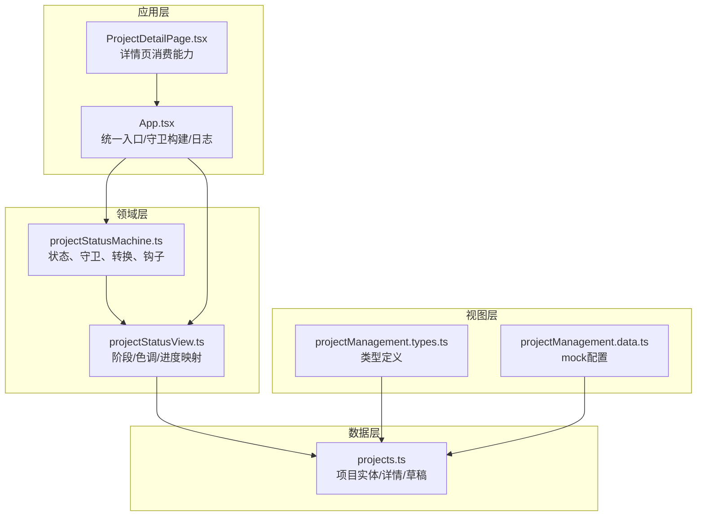
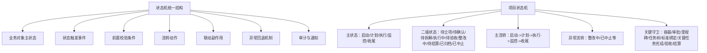
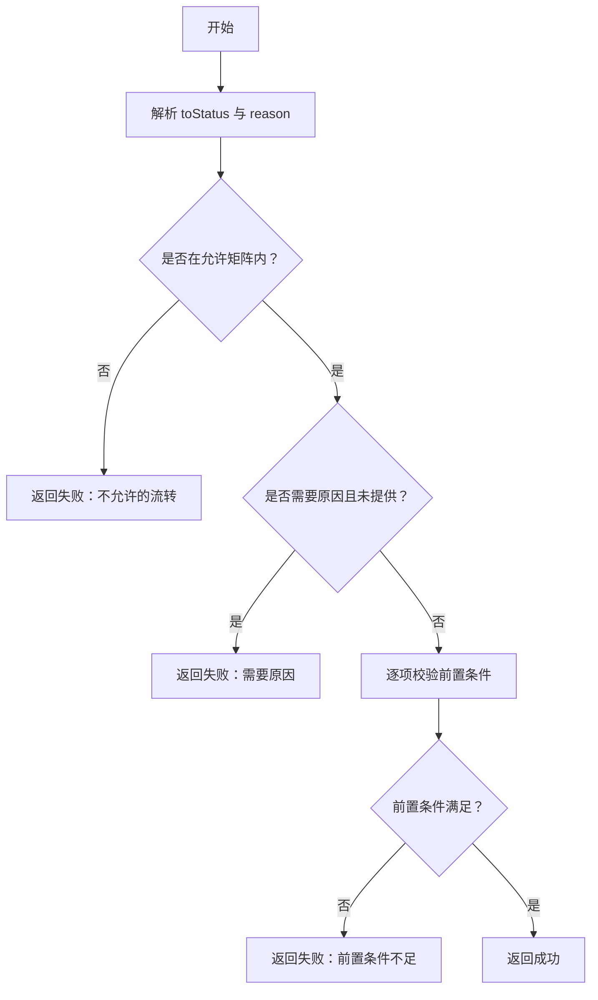
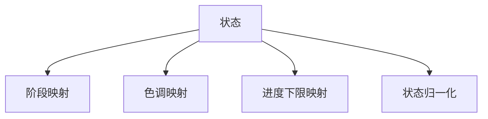
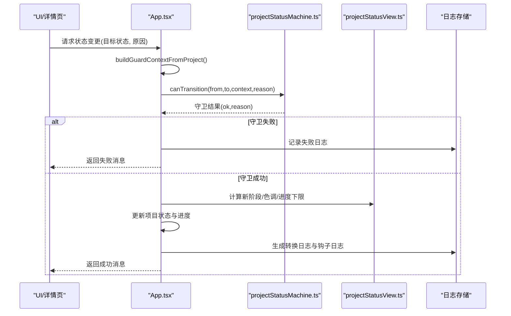
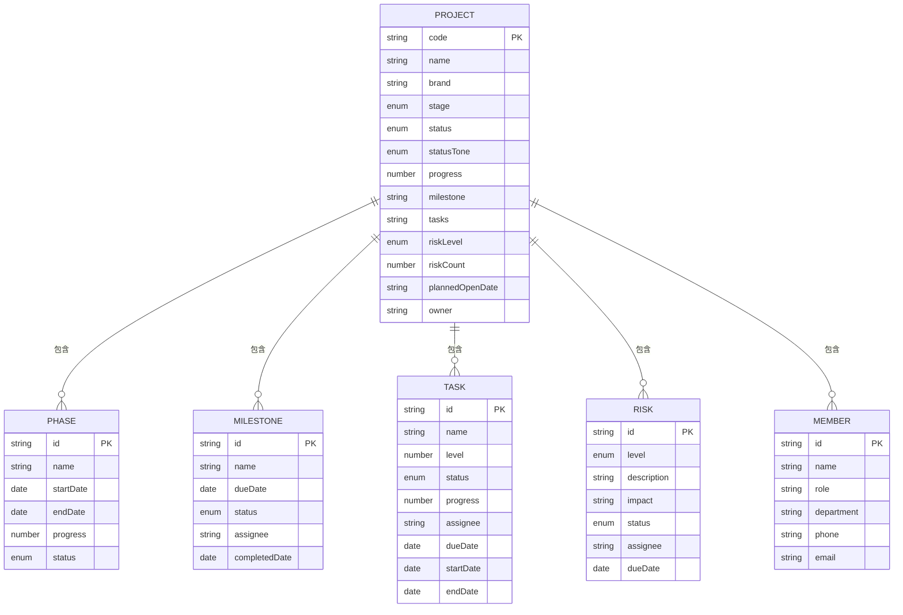
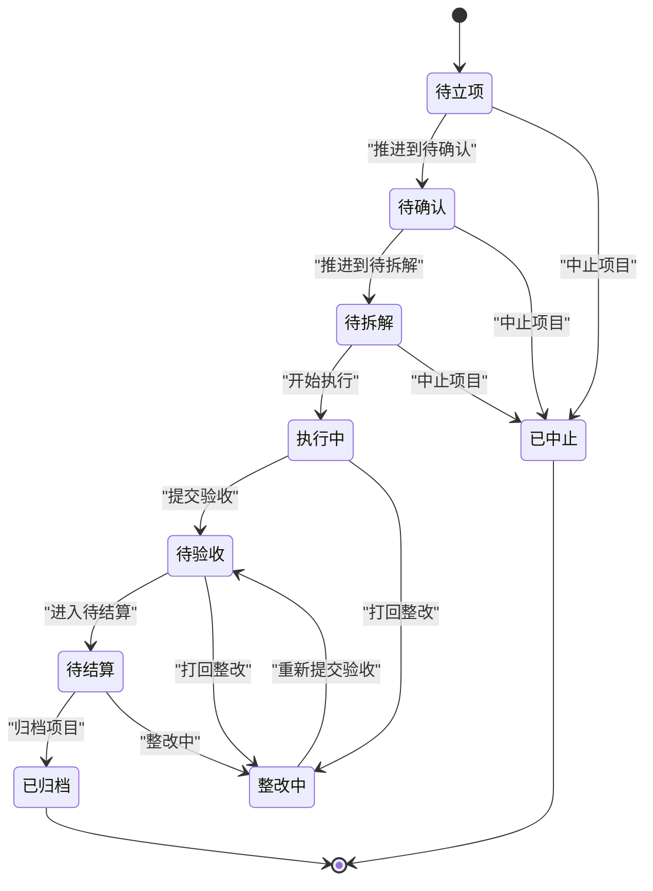
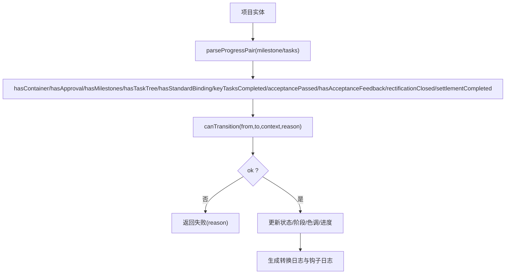
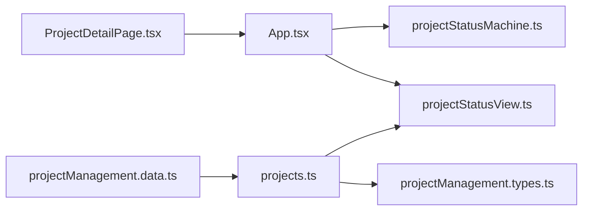

# 项目状态机设计

<cite>
**本文引用的文件**
- [projectStatusMachine.ts](file://src/domain/projectStatusMachine.ts)
- [projectStatusView.ts](file://src/domain/projectStatusView.ts)
- [state-machine-design.md](file://docs/02-architecture/state-machine-design.md)
- [project-rules.md](file://docs/02-architecture/project-rules.md)
- [projects.ts](file://src/data/projects.ts)
- [projectManagement.types.ts](file://src/components/personnel/projectManagement.types.ts)
- [projectManagement.data.ts](file://src/components/personnel/projectManagement.data.ts)
- [App.tsx](file://src/App.tsx)
- [ProjectDetailPage.tsx](file://src/components/project/ProjectDetailPage.tsx)
- [projectStatusMachine.test.ts](file://src/domain/__tests__/projectStatusMachine.test.ts)
</cite>

## 目录

1. [简介](#简介)
2. [项目结构](#项目结构)
3. [核心组件](#核心组件)
4. [架构总览](#架构总览)
5. [详细组件分析](#详细组件分析)
6. [依赖分析](#依赖分析)
7. [性能考量](#性能考量)
8. [故障排查指南](#故障排查指南)
9. [结论](#结论)
10. [附录](#附录)

## 简介

本设计文档面向 CodeBuddy 项目，系统性阐述基于状态机的项目生命周期管理设计。文档覆盖状态流转守卫逻辑、业务规则约束、状态转换验证机制，解释 GuardContext 上下文构建、状态转换条件判断与状态变更钩子系统，并描述项目状态与进度、阶段、色调的映射关系。同时提供状态机图表、转换规则说明与实际应用场景，给出扩展与自定义指导，兼顾初学者与高级开发者的理解与实践需求。

## 项目结构

项目状态机位于领域层，配合视图层映射与数据层的项目实体，形成“状态机-视图-数据”的清晰分层：

- 领域层：定义状态、守卫、转换与钩子
- 视图层：将状态映射为阶段、色调、进度下限
- 数据层：项目实体与 mock 数据，承载状态与进度
- 应用层：统一入口进行守卫校验、状态更新与日志记录

**图表来源**

- [projectStatusMachine.ts:1-164](file://src/domain/projectStatusMachine.ts#L1-L164)
- [projectStatusView.ts:1-89](file://src/domain/projectStatusView.ts#L1-L89)
- [projects.ts:1-451](file://src/data/projects.ts#L1-L451)
- [projectManagement.types.ts:1-168](file://src/components/personnel/projectManagement.types.ts#L1-L168)
- [projectManagement.data.ts:1-313](file://src/components/personnel/projectManagement.data.ts#L1-L313)
- [App.tsx:208-224](file://src/App.tsx#L208-L224)
- [ProjectDetailPage.tsx:1-200](file://src/components/project/ProjectDetailPage.tsx#L1-L200)

**章节来源**

- [projectStatusMachine.ts:1-164](file://src/domain/projectStatusMachine.ts#L1-L164)
- [projectStatusView.ts:1-89](file://src/domain/projectStatusView.ts#L1-L89)
- [projects.ts:1-451](file://src/data/projects.ts#L1-L451)
- [projectManagement.types.ts:1-168](file://src/components/personnel/projectManagement.types.ts#L1-L168)
- [projectManagement.data.ts:1-313](file://src/components/personnel/projectManagement.data.ts#L1-L313)
- [App.tsx:208-224](file://src/App.tsx#L208-L224)
- [ProjectDetailPage.tsx:1-200](file://src/components/project/ProjectDetailPage.tsx#L1-L200)

## 核心组件

- 状态类型与守卫上下文
  - 状态集合：待立项、待确认、待拆解、执行中、待验收、整改中、待结算、已归档、已中止
  - 守卫上下文 GuardContext：容器、审批、里程碑、任务树、标准绑定、关键任务完成、验收通过、验收反馈、整改闭环、结算完成
- 转换规则与可用转换
  - allowedTransitions：定义合法状态流转矩阵
  - getAvailableTransitions：根据当前状态返回可用转换（含标签与是否需要原因）
- 守卫校验与错误码
  - canTransition：综合合法性、原因必填、前置条件校验
  - resolveTransitionGuardCode：生成守卫代码或错误码
- 阶段、色调与进度映射
  - getProjectStageByStatus：状态映射到阶段（启动/计划/执行/监控/收尾）
  - getProjectStatusTone：状态映射到色调（蓝/黄/绿/红）
  - getProgressFloorByStatus：状态映射到进度下限
- 状态变更钩子
  - getEnterStatusHooks：进入某状态时触发的联动提示（mock）

**章节来源**

- [projectStatusMachine.ts:1-164](file://src/domain/projectStatusMachine.ts#L1-L164)
- [projectStatusView.ts:1-89](file://src/domain/projectStatusView.ts#L1-L89)

## 架构总览

项目状态机采用“轻量主状态机 + 异常分支 + 审计日志”的设计，强调：

- 状态由事件驱动，非自由推动
- 任务树承接执行颗粒度，状态机约束推进路径
- 标准库提供进入下一状态的判断依据
- 关键状态变化可追溯、可审计

**图表来源**

- [state-machine-design.md:116-143](file://docs/02-architecture/state-machine-design.md#L116-L143)
- [state-machine-design.md:199-296](file://docs/02-architecture/state-machine-design.md#L199-L296)

**章节来源**

- [state-machine-design.md:116-143](file://docs/02-architecture/state-machine-design.md#L116-L143)
- [state-machine-design.md:199-296](file://docs/02-architecture/state-machine-design.md#L199-L296)

## 详细组件分析

### 状态机核心逻辑（projectStatusMachine.ts）

- 状态与守卫上下文
  - 状态集合与顺序：定义了完整的生命周期状态序列
  - GuardContext 字段覆盖项目推进的关键前置条件
- 转换矩阵与可用转换
  - allowedTransitions：二维映射，限定合法路径
  - getAvailableTransitions：返回转换选项（含标签与原因必填标记）
- 守卫校验
  - canTransition：逐条校验合法性、原因必填、前置条件（容器、审批、里程碑、任务树、标准绑定、关键任务完成、验收、整改闭环、结算）
- 错误码与日志
  - resolveTransitionGuardCode：生成守卫代码或错误码（如 REASON_REQUIRED）
- 状态变更钩子
  - getEnterStatusHooks：进入特定状态时的联动提示（mock）

**图表来源**

- [projectStatusMachine.ts:105-163](file://src/domain/projectStatusMachine.ts#L105-L163)

**章节来源**

- [projectStatusMachine.ts:1-164](file://src/domain/projectStatusMachine.ts#L1-L164)

### 视图映射（projectStatusView.ts）

- 阶段映射：将二级状态映射到一级阶段（启动/计划/执行/监控/收尾）
- 色调映射：状态到视觉色调（蓝/黄/绿/红），用于 UI 展示
- 进度下限映射：状态到进度下限，保证状态推进的连续性
- 归一化：将历史/兼容状态归一到二级状态

**图表来源**

- [projectStatusView.ts:4-88](file://src/domain/projectStatusView.ts#L4-L88)

**章节来源**

- [projectStatusView.ts:1-89](file://src/domain/projectStatusView.ts#L1-L89)

### 应用层统一入口（App.tsx）

- 守卫上下文构建：buildGuardContextFromProject 将项目实体映射为 GuardContext
- 统一状态变更：transitionProjectStatus 执行守卫校验、更新状态/阶段/色调/进度、生成日志与钩子日志
- 进度上下限：结合 getProgressFloorByStatus 与 getProgressCeilingByStatus 控制进度范围
- 持久化与审计：localStorage 存储项目状态与日志，审计仓库记录状态变更

**图表来源**

- [App.tsx:442-504](file://src/App.tsx#L442-L504)
- [projectStatusMachine.ts:105-163](file://src/domain/projectStatusMachine.ts#L105-L163)
- [projectStatusView.ts:65-88](file://src/domain/projectStatusView.ts#L65-L88)

**章节来源**

- [App.tsx:208-224](file://src/App.tsx#L208-L224)
- [App.tsx:442-504](file://src/App.tsx#L442-L504)

### 项目实体与视图（projects.ts, projectManagement.types.ts, projectManagement.data.ts）

- 项目实体：包含状态、阶段、色调、进度、里程碑、任务、风险、成员等扩展字段
- 视图映射：在数据层消费状态机与视图映射，生成 UI 所需的阶段/色调/进度
- mock 数据：提供多项目样例，展示不同状态下的实体形态

**图表来源**

- [projects.ts:26-45](file://src/data/projects.ts#L26-L45)
- [projectManagement.types.ts:74-127](file://src/components/personnel/projectManagement.types.ts#L74-L127)

**章节来源**

- [projects.ts:1-451](file://src/data/projects.ts#L1-L451)
- [projectManagement.types.ts:1-168](file://src/components/personnel/projectManagement.types.ts#L1-L168)
- [projectManagement.data.ts:1-313](file://src/components/personnel/projectManagement.data.ts#L1-L313)

### 状态机图表与转换规则

- 主流转路径：启动 -> 计划 -> 执行 -> 监控 -> 收尾
- 异常流转：整改中、已中止等
- 关键守卫条件：容器、审批、里程碑、任务树、标准绑定、关键任务完成、验收、结算
- 联动规则：进入特定状态触发任务树生成、SLA 计时、验收流程、整改任务、结算建议、归档冻结等

**图表来源**

- [projectStatusMachine.ts:59-69](file://src/domain/projectStatusMachine.ts#L59-L69)
- [state-machine-design.md:248-260](file://docs/02-architecture/state-machine-design.md#L248-L260)

**章节来源**

- [projectStatusMachine.ts:47-69](file://src/domain/projectStatusMachine.ts#L47-L69)
- [state-machine-design.md:248-260](file://docs/02-architecture/state-machine-design.md#L248-L260)

### 实际应用场景

- 项目启动：待立项 -> 待确认（需要容器）
- 项目计划：待确认 -> 待拆解（需要审批）
- 项目执行：待拆解 -> 执行中（需要里程碑、任务树、标准绑定）
- 项目监控：执行中 -> 待验收（需要关键任务完成）、待验收 -> 整改中（需要验收反馈）
- 项目收尾：待验收 -> 待结算（需要验收通过）、待结算 -> 已归档（需要结算完成）
- 异常处理：执行中 -> 整改中（需要原因）、整改中 -> 待验收（需要整改闭环）

**章节来源**

- [projectStatusMachine.ts:105-163](file://src/domain/projectStatusMachine.ts#L105-L163)
- [state-machine-design.md:261-296](file://docs/02-architecture/state-machine-design.md#L261-L296)

### GuardContext 上下文构建与状态转换验证

- 上下文构建：buildGuardContextFromProject 将项目实体的关键指标（里程碑、任务、模板ID、进度、风险级别等）映射为守卫条件
- 转换验证：canTransition 依次校验矩阵合法性、原因必填、前置条件，返回 GuardResult
- 错误码：resolveTransitionGuardCode 生成守卫代码或 REASON_REQUIRED

**图表来源**

- [App.tsx:208-224](file://src/App.tsx#L208-L224)
- [projectStatusMachine.ts:105-163](file://src/domain/projectStatusMachine.ts#L105-L163)

**章节来源**

- [App.tsx:208-224](file://src/App.tsx#L208-L224)
- [projectStatusMachine.ts:97-103](file://src/domain/projectStatusMachine.ts#L97-L103)

### 状态变更钩子系统

- getEnterStatusHooks：返回进入某状态时的联动提示（mock）
- App.tsx 中在成功转换后生成 hook 日志，便于审计与可视化

**章节来源**

- [projectStatusMachine.ts:82-86](file://src/domain/projectStatusMachine.ts#L82-L86)
- [App.tsx:487-494](file://src/App.tsx#L487-L494)

### 状态与进度、阶段、色调的映射

- 阶段映射：状态到阶段（启动/计划/执行/监控/收尾）
- 色调映射：状态到视觉色调（蓝/黄/绿/红）
- 进度映射：状态到进度下限，结合进度上限控制范围

**章节来源**

- [projectStatusView.ts:4-88](file://src/domain/projectStatusView.ts#L4-L88)

### 测试与验证

- 单元测试覆盖：canTransition、getAvailableTransitions、resolveTransitionGuardCode
- 测试用例：验证合法/非法流转、原因必填、前置条件缺失等场景

**章节来源**

- [projectStatusMachine.test.ts:1-125](file://src/domain/__tests__/projectStatusMachine.test.ts#L1-L125)

## 依赖分析

- 模块耦合
  - App.tsx 依赖 projectStatusMachine.ts 与 projectStatusView.ts，形成统一入口
  - 项目实体与视图类型在 projects.ts 与 projectManagement.types.ts 中定义，相互依赖
  - 视图层 mock 数据与类型定义相互依赖
- 外部依赖
  - localStorage 用于持久化项目状态与日志
  - 审计仓库用于记录状态变更

**图表来源**

- [App.tsx:26-35](file://src/App.tsx#L26-L35)
- [projects.ts:1-11](file://src/data/projects.ts#L1-L11)
- [projectManagement.types.ts:1-7](file://src/components/personnel/projectManagement.types.ts#L1-L7)

**章节来源**

- [App.tsx:26-35](file://src/App.tsx#L26-L35)
- [projects.ts:1-11](file://src/data/projects.ts#L1-L11)
- [projectManagement.types.ts:1-7](file://src/components/personnel/projectManagement.types.ts#L1-L7)

## 性能考量

- 守卫计算复杂度：canTransition 为线性扫描与常数次判断，复杂度 O(1)，性能开销极低
- 上下文构建：parseProgressPair 与布尔判断均为 O(1)，构建成本低
- 日志与持久化：localStorage 读写为 O(1)，注意避免频繁写入导致 UI 卡顿
- 建议
  - 将守卫结果缓存至组件局部状态，减少重复计算
  - 合理批量更新状态，避免多次渲染
  - 使用防抖/节流处理高频状态变更请求

[本节为通用性能建议，无需特定文件引用]

## 故障排查指南

- 常见问题
  - “不允许的流转”：检查 allowedTransitions 与当前状态
  - “需要原因”：整改中/已中止等状态需提供原因
  - “前置条件不足”：容器、审批、里程碑、任务树、标准绑定、关键任务完成、验收、结算等
- 审计与日志
  - 查看项目状态日志与 hook 日志，定位失败原因
  - 审计仓库记录状态变更，便于回溯
- 人工兜底
  - 关键状态回退需二次确认或审批
  - 已归档对象原则上不允许直接修改状态

**章节来源**

- [projectStatusMachine.ts:111-163](file://src/domain/projectStatusMachine.ts#L111-L163)
- [App.tsx:449-456](file://src/App.tsx#L449-L456)

## 结论

CodeBuddy 项目状态机以“状态机驱动流程、标准库提供判断依据、关键节点留痕”为核心理念，通过 GuardContext 将项目实体的关键指标转化为可验证的前置条件，结合阶段/色调/进度映射与审计日志，实现了可控、可观测、可追溯的项目生命周期管理。该设计既满足 MVP 阶段的轻量实现，又为后续扩展（如并行子流程、Agent 节点治理）预留了清晰的演进路径。

[本节为总结性内容，无需特定文件引用]

## 附录

### 状态机扩展与自定义指导

- 新增状态
  - 在状态集合与映射函数中添加新状态
  - 更新 allowedTransitions 与 getAvailableTransitions
  - 补充 getEnterStatusHooks 的联动提示
- 新增前置条件
  - 在 GuardContext 中添加新字段
  - 在 buildGuardContextFromProject 中映射项目实体
  - 在 canTransition 中添加校验逻辑
- 新增异常路径
  - 在 allowedTransitions 中添加新边
  - 在 getAvailableTransitions 中标注原因必填
- 新增联动
  - 在 getEnterStatusHooks 中添加联动提示
  - 在 App.tsx 的状态变更后生成 hook 日志

**章节来源**

- [projectStatusMachine.ts:1-164](file://src/domain/projectStatusMachine.ts#L1-L164)
- [App.tsx:487-494](file://src/App.tsx#L487-L494)

### 初学者入门与最佳实践

- 入门要点
  - 状态机是业务推进规则，不是页面标签
  - 任务树承接执行颗粒度，状态机约束推进路径
  - 所有关键状态变化必须可追溯
- 最佳实践
  - 先定义状态与守卫，再实现 UI 与交互
  - 保持守卫逻辑集中，避免分散在页面
  - 为异常场景提供人工接管路径
  - 为关键节点生成审计日志与通知

**章节来源**

- [state-machine-design.md:22-33](file://docs/02-architecture/state-machine-design.md#L22-L33)
- [project-rules.md:21-35](file://docs/02-architecture/project-rules.md#L21-L35)
