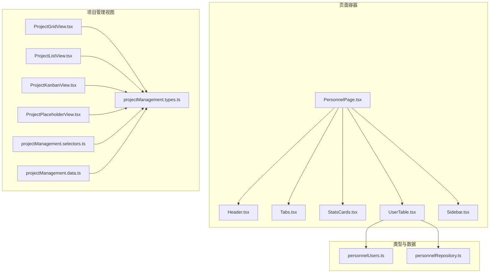
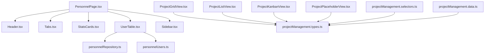
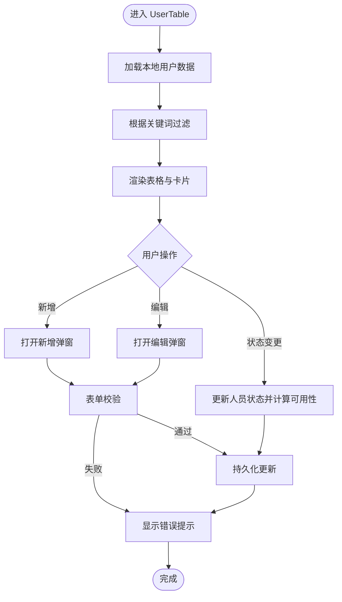
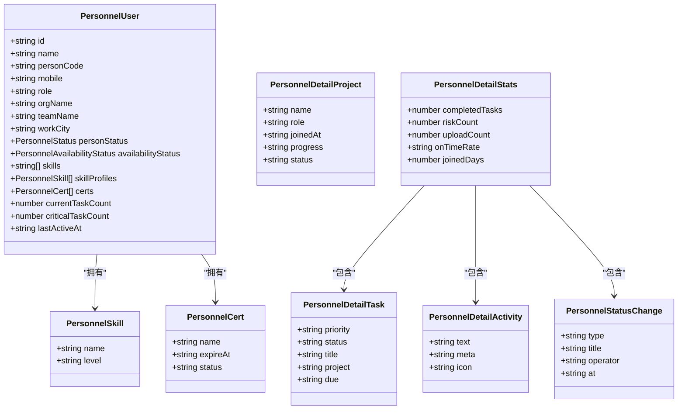
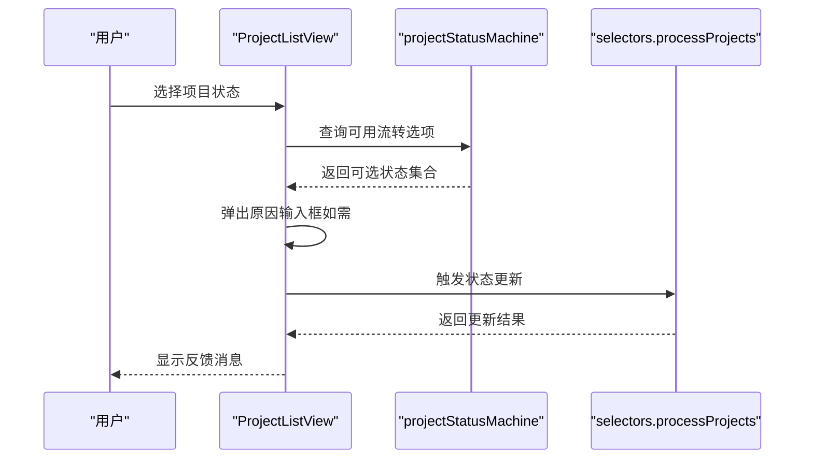
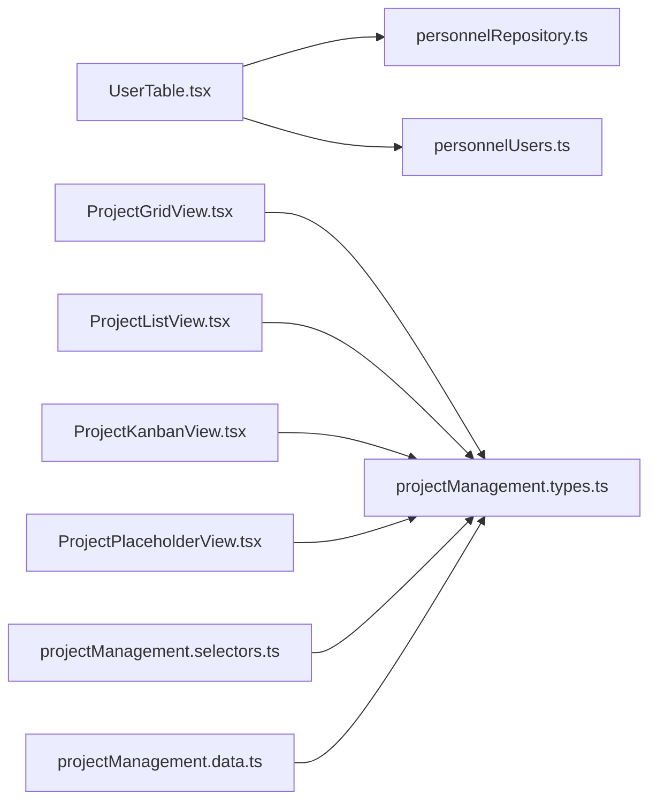

# 人员管理模块

<cite>
**本文引用的文件**
- [PersonnelPage.tsx](file://src/components/personnel/PersonnelPage.tsx)
- [UserTable.tsx](file://src/components/personnel/UserTable.tsx)
- [personnelUsers.ts](file://src/components/personnel/personnelUsers.ts)
- [personnelRepository.ts](file://src/services/repositories/personnelRepository.ts)
- [StatsCards.tsx](file://src/components/personnel/StatsCards.tsx)
- [Sidebar.tsx](file://src/components/personnel/Sidebar.tsx)
- [Header.tsx](file://src/components/personnel/Header.tsx)
- [Tabs.tsx](file://src/components/personnel/Tabs.tsx)
- [InsightsPanel.tsx](file://src/components/personnel/InsightsPanel.tsx)
- [projectManagement.data.ts](file://src/components/personnel/projectManagement.data.ts)
- [projectManagement.types.ts](file://src/components/personnel/projectManagement.types.ts)
- [projectManagement.selectors.ts](file://src/components/personnel/projectManagement.selectors.ts)
- [ProjectGridView.tsx](file://src/components/personnel/ProjectGridView.tsx)
- [ProjectListView.tsx](file://src/components/personnel/ProjectListView.tsx)
- [ProjectKanbanView.tsx](file://src/components/personnel/ProjectKanbanView.tsx)
- [ProjectPlaceholderView.tsx](file://src/components/personnel/ProjectPlaceholderView.tsx)
</cite>

## 目录

1. [简介](#简介)
2. [项目结构](#项目结构)
3. [核心组件](#核心组件)
4. [架构总览](#架构总览)
5. [详细组件分析](#详细组件分析)
6. [依赖关系分析](#依赖关系分析)
7. [性能考量](#性能考量)
8. [故障排除指南](#故障排除指南)
9. [结论](#结论)
10. [附录](#附录)

## 简介

本技术文档面向人员管理模块，系统性阐述员工信息管理、团队协作、项目分配机制与绩效统计分析等核心功能。文档从数据模型设计、视图组件实现逻辑与状态管理策略入手，深入解析项目管理模式切换、团队视图展示与成员统计分析等高级能力，并提供页面布局设计、组件间通信机制与数据同步策略的说明。最后给出扩展指南，包括自定义字段、权限控制与集成第三方HR系统的实现方案。

## 项目结构

人员管理模块采用“页面容器 + 视图组件 + 类型与仓库”的分层组织方式：

- 页面容器负责布局与顶层状态传递
- 视图组件承担具体展示与交互
- 类型定义统一数据契约
- 仓库封装本地持久化与数据访问

**图表来源**

- [PersonnelPage.tsx:1-37](file://src/components/personnel/PersonnelPage.tsx#L1-L37)
- [UserTable.tsx:1-540](file://src/components/personnel/UserTable.tsx#L1-L540)
- [personnelUsers.ts:1-416](file://src/components/personnel/personnelUsers.ts#L1-L416)
- [personnelRepository.ts:1-58](file://src/services/repositories/personnelRepository.ts#L1-L58)
- [projectManagement.types.ts:1-168](file://src/components/personnel/projectManagement.types.ts#L1-L168)
- [projectManagement.data.ts:1-313](file://src/components/personnel/projectManagement.data.ts#L1-L313)
- [projectManagement.selectors.ts:1-284](file://src/components/personnel/projectManagement.selectors.ts#L1-L284)
- [ProjectGridView.tsx:1-189](file://src/components/personnel/ProjectGridView.tsx#L1-L189)
- [ProjectListView.tsx:1-240](file://src/components/personnel/ProjectListView.tsx#L1-L240)
- [ProjectKanbanView.tsx:1-151](file://src/components/personnel/ProjectKanbanView.tsx#L1-L151)
- [ProjectPlaceholderView.tsx:1-128](file://src/components/personnel/ProjectPlaceholderView.tsx#L1-L128)

**章节来源**

- [PersonnelPage.tsx:1-37](file://src/components/personnel/PersonnelPage.tsx#L1-L37)
- [UserTable.tsx:1-540](file://src/components/personnel/UserTable.tsx#L1-L540)
- [personnelUsers.ts:1-416](file://src/components/personnel/personnelUsers.ts#L1-L416)
- [personnelRepository.ts:1-58](file://src/services/repositories/personnelRepository.ts#L1-L58)
- [projectManagement.types.ts:1-168](file://src/components/personnel/projectManagement.types.ts#L1-L168)
- [projectManagement.data.ts:1-313](file://src/components/personnel/projectManagement.data.ts#L1-L313)
- [projectManagement.selectors.ts:1-284](file://src/components/personnel/projectManagement.selectors.ts#L1-L284)
- [ProjectGridView.tsx:1-189](file://src/components/personnel/ProjectGridView.tsx#L1-L189)
- [ProjectListView.tsx:1-240](file://src/components/personnel/ProjectListView.tsx#L1-L240)
- [ProjectKanbanView.tsx:1-151](file://src/components/personnel/ProjectKanbanView.tsx#L1-L151)
- [ProjectPlaceholderView.tsx:1-128](file://src/components/personnel/ProjectPlaceholderView.tsx#L1-L128)

## 核心组件

- 员工信息管理
  - 用户表格组件负责员工列表展示、搜索过滤、状态变更与新增/编辑弹窗
  - 仓库模块负责本地持久化与用户ID生成
  - 数据模型定义了人员状态、可用性状态、技能证书与详情统计等字段
- 团队协作与项目分配
  - 项目管理视图组件提供网格、列表、看板等多种视图
  - 选择器层实现搜索、筛选、排序、分组与分页的纯函数处理
  - 项目数据与类型定义支撑项目阶段、状态、成员、任务树等结构
- 绩效统计分析
  - 统计卡片组件展示在岗人数、可分配人数、资质即将到期与超负载人数
  - 人员详情数据包含项目参与、任务、活动与状态变更等统计指标

**章节来源**

- [UserTable.tsx:1-540](file://src/components/personnel/UserTable.tsx#L1-L540)
- [personnelRepository.ts:1-58](file://src/services/repositories/personnelRepository.ts#L1-L58)
- [personnelUsers.ts:1-416](file://src/components/personnel/personnelUsers.ts#L1-L416)
- [StatsCards.tsx:1-41](file://src/components/personnel/StatsCards.tsx#L1-L41)
- [projectManagement.selectors.ts:1-284](file://src/components/personnel/projectManagement.selectors.ts#L1-L284)
- [projectManagement.types.ts:1-168](file://src/components/personnel/projectManagement.types.ts#L1-L168)
- [projectManagement.data.ts:1-313](file://src/components/personnel/projectManagement.data.ts#L1-L313)

## 架构总览

人员管理模块遵循“容器-组件-仓库-类型”的分层架构：

- 容器层：PersonnelPage 聚合布局与顶层状态
- 组件层：UserTable、StatsCards、Tabs、Sidebar 等负责UI与交互
- 仓库层：personnelRepository 封装本地存储与用户数据访问
- 类型层：personnelUsers 与 projectManagement.types 定义数据契约
- 选择器层：projectManagement.selectors 提供纯函数式数据处理

**图表来源**

- [PersonnelPage.tsx:1-37](file://src/components/personnel/PersonnelPage.tsx#L1-L37)
- [UserTable.tsx:1-540](file://src/components/personnel/UserTable.tsx#L1-L540)
- [personnelRepository.ts:1-58](file://src/services/repositories/personnelRepository.ts#L1-L58)
- [personnelUsers.ts:1-416](file://src/components/personnel/personnelUsers.ts#L1-L416)
- [projectManagement.types.ts:1-168](file://src/components/personnel/projectManagement.types.ts#L1-L168)
- [projectManagement.selectors.ts:1-284](file://src/components/personnel/projectManagement.selectors.ts#L1-L284)
- [projectManagement.data.ts:1-313](file://src/components/personnel/projectManagement.data.ts#L1-L313)
- [ProjectGridView.tsx:1-189](file://src/components/personnel/ProjectGridView.tsx#L1-L189)
- [ProjectListView.tsx:1-240](file://src/components/personnel/ProjectListView.tsx#L1-L240)
- [ProjectKanbanView.tsx:1-151](file://src/components/personnel/ProjectKanbanView.tsx#L1-L151)
- [ProjectPlaceholderView.tsx:1-128](file://src/components/personnel/ProjectPlaceholderView.tsx#L1-L128)

## 详细组件分析

### 员工信息管理（UserTable）

- 数据模型
  - 人员状态与可用性状态映射，支持在岗、请假、离岗、禁用与可分配、忙碌、不可分配
  - 技能与证书结构，支持技能列表与等级、证书有效期与状态
- 关键逻辑
  - 本地持久化：通过 localStorage 存储用户列表，初始化时从内置样本数据克隆
  - 表单校验：必填字段校验与错误反馈
  - 状态变更：根据人员状态动态计算可用性状态并更新最近活跃时间
  - 搜索过滤：基于姓名、手机号、工号的关键词过滤
- 视图与交互
  - 支持网格/列表视图切换（当前列表视图激活）
  - 提供筛选、排序、分页与操作按钮（编辑、查看详情）
  - 新增/编辑弹窗收集基础信息并生成唯一工号

**图表来源**

- [UserTable.tsx:119-296](file://src/components/personnel/UserTable.tsx#L119-L296)
- [personnelRepository.ts:13-57](file://src/services/repositories/personnelRepository.ts#L13-L57)
- [personnelUsers.ts:31-37](file://src/components/personnel/personnelUsers.ts#L31-L37)

**章节来源**

- [UserTable.tsx:1-540](file://src/components/personnel/UserTable.tsx#L1-L540)
- [personnelRepository.ts:1-58](file://src/services/repositories/personnelRepository.ts#L1-L58)
- [personnelUsers.ts:1-416](file://src/components/personnel/personnelUsers.ts#L1-L416)

### 人员数据模型与详情

- 数据模型
  - PersonnelUser：人员基本信息、组织团队、角色、雇佣类型、工作城市、状态与可用性、技能与证书、任务负载、风险等级、最近活跃时间、头像色调等
  - 可用性状态由人员状态推导
  - 人员详情包含项目参与、任务、活动、状态变更与统计指标
- 示例数据
  - 内置示例用户与默认详情数据，便于演示与测试

**图表来源**

- [personnelUsers.ts:4-100](file://src/components/personnel/personnelUsers.ts#L4-L100)

**章节来源**

- [personnelUsers.ts:1-416](file://src/components/personnel/personnelUsers.ts#L1-L416)

### 项目管理模式与视图组件

- 项目数据与类型
  - 项目列表、阶段、状态、里程碑、任务树、风险、成员等结构化数据
  - 支持多种视图模式：列表、网格、看板、日历、地图
- 选择器层
  - 提供统计筛选、搜索、高级筛选、排序、分组、分页与看板按阶段分列的纯函数
- 视图组件
  - 列表视图：支持状态变更选择与原因输入
  - 网格视图：卡片式概览与分页
  - 看板视图：按阶段分列展示
  - 占位视图：日历与地图视图的占位说明与统计概览

**图表来源**

- [ProjectListView.tsx:55-63](file://src/components/personnel/ProjectListView.tsx#L55-L63)
- [projectManagement.selectors.ts:217-261](file://src/components/personnel/projectManagement.selectors.ts#L217-L261)

**章节来源**

- [projectManagement.data.ts:1-313](file://src/components/personnel/projectManagement.data.ts#L1-L313)
- [projectManagement.types.ts:1-168](file://src/components/personnel/projectManagement.types.ts#L1-L168)
- [projectManagement.selectors.ts:1-284](file://src/components/personnel/projectManagement.selectors.ts#L1-L284)
- [ProjectListView.tsx:1-240](file://src/components/personnel/ProjectListView.tsx#L1-L240)
- [ProjectGridView.tsx:1-189](file://src/components/personnel/ProjectGridView.tsx#L1-L189)
- [ProjectKanbanView.tsx:1-151](file://src/components/personnel/ProjectKanbanView.tsx#L1-L151)
- [ProjectPlaceholderView.tsx:1-128](file://src/components/personnel/ProjectPlaceholderView.tsx#L1-L128)

### 统计面板与洞察面板

- 统计卡片
  - 展示在岗人数、可分配人数、资质即将到期、超负载人数等关键指标
- 洞察面板
  - 主动洞察卡片，按级别与来源分类，支持展开与对话模式

**章节来源**

- [StatsCards.tsx:1-41](file://src/components/personnel/StatsCards.tsx#L1-L41)
- [InsightsPanel.tsx:1-153](file://src/components/personnel/InsightsPanel.tsx#L1-L153)

### 页面布局与导航

- PersonnelPage
  - 左侧发光背景、侧边栏、主工作区布局
  - 聚合 Header、Tabs、StatsCards、UserTable
- Sidebar
  - 导航项与当前激活态判断，支持哈希路由跳转
- Header
  - 统一标题与搜索框，透传搜索状态
- Tabs
  - 用户列表、角色管理、技能资质、操作审计标签

**章节来源**

- [PersonnelPage.tsx:1-37](file://src/components/personnel/PersonnelPage.tsx#L1-L37)
- [Sidebar.tsx:1-95](file://src/components/personnel/Sidebar.tsx#L1-L95)
- [Header.tsx:1-20](file://src/components/personnel/Header.tsx#L1-L20)
- [Tabs.tsx:1-22](file://src/components/personnel/Tabs.tsx#L1-L22)

## 依赖关系分析

- 组件耦合
  - UserTable 依赖 personnelRepository 与 personnelUsers，形成“视图-仓库-模型”的清晰边界
  - 项目视图组件均依赖 projectManagement.types，选择器层提供纯函数处理，降低视图复杂度
- 外部依赖
  - 本地存储：localStorage 作为持久化介质
  - 图标资源：通过静态资源路径引用
- 循环依赖
  - 未发现循环依赖；类型定义独立于组件与仓库

**图表来源**

- [UserTable.tsx:1-540](file://src/components/personnel/UserTable.tsx#L1-L540)
- [personnelRepository.ts:1-58](file://src/services/repositories/personnelRepository.ts#L1-L58)
- [personnelUsers.ts:1-416](file://src/components/personnel/personnelUsers.ts#L1-L416)
- [ProjectGridView.tsx:1-189](file://src/components/personnel/ProjectGridView.tsx#L1-L189)
- [ProjectListView.tsx:1-240](file://src/components/personnel/ProjectListView.tsx#L1-L240)
- [ProjectKanbanView.tsx:1-151](file://src/components/personnel/ProjectKanbanView.tsx#L1-L151)
- [ProjectPlaceholderView.tsx:1-128](file://src/components/personnel/ProjectPlaceholderView.tsx#L1-L128)
- [projectManagement.types.ts:1-168](file://src/components/personnel/projectManagement.types.ts#L1-L168)
- [projectManagement.selectors.ts:1-284](file://src/components/personnel/projectManagement.selectors.ts#L1-L284)
- [projectManagement.data.ts:1-313](file://src/components/personnel/projectManagement.data.ts#L1-L313)

**章节来源**

- [UserTable.tsx:1-540](file://src/components/personnel/UserTable.tsx#L1-L540)
- [personnelRepository.ts:1-58](file://src/services/repositories/personnelRepository.ts#L1-L58)
- [personnelUsers.ts:1-416](file://src/components/personnel/personnelUsers.ts#L1-L416)
- [projectManagement.types.ts:1-168](file://src/components/personnel/projectManagement.types.ts#L1-L168)
- [projectManagement.selectors.ts:1-284](file://src/components/personnel/projectManagement.selectors.ts#L1-L284)
- [projectManagement.data.ts:1-313](file://src/components/personnel/projectManagement.data.ts#L1-L313)
- [ProjectGridView.tsx:1-189](file://src/components/personnel/ProjectGridView.tsx#L1-L189)
- [ProjectListView.tsx:1-240](file://src/components/personnel/ProjectListView.tsx#L1-L240)
- [ProjectKanbanView.tsx:1-151](file://src/components/personnel/ProjectKanbanView.tsx#L1-L151)
- [ProjectPlaceholderView.tsx:1-128](file://src/components/personnel/ProjectPlaceholderView.tsx#L1-L128)

## 性能考量

- 渲染优化
  - 使用 useMemo 缓存过滤与分组结果，减少重复计算
  - 表格与卡片渲染按需展示，避免一次性渲染大量节点
- 存储与同步
  - 本地存储写入在状态变更时触发，避免频繁 I/O
  - 初始化时从内置样本数据克隆，保证一致性
- 视图切换
  - 选择器层纯函数处理，避免在视图组件内进行复杂计算
  - 分页与分组分离，提升大数据量下的交互流畅度

## 故障排除指南

- 本地存储异常
  - personnelRepository 在持久化失败时静默忽略，确保应用稳定性
- 表单校验失败
  - UserTable 在提交前进行必填字段校验，错误信息通过反馈区域提示
- 状态变更无响应
  - 确认项目状态机可用流转选项存在且未被禁用
- 搜索无结果
  - 确认关键词与人员姓名、手机号、工号匹配规则

**章节来源**

- [personnelRepository.ts:27-33](file://src/services/repositories/personnelRepository.ts#L27-L33)
- [UserTable.tsx:175-203](file://src/components/personnel/UserTable.tsx#L175-L203)
- [ProjectListView.tsx:55-63](file://src/components/personnel/ProjectListView.tsx#L55-L63)

## 结论

人员管理模块通过清晰的分层架构与纯函数式数据处理，实现了员工信息管理、团队协作与项目分配的核心能力。模块具备良好的可扩展性与可维护性，为后续接入第三方HR系统、完善权限控制与增强统计分析提供了坚实基础。

## 附录

### 扩展指南

- 自定义字段
  - 在 PersonnelUser 类型中增加字段，并在 UserTable 的表单与持久化逻辑中同步处理
  - 在 personnelRepository 中扩展初始化与序列化逻辑
- 权限控制
  - 在 PersonnelPage 或 Sidebar 中引入权限校验，仅对具备相应角色的用户展示特定标签或操作
- 集成第三方HR系统
  - 替换 personnelRepository 的 loadUsers/saveUsers 为远程接口调用，保持现有类型与选择器层不变
  - 在 UserTable 中增加“同步”按钮，触发与HR系统的数据对账与拉取
