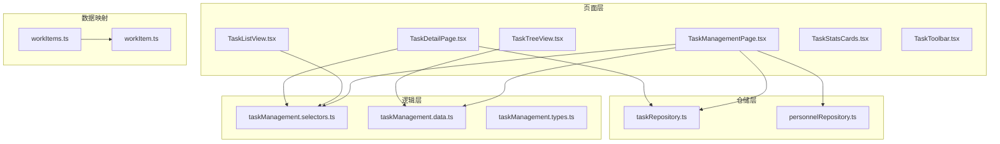
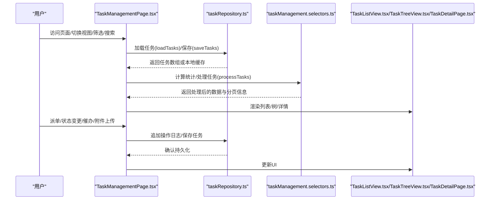
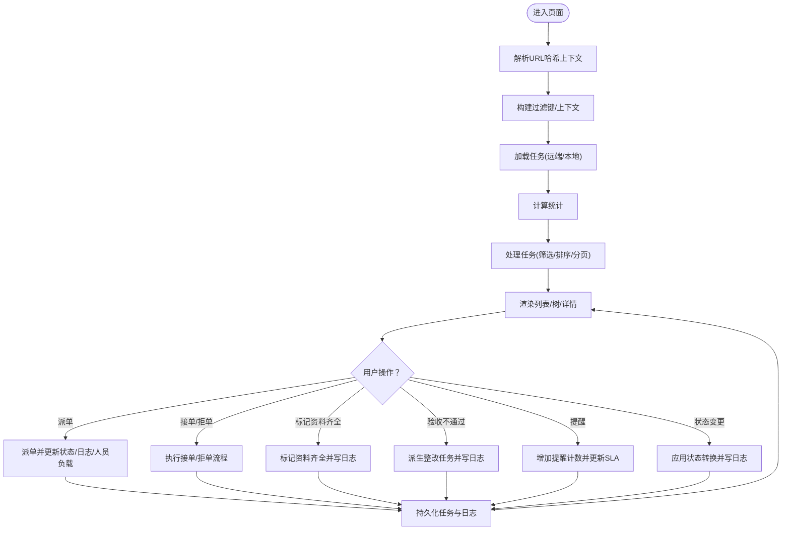
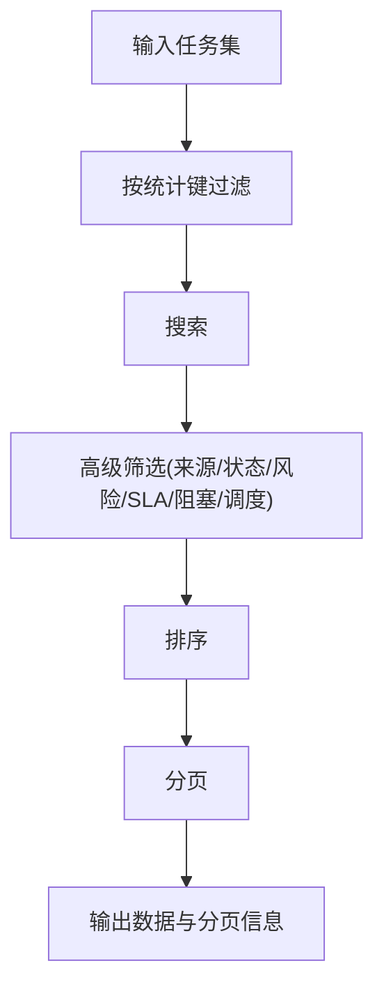
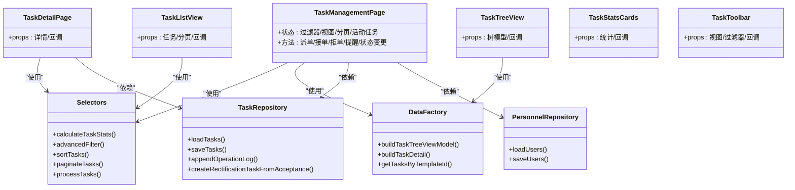

# 任务管理模块

<cite>
**本文引用的文件**
- [TaskManagementPage.tsx](file://src/components/task/TaskManagementPage.tsx)
- [taskManagement.data.ts](file://src/components/task/taskManagement.data.ts)
- [taskManagement.selectors.ts](file://src/components/task/taskManagement.selectors.ts)
- [taskManagement.types.ts](file://src/components/task/taskManagement.types.ts)
- [taskRepository.ts](file://src/services/repositories/taskRepository.ts)
- [TaskListView.tsx](file://src/components/task/TaskListView.tsx)
- [TaskTreeView.tsx](file://src/components/task/TaskTreeView.tsx)
- [TaskDetailPage.tsx](file://src/components/task/TaskDetailPage.tsx)
- [TaskStatsCards.tsx](file://src/components/task/TaskStatsCards.tsx)
- [TaskToolbar.tsx](file://src/components/task/TaskToolbar.tsx)
- [personnelRepository.ts](file://src/services/repositories/personnelRepository.ts)
- [workItems.ts](file://src/data/workItems.ts)
- [workItem.ts](file://src/domain/workItem.ts)
- [taskManagement.selectors.test.ts](file://src/components/task/__tests__/taskManagement.selectors.test.ts)
</cite>

## 目录

1. [简介](#简介)
2. [项目结构](#项目结构)
3. [核心组件](#核心组件)
4. [架构总览](#架构总览)
5. [详细组件分析](#详细组件分析)
6. [依赖关系分析](#依赖关系分析)
7. [性能考虑](#性能考虑)
8. [故障排查指南](#故障排查指南)
9. [结论](#结论)
10. [附录](#附录)

## 简介

本技术文档面向任务管理模块，系统性阐述任务中心的实现架构与核心能力，包括：

- 任务列表展示（网格、列表、看板、日历）
- 任务详情查看与交互
- 任务树形结构管理（基于WBS）
- 任务统计分析
- 数据模型与状态机
- 选择器模式与数据处理管线
- 组件层次结构、事件处理与数据绑定
- 创建、编辑、删除、状态更新等业务流程
- 扩展指南与最佳实践

## 项目结构

任务管理模块位于 src/components/task 下，围绕“页面容器 + 选择器 + 类型定义 + 数据仓库”的分层组织：

- 页面容器：TaskManagementPage.tsx
- 展示组件：TaskListView.tsx、TaskTreeView.tsx、TaskDetailPage.tsx、TaskStatsCards.tsx、TaskToolbar.tsx
- 数据与逻辑：taskManagement.data.ts（数据工厂、树构建）、taskManagement.selectors.ts（筛选/排序/分页/统计）、taskManagement.types.ts（类型定义）
- 仓储与持久化：taskRepository.ts（本地存储 + 远端适配）、personnelRepository.ts（人员数据）
- 数据映射：workItems.ts、workItem.ts（任务到工作项映射）

图表来源

- [TaskManagementPage.tsx:1-800](file://src/components/task/TaskManagementPage.tsx#L1-L800)
- [taskManagement.selectors.ts:1-166](file://src/components/task/taskManagement.selectors.ts#L1-L166)
- [taskManagement.data.ts:1-844](file://src/components/task/taskManagement.data.ts#L1-L844)
- [taskRepository.ts:1-318](file://src/services/repositories/taskRepository.ts#L1-L318)
- [personnelRepository.ts:1-58](file://src/services/repositories/personnelRepository.ts#L1-L58)
- [workItems.ts:1-441](file://src/data/workItems.ts#L1-L441)
- [workItem.ts:1-68](file://src/domain/workItem.ts#L1-L68)

章节来源

- [TaskManagementPage.tsx:1-800](file://src/components/task/TaskManagementPage.tsx#L1-L800)
- [taskManagement.data.ts:1-844](file://src/components/task/taskManagement.data.ts#L1-L844)
- [taskManagement.selectors.ts:1-166](file://src/components/task/taskManagement.selectors.ts#L1-L166)
- [taskManagement.types.ts:1-239](file://src/components/task/taskManagement.types.ts#L1-L239)
- [taskRepository.ts:1-318](file://src/services/repositories/taskRepository.ts#L1-L318)
- [personnelRepository.ts:1-58](file://src/services/repositories/personnelRepository.ts#L1-L58)
- [workItems.ts:1-441](file://src/data/workItems.ts#L1-L441)
- [workItem.ts:1-68](file://src/domain/workItem.ts#L1-L68)

## 核心组件

- 任务管理页面容器：负责状态管理、URL哈希上下文解析、远程/本地任务加载、操作日志与附件缓存、派单与状态变更、统计数据计算与视图渲染。
- 列表视图：支持网格、列表、看板、日历四种视图模式，内置分页与搜索。
- 树形视图：基于WBS的任务树，支持状态筛选、展开/收起、定位风险节点、派单。
- 详情页：执行与派单面板、标准与检查项、附件与提交记录、关联任务、流转时间轴、风险与催办。
- 统计卡片：关键指标卡片，支持点击切换统计维度。
- 工具栏：视图切换、搜索、分组、筛选、排序、新建任务入口。
- 选择器：统计、筛选、搜索、排序、分页、处理管线。
- 数据工厂：任务树构建、任务详情装配、模板实例化诊断。
- 仓储：任务状态持久化（本地 + 远端）、操作日志追加、验收整改任务派生。
- 类型定义：统一的任务状态、来源、风险、SLA、节点层级、任务项与详情结构。

章节来源

- [TaskManagementPage.tsx:196-800](file://src/components/task/TaskManagementPage.tsx#L196-L800)
- [TaskListView.tsx:1-308](file://src/components/task/TaskListView.tsx#L1-L308)
- [TaskTreeView.tsx:1-427](file://src/components/task/TaskTreeView.tsx#L1-L427)
- [TaskDetailPage.tsx:1-760](file://src/components/task/TaskDetailPage.tsx#L1-L760)
- [TaskStatsCards.tsx:1-87](file://src/components/task/TaskStatsCards.tsx#L1-L87)
- [TaskToolbar.tsx:1-221](file://src/components/task/TaskToolbar.tsx#L1-L221)
- [taskManagement.selectors.ts:1-166](file://src/components/task/taskManagement.selectors.ts#L1-L166)
- [taskManagement.data.ts:1-844](file://src/components/task/taskManagement.data.ts#L1-L844)
- [taskRepository.ts:1-318](file://src/services/repositories/taskRepository.ts#L1-L318)
- [taskManagement.types.ts:1-239](file://src/components/task/taskManagement.types.ts#L1-L239)

## 架构总览

任务管理采用“容器组件 + 展示组件 + 选择器 + 仓储 + 类型”的分层架构，数据流从远端或本地存储进入容器，经选择器管线处理后渲染到视图；用户交互触发容器中的回调，更新状态并持久化。

图表来源

- [TaskManagementPage.tsx:276-311](file://src/components/task/TaskManagementPage.tsx#L276-L311)
- [taskRepository.ts:141-169](file://src/services/repositories/taskRepository.ts#L141-L169)
- [taskManagement.selectors.ts:127-144](file://src/components/task/taskManagement.selectors.ts#L127-L144)

## 详细组件分析

### 任务管理页面容器（TaskManagementPage）

职责与特性：

- 解析URL哈希上下文，构建初始过滤键，支持模板、项目、来源类型等维度。
- 状态管理：搜索词、过滤器、视图模式、分页、活动任务、模板/项目/来源上下文、任务集合、操作日志与附件缓存。
- 生命周期：监听hashchange，动态切换上下文并重置分页；异步加载任务，优先远端，失败回退本地；变更时持久化。
- 业务动作：派单、接单/拒单、标记资料齐全、验收不通过派生整改、提醒、状态更新、计算统计与处理管线。
- 人员与推荐：加载人员、构建可派单选项、基于技能/负载/风险的推荐算法。
- 详情合并：将任务详情与运行时日志/附件合并，形成最终详情对象。

图表来源

- [TaskManagementPage.tsx:196-800](file://src/components/task/TaskManagementPage.tsx#L196-L800)
- [taskRepository.ts:141-195](file://src/services/repositories/taskRepository.ts#L141-L195)

章节来源

- [TaskManagementPage.tsx:196-800](file://src/components/task/TaskManagementPage.tsx#L196-L800)
- [taskRepository.ts:141-195](file://src/services/repositories/taskRepository.ts#L141-L195)

### 列表视图（TaskListView）

职责与特性：

- 支持 grid/list/kanban/calendar 四种视图模式。
- 内置分页控件与搜索提示。
- 看板模式按状态分组，日历模式按计划开始日期分组。
- 提供状态变更回调，结合类型定义的状态转换规则。

章节来源

- [TaskListView.tsx:1-308](file://src/components/task/TaskListView.tsx#L1-L308)
- [taskManagement.types.ts:26-51](file://src/components/task/taskManagement.types.ts#L26-L51)

### 树形视图（TaskTreeView）

职责与特性：

- 将任务集合构建为树形结构（项目/工作包/任务），支持状态聚合与进度平均。
- 提供状态筛选（全部/进行中/已完成/风险/待开始）、展开/收起、定位首个风险节点。
- 支持节点选择、负责人编辑、打开任务详情。
- 与人员选项联动，限制不可派单人员。

章节来源

- [TaskTreeView.tsx:1-427](file://src/components/task/TaskTreeView.tsx#L1-L427)
- [taskManagement.data.ts:672-738](file://src/components/task/taskManagement.data.ts#L672-L738)

### 任务详情页（TaskDetailPage）

职责与特性：

- 详情与日志双标签页。
- 执行与派单面板：负责人选择、推荐资源、关键字段行内编辑（计划时间、风险等级、状态）、状态应用。
- 标准与检查项、附件上传/删除、提交记录、关联任务、风险与催办、审计记录。
- 只读态保护：已完成/已关闭状态禁止编辑。

章节来源

- [TaskDetailPage.tsx:1-760](file://src/components/task/TaskDetailPage.tsx#L1-L760)
- [taskManagement.types.ts:53-54](file://src/components/task/taskManagement.types.ts#L53-L54)

### 统计卡片（TaskStatsCards）

职责与特性：

- 展示任务总数、待派单池、执行中、待提交、待验收、超时/预警、阻塞等指标。
- 支持点击切换统计维度，联动容器更新过滤器。

章节来源

- [TaskStatsCards.tsx:1-87](file://src/components/task/TaskStatsCards.tsx#L1-L87)

### 工具栏（TaskToolbar）

职责与特性：

- 视图切换、搜索、分组菜单、筛选菜单（来源/状态/风险/SLA/阻塞/调度）、排序菜单、新建任务按钮。

章节来源

- [TaskToolbar.tsx:1-221](file://src/components/task/TaskToolbar.tsx#L1-L221)

### 选择器模式（taskManagement.selectors）

职责与特性：

- 统计：按状态、来源统计任务数量。
- 筛选：来源、状态、风险、SLA、阻塞、调度池。
- 搜索：名称/编码/项目/路径/类型模糊匹配。
- 排序：按计划结束时间升序、风险降序、催办次数降序。
- 分页：安全页码回退。
- 处理管线：先按统计维度过滤，再搜索，再高级筛选，再排序，最后分页。

图表来源

- [taskManagement.selectors.ts:127-144](file://src/components/task/taskManagement.selectors.ts#L127-L144)

章节来源

- [taskManagement.selectors.ts:1-166](file://src/components/task/taskManagement.selectors.ts#L1-166)

### 数据工厂（taskManagement.data）

职责与特性：

- 任务树构建：从任务集合生成树节点，聚合子节点状态与进度，分配编码。
- 任务详情装配：补充执行/验收标准、检查项、关联关系、默认日志与附件。
- 模板实例化：根据项目模板生成任务种子并映射为任务项，支持诊断信息。
- 任务类型/来源/来源类型/派发状态推断。

章节来源

- [taskManagement.data.ts:560-738](file://src/components/task/taskManagement.data.ts#L560-L738)
- [taskManagement.data.ts:460-533](file://src/components/task/taskManagement.data.ts#L460-L533)
- [taskManagement.data.ts:740-800](file://src/components/task/taskManagement.data.ts#L740-L800)

### 仓储与持久化（taskRepository）

职责与特性：

- 本地存储：任务状态、操作日志、模板审计事件。
- 远端适配：通过serverAdapter进行任务状态与审计日志的同步。
- 验收整改：根据验收节点派生整改任务，生成唯一任务编码与日志。
- 错误回退：网络异常时仅使用本地缓存。

章节来源

- [taskRepository.ts:141-318](file://src/services/repositories/taskRepository.ts#L141-L318)

### 人员仓储（personnelRepository）

职责与特性：

- 本地存储人员状态（技能、证书、当前任务数、可用性状态）。
- 提供人员加载与保存接口，支持派单后负载更新。

章节来源

- [personnelRepository.ts:1-58](file://src/services/repositories/personnelRepository.ts#L1-L58)

### 数据映射（workItems/workItem）

职责与特性：

- 将任务项映射为工作项（项目/工作包/任务/子任务/里程碑），用于WBS与甘特视图。
- 状态映射：阻塞、进行中、完成、计划。

章节来源

- [workItems.ts:411-441](file://src/data/workItems.ts#L411-L441)
- [workItem.ts:49-67](file://src/domain/workItem.ts#L49-L67)

## 依赖关系分析

图表来源

- [TaskManagementPage.tsx:196-800](file://src/components/task/TaskManagementPage.tsx#L196-L800)
- [taskManagement.selectors.ts:1-166](file://src/components/task/taskManagement.selectors.ts#L1-L166)
- [taskManagement.data.ts:1-844](file://src/components/task/taskManagement.data.ts#L1-L844)
- [taskRepository.ts:141-318](file://src/services/repositories/taskRepository.ts#L141-L318)
- [personnelRepository.ts:1-58](file://src/services/repositories/personnelRepository.ts#L1-58)

章节来源

- [TaskManagementPage.tsx:196-800](file://src/components/task/TaskManagementPage.tsx#L196-L800)
- [taskManagement.selectors.ts:1-166](file://src/components/task/taskManagement.selectors.ts#L1-L166)
- [taskManagement.data.ts:1-844](file://src/components/task/taskManagement.data.ts#L1-L844)
- [taskRepository.ts:141-318](file://src/services/repositories/taskRepository.ts#L141-L318)
- [personnelRepository.ts:1-58](file://src/services/repositories/personnelRepository.ts#L1-58)

## 性能考虑

- 选择器管线：将筛选、搜索、排序、分页组合为单一处理函数，避免重复遍历，提升复杂查询性能。
- 本地缓存优先：任务与日志优先读取localStorage，网络失败回退，减少请求抖动。
- 懒加载与分页：列表分页避免一次性渲染大量DOM。
- 状态最小化：容器组件集中管理状态，展示组件纯渲染，降低重渲染成本。
- 推荐算法：评分与排序在内存中完成，注意大数据量时的优化（如限流/节流）。
- 事件去抖：工具栏的搜索与过滤建议使用防抖，避免频繁刷新。

## 故障排查指南

常见问题与定位：

- 任务未显示或为空：检查URL哈希上下文是否正确，确认模板/项目/来源类型是否匹配；查看容器中是否成功加载任务。
- 状态无法变更：确认当前状态是否允许目标状态转换；检查只读状态（已完成/已关闭）。
- 派单无效：确认人员可用性状态；检查禁用选项集合；确认任务状态是否需要先推进到“待执行”。
- 日志未记录：确认本地存储权限；检查网络请求是否抛错；查看远端适配器返回。
- 树形视图异常：检查任务集合是否包含父路径；确认树构建逻辑是否正确生成编码与父子关系。
- 性能问题：关注选择器管线的复杂度；对大数据量场景启用分页与搜索；避免不必要的深度拷贝。

章节来源

- [TaskManagementPage.tsx:276-311](file://src/components/task/TaskManagementPage.tsx#L276-L311)
- [taskRepository.ts:141-195](file://src/services/repositories/taskRepository.ts#L141-L195)
- [taskManagement.selectors.test.ts:1-102](file://src/components/task/__tests__/taskManagement.selectors.test.ts#L1-L102)

## 结论

任务管理模块通过清晰的分层架构与选择器模式，实现了从数据到视图的高效处理链路。容器组件承担状态与业务逻辑，展示组件专注渲染，仓储负责持久化与远端同步，类型定义确保一致性。模块具备良好的扩展性与可维护性，适合在多项目、多来源、多视图的复杂场景下演进。

## 附录

### 数据模型与状态机

- 任务状态：待创建、待分配、待执行、执行中、待提交、待验收、不通过、已完成、已关闭。
- 状态转换映射：定义了每个状态允许的下一步状态集合。
- 只读状态：已完成/已关闭。
- 风险等级：低风险、中风险、高风险。
- SLA状态：正常、即将超时、超时。
- 任务来源：项目任务、维修保养、巡检任务、合规任务、临时任务。
- 节点层级：项目、工作包、任务、子任务。

章节来源

- [taskManagement.types.ts:3-53](file://src/components/task/taskManagement.types.ts#L3-L53)
- [taskManagement.types.ts:66-133](file://src/components/task/taskManagement.types.ts#L66-L133)

### 选择器单元测试要点

- 统计口径：覆盖全部、待派单池、执行中、待提交、待验收、SLA风险、阻塞、来源分布。
- 高级筛选：来源与阻塞联合过滤。
- 排序：风险降序。
- 处理管线：按提醒次数降序，分页越界回退。
- 分页：越界页码回落到有效页。

章节来源

- [taskManagement.selectors.test.ts:1-102](file://src/components/task/__tests__/taskManagement.selectors.test.ts#L1-L102)
