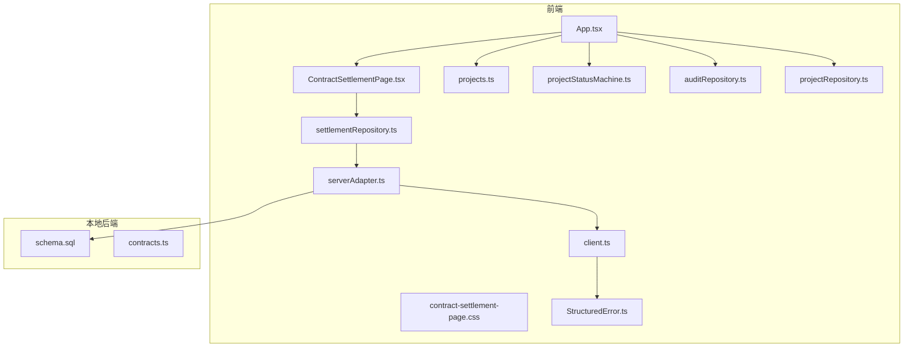
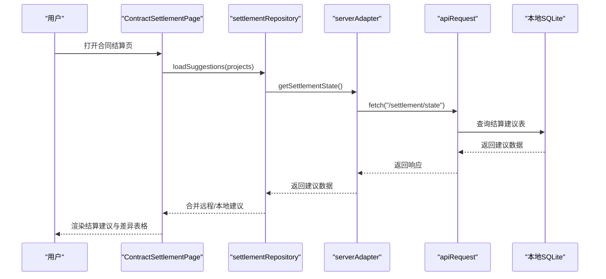
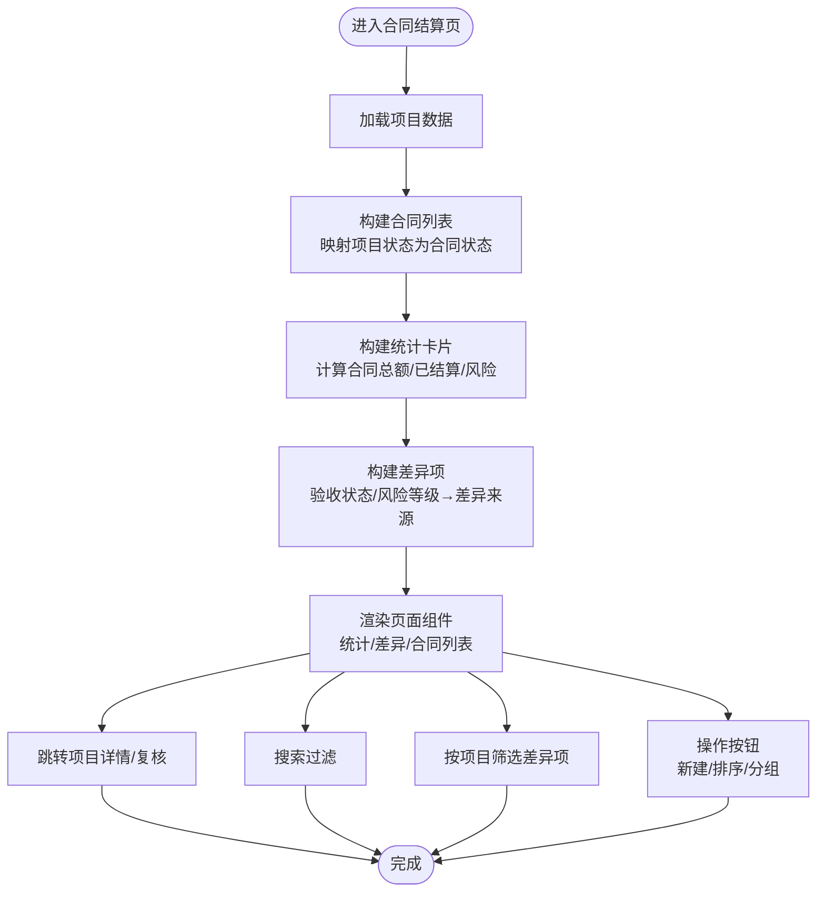
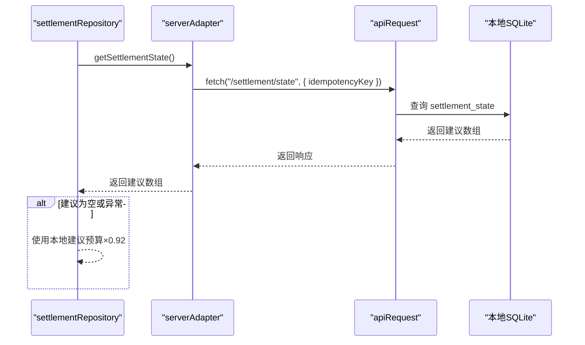
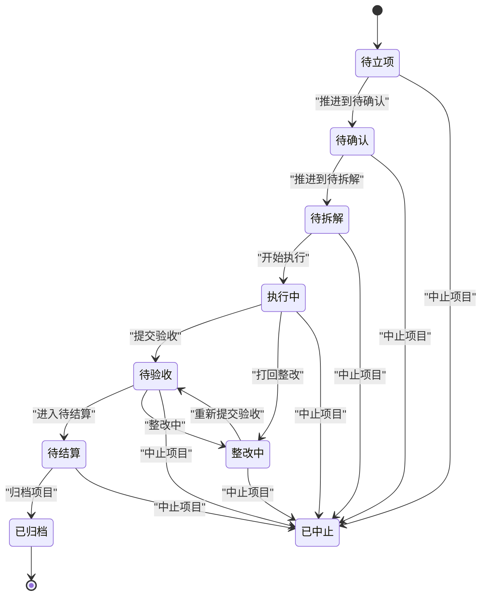
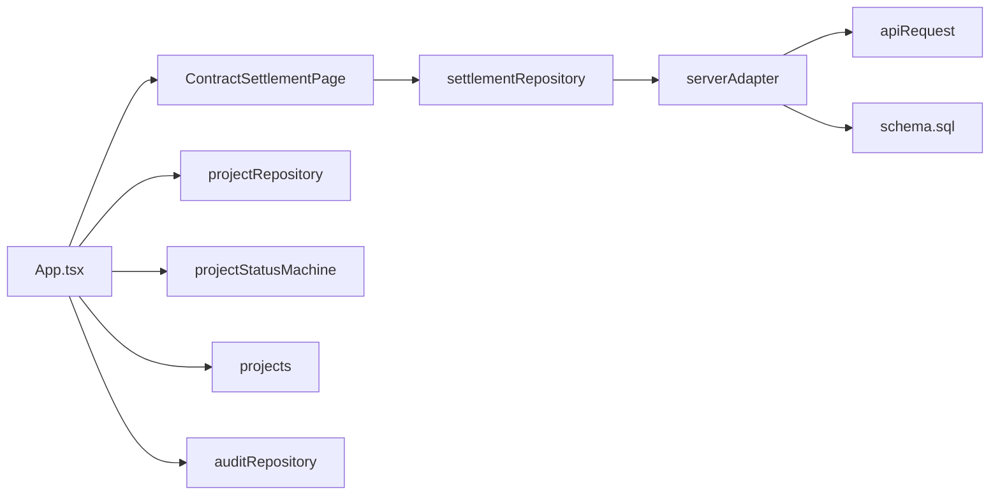
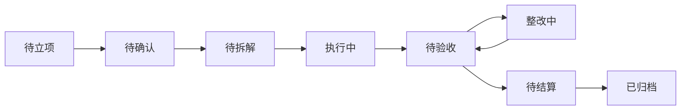

# 合同结算模块

<cite>
**本文档引用的文件**
- [ContractSettlementPage.tsx](file://src/components/contracts/ContractSettlementPage.tsx)
- [contract-settlement-page.css](file://src/components/contracts/contract-settlement-page.css)
- [workflowContract.ts](file://src/services/contracts/workflowContract.ts)
- [settlementRepository.ts](file://src/services/repositories/settlementRepository.ts)
- [serverAdapter.ts](file://src/services/api/serverAdapter.ts)
- [client.ts](file://src/services/api/client.ts)
- [projects.ts](file://src/data/projects.ts)
- [projectStatusMachine.ts](file://src/domain/projectStatusMachine.ts)
- [App.tsx](file://src/App.tsx)
- [projectRepository.ts](file://src/services/repositories/projectRepository.ts)
- [auditRepository.ts](file://src/services/repositories/auditRepository.ts)
- [StructuredError.ts](file://src/services/errors/StructuredError.ts)
- [schema.sql](file://local-api/store/schema.sql)
- [contracts.ts](file://local-api/contracts.ts)
</cite>

## 目录

1. [简介](#简介)
2. [项目结构](#项目结构)
3. [核心组件](#核心组件)
4. [架构总览](#架构总览)
5. [详细组件分析](#详细组件分析)
6. [依赖关系分析](#依赖关系分析)
7. [性能考虑](#性能考虑)
8. [故障排查指南](#故障排查指南)
9. [结论](#结论)
10. [附录](#附录)

## 简介

本模块围绕合同管理、结算流程与财务处理展开，提供合同列表、结算草案差异分析、结算建议展示与项目追溯能力。系统通过项目状态机驱动合同生命周期，结合验收状态与预算差异计算，形成“验收→结算草案→财务确认→归档”的闭环流程。前端采用 React 组件化实现，后端提供本地 SQLite 模拟的 API 接口，支持幂等性与审计日志。

## 项目结构

合同结算模块位于前端 src/components/contracts 下，核心文件包括：

- ContractSettlementPage.tsx：合同结算页面主组件，负责渲染统计卡片、差异表格、合同列表与操作工具栏
- contract-settlement-page.css：页面样式与响应式布局
- 仓库与服务层：
  - settlementRepository.ts：结算建议加载与本地/远程合并策略
  - serverAdapter.ts：统一 API 适配器，封装项目/任务/验收/结算/审计接口
  - client.ts：通用 HTTP 客户端，含重试、幂等键与降级事件
- 数据与领域模型：
  - projects.ts：项目数据模型与扩展字段（预算、验收状态、结算状态等）
  - projectStatusMachine.ts：项目状态机与流转守卫
- 应用入口与路由：
  - App.tsx：路由解析与页面挂载，处理合同页路由
- 本地 API 与数据库：
  - schema.sql：本地 SQLite 表结构（项目/任务/验收/结算/审计/幂等）
  - contracts.ts：本地 API 的契约类型定义

**图表来源**

- [ContractSettlementPage.tsx:1-583](file://src/components/contracts/ContractSettlementPage.tsx#L1-L583)
- [contract-settlement-page.css:1-731](file://src/components/contracts/contract-settlement-page.css#L1-L731)
- [settlementRepository.ts:1-32](file://src/services/repositories/settlementRepository.ts#L1-L32)
- [serverAdapter.ts:1-87](file://src/services/api/serverAdapter.ts#L1-L87)
- [client.ts:1-172](file://src/services/api/client.ts#L1-L172)
- [projects.ts:1-451](file://src/data/projects.ts#L1-L451)
- [projectStatusMachine.ts:1-164](file://src/domain/projectStatusMachine.ts#L1-L164)
- [App.tsx:1-879](file://src/App.tsx#L1-L879)
- [auditRepository.ts:1-26](file://src/services/repositories/auditRepository.ts#L1-L26)
- [projectRepository.ts:1-90](file://src/services/repositories/projectRepository.ts#L1-L90)
- [StructuredError.ts:1-195](file://src/services/errors/StructuredError.ts#L1-L195)
- [schema.sql:1-72](file://local-api/store/schema.sql#L1-L72)
- [contracts.ts:1-89](file://local-api/contracts.ts#L1-L89)

**章节来源**

- [ContractSettlementPage.tsx:1-583](file://src/components/contracts/ContractSettlementPage.tsx#L1-L583)
- [contract-settlement-page.css:1-731](file://src/components/contracts/contract-settlement-page.css#L1-L731)
- [App.tsx:786-792](file://src/App.tsx#L786-L792)

## 核心组件

- 合同结算页面组件
  - 功能：构建合同列表、统计卡片、结算差异表格、结算建议面板与搜索过滤
  - 关键逻辑：根据项目状态映射合同状态；按预算字段计算统计值；基于验收状态与风险等级生成结算差异项
  - 交互：支持搜索、筛选、分页、新建合同跳转与项目详情追溯
- 结算仓库
  - 功能：加载结算建议，优先使用远程返回，失败时回退本地建议
  - 本地建议算法：按预算的 92% 估算草案金额
- API 适配器与客户端
  - 功能：封装 GET/PUT/POST 请求，注入幂等键，统一错误处理与重试
  - 降级机制：云端不可用时触发降级事件，提示本地兜底
- 项目状态机与数据模型
  - 功能：定义项目状态、可用流转、守卫条件与状态钩子；扩展项目字段（预算、验收、结算状态等）

**章节来源**

- [ContractSettlementPage.tsx:94-171](file://src/components/contracts/ContractSettlementPage.tsx#L94-L171)
- [settlementRepository.ts:20-31](file://src/services/repositories/settlementRepository.ts#L20-L31)
- [serverAdapter.ts:44-86](file://src/services/api/serverAdapter.ts#L44-L86)
- [client.ts:83-171](file://src/services/api/client.ts#L83-L171)
- [projects.ts:26-45](file://src/data/projects.ts#L26-L45)
- [projectStatusMachine.ts:105-163](file://src/domain/projectStatusMachine.ts#L105-L163)

## 架构总览

合同结算模块采用“页面组件 + 仓库层 + API 适配器 + 本地后端”的分层架构。页面组件负责 UI 渲染与用户交互，仓库层负责数据聚合与降级策略，API 层负责网络请求与幂等性保障，本地后端提供 SQLite 存储与模拟接口。

**图表来源**

- [ContractSettlementPage.tsx:203-219](file://src/components/contracts/ContractSettlementPage.tsx#L203-L219)
- [settlementRepository.ts:20-31](file://src/services/repositories/settlementRepository.ts#L20-L31)
- [serverAdapter.ts:75-75](file://src/services/api/serverAdapter.ts#L75-L75)
- [client.ts:83-171](file://src/services/api/client.ts#L83-L171)
- [schema.sql:33-40](file://local-api/store/schema.sql#L33-L40)

## 详细组件分析

### 合同结算页面组件

- 页面布局
  - 顶部导航与搜索区、统计卡片区、结算建议区、差异项表格区、合同列表区、分页区
  - 响应式设计：在小屏设备上自动调整布局与控件尺寸
- 数据构建
  - 合同列表：从项目集合派生，映射项目状态为合同状态，格式化金额与进度
  - 统计卡片：本年度合同总额、累计已结算金额、预算超支风险
  - 差异项：基于验收状态与风险等级生成差异来源、草案金额、差异率与处理建议
- 交互行为
  - 搜索：支持合同名称/编号模糊匹配
  - 差异筛选：按项目代码筛选差异项
  - 追溯与复核：点击“追溯项目”跳转项目详情；发起复核打开项目结算复核面板
  - 新建合同：跳转至项目创建页

**图表来源**

- [ContractSettlementPage.tsx:191-583](file://src/components/contracts/ContractSettlementPage.tsx#L191-L583)

**章节来源**

- [ContractSettlementPage.tsx:191-583](file://src/components/contracts/ContractSettlementPage.tsx#L191-L583)
- [contract-settlement-page.css:1-731](file://src/components/contracts/contract-settlement-page.css#L1-L731)

### 结算仓库与 API 适配器

- 结算仓库
  - 本地建议：当项目结算状态为“草案待确认”时，按预算的 92% 生成建议金额
  - 远程优先：尝试从服务器获取建议，若失败则回退本地建议
- API 适配器
  - 提供 getSettlementState 接口，统一注入环境参数与幂等键
  - appendAuditLog 写入审计日志，带幂等键避免重复
- 客户端
  - 自动重试（408/425/429/500/502/503/504），失败后触发降级事件
  - 支持 X-Idempotency-Key 头部，确保幂等性

**图表来源**

- [settlementRepository.ts:20-31](file://src/services/repositories/settlementRepository.ts#L20-L31)
- [serverAdapter.ts:75-75](file://src/services/api/serverAdapter.ts#L75-L75)
- [client.ts:83-171](file://src/services/api/client.ts#L83-L171)
- [schema.sql:33-40](file://local-api/store/schema.sql#L33-L40)

**章节来源**

- [settlementRepository.ts:20-31](file://src/services/repositories/settlementRepository.ts#L20-L31)
- [serverAdapter.ts:44-86](file://src/services/api/serverAdapter.ts#L44-L86)
- [client.ts:83-171](file://src/services/api/client.ts#L83-L171)

### 项目状态机与数据模型

- 项目状态机
  - 状态：待立项、待确认、待拆解、执行中、待验收、整改中、待结算、已归档、已中止
  - 可用流转：根据守卫条件判断是否允许状态变更
  - 守卫：校验项目容器、审批、里程碑、任务树、标准绑定、关键任务完成度、验收结果、整改闭环、结算完成度等
- 项目数据模型
  - 扩展字段：预算、团队规模、日期区间、描述、派单/执行/验收/结算状态、待办数量、阶段/里程碑/任务树/风险/成员等
  - 风险等级：低/中/高/严重，用于影响结算状态与建议

**图表来源**

- [projectStatusMachine.ts:47-80](file://src/domain/projectStatusMachine.ts#L47-L80)
- [projectStatusMachine.ts:105-163](file://src/domain/projectStatusMachine.ts#L105-L163)

**章节来源**

- [projectStatusMachine.ts:1-164](file://src/domain/projectStatusMachine.ts#L1-L164)
- [projects.ts:26-45](file://src/data/projects.ts#L26-L45)

### 审计与错误处理

- 审计日志
  - 通过 appendAuditLog 写入审计表，包含场景、详情、项目编码与时间戳
  - 写入失败不阻断主流程，记录结构化错误
- 错误处理
  - StructuredError 提供统一错误模型，支持网络/业务/幂等冲突等错误分类
  - 客户端自动重试与降级事件，增强可观测性

**章节来源**

- [auditRepository.ts:6-25](file://src/services/repositories/auditRepository.ts#L6-L25)
- [StructuredError.ts:27-127](file://src/services/errors/StructuredError.ts#L27-L127)
- [client.ts:54-81](file://src/services/api/client.ts#L54-L81)

## 依赖关系分析

- 组件耦合
  - ContractSettlementPage 依赖 settlementRepository 与项目数据模型
  - settlementRepository 依赖 serverAdapter 与本地建议策略
  - serverAdapter 依赖 apiRequest 与本地 SQLite
- 外部依赖
  - 本地 SQLite：提供项目/任务/验收/结算/审计/幂等表
  - 浏览器环境变量：VITE_API_BASE_URL、VITE_TCB_ENV_ID 控制 API 基地址与环境标识
- 可能的循环依赖
  - 当前模块未发现循环依赖，App.tsx 仅作为路由入口，不反向依赖页面组件

**图表来源**

- [ContractSettlementPage.tsx:1-5](file://src/components/contracts/ContractSettlementPage.tsx#L1-L5)
- [settlementRepository.ts:1-2](file://src/services/repositories/settlementRepository.ts#L1-L2)
- [serverAdapter.ts:1-5](file://src/services/api/serverAdapter.ts#L1-L5)
- [client.ts:34-36](file://src/services/api/client.ts#L34-L36)
- [schema.sql:4-11](file://local-api/store/schema.sql#L4-L11)
- [App.tsx:15-38](file://src/App.tsx#L15-L38)

**章节来源**

- [App.tsx:1-879](file://src/App.tsx#L1-L879)
- [schema.sql:1-72](file://local-api/store/schema.sql#L1-L72)

## 性能考虑

- 渲染优化
  - 使用 useMemo 缓存合同列表、统计卡片与差异项，避免重复计算
  - 列表虚拟化：在大数据量场景建议引入虚拟滚动
- 网络请求
  - apiRequest 默认重试 1 次，对 408/425/429/500/502/503/504 自动重试
  - 幂等键避免重复提交带来的副作用
- 本地存储
  - 项目状态与日志本地持久化，提升首屏加载速度与离线体验

[本节为通用指导，无需具体文件分析]

## 故障排查指南

- 云端服务不可用
  - 现象：弹窗提示“云端服务暂时不可用，已启用本地兜底”
  - 原因：VITE_API_BASE_URL 未配置或网络异常
  - 处理：检查环境变量与网络连通性，确认本地 SQLite 数据库可用
- 结算建议为空
  - 现象：结算建议区为空
  - 原因：远程接口异常或返回空数组
  - 处理：查看网络日志与降级事件，确认本地建议回退逻辑生效
- 幂等冲突
  - 现象：重复提交导致冲突
  - 处理：检查 X-Idempotency-Key 是否正确传递，避免重复触发相同操作
- 审计日志写入失败
  - 现象：无审计记录
  - 处理：查看 StructuredError 日志，确认网络与权限问题

**章节来源**

- [client.ts:54-81](file://src/services/api/client.ts#L54-L81)
- [client.ts:142-159](file://src/services/api/client.ts#L142-L159)
- [auditRepository.ts:17-24](file://src/services/repositories/auditRepository.ts#L17-L24)
- [StructuredError.ts:183-194](file://src/services/errors/StructuredError.ts#L183-L194)

## 结论

合同结算模块通过清晰的页面组件、稳健的仓库层与本地后端，实现了从合同列表到结算差异分析的完整链路。项目状态机与守卫机制确保了业务流程的合规性，而幂等性与审计日志增强了系统的可靠性与可追溯性。后续可在结算规则、审批流程与财务系统集成方面进行扩展。

[本节为总结性内容，无需具体文件分析]

## 附录

### 合同审批、执行监控与结算完成的业务流程

- 审批与执行监控
  - 项目状态：待立项→待确认→待拆解→执行中→待验收→整改中→待结算
  - 验收状态：待初验→整改中→待复验→已验收，影响结算状态
- 结算完成
  - 待结算→已归档：结算完成且无风险
  - 草案待确认：验收通过后生成结算草案，等待财务确认

**图表来源**

- [projectStatusMachine.ts:59-69](file://src/domain/projectStatusMachine.ts#L59-L69)
- [projectStatusMachine.ts:146-160](file://src/domain/projectStatusMachine.ts#L146-L160)

### 扩展指南

- 自定义结算规则
  - 在 settlementRepository 中调整本地建议算法（如预算×系数、风险加权）
  - 在 serverAdapter 中新增结算规则接口，支持远程动态配置
- 审批流程配置
  - 在 workflowContract 中扩展角色权限矩阵与流转守卫条件
  - 在 projectStatusMachine 中新增状态与守卫，确保业务合规
- 财务系统集成
  - 在 serverAdapter 中新增财务接口（如结算确认、差异审批）
  - 在本地 SQLite 中新增财务表与审计日志表，保证一致性
- 用户界面扩展
  - 在 ContractSettlementPage 中新增审批状态徽章、财务意见输入框与批量操作按钮
  - 在样式文件中补充新组件的视觉规范与响应式适配

[本节为概念性扩展建议，无需具体文件分析]
