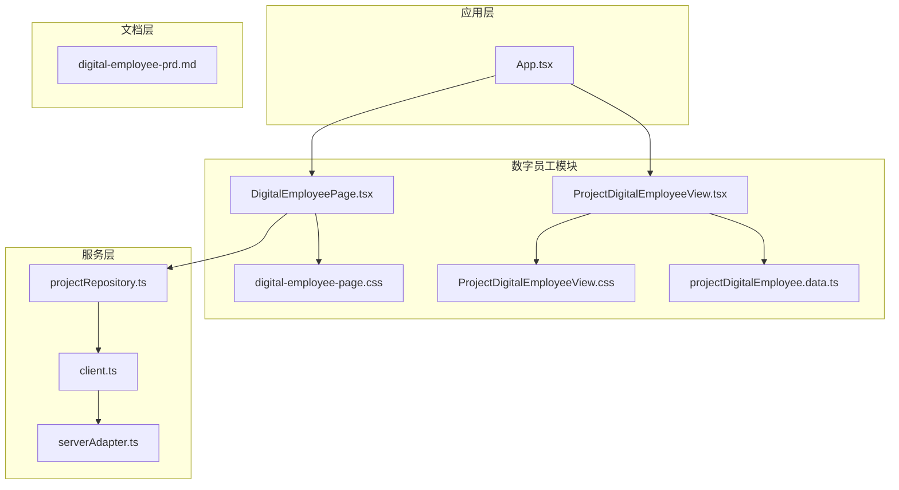
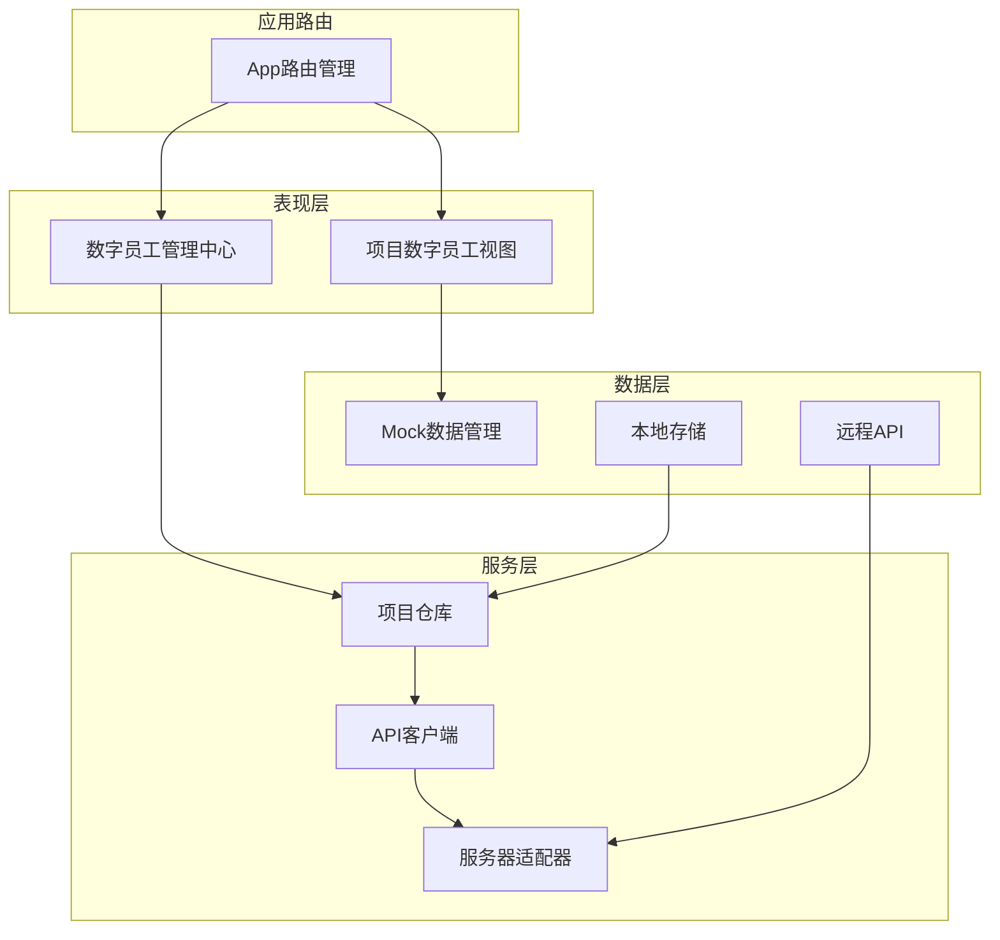
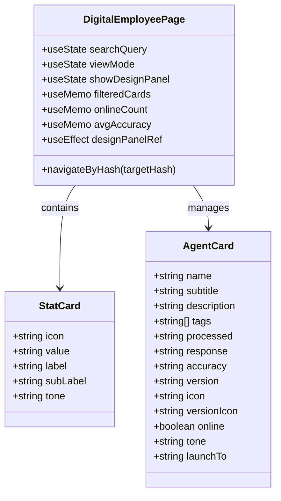
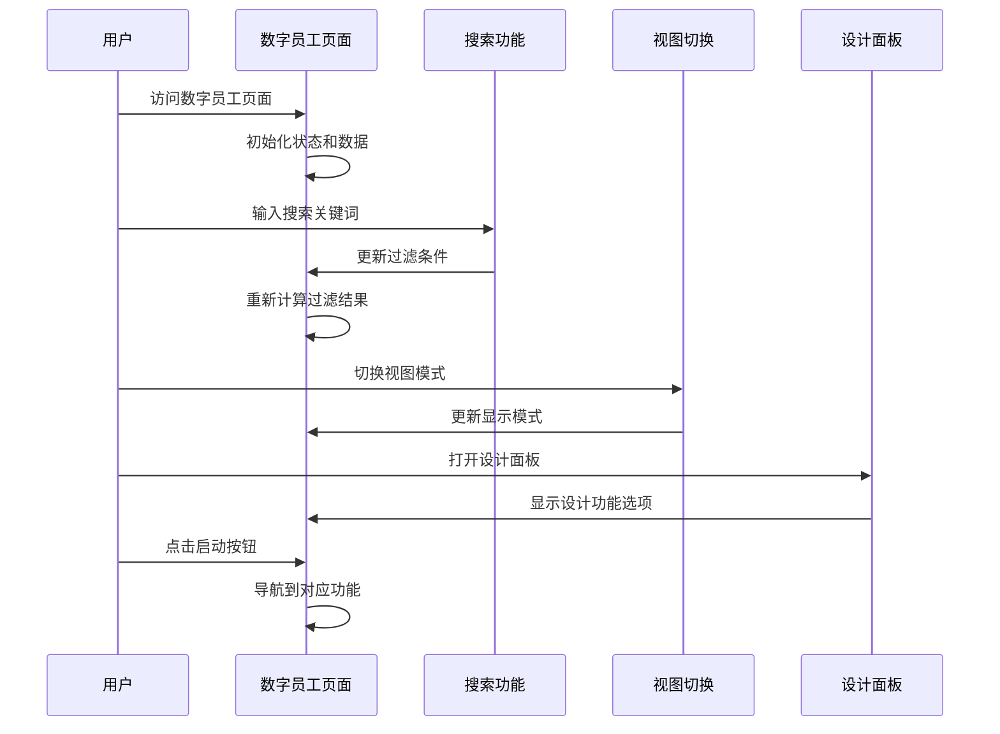
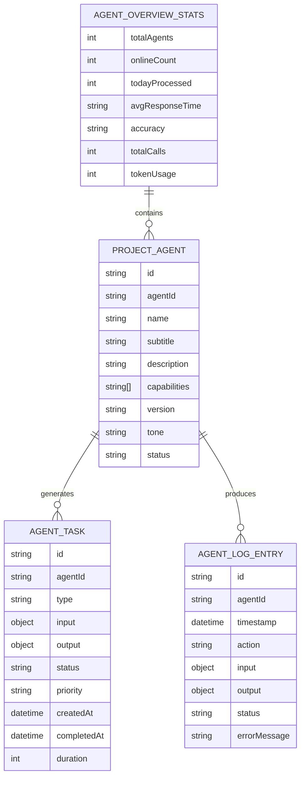
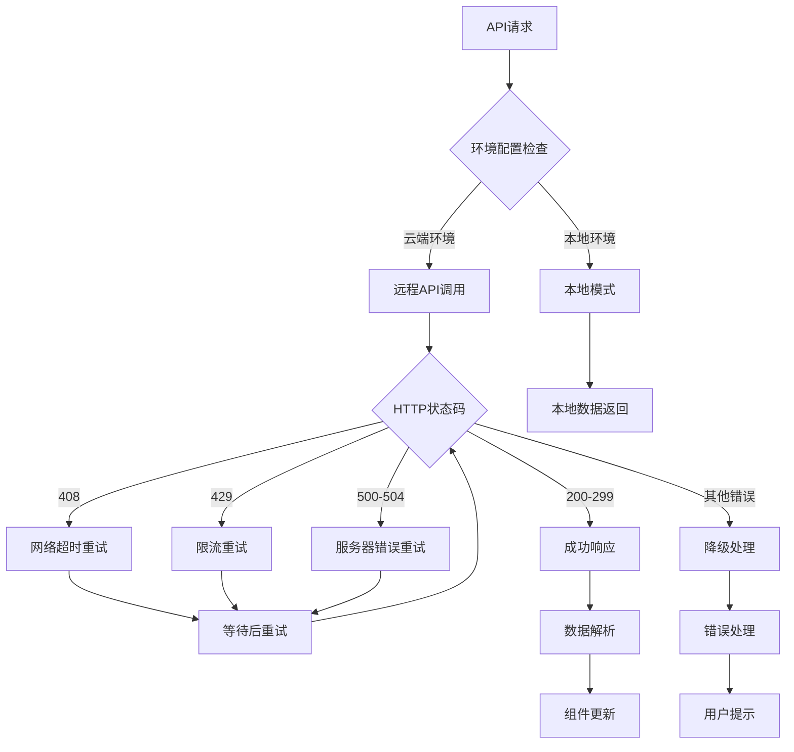
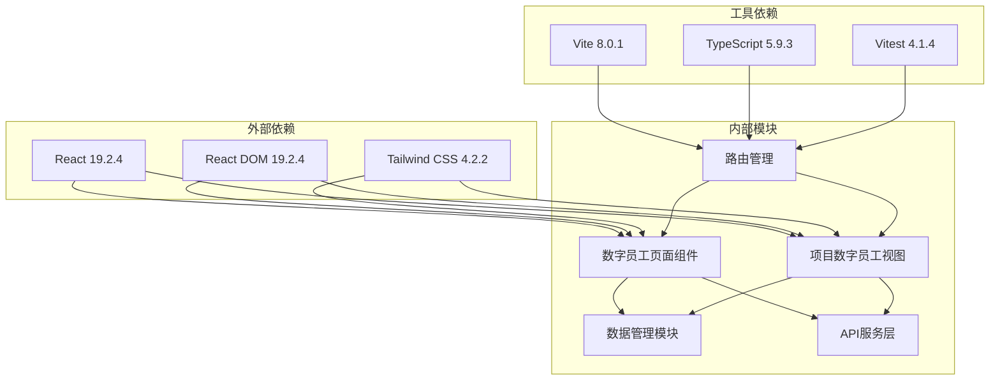

# 数字员工模块

<cite>
**本文档引用的文件**
- [DigitalEmployeePage.tsx](file://src/components/digital/DigitalEmployeePage.tsx)
- [digital-employee-page.css](file://src/components/digital/digital-employee-page.css)
- [ProjectDigitalEmployeeView.tsx](file://src/components/project/ProjectDigitalEmployeeView.tsx)
- [ProjectDigitalEmployeeView.css](file://src/components/project/ProjectDigitalEmployeeView.css)
- [projectDigitalEmployee.data.ts](file://src/components/project/projectDigitalEmployee.data.ts)
- [projectRepository.ts](file://src/services/repositories/projectRepository.ts)
- [client.ts](file://src/services/api/client.ts)
- [serverAdapter.ts](file://src/services/api/serverAdapter.ts)
- [App.tsx](file://src/App.tsx)
- [digital-employee-prd.md](file://docs/01-product/digital-employee-prd.md)
- [package.json](file://package.json)
</cite>

## 目录

1. [简介](#简介)
2. [项目结构](#项目结构)
3. [核心组件](#核心组件)
4. [架构概览](#架构概览)
5. [详细组件分析](#详细组件分析)
6. [依赖关系分析](#依赖关系分析)
7. [性能考虑](#性能考虑)
8. [故障排除指南](#故障排除指南)
9. [结论](#结论)
10. [附录](#附录)

## 简介

数字员工模块是项目管理系统中的AI智能助手中心，旨在为项目管理提供全方位的智能化支持。该模块集成了多个专业的AI Agent，包括工程师助手、客户经理助手、采购专员助手、合同财务助手、质检审计助手和数据分析助手，为用户提供智能问答、任务建议和项目辅助等核心功能。

模块采用现代化的React技术栈构建，实现了响应式设计和良好的用户体验。通过统一的Agent管理界面，用户可以轻松管理和配置各种AI助手，实现项目全生命周期的智能化管理。

## 项目结构

数字员工模块在项目中的组织结构如下：

**图表来源**

- [DigitalEmployeePage.tsx:1-599](file://src/components/digital/DigitalEmployeePage.tsx#L1-L599)
- [ProjectDigitalEmployeeView.tsx:1-143](file://src/components/project/ProjectDigitalEmployeeView.tsx#L1-L143)
- [projectRepository.ts:1-90](file://src/services/repositories/projectRepository.ts#L1-L90)

**章节来源**

- [DigitalEmployeePage.tsx:1-599](file://src/components/digital/DigitalEmployeePage.tsx#L1-L599)
- [ProjectDigitalEmployeeView.tsx:1-143](file://src/components/project/ProjectDigitalEmployeeView.tsx#L1-L143)
- [projectRepository.ts:1-90](file://src/services/repositories/projectRepository.ts#L1-L90)

## 核心组件

### 数字员工管理中心

数字员工管理中心是整个模块的核心界面，提供了Agent的统一管理功能：

- **Agent目录管理**：展示所有可用的AI助手，支持卡片和列表两种视图模式
- **搜索与筛选**：支持按名称、描述、标签等关键词搜索，按状态、类型进行筛选
- **统计面板**：实时显示活跃Agent数量、今日处理任务数、平均响应时间和综合准确率
- **设计功能**：提供快速设计入口，支持模板库、样式预设和字段配置

### 项目级数字员工视图

项目级视图专注于单个项目内的Agent管理：

- **Agent接入状态**：显示已接入项目的Agent列表及其运行状态
- **功能模块**：提供Agent配置、任务队列和运行监控三大功能模块
- **统计数据**：展示项目级的Agent使用情况和性能指标

### 数据管理组件

模块包含丰富的Mock数据，用于演示和测试：

- **Agent概览统计**：包含总数、在线数量、今日处理量等关键指标
- **Agent任务队列**：模拟各种类型的Agent任务，包括数据分析、自动化测试、代码审查等
- **运行日志**：记录Agent的执行历史和状态变化
- **配置模板**：提供可复用的Agent配置模板

**章节来源**

- [DigitalEmployeePage.tsx:36-140](file://src/components/digital/DigitalEmployeePage.tsx#L36-L140)
- [ProjectDigitalEmployeeView.tsx:8-143](file://src/components/project/ProjectDigitalEmployeeView.tsx#L8-L143)
- [projectDigitalEmployee.data.ts:19-535](file://src/components/project/projectDigitalEmployee.data.ts#L19-L535)

## 架构概览

数字员工模块采用分层架构设计，实现了清晰的关注点分离：

**图表来源**

- [App.tsx:346-800](file://src/App.tsx#L346-L800)
- [projectRepository.ts:53-90](file://src/services/repositories/projectRepository.ts#L53-L90)
- [client.ts:83-172](file://src/services/api/client.ts#L83-L172)

### 数据流架构

模块实现了完整的数据流管理机制：

1. **数据获取**：通过项目仓库从本地存储或远程API获取数据
2. **状态管理**：使用React Hooks管理组件状态和生命周期
3. **数据持久化**：支持本地存储和远程同步
4. **错误处理**：实现完善的错误捕获和降级机制

**章节来源**

- [projectRepository.ts:14-90](file://src/services/repositories/projectRepository.ts#L14-L90)
- [client.ts:13-172](file://src/services/api/client.ts#L13-L172)

## 详细组件分析

### 数字员工管理中心组件

数字员工管理中心是模块的主要交互界面，实现了丰富的功能特性：

#### 核心功能特性

- **响应式布局**：支持多种屏幕尺寸，自适应不同设备
- **多视图模式**：提供卡片视图和列表视图两种展示方式
- **实时搜索**：支持关键词搜索和智能过滤
- **状态指示**：清晰显示Agent的在线状态和运行指标

#### 组件结构分析

**图表来源**

- [DigitalEmployeePage.tsx:4-26](file://src/components/digital/DigitalEmployeePage.tsx#L4-L26)

#### 用户交互流程

**图表来源**

- [DigitalEmployeePage.tsx:196-250](file://src/components/digital/DigitalEmployeePage.tsx#L196-L250)

**章节来源**

- [DigitalEmployeePage.tsx:196-599](file://src/components/digital/DigitalEmployeePage.tsx#L196-L599)

### 项目数字员工视图组件

项目级数字员工视图为单个项目提供专门的Agent管理功能：

#### 功能模块设计

- **Agent接入管理**：展示项目已接入的Agent及其状态
- **功能模块导航**：提供Agent配置、任务队列、运行监控三个核心功能入口
- **统计信息展示**：实时显示项目级的Agent使用情况

#### 数据结构设计

**图表来源**

- [projectDigitalEmployee.data.ts:19-535](file://src/components/project/projectDigitalEmployee.data.ts#L19-L535)

**章节来源**

- [ProjectDigitalEmployeeView.tsx:8-143](file://src/components/project/ProjectDigitalEmployeeView.tsx#L8-L143)
- [projectDigitalEmployee.data.ts:56-252](file://src/components/project/projectDigitalEmployee.data.ts#L56-L252)

### API通信架构

模块实现了健壮的API通信机制，支持本地和远程数据访问：

#### API客户端设计

**图表来源**

- [client.ts:83-172](file://src/services/api/client.ts#L83-L172)

#### 服务器适配器功能

服务器适配器提供了统一的API访问接口：

- **项目状态管理**：获取和保存项目状态数据
- **任务状态管理**：管理任务相关的状态信息
- **验收状态管理**：处理项目验收相关的数据
- **结算状态管理**：管理项目结算相关的数据
- **审计日志记录**：提供审计日志的写入功能

**章节来源**

- [client.ts:13-172](file://src/services/api/client.ts#L13-L172)
- [serverAdapter.ts:44-87](file://src/services/api/serverAdapter.ts#L44-L87)

## 依赖关系分析

数字员工模块的依赖关系体现了清晰的分层架构：

**图表来源**

- [package.json:17-46](file://package.json#L17-L46)

### 核心依赖分析

模块的关键依赖包括：

- **React生态系统**：使用最新的React 19.2.4版本，支持最新的React特性
- **构建工具链**：采用Vite作为构建工具，提供快速的开发体验
- **样式框架**：使用Tailwind CSS实现响应式设计
- **测试框架**：集成Vitest提供全面的测试支持

**章节来源**

- [package.json:1-48](file://package.json#L1-L48)

## 性能考虑

数字员工模块在设计时充分考虑了性能优化：

### 渲染性能优化

- **虚拟滚动**：对于大量数据的列表，采用虚拟滚动技术提升渲染性能
- **懒加载**：页面组件采用懒加载策略，减少初始包大小
- **状态优化**：使用useMemo和useCallback避免不必要的重渲染

### 网络性能优化

- **请求重试**：实现智能的请求重试机制，提高网络请求的成功率
- **缓存策略**：结合本地存储和远程缓存，减少重复请求
- **降级机制**：在网络异常时提供本地降级功能

### 内存管理

- **垃圾回收**：合理管理组件生命周期，避免内存泄漏
- **数据清理**：及时清理不再使用的数据和事件监听器

## 故障排除指南

### 常见问题诊断

#### API连接问题

当遇到API连接失败时，系统会自动触发降级机制：

1. **检查环境配置**：确认VITE_API_BASE_URL和VITE_TCB_ENV_ID配置正确
2. **验证网络连接**：检查网络是否正常，防火墙设置是否正确
3. **查看错误日志**：通过浏览器开发者工具查看具体的错误信息

#### 数据加载问题

如果出现数据加载异常：

1. **检查本地存储**：确认localStorage中是否有损坏的数据
2. **验证API响应**：检查远程API的响应格式和状态码
3. **查看降级提示**：系统会在控制台输出降级相关信息

#### 性能问题

针对性能问题的排查步骤：

1. **监控内存使用**：使用浏览器性能面板检查内存占用
2. **分析渲染时间**：使用React DevTools分析组件渲染性能
3. **检查网络请求**：分析API请求的响应时间和频率

**章节来源**

- [client.ts:54-81](file://src/services/api/client.ts#L54-L81)
- [App.tsx:366-389](file://src/App.tsx#L366-L389)

## 结论

数字员工模块是一个功能完整、架构清晰的AI智能助手管理系统。通过统一的Agent管理界面，用户可以轻松地配置和使用各种AI助手，实现项目全生命周期的智能化管理。

模块的主要优势包括：

- **完整的功能体系**：涵盖了项目管理的各个方面，提供全方位的智能化支持
- **优秀的用户体验**：采用现代化的设计理念，提供直观易用的操作界面
- **健壮的技术架构**：实现了清晰的分层设计和完善的错误处理机制
- **良好的扩展性**：模块化的设计便于后续的功能扩展和定制开发

随着项目的进一步发展，数字员工模块将继续演进，为用户提供更加智能和高效的项目管理体验。

## 附录

### 扩展指南

#### 自定义AI模型集成

要集成新的AI模型，需要：

1. **定义数据接口**：在`projectDigitalEmployee.types.ts`中定义新的Agent类型
2. **实现配置界面**：在`ProjectDigitalEmployeeView.tsx`中添加相应的配置选项
3. **集成API调用**：在`serverAdapter.ts`中添加新的API端点
4. **更新Mock数据**：在`projectDigitalEmployee.data.ts`中添加测试数据

#### 功能插件开发

开发新的功能插件需要：

1. **创建插件组件**：在`src/components/`目录下创建新的组件文件
2. **实现插件逻辑**：编写插件的核心功能代码
3. **集成到路由系统**：在`App.tsx`中添加路由配置
4. **添加样式支持**：创建对应的CSS文件实现样式设计

#### 与项目管理模块深度集成

要实现更深层次的集成：

1. **数据共享**：通过共享的状态管理实现数据互通
2. **事件驱动**：利用事件系统实现模块间的松耦合通信
3. **统一认证**：实现单点登录和权限管理
4. **审计日志**：建立完整的操作审计和追踪机制
