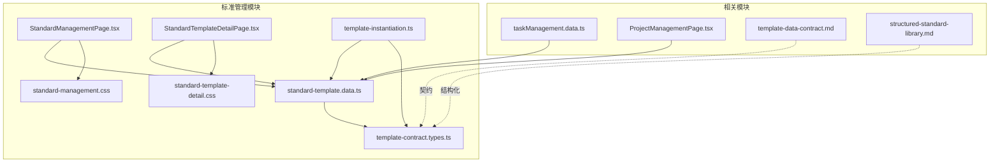
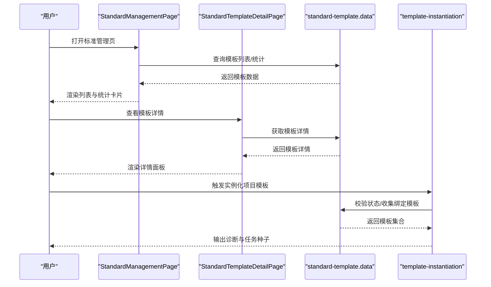
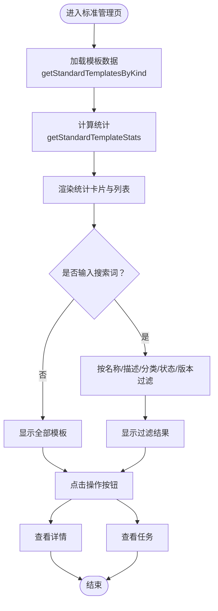
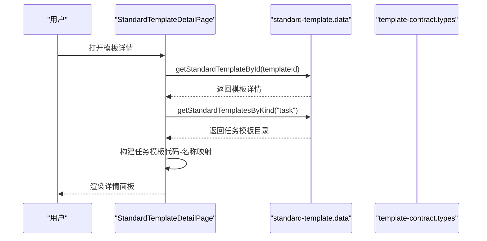
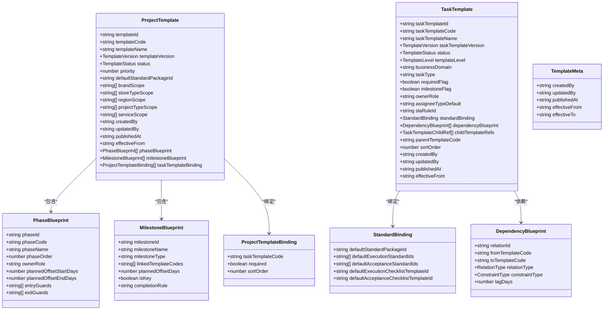
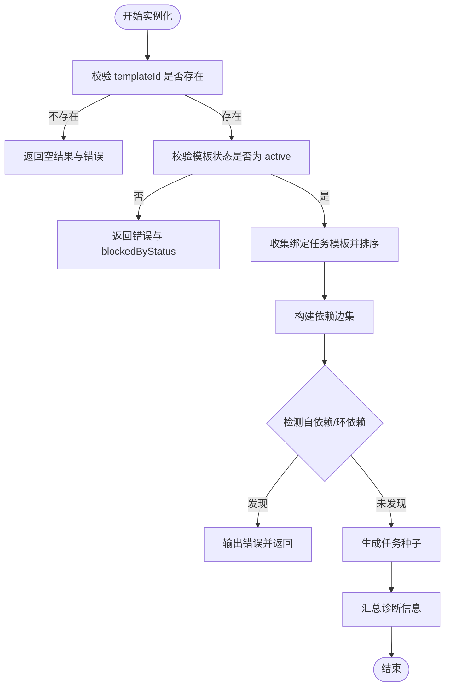
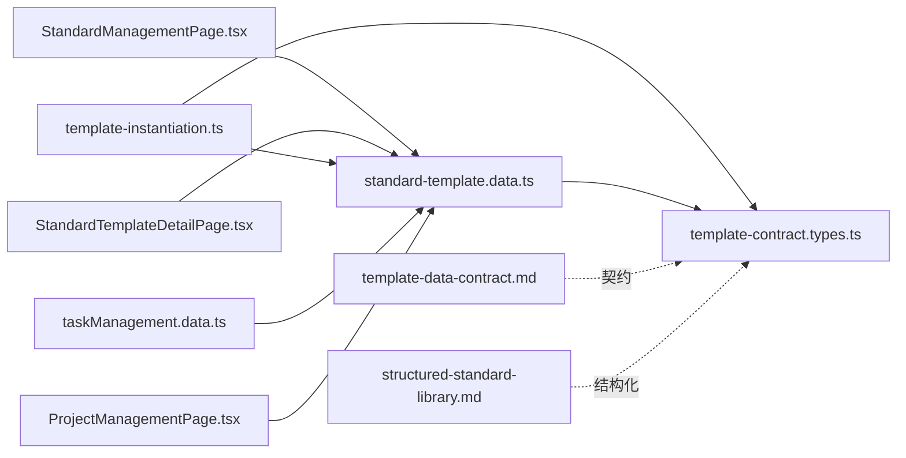

# 标准管理模块

<cite>
**本文档引用的文件**
- [StandardManagementPage.tsx](file://src/components/standard/StandardManagementPage.tsx)
- [StandardTemplateDetailPage.tsx](file://src/components/standard/StandardTemplateDetailPage.tsx)
- [standard-template.data.ts](file://src/components/standard/standard-template.data.ts)
- [template-contract.types.ts](file://src/components/standard/template-contract.types.ts)
- [template-instantiation.ts](file://src/components/standard/template-instantiation.ts)
- [standard-management.css](file://src/components/standard/standard-management.css)
- [standard-template-detail.css](file://src/components/standard/standard-template-detail.css)
- [template-data-contract.md](file://docs/02-architecture/template-data-contract.md)
- [structured-standard-library.md](file://docs/02-architecture/structured-standard-library.md)
- [taskManagement.data.ts](file://src/components/task/taskManagement.data.ts)
- [ProjectManagementPage.tsx](file://src/components/project/ProjectManagementPage.tsx)
</cite>

## 目录

1. [简介](#简介)
2. [项目结构](#项目结构)
3. [核心组件](#核心组件)
4. [架构总览](#架构总览)
5. [详细组件分析](#详细组件分析)
6. [依赖关系分析](#依赖关系分析)
7. [性能考量](#性能考量)
8. [故障排查指南](#故障排查指南)
9. [结论](#结论)
10. [附录](#附录)

## 简介

本技术文档围绕标准管理模块展开，系统性阐述项目管理标准模板库的实现，涵盖标准模板的创建、编辑、分类与版本管理；深入解析标准模板的数据模型设计、模板实例化流程与最佳实践管理机制；说明标准管理页面的用户界面设计、模板详情展示与实例化操作的实现逻辑；包含模板搜索过滤、批量操作与权限控制功能；并提供扩展指南，包括自定义模板字段、模板继承机制与与项目管理模块的集成方案。

## 项目结构

标准管理模块位于 src/components/standard 目录，主要由以下文件构成：

- 页面组件：StandardManagementPage.tsx（标准管理列表页）、StandardTemplateDetailPage.tsx（模板详情页）
- 数据与契约：standard-template.data.ts（模板目录与统计数据）、template-contract.types.ts（模板类型契约）、template-instantiation.ts（模板实例化逻辑）
- 样式：standard-management.css、standard-template-detail.css
- 文档：template-data-contract.md（模板数据契约）、structured-standard-library.md（标准库结构化说明）

**图表来源**

- [StandardManagementPage.tsx:1-282](file://src/components/standard/StandardManagementPage.tsx#L1-L282)
- [StandardTemplateDetailPage.tsx:1-363](file://src/components/standard/StandardTemplateDetailPage.tsx#L1-L363)
- [standard-template.data.ts:1-408](file://src/components/standard/standard-template.data.ts#L1-L408)
- [template-contract.types.ts:1-244](file://src/components/standard/template-contract.types.ts#L1-L244)
- [template-instantiation.ts:1-192](file://src/components/standard/template-instantiation.ts#L1-L192)
- [taskManagement.data.ts:509-551](file://src/components/task/taskManagement.data.ts#L509-L551)
- [ProjectManagementPage.tsx:1-200](file://src/components/project/ProjectManagementPage.tsx#L1-L200)

**章节来源**

- [StandardManagementPage.tsx:1-282](file://src/components/standard/StandardManagementPage.tsx#L1-L282)
- [StandardTemplateDetailPage.tsx:1-363](file://src/components/standard/StandardTemplateDetailPage.tsx#L1-L363)
- [standard-template.data.ts:1-408](file://src/components/standard/standard-template.data.ts#L1-L408)
- [template-contract.types.ts:1-244](file://src/components/standard/template-contract.types.ts#L1-L244)
- [template-instantiation.ts:1-192](file://src/components/standard/template-instantiation.ts#L1-L192)
- [standard-management.css:1-635](file://src/components/standard/standard-management.css#L1-L635)
- [standard-template-detail.css:1-680](file://src/components/standard/standard-template-detail.css#L1-L680)
- [template-data-contract.md:1-294](file://docs/02-architecture/template-data-contract.md#L1-L294)
- [structured-standard-library.md:1-800](file://docs/02-architecture/structured-standard-library.md#L1-L800)

## 核心组件

- 标准管理页面（StandardManagementPage）
  - 负责展示模板列表、统计卡片、搜索过滤、视图切换与工具栏按钮等
  - 支持按项目模板/任务模板两类进行切换与筛选
  - 提供“查看详情/查看任务”等操作入口
- 模板详情页面（StandardTemplateDetailPage）
  - 展示模板基本信息、统计指标、阶段/里程碑/关系/角色/标准绑定等结构化视图
  - 提供“使用此模板”等关键操作
- 数据与契约（standard-template.data、template-contract.types）
  - 定义模板目录项、列表元数据、项目模板与任务模板结构、版本与状态等类型
  - 提供模板查询、统计与匹配输入等接口
- 实例化逻辑（template-instantiation）
  - 校验模板状态、收集绑定任务模板、检测依赖环与自依赖、生成任务种子
  - 输出诊断信息与实例化结果
- 样式（standard-management.css、standard-template-detail.css）
  - 提供响应式布局、主题配色与交互态样式

**章节来源**

- [StandardManagementPage.tsx:24-282](file://src/components/standard/StandardManagementPage.tsx#L24-L282)
- [StandardTemplateDetailPage.tsx:95-363](file://src/components/standard/StandardTemplateDetailPage.tsx#L95-L363)
- [standard-template.data.ts:12-408](file://src/components/standard/standard-template.data.ts#L12-L408)
- [template-contract.types.ts:6-244](file://src/components/standard/template-contract.types.ts#L6-L244)
- [template-instantiation.ts:7-192](file://src/components/standard/template-instantiation.ts#L7-L192)
- [standard-management.css:1-635](file://src/components/standard/standard-management.css#L1-L635)
- [standard-template-detail.css:1-680](file://src/components/standard/standard-template-detail.css#L1-L680)

## 架构总览

标准管理模块遵循“模板数据契约 + 实例化 + 页面展示”的分层架构：

- 模板数据契约（template-contract.types.ts）定义模板状态、层级、依赖约束、版本与实例化输入输出
- 标准模板数据（standard-template.data.ts）提供模板目录、统计与查询方法
- 实例化逻辑（template-instantiation.ts）负责状态门禁、依赖校验与任务种子生成
- 页面组件（StandardManagementPage、StandardTemplateDetailPage）负责UI渲染与用户交互
- 文档（template-data-contract.md、structured-standard-library.md）提供契约与标准库建模说明

**图表来源**

- [StandardManagementPage.tsx:30-32](file://src/components/standard/StandardManagementPage.tsx#L30-L32)
- [StandardTemplateDetailPage.tsx:99-100](file://src/components/standard/StandardTemplateDetailPage.tsx#L99-L100)
- [standard-template.data.ts:387-407](file://src/components/standard/standard-template.data.ts#L387-L407)
- [template-instantiation.ts:79-191](file://src/components/standard/template-instantiation.ts#L79-L191)

## 详细组件分析

### 标准管理页面（StandardManagementPage）

- 功能要点
  - 顶部标签切换：标准文件、项目模板、任务模板
  - 统计卡片：全部模板、系统内置、自定义模板、生效版本
  - 搜索过滤：按名称、描述、分类、状态、版本模糊匹配
  - 工具栏：视图切换、搜索框、筛选、排序、新建模板、更多
  - 模板列表：名称、分类、使用次数、更新时间、操作（查看详情、查看任务）
  - 分页：固定占位分页器
- 关键实现
  - 使用 useMemo 缓存统计与过滤结果，减少重复计算
  - 通过 window.location.assign 导航至模板详情与任务列表
  - 通过 getStandardTemplatesByKind 与 getStandardTemplateStats 获取数据

**图表来源**

- [StandardManagementPage.tsx:30-85](file://src/components/standard/StandardManagementPage.tsx#L30-L85)
- [standard-template.data.ts:387-407](file://src/components/standard/standard-template.data.ts#L387-L407)

**章节来源**

- [StandardManagementPage.tsx:24-282](file://src/components/standard/StandardManagementPage.tsx#L24-L282)
- [standard-template.data.ts:387-407](file://src/components/standard/standard-template.data.ts#L387-L407)

### 模板详情页面（StandardTemplateDetailPage）

- 功能要点
  - 面包屑导航与标题展示
  - 模板基本信息与元数据（来源、创建者、更新时间、状态、版本）
  - 统计指标：阶段数量、里程碑、绑定任务模板、默认标准包、使用次数
  - 结构概览：项目模板阶段列表、任务模板层级与领域、SLA
  - 关系概览：里程碑或依赖关系
  - 默认角色与关联模板
  - “使用此模板”等操作
- 关键实现
  - 通过 getStandardTemplateById 获取模板详情
  - 通过 getStandardTemplatesByKind 构建任务模板代码-名称映射
  - 根据模板类型动态渲染阶段/里程碑/角色/关联模板

**图表来源**

- [StandardTemplateDetailPage.tsx:95-193](file://src/components/standard/StandardTemplateDetailPage.tsx#L95-L193)
- [standard-template.data.ts:101-110](file://src/components/standard/standard-template.data.ts#L101-L110)

**章节来源**

- [StandardTemplateDetailPage.tsx:95-363](file://src/components/standard/StandardTemplateDetailPage.tsx#L95-L363)
- [standard-template.data.ts:101-110](file://src/components/standard/standard-template.data.ts#L101-L110)

### 数据模型与契约（template-contract.types.ts）

- 模板状态与层级
  - TemplateStatus：draft、reviewing、ready、active、inactive、deprecated
  - TemplateLevel：project_root、stage、work_package、task
  - Version：语义化版本字符串
- 项目模板（ProjectTemplate）
  - 包含品牌/店型/区域/项目类型/服务范围、默认标准包、阶段蓝图、里程碑蓝图、任务模板绑定等
- 任务模板（TaskTemplate）
  - 包含业务域、任务类型、必填/里程碑标记、默认责任人、SLA、标准绑定、依赖蓝图、子模板引用等
- 依赖约束与关系
  - RelationType：depends_on
  - ConstraintType：FS
  - 单父节点树、禁止自依赖与循环依赖
- 实例化输入输出
  - TemplateMatchInput：品牌/店型/区域/项目类型/计划日期
  - ResolvedTemplateBundle：解析后的项目/任务模板与标准包
  - TemplateInstantiationInput/Output：实例化输入输出契约

**图表来源**

- [template-contract.types.ts:41-123](file://src/components/standard/template-contract.types.ts#L41-L123)

**章节来源**

- [template-contract.types.ts:6-244](file://src/components/standard/template-contract.types.ts#L6-L244)

### 模板实例化流程（template-instantiation.ts）

- 核心流程
  - 校验模板是否存在且状态为 active
  - 收集绑定任务模板，按 sort_order 排序
  - 构建依赖边集，检测跨绑定依赖、自依赖与循环依赖
  - 生成任务种子（包含模板编码/名称、父路径、默认责任人、排序、标准绑定、前置任务）
  - 输出诊断信息（errors/warnings/blockedByStatus/blockedTemplateCodes）
- 关键算法
  - 依赖边收集：遍历任务模板的 dependencyBlueprint
  - 有向图拓扑检测：计算入度，BFS 遍历，判断是否为 DAG
- 与页面集成
  - 任务中心通过 getStandardTemplatesByKind 获取任务模板集合
  - 通过 getStandardTemplateById 获取项目模板详情

**图表来源**

- [template-instantiation.ts:79-191](file://src/components/standard/template-instantiation.ts#L79-L191)

**章节来源**

- [template-instantiation.ts:7-192](file://src/components/standard/template-instantiation.ts#L7-L192)
- [taskManagement.data.ts:509-551](file://src/components/task/taskManagement.data.ts#L509-L551)

### 模板目录与统计（standard-template.data.ts）

- 目录项结构
  - StandardTemplateCatalogItem：包含 id、kind、name、version、status、listMeta、projectTemplate 或 taskTemplate
  - StandardTemplateListMeta：图标、使用次数、更新时间、所有者、分类、描述等
- 查询与统计
  - getStandardTemplatesByKind：按项目/任务模板类型过滤
  - getStandardTemplateById：按 id 查询
  - getStandardTemplateStats：计算内置/自定义/生效模板数量与使用总数
- 内置模板样例
  - 标准门店开店项目、旗舰店建设项目、老店翻新改造项目
  - 选址调研、租约签订、设计评审、施工执行等任务模板

**章节来源**

- [standard-template.data.ts:12-408](file://src/components/standard/standard-template.data.ts#L12-L408)

### 用户界面与交互（样式与页面）

- 标准管理页样式（standard-management.css）
  - 响应式网格布局、侧边栏、头部搜索、统计卡片、表格与分页
  - 按主题色调区分不同统计卡片
- 模板详情页样式（standard-template-detail.css）
  - 英雄区、统计网格、标签页、左右两栏布局
  - 阶段列表、里程碑网格、信息面板、角色列表与快捷操作
- 交互行为
  - 搜索框实时过滤、标签页切换、操作按钮跳转详情与任务列表

**章节来源**

- [standard-management.css:1-635](file://src/components/standard/standard-management.css#L1-L635)
- [standard-template-detail.css:1-680](file://src/components/standard/standard-template-detail.css#L1-L680)

## 依赖关系分析

- 组件耦合
  - StandardManagementPage 依赖 standard-template.data 的查询与统计函数
  - StandardTemplateDetailPage 依赖 standard-template.data 的详情查询与任务模板目录
  - template-instantiation 依赖 standard-template.data 的模板集合与单个模板查询
- 类型契约
  - template-contract.types.ts 为所有模板相关类型提供统一契约，确保跨模块一致性
- 文档约束
  - template-data-contract.md 明确模板状态机、版本与生效规则、实例化契约与模块边界
  - structured-standard-library.md 描述标准库分层与标准快照机制

**图表来源**

- [StandardManagementPage.tsx:4-8](file://src/components/standard/StandardManagementPage.tsx#L4-L8)
- [StandardTemplateDetailPage.tsx:5-7](file://src/components/standard/StandardTemplateDetailPage.tsx#L5-L7)
- [standard-template.data.ts:1-6](file://src/components/standard/standard-template.data.ts#L1-L6)
- [template-instantiation.ts:1-5](file://src/components/standard/template-instantiation.ts#L1-L5)
- [template-contract.types.ts:1-4](file://src/components/standard/template-contract.types.ts#L1-L4)
- [taskManagement.data.ts:509-512](file://src/components/task/taskManagement.data.ts#L509-L512)
- [ProjectManagementPage.tsx:1-24](file://src/components/project/ProjectManagementPage.tsx#L1-L24)

**章节来源**

- [template-data-contract.md:196-261](file://docs/02-architecture/template-data-contract.md#L196-L261)
- [structured-standard-library.md:126-150](file://docs/02-architecture/structured-standard-library.md#L126-L150)

## 性能考量

- 列表渲染优化
  - 使用 useMemo 缓存统计与过滤结果，避免重复计算
  - 列表项渲染采用简单结构，减少不必要的重绘
- 依赖校验复杂度
  - 依赖边收集与拓扑检测为 O(V+E)，在模板规模可控前提下满足性能要求
- 样式与资源
  - 图标资源集中管理，避免重复请求
  - 响应式断点适配移动端与桌面端，提升交互效率

[本节为通用性能讨论，无需特定文件分析]

## 故障排查指南

- 模板状态问题
  - 仅 active 模板可实例化：若状态非 active，实例化会返回错误并标记 blockedByStatus
  - 建议：在标准管理页确认模板状态，必要时调整为 active
- 依赖关系问题
  - 自依赖与循环依赖：实例化会检测并报错，需修复依赖关系
  - 跨绑定依赖：会输出警告，实例化时忽略跨绑定依赖
- 模板缺失
  - 绑定模板编码不存在：实例化会列出缺失模板编码并报错
- 页面跳转与导航
  - 详情页与任务页通过 window.location.assign 导航，如出现 404，检查模板 id 是否有效

**章节来源**

- [template-instantiation.ts:96-154](file://src/components/standard/template-instantiation.ts#L96-L154)
- [StandardTemplateDetailPage.tsx:112-137](file://src/components/standard/StandardTemplateDetailPage.tsx#L112-L137)

## 结论

标准管理模块通过清晰的数据契约、稳定的模板目录与严格的实例化校验，实现了项目模板与任务模板的统一管理与高效实例化。页面组件提供直观的浏览与操作体验，结合文档契约与标准库建模，为后续扩展（如自定义字段、模板继承、与项目管理模块深度集成）奠定了坚实基础。

[本节为总结性内容，无需特定文件分析]

## 附录

### 模块协作与集成

- 与任务中心协作
  - 标准管理输出：解析后的项目模板、任务模板、标准包与校验警告
  - 任务中心回写：模板实例创建、覆盖应用、标准快照创建、模板不匹配检测等审计事件
- 与项目管理协作
  - 项目管理消费只读字段：模板名称、版本、标准包标识与快照摘要
- 与任务管理协作
  - 任务中心根据模板实例化生成任务树与依赖关系，供任务管理消费

**章节来源**

- [template-data-contract.md:236-261](file://docs/02-architecture/template-data-contract.md#L236-L261)
- [taskManagement.data.ts:509-551](file://src/components/task/taskManagement.data.ts#L509-L551)
- [ProjectManagementPage.tsx:1-200](file://src/components/project/ProjectManagementPage.tsx#L1-L200)

### 扩展指南

- 自定义模板字段
  - 在 template-contract.types.ts 中扩展 ProjectTemplate/TaskTemplate 字段，遵循版本兼容策略（小版本向后兼容、大版本需迁移说明）
- 模板继承机制
  - 子模板默认继承父模板的标准上下文，覆盖时需记录覆盖原因并生成审计日志
- 与项目管理模块集成
  - 项目管理消费只读字段（模板名称/版本/标准包/快照摘要），确保只读展示不反向影响模板治理

**章节来源**

- [template-data-contract.md:152-185](file://docs/02-architecture/template-data-contract.md#L152-L185)
- [structured-standard-library.md:639-680](file://docs/02-architecture/structured-standard-library.md#L639-L680)
