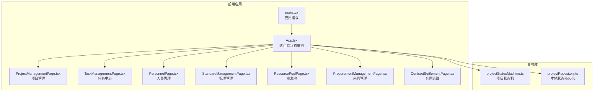
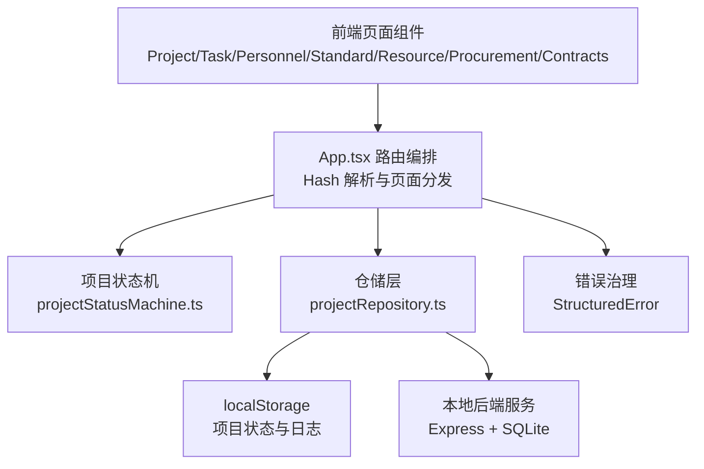
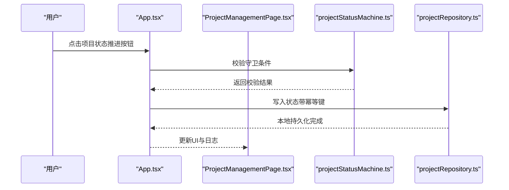
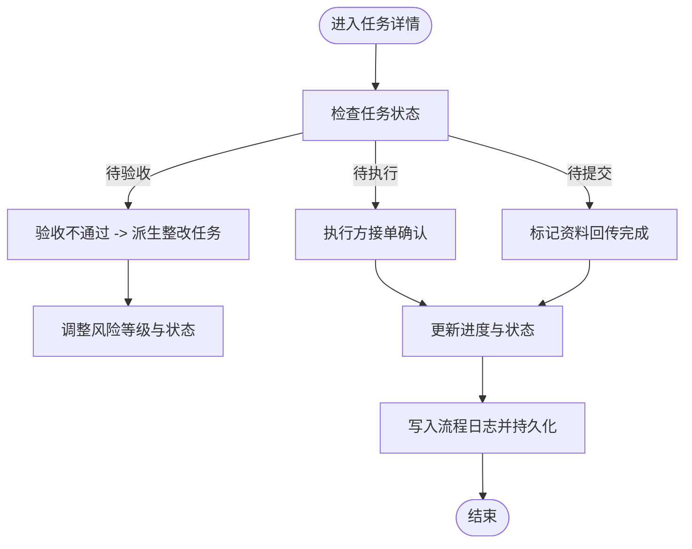
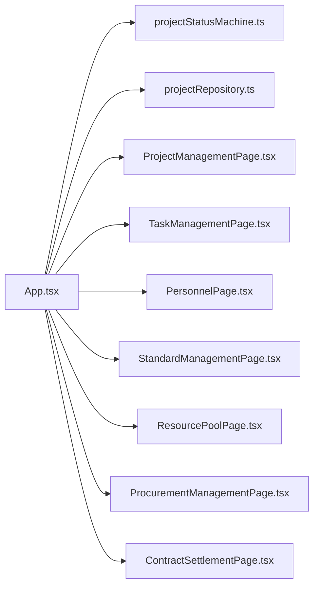

# 核心功能模块

<cite>
**本文引用的文件**
- [README.md](file://README.md)
- [CODEBUDDY.md](file://CODEBUDDY.md)
- [src/App.tsx](file://src/App.tsx)
- [src/main.tsx](file://src/main.tsx)
- [src/domain/projectStatusMachine.ts](file://src/domain/projectStatusMachine.ts)
- [src/services/repositories/projectRepository.ts](file://src/services/repositories/projectRepository.ts)
- [src/components/project/ProjectManagementPage.tsx](file://src/components/project/ProjectManagementPage.tsx)
- [src/components/task/TaskManagementPage.tsx](file://src/components/task/TaskManagementPage.tsx)
- [src/components/personnel/PersonnelPage.tsx](file://src/components/personnel/PersonnelPage.tsx)
- [src/components/standard/StandardManagementPage.tsx](file://src/components/standard/StandardManagementPage.tsx)
- [src/components/resource/ResourcePoolPage.tsx](file://src/components/resource/ResourcePoolPage.tsx)
- [src/components/procurement/ProcurementManagementPage.tsx](file://src/components/procurement/ProcurementManagementPage.tsx)
- [src/components/contracts/ContractSettlementPage.tsx](file://src/components/contracts/ContractSettlementPage.tsx)
</cite>

## 目录

1. [简介](#简介)
2. [项目结构](#项目结构)
3. [核心组件](#核心组件)
4. [架构总览](#架构总览)
5. [详细组件分析](#详细组件分析)
6. [依赖关系分析](#依赖关系分析)
7. [性能考量](#性能考量)
8. [故障排查指南](#故障排查指南)
9. [结论](#结论)
10. [附录](#附录)

## 简介

本项目是一个基于 React + Vite + TypeScript 的多模块项目管理平台，围绕“项目全生命周期管理”展开，涵盖项目管理、任务管理、人员管理、标准管理、资源管理、采购管理、合同结算、数字员工、系统设置等九个核心功能模块。系统采用 Hash 路由与按需加载策略，结合本地状态持久化与本地后端服务，形成“前端单页应用 + 本地数据库”的轻量架构，便于演示与流程验证。

## 项目结构

- 应用入口与路由编排集中在应用根组件，负责解析 Hash、管理全局状态、分发页面组件与业务能力。
- 业务域分为：项目域（状态机）、任务域（页面内闭环）、人员域（列表与详情）、标准域（模板管理）、资源域（人员/供应商主数据）、采购域（供应商管理）、合同结算域（合同与预算）、数字员工与系统设置入口页。
- 数据持久化采用 localStorage 作为“本地后端”，并提供与本地后端服务的适配层，支持幂等性与降级策略。

图表来源

- [src/main.tsx:1-11](file://src/main.tsx#L1-L11)
- [src/App.tsx:1-879](file://src/App.tsx#L1-L879)
- [src/domain/projectStatusMachine.ts:1-164](file://src/domain/projectStatusMachine.ts#L1-L164)
- [src/services/repositories/projectRepository.ts:1-90](file://src/services/repositories/projectRepository.ts#L1-L90)

章节来源

- [README.md:55-113](file://README.md#L55-L113)
- [CODEBUDDY.md:23-90](file://CODEBUDDY.md#L23-L90)

## 核心组件

- 应用入口与路由编排：负责 Hash 解析、页面懒加载、全局状态持久化与事件监听。
- 项目状态机：定义项目状态集合、允许流转、守卫条件与进入状态钩子。
- 仓储层：封装本地状态读写与远程适配，支持幂等性与降级。
- 页面组件：各模块页面负责 UI 展示、筛选、分页与交互，部分模块在前端完成闭环。

章节来源

- [src/App.tsx:1-879](file://src/App.tsx#L1-L879)
- [src/domain/projectStatusMachine.ts:1-164](file://src/domain/projectStatusMachine.ts#L1-L164)
- [src/services/repositories/projectRepository.ts:1-90](file://src/services/repositories/projectRepository.ts#L1-L90)

## 架构总览

系统采用“前端单页应用 + 本地后端服务”的混合架构：

- 前端：React + Vite + TypeScript，Hash 路由，页面按需加载。
- 本地后端：Express 服务器 + SQLite，提供项目/任务状态接口与审计日志接口。
- 数据持久化：localStorage 存储项目状态与日志，同时支持远程持久化与幂等性。
- 错误治理：统一结构化错误模型，支持降级到本地缓存与用户提示。

图表来源

- [src/App.tsx:1-879](file://src/App.tsx#L1-L879)
- [src/domain/projectStatusMachine.ts:1-164](file://src/domain/projectStatusMachine.ts#L1-L164)
- [src/services/repositories/projectRepository.ts:1-90](file://src/services/repositories/projectRepository.ts#L1-L90)
- [README.md:137-155](file://README.md#L137-L155)

章节来源

- [README.md:55-155](file://README.md#L55-L155)
- [CODEBUDDY.md:23-90](file://CODEBUDDY.md#L23-L90)

## 详细组件分析

### 项目管理模块

- 业务价值：提供项目全生命周期管理，包括列表、详情、甘特图、WBS、验收、成员等视图，支撑项目状态机驱动的状态流转。
- 核心功能：
  - 项目列表：支持搜索、筛选、分组、排序与视图切换（列表/网格/Kanban）。
  - 项目详情：概览、甘特图、WBS、验收、成员、活动日志与状态流转。
  - 状态机：根据守卫条件推进项目状态，生成状态日志与钩子事件。
- 用户交互流程：从项目列表进入详情，查看视图并进行状态推进或基础信息更新。
- 与其他模块关系：与任务管理（任务树/里程碑）、人员管理（成员绑定）、合同结算（验收/结算状态联动）紧密耦合。

图表来源

- [src/App.tsx:439-504](file://src/App.tsx#L439-L504)
- [src/domain/projectStatusMachine.ts:105-163](file://src/domain/projectStatusMachine.ts#L105-L163)
- [src/services/repositories/projectRepository.ts:76-89](file://src/services/repositories/projectRepository.ts#L76-L89)

章节来源

- [src/components/project/ProjectManagementPage.tsx:1-270](file://src/components/project/ProjectManagementPage.tsx#L1-L270)
- [src/App.tsx:439-504](file://src/App.tsx#L439-L504)
- [src/domain/projectStatusMachine.ts:1-164](file://src/domain/projectStatusMachine.ts#L1-L164)

### 任务管理模块

- 业务价值：集中管理任务的创建、派发、执行、验收与回退，支持模板化任务实例化与派单推荐。
- 核心功能：
  - 任务列表：按模板/项目/来源类型筛选，支持分页与排序。
  - 任务详情：任务快照、执行材料清单、流程日志与附件。
  - 派单与回退：手动派单、系统推荐、接单确认、拒单回退。
  - SLA 与风险：根据状态与提醒次数计算 SLA 状态与风险等级。
- 用户交互流程：从任务中心选择任务，查看详情并进行派单/执行/提交/验收/整改等操作。
- 与其他模块关系：与人员管理（可用性与负载）、标准管理（模板绑定）、项目管理（里程碑与验收）协同。

图表来源

- [src/components/task/TaskManagementPage.tsx:498-800](file://src/components/task/TaskManagementPage.tsx#L498-L800)

章节来源

- [src/components/task/TaskManagementPage.tsx:1-800](file://src/components/task/TaskManagementPage.tsx#L1-L800)

### 人员管理模块

- 业务价值：提供人员列表、统计卡片、标签页与用户表格，支撑项目成员绑定与资源可用性管理。
- 核心功能：
  - 人员列表：支持搜索与打开详情。
  - 统计卡片：项目参与度、在岗状态等指标。
  - 用户表格：展示人员基本信息与团队归属。
- 用户交互流程：在人员列表中搜索与筛选，点击进入详情页。
- 与其他模块关系：与资源池（可用性与负载）、任务管理（派单与可用性）协作。

章节来源

- [src/components/personnel/PersonnelPage.tsx:1-37](file://src/components/personnel/PersonnelPage.tsx#L1-L37)

### 标准管理模块

- 业务价值：维护项目与任务标准模板，支持模板统计、搜索与跳转到任务实例化。
- 核心功能：
  - 模板统计：全部/内置/自定义/生效版本。
  - 模板列表：按关键字搜索，支持查看详情与查看任务。
- 用户交互流程：在标准管理页切换类型，搜索模板并跳转到任务中心或模板详情。
- 与其他模块关系：与任务管理（模板实例化）、项目管理（标准绑定）相关。

章节来源

- [src/components/standard/StandardManagementPage.tsx:1-282](file://src/components/standard/StandardManagementPage.tsx#L1-L282)

### 资源管理模块

- 业务价值：维护人员与供应商主数据，支持负载、可分配状态与资质状态的治理与配置。
- 核心功能：
  - 资源域切换：人员资源/供应商资源。
  - 统计与筛选：按类型/状态/关键词筛选。
  - 治理规则：人员/供应商高负载阈值配置。
- 用户交互流程：在资源池中维护人员/供应商的负载与状态，保存治理规则。
- 与其他模块关系：与任务管理（派单推荐）、人员管理（可用性）协同。

章节来源

- [src/components/resource/ResourcePoolPage.tsx:1-560](file://src/components/resource/ResourcePoolPage.tsx#L1-L560)

### 采购管理模块

- 业务价值：供应商主数据管理，支持供应商搜索、状态统计与详情跳转。
- 核心功能：
  - 供应商统计：总数/合作中/待审核/已暂停。
  - 供应商列表：按关键字搜索，支持查看详情。
- 用户交互流程：在采购管理页搜索供应商，点击进入详情。
- 与其他模块关系：与资源池（供应商主数据）、合同结算（合同与预算）相关。

章节来源

- [src/components/procurement/ProcurementManagementPage.tsx:1-226](file://src/components/procurement/ProcurementManagementPage.tsx#L1-L226)

### 合同结算模块

- 业务价值：合同与预算管理，支持合同列表、结算草案差异追踪与建议。
- 核心功能：
  - 合同统计：本年度合同总额、累计已结算金额、预算超支风险。
  - 合同列表：按关键字搜索，展示状态、金额、履约进度。
  - 结算差异：按项目筛选差异项，发起复核与追溯。
- 用户交互流程：在合同结算页查看统计与差异，选择项目进行复核或追溯到项目详情。
- 与其他模块关系：与项目管理（验收/结算状态）、资源池（预算与差异）相关。

章节来源

- [src/components/contracts/ContractSettlementPage.tsx:1-583](file://src/components/contracts/ContractSettlementPage.tsx#L1-L583)

### 数字员工与系统设置模块

- 业务价值：数字员工与系统设置入口页，当前以演示/配置展示为主，后续可扩展为自动化流程与系统配置中心。
- 用户交互流程：通过导航进入相应页面，进行演示或配置操作。
- 与其他模块关系：作为顶层入口，与各模块通过导航与数据共享间接关联。

章节来源

- [src/App.tsx:858-864](file://src/App.tsx#L858-L864)

## 依赖关系分析

- 组件耦合：
  - App.tsx 作为中枢，依赖项目状态机与仓储层，向各页面组件注入能力。
  - 项目管理、任务管理、标准管理、资源管理、采购管理、合同结算等页面组件相对独立，通过路由与状态共享进行协作。
- 外部依赖：
  - 本地后端服务提供项目/任务状态接口与审计日志接口。
  - localStorage 作为持久化介质，支持远程持久化的幂等性与降级。
- 可能的循环依赖：
  - 通过分层（路由/页面/域/仓储/服务）避免循环依赖，App.tsx 仅作为编排层。

图表来源

- [src/App.tsx:1-879](file://src/App.tsx#L1-L879)
- [src/domain/projectStatusMachine.ts:1-164](file://src/domain/projectStatusMachine.ts#L1-L164)
- [src/services/repositories/projectRepository.ts:1-90](file://src/services/repositories/projectRepository.ts#L1-L90)

章节来源

- [src/App.tsx:1-879](file://src/App.tsx#L1-L879)

## 性能考量

- 懒加载策略：14+ 页面组件按需加载，vendor 独立 chunk，主包体积优化至 27 KB。
- 首屏加载：首屏体积 216 KB，较优化前减少 62%。
- 测试体系：核心域覆盖（状态机守卫逻辑、仓储层数据持久化、错误处理模型）。
- 错误治理：统一结构化错误模型，支持网络错误降级到本地缓存与用户提示。

章节来源

- [README.md:156-200](file://README.md#L156-L200)

## 故障排查指南

- 网络请求失败：
  - 检查本地后端是否启动（http://localhost:3100）。
  - 查看控制台的“降级”日志。
  - 验证 Vite proxy 配置。
- 状态流转失败：
  - 检查守卫条件（projectStatusMachine.ts）。
  - 查看控制台的状态流转失败日志。
  - 验证项目的里程碑、任务树、验收结果等字段。
- 本地缓存不一致：
  - 清空 localStorage：localStorage.clear()。
  - 刷新页面，重新加载数据。
  - 检查 projectRepository.loadState() 的返回值。

章节来源

- [README.md:227-243](file://README.md#L227-L243)

## 结论

本项目通过“前端单页应用 + 本地后端服务”的架构，实现了项目全生命周期管理与多模块协同。项目状态机驱动的状态流转、页面内闭环的任务管理、以及资源与供应商主数据治理，共同构成了清晰的业务闭环。通过懒加载与本地持久化策略，系统在演示与流程验证场景下具备良好的性能与可维护性。后续可在现有基础上扩展远程后端、完善权限与审计、增强报表与自动化流程，进一步提升系统能力。

## 附录

- 使用场景与配置选项：
  - 项目管理：支持新建项目、推进状态、查看日志与统计。
  - 任务管理：支持模板化任务实例化、派单推荐、SLA 与风险计算。
  - 人员管理：支持人员列表、统计卡片与团队归属。
  - 标准管理：支持模板统计、搜索与跳转到任务实例化。
  - 资源管理：支持人员/供应商主数据维护与治理规则配置。
  - 采购管理：支持供应商搜索、状态统计与详情跳转。
  - 合同结算：支持合同列表、结算草案差异追踪与建议。
  - 数字员工与系统设置：演示入口，后续扩展为自动化与配置中心。
- 扩展可能性：
  - 引入远程后端与数据库，替换本地持久化。
  - 增加权限模型与审计日志。
  - 扩展报表与仪表盘，增强数据分析能力。
  - 完善工作流引擎，支持更复杂的业务流程编排。
