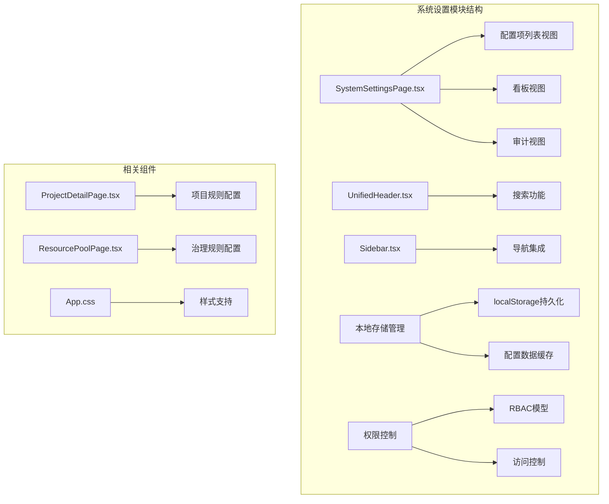
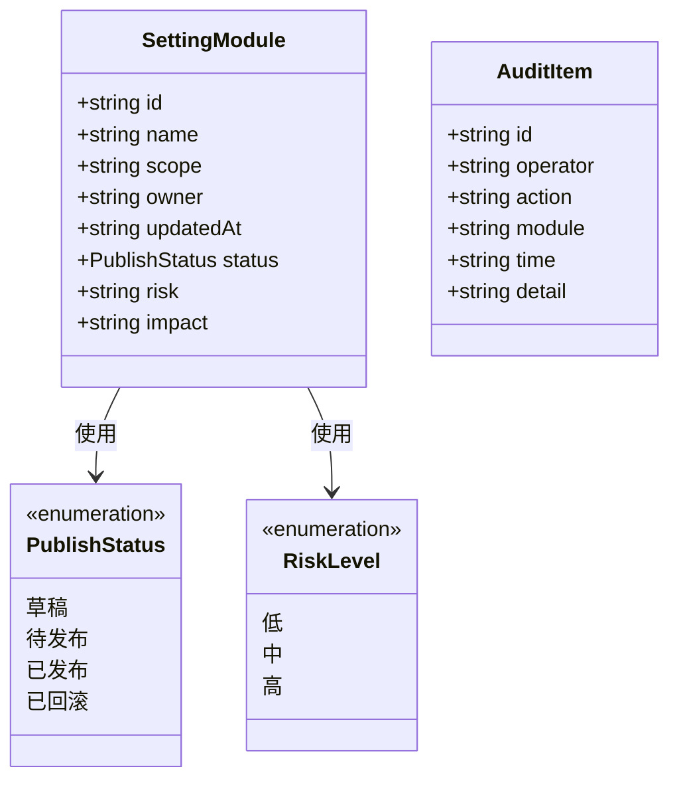
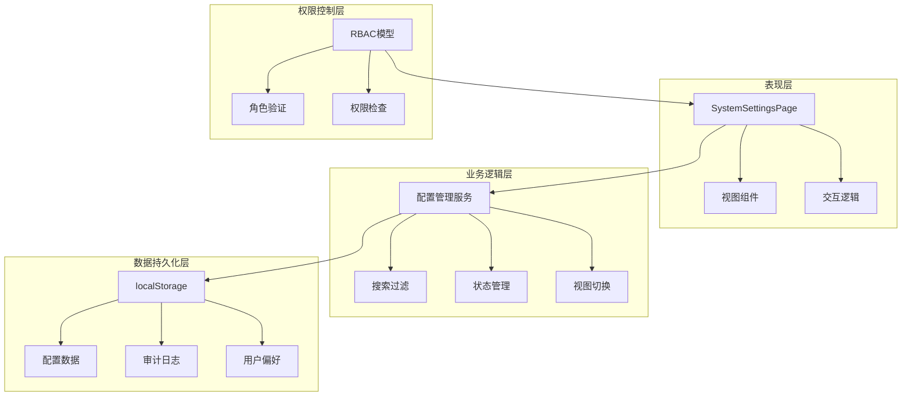
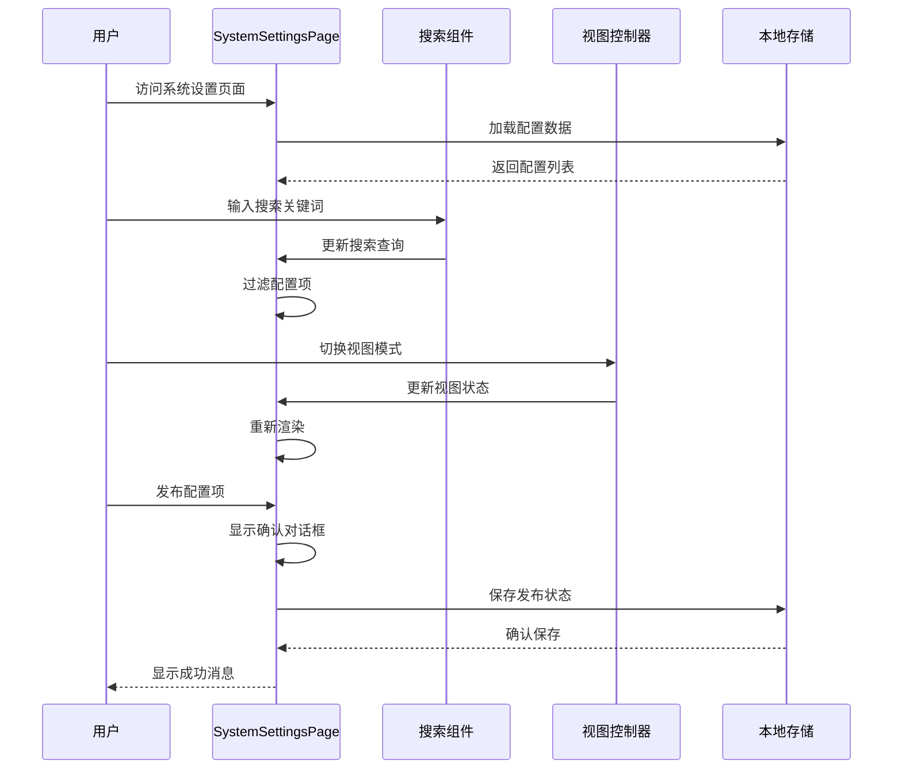
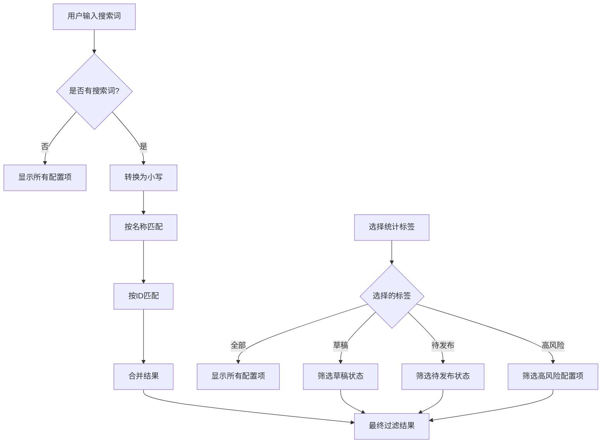
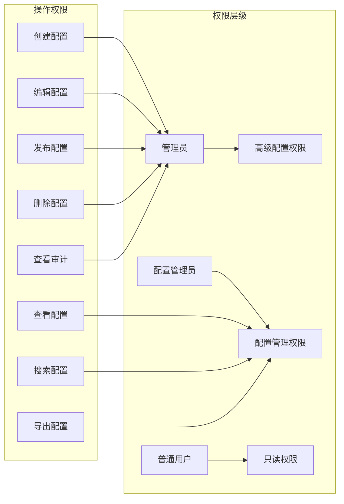
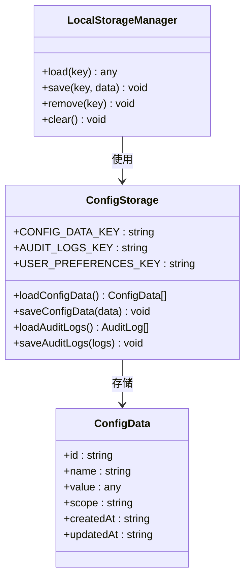
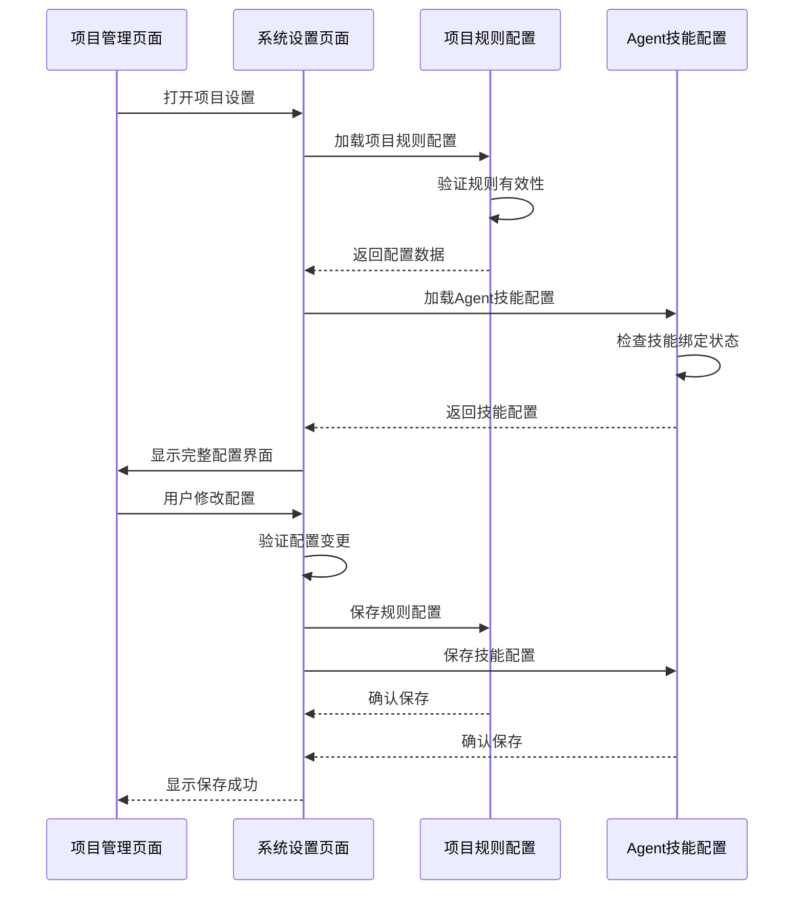
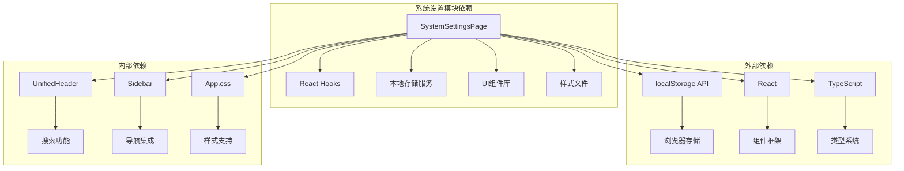
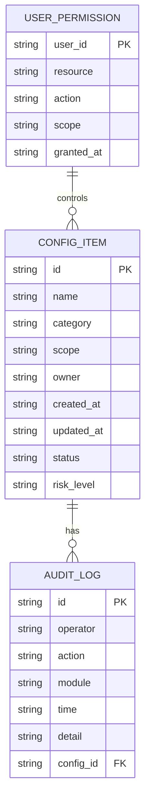

# 系统设置模块

<cite>
**本文引用的文件**
- [SystemSettingsPage.tsx](file://src/components/settings/SystemSettingsPage.tsx)
- [UnifiedHeader.tsx](file://src/components/layout/UnifiedHeader.tsx)
- [Sidebar.tsx](file://src/components/personnel/Sidebar.tsx)
- [ProjectDetailPage.tsx](file://src/components/project/ProjectDetailPage.tsx)
- [App.css](file://src/App.css)
- [projectRepository.ts](file://src/services/repositories/projectRepository.ts)
- [supplierRepository.ts](file://src/services/repositories/supplierRepository.ts)
- [ResourcePoolPage.tsx](file://src/components/resource/ResourcePoolPage.tsx)
- [template-contract.types.ts](file://src/components/standard/template-contract.types.ts)
- [template-data-contract.md](file://docs/02-architecture/template-data-contract.md)
- [security-rules.md](file://.codebuddy/rules/tcb/rules/no-sql-web-sdk/security-rules.md)
- [cloudbase-platform.md](file://.codebuddy/rules/tcb/rules/cloudbase-platform/rule.md)
</cite>

## 目录

1. [简介](#简介)
2. [项目结构](#项目结构)
3. [核心组件](#核心组件)
4. [架构概览](#架构概览)
5. [详细组件分析](#详细组件分析)
6. [依赖分析](#依赖分析)
7. [性能考虑](#性能考虑)
8. [故障排除指南](#故障排除指南)
9. [结论](#结论)
10. [附录](#附录)

## 简介

系统设置模块是项目管理系统中的配置管理中心，负责提供统一的系统配置界面，支持配置项的分类管理、权限控制和参数设置。该模块实现了完整的配置生命周期管理，包括配置项的创建、编辑、发布、审计和回滚等功能，同时提供了灵活的视图模式切换和搜索过滤机制。

系统设置模块不仅管理全局系统参数，还集成了项目级别的配置管理，如项目规则配置、Agent技能配置等，形成了多层次的配置管理体系。通过本地存储持久化机制，确保配置数据的可靠性和一致性。

## 项目结构

系统设置模块位于前端项目的组件目录中，采用清晰的文件组织结构：



**图表来源**

- [SystemSettingsPage.tsx:1-360](file://src/components/settings/SystemSettingsPage.tsx#L1-L360)
- [UnifiedHeader.tsx:1-57](file://src/components/layout/UnifiedHeader.tsx#L1-L57)
- [Sidebar.tsx:1-95](file://src/components/personnel/Sidebar.tsx#L1-L95)

**章节来源**

- [SystemSettingsPage.tsx:1-360](file://src/components/settings/SystemSettingsPage.tsx#L1-L360)
- [UnifiedHeader.tsx:1-57](file://src/components/layout/UnifiedHeader.tsx#L1-L57)
- [Sidebar.tsx:1-95](file://src/components/personnel/Sidebar.tsx#L1-L95)

## 核心组件

系统设置模块的核心组件包括配置管理页面、头部搜索组件、侧边栏导航和本地存储管理器。

### 主要数据模型

系统设置模块定义了完整的配置项数据模型：



**图表来源**

- [SystemSettingsPage.tsx:8-79](file://src/components/settings/SystemSettingsPage.tsx#L8-L79)

### 视图模式系统

系统支持三种不同的视图模式，每种模式都有特定的用途和展示方式：

- **列表视图**：提供详细的配置项信息卡片，适合批量查看和操作
- **看板视图**：按发布状态分组显示配置项，便于状态跟踪
- **审计视图**：展示配置变更历史和审计日志

**章节来源**

- [SystemSettingsPage.tsx:128-360](file://src/components/settings/SystemSettingsPage.tsx#L128-L360)

## 架构概览

系统设置模块采用分层架构设计，实现了清晰的关注点分离：



**图表来源**

- [SystemSettingsPage.tsx:128-360](file://src/components/settings/SystemSettingsPage.tsx#L128-L360)
- [projectRepository.ts:14-38](file://src/services/repositories/projectRepository.ts#L14-L38)

## 详细组件分析

### 系统设置页面组件

系统设置页面是整个模块的核心组件，实现了完整的配置管理功能：



**图表来源**

- [SystemSettingsPage.tsx:128-360](file://src/components/settings/SystemSettingsPage.tsx#L128-L360)

#### 搜索和过滤机制

系统实现了智能的搜索和过滤功能，支持按名称、ID和状态进行组合筛选：



**图表来源**

- [SystemSettingsPage.tsx:133-151](file://src/components/settings/SystemSettingsPage.tsx#L133-L151)

#### 权限控制机制

系统集成了基于角色的权限控制模型，支持不同角色对配置项的不同操作权限：



**图表来源**

- [cloudbase-platform.md:146-194](file://.codebuddy/rules/tcb/rules/cloudbase-platform/rule.md#L146-L194)

**章节来源**

- [SystemSettingsPage.tsx:128-360](file://src/components/settings/SystemSettingsPage.tsx#L128-L360)

### 本地存储管理

系统采用了本地存储持久化机制，确保配置数据的可靠性和离线可用性：



**图表来源**

- [projectRepository.ts:14-38](file://src/services/repositories/projectRepository.ts#L14-L38)
- [supplierRepository.ts:12-32](file://src/services/repositories/supplierRepository.ts#L12-L32)

**章节来源**

- [projectRepository.ts:14-38](file://src/services/repositories/projectRepository.ts#L14-L38)
- [supplierRepository.ts:12-32](file://src/services/repositories/supplierRepository.ts#L12-L32)

### 项目配置集成

系统设置模块与项目管理模块深度集成，支持项目级别的配置管理：



**图表来源**

- [ProjectDetailPage.tsx:737-815](file://src/components/project/ProjectDetailPage.tsx#L737-L815)

**章节来源**

- [ProjectDetailPage.tsx:737-815](file://src/components/project/ProjectDetailPage.tsx#L737-L815)

## 依赖分析

系统设置模块的依赖关系相对简单，主要依赖于核心UI组件和本地存储服务：



**图表来源**

- [SystemSettingsPage.tsx:1-4](file://src/components/settings/SystemSettingsPage.tsx#L1-L4)
- [UnifiedHeader.tsx:1-10](file://src/components/layout/UnifiedHeader.tsx#L1-L10)
- [Sidebar.tsx:1-5](file://src/components/personnel/Sidebar.tsx#L1-L5)

**章节来源**

- [SystemSettingsPage.tsx:1-4](file://src/components/settings/SystemSettingsPage.tsx#L1-L4)
- [UnifiedHeader.tsx:1-10](file://src/components/layout/UnifiedHeader.tsx#L1-L10)
- [Sidebar.tsx:1-5](file://src/components/personnel/Sidebar.tsx#L1-L5)

## 性能考虑

系统设置模块在性能方面采用了多项优化策略：

### 内存优化

- 使用React.memo和useMemo避免不必要的重渲染
- 按需加载配置数据，减少初始内存占用
- 合理的组件拆分，避免单个组件过于复杂

### 数据处理优化

- 搜索功能采用防抖机制，减少频繁的DOM操作
- 过滤逻辑在客户端完成，避免网络请求
- 缓存常用配置数据，提高响应速度

### 存储优化

- 本地存储采用增量更新策略
- 配置数据压缩存储，减少存储空间占用
- 异步存储操作，避免阻塞主线程

## 故障排除指南

系统设置模块可能遇到的常见问题及解决方案：

### 配置加载失败

**问题描述**：系统设置页面无法加载配置数据
**可能原因**：

- 本地存储损坏
- 配置格式错误
- 浏览器存储限制

**解决步骤**：

1. 清除浏览器缓存和本地存储
2. 检查配置数据格式
3. 验证浏览器存储权限

### 权限访问问题

**问题描述**：用户无法访问某些配置项
**可能原因**：

- RBAC权限配置错误
- 用户角色映射问题
- 权限缓存过期

**解决步骤**：

1. 检查用户角色分配
2. 验证权限配置
3. 刷新权限缓存

### 性能问题

**问题描述**：系统设置页面响应缓慢
**可能原因**：

- 配置项数量过多
- 搜索功能未优化
- 组件渲染过度

**解决步骤**：

1. 分页加载配置项
2. 优化搜索算法
3. 减少组件嵌套层次

**章节来源**

- [security-rules.md:37-1012](file://.codebuddy/rules/tcb/rules/no-sql-web-sdk/security-rules.md#L37-L1012)

## 结论

系统设置模块是一个功能完善、架构清晰的配置管理解决方案。它通过分层设计实现了良好的可维护性和扩展性，通过本地存储持久化确保了数据的可靠性，通过RBAC权限模型提供了细粒度的访问控制。

模块的主要优势包括：

- 完整的配置生命周期管理
- 灵活的视图模式和搜索过滤
- 深度的项目配置集成
- 可靠的本地存储机制
- 清晰的权限控制体系

未来可以考虑的功能增强包括：

- 配置导入导出功能
- 更丰富的权限模型
- 配置版本管理
- 实时配置同步

## 附录

### 扩展指南

系统设置模块提供了完善的扩展接口：

#### 自定义配置项

```typescript
// 添加新的配置项类型
interface CustomConfigItem {
  id: string
  name: string
  type: 'text' | 'number' | 'boolean' | 'select'
  defaultValue: any
  options?: string[]
  validator?: (value: any) => boolean
}

// 注册新的配置项处理器
const customConfigHandlers = {
  text: (value: string) => value.trim(),
  select: (value: string) => value,
  boolean: (value: boolean) => Boolean(value),
}
```

#### 权限模型扩展

```typescript
// 扩展RBAC权限模型
interface ExtendedPermission {
  resource: string
  action: string
  scope: string
  conditions: Record<string, any>
}

// 自定义权限验证器
const permissionValidator = (permission: ExtendedPermission, user: User): boolean => {
  // 实现自定义权限验证逻辑
  return true
}
```

#### 系统监控集成

```typescript
// 配置监控指标
const monitoringConfig = {
  metrics: ['config_load_time', 'config_save_time', 'permission_check_time'],
  alerts: {
    threshold: 5000,
    actions: ['notify_admin', 'log_error', 'retry_operation'],
  },
}

// 实现监控钩子
const useConfigMonitoring = () => {
  const [metrics, setMetrics] = useState<Record<string, number>>({})

  const recordMetric = (name: string, value: number) => {
    setMetrics(prev => ({ ...prev, [name]: value }))
  }

  return { metrics, recordMetric }
}
```

### 配置管理最佳实践

1. **配置分类**：按照功能模块对配置项进行分类管理
2. **默认值设置**：为每个配置项提供合理的默认值
3. **版本控制**：对重要的配置变更进行版本追踪
4. **权限分离**：将敏感配置与普通配置分开管理
5. **审计日志**：记录所有配置变更操作

### 数据模型设计

系统设置模块遵循统一的数据契约规范：



**图表来源**

- [template-contract.types.ts:25-61](file://src/components/standard/template-contract.types.ts#L25-L61)
- [template-data-contract.md:56-261](file://docs/02-architecture/template-data-contract.md#L56-L261)
