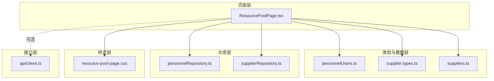
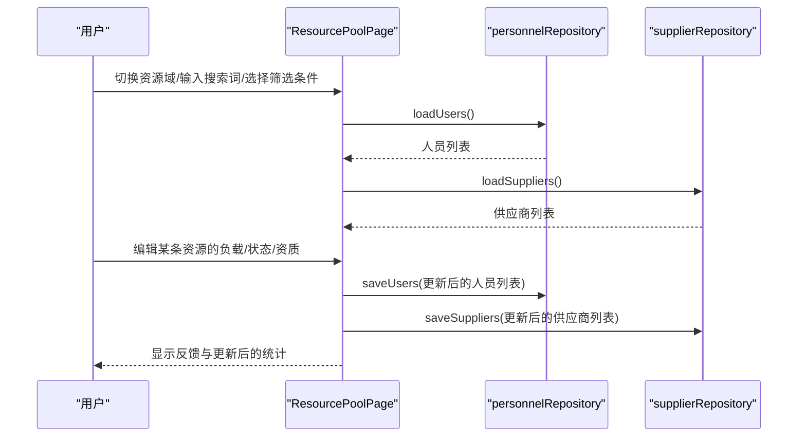
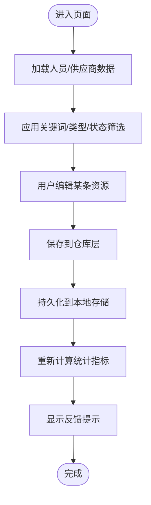
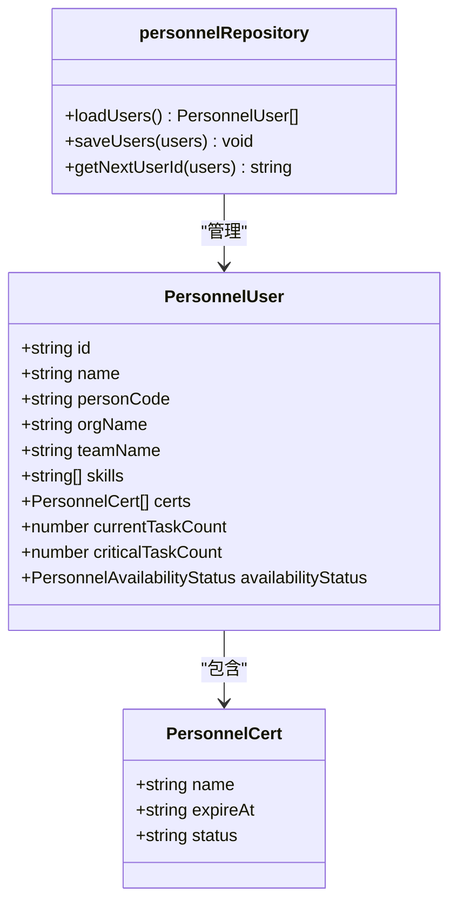
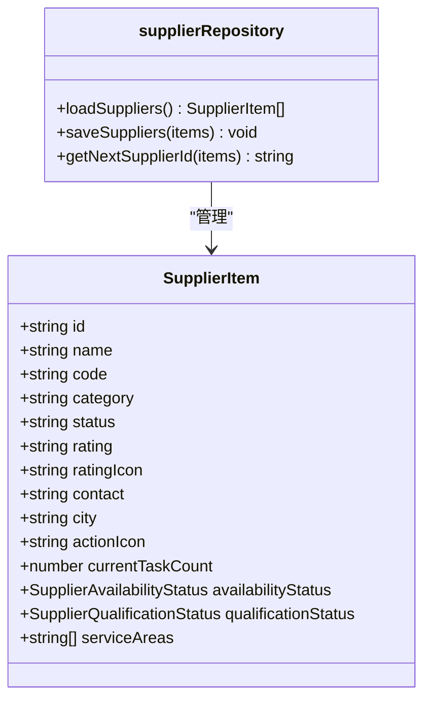
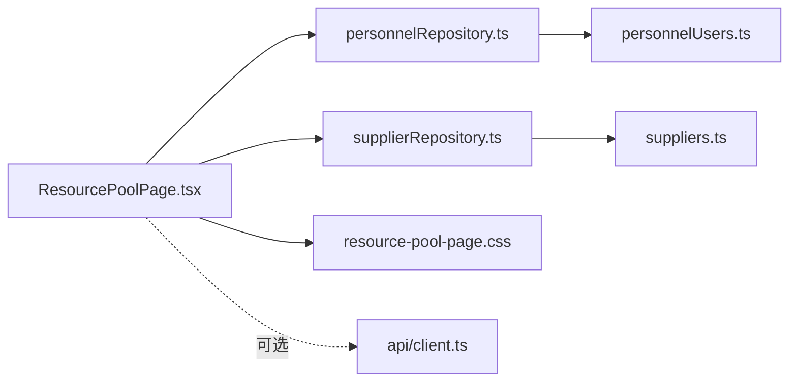

# 资源管理模块

<cite>
**本文引用的文件**
- [src/components/resource/ResourcePoolPage.tsx](file://src/components/resource/ResourcePoolPage.tsx)
- [src/components/resource/supplier.types.ts](file://src/components/resource/supplier.types.ts)
- [src/components/resource/suppliers.ts](file://src/components/resource/suppliers.ts)
- [src/services/repositories/supplierRepository.ts](file://src/services/repositories/supplierRepository.ts)
- [src/services/repositories/personnelRepository.ts](file://src/services/repositories/personnelRepository.ts)
- [src/components/personnel/personnelUsers.ts](file://src/components/personnel/personnelUsers.ts)
- [src/components/resource/resource-pool-page.css](file://src/components/resource/resource-pool-page.css)
- [src/services/api/client.ts](file://src/services/api/client.ts)
- [src/components/project/ProjectMembersView.tsx](file://src/components/project/ProjectMembersView.tsx)
- [src/components/personnel/UserTable.tsx](file://src/components/personnel/UserTable.tsx)
</cite>

## 目录

1. [简介](#简介)
2. [项目结构](#项目结构)
3. [核心组件](#核心组件)
4. [架构总览](#架构总览)
5. [详细组件分析](#详细组件分析)
6. [依赖分析](#依赖分析)
7. [性能考虑](#性能考虑)
8. [故障排除指南](#故障排除指南)
9. [结论](#结论)
10. [附录](#附录)

## 简介

本技术文档面向资源管理模块，聚焦“资源池管理”与“供应商管理”的核心功能实现，系统性阐述：

- 资源数据模型设计（人员与供应商）
- 供应商信息维护与状态管理
- 资源分配策略与治理规则
- 资源池页面的界面布局、查询筛选与分配操作机制
- 资源类型分类管理、状态跟踪与使用统计分析
- 扩展指南：自定义资源类型、资源权限控制与与采购管理模块的集成方案

该模块采用前端本地存储持久化策略，结合仓库层抽象，提供可编辑的资源主数据维护界面，并通过治理阈值实现“高负载”等关键指标的可视化与可配置。

## 项目结构

资源管理模块主要由以下层次构成：

- 页面层：资源池主数据页面，提供资源域切换、筛选、统计与批量编辑能力
- 类型与数据层：人员与供应商的数据模型与示例数据
- 仓库层：本地存储读写与ID生成逻辑
- 样式层：资源池页面专用样式
- 接口层：统一的API客户端（用于未来对接后端）

图表来源

- [src/components/resource/ResourcePoolPage.tsx:120-557](file://src/components/resource/ResourcePoolPage.tsx#L120-L557)
- [src/components/personnel/personnelUsers.ts:4-29](file://src/components/personnel/personnelUsers.ts#L4-L29)
- [src/components/resource/supplier.types.ts:7-22](file://src/components/resource/supplier.types.ts#L7-L22)
- [src/components/resource/suppliers.ts:3-164](file://src/components/resource/suppliers.ts#L3-L164)
- [src/services/repositories/personnelRepository.ts:44-57](file://src/services/repositories/personnelRepository.ts#L44-L57)
- [src/services/repositories/supplierRepository.ts:43-56](file://src/services/repositories/supplierRepository.ts#L43-L56)
- [src/components/resource/resource-pool-page.css:1-239](file://src/components/resource/resource-pool-page.css#L1-L239)
- [src/services/api/client.ts:83-171](file://src/services/api/client.ts#L83-L171)

章节来源

- [src/components/resource/ResourcePoolPage.tsx:120-557](file://src/components/resource/ResourcePoolPage.tsx#L120-L557)
- [src/components/resource/resource-pool-page.css:1-239](file://src/components/resource/resource-pool-page.css#L1-L239)

## 核心组件

- 资源池主数据页面：提供资源域切换（人员/供应商）、关键词搜索、类型/状态筛选、治理阈值配置与批量保存能力
- 人员资源模型：包含人员基础信息、技能、证书、在手任务数、关键任务数、可用状态等
- 供应商资源模型：包含供应商基础信息、类别、状态、评分、联系人、城市、服务区域、在手任务数、可用状态、资质状态等
- 仓库层：封装本地存储读取、保存与ID生成逻辑
- 统计与筛选：基于治理阈值计算“高负载”、“可分配”、“资质风险”等指标

章节来源

- [src/components/resource/ResourcePoolPage.tsx:120-182](file://src/components/resource/ResourcePoolPage.tsx#L120-L182)
- [src/components/personnel/personnelUsers.ts:4-29](file://src/components/personnel/personnelUsers.ts#L4-L29)
- [src/components/resource/supplier.types.ts:7-22](file://src/components/resource/supplier.types.ts#L7-L22)
- [src/services/repositories/personnelRepository.ts:44-57](file://src/services/repositories/personnelRepository.ts#L44-L57)
- [src/services/repositories/supplierRepository.ts:43-56](file://src/services/repositories/supplierRepository.ts#L43-L56)

## 架构总览

资源池页面通过仓库层访问本地存储中的人员与供应商数据，构建筛选后的列表并允许用户实时编辑“在手任务数”、“可分配状态”、“资质状态”。治理阈值可配置并持久化到本地存储，用于统计“高负载”指标。

图表来源

- [src/components/resource/ResourcePoolPage.tsx:120-275](file://src/components/resource/ResourcePoolPage.tsx#L120-L275)
- [src/services/repositories/personnelRepository.ts:44-51](file://src/services/repositories/personnelRepository.ts#L44-L51)
- [src/services/repositories/supplierRepository.ts:43-50](file://src/services/repositories/supplierRepository.ts#L43-L50)

## 详细组件分析

### 资源池主数据页面（ResourcePoolPage）

职责与特性：

- 资源域切换：人员资源/供应商资源
- 关键词搜索：按姓名/编码/组织/技能或名称/编码/分类/服务区域检索
- 类型/状态筛选：人员类型（资源方/工队）、供应商状态（合作中/待审核/已暂停/已过期）
- 治理阈值配置：人员高负载阈值、供应商高负载阈值，支持保存至本地存储
- 实时编辑：每行可编辑“在手任务数”、“可分配状态”、“资质状态”，并支持逐项保存
- 统计展示：资源总量、可分配、资质风险、高负载

实现要点：

- 使用仓库层加载初始数据并保存更新
- 通过本地存储持久化治理阈值
- 通过计算属性动态生成统计指标

图表来源

- [src/components/resource/ResourcePoolPage.tsx:120-275](file://src/components/resource/ResourcePoolPage.tsx#L120-L275)

章节来源

- [src/components/resource/ResourcePoolPage.tsx:120-557](file://src/components/resource/ResourcePoolPage.tsx#L120-L557)

### 人员资源模型与仓库层

人员资源模型包含：

- 基础信息：姓名、工号、组织/团队、角色、工作城市
- 就业类型：内部资源方、外包工队、供应商（vendor）
- 可用状态：可分配/忙碌/不可分配
- 技能与证书：技能列表、证书列表（含有效期与状态）
- 负载与风险：在手任务数、关键任务数、风险等级

仓库层职责：

- 初始化与深拷贝示例数据
- 从本地存储读取与写入
- 生成新ID（按编号递增）

图表来源

- [src/components/personnel/personnelUsers.ts:4-29](file://src/components/personnel/personnelUsers.ts#L4-L29)
- [src/components/personnel/personnelUsers.ts:46-50](file://src/components/personnel/personnelUsers.ts#L46-L50)
- [src/services/repositories/personnelRepository.ts:44-57](file://src/services/repositories/personnelRepository.ts#L44-L57)

章节来源

- [src/components/personnel/personnelUsers.ts:4-29](file://src/components/personnel/personnelUsers.ts#L4-L29)
- [src/components/personnel/personnelUsers.ts:46-50](file://src/components/personnel/personnelUsers.ts#L46-L50)
- [src/services/repositories/personnelRepository.ts:44-57](file://src/services/repositories/personnelRepository.ts#L44-L57)

### 供应商资源模型与仓库层

供应商资源模型包含：

- 基础信息：名称、编码、联系人、城市
- 分类与状态：类别、状态（合作中/待审核/已暂停/已过期）
- 评分与图标：评分、图标
- 服务能力：服务区域数组
- 负载与可用状态：在手任务数、可用状态（可分配/忙碌/不可分配）
- 资质状态：齐全/临期/需补齐

仓库层职责：

- 初始化与深拷贝示例数据
- 从本地存储读取与写入
- 生成新ID（按编号递增）

图表来源

- [src/components/resource/supplier.types.ts:7-22](file://src/components/resource/supplier.types.ts#L7-L22)
- [src/services/repositories/supplierRepository.ts:43-56](file://src/services/repositories/supplierRepository.ts#L43-L56)

章节来源

- [src/components/resource/supplier.types.ts:1-22](file://src/components/resource/supplier.types.ts#L1-L22)
- [src/components/resource/suppliers.ts:3-164](file://src/components/resource/suppliers.ts#L3-L164)
- [src/services/repositories/supplierRepository.ts:43-56](file://src/services/repositories/supplierRepository.ts#L43-L56)

### 资源池页面样式与交互

- 页面采用网格布局，左侧为侧边栏，右侧为主内容区
- 统计卡片四列布局，响应式适配
- 表格列头包含“资源档案/类型/技能/负载/状态/操作”
- 提供“治理规则配置”区域，支持输入阈值并保存

章节来源

- [src/components/resource/resource-pool-page.css:1-239](file://src/components/resource/resource-pool-page.css#L1-L239)

### 与项目成员视图的资源分配策略关联

项目成员视图展示了角色定义、候选成员、可用性与能力标签，体现了资源分配的策略维度（如“可分配/忙碌”、“能力标签匹配”）。资源池页面的“可分配状态”与“在手任务数”可作为项目成员调度的重要参考依据。

章节来源

- [src/components/project/ProjectMembersView.tsx:3-97](file://src/components/project/ProjectMembersView.tsx#L3-L97)
- [src/components/project/ProjectMembersView.tsx:99-193](file://src/components/project/ProjectMembersView.tsx#L99-L193)

## 依赖分析

- 页面依赖仓库层进行数据读写
- 仓库层依赖类型定义与示例数据
- 页面样式独立，不依赖业务逻辑
- API客户端为可选依赖，当前页面默认使用本地存储

图表来源

- [src/components/resource/ResourcePoolPage.tsx:1-12](file://src/components/resource/ResourcePoolPage.tsx#L1-L12)
- [src/services/repositories/personnelRepository.ts](file://src/services/repositories/personnelRepository.ts#L1)
- [src/services/repositories/supplierRepository.ts](file://src/services/repositories/supplierRepository.ts#L1)
- [src/components/personnel/personnelUsers.ts](file://src/components/personnel/personnelUsers.ts#L1)
- [src/components/resource/suppliers.ts](file://src/components/resource/suppliers.ts#L1)
- [src/components/resource/resource-pool-page.css](file://src/components/resource/resource-pool-page.css#L1)
- [src/services/api/client.ts](file://src/services/api/client.ts#L1)

章节来源

- [src/components/resource/ResourcePoolPage.tsx:1-12](file://src/components/resource/ResourcePoolPage.tsx#L1-L12)
- [src/services/repositories/personnelRepository.ts](file://src/services/repositories/personnelRepository.ts#L1)
- [src/services/repositories/supplierRepository.ts](file://src/services/repositories/supplierRepository.ts#L1)

## 性能考虑

- 列表筛选与排序：使用内存过滤与排序，适合中小规模数据；若数据量增大，建议引入虚拟滚动与服务端分页
- 本地存储：读写在主线程执行，频繁保存可能影响渲染；可通过节流/防抖减少保存频率
- 计算属性：统计与筛选通过Memo化避免重复计算，保持页面响应性
- 样式：CSS采用静态样式，无运行时样式计算开销

## 故障排除指南

- 本地存储异常：仓库层对读写异常进行捕获与忽略，确保页面可用；如遇数据丢失，可清空对应存储键后刷新页面
- 治理阈值异常：输入非数值或小于最小值时，页面会进行边界修正；请检查输入范围
- 供应商/人员ID生成：当ID无法解析数字部分时，默认从基准值开始递增，确保唯一性

章节来源

- [src/services/repositories/personnelRepository.ts:13-33](file://src/services/repositories/personnelRepository.ts#L13-L33)
- [src/services/repositories/supplierRepository.ts:12-32](file://src/services/repositories/supplierRepository.ts#L12-L32)
- [src/components/resource/ResourcePoolPage.tsx:258-275](file://src/components/resource/ResourcePoolPage.tsx#L258-L275)

## 结论

资源管理模块通过清晰的页面-仓库-模型分层，提供了完整的资源池主数据维护能力。其本地存储方案降低了部署复杂度，同时保留了与后端API的扩展空间。治理阈值与统计指标使资源状态可视化与可配置，有助于提升资源利用率与风险控制水平。

## 附录

### 资源类型分类管理

- 人员资源类型：资源方、工队、供应商（通过就业类型字段区分）
- 供应商资源类型：按类别字段进行分类（如施工总承包、幕墙工程、智能化系统等）

章节来源

- [src/components/personnel/personnelUsers.ts](file://src/components/personnel/personnelUsers.ts#L16)
- [src/components/resource/suppliers.ts](file://src/components/resource/suppliers.ts#L8)

### 资源状态跟踪与使用统计

- 人员：可用状态、在手任务数、关键任务数、证书状态
- 供应商：可用状态、在手任务数、资质状态、服务区域
- 统计指标：资源总量、可分配、资质风险、高负载（基于治理阈值）

章节来源

- [src/components/resource/ResourcePoolPage.tsx:167-182](file://src/components/resource/ResourcePoolPage.tsx#L167-L182)
- [src/components/resource/ResourcePoolPage.tsx:354-386](file://src/components/resource/ResourcePoolPage.tsx#L354-L386)

### 扩展指南

- 自定义资源类型
  - 在类型定义中新增枚举值或字段，扩展模型与页面渲染
  - 在仓库层增加初始化与持久化逻辑
  - 在页面中增加对应的筛选与编辑控件

- 资源权限控制
  - 当前页面标注为管理员维护视图；建议在路由与页面入口处接入鉴权守卫
  - 对编辑按钮与治理阈值配置区域增加权限位判断

- 与采购管理模块的集成
  - 供应商数据可作为采购寻源的基础数据源
  - 通过API客户端替换本地存储，实现与后端采购系统的双向同步
  - 在项目成员视图中引入供应商候选，支持“供应商-项目”派单策略

章节来源

- [src/services/api/client.ts:83-171](file://src/services/api/client.ts#L83-L171)
- [src/components/project/ProjectMembersView.tsx:3-97](file://src/components/project/ProjectMembersView.tsx#L3-L97)
