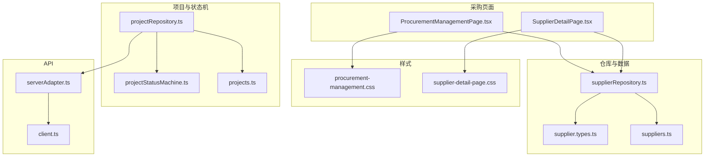
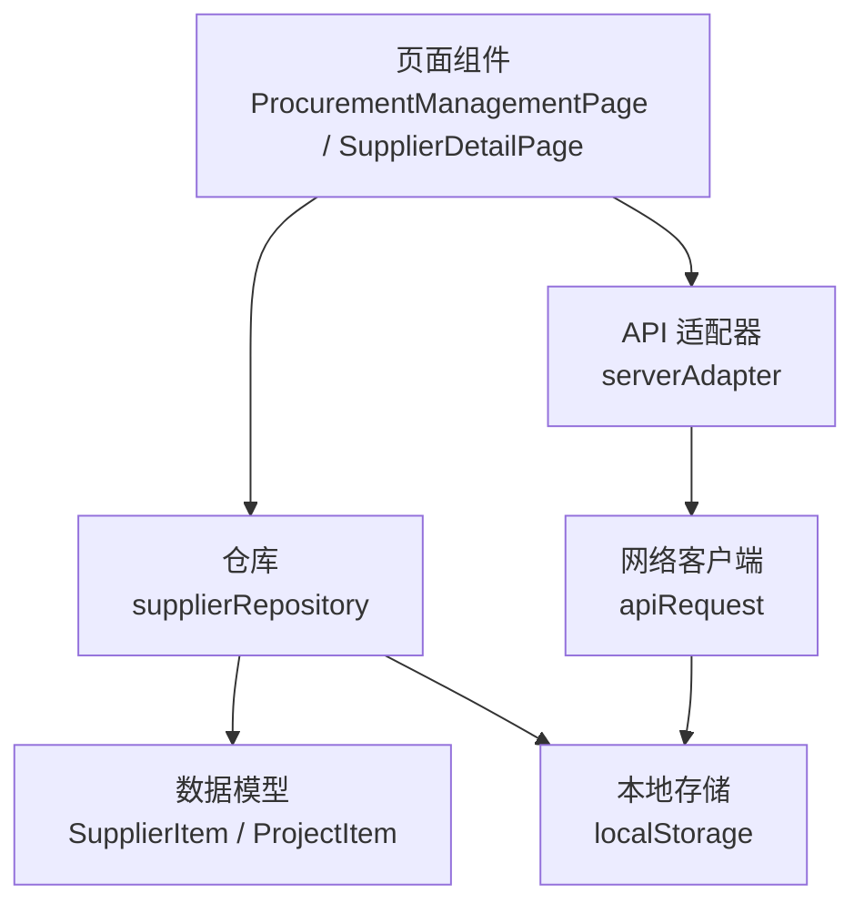
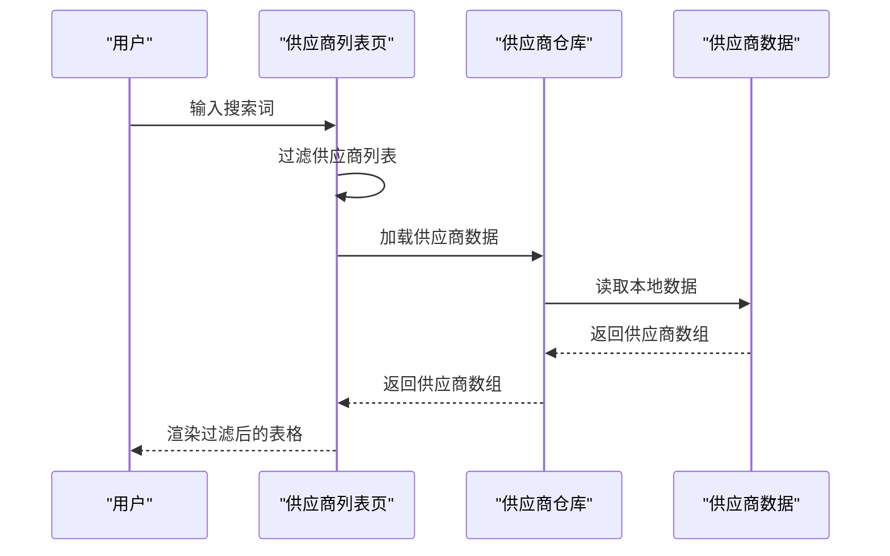
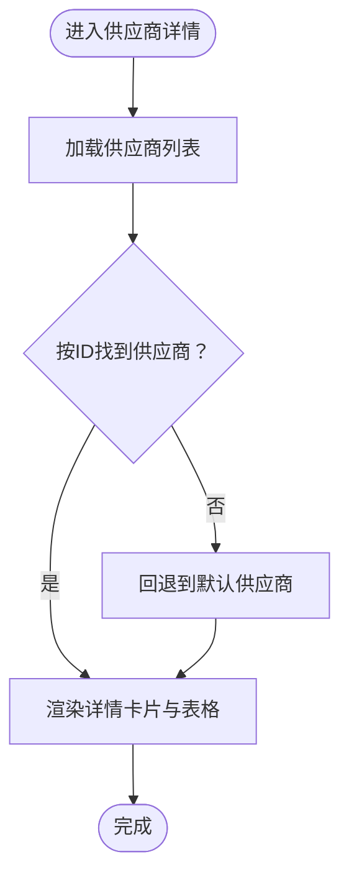
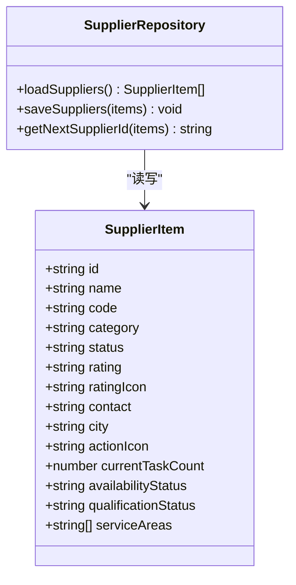
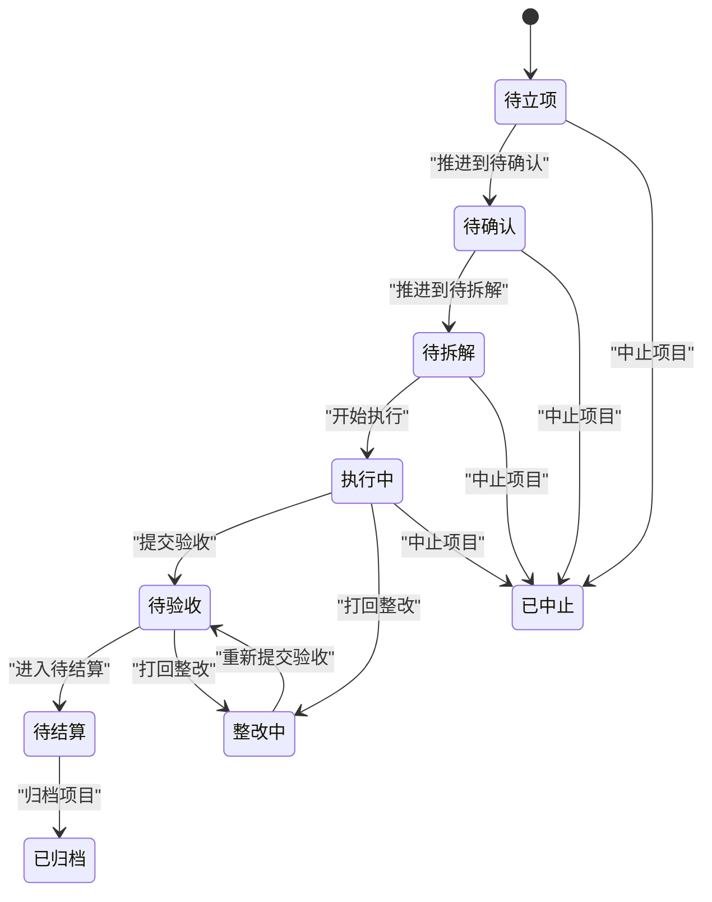
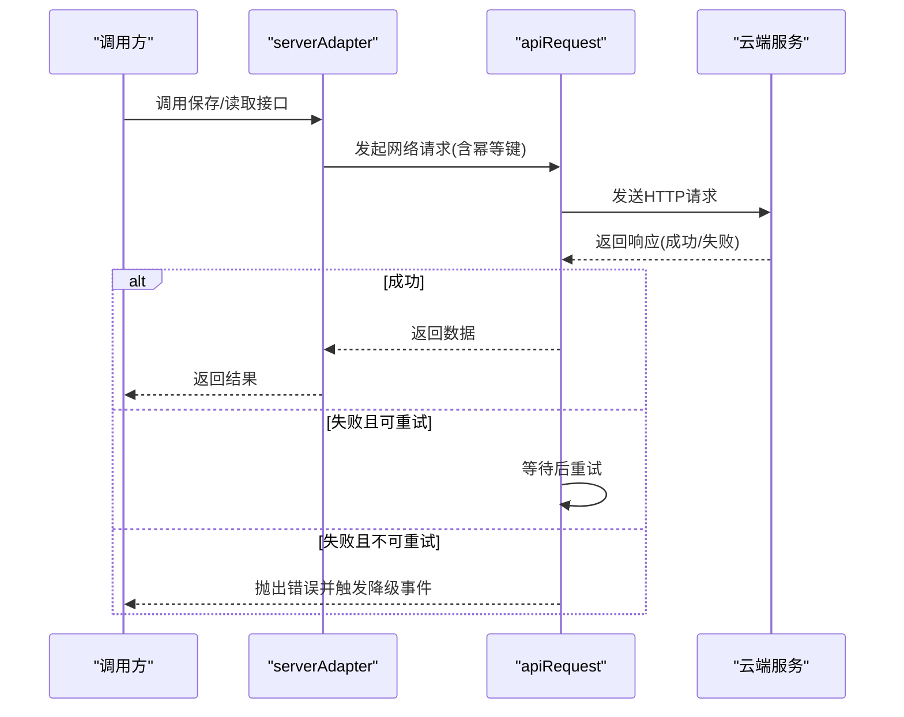
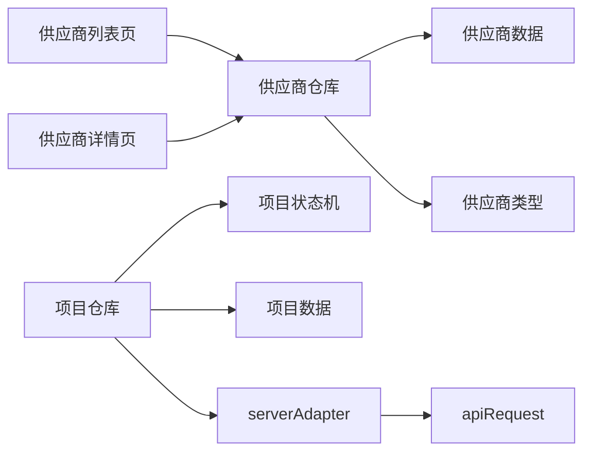
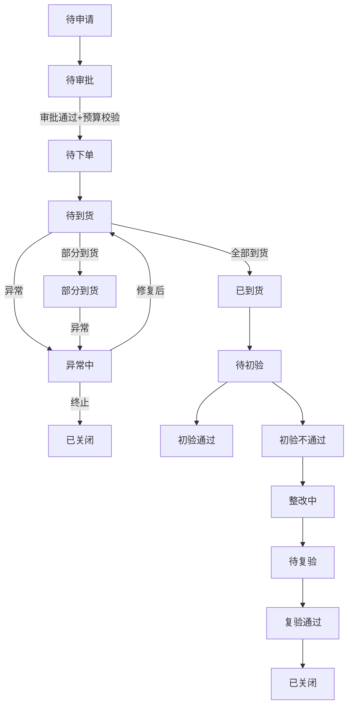

# 采购管理模块

<cite>
**本文引用的文件**
- [ProcurementManagementPage.tsx](file://src/components/procurement/ProcurementManagementPage.tsx)
- [SupplierDetailPage.tsx](file://src/components/procurement/SupplierDetailPage.tsx)
- [supplierRepository.ts](file://src/services/repositories/supplierRepository.ts)
- [supplier.types.ts](file://src/components/resource/supplier.types.ts)
- [suppliers.ts](file://src/components/resource/suppliers.ts)
- [procurement-management.css](file://src/components/procurement/procurement-management.css)
- [supplier-detail-page.css](file://src/components/procurement/supplier-detail-page.css)
- [projectStatusMachine.ts](file://src/domain/projectStatusMachine.ts)
- [projectRepository.ts](file://src/services/repositories/projectRepository.ts)
- [projects.ts](file://src/data/projects.ts)
- [client.ts](file://src/services/api/client.ts)
- [serverAdapter.ts](file://src/services/api/serverAdapter.ts)
- [state-machine-design.md](file://docs/02-architecture/state-machine-design.md)
</cite>

## 目录

1. [简介](#简介)
2. [项目结构](#项目结构)
3. [核心组件](#核心组件)
4. [架构总览](#架构总览)
5. [详细组件分析](#详细组件分析)
6. [依赖关系分析](#依赖关系分析)
7. [性能考量](#性能考量)
8. [故障排查指南](#故障排查指南)
9. [结论](#结论)
10. [附录](#附录)

## 简介

本文件为“采购管理模块”的全面技术文档，面向开发与产品人员，系统阐述采购流程管理、供应商详情展示与采购订单处理等核心能力；深入解析数据模型、供应商信息管理与审批流程；说明页面界面设计、供应商详情查看与采购操作的实现逻辑；并给出从申请、审批、执行到验收的完整业务流程；最后提供模块扩展指南，包括采购模板定制、审批流配置与与资源管理模块的集成方案。

## 项目结构

采购管理模块位于前端 src/components/procurement 目录，配套仓库与数据模型位于 src/services/repositories 与 src/components/resource，样式位于对应 CSS 文件，状态机与项目仓库位于 domain 与 services/repositories，API 客户端与适配器位于 services/api。

**图表来源**

- [ProcurementManagementPage.tsx:1-226](file://src/components/procurement/ProcurementManagementPage.tsx#L1-L226)
- [SupplierDetailPage.tsx:1-306](file://src/components/procurement/SupplierDetailPage.tsx#L1-L306)
- [supplierRepository.ts:1-56](file://src/services/repositories/supplierRepository.ts#L1-L56)
- [suppliers.ts:1-164](file://src/components/resource/suppliers.ts#L1-L164)
- [supplier.types.ts:1-22](file://src/components/resource/supplier.types.ts#L1-L22)
- [procurement-management.css:1-577](file://src/components/procurement/procurement-management.css#L1-L577)
- [supplier-detail-page.css:1-677](file://src/components/procurement/supplier-detail-page.css#L1-L677)
- [projectStatusMachine.ts:1-164](file://src/domain/projectStatusMachine.ts#L1-L164)
- [projectRepository.ts:1-90](file://src/services/repositories/projectRepository.ts#L1-L90)
- [projects.ts:1-451](file://src/data/projects.ts#L1-L451)
- [client.ts:1-172](file://src/services/api/client.ts#L1-L172)
- [serverAdapter.ts:1-87](file://src/services/api/serverAdapter.ts#L1-L87)

**章节来源**

- [ProcurementManagementPage.tsx:1-226](file://src/components/procurement/ProcurementManagementPage.tsx#L1-L226)
- [SupplierDetailPage.tsx:1-306](file://src/components/procurement/SupplierDetailPage.tsx#L1-L306)
- [supplierRepository.ts:1-56](file://src/services/repositories/supplierRepository.ts#L1-L56)
- [suppliers.ts:1-164](file://src/components/resource/suppliers.ts#L1-L164)
- [supplier.types.ts:1-22](file://src/components/resource/supplier.types.ts#L1-L22)
- [procurement-management.css:1-577](file://src/components/procurement/procurement-management.css#L1-L577)
- [supplier-detail-page.css:1-677](file://src/components/procurement/supplier-detail-page.css#L1-L677)
- [projectStatusMachine.ts:1-164](file://src/domain/projectStatusMachine.ts#L1-L164)
- [projectRepository.ts:1-90](file://src/services/repositories/projectRepository.ts#L1-L90)
- [projects.ts:1-451](file://src/data/projects.ts#L1-L451)
- [client.ts:1-172](file://src/services/api/client.ts#L1-L172)
- [serverAdapter.ts:1-87](file://src/services/api/serverAdapter.ts#L1-L87)

## 核心组件

- 供应商列表页：提供供应商检索、统计卡片、视图切换、筛选排序、新增供应商入口与分页；支持点击进入供应商详情。
- 供应商详情页：展示企业信息、合作金额趋势、最近合同、综合评价雷达图、标签与资质概览等。
- 供应商仓库：封装供应商数据的本地持久化与 ID 生成，支持从本地存储读取与写入。
- 项目状态机与仓库：定义项目状态流转守卫与钩子，提供本地/远程双栈读写能力，支撑采购与验收联动。
- API 客户端与适配器：统一封装网络请求、重试、幂等与降级策略，适配项目状态、任务、验收与审计日志接口。

**章节来源**

- [ProcurementManagementPage.tsx:20-226](file://src/components/procurement/ProcurementManagementPage.tsx#L20-L226)
- [SupplierDetailPage.tsx:56-306](file://src/components/procurement/SupplierDetailPage.tsx#L56-L306)
- [supplierRepository.ts:43-56](file://src/services/repositories/supplierRepository.ts#L43-L56)
- [projectStatusMachine.ts:47-164](file://src/domain/projectStatusMachine.ts#L47-L164)
- [projectRepository.ts:53-90](file://src/services/repositories/projectRepository.ts#L53-L90)
- [client.ts:83-172](file://src/services/api/client.ts#L83-L172)
- [serverAdapter.ts:44-87](file://src/services/api/serverAdapter.ts#L44-L87)

## 架构总览

采购管理模块采用“页面组件 + 仓库 + 数据模型 + API 适配器”的分层架构。页面组件负责交互与渲染，仓库负责数据持久化与 ID 生成，数据模型定义供应商与项目状态，API 适配器负责云端读写与降级策略。

**图表来源**

- [ProcurementManagementPage.tsx:20-226](file://src/components/procurement/ProcurementManagementPage.tsx#L20-L226)
- [SupplierDetailPage.tsx:56-306](file://src/components/procurement/SupplierDetailPage.tsx#L56-L306)
- [supplierRepository.ts:12-56](file://src/services/repositories/supplierRepository.ts#L12-L56)
- [suppliers.ts:3-164](file://src/components/resource/suppliers.ts#L3-L164)
- [serverAdapter.ts:44-87](file://src/services/api/serverAdapter.ts#L44-L87)
- [client.ts:83-172](file://src/services/api/client.ts#L83-L172)

## 详细组件分析

### 供应商列表页（ProcurementManagementPage）

- 功能要点
  - 顶部标签切换：供应商/产品/服务。
  - 统计卡片：供应商总数、合作中、待审核、已暂停。
  - 工具栏：视图切换、搜索、分组、排序、新增供应商、批量操作。
  - 供应商表格：名称、类别、状态、评分、联系人、地区、操作列。
  - 分页：记录总数、每页条数、上一页/下一页。
- 实现逻辑
  - 使用仓库加载供应商列表，基于输入关键字进行大小写无关的关键词过滤。
  - 统计卡片按状态聚合计算。
  - 行点击与按钮点击均支持回调 onOpenSupplier，便于跳转详情。
- 界面设计
  - 深色主题背景，带发光效果；响应式布局，适配移动端。

**图表来源**

- [ProcurementManagementPage.tsx:20-36](file://src/components/procurement/ProcurementManagementPage.tsx#L20-L36)
- [supplierRepository.ts:44-46](file://src/services/repositories/supplierRepository.ts#L44-L46)
- [suppliers.ts:3-164](file://src/components/resource/suppliers.ts#L3-L164)

**章节来源**

- [ProcurementManagementPage.tsx:9-226](file://src/components/procurement/ProcurementManagementPage.tsx#L9-L226)
- [procurement-management.css:1-577](file://src/components/procurement/procurement-management.css#L1-L577)

### 供应商详情页（SupplierDetailPage）

- 功能要点
  - 顶部面包屑与返回按钮。
  - 企业信息卡片：企业全称、联系人、电话、邮箱、地址、注册资金、法人、税务号、银行账户、网站等。
  - 合作指标：累计合同、累计金额、在执行、入库日期、最近合作。
  - 标签与综合评价雷达图。
  - 合同列表与资质概览。
- 实现逻辑
  - 通过仓库加载供应商列表，根据 supplierId 查找匹配项；若不存在则回退到首项。
  - 合同与资质为静态示例数据，便于演示。
- 界面设计
  - 左右两栏布局，右侧卡片紧凑；响应式断点优化。

**图表来源**

- [SupplierDetailPage.tsx:56-65](file://src/components/procurement/SupplierDetailPage.tsx#L56-L65)
- [supplierRepository.ts:44-60](file://src/services/repositories/supplierRepository.ts#L44-L60)

**章节来源**

- [SupplierDetailPage.tsx:14-306](file://src/components/procurement/SupplierDetailPage.tsx#L14-L306)
- [supplier.types.ts:7-22](file://src/components/resource/supplier.types.ts#L7-L22)
- [suppliers.ts:3-164](file://src/components/resource/suppliers.ts#L3-L164)
- [supplier-detail-page.css:1-677](file://src/components/procurement/supplier-detail-page.css#L1-L677)

### 供应商仓库（supplierRepository）

- 职责
  - 从本地存储读取/写入供应商数据，提供初始状态构建与容错。
  - 提供下一个供应商 ID 的生成逻辑。
- 关键点
  - 本地存储键名固定，避免跨版本污染。
  - 解析失败或非数组时回退到初始状态。

**图表来源**

- [supplierRepository.ts:43-56](file://src/services/repositories/supplierRepository.ts#L43-L56)
- [supplier.types.ts:7-22](file://src/components/resource/supplier.types.ts#L7-L22)

**章节来源**

- [supplierRepository.ts:1-56](file://src/services/repositories/supplierRepository.ts#L1-L56)
- [suppliers.ts:3-164](file://src/components/resource/suppliers.ts#L3-L164)

### 项目状态机与仓库（项目状态流转）

- 项目状态机
  - 定义项目状态集合与允许流转映射，提供可用流转选项与守卫条件。
  - 提供进入状态钩子（如任务树初始化、验收摘要生成等）。
- 项目仓库
  - 本地/远程双栈：优先读取远程，失败降级本地；保存时同样支持远程失败降级。
  - 提供幂等键生成，保障重复提交安全。

**图表来源**

- [projectStatusMachine.ts:47-95](file://src/domain/projectStatusMachine.ts#L47-L95)
- [projectStatusMachine.ts:105-164](file://src/domain/projectStatusMachine.ts#L105-L164)

**章节来源**

- [projectStatusMachine.ts:1-164](file://src/domain/projectStatusMachine.ts#L1-L164)
- [projectRepository.ts:14-90](file://src/services/repositories/projectRepository.ts#L14-L90)
- [projects.ts:26-451](file://src/data/projects.ts#L26-L451)

### API 客户端与适配器

- 客户端
  - 统一方法、Body、Header、重试与幂等键；对网络错误与可重试状态码进行重试与降级事件派发。
- 适配器
  - 将环境变量注入请求路径，提供项目状态、任务、验收、审计日志等接口的封装。

**图表来源**

- [serverAdapter.ts:44-87](file://src/services/api/serverAdapter.ts#L44-L87)
- [client.ts:83-172](file://src/services/api/client.ts#L83-L172)

**章节来源**

- [client.ts:1-172](file://src/services/api/client.ts#L1-L172)
- [serverAdapter.ts:1-87](file://src/services/api/serverAdapter.ts#L1-L87)

## 依赖关系分析

- 页面组件依赖仓库与数据模型，仓库依赖本地存储与初始数据。
- 项目状态机与仓库相互独立，但可通过状态联动影响采购与验收流程。
- API 适配器依赖客户端，客户端负责网络与降级策略。

**图表来源**

- [ProcurementManagementPage.tsx:20-226](file://src/components/procurement/ProcurementManagementPage.tsx#L20-L226)
- [SupplierDetailPage.tsx:56-306](file://src/components/procurement/SupplierDetailPage.tsx#L56-L306)
- [supplierRepository.ts:1-56](file://src/services/repositories/supplierRepository.ts#L1-L56)
- [suppliers.ts:1-164](file://src/components/resource/suppliers.ts#L1-L164)
- [supplier.types.ts:1-22](file://src/components/resource/supplier.types.ts#L1-L22)
- [projectRepository.ts:1-90](file://src/services/repositories/projectRepository.ts#L1-L90)
- [projectStatusMachine.ts:1-164](file://src/domain/projectStatusMachine.ts#L1-L164)
- [projects.ts:1-451](file://src/data/projects.ts#L1-L451)
- [serverAdapter.ts:1-87](file://src/services/api/serverAdapter.ts#L1-L87)
- [client.ts:1-172](file://src/services/api/client.ts#L1-L172)

**章节来源**

- [ProcurementManagementPage.tsx:1-226](file://src/components/procurement/ProcurementManagementPage.tsx#L1-L226)
- [SupplierDetailPage.tsx:1-306](file://src/components/procurement/SupplierDetailPage.tsx#L1-L306)
- [supplierRepository.ts:1-56](file://src/services/repositories/supplierRepository.ts#L1-L56)
- [projectRepository.ts:1-90](file://src/services/repositories/projectRepository.ts#L1-L90)

## 性能考量

- 本地存储读写：供应商列表与项目状态均采用 localStorage，减少网络往返；注意在移动端与隐私模式下的容量限制与权限。
- 过滤与统计：供应商列表过滤为 O(n) 遍历，建议在数据量较大时考虑分页或服务端过滤。
- 图表与图片：详情页使用占位图，实际项目中建议懒加载与缓存策略。
- 网络重试：客户端对特定状态码进行指数退避重试，避免雪崩效应；同时触发降级事件以便前端做本地回退。

[本节为通用指导，无需具体文件引用]

## 故障排查指南

- 供应商列表为空
  - 检查本地存储是否被清理或格式异常；仓库会在解析失败时回退到初始状态。
- 供应商详情未显示
  - 确认 supplierId 是否存在于列表；若不存在会回退到默认供应商。
- 项目状态无法流转
  - 检查守卫条件是否满足；必要时补充项目容器、审批、里程碑、任务树、标准绑定、关键任务完成、验收反馈、整改闭环、结算完成等前置条件。
- 云端请求失败
  - 查看网络错误日志与重试次数；确认环境变量与云端服务可达性；关注降级事件以进行本地回退。

**章节来源**

- [supplierRepository.ts:12-32](file://src/services/repositories/supplierRepository.ts#L12-L32)
- [SupplierDetailPage.tsx:56-65](file://src/components/procurement/SupplierDetailPage.tsx#L56-L65)
- [projectStatusMachine.ts:105-164](file://src/domain/projectStatusMachine.ts#L105-L164)
- [client.ts:103-172](file://src/services/api/client.ts#L103-L172)

## 结论

采购管理模块以清晰的页面组件、稳定的仓库与数据模型、完善的项目状态机与 API 适配器为基础，实现了供应商管理与详情展示、项目状态联动与云端降级等核心能力。通过本文档的流程梳理与扩展指南，团队可在此基础上快速迭代采购模板、审批流与资源管理的集成方案。

[本节为总结性内容，无需具体文件引用]

## 附录

### 采购业务流程（申请-审批-执行-验收）

- 申请：填写采购内容、数量与关联任务，提交后进入待审批。
- 审批：审批通过且预算校验通过后进入待下单。
- 下单：生成采购单并明确供应商信息后进入待到货。
- 到货：登记部分/全部到货，完成收货确认后进入已到货。
- 异常：支持部分到货、异常中、打回整改等路径，确保流程可控。
- 验收：到货完成后进入验收流程，支持初验、整改、复验与关闭。

**图表来源**

- [state-machine-design.md:404-455](file://docs/02-architecture/state-machine-design.md#L404-L455)
- [state-machine-design.md:458-514](file://docs/02-architecture/state-machine-design.md#L458-L514)

**章节来源**

- [state-machine-design.md:404-514](file://docs/02-architecture/state-machine-design.md#L404-L514)

### 扩展指南

- 采购模板定制
  - 在现有供应商数据基础上扩展模板字段，结合项目模板选项与草稿机制，实现“模板项目草稿”与“空白项目草稿”的差异化初始化。
- 审批流配置
  - 在项目状态机中新增/调整守卫条件与钩子，确保审批通过后自动触发任务树初始化、风险重算与验收摘要生成等联动。
- 与资源管理模块集成
  - 通过 serverAdapter 的项目状态接口与本地/远程双栈策略，实现采购与资源调度的统一状态视图；在供应商详情中增加资源占用与可用性状态，提升协同效率。

**章节来源**

- [projects.ts:416-450](file://src/data/projects.ts#L416-L450)
- [projectStatusMachine.ts:82-95](file://src/domain/projectStatusMachine.ts#L82-L95)
- [serverAdapter.ts:44-87](file://src/services/api/serverAdapter.ts#L44-L87)
- [supplier.types.ts:1-22](file://src/components/resource/supplier.types.ts#L1-L22)
