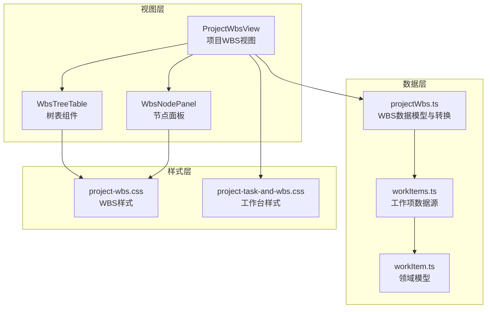
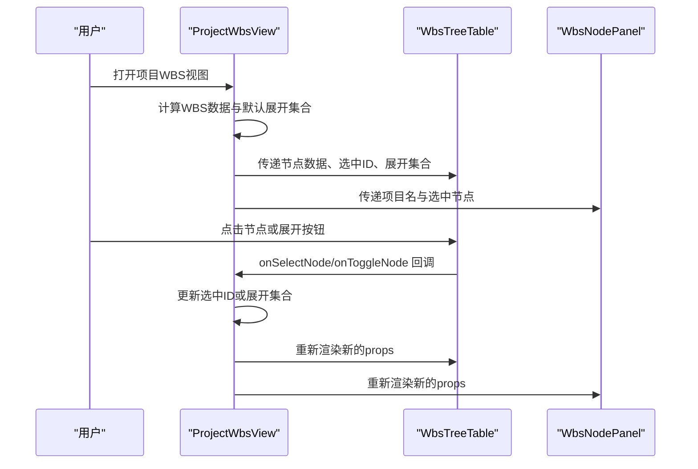
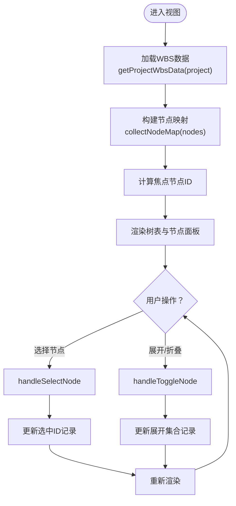
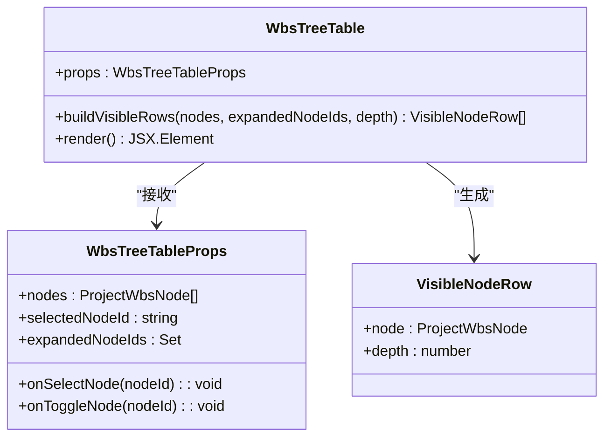
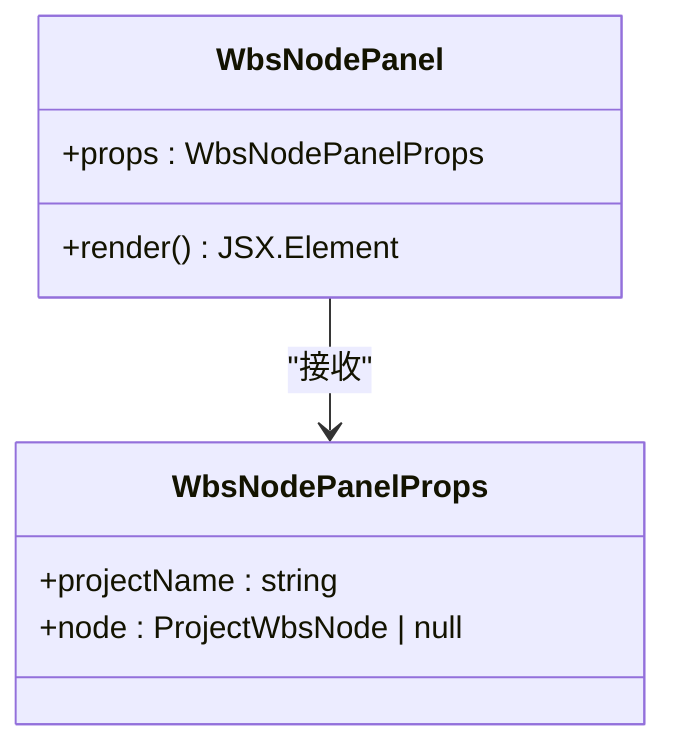
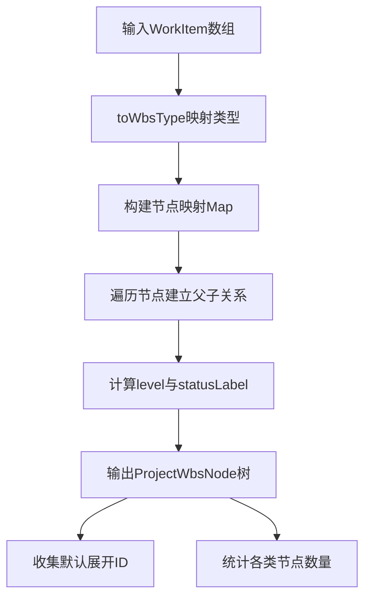
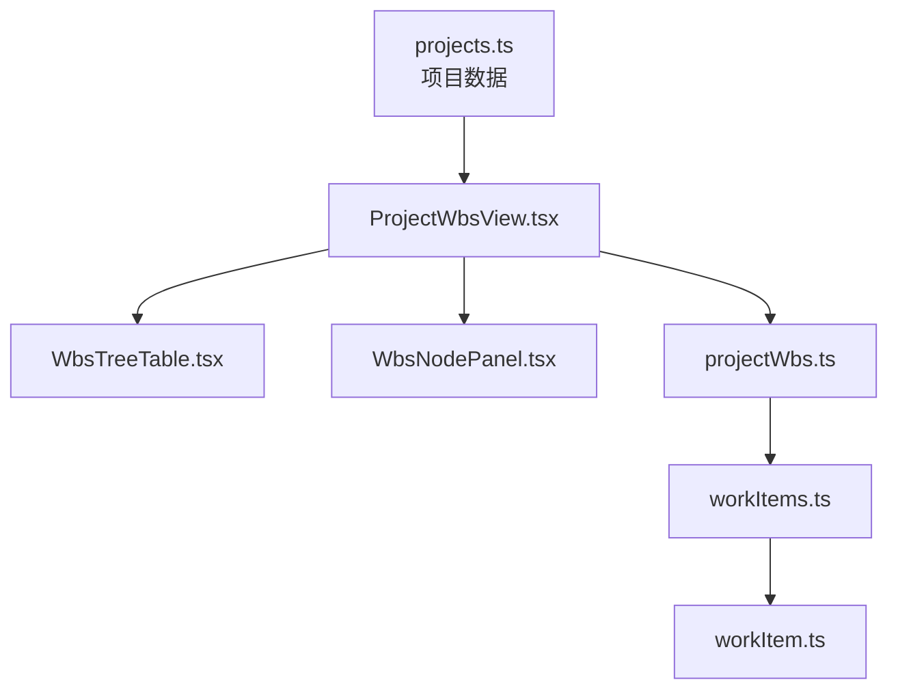

# WBS工作分解结构

<cite>
**本文档引用的文件**
- [ProjectWbsView.tsx](file://src/components/project/ProjectWbsView.tsx)
- [WbsTreeTable.tsx](file://src/components/project/WbsTreeTable.tsx)
- [WbsNodePanel.tsx](file://src/components/project/WbsNodePanel.tsx)
- [project-wbs.css](file://src/components/project/project-wbs.css)
- [project-task-and-wbs.css](file://src/components/project/project-task-and-wbs.css)
- [projectWbs.ts](file://src/data/projectWbs.ts)
- [workItems.ts](file://src/data/workItems.ts)
- [workItem.ts](file://src/domain/workItem.ts)
- [ProjectTaskAndWbsView.tsx](file://src/components/project/ProjectTaskAndWbsView.tsx)
- [TaskTreeView.tsx](file://src/components/task/TaskTreeView.tsx)
- [projects.ts](file://src/data/projects.ts)
</cite>

## 目录

1. [简介](#简介)
2. [项目结构](#项目结构)
3. [核心组件](#核心组件)
4. [架构总览](#架构总览)
5. [详细组件分析](#详细组件分析)
6. [依赖关系分析](#依赖关系分析)
7. [性能考虑](#性能考虑)
8. [故障排除指南](#故障排除指南)
9. [结论](#结论)
10. [附录](#附录)

## 简介

本文件系统性阐述WBS（工作分解结构）在项目管理中的实现架构与交互逻辑。WBS视图采用“树表混合视图”设计，左侧为树形表格展示任务层级关系，右侧为节点面板展示选中节点的详细信息。系统支持节点选择、展开/折叠、状态与进度可视化，并提供响应式布局适配不同屏幕尺寸。

## 项目结构

WBS功能由三层协作构成：

- 视图层：负责UI渲染与用户交互（ProjectWbsView、WbsTreeTable、WbsNodePanel）
- 数据层：负责WBS节点构建与统计（projectWbs.ts、workItems.ts、workItem.ts）
- 样式层：负责视觉表现与响应式适配（project-wbs.css、project-task-and-wbs.css）

**图表来源**

- [ProjectWbsView.tsx:1-110](file://src/components/project/ProjectWbsView.tsx#L1-L110)
- [WbsTreeTable.tsx:1-91](file://src/components/project/WbsTreeTable.tsx#L1-L91)
- [WbsNodePanel.tsx:1-86](file://src/components/project/WbsNodePanel.tsx#L1-L86)
- [projectWbs.ts:1-134](file://src/data/projectWbs.ts#L1-L134)
- [workItems.ts:1-441](file://src/data/workItems.ts#L1-L441)
- [workItem.ts:1-68](file://src/domain/workItem.ts#L1-L68)
- [project-wbs.css:1-403](file://src/components/project/project-wbs.css#L1-L403)
- [project-task-and-wbs.css:1-368](file://src/components/project/project-task-and-wbs.css#L1-L368)

**章节来源**

- [ProjectWbsView.tsx:1-110](file://src/components/project/ProjectWbsView.tsx#L1-L110)
- [projectWbs.ts:1-134](file://src/data/projectWbs.ts#L1-L134)
- [workItems.ts:1-441](file://src/data/workItems.ts#L1-L441)
- [workItem.ts:1-68](file://src/domain/workItem.ts#L1-L68)
- [project-wbs.css:1-403](file://src/components/project/project-wbs.css#L1-L403)
- [project-task-and-wbs.css:1-368](file://src/components/project/project-task-and-wbs.css#L1-L368)

## 核心组件

- ProjectWbsView：聚合WBS数据、维护选中节点与展开状态，协调树表与节点面板
- WbsTreeTable：构建可见行列表，渲染树形表格，处理选择与展开事件
- WbsNodePanel：展示选中节点的详细信息与进度条
- projectWbs.ts：将WorkItem转换为WBS节点树，计算默认展开集合与统计信息
- workItems.ts：提供项目模板工作项数据，支持从任务映射生成WorkItem
- workItem.ts：定义WorkItem领域模型与状态映射

**章节来源**

- [ProjectWbsView.tsx:26-107](file://src/components/project/ProjectWbsView.tsx#L26-L107)
- [WbsTreeTable.tsx:36-90](file://src/components/project/WbsTreeTable.tsx#L36-L90)
- [WbsNodePanel.tsx:15-85](file://src/components/project/WbsNodePanel.tsx#L15-L85)
- [projectWbs.ts:48-133](file://src/data/projectWbs.ts#L48-L133)
- [workItems.ts:409-441](file://src/data/workItems.ts#L409-L441)
- [workItem.ts:9-68](file://src/domain/workItem.ts#L9-L68)

## 架构总览

WBS视图采用函数式组件与受控状态模式，通过props向下传递数据与回调，确保组件职责单一且易于测试。

**图表来源**

- [ProjectWbsView.tsx:26-107](file://src/components/project/ProjectWbsView.tsx#L26-L107)
- [WbsTreeTable.tsx:36-90](file://src/components/project/WbsTreeTable.tsx#L36-L90)
- [WbsNodePanel.tsx:15-85](file://src/components/project/WbsNodePanel.tsx#L15-L85)

## 详细组件分析

### ProjectWbsView：WBS视图容器

- 职责：加载WBS数据、维护选中节点与展开状态、构建节点映射、协调子组件
- 关键逻辑：
  - 使用memo化避免重复计算WBS数据与节点映射
  - 通过record维护每个项目的独立选中ID与展开集合
  - 提供handleSelectNode与handleToggleNode回调给子组件
- 性能特性：仅在项目或数据变化时重建缓存；展开状态按项目隔离

**图表来源**

- [ProjectWbsView.tsx:12-63](file://src/components/project/ProjectWbsView.tsx#L12-L63)

**章节来源**

- [ProjectWbsView.tsx:26-107](file://src/components/project/ProjectWbsView.tsx#L26-L107)

### WbsTreeTable：树形表格渲染

- 职责：将树形数据转换为可见行列表，渲染表格行，处理选择与展开
- 关键逻辑：
  - buildVisibleRows递归构建可见行，根据展开集合决定是否展开子节点
  - 每行根据深度动态设置左内边距，形成缩进效果
  - 通过事件冒泡阻止在展开按钮上触发节点选择
- 可视化：网格布局的表头与行，包含WBS编码、名称、类型、负责人、状态、进度等列

**图表来源**

- [WbsTreeTable.tsx:3-14](file://src/components/project/WbsTreeTable.tsx#L3-L14)
- [WbsTreeTable.tsx:23-34](file://src/components/project/WbsTreeTable.tsx#L23-L34)
- [WbsTreeTable.tsx:36-90](file://src/components/project/WbsTreeTable.tsx#L36-L90)

**章节来源**

- [WbsTreeTable.tsx:23-90](file://src/components/project/WbsTreeTable.tsx#L23-L90)

### WbsNodePanel：节点详情面板

- 职责：展示选中节点的详细信息，包括WBS编码、类型、计划时间、进度、负责人、前置依赖等
- 关键逻辑：
  - 当无选中节点时返回空，避免无意义渲染
  - 进度条根据状态动态着色，支持响应式布局
  - 依赖列表为空时显示提示文本

**图表来源**

- [WbsNodePanel.tsx:3-6](file://src/components/project/WbsNodePanel.tsx#L3-L6)
- [WbsNodePanel.tsx:15-85](file://src/components/project/WbsNodePanel.tsx#L15-L85)

**章节来源**

- [WbsNodePanel.tsx:15-85](file://src/components/project/WbsNodePanel.tsx#L15-L85)

### 数据模型与转换：projectWbs.ts

- 职责：定义WBS节点类型、状态枚举；将WorkItem转换为WBS节点树；计算默认展开ID与统计信息
- 关键逻辑：
  - toWbsType：WorkItem.kind到WbsNodeType的映射
  - toWbsNodes：构建节点映射与父子关系，计算level与statusLabel
  - collectDefaultExpandedIds：默认展开项目与工作包节点
  - countNodesByType/countDelayedNodes：统计各类节点数量与延误节点数

**图表来源**

- [projectWbs.ts:41-85](file://src/data/projectWbs.ts#L41-L85)
- [projectWbs.ts:111-133](file://src/data/projectWbs.ts#L111-L133)

**章节来源**

- [projectWbs.ts:6-37](file://src/data/projectWbs.ts#L6-L37)
- [projectWbs.ts:41-85](file://src/data/projectWbs.ts#L41-L85)
- [projectWbs.ts:111-133](file://src/data/projectWbs.ts#L111-L133)

### 数据源：workItems.ts

- 职责：提供项目模板工作项数据，支持从任务映射生成WorkItem
- 关键逻辑：
  - buildProjectWorkItemTemplates：构建项目WBS模板数据
  - mapTasksToWorkItems：将任务数据映射为WorkItem，推断来源类型与领域

**章节来源**

- [workItems.ts:43-441](file://src/data/workItems.ts#L43-L441)

### 领域模型：workItem.ts

- 职责：定义WorkItem的类型、状态枚举与标签映射
- 关键逻辑：
  - WorkItemStatus枚举与WORK_ITEM_STATUS_LABEL映射
  - toWorkItemStatus：根据字符串或阻塞状态推断WorkItemStatus

**章节来源**

- [workItem.ts:1-68](file://src/domain/workItem.ts#L1-L68)

### 样式与响应式：project-wbs.css

- 职责：定义WBS视图的视觉样式与响应式规则
- 关键特性：
  - 网格布局的树表头与行，支持在小屏隐藏列
  - 状态标签与进度条的颜色变量，按状态动态切换
  - 节点面板的粘性布局与响应式网格

**章节来源**

- [project-wbs.css:86-236](file://src/components/project/project-wbs.css#L86-L236)
- [project-wbs.css:238-403](file://src/components/project/project-wbs.css#L238-L403)

### 与其他视图的集成：ProjectTaskAndWbsView.tsx

- 职责：在结构视图与时间视图之间切换，统一项目工作项视图入口
- 关键逻辑：通过视图模式记录在组件内部维护，支持按项目隔离

**章节来源**

- [ProjectTaskAndWbsView.tsx:15-69](file://src/components/project/ProjectTaskAndWbsView.tsx#L15-L69)

## 依赖关系分析

WBS视图的依赖链清晰，遵循自顶向下的数据流与自底向上的事件流：

**图表来源**

- [projects.ts:1-451](file://src/data/projects.ts#L1-L451)
- [ProjectWbsView.tsx:1-110](file://src/components/project/ProjectWbsView.tsx#L1-L110)
- [WbsTreeTable.tsx:1-91](file://src/components/project/WbsTreeTable.tsx#L1-L91)
- [WbsNodePanel.tsx:1-86](file://src/components/project/WbsNodePanel.tsx#L1-L86)
- [projectWbs.ts:1-134](file://src/data/projectWbs.ts#L1-L134)
- [workItems.ts:1-441](file://src/data/workItems.ts#L1-L441)
- [workItem.ts:1-68](file://src/domain/workItem.ts#L1-L68)

**章节来源**

- [ProjectWbsView.tsx:1-110](file://src/components/project/ProjectWbsView.tsx#L1-L110)
- [projectWbs.ts:1-134](file://src/data/projectWbs.ts#L1-L134)

## 性能考虑

- 渲染优化
  - 使用memo化避免重复计算WBS数据与节点映射
  - buildVisibleRows按展开集合惰性展开子节点，减少不必要的渲染
- 状态管理
  - 将选中ID与展开集合按项目隔离存储，避免全局状态污染
  - 通过受控组件模式，确保状态更新可预测
- 样式优化
  - 使用CSS变量统一管理状态颜色，减少重复样式定义
  - 响应式媒体查询按需隐藏列，提升移动端可读性

[本节为通用指导，无需具体文件引用]

## 故障排除指南

- 无节点显示
  - 检查WBS数据是否正确加载（getProjectWbsData）
  - 确认节点映射是否为空（collectNodeMap）
- 展开/折叠无效
  - 检查handleToggleNode是否被正确传递给WbsTreeTable
  - 确认expandedNodeIds是否按项目隔离存储
- 选中状态异常
  - 检查handleSelectNode是否更新了对应项目的选中ID
  - 确认selectedNodeId计算逻辑（优先使用当前项目ID，否则使用焦点ID）
- 样式错乱
  - 检查project-wbs.css是否正确引入
  - 确认响应式断点设置是否符合预期

**章节来源**

- [ProjectWbsView.tsx:26-107](file://src/components/project/ProjectWbsView.tsx#L26-L107)
- [project-wbs.css:1-403](file://src/components/project/project-wbs.css#L1-L403)

## 结论

WBS工作分解结构通过清晰的分层架构实现了树形结构展示、节点展开折叠与任务层级关系的可视化。视图层、数据层与样式层职责分离，配合受控状态与memo化优化，提供了良好的可维护性与性能表现。未来可在现有基础上扩展节点操作（新增、编辑、删除）、拖拽重组与批量操作能力，进一步完善任务管理功能。

[本节为总结性内容，无需具体文件引用]

## 附录

### WBS节点操作功能扩展建议

- 新增节点
  - 在父节点下添加子节点，更新父节点children并重建节点映射
  - 设置默认level与status，生成唯一ID与WBS编码
- 编辑节点
  - 提供表单组件，支持修改名称、负责人、计划时间等字段
  - 更新对应节点属性并触发重渲染
- 删除节点
  - 递归删除子节点，更新父节点children
  - 处理依赖关系与进度更新
- 拖拽重组
  - 使用HTML5拖拽API或第三方库（如react-beautiful-dnd）
  - 在drop事件中更新父子关系与WBS编码
- 批量操作
  - 实现多选框与批量菜单，支持批量编辑状态、负责人或计划时间
  - 对选中节点进行一致性校验与原子性更新

### 自定义WBS节点显示样式的示例路径

- 修改节点类型标签：在WbsTreeTable中调整TYPE_LABELS映射
  - [WbsTreeTable.tsx:16-21](file://src/components/project/WbsTreeTable.tsx#L16-L21)
- 自定义节点图标与缩进：调整WbsTreeTable的节点渲染逻辑
  - [WbsTreeTable.tsx:61-78](file://src/components/project/WbsTreeTable.tsx#L61-L78)
- 调整状态样式：通过project-wbs.css中的状态类名覆盖
  - [project-wbs.css:192-236](file://src/components/project/project-wbs.css#L192-L236)
- 扩展节点面板字段：在WbsNodePanel中添加新字段展示
  - [WbsNodePanel.tsx:30-81](file://src/components/project/WbsNodePanel.tsx#L30-L81)

### 与任务树视图的对比与借鉴

- 任务树视图（TaskTreeView）展示了类似的树形结构与展开逻辑，可借鉴其过滤、统计与键盘交互实现
  - [TaskTreeView.tsx:17-23](file://src/components/task/TaskTreeView.tsx#L17-L23)
  - [TaskTreeView.tsx:125-149](file://src/components/task/TaskTreeView.tsx#L125-L149)
  - [TaskTreeView.tsx:152-162](file://src/components/task/TaskTreeView.tsx#L152-L162)

**章节来源**

- [WbsTreeTable.tsx:16-78](file://src/components/project/WbsTreeTable.tsx#L16-L78)
- [project-wbs.css:192-236](file://src/components/project/project-wbs.css#L192-L236)
- [WbsNodePanel.tsx:30-81](file://src/components/project/WbsNodePanel.tsx#L30-L81)
- [TaskTreeView.tsx:17-23](file://src/components/task/TaskTreeView.tsx#L17-L23)
- [TaskTreeView.tsx:125-162](file://src/components/task/TaskTreeView.tsx#L125-L162)
