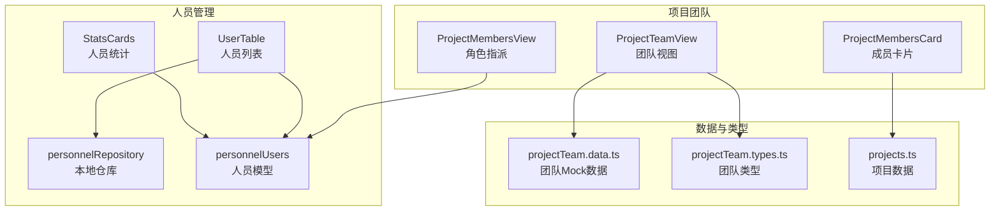
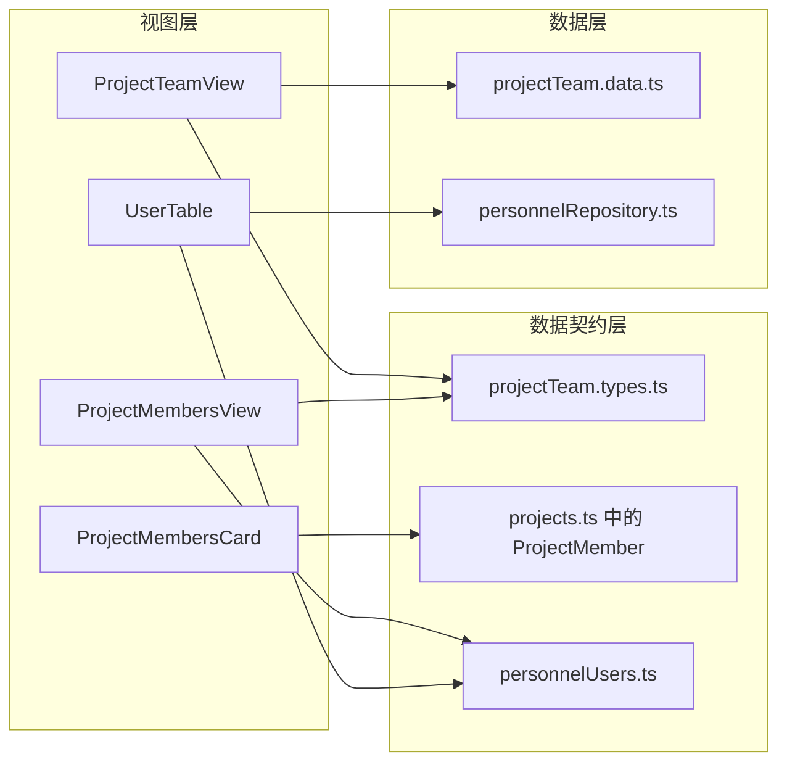
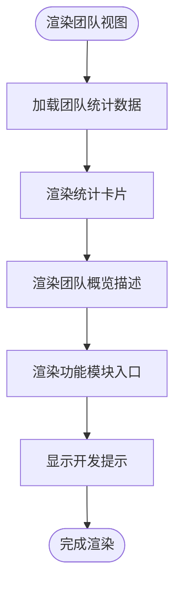
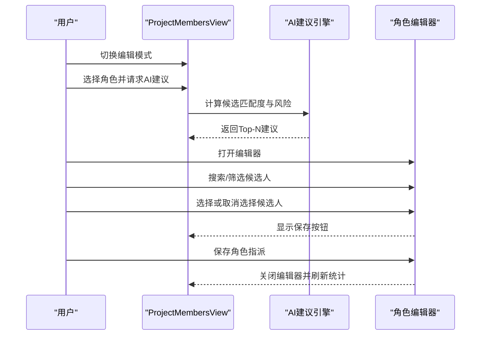
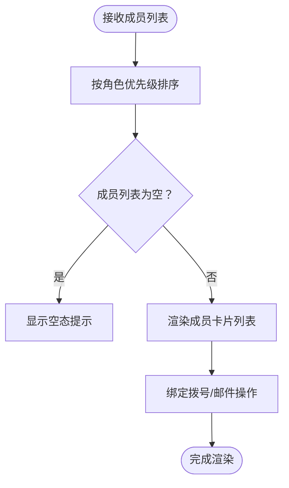
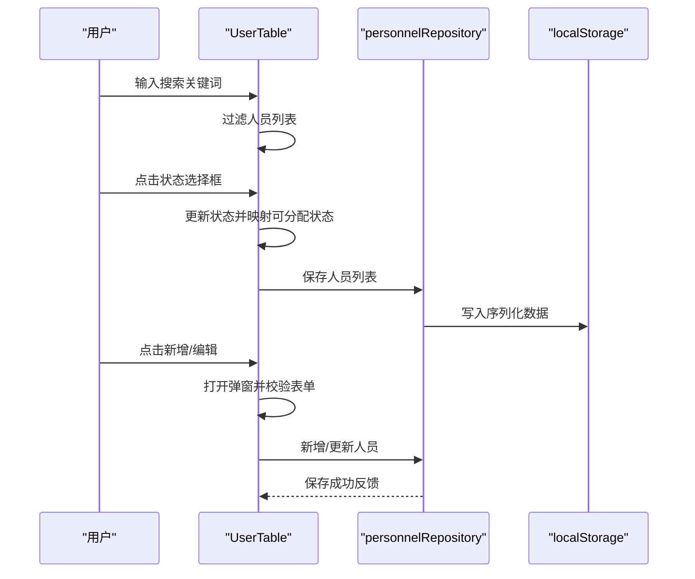
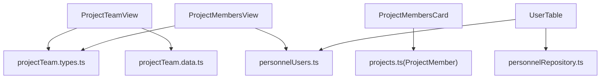

# 项目团队管理

<cite>
**本文引用的文件**
- [src/components/project/ProjectTeamView.tsx](file://src/components/project/ProjectTeamView.tsx)
- [src/components/project/ProjectTeamView.css](file://src/components/project/ProjectTeamView.css)
- [src/components/project/projectTeam.data.ts](file://src/components/project/projectTeam.data.ts)
- [src/components/project/projectTeam.types.ts](file://src/components/project/projectTeam.types.ts)
- [src/components/project/ProjectMembersView.tsx](file://src/components/project/ProjectMembersView.tsx)
- [src/components/project/ProjectMembersCard.tsx](file://src/components/project/ProjectMembersCard.tsx)
- [src/components/personnel/UserTable.tsx](file://src/components/personnel/UserTable.tsx)
- [src/components/personnel/personnelUsers.ts](file://src/components/personnel/personnelUsers.ts)
- [src/components/personnel/personnelRepository.ts](file://src/components/personnel/personnelRepository.ts)
- [src/components/personnel/StatsCards.tsx](file://src/components/personnel/StatsCards.tsx)
- [src/data/projects.ts](file://src/data/projects.ts)
</cite>

## 目录

1. [简介](#简介)
2. [项目结构](#项目结构)
3. [核心组件](#核心组件)
4. [架构总览](#架构总览)
5. [详细组件分析](#详细组件分析)
6. [依赖分析](#依赖分析)
7. [性能考虑](#性能考虑)
8. [故障排除指南](#故障排除指南)
9. [结论](#结论)
10. [附录](#附录)

## 简介

本文件面向项目团队管理功能，系统性梳理“项目团队视图”“成员卡片”“角色与权限”“协作流程”“统计信息”等模块的实现架构与数据处理逻辑。文档同时给出成员添加/移除、角色分配、权限控制的实现原理，并提供扩展点与与人员管理模块数据同步的最佳实践。

## 项目结构

项目团队管理功能主要分布在以下模块：

- 项目团队视图：展示团队概览、统计卡片与功能模块入口
- 项目角色指派：基于角色定义与候选人的角色分配与AI建议
- 项目成员卡片：项目维度的成员展示与快速操作
- 人员管理：人员列表、状态与资料维护，提供本地持久化仓库
- 类型与Mock数据：统一的数据契约与演示数据

**图表来源**

- [src/components/project/ProjectTeamView.tsx:1-91](file://src/components/project/ProjectTeamView.tsx#L1-L91)
- [src/components/project/ProjectMembersView.tsx:1-632](file://src/components/project/ProjectMembersView.tsx#L1-L632)
- [src/components/project/ProjectMembersCard.tsx:1-165](file://src/components/project/ProjectMembersCard.tsx#L1-L165)
- [src/components/project/projectTeam.data.ts:1-424](file://src/components/project/projectTeam.data.ts#L1-L424)
- [src/components/project/projectTeam.types.ts:1-83](file://src/components/project/projectTeam.types.ts#L1-L83)
- [src/components/personnel/UserTable.tsx:1-540](file://src/components/personnel/UserTable.tsx#L1-L540)
- [src/components/personnel/personnelUsers.ts:1-416](file://src/components/personnel/personnelUsers.ts#L1-L416)
- [src/components/personnel/personnelRepository.ts:1-58](file://src/components/personnel/personnelRepository.ts#L1-L58)
- [src/components/personnel/StatsCards.tsx:1-41](file://src/components/personnel/StatsCards.tsx#L1-L41)
- [src/data/projects.ts:1-451](file://src/data/projects.ts#L1-L451)

**章节来源**

- [src/components/project/ProjectTeamView.tsx:1-91](file://src/components/project/ProjectTeamView.tsx#L1-L91)
- [src/components/project/ProjectMembersView.tsx:1-632](file://src/components/project/ProjectMembersView.tsx#L1-L632)
- [src/components/project/ProjectMembersCard.tsx:1-165](file://src/components/project/ProjectMembersCard.tsx#L1-L165)
- [src/components/project/projectTeam.data.ts:1-424](file://src/components/project/projectTeam.data.ts#L1-L424)
- [src/components/project/projectTeam.types.ts:1-83](file://src/components/project/projectTeam.types.ts#L1-L83)
- [src/components/personnel/UserTable.tsx:1-540](file://src/components/personnel/UserTable.tsx#L1-L540)
- [src/components/personnel/personnelUsers.ts:1-416](file://src/components/personnel/personnelUsers.ts#L1-L416)
- [src/components/personnel/personnelRepository.ts:1-58](file://src/components/personnel/personnelRepository.ts#L1-L58)
- [src/components/personnel/StatsCards.tsx:1-41](file://src/components/personnel/StatsCards.tsx#L1-L41)
- [src/data/projects.ts:1-451](file://src/data/projects.ts#L1-L451)

## 核心组件

- 项目团队视图（ProjectTeamView）
  - 职责：展示团队统计卡片、团队概览描述与功能模块入口；当前为占位视图，提示功能开发中。
  - 关键点：统计卡片来源于团队Mock数据；模块入口用于引导到角色管理、成员列表、协作流程等功能。
- 项目角色指派（ProjectMembersView）
  - 职责：基于角色定义与候选人集合，支持单人/多人角色分配、搜索过滤、来源筛选、AI建议与保存。
  - 关键点：角色定义含最小人数、允许来源（真人/数字员工）、职责描述与能力标签；候选人含能力标签与可用性。
- 项目成员卡片（ProjectMembersCard）
  - 职责：展示项目成员基本信息、部门、电话、邮箱与快捷操作（拨号/邮件）。
  - 关键点：按角色优先级排序；支持点击回调；空态提示。
- 人员管理（UserTable）
  - 职责：人员列表展示、搜索、状态切换、新增/编辑弹窗、本地持久化。
  - 关键点：本地仓库封装localStorage存取；表单校验与反馈；状态映射（在岗/请假/离岗/禁用）。
- 类型与Mock数据
  - 职责：统一团队成员、角色、协作流程与统计的数据契约；提供演示数据。
  - 关键点：团队成员含角色权限数组；协作流程含类型、触发器、参与者与启用状态；角色含权限与颜色。

**章节来源**

- [src/components/project/ProjectTeamView.tsx:1-91](file://src/components/project/ProjectTeamView.tsx#L1-L91)
- [src/components/project/ProjectMembersView.tsx:1-632](file://src/components/project/ProjectMembersView.tsx#L1-L632)
- [src/components/project/ProjectMembersCard.tsx:1-165](file://src/components/project/ProjectMembersCard.tsx#L1-L165)
- [src/components/personnel/UserTable.tsx:1-540](file://src/components/personnel/UserTable.tsx#L1-L540)
- [src/components/project/projectTeam.data.ts:1-424](file://src/components/project/projectTeam.data.ts#L1-L424)
- [src/components/project/projectTeam.types.ts:1-83](file://src/components/project/projectTeam.types.ts#L1-L83)

## 架构总览

项目团队管理采用“视图-数据契约-本地仓库”的分层设计：

- 视图层：团队视图、角色指派、成员卡片、人员列表
- 数据契约层：团队类型定义、项目成员类型、人员模型
- 数据层：团队Mock数据、人员Mock数据、本地仓库

**图表来源**

- [src/components/project/ProjectTeamView.tsx:1-91](file://src/components/project/ProjectTeamView.tsx#L1-L91)
- [src/components/project/ProjectMembersView.tsx:1-632](file://src/components/project/ProjectMembersView.tsx#L1-L632)
- [src/components/project/ProjectMembersCard.tsx:1-165](file://src/components/project/ProjectMembersCard.tsx#L1-L165)
- [src/components/personnel/UserTable.tsx:1-540](file://src/components/personnel/UserTable.tsx#L1-L540)
- [src/components/project/projectTeam.types.ts:1-83](file://src/components/project/projectTeam.types.ts#L1-L83)
- [src/data/projects.ts:1-451](file://src/data/projects.ts#L1-L451)
- [src/components/personnel/personnelUsers.ts:1-416](file://src/components/personnel/personnelUsers.ts#L1-L416)
- [src/components/project/projectTeam.data.ts:1-424](file://src/components/project/projectTeam.data.ts#L1-L424)
- [src/components/personnel/personnelRepository.ts:1-58](file://src/components/personnel/personnelRepository.ts#L1-L58)

## 详细组件分析

### 项目团队视图（ProjectTeamView）

- 组件职责
  - 展示团队统计卡片（总成员、在线成员、数字员工、协作健康度）
  - 团队概览描述（项目名、成员数、数字员工数、角色覆盖率、协作评分）
  - 功能模块入口（角色管理、成员列表、协作流程）
  - 开发提示（功能开发中）
- 数据来源
  - 统计卡片值来自团队Mock数据中的团队统计对象
  - 概览描述动态拼接项目名与统计值
- 样式要点
  - 响应式网格布局，适配移动端
  - 卡片悬停效果与模块卡片交互

**图表来源**

- [src/components/project/ProjectTeamView.tsx:1-91](file://src/components/project/ProjectTeamView.tsx#L1-L91)
- [src/components/project/projectTeam.data.ts:11-17](file://src/components/project/projectTeam.data.ts#L11-L17)

**章节来源**

- [src/components/project/ProjectTeamView.tsx:1-91](file://src/components/project/ProjectTeamView.tsx#L1-L91)
- [src/components/project/ProjectTeamView.css:1-173](file://src/components/project/ProjectTeamView.css#L1-L173)
- [src/components/project/projectTeam.data.ts:11-17](file://src/components/project/projectTeam.data.ts#L11-L17)

### 项目角色指派（ProjectMembersView）

- 组件职责
  - 角色列表与详情展示
  - 候选人搜索、来源筛选、可用性过滤
  - 单人/多人角色分配编辑器
  - AI建议生成与采纳
  - 统计信息（已配置角色数、成员数、数字员工数、关系总数）
- 数据与算法
  - 角色定义：最小人数、允许来源、职责描述、能力标签
  - 候选人：能力标签、来源、可用性、版本信息
  - AI建议评分：能力匹配度、可用性加成、数字员工加成，综合得分排序
- 权限与控制
  - 编辑模式开关控制是否允许更改
  - 保存时校验最小人数约束

**图表来源**

- [src/components/project/ProjectMembersView.tsx:208-391](file://src/components/project/ProjectMembersView.tsx#L208-L391)

**章节来源**

- [src/components/project/ProjectMembersView.tsx:1-632](file://src/components/project/ProjectMembersView.tsx#L1-L632)

### 项目成员卡片（ProjectMembersCard）

- 组件职责
  - 展示项目成员基本信息与联系方式
  - 支持点击回调与键盘访问
  - 空态提示与成员计数
- 排序规则
  - 按角色优先级排序（如项目总监 > 项目经理 > 施工主管/经理 > 设计主管/经理 > 验收专员 > 采购经理 > 协调员）

**图表来源**

- [src/components/project/ProjectMembersCard.tsx:13-161](file://src/components/project/ProjectMembersCard.tsx#L13-L161)

**章节来源**

- [src/components/project/ProjectMembersCard.tsx:1-165](file://src/components/project/ProjectMembersCard.tsx#L1-L165)

### 人员管理（UserTable）

- 组件职责
  - 人员列表展示与搜索
  - 状态切换（在岗/请假/离岗/禁用），自动映射可分配状态
  - 新增/编辑弹窗，表单校验与反馈
  - 本地持久化存储
- 本地仓库
  - 读取/写入localStorage，初始状态从Mock数据克隆
  - 自增ID生成策略

**图表来源**

- [src/components/personnel/UserTable.tsx:119-296](file://src/components/personnel/UserTable.tsx#L119-L296)
- [src/components/personnel/personnelRepository.ts:1-58](file://src/components/personnel/personnelRepository.ts#L1-L58)

**章节来源**

- [src/components/personnel/UserTable.tsx:1-540](file://src/components/personnel/UserTable.tsx#L1-L540)
- [src/components/personnel/personnelRepository.ts:1-58](file://src/components/personnel/personnelRepository.ts#L1-L58)
- [src/components/personnel/personnelUsers.ts:1-416](file://src/components/personnel/personnelUsers.ts#L1-L416)

### 类型与Mock数据

- 团队类型
  - 团队成员：包含角色权限数组、来源（真人/数字员工）、可用性、头像等
  - 团队统计：总成员、在线成员、数字员工、角色覆盖率、协作评分
  - 协作流程：类型（审批/通知/会议）、触发器、参与者、启用状态
  - 项目角色：权限集合、成员数量、颜色
- Mock数据
  - 团队成员、角色、协作流程的演示数据
  - 人员模型与默认详情数据

**章节来源**

- [src/components/project/projectTeam.types.ts:1-83](file://src/components/project/projectTeam.types.ts#L1-L83)
- [src/components/project/projectTeam.data.ts:1-424](file://src/components/project/projectTeam.data.ts#L1-L424)
- [src/components/personnel/personnelUsers.ts:1-416](file://src/components/personnel/personnelUsers.ts#L1-L416)

## 依赖分析

- 组件耦合
  - ProjectTeamView依赖团队类型与Mock数据
  - ProjectMembersView依赖人员模型与角色定义
  - ProjectMembersCard依赖项目成员类型
  - UserTable依赖人员模型与本地仓库
- 外部依赖
  - localStorage用于人员数据持久化
  - 项目数据（项目成员）来源于项目模块

**图表来源**

- [src/components/project/ProjectTeamView.tsx:1-91](file://src/components/project/ProjectTeamView.tsx#L1-L91)
- [src/components/project/ProjectMembersView.tsx:1-632](file://src/components/project/ProjectMembersView.tsx#L1-L632)
- [src/components/project/ProjectMembersCard.tsx:1-165](file://src/components/project/ProjectMembersCard.tsx#L1-L165)
- [src/components/personnel/UserTable.tsx:1-540](file://src/components/personnel/UserTable.tsx#L1-L540)
- [src/components/project/projectTeam.types.ts:1-83](file://src/components/project/projectTeam.types.ts#L1-L83)
- [src/components/project/projectTeam.data.ts:1-424](file://src/components/project/projectTeam.data.ts#L1-L424)
- [src/components/personnel/personnelUsers.ts:1-416](file://src/components/personnel/personnelUsers.ts#L1-L416)
- [src/components/personnel/personnelRepository.ts:1-58](file://src/components/personnel/personnelRepository.ts#L1-L58)
- [src/data/projects.ts:1-451](file://src/data/projects.ts#L1-L451)

**章节来源**

- [src/components/project/ProjectTeamView.tsx:1-91](file://src/components/project/ProjectTeamView.tsx#L1-L91)
- [src/components/project/ProjectMembersView.tsx:1-632](file://src/components/project/ProjectMembersView.tsx#L1-L632)
- [src/components/project/ProjectMembersCard.tsx:1-165](file://src/components/project/ProjectMembersCard.tsx#L1-L165)
- [src/components/personnel/UserTable.tsx:1-540](file://src/components/personnel/UserTable.tsx#L1-L540)
- [src/components/project/projectTeam.types.ts:1-83](file://src/components/project/projectTeam.types.ts#L1-L83)
- [src/components/project/projectTeam.data.ts:1-424](file://src/components/project/projectTeam.data.ts#L1-L424)
- [src/components/personnel/personnelUsers.ts:1-416](file://src/components/personnel/personnelUsers.ts#L1-L416)
- [src/components/personnel/personnelRepository.ts:1-58](file://src/components/personnel/personnelRepository.ts#L1-L58)
- [src/data/projects.ts:1-451](file://src/data/projects.ts#L1-L451)

## 性能考虑

- 渲染优化
  - 使用memo化计算统计与过滤结果，避免重复计算
  - 列表渲染中使用稳定的key，减少重排
- 数据访问
  - 人员数据本地持久化，减少网络请求
  - Mock数据仅用于演示，生产环境应替换为真实API
- 交互体验
  - 搜索与筛选即时生效，保持UI响应流畅
  - AI建议异步计算，避免阻塞主线程

## 故障排除指南

- 人员状态更新无效
  - 检查状态映射函数是否正确调用，确保可分配状态与人员状态一致
  - 确认本地仓库写入成功，检查localStorage是否被清理
- 角色保存失败
  - 校验最小人数约束是否满足
  - 确认编辑器已关闭且状态已刷新
- 成员卡片点击无响应
  - 检查事件冒泡是否被阻止
  - 确认回调函数已传入

**章节来源**

- [src/components/personnel/UserTable.tsx:276-296](file://src/components/personnel/UserTable.tsx#L276-L296)
- [src/components/project/ProjectMembersView.tsx:300-315](file://src/components/project/ProjectMembersView.tsx#L300-L315)
- [src/components/project/ProjectMembersCard.tsx:74-87](file://src/components/project/ProjectMembersCard.tsx#L74-L87)

## 结论

项目团队管理功能以清晰的分层架构实现了团队视图、角色指派、成员卡片与人员管理的协同。通过类型契约与Mock数据确保了前后端解耦与快速迭代；通过本地仓库与状态映射保障了数据一致性与用户体验。后续可在此基础上扩展真实API、完善权限控制与协作流程配置。

## 附录

### 成员添加/移除与角色分配实现原理

- 成员添加/移除
  - 人员管理：通过UserTable的新增/编辑弹窗与表单校验，写入本地仓库；支持状态切换与可分配状态映射
  - 项目成员：通过项目成员卡片的点击回调与项目数据契约，将人员纳入项目成员列表
- 角色分配
  - 基于角色定义与候选人集合，支持单人/多人分配；AI建议提供评分与风险提示；保存时校验最小人数

**章节来源**

- [src/components/personnel/UserTable.tsx:152-274](file://src/components/personnel/UserTable.tsx#L152-L274)
- [src/components/project/ProjectMembersView.tsx:268-315](file://src/components/project/ProjectMembersView.tsx#L268-L315)
- [src/components/project/ProjectMembersCard.tsx:74-87](file://src/components/project/ProjectMembersCard.tsx#L74-L87)

### 权限控制与协作流程

- 权限控制
  - 团队成员类型包含角色权限数组，支持view/edit/approve
  - 角色定义包含权限集合与颜色标识
- 协作流程
  - 协作流程类型包含审批/通知/会议三类，支持触发器与参与者配置

**章节来源**

- [src/components/project/projectTeam.types.ts:23-31](file://src/components/project/projectTeam.types.ts#L23-L31)
- [src/components/project/projectTeam.types.ts:65-72](file://src/components/project/projectTeam.types.ts#L65-L72)
- [src/components/project/projectTeam.data.ts:350-423](file://src/components/project/projectTeam.data.ts#L350-L423)

### 与人员管理模块数据同步最佳实践

- 人员数据来源
  - 人员列表与详情来自人员模块的Mock数据与本地仓库
- 同步策略
  - 项目成员列表应与人员模块的人员状态保持一致，状态变化需双向反映
  - 人员状态映射函数用于将“在岗/请假/离岗/禁用”映射为“可分配/忙碌/不可分配”
- 扩展建议
  - 引入真实API替代本地仓库，确保多端一致性
  - 在项目成员卡片中增加“从人员库选择成员”的入口，提升协作效率

**章节来源**

- [src/components/personnel/personnelUsers.ts:31-37](file://src/components/personnel/personnelUsers.ts#L31-L37)
- [src/components/personnel/UserTable.tsx:276-296](file://src/components/personnel/UserTable.tsx#L276-L296)
- [src/components/project/ProjectMembersCard.tsx:74-87](file://src/components/project/ProjectMembersCard.tsx#L74-L87)
