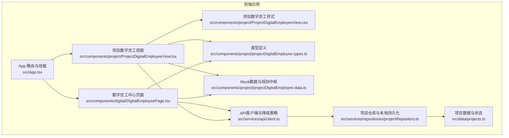
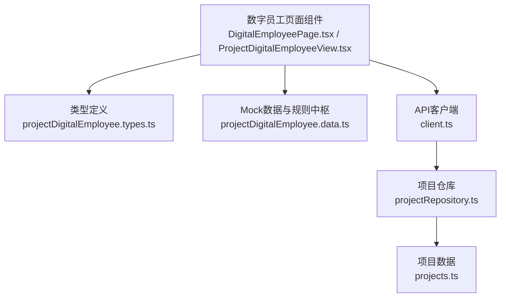
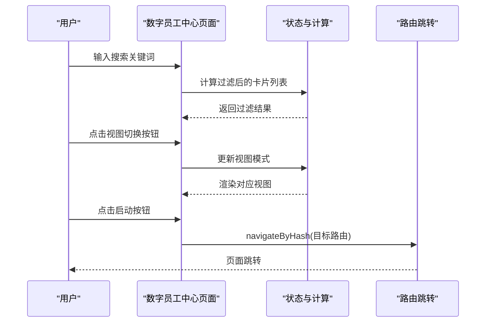
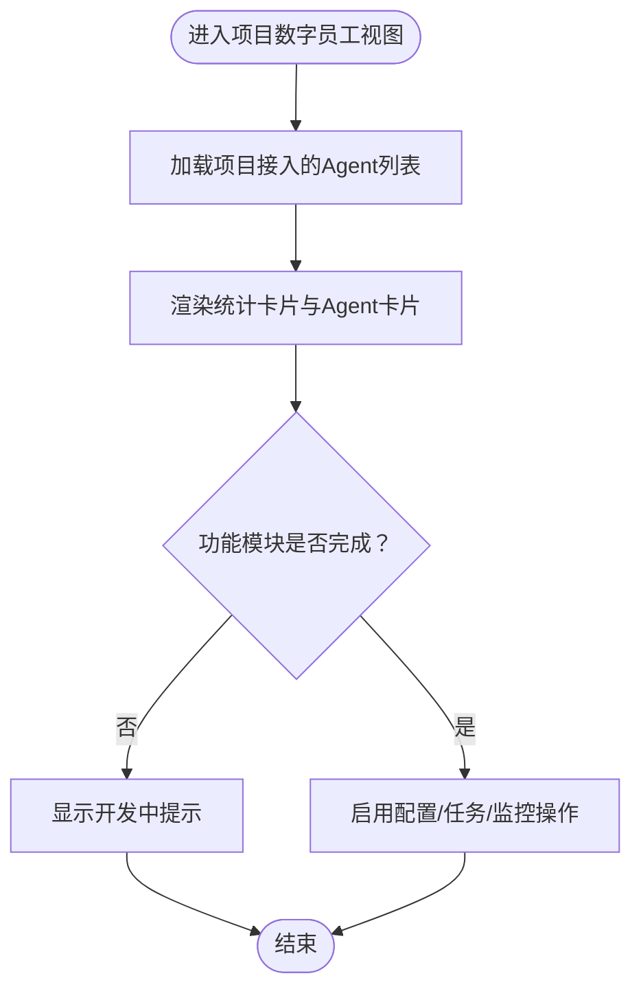
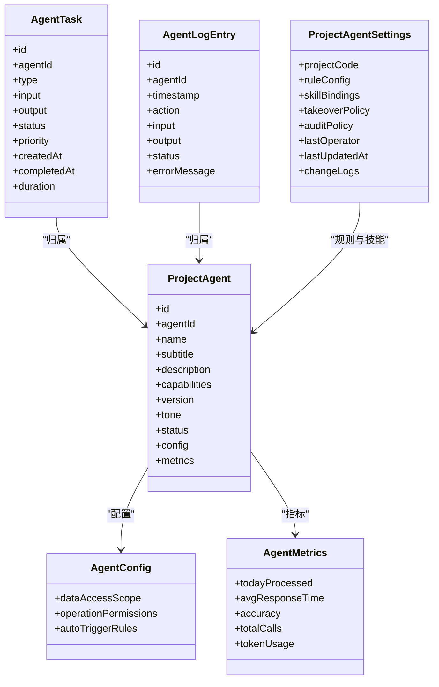
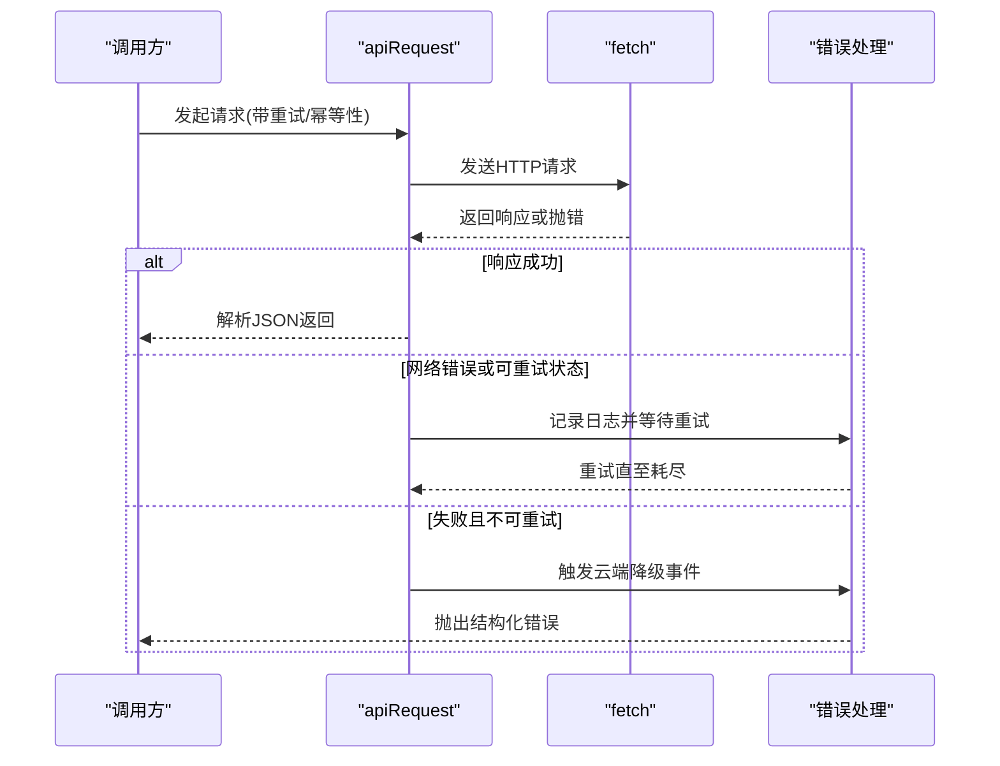
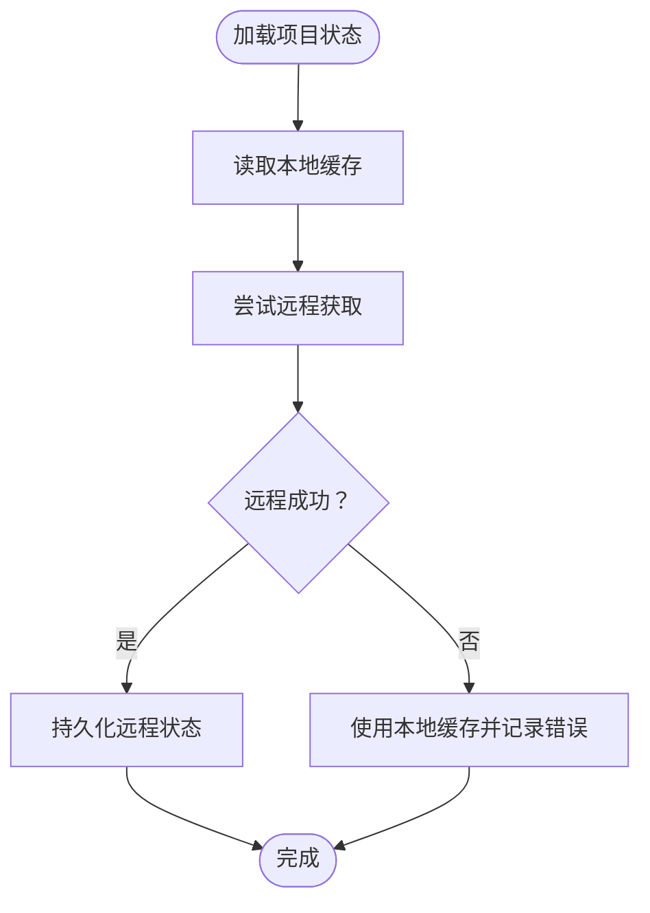
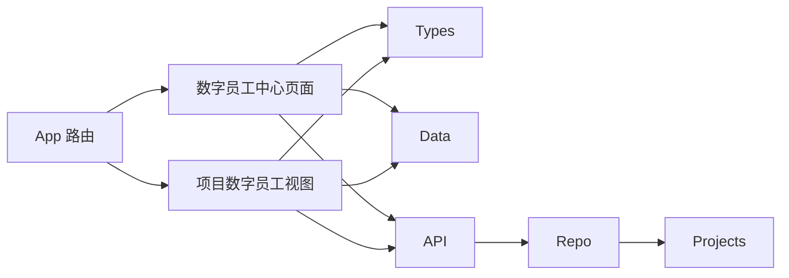

# 项目数字员工

<cite>
**本文引用的文件**
- [src/components/digital/DigitalEmployeePage.tsx](file://src/components/digital/DigitalEmployeePage.tsx)
- [src/components/project/ProjectDigitalEmployeeView.tsx](file://src/components/project/ProjectDigitalEmployeeView.tsx)
- [src/components/project/ProjectDigitalEmployeeView.css](file://src/components/project/ProjectDigitalEmployeeView.css)
- [src/components/project/projectDigitalEmployee.types.ts](file://src/components/project/projectDigitalEmployee.types.ts)
- [src/components/project/projectDigitalEmployee.data.ts](file://src/components/project/projectDigitalEmployee.data.ts)
- [src/services/api/client.ts](file://src/services/api/client.ts)
- [src/services/repositories/projectRepository.ts](file://src/services/repositories/projectRepository.ts)
- [src/App.tsx](file://src/App.tsx)
- [src/data/projects.ts](file://src/data/projects.ts)
</cite>

## 目录

1. [简介](#简介)
2. [项目结构](#项目结构)
3. [核心组件](#核心组件)
4. [架构总览](#架构总览)
5. [详细组件分析](#详细组件分析)
6. [依赖关系分析](#依赖关系分析)
7. [性能考量](#性能考量)
8. [故障排查指南](#故障排查指南)
9. [结论](#结论)
10. [附录](#附录)

## 简介

本文件面向“项目数字员工”功能，系统性阐述其前端实现架构与交互设计，涵盖：

- 数字员工视图（全局与项目级）的界面与交互
- AI助手的交互界面与启动跳转机制
- 项目数据的智能分析与建议生成（基于现有Mock数据）
- 建议结果的可视化展示与统计汇总
- 知识库与规则中枢的集成思路、上下文记忆与个性化建议的实现原理
- 扩展数字员工功能与集成更多AI服务能力的实践路径

## 项目结构

数字员工相关的核心文件分布于以下位置：

- 全局数字员工中心页面：src/components/digital/DigitalEmployeePage.tsx
- 项目详情页中的数字员工标签页：src/components/project/ProjectDigitalEmployeeView.tsx
- 项目数字员工样式：src/components/project/ProjectDigitalEmployeeView.css
- 类型定义：src/components/project/projectDigitalEmployee.types.ts
- Mock数据与规则中枢：src/components/project/projectDigitalEmployee.data.ts
- API客户端与降级策略：src/services/api/client.ts
- 项目仓库与本地持久化：src/services/repositories/projectRepository.ts
- 应用路由与页面挂载：src/App.tsx
- 项目数据与状态：src/data/projects.ts

**图表来源**

- [src/App.tsx:858-864](file://src/App.tsx#L858-L864)
- [src/components/digital/DigitalEmployeePage.tsx:196-596](file://src/components/digital/DigitalEmployeePage.tsx#L196-L596)
- [src/components/project/ProjectDigitalEmployeeView.tsx:8-142](file://src/components/project/ProjectDigitalEmployeeView.tsx#L8-L142)
- [src/components/project/ProjectDigitalEmployeeView.css:5-265](file://src/components/project/ProjectDigitalEmployeeView.css#L5-L265)
- [src/components/project/projectDigitalEmployee.types.ts:6-232](file://src/components/project/projectDigitalEmployee.types.ts#L6-L232)
- [src/components/project/projectDigitalEmployee.data.ts:16-535](file://src/components/project/projectDigitalEmployee.data.ts#L16-L535)
- [src/services/api/client.ts:83-172](file://src/services/api/client.ts#L83-L172)
- [src/services/repositories/projectRepository.ts:53-90](file://src/services/repositories/projectRepository.ts#L53-L90)
- [src/data/projects.ts:333-344](file://src/data/projects.ts#L333-L344)

**章节来源**

- [src/App.tsx:858-864](file://src/App.tsx#L858-L864)
- [src/components/digital/DigitalEmployeePage.tsx:196-596](file://src/components/digital/DigitalEmployeePage.tsx#L196-L596)
- [src/components/project/ProjectDigitalEmployeeView.tsx:8-142](file://src/components/project/ProjectDigitalEmployeeView.tsx#L8-L142)
- [src/components/project/ProjectDigitalEmployeeView.css:5-265](file://src/components/project/ProjectDigitalEmployeeView.css#L5-L265)
- [src/components/project/projectDigitalEmployee.types.ts:6-232](file://src/components/project/projectDigitalEmployee.types.ts#L6-L232)
- [src/components/project/projectDigitalEmployee.data.ts:16-535](file://src/components/project/projectDigitalEmployee.data.ts#L16-L535)
- [src/services/api/client.ts:83-172](file://src/services/api/client.ts#L83-L172)
- [src/services/repositories/projectRepository.ts:53-90](file://src/services/repositories/projectRepository.ts#L53-L90)
- [src/data/projects.ts:333-344](file://src/data/projects.ts#L333-L344)

## 核心组件

- 数字员工中心页面（全局）：提供Agent总览、搜索过滤、卡片/列表双视图、启动跳转、设计功能面板等。
- 项目数字员工视图（项目级）：展示项目接入的Agent、任务队列、运行监控与功能模块占位。
- 类型与Mock：统一定义Agent配置、任务、日志、规则中枢、技能绑定等数据结构，并提供Mock数据。
- API客户端：封装HTTP请求、幂等性、重试与云端降级事件分发。
- 项目仓库：负责本地持久化与云端同步，支持降级到本地缓存。

**章节来源**

- [src/components/digital/DigitalEmployeePage.tsx:196-596](file://src/components/digital/DigitalEmployeePage.tsx#L196-L596)
- [src/components/project/ProjectDigitalEmployeeView.tsx:8-142](file://src/components/project/ProjectDigitalEmployeeView.tsx#L8-L142)
- [src/components/project/projectDigitalEmployee.types.ts:6-232](file://src/components/project/projectDigitalEmployee.types.ts#L6-L232)
- [src/components/project/projectDigitalEmployee.data.ts:16-535](file://src/components/project/projectDigitalEmployee.data.ts#L16-L535)
- [src/services/api/client.ts:83-172](file://src/services/api/client.ts#L83-L172)
- [src/services/repositories/projectRepository.ts:53-90](file://src/services/repositories/projectRepository.ts#L53-L90)

## 架构总览

数字员工功能采用“页面组件 + 类型定义 + Mock数据 + API客户端 + 仓库”的分层架构：

- 页面组件负责UI渲染与交互（搜索、视图切换、启动按钮）。
- 类型定义与Mock数据支撑数据结构与演示。
- API客户端提供统一的请求封装与云端降级事件。
- 仓库负责本地持久化与云端同步，保障离线可用性。

**图表来源**

- [src/components/digital/DigitalEmployeePage.tsx:196-596](file://src/components/digital/DigitalEmployeePage.tsx#L196-L596)
- [src/components/project/ProjectDigitalEmployeeView.tsx:8-142](file://src/components/project/ProjectDigitalEmployeeView.tsx#L8-L142)
- [src/components/project/projectDigitalEmployee.types.ts:6-232](file://src/components/project/projectDigitalEmployee.types.ts#L6-L232)
- [src/components/project/projectDigitalEmployee.data.ts:16-535](file://src/components/project/projectDigitalEmployee.data.ts#L16-L535)
- [src/services/api/client.ts:83-172](file://src/services/api/client.ts#L83-L172)
- [src/services/repositories/projectRepository.ts:53-90](file://src/services/repositories/projectRepository.ts#L53-L90)
- [src/data/projects.ts:333-344](file://src/data/projects.ts#L333-L344)

## 详细组件分析

### 数字员工中心页面（全局）

- 视图与交互
  - 支持卡片与列表双视图，视图切换通过状态驱动。
  - 提供搜索框，关键词匹配Agent名称、副标题、描述与标签。
  - 统计卡片展示活跃Agent数、今日处理任务、平均响应时间、综合准确率。
  - 设计功能面板提供常用能力入口，支持点击外部关闭与Esc键关闭。
  - 启动按钮根据Agent配置的目标路由进行页面跳转。
- 数据与状态
  - 使用Memo化计算在线数量与平均准确率，避免重复计算。
  - 通过useEffect监听设计面板外点击与键盘事件，增强交互体验。
- 路由与导航
  - 通过哈希导航函数在不同页面间跳转，保证URL一致性。

**图表来源**

- [src/components/digital/DigitalEmployeePage.tsx:196-596](file://src/components/digital/DigitalEmployeePage.tsx#L196-L596)

**章节来源**

- [src/components/digital/DigitalEmployeePage.tsx:196-596](file://src/components/digital/DigitalEmployeePage.tsx#L196-L596)

### 项目数字员工视图（项目级）

- 视图内容
  - 展示项目接入的Agent列表与基本指标（今日处理、准确率）。
  - 提供功能模块占位（Agent配置、任务队列、运行监控）。
  - 当前为开发中占位，后续将接入真实数据与交互。
- 样式与布局
  - 使用网格与卡片布局，强调可读性与可扩展性。
  - 状态徽标区分在线/忙碌/离线，便于快速判断Agent状态。

**图表来源**

- [src/components/project/ProjectDigitalEmployeeView.tsx:8-142](file://src/components/project/ProjectDigitalEmployeeView.tsx#L8-L142)
- [src/components/project/ProjectDigitalEmployeeView.css:5-265](file://src/components/project/ProjectDigitalEmployeeView.css#L5-L265)

**章节来源**

- [src/components/project/ProjectDigitalEmployeeView.tsx:8-142](file://src/components/project/ProjectDigitalEmployeeView.tsx#L8-L142)
- [src/components/project/ProjectDigitalEmployeeView.css:5-265](file://src/components/project/ProjectDigitalEmployeeView.css#L5-L265)

### 类型与Mock：数据模型与规则中枢

- Agent配置与权限
  - 数据访问范围、操作权限、自动触发规则等，支撑Agent在项目内的行为边界。
- Agent性能指标
  - 包含今日处理量、平均响应时间、准确率、总调用次数、Token用量等。
- Agent任务与日志
  - 任务状态、优先级、输入输出、时长等；日志包含动作、状态与错误信息。
- Agent总览统计
  - 聚合项目内Agent的整体表现，便于运营与监控。
- 规则中枢与技能绑定
  - 审批策略、预警等级、自动升级策略、规则项阈值与色调、技能绑定阶段与是否需要人工审批等。
- 项目设置与变更记录
  - 规则配置、技能绑定、接管策略、审计策略与变更日志。
- 可用Agent模板
  - 需求分析、进度预测、客户沟通等模板，便于项目快速接入。

**图表来源**

- [src/components/project/projectDigitalEmployee.types.ts:29-106](file://src/components/project/projectDigitalEmployee.types.ts#L29-L106)
- [src/components/project/projectDigitalEmployee.types.ts:156-219](file://src/components/project/projectDigitalEmployee.types.ts#L156-L219)

**章节来源**

- [src/components/project/projectDigitalEmployee.types.ts:6-232](file://src/components/project/projectDigitalEmployee.types.ts#L6-L232)
- [src/components/project/projectDigitalEmployee.data.ts:16-535](file://src/components/project/projectDigitalEmployee.data.ts#L16-L535)

### API客户端与云端降级

- 请求封装
  - 统一方法、Body、幂等性Key、头部、重试次数与作用域/场景参数。
- 错误处理
  - 对网络错误与可重试状态码进行重试；重试耗尽后触发云端降级事件。
- 降级事件
  - 通过自定义事件向窗口广播降级上下文，便于UI提示与日志记录。

**图表来源**

- [src/services/api/client.ts:83-172](file://src/services/api/client.ts#L83-L172)

**章节来源**

- [src/services/api/client.ts:83-172](file://src/services/api/client.ts#L83-L172)

### 项目仓库与本地持久化

- 本地状态读取与持久化
  - 从localStorage读取项目状态与日志，解析失败时回退到初始数据。
- 远程同步与降级
  - 尝试从服务器获取最新状态，失败时保留本地缓存并记录错误。
- 保存策略
  - 本地立即持久化，同时尝试远程保存，失败时记录错误。

**图表来源**

- [src/services/repositories/projectRepository.ts:53-90](file://src/services/repositories/projectRepository.ts#L53-L90)

**章节来源**

- [src/services/repositories/projectRepository.ts:53-90](file://src/services/repositories/projectRepository.ts#L53-L90)

## 依赖关系分析

- 组件耦合
  - 数字员工中心页面依赖类型定义与Mock数据，同时通过路由跳转与其他页面协作。
  - 项目数字员工视图依赖类型与Mock数据，样式独立，便于扩展。
- 外部依赖
  - API客户端提供统一的网络与降级能力，仓库负责本地/远程状态管理。
- 路由集成
  - App路由将数字员工中心页面与项目详情页集成，支持哈希导航与页面懒加载。

**图表来源**

- [src/App.tsx:858-864](file://src/App.tsx#L858-L864)
- [src/components/digital/DigitalEmployeePage.tsx:196-596](file://src/components/digital/DigitalEmployeePage.tsx#L196-L596)
- [src/components/project/ProjectDigitalEmployeeView.tsx:8-142](file://src/components/project/ProjectDigitalEmployeeView.tsx#L8-L142)
- [src/services/api/client.ts:83-172](file://src/services/api/client.ts#L83-L172)
- [src/services/repositories/projectRepository.ts:53-90](file://src/services/repositories/projectRepository.ts#L53-L90)

**章节来源**

- [src/App.tsx:858-864](file://src/App.tsx#L858-L864)
- [src/components/digital/DigitalEmployeePage.tsx:196-596](file://src/components/digital/DigitalEmployeePage.tsx#L196-L596)
- [src/components/project/ProjectDigitalEmployeeView.tsx:8-142](file://src/components/project/ProjectDigitalEmployeeView.tsx#L8-L142)
- [src/services/api/client.ts:83-172](file://src/services/api/client.ts#L83-L172)
- [src/services/repositories/projectRepository.ts:53-90](file://src/services/repositories/projectRepository.ts#L53-L90)

## 性能考量

- 渲染优化
  - 使用Memo化计算过滤后的卡片列表、在线数量与平均准确率，减少不必要的重渲染。
  - 双视图切换通过状态切换，避免重复渲染大量DOM。
- 网络与降级
  - API客户端内置重试与可重试状态码判定，失败时触发降级事件，保障用户体验。
- 本地持久化
  - 仓库优先使用本地缓存，远程失败时无缝降级，降低首屏加载压力。

[本节为通用指导，无需特定文件来源]

## 故障排查指南

- 云端服务不可用
  - 现象：弹窗提示“云端服务暂时不可用，已启用本地兜底”，并携带范围、场景、原因与状态码。
  - 排查：检查网络连通性、环境变量配置、服务端可达性；确认降级事件是否被正确监听。
- 请求失败与重试耗尽
  - 现象：出现“请求失败，重试次数耗尽”或“网络不可用，已切换本地兜底”。
  - 排查：查看控制台日志中的重试次数与状态码；确认幂等性Key与请求头设置。
- 本地存储异常
  - 现象：项目状态无法加载或持久化失败。
  - 排查：检查浏览器localStorage可用性；确认数据格式与键名一致。

**章节来源**

- [src/services/api/client.ts:83-172](file://src/services/api/client.ts#L83-L172)
- [src/services/repositories/projectRepository.ts:53-90](file://src/services/repositories/projectRepository.ts#L53-L90)

## 结论

数字员工功能通过清晰的页面组件、完善的类型与Mock数据、稳健的API与仓库层，构建了可扩展的前端架构。全局数字员工中心提供统一的Agent管理与启动入口，项目级视图承载未来更丰富的数据分析与建议展示。结合规则中枢与技能绑定，可实现知识库集成、上下文记忆与个性化建议。后续可在此基础上接入真实AI服务、完善任务队列与运行监控，并扩展更多Agent模板与能力。

[本节为总结，无需特定文件来源]

## 附录

### 代码示例路径（扩展与集成指引）

- 扩展Agent模板
  - 在类型定义中新增Agent能力枚举与配置字段，参考：[projectDigitalEmployee.types.ts:6-232](file://src/components/project/projectDigitalEmployee.types.ts#L6-L232)
  - 在Mock数据中添加模板项，参考：[projectDigitalEmployee.data.ts:380-405](file://src/components/project/projectDigitalEmployee.data.ts#L380-L405)
- 集成AI服务能力
  - 在页面组件中引入AI SDK并实现流式响应与错误处理，参考最佳实践：[client.ts:83-172](file://src/services/api/client.ts#L83-L172)
  - 使用降级事件在云端不可用时提示用户并记录上下文，参考：[client.ts:54-81](file://src/services/api/client.ts#L54-L81)
- 项目规则中枢与技能绑定
  - 在类型定义中扩展规则项与策略，参考：[projectDigitalEmployee.types.ts:156-219](file://src/components/project/projectDigitalEmployee.types.ts#L156-L219)
  - 在Mock数据中配置规则与技能绑定，参考：[projectDigitalEmployee.data.ts:407-523](file://src/components/project/projectDigitalEmployee.data.ts#L407-L523)
- 任务队列与运行监控
  - 在类型定义中完善任务与日志结构，参考：[projectDigitalEmployee.types.ts:76-106](file://src/components/project/projectDigitalEmployee.types.ts#L76-L106)
  - 在Mock数据中填充任务与日志样例，参考：[projectDigitalEmployee.data.ts:129-378](file://src/components/project/projectDigitalEmployee.data.ts#L129-L378)

[本节为指引，无需特定文件来源]
