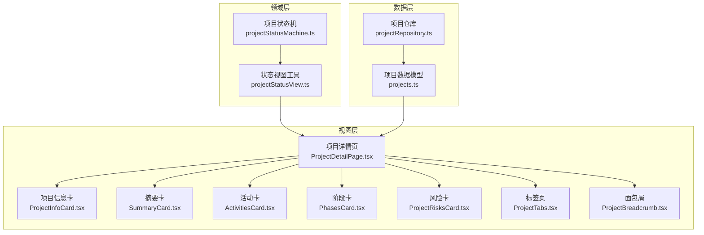
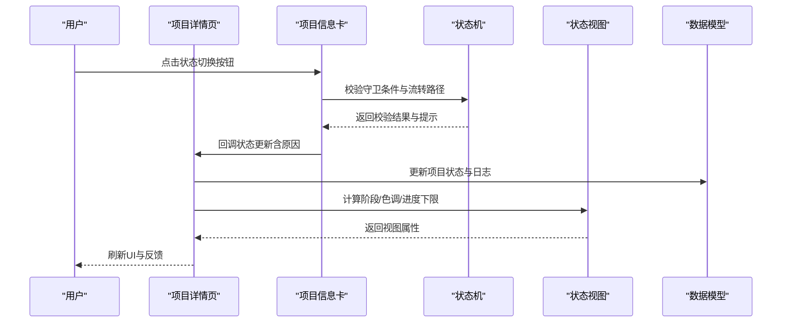
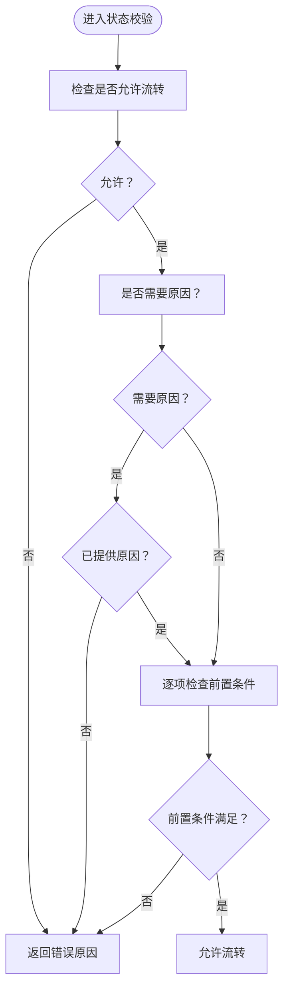
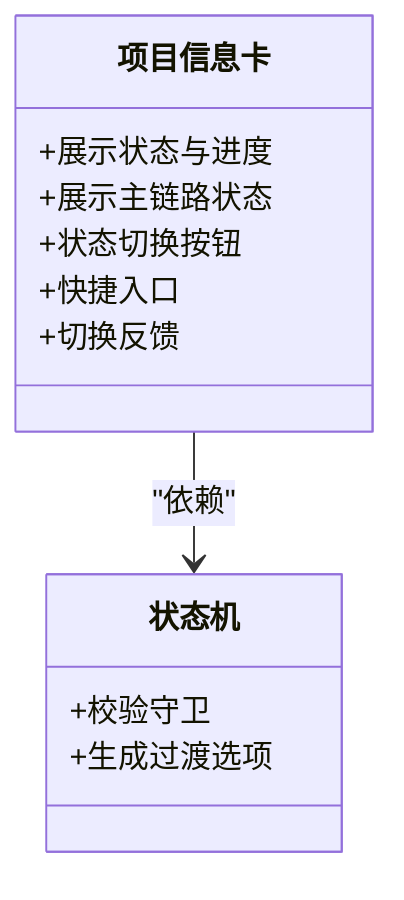
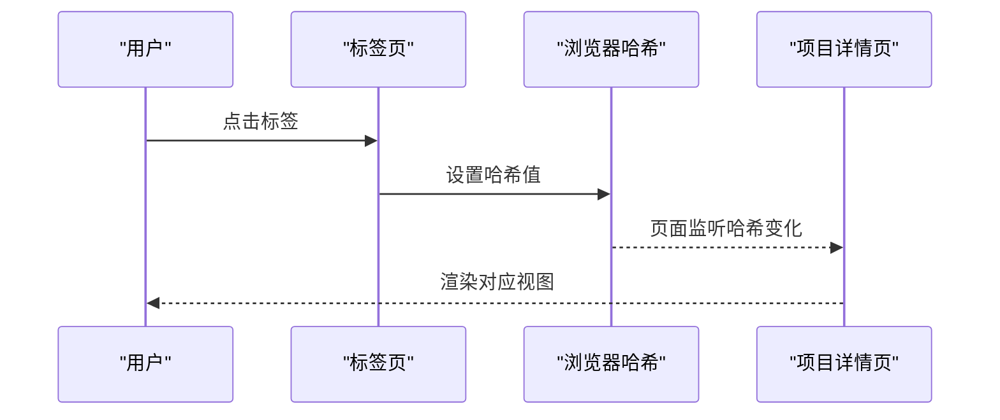
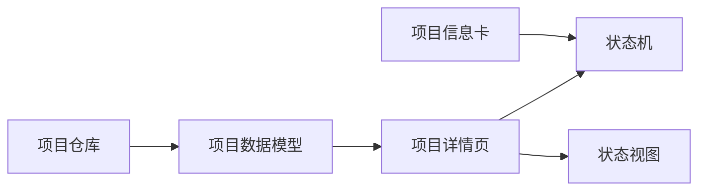

# 项目概览与状态管理

<cite>
**本文引用的文件**
- [src/domain/projectStatusMachine.ts](file://src/domain/projectStatusMachine.ts)
- [src/domain/projectStatusView.ts](file://src/domain/projectStatusView.ts)
- [src/components/project/ProjectDetailPage.tsx](file://src/components/project/ProjectDetailPage.tsx)
- [src/components/project/ProjectInfoCard.tsx](file://src/components/project/ProjectInfoCard.tsx)
- [src/components/project/SummaryCard.tsx](file://src/components/project/SummaryCard.tsx)
- [src/components/project/ActivitiesCard.tsx](file://src/components/project/ActivitiesCard.tsx)
- [src/components/project/PhasesCard.tsx](file://src/components/project/PhasesCard.tsx)
- [src/components/project/ProjectRisksCard.tsx](file://src/components/project/ProjectRisksCard.tsx)
- [src/components/project/ProjectTabs.tsx](file://src/components/project/ProjectTabs.tsx)
- [src/components/project/ProjectBreadcrumb.tsx](file://src/components/project/ProjectBreadcrumb.tsx)
- [src/components/project/projectTabs.shared.ts](file://src/components/project/projectTabs.shared.ts)
- [src/components/project/project-detail.css](file://src/components/project/project-detail.css)
- [src/data/projects.ts](file://src/data/projects.ts)
- [src/services/repositories/projectRepository.ts](file://src/services/repositories/projectRepository.ts)
- [src/domain/__tests__/projectStatusMachine.test.ts](file://src/domain/__tests__/projectStatusMachine.test.ts)
</cite>

## 目录

1. [简介](#简介)
2. [项目结构](#项目结构)
3. [核心组件](#核心组件)
4. [架构总览](#架构总览)
5. [详细组件分析](#详细组件分析)
6. [依赖关系分析](#依赖关系分析)
7. [性能考量](#性能考量)
8. [故障排查指南](#故障排查指南)
9. [结论](#结论)
10. [附录](#附录)

## 简介

本文件聚焦于“项目概览与状态管理”功能，系统性阐述项目管理页面的整体架构设计与实现要点，涵盖项目状态卡、摘要卡片、活动卡片、阶段卡片与风险卡片的实现原理；详解项目状态机在UI层面的展示逻辑、状态切换按钮的交互设计、项目信息卡片的数据绑定机制；同时包含项目面包屑导航、标签页切换逻辑以及项目概览数据的计算与展示策略，并提供扩展与集成建议。

## 项目结构

项目概览与状态管理功能由三层构成：

- 领域层：项目状态机与状态视图工具，负责状态流转规则、阶段映射与色调/进度等视图属性。
- 视图层：项目详情页及其子卡片组件，负责UI渲染、用户交互与数据绑定。
- 数据层：项目数据模型与仓库，负责项目数据的持久化与远程同步。

图表来源

- [src/domain/projectStatusMachine.ts:1-164](file://src/domain/projectStatusMachine.ts#L1-L164)
- [src/domain/projectStatusView.ts:1-89](file://src/domain/projectStatusView.ts#L1-L89)
- [src/components/project/ProjectDetailPage.tsx:1-989](file://src/components/project/ProjectDetailPage.tsx#L1-L989)
- [src/components/project/ProjectInfoCard.tsx:1-159](file://src/components/project/ProjectInfoCard.tsx#L1-L159)
- [src/components/project/SummaryCard.tsx:1-37](file://src/components/project/SummaryCard.tsx#L1-L37)
- [src/components/project/ActivitiesCard.tsx:1-65](file://src/components/project/ActivitiesCard.tsx#L1-L65)
- [src/components/project/PhasesCard.tsx:1-132](file://src/components/project/PhasesCard.tsx#L1-L132)
- [src/components/project/ProjectRisksCard.tsx:1-161](file://src/components/project/ProjectRisksCard.tsx#L1-L161)
- [src/components/project/ProjectTabs.tsx:1-62](file://src/components/project/ProjectTabs.tsx#L1-L62)
- [src/components/project/ProjectBreadcrumb.tsx:1-24](file://src/components/project/ProjectBreadcrumb.tsx#L1-L24)
- [src/data/projects.ts:1-451](file://src/data/projects.ts#L1-L451)
- [src/services/repositories/projectRepository.ts:1-90](file://src/services/repositories/projectRepository.ts#L1-L90)

章节来源

- [src/components/project/ProjectDetailPage.tsx:1-989](file://src/components/project/ProjectDetailPage.tsx#L1-L989)
- [src/data/projects.ts:1-451](file://src/data/projects.ts#L1-L451)

## 核心组件

- 项目状态机：定义项目状态枚举、允许流转、守卫条件、状态钩子与过渡选项解析。
- 状态视图工具：将状态映射为阶段、色调与进度下限，支持状态规范化。
- 项目详情页：聚合卡片组件，承载标签页与面包屑导航，驱动状态切换与数据展示。
- 项目信息卡：展示项目状态、进度与主链路状态，提供状态切换按钮与快捷入口。
- 摘要卡：展示预算、任务完成、风险与里程碑等关键指标。
- 活动卡：合并状态日志与模拟动态，展示最近活动。
- 阶段卡：可视化阶段与里程碑，支持进度条与状态样式。
- 风险卡：按等级排序展示风险列表与统计。
- 标签页与面包屑：基于URL哈希的导航与返回逻辑。

章节来源

- [src/domain/projectStatusMachine.ts:1-164](file://src/domain/projectStatusMachine.ts#L1-L164)
- [src/domain/projectStatusView.ts:1-89](file://src/domain/projectStatusView.ts#L1-L89)
- [src/components/project/ProjectDetailPage.tsx:1-989](file://src/components/project/ProjectDetailPage.tsx#L1-L989)
- [src/components/project/ProjectInfoCard.tsx:1-159](file://src/components/project/ProjectInfoCard.tsx#L1-L159)
- [src/components/project/SummaryCard.tsx:1-37](file://src/components/project/SummaryCard.tsx#L1-L37)
- [src/components/project/ActivitiesCard.tsx:1-65](file://src/components/project/ActivitiesCard.tsx#L1-L65)
- [src/components/project/PhasesCard.tsx:1-132](file://src/components/project/PhasesCard.tsx#L1-L132)
- [src/components/project/ProjectRisksCard.tsx:1-161](file://src/components/project/ProjectRisksCard.tsx#L1-L161)
- [src/components/project/ProjectTabs.tsx:1-62](file://src/components/project/ProjectTabs.tsx#L1-L62)
- [src/components/project/ProjectBreadcrumb.tsx:1-24](file://src/components/project/ProjectBreadcrumb.tsx#L1-L24)

## 架构总览

项目概览与状态管理采用“领域驱动 + 组件化”的分层设计：

- 领域层：以纯函数与类型定义表达状态机规则，确保UI层与业务规则解耦。
- 视图层：以卡片组件组合详情页，统一数据绑定与交互行为。
- 数据层：通过仓库抽象本地与远程状态，提供降级与幂等保障。

图表来源

- [src/components/project/ProjectDetailPage.tsx:1-989](file://src/components/project/ProjectDetailPage.tsx#L1-L989)
- [src/components/project/ProjectInfoCard.tsx:1-159](file://src/components/project/ProjectInfoCard.tsx#L1-L159)
- [src/domain/projectStatusMachine.ts:105-163](file://src/domain/projectStatusMachine.ts#L105-L163)
- [src/domain/projectStatusView.ts:4-88](file://src/domain/projectStatusView.ts#L4-L88)
- [src/data/projects.ts:333-344](file://src/data/projects.ts#L333-L344)

## 详细组件分析

### 项目状态机与状态视图

- 状态枚举与允许流转：定义九种状态与状态间允许的流转集合。
- 守卫条件：针对不同状态流转设定前置条件（如容器、审批、里程碑、任务树、标准绑定、关键任务完成、验收结果、整改闭环、结算完成等）。
- 过渡选项：根据当前状态生成可用的“切换为...”按钮及是否需要填写原因。
- 状态钩子：进入特定状态时触发联动动作（如任务树初始化、风险重算、验收摘要生成）。
- 视图映射：将状态映射为阶段（启动/计划/执行/监控/收尾）、色调（蓝/黄/绿/红）与进度下限。

图表来源

- [src/domain/projectStatusMachine.ts:105-163](file://src/domain/projectStatusMachine.ts#L105-L163)

章节来源

- [src/domain/projectStatusMachine.ts:1-164](file://src/domain/projectStatusMachine.ts#L1-L164)
- [src/domain/projectStatusView.ts:1-89](file://src/domain/projectStatusView.ts#L1-L89)

### 项目信息卡（状态卡）

- 数据绑定：展示状态、负责人、计划周期、团队规模、总体进度与主链路状态（调度派单/执行回传/验收整改/结算草案）。
- 交互设计：提供“编辑”“进入任务中心”“资源主数据”“查看监控看板”等快捷入口；状态切换按钮根据守卫结果启用/禁用，并提示原因要求。
- 反馈机制：切换后显示操作反馈与禁用原因列表，便于用户理解。

图表来源

- [src/components/project/ProjectInfoCard.tsx:1-159](file://src/components/project/ProjectInfoCard.tsx#L1-L159)
- [src/domain/projectStatusMachine.ts:88-95](file://src/domain/projectStatusMachine.ts#L88-L95)

章节来源

- [src/components/project/ProjectInfoCard.tsx:1-159](file://src/components/project/ProjectInfoCard.tsx#L1-L159)

### 摘要卡片（关键指标）

- 数据绑定：预算、任务完成数、待处理风险、阶段数量等。
- 展示策略：高亮数值与标签，配合网格布局提升可读性。

章节来源

- [src/components/project/SummaryCard.tsx:1-37](file://src/components/project/SummaryCard.tsx#L1-L37)

### 活动卡片（最近动态）

- 数据绑定：合并状态日志与模拟活动，展示用户、动作、详情与时间。
- 展示策略：限制展示数量，区分状态流转与状态更新图标。

章节来源

- [src/components/project/ActivitiesCard.tsx:1-65](file://src/components/project/ActivitiesCard.tsx#L1-L65)

### 阶段卡片（阶段与里程碑）

- 数据绑定：阶段名称、起止日期、进度与里程碑信息。
- 展示策略：阶段点线图标、进度条与里程碑状态样式，支持空状态提示。

章节来源

- [src/components/project/PhasesCard.tsx:1-132](file://src/components/project/PhasesCard.tsx#L1-L132)

### 风险卡片（风险列表）

- 数据绑定：风险等级、状态、描述、影响、责任人与到期日。
- 展示策略：按等级排序、统计各等级数量、空状态友好提示。

章节来源

- [src/components/project/ProjectRisksCard.tsx:1-161](file://src/components/project/ProjectRisksCard.tsx#L1-L161)

### 标签页与面包屑导航

- 标签页：基于URL哈希切换仪表盘/启动/计划/监控/收尾/设置等视图，支持激活态样式与点击跳转。
- 面包屑：提供“项目列表 → 当前项目名”的返回路径，点击返回上一页。

图表来源

- [src/components/project/ProjectTabs.tsx:25-58](file://src/components/project/ProjectTabs.tsx#L25-L58)
- [src/components/project/projectTabs.shared.ts:7-10](file://src/components/project/projectTabs.shared.ts#L7-L10)

章节来源

- [src/components/project/ProjectTabs.tsx:1-62](file://src/components/project/ProjectTabs.tsx#L1-L62)
- [src/components/project/ProjectBreadcrumb.tsx:1-24](file://src/components/project/ProjectBreadcrumb.tsx#L1-L24)
- [src/components/project/projectTabs.shared.ts:1-10](file://src/components/project/projectTabs.shared.ts#L1-L10)

### 项目概览数据的计算与展示策略

- 数据来源：项目数据模型提供基础字段与扩展字段（阶段、里程碑、任务树、风险、成员等），并进行状态规范化、阶段与色调映射。
- 计算策略：在详情页内对任务树扁平化、统计任务与里程碑状态、构建治理快照与收尾校验矩阵等。
- 展示策略：卡片组件独立渲染，详情页统一布局与网格结构，保证信息密度与可读性。

章节来源

- [src/data/projects.ts:26-45](file://src/data/projects.ts#L26-L45)
- [src/data/projects.ts:333-344](file://src/data/projects.ts#L333-L344)
- [src/components/project/ProjectDetailPage.tsx:145-169](file://src/components/project/ProjectDetailPage.tsx#L145-L169)

## 依赖关系分析

- 项目详情页依赖状态机与状态视图工具，以生成过渡选项与视图属性。
- 项目信息卡依赖状态机进行守卫校验与按钮状态控制。
- 仓库负责本地与远程状态的读写与降级，保障离线可用性与一致性。

图表来源

- [src/components/project/ProjectDetailPage.tsx:1-989](file://src/components/project/ProjectDetailPage.tsx#L1-L989)
- [src/domain/projectStatusMachine.ts:1-164](file://src/domain/projectStatusMachine.ts#L1-L164)
- [src/domain/projectStatusView.ts:1-89](file://src/domain/projectStatusView.ts#L1-L89)
- [src/data/projects.ts:1-451](file://src/data/projects.ts#L1-L451)
- [src/services/repositories/projectRepository.ts:1-90](file://src/services/repositories/projectRepository.ts#L1-L90)

章节来源

- [src/services/repositories/projectRepository.ts:1-90](file://src/services/repositories/projectRepository.ts#L1-L90)

## 性能考量

- 计算优化：对任务树与里程碑状态统计使用Memoization，避免重复计算。
- 渲染优化：卡片组件按需渲染，详情页采用网格布局减少重排。
- 数据持久化：本地存储与远程同步结合，优先本地缓存，网络异常时降级使用。

## 故障排查指南

- 状态切换被禁用：检查守卫条件与原因必填项，查看禁用原因列表。
- 日志为空：确认状态日志数据是否加载成功或是否为空。
- 样式异常：核对CSS类名与主题变量，确保项目详情样式文件完整引入。

章节来源

- [src/domain/**tests**/projectStatusMachine.test.ts:1-125](file://src/domain/__tests__/projectStatusMachine.test.ts#L1-L125)
- [src/components/project/project-detail.css:1-800](file://src/components/project/project-detail.css#L1-L800)

## 结论

项目概览与状态管理通过清晰的领域层规则与组件化视图实现了高内聚、低耦合的设计。状态机与视图工具确保UI与业务规则一致，卡片组件提供丰富的信息密度与良好的可读性。标签页与面包屑导航增强了用户体验，仓库层保障了数据的可靠性与可用性。该架构易于扩展与维护，适合在大型项目中持续演进。

## 附录

- 扩展建议
  - 新增状态：在状态机中添加状态枚举、允许流转与守卫条件，并在状态视图工具中补充映射。
  - 新增卡片：遵循现有卡片组件模式，定义数据绑定与交互行为，加入详情页网格布局。
  - 集成其他视图：通过标签页共享模块与哈希路由，将新视图无缝接入详情页。
- 最佳实践
  - 将UI交互与业务规则分离，保持状态机纯函数特性。
  - 使用Memoization优化昂贵计算，减少不必要的重渲染。
  - 为关键路径提供降级策略，确保在网络异常时仍可使用。
