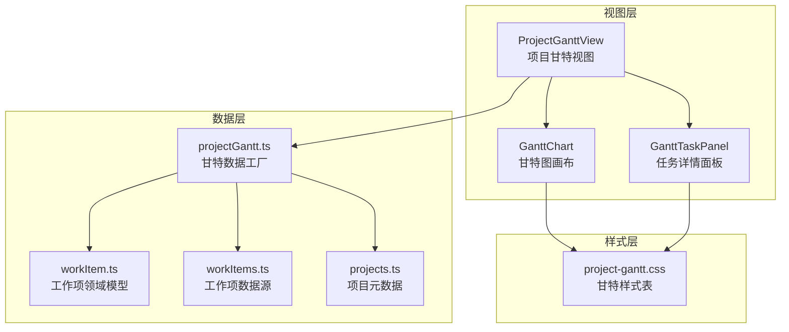
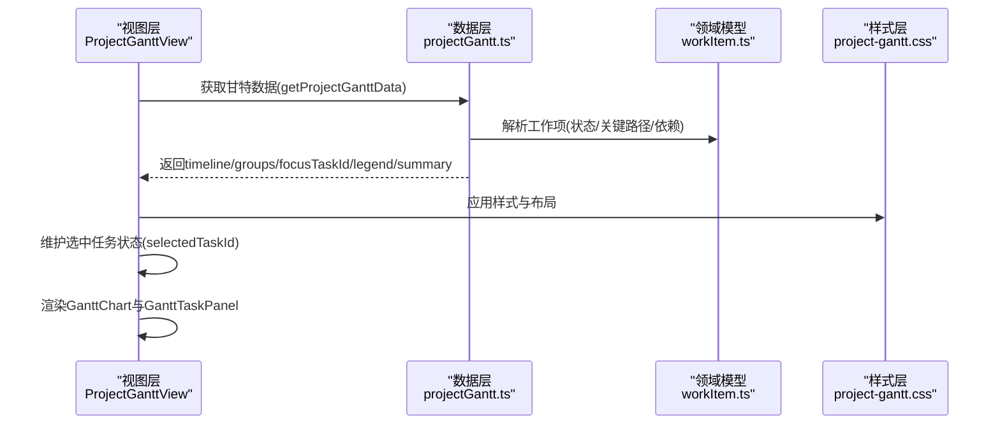
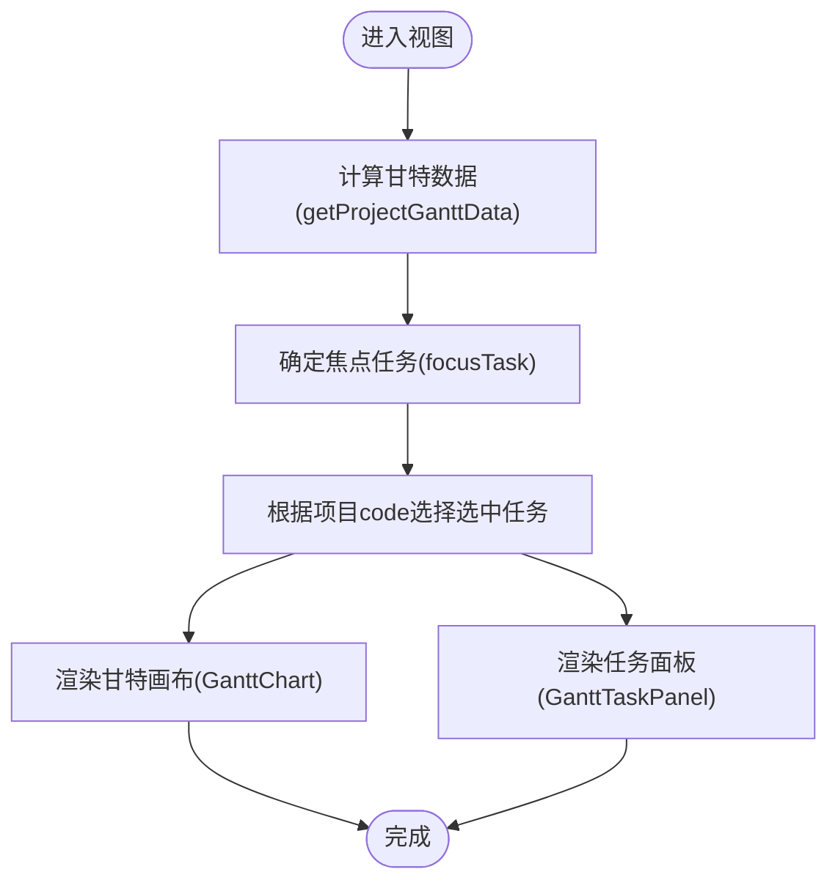
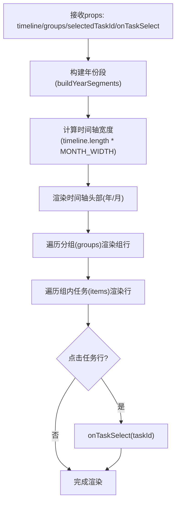
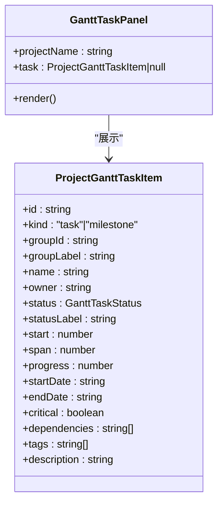
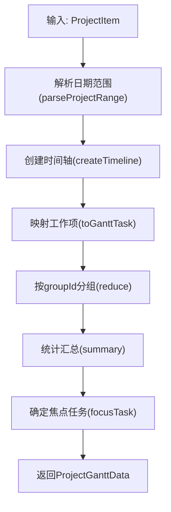
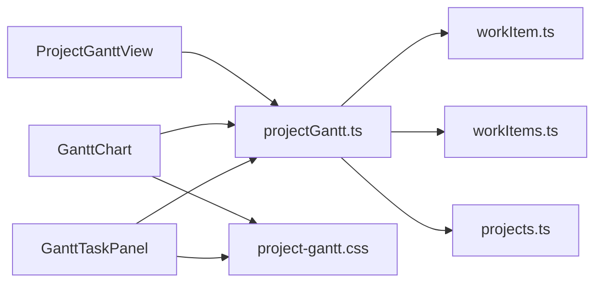

# 项目甘特图管理

<cite>
**本文引用的文件列表**
- [GanttChart.tsx](file://src/components/project/GanttChart.tsx)
- [GanttTaskPanel.tsx](file://src/components/project/GanttTaskPanel.tsx)
- [ProjectGanttView.tsx](file://src/components/project/ProjectGanttView.tsx)
- [project-gantt.css](file://src/components/project/project-gantt.css)
- [projectGantt.ts](file://src/data/projectGantt.ts)
- [workItem.ts](file://src/domain/workItem.ts)
- [workItems.ts](file://src/data/workItems.ts)
- [projects.ts](file://src/data/projects.ts)
- [ProjectTaskAndWbsView.tsx](file://src/components/project/ProjectTaskAndWbsView.tsx)
- [WbsTreeTable.tsx](file://src/components/project/WbsTreeTable.tsx)
</cite>

## 目录

1. [简介](#简介)
2. [项目结构](#项目结构)
3. [核心组件](#核心组件)
4. [架构概览](#架构概览)
5. [详细组件分析](#详细组件分析)
6. [依赖关系分析](#依赖关系分析)
7. [性能考量](#性能考量)
8. [故障排查指南](#故障排查指南)
9. [结论](#结论)
10. [附录](#附录)

## 简介

本文件面向“项目甘特图管理”功能，系统性阐述甘特图视图的实现架构与交互机制，涵盖时间轴显示、任务条绘制、里程碑标记、任务层级关系可视化、任务面板交互、时间刻度计算、任务拖拽调整与批量操作等主题。文档同时提供样式自定义与任务编辑扩展的实践指引，帮助开发者在现有架构基础上进行二次开发与优化。

## 项目结构

甘特图功能由三层协作构成：

- 视图层：负责渲染与交互，包含甘特图主视图与任务详情面板。
- 数据层：负责从领域模型与项目数据源转换为甘特图所需的数据结构。
- 样式层：提供统一的视觉规范与响应式布局。

图表来源

- [ProjectGanttView.tsx:12-89](file://src/components/project/ProjectGanttView.tsx#L12-L89)
- [GanttChart.tsx:44-133](file://src/components/project/GanttChart.tsx#L44-L133)
- [GanttTaskPanel.tsx:8-99](file://src/components/project/GanttTaskPanel.tsx#L8-L99)
- [projectGantt.ts:137-186](file://src/data/projectGantt.ts#L137-L186)
- [workItem.ts:9-32](file://src/domain/workItem.ts#L9-L32)
- [workItems.ts:409-441](file://src/data/workItems.ts#L409-L441)
- [projects.ts:26-45](file://src/data/projects.ts#L26-L45)
- [project-gantt.css:1-662](file://src/components/project/project-gantt.css#L1-L662)

章节来源

- [ProjectGanttView.tsx:12-89](file://src/components/project/ProjectGanttView.tsx#L12-L89)
- [project-gantt.css:1-662](file://src/components/project/project-gantt.css#L1-L662)

## 核心组件

- 甘特图主视图（ProjectGanttView）：聚合甘特数据、维护选中任务状态、提供工具栏与概览信息。
- 甘特图画布（GanttChart）：渲染时间轴、任务条/里程碑、分组行与元信息列。
- 任务详情面板（GanttTaskPanel）：展示任务的描述、阶段、类型、起止时间、进度、负责人、关键路径、标签与前置任务等。
- 甘特数据工厂（projectGantt.ts）：解析项目日期范围、构建时间轴、将工作项映射为甘特任务、分组与汇总统计。
- 领域模型（workItem.ts）：定义工作项的类型、状态、来源、关键路径等属性。
- 数据源（workItems.ts、projects.ts）：提供项目工作项模板与项目元数据。

章节来源

- [ProjectGanttView.tsx:12-89](file://src/components/project/ProjectGanttView.tsx#L12-L89)
- [GanttChart.tsx:44-133](file://src/components/project/GanttChart.tsx#L44-L133)
- [GanttTaskPanel.tsx:8-99](file://src/components/project/GanttTaskPanel.tsx#L8-L99)
- [projectGantt.ts:137-186](file://src/data/projectGantt.ts#L137-L186)
- [workItem.ts:9-32](file://src/domain/workItem.ts#L9-L32)
- [workItems.ts:409-441](file://src/data/workItems.ts#L409-L441)
- [projects.ts:26-45](file://src/data/projects.ts#L26-L45)

## 架构概览

甘特图采用“视图-数据-样式”三层分离：

- 视图层负责交互与渲染，通过 props 接收数据与回调。
- 数据层负责数据转换与计算，确保时间轴、任务位置与跨度、分组与汇总等逻辑清晰。
- 样式层提供统一的视觉语言与响应式适配。

图表来源

- [ProjectGanttView.tsx:12-89](file://src/components/project/ProjectGanttView.tsx#L12-L89)
- [projectGantt.ts:137-186](file://src/data/projectGantt.ts#L137-L186)
- [workItem.ts:9-32](file://src/domain/workItem.ts#L9-L32)
- [project-gantt.css:1-662](file://src/components/project/project-gantt.css#L1-L662)

## 详细组件分析

### 甘特图主视图（ProjectGanttView）

- 职责
  - 计算并缓存甘特数据（useMemo）。
  - 维护每个项目的选中任务 ID，支持多项目独立状态。
  - 提供概览信息（阶段数、任务数、里程碑数、更新时间）、图例与快捷操作。
  - 将选中任务传递给任务详情面板。
- 关键点
  - 通过 focusTask 逻辑优先展示“延误/关键路径”的任务，其次“进行中”，最后首个任务。
  - 使用 CSS Grid 布局，左侧为甘特画布，右侧为任务面板。

图表来源

- [ProjectGanttView.tsx:12-89](file://src/components/project/ProjectGanttView.tsx#L12-L89)

章节来源

- [ProjectGanttView.tsx:12-89](file://src/components/project/ProjectGanttView.tsx#L12-L89)

### 甘特图画布（GanttChart）

- 职责
  - 渲染时间轴头部（年份与月份分段）。
  - 渲染任务行：元信息列（任务名、负责人、状态）、时间线区域（任务条或里程碑）。
  - 支持任务点击选择，触发父组件回调。
- 时间轴与任务条
  - 年份段落通过遍历时间轴，合并连续同一年份的月份块。
  - 任务条宽度与左偏移基于“起始月偏移”和“跨度（月）”计算，紧凑模式下强制最小宽度。
  - 里程碑以起始月居中定位，不同状态使用不同的样式类。
- 进度展示
  - 任务条内部的进度条宽度受进度百分比约束，保证最小可见宽度。
- 交互
  - 行点击回调触发父组件更新选中任务 ID。

图表来源

- [GanttChart.tsx:14-29](file://src/components/project/GanttChart.tsx#L14-L29)
- [GanttChart.tsx:44-133](file://src/components/project/GanttChart.tsx#L44-L133)

章节来源

- [GanttChart.tsx:14-29](file://src/components/project/GanttChart.tsx#L14-L29)
- [GanttChart.tsx:44-133](file://src/components/project/GanttChart.tsx#L44-L133)

### 任务详情面板（GanttTaskPanel）

- 职责
  - 展示任务基本信息（项目名、任务名、状态标签）。
  - 显示阶段、任务类型（任务/里程碑）、起止时间、进度条与百分比。
  - 展示负责人头像、关键路径开关、标签列表、前置任务列表。
- 交互
  - 关键路径开关使用“active”类控制样式切换，便于扩展为可编辑状态。

图表来源

- [GanttTaskPanel.tsx:3-6](file://src/components/project/GanttTaskPanel.tsx#L3-L6)
- [projectGantt.ts:14-32](file://src/data/projectGantt.ts#L14-L32)

章节来源

- [GanttTaskPanel.tsx:8-99](file://src/components/project/GanttTaskPanel.tsx#L8-L99)
- [projectGantt.ts:14-32](file://src/data/projectGantt.ts#L14-L32)

### 甘特数据工厂（projectGantt.ts）

- 时间轴构建
  - 默认起始时间与固定月份数，支持从项目日期范围解析起始时间。
  - 月份对象包含 id、年份与标签（如“X月”）。
- 任务映射
  - 将工作项转换为甘特任务：计算起止偏移、跨度（取“按月跨度”与“按持续天数换算跨度”的较大值），里程碑强制跨度为1。
  - 生成状态标签、关键路径、依赖名称映射、标签与描述。
- 分组与汇总
  - 按 groupId 聚合为分组，生成分组标题与摘要。
  - 计算阶段数、任务数、里程碑数。
- 焦点任务
  - 优先选择“延误/关键路径”的任务，否则“进行中”，最后首个任务。

图表来源

- [projectGantt.ts:137-186](file://src/data/projectGantt.ts#L137-L186)
- [projectGantt.ts:60-101](file://src/data/projectGantt.ts#L60-L101)
- [projectGantt.ts:103-133](file://src/data/projectGantt.ts#L103-L133)

章节来源

- [projectGantt.ts:137-186](file://src/data/projectGantt.ts#L137-L186)
- [projectGantt.ts:60-101](file://src/data/projectGantt.ts#L60-L101)
- [projectGantt.ts:103-133](file://src/data/projectGantt.ts#L103-L133)

### 样式与主题

- 主题色与状态映射
  - 不同状态（已完成/进行中/延误/未开始）与“里程碑”使用统一的 CSS 变量与类名，便于主题切换。
- 任务条与里程碑
  - 任务条使用绝对定位与进度条叠加，支持紧凑模式下的最小宽度。
  - 里程碑使用旋转 45° 的方形，不同状态有差异化配色与阴影。
- 响应式布局
  - 在小屏设备上，右侧面板改为静态布局，避免溢出。

章节来源

- [project-gantt.css:107-152](file://src/components/project/project-gantt.css#L107-L152)
- [project-gantt.css:404-473](file://src/components/project/project-gantt.css#L404-L473)
- [project-gantt.css:637-662](file://src/components/project/project-gantt.css#L637-L662)

## 依赖关系分析

- 组件耦合
  - ProjectGanttView 仅依赖 projectGantt.ts 的数据工厂函数，耦合度低，便于替换数据源。
  - GanttChart 与 GanttTaskPanel 通过 props 单向数据流交互，职责清晰。
- 外部依赖
  - 领域模型 workItem.ts 提供状态与来源等语义，projectGantt.ts 仅做转换，不直接依赖 UI。
  - 数据源 workItems.ts 与 projects.ts 为纯数据模块，通过类型接口与数据工厂对接。

图表来源

- [ProjectGanttView.tsx:12-89](file://src/components/project/ProjectGanttView.tsx#L12-L89)
- [GanttChart.tsx:44-133](file://src/components/project/GanttChart.tsx#L44-L133)
- [GanttTaskPanel.tsx:8-99](file://src/components/project/GanttTaskPanel.tsx#L8-L99)
- [projectGantt.ts:137-186](file://src/data/projectGantt.ts#L137-L186)
- [workItem.ts:9-32](file://src/domain/workItem.ts#L9-L32)
- [workItems.ts:409-441](file://src/data/workItems.ts#L409-L441)
- [projects.ts:26-45](file://src/data/projects.ts#L26-L45)
- [project-gantt.css:1-662](file://src/components/project/project-gantt.css#L1-L662)

章节来源

- [ProjectGanttView.tsx:12-89](file://src/components/project/ProjectGanttView.tsx#L12-L89)
- [projectGantt.ts:137-186](file://src/data/projectGantt.ts#L137-L186)

## 性能考量

- 渲染优化
  - 使用 useMemo 缓存甘特数据与任务列表，减少重复计算。
  - 任务条与时间轴宽度按月固定，避免频繁重排。
- 数据规模
  - 任务数量增长时，建议限制默认显示的月份数或启用虚拟滚动（当前实现为完整渲染）。
- 样式性能
  - 使用 CSS 变量与类名切换替代内联样式的动态计算，降低重绘成本。

[本节为通用指导，无需特定文件来源]

## 故障排查指南

- 任务未显示或显示异常
  - 检查工作项类型是否被过滤（项目根节点不会出现在甘特图中）。
  - 核对日期范围解析与起止时间格式，确保可解析。
- 时间轴错位
  - 确认时间轴起始时间与月份偏移计算一致。
  - 检查月份跨度计算逻辑（按月跨度 vs 按持续天数换算）。
- 选中任务不生效
  - 确保 onTaskSelect 回调正确更新项目级选中任务 ID。
  - 检查任务 ID 是否与数据中的 id 匹配。
- 样式不生效
  - 确认状态类名与 CSS 变量映射一致。
  - 检查响应式断点与容器宽度是否足够。

章节来源

- [projectGantt.ts:135-136](file://src/data/projectGantt.ts#L135-L136)
- [projectGantt.ts:60-101](file://src/data/projectGantt.ts#L60-L101)
- [ProjectGanttView.tsx:17-22](file://src/components/project/ProjectGanttView.tsx#L17-L22)
- [project-gantt.css:107-152](file://src/components/project/project-gantt.css#L107-L152)

## 结论

本甘特图实现以清晰的三层架构与稳定的类型契约为基础，实现了时间轴、任务条与里程碑的可视化表达，并提供了任务详情面板与概览工具栏。通过数据工厂与样式变量的抽象，系统具备良好的可扩展性与可维护性。未来可在保持现有架构的前提下，引入任务拖拽、批量操作与更丰富的交互能力。

[本节为总结性内容，无需特定文件来源]

## 附录

### 任务层级关系可视化（WBS视图）

- 甘特图与 WBS 视图共享同一数据源，WBS 通过树形表格展示层级关系与状态进度。
- 切换视图模式时，数据与交互保持一致化治理。

章节来源

- [ProjectTaskAndWbsView.tsx:15-66](file://src/components/project/ProjectTaskAndWbsView.tsx#L15-L66)
- [WbsTreeTable.tsx:36-88](file://src/components/project/WbsTreeTable.tsx#L36-L88)

### 时间刻度计算与任务跨度

- 时间轴：固定月宽与月份数，计算总宽度。
- 跨度：取“按月跨度”与“按持续天数换算跨度”的最大值，里程碑强制为1。
- 起止偏移：基于起止日期与时间轴起始时间的月份差。

章节来源

- [projectGantt.ts:54-101](file://src/data/projectGantt.ts#L54-L101)
- [projectGantt.ts:103-133](file://src/data/projectGantt.ts#L103-L133)

### 任务拖拽调整与批量操作（现状与扩展建议）

- 现状
  - 当前实现为只读展示，未包含拖拽与批量操作。
- 扩展建议
  - 在 GanttChart 中为任务条添加可拖拽句柄与拖拽事件监听。
  - 引入拖拽状态管理与批量更新队列，提交时统一写入后端。
  - 为里程碑与任务条分别定义拖拽约束（如里程碑仅可移动到月粒度）。
  - 在任务面板中增加“批量编辑”入口，支持选择多个任务并统一修改状态/负责人/关键路径等。

[本节为概念性扩展建议，无需特定文件来源]

### 自定义甘特图显示样式

- 主题色与状态
  - 通过修改 CSS 变量（如 --gantt-tone、--gantt-tone-soft）与状态类名，实现主题切换。
- 任务条与里程碑
  - 调整任务条圆角、阴影与进度条渐变，以匹配品牌风格。
  - 修改里程碑形状与尺寸，满足不同视觉需求。
- 响应式适配
  - 调整网格布局与面板宽度，在小屏设备上优化阅读体验。

章节来源

- [project-gantt.css:107-152](file://src/components/project/project-gantt.css#L107-L152)
- [project-gantt.css:404-473](file://src/components/project/project-gantt.css#L404-L473)
- [project-gantt.css:637-662](file://src/components/project/project-gantt.css#L637-L662)

### 扩展任务编辑功能

- 任务面板扩展
  - 在关键路径开关旁增加“编辑”按钮，打开弹窗或抽屉进行字段编辑。
  - 为“负责人”、“开始/结束时间”、“进度”等字段提供可编辑控件。
- 后端集成
  - 通过仓库层封装更新请求，提交后刷新甘特数据并更新选中任务。
- 日志与审计
  - 记录每次编辑的操作日志，便于追溯与审计。

[本节为概念性扩展建议，无需特定文件来源]
