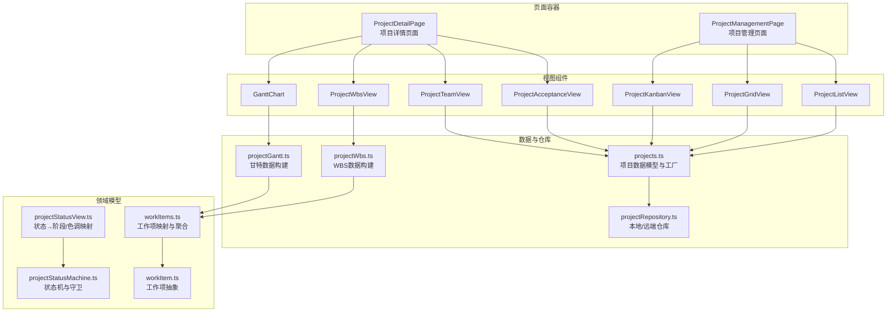
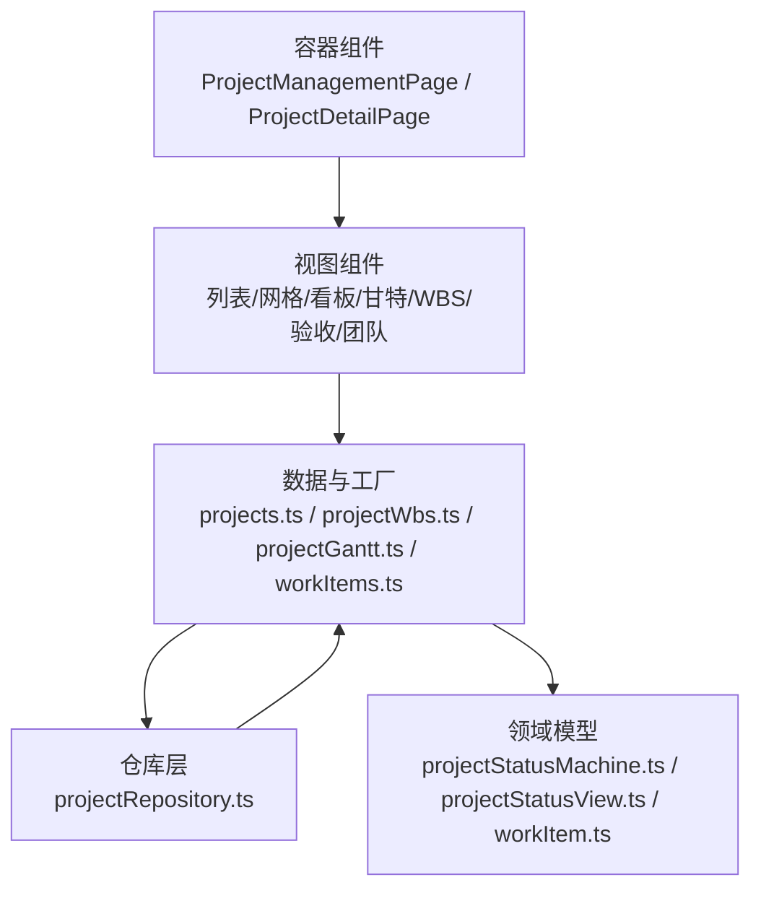
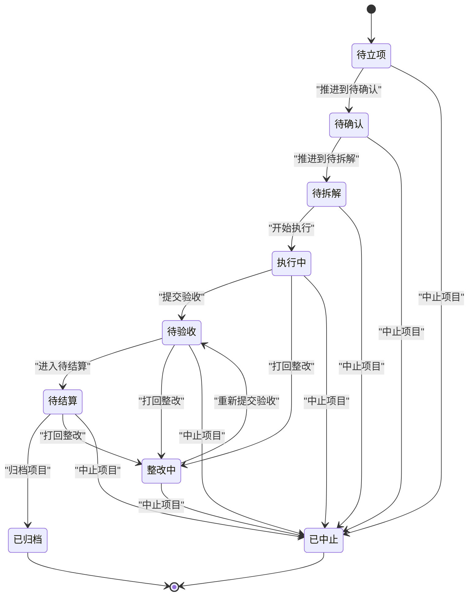
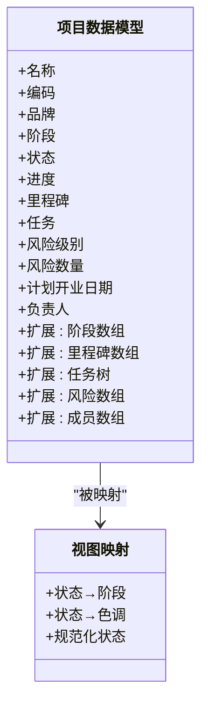
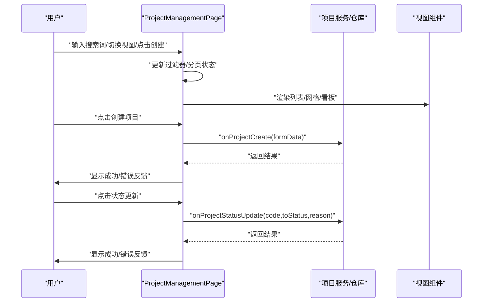
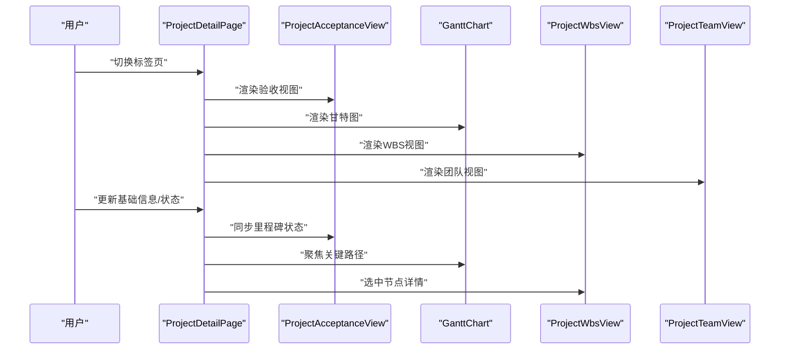
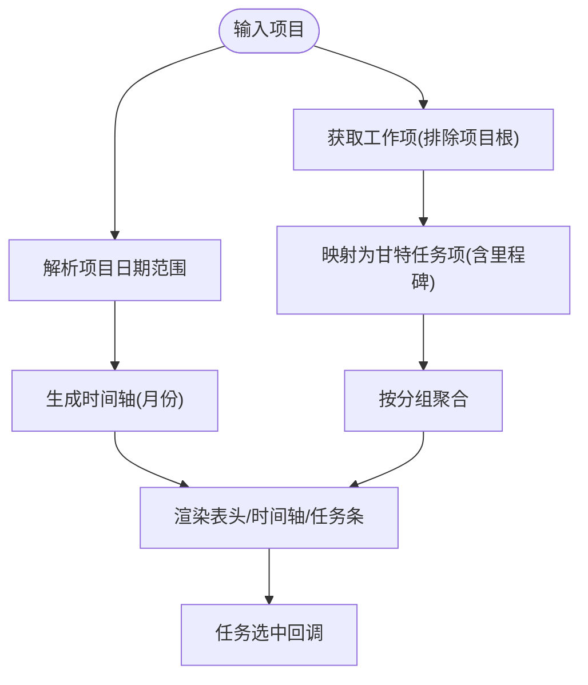
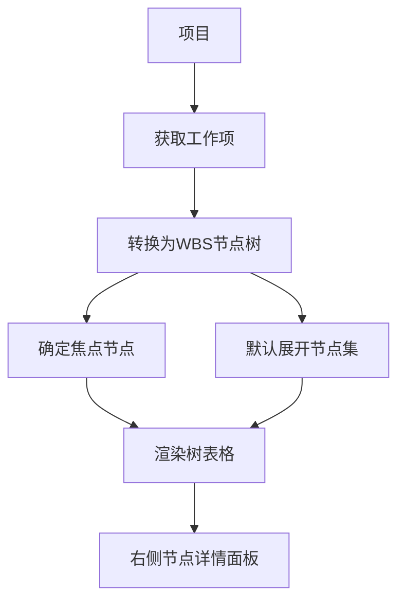
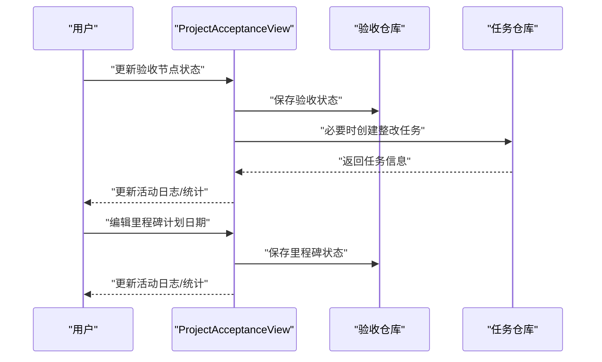
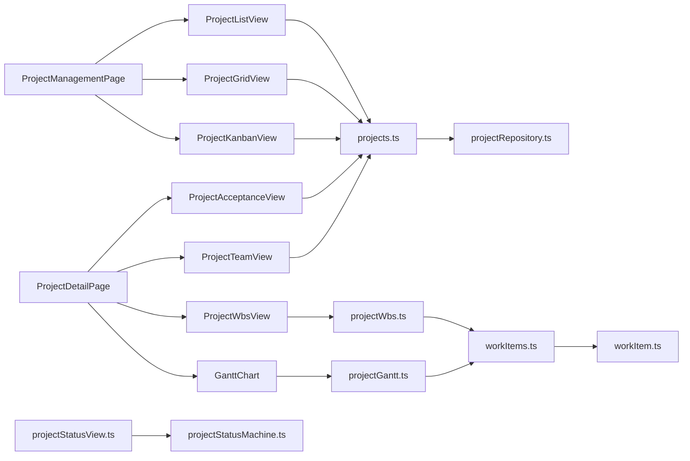

# 项目管理模块

<cite>
**本文引用的文件**
- [src/components/project/ProjectManagementPage.tsx](file://src/components/project/ProjectManagementPage.tsx)
- [src/domain/projectStatusMachine.ts](file://src/domain/projectStatusMachine.ts)
- [src/data/projects.ts](file://src/data/projects.ts)
- [src/services/repositories/projectRepository.ts](file://src/services/repositories/projectRepository.ts)
- [src/components/project/GanttChart.tsx](file://src/components/project/GanttChart.tsx)
- [src/components/project/ProjectWbsView.tsx](file://src/components/project/ProjectWbsView.tsx)
- [src/components/project/ProjectAcceptanceView.tsx](file://src/components/project/ProjectAcceptanceView.tsx)
- [src/components/project/ProjectTeamView.tsx](file://src/components/project/ProjectTeamView.tsx)
- [src/data/projectWbs.ts](file://src/data/projectWbs.ts)
- [src/data/projectGantt.ts](file://src/data/projectGantt.ts)
- [src/components/personnel/projectManagement.types.ts](file://src/components/personnel/projectManagement.types.ts)
- [src/components/personnel/projectManagement.selectors.ts](file://src/components/personnel/projectManagement.selectors.ts)
- [src/domain/workItem.ts](file://src/domain/workItem.ts)
- [src/data/workItems.ts](file://src/data/workItems.ts)
- [src/components/personnel/projectManagement.data.ts](file://src/components/personnel/projectManagement.data.ts)
- [src/components/project/ProjectDetailPage.tsx](file://src/components/project/ProjectDetailPage.tsx)
- [src/domain/projectStatusView.ts](file://src/domain/projectStatusView.ts)
</cite>

## 目录

1. [简介](#简介)
2. [项目结构](#项目结构)
3. [核心组件](#核心组件)
4. [架构总览](#架构总览)
5. [详细组件分析](#详细组件分析)
6. [依赖关系分析](#依赖关系分析)
7. [性能考量](#性能考量)
8. [故障排查指南](#故障排查指南)
9. [结论](#结论)
10. [附录](#附录)

## 简介

本技术文档围绕项目管理模块，系统阐述项目全生命周期管理的关键能力与实现细节，包括项目创建、状态流转、团队协作、甘特图管理、WBS工作分解结构、项目验收、风险管控等。文档同时解析项目状态机的设计原理、数据模型与视图组件的交互逻辑、状态管理机制、页面布局与组件通信方式、数据流向及性能优化策略，并提供扩展与集成的实践建议。

## 项目结构

项目管理模块采用“页面容器 + 视图组件 + 数据与仓库 + 领域模型”的分层组织方式：

- 页面容器负责状态聚合、过滤与分页、视图模式切换与用户交互编排
- 视图组件负责具体业务视图渲染与交互（列表/网格/看板/甘特/WBS/验收/团队）
- 数据与仓库层负责本地/远端状态持久化与数据访问
- 领域模型与工具函数负责状态机、工作项映射、视图计算与数据转换

图表来源

- [src/components/project/ProjectManagementPage.tsx:46-269](file://src/components/project/ProjectManagementPage.tsx#L46-L269)
- [src/components/project/ProjectDetailPage.tsx:103-720](file://src/components/project/ProjectDetailPage.tsx#L103-L720)
- [src/data/projects.ts:26-344](file://src/data/projects.ts#L26-L344)
- [src/data/projectWbs.ts:114-133](file://src/data/projectWbs.ts#L114-L133)
- [src/data/projectGantt.ts:137-186](file://src/data/projectGantt.ts#L137-L186)
- [src/services/repositories/projectRepository.ts:53-89](file://src/services/repositories/projectRepository.ts#L53-L89)
- [src/domain/projectStatusMachine.ts:1-164](file://src/domain/projectStatusMachine.ts#L1-L164)
- [src/domain/projectStatusView.ts:1-89](file://src/domain/projectStatusView.ts#L1-L89)
- [src/domain/workItem.ts:1-68](file://src/domain/workItem.ts#L1-L68)
- [src/data/workItems.ts:409-441](file://src/data/workItems.ts#L409-L441)

章节来源

- [src/components/project/ProjectManagementPage.tsx:46-269](file://src/components/project/ProjectManagementPage.tsx#L46-L269)
- [src/components/project/ProjectDetailPage.tsx:103-720](file://src/components/project/ProjectDetailPage.tsx#L103-L720)

## 核心组件

- 项目管理页面容器：负责项目列表/网格/看板视图切换、搜索/筛选/排序/分页、统计卡片、创建与状态流转入口、洞察面板与创建模态框编排
- 项目详情页面容器：负责仪表盘/启动/计划/监控/收尾/设置等标签页的组合与状态编排，承载验收、甘特、WBS、团队等视图
- 视图组件：列表/网格/看板、甘特图、WBS视图、验收视图、团队视图等
- 数据与仓库：项目数据模型、工作项映射、本地/远端状态持久化
- 领域模型：项目状态机、状态到阶段/色调映射、工作项抽象与状态转换

章节来源

- [src/components/personnel/projectManagement.types.ts:21-167](file://src/components/personnel/projectManagement.types.ts#L21-L167)
- [src/components/personnel/projectManagement.selectors.ts:17-284](file://src/components/personnel/projectManagement.selectors.ts#L17-L284)
- [src/data/projects.ts:26-344](file://src/data/projects.ts#L26-L344)
- [src/services/repositories/projectRepository.ts:53-89](file://src/services/repositories/projectRepository.ts#L53-L89)

## 架构总览

项目管理模块遵循“容器-视图-数据-仓库-领域模型”的分层架构：

- 容器层：页面组件负责状态管理、事件处理与子组件编排
- 视图层：纯展示组件，接收来自容器的状态与回调
- 数据层：类型定义、工厂方法、数据转换与聚合
- 仓库层：本地存储与远端适配，提供加载/保存能力
- 领域层：状态机、视图映射与工作项抽象

图表来源

- [src/components/project/ProjectManagementPage.tsx:46-269](file://src/components/project/ProjectManagementPage.tsx#L46-L269)
- [src/components/project/ProjectDetailPage.tsx:103-720](file://src/components/project/ProjectDetailPage.tsx#L103-L720)
- [src/data/projects.ts:26-344](file://src/data/projects.ts#L26-L344)
- [src/data/projectWbs.ts:114-133](file://src/data/projectWbs.ts#L114-L133)
- [src/data/projectGantt.ts:137-186](file://src/data/projectGantt.ts#L137-L186)
- [src/data/workItems.ts:409-441](file://src/data/workItems.ts#L409-L441)
- [src/services/repositories/projectRepository.ts:53-89](file://src/services/repositories/projectRepository.ts#L53-L89)
- [src/domain/projectStatusMachine.ts:1-164](file://src/domain/projectStatusMachine.ts#L1-L164)
- [src/domain/projectStatusView.ts:1-89](file://src/domain/projectStatusView.ts#L1-L89)
- [src/domain/workItem.ts:1-68](file://src/domain/workItem.ts#L1-L68)

## 详细组件分析

### 项目状态机与状态流转

项目状态机定义了状态集合、允许的流转、守卫条件与进入钩子，保证项目在不同阶段的合规流转与联动触发。

图表来源

- [src/domain/projectStatusMachine.ts:47-95](file://src/domain/projectStatusMachine.ts#L47-L95)

章节来源

- [src/domain/projectStatusMachine.ts:1-164](file://src/domain/projectStatusMachine.ts#L1-L164)
- [src/domain/projectStatusView.ts:4-89](file://src/domain/projectStatusView.ts#L4-L89)

### 项目数据模型与视图映射

项目数据模型在基础字段之上扩展了阶段、里程碑、任务树、风险与成员等结构化数据；视图层通过工具函数将项目状态映射为阶段与色调，用于UI呈现与筛选。

图表来源

- [src/data/projects.ts:26-45](file://src/data/projects.ts#L26-L45)
- [src/domain/projectStatusView.ts:4-42](file://src/domain/projectStatusView.ts#L4-L42)

章节来源

- [src/data/projects.ts:26-45](file://src/data/projects.ts#L26-L45)
- [src/domain/projectStatusView.ts:4-89](file://src/domain/projectStatusView.ts#L4-L89)

### 项目管理页面容器（列表/网格/看板）

容器负责：

- 状态：搜索词、视图模式、分页、过滤器、反馈提示
- 行为：搜索变更、重置过滤器、项目打开、创建项目、状态更新
- 数据：统计卡片、分页结果、看板分组、洞察面板与创建模态框

图表来源

- [src/components/project/ProjectManagementPage.tsx:46-122](file://src/components/project/ProjectManagementPage.tsx#L46-L122)

章节来源

- [src/components/project/ProjectManagementPage.tsx:46-269](file://src/components/project/ProjectManagementPage.tsx#L46-L269)
- [src/components/personnel/projectManagement.selectors.ts:217-261](file://src/components/personnel/projectManagement.selectors.ts#L217-L261)

### 项目详情页面容器（仪表盘/启动/计划/监控/收尾/设置）

容器负责：

- KPI条带与关键指标展示
- 启动门禁清单、计划与执行协同视图、监控偏差面板、收尾校验矩阵
- 设置摘要与规则配置
- 与验收视图、甘特图、WBS视图、团队视图的组合

图表来源

- [src/components/project/ProjectDetailPage.tsx:370-681](file://src/components/project/ProjectDetailPage.tsx#L370-L681)

章节来源

- [src/components/project/ProjectDetailPage.tsx:103-720](file://src/components/project/ProjectDetailPage.tsx#L103-L720)

### 甘特图管理

甘特图组件负责时间轴构建、任务条绘制、里程碑标注与选中交互；数据层根据项目日期范围与工作项生成时间线与分组。

图表来源

- [src/data/projectGantt.ts:137-186](file://src/data/projectGantt.ts#L137-L186)
- [src/components/project/GanttChart.tsx:44-133](file://src/components/project/GanttChart.tsx#L44-L133)

章节来源

- [src/data/projectGantt.ts:137-186](file://src/data/projectGantt.ts#L137-L186)
- [src/components/project/GanttChart.tsx:44-133](file://src/components/project/GanttChart.tsx#L44-L133)

### WBS工作分解结构

WBS视图负责将项目工作项映射为树形结构，支持节点选择、展开/折叠与概览统计。

图表来源

- [src/data/workItems.ts:409-441](file://src/data/workItems.ts#L409-L441)
- [src/data/projectWbs.ts:114-133](file://src/data/projectWbs.ts#L114-L133)
- [src/components/project/ProjectWbsView.tsx:26-107](file://src/components/project/ProjectWbsView.tsx#L26-L107)

章节来源

- [src/data/workItems.ts:409-441](file://src/data/workItems.ts#L409-L441)
- [src/data/projectWbs.ts:114-133](file://src/data/projectWbs.ts#L114-L133)
- [src/components/project/ProjectWbsView.tsx:26-107](file://src/components/project/ProjectWbsView.tsx#L26-L107)

### 项目验收与风险管控

验收视图负责里程碑状态更新、验收节点状态变更、整改任务触发与统计；风险管控贯穿项目各阶段，通过风险列表与验收视图联动呈现。

图表来源

- [src/components/project/ProjectAcceptanceView.tsx:259-314](file://src/components/project/ProjectAcceptanceView.tsx#L259-L314)
- [src/components/project/ProjectAcceptanceView.tsx:316-384](file://src/components/project/ProjectAcceptanceView.tsx#L316-L384)

章节来源

- [src/components/project/ProjectAcceptanceView.tsx:163-642](file://src/components/project/ProjectAcceptanceView.tsx#L163-L642)

### 团队协作视图

团队视图提供团队成员、角色与协作流程的占位展示，体现团队管理功能的演进规划。

章节来源

- [src/components/project/ProjectTeamView.tsx:13-91](file://src/components/project/ProjectTeamView.tsx#L13-L91)

## 依赖关系分析

- 容器组件依赖视图组件与数据/仓库层
- 视图组件依赖数据工厂与领域模型
- 仓库层依赖本地存储与远端适配
- 领域模型独立于UI，提供状态机与视图映射

图表来源

- [src/components/project/ProjectManagementPage.tsx:46-269](file://src/components/project/ProjectManagementPage.tsx#L46-L269)
- [src/components/project/ProjectDetailPage.tsx:103-720](file://src/components/project/ProjectDetailPage.tsx#L103-L720)
- [src/data/projects.ts:26-344](file://src/data/projects.ts#L26-L344)
- [src/data/projectWbs.ts:114-133](file://src/data/projectWbs.ts#L114-L133)
- [src/data/projectGantt.ts:137-186](file://src/data/projectGantt.ts#L137-L186)
- [src/data/workItems.ts:409-441](file://src/data/workItems.ts#L409-L441)
- [src/services/repositories/projectRepository.ts:53-89](file://src/services/repositories/projectRepository.ts#L53-L89)
- [src/domain/projectStatusMachine.ts:1-164](file://src/domain/projectStatusMachine.ts#L1-L164)
- [src/domain/projectStatusView.ts:1-89](file://src/domain/projectStatusView.ts#L1-L89)
- [src/domain/workItem.ts:1-68](file://src/domain/workItem.ts#L1-L68)

章节来源

- [src/components/personnel/projectManagement.selectors.ts:217-261](file://src/components/personnel/projectManagement.selectors.ts#L217-L261)
- [src/components/personnel/projectManagement.data.ts:11-192](file://src/components/personnel/projectManagement.data.ts#L11-L192)

## 性能考量

- 渲染优化
  - 列表/网格/看板视图均采用分页与分组策略，避免一次性渲染大量数据
  - 使用 useMemo 缓存计算结果（统计、分页、看板分组、WBS树）
- 交互优化
  - 搜索/筛选/排序后自动重置页码，避免无效渲染
  - 通过 shouldResetPage 判断是否需要重置页码，减少不必要的分页计算
- 数据访问
  - 本地/远端双栈：优先读取远端，失败时降级到本地缓存，提升可用性
  - 仓库层统一持久化策略，避免重复请求与竞态
- 图表渲染
  - 甘特图按月份切片与最小宽度约束，避免超宽DOM带来的重排
  - 里程碑与任务条样式分离，减少重绘

章节来源

- [src/components/personnel/projectManagement.selectors.ts:165-284](file://src/components/personnel/projectManagement.selectors.ts#L165-L284)
- [src/components/project/ProjectManagementPage.tsx:66-78](file://src/components/project/ProjectManagementPage.tsx#L66-L78)
- [src/services/repositories/projectRepository.ts:54-88](file://src/services/repositories/projectRepository.ts#L54-L88)
- [src/components/project/GanttChart.tsx:14-51](file://src/components/project/GanttChart.tsx#L14-L51)

## 故障排查指南

- 状态更新失败
  - 检查守卫条件：是否满足原因必填、是否允许该流转、上下文条件（容器/审批/里程碑/任务树/标准绑定/关键任务/验收反馈/整改闭环/结算完成）
  - 查看返回的错误原因，按提示补齐前置条件
- 本地存储异常
  - 读取/写入失败会记录结构化错误并降级到默认数据，检查浏览器存储容量与权限
- 验收联动异常
  - 整改任务创建失败时，会在活动日志中提示，可在任务管理中手动补录
- 甘特图显示异常
  - 检查项目日期范围解析与时间轴起始月份，确认工作项计划起止日期有效

章节来源

- [src/domain/projectStatusMachine.ts:105-163](file://src/domain/projectStatusMachine.ts#L105-L163)
- [src/services/repositories/projectRepository.ts:26-51](file://src/services/repositories/projectRepository.ts#L26-L51)
- [src/components/project/ProjectAcceptanceView.tsx:296-313](file://src/components/project/ProjectAcceptanceView.tsx#L296-L313)
- [src/data/projectGantt.ts:60-96](file://src/data/projectGantt.ts#L60-L96)

## 结论

项目管理模块通过清晰的分层架构与完善的领域模型，实现了从项目创建、状态流转、团队协作到甘特图与WBS管理、验收与风险管控的全生命周期能力。容器-视图-数据-仓库-领域模型的协作模式，既保证了前端交互的灵活性，也为后续扩展与集成提供了稳定的基础。

## 附录

- 扩展建议
  - 新增项目模板：在模板选项中添加新模板，配合项目工厂生成对应阶段/里程碑/任务结构
  - 新增视图：新增视图组件并接入数据工厂，保持与现有容器的回调接口一致
  - 新增状态：在状态机中扩展状态与守卫，确保联动钩子与UI提示同步更新
- 集成模式
  - 与任务中心集成：通过工作项映射将任务中心的任务纳入甘特与WBS视图
  - 与合同/结算集成：在收尾阶段联动验收与结算状态，确保归档前置条件满足

章节来源

- [src/components/personnel/projectManagement.data.ts:283-312](file://src/components/personnel/projectManagement.data.ts#L283-L312)
- [src/data/workItems.ts:437-441](file://src/data/workItems.ts#L437-L441)
- [src/domain/projectStatusMachine.ts:82-95](file://src/domain/projectStatusMachine.ts#L82-L95)
