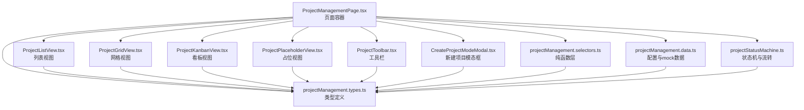
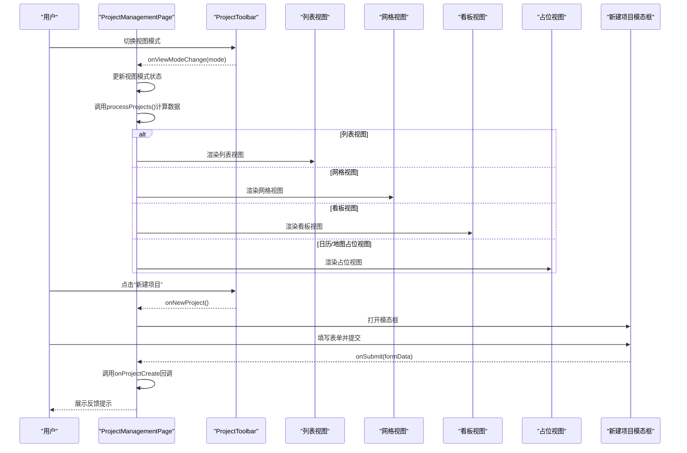
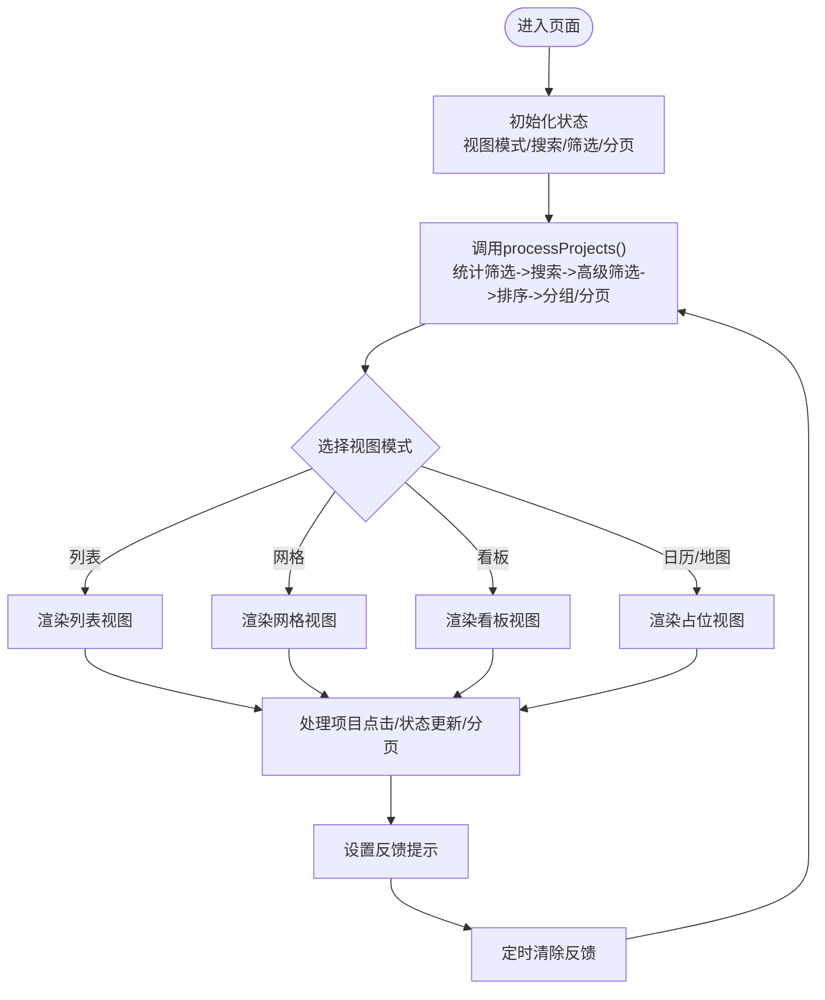
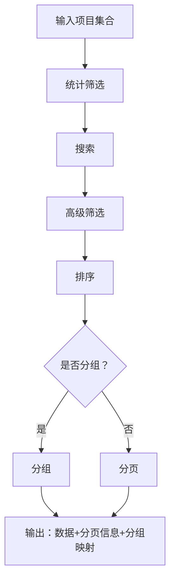
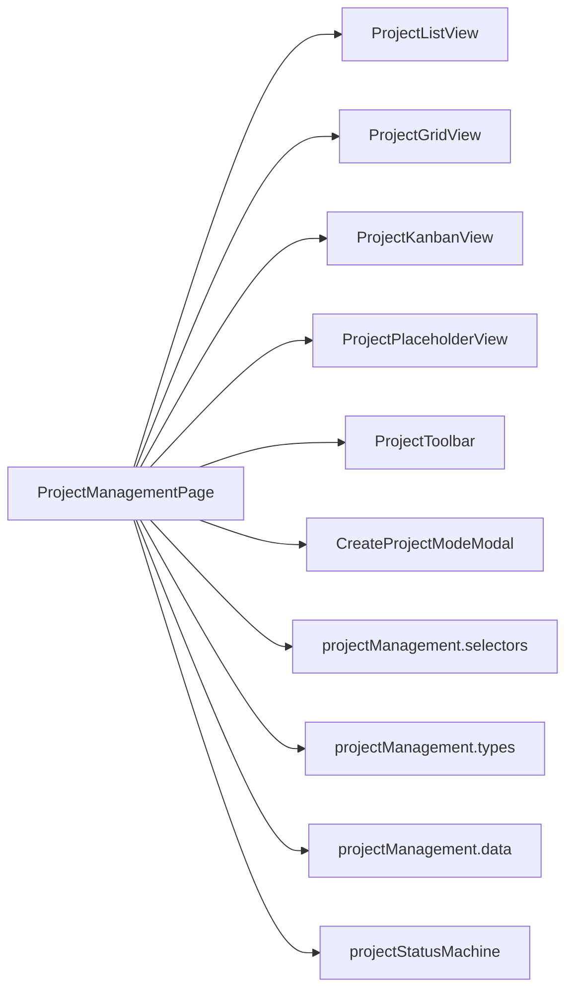

# 项目视图模式

<cite>
**本文引用的文件**
- [ProjectManagementPage.tsx](file://src/components/project/ProjectManagementPage.tsx)
- [ProjectListView.tsx](file://src/components/personnel/ProjectListView.tsx)
- [ProjectGridView.tsx](file://src/components/personnel/ProjectGridView.tsx)
- [ProjectKanbanView.tsx](file://src/components/personnel/ProjectKanbanView.tsx)
- [ProjectPlaceholderView.tsx](file://src/components/personnel/ProjectPlaceholderView.tsx)
- [ProjectToolbar.tsx](file://src/components/personnel/ProjectToolbar.tsx)
- [CreateProjectModeModal.tsx](file://src/components/personnel/CreateProjectModeModal.tsx)
- [projectManagement.types.ts](file://src/components/personnel/projectManagement.types.ts)
- [projectManagement.selectors.ts](file://src/components/personnel/projectManagement.selectors.ts)
- [projectManagement.data.ts](file://src/components/personnel/projectManagement.data.ts)
- [projectStatusMachine.ts](file://src/domain/projectStatusMachine.ts)
</cite>

## 目录

1. [简介](#简介)
2. [项目结构](#项目结构)
3. [核心组件](#核心组件)
4. [架构总览](#架构总览)
5. [详细组件分析](#详细组件分析)
6. [依赖关系分析](#依赖关系分析)
7. [性能考虑](#性能考虑)
8. [故障排查指南](#故障排查指南)
9. [结论](#结论)
10. [附录](#附录)

## 简介

本文件系统性阐述项目管理页面的视图模式体系，涵盖列表视图、网格视图、看板视图与占位视图（日历/地图）的实现原理与交互设计，并深入解析视图切换逻辑、工具栏组件、项目创建模态框的交互流程，以及在不同视图下的数据处理策略、分页机制、搜索与过滤功能。同时提供新增视图模式的实践路径与视图间状态同步机制说明，帮助开发者快速理解与扩展该模块。

## 项目结构

项目视图模式相关代码主要位于 personnel 与 project 两个命名空间下：

- 页面容器：负责状态管理、视图切换、数据处理与视图渲染调度
- 视图组件：针对不同视图模式的展示层
- 工具栏与模态框：提供搜索、筛选、排序、分组与新建项目的交互入口
- 纯函数层：封装搜索、筛选、排序、分组、分页与看板分列等纯函数
- 类型与配置：统一的数据模型、视图模式枚举、筛选/排序/分组配置项

图表来源

- [ProjectManagementPage.tsx:1-270](file://src/components/project/ProjectManagementPage.tsx#L1-L270)
- [ProjectListView.tsx:1-240](file://src/components/personnel/ProjectListView.tsx#L1-L240)
- [ProjectGridView.tsx:1-189](file://src/components/personnel/ProjectGridView.tsx#L1-L189)
- [ProjectKanbanView.tsx:1-151](file://src/components/personnel/ProjectKanbanView.tsx#L1-L151)
- [ProjectPlaceholderView.tsx:1-128](file://src/components/personnel/ProjectPlaceholderView.tsx#L1-L128)
- [ProjectToolbar.tsx:1-249](file://src/components/personnel/ProjectToolbar.tsx#L1-L249)
- [CreateProjectModeModal.tsx:1-257](file://src/components/personnel/CreateProjectModeModal.tsx#L1-L257)
- [projectManagement.selectors.ts:1-284](file://src/components/personnel/projectManagement.selectors.ts#L1-L284)
- [projectManagement.types.ts:1-168](file://src/components/personnel/projectManagement.types.ts#L1-L168)
- [projectManagement.data.ts:1-313](file://src/components/personnel/projectManagement.data.ts#L1-L313)
- [projectStatusMachine.ts:1-164](file://src/domain/projectStatusMachine.ts#L1-L164)

章节来源

- [ProjectManagementPage.tsx:1-270](file://src/components/project/ProjectManagementPage.tsx#L1-L270)
- [projectManagement.selectors.ts:1-284](file://src/components/personnel/projectManagement.selectors.ts#L1-L284)

## 核心组件

- 页面容器：负责视图模式状态、搜索查询、筛选条件、分页参数、反馈提示与事件回调的集中管理；调用纯函数层进行数据处理，并根据视图模式渲染对应视图组件。
- 视图组件：分别实现列表、网格、看板与占位视图的 UI 呈现与交互；占位视图为日历/地图预留占位，展示功能说明与基础统计。
- 工具栏：提供视图切换按钮、搜索输入、分组/筛选/排序菜单、重置按钮与新建项目按钮。
- 新建项目模态框：提供最小必填字段表单，包含表单校验、错误提示与提交流程。

章节来源

- [ProjectManagementPage.tsx:46-270](file://src/components/project/ProjectManagementPage.tsx#L46-L270)
- [ProjectToolbar.tsx:29-249](file://src/components/personnel/ProjectToolbar.tsx#L29-L249)
- [CreateProjectModeModal.tsx:37-257](file://src/components/personnel/CreateProjectModeModal.tsx#L37-L257)

## 架构总览

视图模式采用“容器组件 + 多视图组件 + 纯函数层”的分层架构：

- 容器组件：聚合状态与事件，协调视图渲染与数据处理
- 视图组件：专注各自视图的 UI 与交互
- 纯函数层：封装搜索、筛选、排序、分组、分页与看板分列等纯函数，保证可测试性与复用性
- 类型与配置：统一的数据模型与配置项，确保跨组件一致性

图表来源

- [ProjectManagementPage.tsx:188-241](file://src/components/project/ProjectManagementPage.tsx#L188-L241)
- [ProjectToolbar.tsx:229-238](file://src/components/personnel/ProjectToolbar.tsx#L229-L238)
- [CreateProjectModeModal.tsx:117-129](file://src/components/personnel/CreateProjectModeModal.tsx#L117-L129)

## 详细组件分析

### 页面容器：ProjectManagementPage

- 职责
  - 维护视图模式、搜索查询、筛选条件、分页参数与反馈提示
  - 调用纯函数层对项目数据进行统计筛选、搜索、高级筛选、排序、分组/分页
  - 根据视图模式渲染对应视图组件
  - 处理项目打开、状态更新与新建项目提交的回调
- 关键点
  - 使用 useMemo 缓存处理结果，避免重复计算
  - 看板视图使用全量数据进行分列，避免分页影响列结构
  - 通过 shouldResetPage 判断是否需要重置页码
  - 提供反馈提示自动清除机制

图表来源

- [ProjectManagementPage.tsx:68-78](file://src/components/project/ProjectManagementPage.tsx#L68-L78)
- [ProjectManagementPage.tsx:202-241](file://src/components/project/ProjectManagementPage.tsx#L202-L241)

章节来源

- [ProjectManagementPage.tsx:46-270](file://src/components/project/ProjectManagementPage.tsx#L46-L270)

### 视图组件

#### 列表视图：ProjectListView

- 特点
  - 表格布局，展示项目名称、品牌、阶段、进度、里程碑、任务、风险、计划开业、负责人等字段
  - 内嵌状态选择器，基于状态机规则动态生成可流转状态
  - 支持空状态与搜索查询提示
  - 分页控制与页码导航
- 关键实现
  - 使用 useMemo 预计算每个项目的可用流转选项
  - 状态变更时根据规则提示是否需要填写原因
  - 通过 onProjectClick 与 onProjectStatusUpdate 回调与容器通信

章节来源

- [ProjectListView.tsx:35-240](file://src/components/personnel/ProjectListView.tsx#L35-L240)
- [projectStatusMachine.ts:88-93](file://src/domain/projectStatusMachine.ts#L88-L93)

#### 网格视图：ProjectGridView

- 特点
  - 卡片式布局，突出项目关键指标（进度、里程碑、任务、风险、计划开业、负责人）
  - 支持空状态与搜索查询提示
  - 分页控制与页码导航
- 关键实现
  - 结构化卡片，便于在网格中快速浏览
  - 与列表视图共享分页与搜索逻辑

章节来源

- [ProjectGridView.tsx:23-189](file://src/components/personnel/ProjectGridView.tsx#L23-L189)

#### 看板视图：ProjectKanbanView

- 特点
  - 按项目阶段分列展示，列标题显示项目数量
  - 每列卡片包含项目名称、状态、品牌、进度、里程碑、任务、负责人与风险
  - 支持空状态与搜索查询提示
- 关键实现
  - 使用 kanbanGroupByStage 将项目按阶段分列
  - 看板视图不参与分页，使用全量数据保证列完整性

章节来源

- [ProjectKanbanView.tsx:29-151](file://src/components/personnel/ProjectKanbanView.tsx#L29-L151)
- [projectManagement.selectors.ts:193-211](file://src/components/personnel/projectManagement.selectors.ts#L193-L211)

#### 占位视图：ProjectPlaceholderView

- 特点
  - 为日历与地图视图预留占位，展示功能说明与基础统计
  - 日历视图统计“项目总数”“已排期项目”“涉及月份”
  - 地图视图统计“项目总数”“品牌数量”“负责人数”
  - 支持空状态与搜索查询提示
- 关键实现
  - 根据视图模式动态渲染不同的占位内容与统计

章节来源

- [ProjectPlaceholderView.tsx:14-128](file://src/components/personnel/ProjectPlaceholderView.tsx#L14-L128)

### 工具栏：ProjectToolbar

- 功能
  - 视图切换：列表、网格、看板、日历、地图
  - 搜索：实时更新搜索查询
  - 分组：按阶段/负责人/品牌分组
  - 筛选：按阶段、状态、风险项目筛选
  - 排序：按名称、进度、计划开业、风险等级排序
  - 重置：一键重置所有筛选条件
  - 新建项目：打开新建项目模态框
- 关键实现
  - 下拉菜单点击外部关闭
  - 筛选项支持多选与互斥切换
  - 与容器组件通过回调同步状态

章节来源

- [ProjectToolbar.tsx:29-249](file://src/components/personnel/ProjectToolbar.tsx#L29-L249)
- [projectManagement.data.ts:247-278](file://src/components/personnel/projectManagement.data.ts#L247-L278)

### 新建项目模态框：CreateProjectModeModal

- 功能
  - 最小必填字段表单：项目名称、门店名称、门店类型、城市、项目类型、项目状态、项目负责人、计划开始/结束/开业日期
  - 表单校验：必填项与日期先后关系校验
  - 错误提示与提交状态
  - ESC 关闭与遮罩点击关闭
- 关键实现
  - 表单状态与错误状态分离
  - 提交成功后关闭模态框并清理状态

章节来源

- [CreateProjectModeModal.tsx:37-257](file://src/components/personnel/CreateProjectModeModal.tsx#L37-L257)

### 数据处理与分页机制

#### 纯函数层：projectManagement.selectors

- 统计：计算项目总数、活跃项目、待验收项目、风险项目
- 搜索：按项目名称与编号模糊匹配
- 高级筛选：按阶段、状态、风险项目筛选
- 排序：支持默认、名称升序、进度降序、计划开业升序、风险等级降序
- 分组：支持按阶段/负责人/品牌分组
- 分页：按页码与每页条数切片
- 看板分列：按阶段固定顺序分列
- 流程：统计筛选 -> 搜索 -> 高级筛选 -> 排序 -> 分组或分页
- 页码重置：当搜索、筛选、排序、分组或每页条数变化时重置到第一页

图表来源

- [projectManagement.selectors.ts:217-261](file://src/components/personnel/projectManagement.selectors.ts#L217-L261)

章节来源

- [projectManagement.selectors.ts:17-284](file://src/components/personnel/projectManagement.selectors.ts#L17-L284)

### 视图切换逻辑与状态同步

- 视图模式枚举：list、grid、kanban、calendar、map
- 切换策略
  - 列表/网格：使用分页结果渲染
  - 看板：使用全量数据按阶段分列
  - 日历/地图：使用占位视图组件，展示功能说明与基础统计
- 状态同步
  - 搜索、筛选、排序、分组与每页条数变化时，容器组件通过 shouldResetPage 判断是否重置页码
  - 反馈提示在一定时间后自动清除，避免状态污染

章节来源

- [projectManagement.types.ts:9](file://src/components/personnel/projectManagement.types.ts#L9)
- [ProjectManagementPage.tsx:80-88](file://src/components/project/ProjectManagementPage.tsx#L80-L88)
- [ProjectManagementPage.tsx:95-99](file://src/components/project/ProjectManagementPage.tsx#L95-L99)

### 添加新的视图模式实践指南

- 步骤
  1. 在类型定义中新增视图模式枚举值
     - 参考路径：[projectManagement.types.ts:9](file://src/components/personnel/projectManagement.types.ts#L9)
  2. 在页面容器中添加视图渲染分支
     - 参考路径：[ProjectManagementPage.tsx:235-241](file://src/components/project/ProjectManagementPage.tsx#L235-L241)
  3. 创建视图组件并实现数据接收与交互
     - 参考现有组件：[ProjectListView.tsx:35-240](file://src/components/personnel/ProjectListView.tsx#L35-L240)、[ProjectGridView.tsx:23-189](file://src/components/personnel/ProjectGridView.tsx#L23-L189)、[ProjectKanbanView.tsx:29-151](file://src/components/personnel/ProjectKanbanView.tsx#L29-L151)、[ProjectPlaceholderView.tsx:14-128](file://src/components/personnel/ProjectPlaceholderView.tsx#L14-L128)
  4. 如需分组/分页，完善纯函数层或在容器中准备数据
     - 参考路径：[projectManagement.selectors.ts:125-188](file://src/components/personnel/projectManagement.selectors.ts#L125-L188)
  5. 在工具栏中添加视图切换按钮
     - 参考路径：[ProjectToolbar.tsx:21-27](file://src/components/personnel/ProjectToolbar.tsx#L21-L27)
- 注意事项
  - 保持与现有数据处理流程一致，避免破坏搜索/筛选/排序链路
  - 对于需要全量数据的视图（如看板），参考容器中的全量数据准备方式

章节来源

- [projectManagement.types.ts:9](file://src/components/personnel/projectManagement.types.ts#L9)
- [ProjectManagementPage.tsx:235-241](file://src/components/project/ProjectManagementPage.tsx#L235-L241)
- [ProjectToolbar.tsx:21-27](file://src/components/personnel/ProjectToolbar.tsx#L21-L27)
- [projectManagement.selectors.ts:125-188](file://src/components/personnel/projectManagement.selectors.ts#L125-L188)

## 依赖关系分析

- 组件耦合
  - 页面容器与各视图组件松耦合，通过 props 传递数据与回调
  - 视图组件之间无直接依赖，均依赖统一的类型定义
- 纯函数层
  - 作为纯函数层，不依赖 UI，便于单元测试与复用
- 外部依赖
  - 状态机：项目状态流转规则与可用状态选项
  - 配置与 mock 数据：视图模式、筛选/排序/分组选项与示例数据

图表来源

- [ProjectManagementPage.tsx:1-270](file://src/components/project/ProjectManagementPage.tsx#L1-L270)
- [projectManagement.selectors.ts:1-284](file://src/components/personnel/projectManagement.selectors.ts#L1-L284)
- [projectManagement.types.ts:1-168](file://src/components/personnel/projectManagement.types.ts#L1-L168)
- [projectManagement.data.ts:1-313](file://src/components/personnel/projectManagement.data.ts#L1-L313)
- [projectStatusMachine.ts:1-164](file://src/domain/projectStatusMachine.ts#L1-L164)

章节来源

- [ProjectManagementPage.tsx:1-270](file://src/components/project/ProjectManagementPage.tsx#L1-L270)
- [projectManagement.selectors.ts:1-284](file://src/components/personnel/projectManagement.selectors.ts#L1-L284)

## 性能考虑

- 计算缓存
  - 使用 useMemo 缓存处理结果与看板分列结果，减少重复计算
- 数据规模
  - 看板视图使用全量数据进行分列，避免分页影响列结构
- 交互反馈
  - 反馈提示定时清除，避免频繁重渲染
- 分页策略
  - 分页仅在列表/网格视图生效，看板视图不参与分页

章节来源

- [ProjectManagementPage.tsx:68-78](file://src/components/project/ProjectManagementPage.tsx#L68-L78)
- [ProjectManagementPage.tsx:73-78](file://src/components/project/ProjectManagementPage.tsx#L73-L78)
- [ProjectManagementPage.tsx:62-64](file://src/components/project/ProjectManagementPage.tsx#L62-L64)

## 故障排查指南

- 视图切换无效
  - 检查容器组件是否正确更新视图模式状态与调用数据处理函数
  - 参考路径：[ProjectManagementPage.tsx:188-241](file://src/components/project/ProjectManagementPage.tsx#L188-L241)
- 筛选/排序不生效
  - 确认 filters 是否被正确更新，以及 shouldResetPage 是否触发页码重置
  - 参考路径：[ProjectManagementPage.tsx:80-88](file://src/components/project/ProjectManagementPage.tsx#L80-L88)
- 看板列为空
  - 确认全量数据是否正确传入，且分组函数是否按阶段固定顺序
  - 参考路径：[projectManagement.selectors.ts:193-211](file://src/components/personnel/projectManagement.selectors.ts#L193-L211)
- 新建项目失败
  - 检查表单校验与回调返回值，确认错误提示是否正确显示
  - 参考路径：[CreateProjectModeModal.tsx:117-129](file://src/components/personnel/CreateProjectModeModal.tsx#L117-L129)
- 状态更新异常
  - 检查状态机规则与回调返回值，确认是否需要填写原因
  - 参考路径：[projectStatusMachine.ts:88-93](file://src/domain/projectStatusMachine.ts#L88-L93)

章节来源

- [ProjectManagementPage.tsx:188-241](file://src/components/project/ProjectManagementPage.tsx#L188-L241)
- [ProjectManagementPage.tsx:80-88](file://src/components/project/ProjectManagementPage.tsx#L80-L88)
- [projectManagement.selectors.ts:193-211](file://src/components/personnel/projectManagement.selectors.ts#L193-L211)
- [CreateProjectModeModal.tsx:117-129](file://src/components/personnel/CreateProjectModeModal.tsx#L117-L129)
- [projectStatusMachine.ts:88-93](file://src/domain/projectStatusMachine.ts#L88-L93)

## 结论

项目视图模式通过清晰的分层架构实现了多样化的项目展示与交互体验。容器组件负责状态与数据处理，视图组件专注于各自展示，纯函数层提供可测试的数据处理能力，类型与配置确保跨组件一致性。该体系易于扩展，新增视图模式只需遵循现有流程即可快速集成，并保持与搜索、筛选、排序与分页机制的无缝衔接。

## 附录

- 类型与配置参考
  - 视图模式枚举：[projectManagement.types.ts:9](file://src/components/personnel/projectManagement.types.ts#L9)
  - 筛选/排序/分组配置：[projectManagement.data.ts:247-278](file://src/components/personnel/projectManagement.data.ts#L247-L278)
  - 状态机规则：[projectStatusMachine.ts:59-93](file://src/domain/projectStatusMachine.ts#L59-L93)
