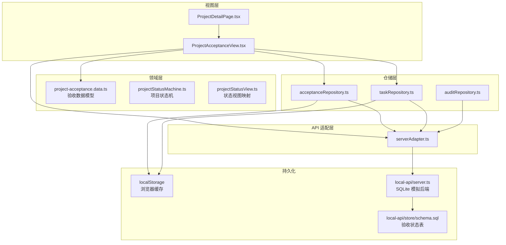
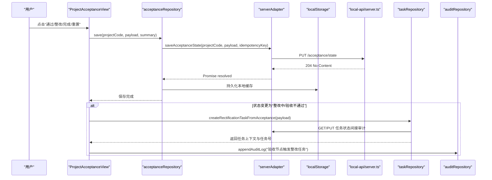
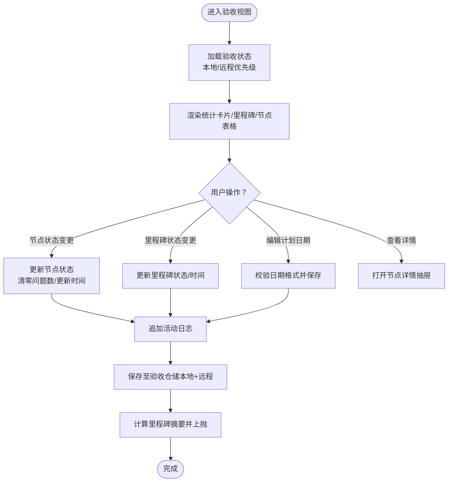
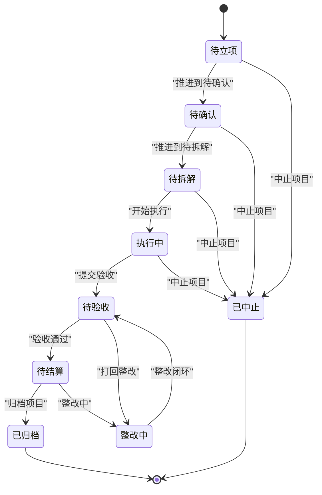
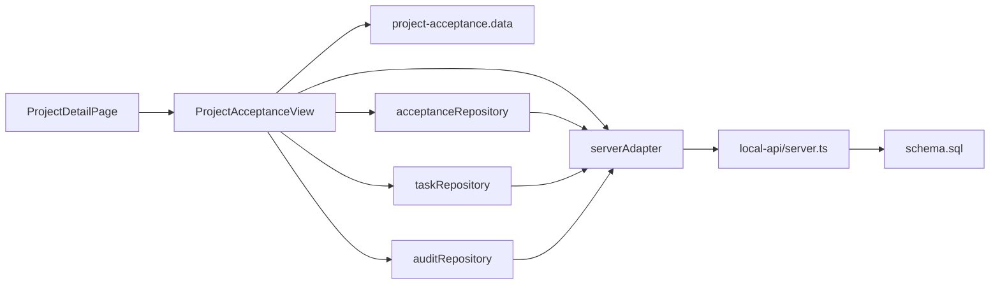

# 项目验收管理

<cite>
**本文引用的文件**
- [ProjectAcceptanceView.tsx](file://src/components/project/ProjectAcceptanceView.tsx)
- [project-acceptance.data.ts](file://src/components/project/project-acceptance.data.ts)
- [acceptanceRepository.ts](file://src/services/repositories/acceptanceRepository.ts)
- [serverAdapter.ts](file://src/services/api/serverAdapter.ts)
- [projectStatusMachine.ts](file://src/domain/projectStatusMachine.ts)
- [projectStatusView.ts](file://src/domain/projectStatusView.ts)
- [taskRepository.ts](file://src/services/repositories/taskRepository.ts)
- [ProjectDetailPage.tsx](file://src/components/project/ProjectDetailPage.tsx)
- [schema.sql](file://local-api/store/schema.sql)
- [server.ts](file://local-api/server.ts)
- [auditRepository.ts](file://src/services/repositories/auditRepository.ts)
</cite>

## 目录

1. [简介](#简介)
2. [项目结构](#项目结构)
3. [核心组件](#核心组件)
4. [架构总览](#架构总览)
5. [详细组件分析](#详细组件分析)
6. [依赖关系分析](#依赖关系分析)
7. [性能考量](#性能考量)
8. [故障排查指南](#故障排查指南)
9. [结论](#结论)
10. [附录](#附录)

## 简介

本文件面向项目验收管理功能，系统性阐述验收视图的实现架构与运行机制，涵盖以下主题：

- 验收流程展示：节点状态、里程碑状态、统计卡片与筛选器
- 验收标准管理：验收标准条目、附件资料与节点详情抽屉
- 验收结果记录：状态变更、整改任务触发、活动日志与里程碑同步
- 验收状态展示逻辑：状态徽章、风险等级标签、统计聚合
- 验收操作触发机制：按钮操作、日期编辑、状态同步
- 验收历史追踪：本地存储、远程持久化、审计日志
- 状态机集成：与项目状态机的衔接、守卫条件与联动钩子
- 数据验证逻辑：日期格式校验、状态过滤与搜索
- 通知与整改：整改任务创建、任务上下文与状态联动
- 自定义与扩展：如何定制验收流程、扩展验收标准管理

## 项目结构

验收管理功能围绕“视图组件 + 领域模型 + 仓储层 + API 适配层 + 本地/远程持久化 + 审计日志”展开，采用分层清晰、职责分离的设计。

**图表来源**

- [ProjectAcceptanceView.tsx:163-642](file://src/components/project/ProjectAcceptanceView.tsx#L163-L642)
- [project-acceptance.data.ts:1-122](file://src/components/project/project-acceptance.data.ts#L1-L122)
- [acceptanceRepository.ts:1-56](file://src/services/repositories/acceptanceRepository.ts#L1-L56)
- [serverAdapter.ts:1-87](file://src/services/api/serverAdapter.ts#L1-L87)
- [taskRepository.ts:1-200](file://src/services/repositories/taskRepository.ts#L1-L200)
- [ProjectDetailPage.tsx:1-200](file://src/components/project/ProjectDetailPage.tsx#L1-L200)
- [schema.sql:23-31](file://local-api/store/schema.sql#L23-L31)
- [server.ts:206-244](file://local-api/server.ts#L206-L244)

**章节来源**

- [ProjectAcceptanceView.tsx:163-642](file://src/components/project/ProjectAcceptanceView.tsx#L163-L642)
- [project-acceptance.data.ts:1-122](file://src/components/project/project-acceptance.data.ts#L1-L122)
- [acceptanceRepository.ts:1-56](file://src/services/repositories/acceptanceRepository.ts#L1-L56)
- [serverAdapter.ts:1-87](file://src/services/api/serverAdapter.ts#L1-L87)
- [taskRepository.ts:1-200](file://src/services/repositories/taskRepository.ts#L1-L200)
- [ProjectDetailPage.tsx:1-200](file://src/components/project/ProjectDetailPage.tsx#L1-L200)
- [schema.sql:23-31](file://local-api/store/schema.sql#L23-L31)
- [server.ts:206-244](file://local-api/server.ts#L206-L244)

## 核心组件

- 验收视图组件：负责渲染验收节点表格、里程碑面板、统计卡片、筛选器与抽屉交互，并处理状态变更与整改任务创建。
- 验收数据模型：定义验收节点、标准、附件、风险等级与状态枚举。
- 验收仓储：封装验收状态的本地/远程加载与保存，支持幂等键与摘要同步。
- API 适配：统一请求封装、环境参数注入、幂等键生成与验收状态读写。
- 任务仓储：提供整改任务创建能力，支持任务上下文与操作日志。
- 审计仓储：提供审计日志追加能力，保证关键操作可追溯。
- 项目状态机：定义项目状态流转、守卫条件与联动钩子，与验收状态联动。

**章节来源**

- [ProjectAcceptanceView.tsx:163-642](file://src/components/project/ProjectAcceptanceView.tsx#L163-L642)
- [project-acceptance.data.ts:1-122](file://src/components/project/project-acceptance.data.ts#L1-L122)
- [acceptanceRepository.ts:1-56](file://src/services/repositories/acceptanceRepository.ts#L1-L56)
- [serverAdapter.ts:1-87](file://src/services/api/serverAdapter.ts#L1-L87)
- [taskRepository.ts:1-200](file://src/services/repositories/taskRepository.ts#L1-L200)
- [auditRepository.ts:1-25](file://src/services/repositories/auditRepository.ts#L1-L25)
- [projectStatusMachine.ts:1-164](file://src/domain/projectStatusMachine.ts#L1-L164)

## 架构总览

验收管理遵循“视图驱动 + 仓储持久化 + API 适配 + 审计日志”的闭环架构。视图组件通过仓储层与 API 适配层访问远程服务，同时以本地存储作为兜底。关键操作（状态变更、整改任务创建、审计日志）均具备幂等与错误降级能力。

**图表来源**

- [ProjectAcceptanceView.tsx:259-314](file://src/components/project/ProjectAcceptanceView.tsx#L259-L314)
- [acceptanceRepository.ts:45-54](file://src/services/repositories/acceptanceRepository.ts#L45-L54)
- [serverAdapter.ts:64-74](file://src/services/api/serverAdapter.ts#L64-L74)
- [server.ts:216-244](file://local-api/server.ts#L216-L244)
- [taskRepository.ts:197-200](file://src/services/repositories/taskRepository.ts#L197-L200)
- [auditRepository.ts:6-24](file://src/services/repositories/auditRepository.ts#L6-L24)

## 详细组件分析

### 验收视图组件（ProjectAcceptanceView）

- 数据结构与状态
  - 验收节点：包含节点编码/名称、阶段、责任人、计划验收、提交时间、状态、风险等级、问题数、验收标准与附件。
  - 里程碑：包含里程碑名称、阶段、责任人、计划日期、状态、更新时间。
  - 统计：待验收节点、已通过节点、整改中节点、高风险未闭环节点。
- 展示逻辑
  - 状态徽章与风险标签：根据状态/风险等级映射到不同样式类名。
  - 里程碑状态：支持“未开始/进行中/已完成”三态切换与计划日期编辑。
  - 抽屉详情：展示节点基础信息、验收标准与附件资料。
- 操作机制
  - 节点状态变更：通过按钮触发，支持“验收通过/整改中/待复验”等。
  - 里程碑状态变更：支持“完成/进行中/重置”。
  - 日期编辑：输入校验（YYYY-MM-DD），保存后更新里程碑计划日期。
  - 活动日志：每次操作都会追加一条活动日志。
  - 里程碑同步：计算并向上游传递里程碑统计摘要。
- 数据持久化
  - 本地存储：以项目代码为键，持久化验收状态与里程碑。
  - 远程持久化：通过验收仓储与 API 适配层写入模拟后端，支持幂等键。
- 交互细节
  - 筛选器：支持按状态与风险等级筛选，搜索框支持节点名称/编码模糊匹配。
  - 本地回退：当远程不可用时，使用本地缓存作为兜底。

**图表来源**

- [ProjectAcceptanceView.tsx:163-642](file://src/components/project/ProjectAcceptanceView.tsx#L163-L642)
- [acceptanceRepository.ts:32-55](file://src/services/repositories/acceptanceRepository.ts#L32-L55)

**章节来源**

- [ProjectAcceptanceView.tsx:163-642](file://src/components/project/ProjectAcceptanceView.tsx#L163-L642)

### 验收数据模型（project-acceptance.data）

- 类型定义
  - AcceptanceStatus：待验收、验收通过、验收不通过、整改中、待复验
  - AcceptanceRiskLevel：低、中、高、严重
  - AcceptanceStandard：验收标准条目（标题、是否通过）
  - AcceptanceAttachment：附件（名称、类型）
  - AcceptanceNode：验收节点（含标准与附件数组）
- 默认种子数据
  - 包含多个验收节点的默认样例，覆盖不同阶段、风险等级与状态，便于演示与测试。

**章节来源**

- [project-acceptance.data.ts:1-122](file://src/components/project/project-acceptance.data.ts#L1-L122)

### 验收仓储（acceptanceRepository）

- 加载策略
  - 优先读取本地缓存；若远程可用则拉取并覆盖本地缓存。
- 保存策略
  - 合并摘要后持久化本地缓存；尝试远程写入，失败时仅本地缓存。
- 幂等键
  - 使用统一的幂等键生成策略，避免重复提交。

**章节来源**

- [acceptanceRepository.ts:1-56](file://src/services/repositories/acceptanceRepository.ts#L1-L56)

### API 适配（serverAdapter）

- 接口契约
  - 获取/保存验收状态：/acceptance/state?projectCode=...
  - 幂等键：createIdempotencyKey(scope, target?)
  - 环境参数：自动附加 envId 查询参数
- 错误处理
  - 远程失败时返回本地缓存，保证界面可用性。

**章节来源**

- [serverAdapter.ts:1-87](file://src/services/api/serverAdapter.ts#L1-L87)

### 本地/远程持久化（local-api）

- 数据库表
  - acceptance_state：存储项目验收状态快照与更新时间。
- 服务端实现
  - GET：返回指定项目的验收状态快照或空数组
  - PUT：幂等写入，基于环境与项目代码唯一约束

**章节来源**

- [schema.sql:23-31](file://local-api/store/schema.sql#L23-L31)
- [server.ts:206-244](file://local-api/server.ts#L206-L244)

### 任务仓储与整改任务（taskRepository）

- 整改任务创建
  - 根据验收节点触发，生成任务编码、描述、父路径、风险等级等。
  - 支持任务上下文（contextKey）与操作日志持久化。
- 审计联动
  - 任务操作日志通过审计接口写入，保证可追溯。

**章节来源**

- [taskRepository.ts:1-200](file://src/services/repositories/taskRepository.ts#L1-L200)

### 审计仓储（auditRepository）

- 审计日志
  - 统一场景（project/task/acceptance/settlement/system），支持幂等键。
  - 失败时记录结构化错误，不影响主流程。

**章节来源**

- [auditRepository.ts:1-25](file://src/services/repositories/auditRepository.ts#L1-L25)

### 项目状态机与验收联动（projectStatusMachine）

- 状态枚举与流转
  - 定义项目状态集合与允许的流转方向。
- 守卫条件
  - 针对“整改中/已中止”等需要原因；关键阶段前置条件（容器、审批、里程碑、任务树、标准绑定、关键任务完成、验收通过、验收反馈、整改闭环、结算完成）。
- 联动钩子
  - 进入“待验收”时触发“验收摘要生成”等钩子（mock）。

**图表来源**

- [projectStatusMachine.ts:59-86](file://src/domain/projectStatusMachine.ts#L59-L86)

**章节来源**

- [projectStatusMachine.ts:1-164](file://src/domain/projectStatusMachine.ts#L1-L164)

### 状态视图映射（projectStatusView）

- 阶段映射：根据状态映射到“启动/计划/执行/监控/收尾”
- 主题色：根据状态映射到蓝色/黄色/绿色/红色
- 归一化：将非标准状态字符串归一化为标准状态枚举
- 进度下限：根据状态返回对应的进度百分比下限

**章节来源**

- [projectStatusView.ts:1-89](file://src/domain/projectStatusView.ts#L1-L89)

### 项目详情页与验收视图集成（ProjectDetailPage）

- 传入回调
  - onAppendActivityLog：用于接收验收视图产生的活动日志
  - onMilestoneSync：用于接收里程碑统计摘要
- 与验收视图的协作
  - 将项目详情页的过渡选项、日志等信息传递给验收视图，实现状态机联动与可视化

**章节来源**

- [ProjectDetailPage.tsx:1-200](file://src/components/project/ProjectDetailPage.tsx#L1-L200)

## 依赖关系分析

- 组件耦合
  - 验收视图依赖验收数据模型、验收仓储、任务仓储与审计仓储。
  - 项目详情页作为上层容器，向验收视图注入回调与上下文。
- 外部依赖
  - API 适配层封装网络请求与幂等键，本地/远程持久化通过模拟后端与 SQLite 表实现。
- 潜在循环依赖
  - 当前模块间为单向依赖，未发现循环依赖迹象。

**图表来源**

- [ProjectAcceptanceView.tsx:1-642](file://src/components/project/ProjectAcceptanceView.tsx#L1-L642)
- [project-acceptance.data.ts:1-122](file://src/components/project/project-acceptance.data.ts#L1-L122)
- [acceptanceRepository.ts:1-56](file://src/services/repositories/acceptanceRepository.ts#L1-L56)
- [taskRepository.ts:1-200](file://src/services/repositories/taskRepository.ts#L1-L200)
- [auditRepository.ts:1-25](file://src/services/repositories/auditRepository.ts#L1-L25)
- [serverAdapter.ts:1-87](file://src/services/api/serverAdapter.ts#L1-L87)
- [ProjectDetailPage.tsx:1-200](file://src/components/project/ProjectDetailPage.tsx#L1-L200)
- [schema.sql:23-31](file://local-api/store/schema.sql#L23-L31)
- [server.ts:206-244](file://local-api/server.ts#L206-L244)

**章节来源**

- [ProjectAcceptanceView.tsx:1-642](file://src/components/project/ProjectAcceptanceView.tsx#L1-L642)
- [ProjectDetailPage.tsx:1-200](file://src/components/project/ProjectDetailPage.tsx#L1-L200)

## 性能考量

- 渲染优化
  - 使用 useMemo 对筛选后的节点与统计进行缓存，避免重复计算。
- 存储与网络
  - 本地存储作为兜底，减少网络抖动对用户体验的影响。
  - 幂等键避免重复提交带来的资源浪费。
- 数据规模
  - 节点与里程碑数量有限，当前实现满足 O(n) 管道复杂度，无需额外分页或虚拟滚动。

[本节为通用指导，无需列出具体文件来源]

## 故障排查指南

- 验收状态未保存
  - 检查验收仓储保存流程与幂等键生成是否正确。
  - 确认本地存储权限与模拟后端是否可用。
- 整改任务未创建
  - 核查任务仓储的任务创建逻辑与上下文拼接。
  - 检查审计日志是否成功写入。
- 日期编辑无效
  - 确认日期格式校验逻辑与错误提示是否正确显示。
- 状态机流转异常
  - 检查守卫条件与上下文字段是否满足前置条件。

**章节来源**

- [acceptanceRepository.ts:45-54](file://src/services/repositories/acceptanceRepository.ts#L45-L54)
- [taskRepository.ts:197-200](file://src/services/repositories/taskRepository.ts#L197-L200)
- [auditRepository.ts:6-24](file://src/services/repositories/auditRepository.ts#L6-L24)
- [ProjectAcceptanceView.tsx:348-384](file://src/components/project/ProjectAcceptanceView.tsx#L348-L384)
- [projectStatusMachine.ts:105-163](file://src/domain/projectStatusMachine.ts#L105-L163)

## 结论

项目验收管理功能以清晰的分层架构实现了“状态展示—标准管理—结果记录—历史追踪—状态机集成”的闭环。通过本地/远程双写、幂等键与审计日志，保障了系统的可靠性与可追溯性。同时，视图组件提供了灵活的筛选、统计与交互能力，满足验收过程的可视化与操作需求。

[本节为总结性内容，无需列出具体文件来源]

## 附录

### 自定义验收流程示例（步骤指引）

- 扩展验收节点
  - 在验收数据模型中新增节点类型字段或扩展标准条目，参考：[project-acceptance.data.ts:16-31](file://src/components/project/project-acceptance.data.ts#L16-L31)
- 自定义状态机守卫
  - 在项目状态机中添加新的状态与守卫条件，参考：[projectStatusMachine.ts:105-163](file://src/domain/projectStatusMachine.ts#L105-L163)
- 集成整改任务
  - 在验收视图的状态变更分支中调用任务仓储创建整改任务，参考：[ProjectAcceptanceView.tsx:296-313](file://src/components/project/ProjectAcceptanceView.tsx#L296-L313)、[taskRepository.ts:197-200](file://src/services/repositories/taskRepository.ts#L197-L200)
- 记录审计日志
  - 在关键操作后追加审计日志，参考：[auditRepository.ts:6-24](file://src/services/repositories/auditRepository.ts#L6-L24)

### 扩展验收标准管理（步骤指引）

- 新增标准条目
  - 在验收节点的标准数组中添加新条目，参考：[project-acceptance.data.ts:44-48](file://src/components/project/project-acceptance.data.ts#L44-L48)
- 附件管理
  - 在验收节点的附件数组中添加新附件，参考：[project-acceptance.data.ts:49-52](file://src/components/project/project-acceptance.data.ts#L49-L52)
- 详情抽屉展示
  - 在验收视图的抽屉中渲染标准与附件列表，参考：[ProjectAcceptanceView.tsx:604-621](file://src/components/project/ProjectAcceptanceView.tsx#L604-L621)
