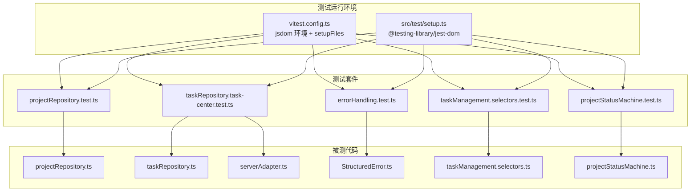
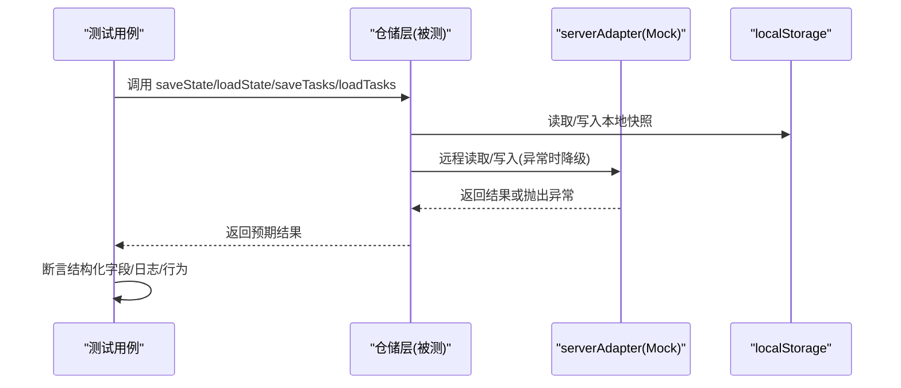
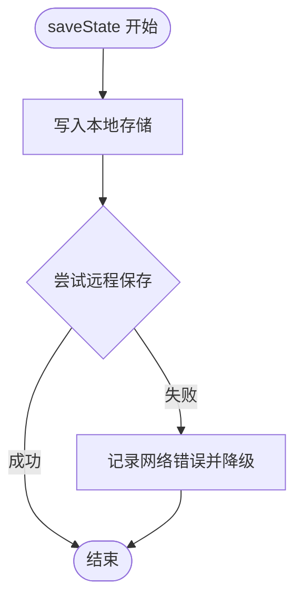
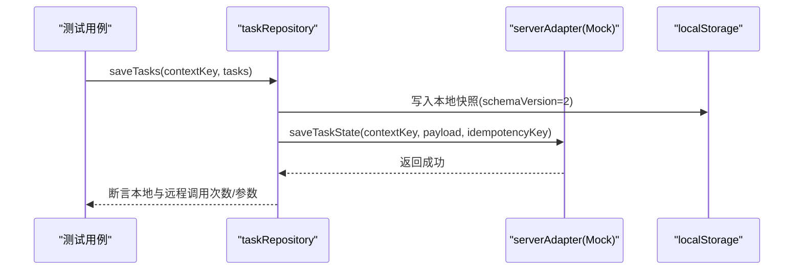
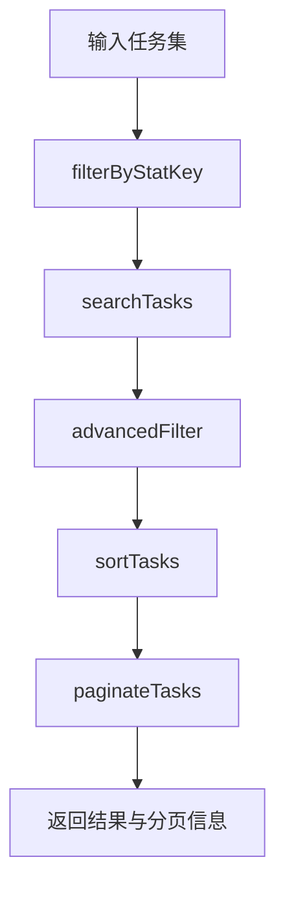
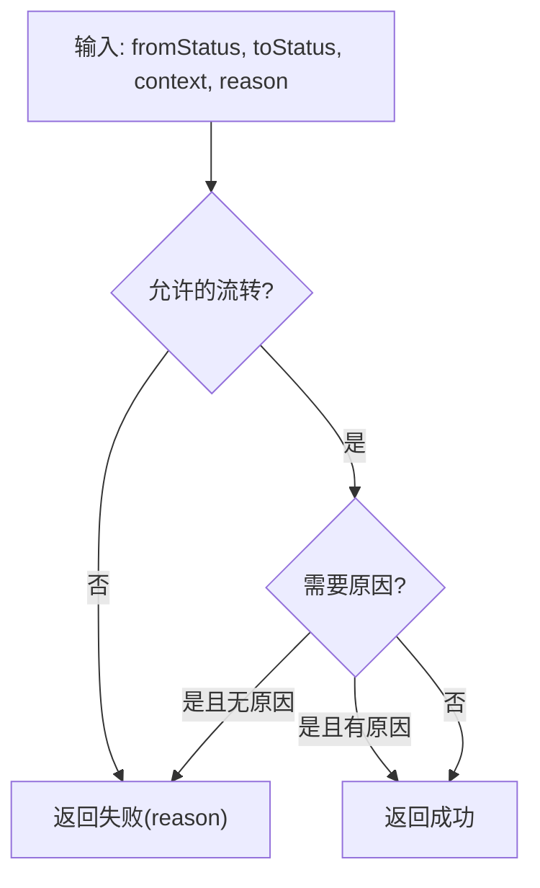
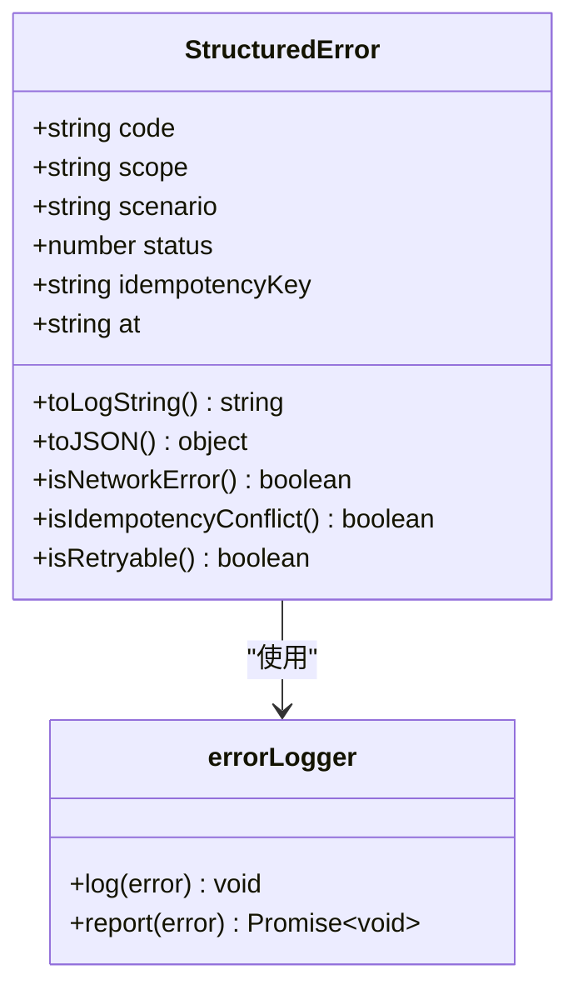
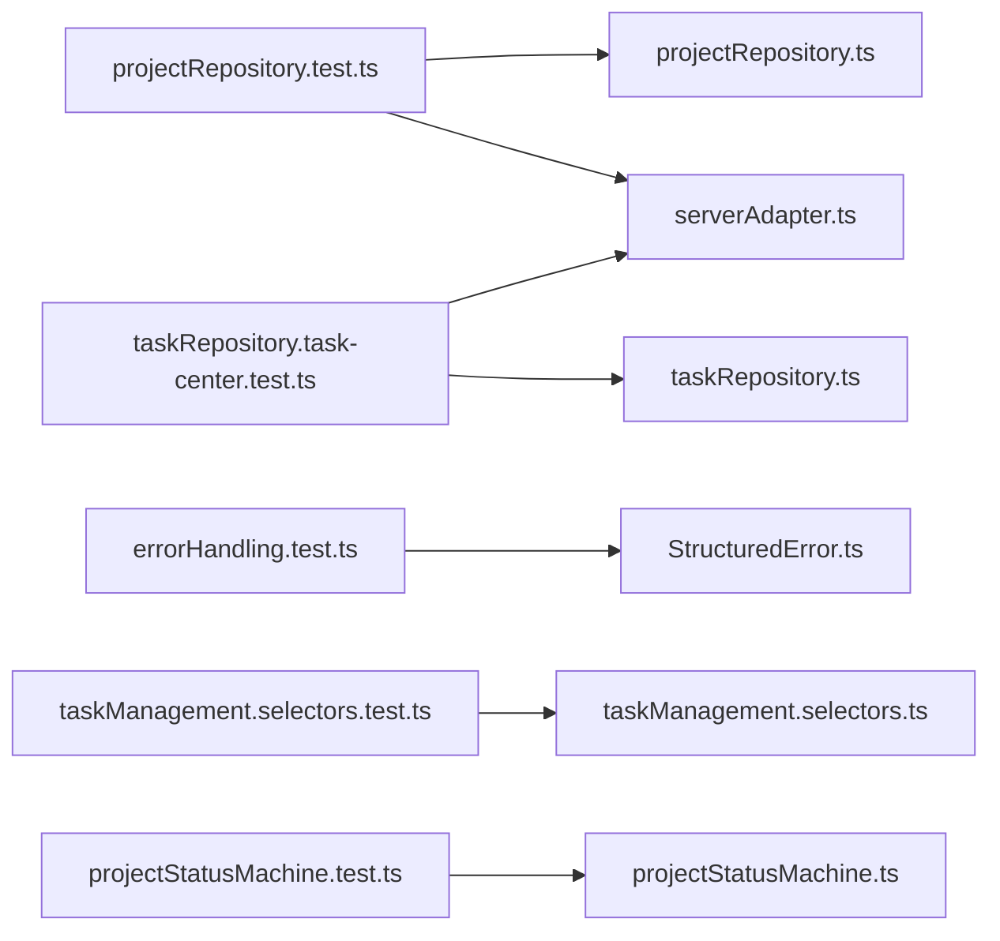

# 单元测试

<cite>
**本文引用的文件**
- [projectRepository.test.ts](file://src/services/__tests__/projectRepository.test.ts)
- [taskRepository.task-center.test.ts](file://src/services/__tests__/taskRepository.task-center.test.ts)
- [errorHandling.test.ts](file://src/services/__tests__/errorHandling.test.ts)
- [taskManagement.selectors.test.ts](file://src/components/task/__tests__/taskManagement.selectors.test.ts)
- [projectStatusMachine.test.ts](file://src/domain/__tests__/projectStatusMachine.test.ts)
- [vitest.config.ts](file://vitest.config.ts)
- [setup.ts](file://src/test/setup.ts)
- [package.json](file://package.json)
- [projectRepository.ts](file://src/services/repositories/projectRepository.ts)
- [taskRepository.ts](file://src/services/repositories/taskRepository.ts)
- [serverAdapter.ts](file://src/services/api/serverAdapter.ts)
- [StructuredError.ts](file://src/services/errors/StructuredError.ts)
- [taskManagement.selectors.ts](file://src/components/task/taskManagement.selectors.ts)
- [projectStatusMachine.ts](file://src/domain/projectStatusMachine.ts)
</cite>

## 目录

1. [简介](#简介)
2. [项目结构](#项目结构)
3. [核心组件](#核心组件)
4. [架构总览](#架构总览)
5. [详细组件分析](#详细组件分析)
6. [依赖关系分析](#依赖关系分析)
7. [性能考量](#性能考量)
8. [故障排查指南](#故障排查指南)
9. [结论](#结论)
10. [附录](#附录)

## 简介

本文件面向 CodeBuddy 项目的单元测试体系，系统阐述测试设计原则、编写规范、Mock 策略、测试隔离与数据清理、覆盖度计算与质量标准，并结合仓库现有测试用例，给出针对仓储层、服务层与组件层的实操示例与调试技巧。目标是帮助开发者以一致的方式编写高质量、可维护的单元测试。

## 项目结构

- 测试框架：Vitest + jsdom 环境，全局启用 expect 断言与自定义 setup 文件。
- 测试组织：按功能域分层，分别位于 services/components/domain 目录下的 **tests** 子目录中。
- Mock 策略：对 API 适配器与外部依赖采用 hoisted + vi.mock 的方式，确保模块导入时即被替换。
- 覆盖率：使用 V8 提供者，输出文本、JSON、HTML 报告，默认排除 node_modules 与 src/test。

图表来源

- [vitest.config.ts:1-19](file://vitest.config.ts#L1-L19)
- [setup.ts:1-2](file://src/test/setup.ts#L1-L2)
- [projectRepository.test.ts:1-122](file://src/services/__tests__/projectRepository.test.ts#L1-L122)
- [taskRepository.task-center.test.ts:1-99](file://src/services/__tests__/taskRepository.task-center.test.ts#L1-L99)
- [errorHandling.test.ts:1-128](file://src/services/__tests__/errorHandling.test.ts#L1-L128)
- [taskManagement.selectors.test.ts:1-102](file://src/components/task/__tests__/taskManagement.selectors.test.ts#L1-L102)
- [projectStatusMachine.test.ts:1-125](file://src/domain/__tests__/projectStatusMachine.test.ts#L1-L125)
- [projectRepository.ts:1-90](file://src/services/repositories/projectRepository.ts#L1-L90)
- [taskRepository.ts:1-318](file://src/services/repositories/taskRepository.ts#L1-L318)
- [serverAdapter.ts:1-87](file://src/services/api/serverAdapter.ts#L1-L87)
- [StructuredError.ts:1-195](file://src/services/errors/StructuredError.ts#L1-L195)
- [taskManagement.selectors.ts:1-166](file://src/components/task/taskManagement.selectors.ts#L1-L166)
- [projectStatusMachine.ts:1-164](file://src/domain/projectStatusMachine.ts#L1-L164)

章节来源

- [vitest.config.ts:1-19](file://vitest.config.ts#L1-L19)
- [setup.ts:1-2](file://src/test/setup.ts#L1-L2)

## 核心组件

- 测试运行配置：启用 jsdom、setupFiles、覆盖率与报告格式；默认排除 node_modules 与 src/test。
- 统一错误模型：提供结构化字段与日志字符串，便于断言与监控。
- 仓储层：项目状态与任务状态的本地持久化与远程同步，含幂等键生成与降级策略。
- 选择器函数：任务统计、筛选、排序、分页与流程编排，逻辑纯函数，易测试。
- 状态机：项目状态流转守卫与可用转换，含“需要原因”的分支。

章节来源

- [vitest.config.ts:1-19](file://vitest.config.ts#L1-L19)
- [StructuredError.ts:1-195](file://src/services/errors/StructuredError.ts#L1-L195)
- [projectRepository.ts:1-90](file://src/services/repositories/projectRepository.ts#L1-L90)
- [taskRepository.ts:1-318](file://src/services/repositories/taskRepository.ts#L1-L318)
- [taskManagement.selectors.ts:1-166](file://src/components/task/taskManagement.selectors.ts#L1-L166)
- [projectStatusMachine.ts:1-164](file://src/domain/projectStatusMachine.ts#L1-L164)

## 架构总览

下图展示了测试与被测模块之间的交互关系，重点体现 Mock 策略与测试隔离：

图表来源

- [projectRepository.test.ts:55-105](file://src/services/__tests__/projectRepository.test.ts#L55-L105)
- [taskRepository.task-center.test.ts:42-98](file://src/services/__tests__/taskRepository.task-center.test.ts#L42-L98)
- [projectRepository.ts:53-89](file://src/services/repositories/projectRepository.ts#L53-L89)
- [taskRepository.ts:141-195](file://src/services/repositories/taskRepository.ts#L141-L195)
- [serverAdapter.ts:44-86](file://src/services/api/serverAdapter.ts#L44-L86)

## 详细组件分析

### 仓储层测试（项目状态）

- 设计要点
  - 使用 beforeEach 清空 localStorage，保证测试隔离。
  - 对 saveState/loadState 的行为进行断言，覆盖本地与远程双通道。
  - 验证幂等性：当前实现不接受幂等键参数，仅在远程调用中使用。
- 关键断言模式
  - JSON 结构校验：断言存储键、数组长度、字段值。
  - 异常降级：远程失败时回退到本地缓存。
- 示例参考
  - [projectRepository.test.ts:55-105](file://src/services/__tests__/projectRepository.test.ts#L55-L105)

图表来源

- [projectRepository.test.ts:76-88](file://src/services/__tests__/projectRepository.test.ts#L76-L88)
- [projectRepository.ts:76-88](file://src/services/repositories/projectRepository.ts#L76-L88)

章节来源

- [projectRepository.test.ts:50-121](file://src/services/__tests__/projectRepository.test.ts#L50-L121)
- [projectRepository.ts:14-51](file://src/services/repositories/projectRepository.ts#L14-L51)

### 仓储层测试（任务中心）

- 设计要点
  - 通过 vi.hoisted 与 vi.mock 在导入前替换 serverAdapter，避免真实网络调用。
  - 模拟不同场景：网络回退、远程保存成功、操作日志追加。
  - 验证本地快照兼容旧版数组结构与新版本对象结构。
- 关键断言模式
  - 断言 schemaVersion 与 tasks 数组长度。
  - 断言日志保留最近 N 条。
- 示例参考
  - [taskRepository.task-center.test.ts:42-98](file://src/services/__tests__/taskRepository.task-center.test.ts#L42-L98)

图表来源

- [taskRepository.task-center.test.ts:53-70](file://src/services/__tests__/taskRepository.task-center.test.ts#L53-L70)
- [taskRepository.ts:154-169](file://src/services/repositories/taskRepository.ts#L154-L169)
- [serverAdapter.ts:57-63](file://src/services/api/serverAdapter.ts#L57-L63)

章节来源

- [taskRepository.task-center.test.ts:1-99](file://src/services/__tests__/taskRepository.task-center.test.ts#L1-L99)
- [taskRepository.ts:141-195](file://src/services/repositories/taskRepository.ts#L141-L195)

### 组件层测试（任务选择器）

- 设计要点
  - 使用工厂函数构建测试数据，覆盖多种状态、风险、SLA 与来源类型。
  - 分别测试统计、高级筛选、排序、分页与整体处理流水线。
  - 针对越界页码进行边界测试。
- 关键断言模式
  - 统计断言：各维度计数与来源分布。
  - 排序断言：按风险/提醒数/计划完成时间排序后的顺序。
  - 分页断言：越界页码回落到有效页。
- 示例参考
  - [taskManagement.selectors.test.ts:35-101](file://src/components/task/__tests__/taskManagement.selectors.test.ts#L35-L101)

图表来源

- [taskManagement.selectors.test.ts:75-94](file://src/components/task/__tests__/taskManagement.selectors.test.ts#L75-L94)
- [taskManagement.selectors.ts:127-144](file://src/components/task/taskManagement.selectors.ts#L127-L144)

章节来源

- [taskManagement.selectors.test.ts:1-102](file://src/components/task/__tests__/taskManagement.selectors.test.ts#L1-L102)
- [taskManagement.selectors.ts:1-166](file://src/components/task/taskManagement.selectors.ts#L1-L166)

### 领域层测试（项目状态机）

- 设计要点
  - 通过构造 GuardContext 控制守卫条件，验证合法/非法流转。
  - 验证“需要原因”场景与可用转换集合。
  - 标识已归档状态不可再流转。
- 关键断言模式
  - canTransition 返回 { ok, reason }，断言通过/失败与原因片段。
  - getAvailableTransitions 返回转换列表与 requiresReason 标记。
- 示例参考
  - [projectStatusMachine.test.ts:9-124](file://src/domain/__tests__/projectStatusMachine.test.ts#L9-L124)

图表来源

- [projectStatusMachine.test.ts:24-78](file://src/domain/__tests__/projectStatusMachine.test.ts#L24-L78)
- [projectStatusMachine.ts:105-163](file://src/domain/projectStatusMachine.ts#L105-L163)

章节来源

- [projectStatusMachine.test.ts:1-125](file://src/domain/__tests__/projectStatusMachine.test.ts#L1-L125)
- [projectStatusMachine.ts:1-164](file://src/domain/projectStatusMachine.ts#L1-L164)

### 错误处理模型测试

- 设计要点
  - 统一错误模型包含 code/scope/scenario/status/idempotencyKey/at/message/raw 等字段。
  - 支持从原始错误创建结构化错误，判断网络错误、幂等冲突与可重试性。
  - 日志字符串包含 scope、scenario、code、message、HTTP 状态与幂等键。
- 关键断言模式
  - 字段存在性与类型断言。
  - 分类断言：网络错误、业务错误、幂等冲突。
  - 日志字符串拼接断言。
- 示例参考
  - [errorHandling.test.ts:8-127](file://src/services/__tests__/errorHandling.test.ts#L8-L127)

图表来源

- [errorHandling.test.ts:35-107](file://src/services/__tests__/errorHandling.test.ts#L35-L107)
- [StructuredError.ts:27-127](file://src/services/errors/StructuredError.ts#L27-L127)

章节来源

- [errorHandling.test.ts:1-128](file://src/services/__tests__/errorHandling.test.ts#L1-L128)
- [StructuredError.ts:1-195](file://src/services/errors/StructuredError.ts#L1-L195)

## 依赖关系分析

- 测试与被测模块耦合
  - 仓储层测试直接依赖 localStorage 与 serverAdapter；通过 vi.mock 将外部依赖替换为可控的 Mock。
  - 选择器与状态机测试均为纯函数测试，耦合度低，易于维护。
- 外部依赖与集成点
  - serverAdapter 提供统一的 API 请求封装，包含幂等键生成与环境注入。
  - StructuredError 提供统一错误模型与日志格式，贯穿服务层。
- 可能的循环依赖
  - 测试文件与被测模块之间为单向依赖，无循环。

图表来源

- [projectRepository.test.ts:1-122](file://src/services/__tests__/projectRepository.test.ts#L1-L122)
- [taskRepository.task-center.test.ts:1-99](file://src/services/__tests__/taskRepository.task-center.test.ts#L1-L99)
- [errorHandling.test.ts:1-128](file://src/services/__tests__/errorHandling.test.ts#L1-L128)
- [taskManagement.selectors.test.ts:1-102](file://src/components/task/__tests__/taskManagement.selectors.test.ts#L1-L102)
- [projectStatusMachine.test.ts:1-125](file://src/domain/__tests__/projectStatusMachine.test.ts#L1-L125)
- [projectRepository.ts:1-90](file://src/services/repositories/projectRepository.ts#L1-L90)
- [taskRepository.ts:1-318](file://src/services/repositories/taskRepository.ts#L1-L318)
- [serverAdapter.ts:1-87](file://src/services/api/serverAdapter.ts#L1-L87)
- [StructuredError.ts:1-195](file://src/services/errors/StructuredError.ts#L1-L195)
- [taskManagement.selectors.ts:1-166](file://src/components/task/taskManagement.selectors.ts#L1-L166)
- [projectStatusMachine.ts:1-164](file://src/domain/projectStatusMachine.ts#L1-L164)

章节来源

- [serverAdapter.ts:34-42](file://src/services/api/serverAdapter.ts#L34-L42)
- [StructuredError.ts:179-194](file://src/services/errors/StructuredError.ts#L179-L194)

## 性能考量

- 测试执行效率
  - 使用 jsdom 环境与 Vitest 默认并发策略，建议将独立测试用例拆分为更小粒度，避免不必要的等待。
- 覆盖率收集
  - V8 提供者开销较低，适合高频运行；注意排除 src/test 与 node_modules，避免污染覆盖率。
- I/O 与 Mock
  - 优先使用 Mock 替换网络与存储 I/O，减少真实依赖带来的不稳定因素。

章节来源

- [vitest.config.ts:10-17](file://vitest.config.ts#L10-L17)

## 故障排查指南

- 常见失败原因
  - 未清理 localStorage 或 Mock 状态导致跨用例污染。
  - 未在导入前进行 vi.mock，导致真实 serverAdapter 被使用。
  - 断言字段缺失或类型不符（如 JSON 结构、schemaVersion）。
  - 未考虑越界页码与边界条件（分页）。
- 调试技巧
  - 使用 Vitest UI 查看失败用例与堆栈。
  - 在断言前后打印中间状态（如 localStorage 内容、调用参数）。
  - 逐步注释掉部分断言定位问题范围。
- 质量标准
  - 每个分支至少一条用例覆盖，特别是“需要原因”的守卫分支与越界页码。
  - Mock 行为明确，断言清晰，避免“黑盒式”断言。

章节来源

- [taskRepository.task-center.test.ts:45-51](file://src/services/__tests__/taskRepository.task-center.test.ts#L45-L51)
- [projectStatusMachine.test.ts:72-78](file://src/domain/__tests__/projectStatusMachine.test.ts#L72-L78)
- [taskManagement.selectors.test.ts:96-100](file://src/components/task/__tests__/taskManagement.selectors.test.ts#L96-L100)

## 结论

本项目单元测试体系以 Vitest 为核心，结合 jsdom 环境与结构化错误模型，实现了对仓储层、服务层与组件层的全面覆盖。通过严格的 Mock 策略与测试隔离，确保了测试的稳定性与可维护性。建议持续完善边界与异常分支用例，保持覆盖率稳定提升，并在 CI 中引入覆盖率阈值以保障质量。

## 附录

### 编写规范与最佳实践

- 命名约定
  - 测试文件：模块名.test.ts；被测模块：模块名.ts。
  - 测试用例：使用语义化描述，如“应成功保存状态”“应在无数据时返回初始列表”。
- 数据准备
  - 使用工厂函数或常量构建测试数据，避免硬编码。
  - 明确区分“正常路径”与“异常路径”，覆盖边界条件。
- 断言模式
  - 优先断言结构化字段与日志字符串，便于排障。
  - 对纯函数使用确定性断言，对异步行为使用 Promise 断言。
- Mock 策略
  - 使用 vi.hoisted + vi.mock 在导入前替换依赖。
  - 明确设置 Mock 的返回值与异常场景，避免默认行为干扰。
- 测试隔离
  - beforeEach 中清理 localStorage、重置 Mock 状态。
  - 避免共享全局状态，必要时使用独立的上下文键（如 contextKey）。

章节来源

- [projectRepository.test.ts:50-53](file://src/services/__tests__/projectRepository.test.ts#L50-L53)
- [taskRepository.task-center.test.ts:45-51](file://src/services/__tests__/taskRepository.task-center.test.ts#L45-L51)
- [errorHandling.test.ts:35-77](file://src/services/__tests__/errorHandling.test.ts#L35-L77)

### 覆盖度计算与质量标准

- 计算方法
  - 使用 V8 提供者，命令行运行测试并生成覆盖率报告。
  - 报告格式：text、json、html，便于本地查看与 CI 汇总。
- 质量标准
  - 语句覆盖率、分支覆盖率、函数覆盖率、行覆盖率均不低于 80%。
  - 关键路径（错误处理、幂等键、状态机守卫）覆盖率不低于 90%。
- CI 集成
  - 在 CI 中开启覆盖率报告生成与上传，结合阈值限制防止覆盖率下降。

章节来源

- [vitest.config.ts:10-17](file://vitest.config.ts#L10-L17)
- [package.json:13-16](file://package.json#L13-L16)
