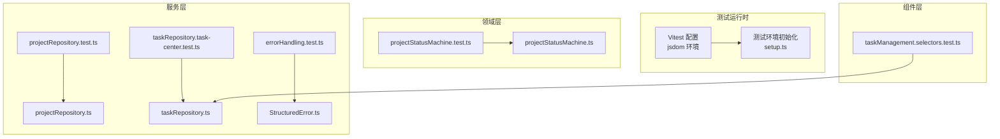
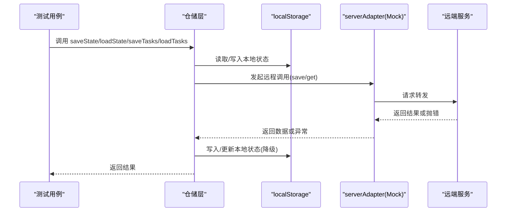
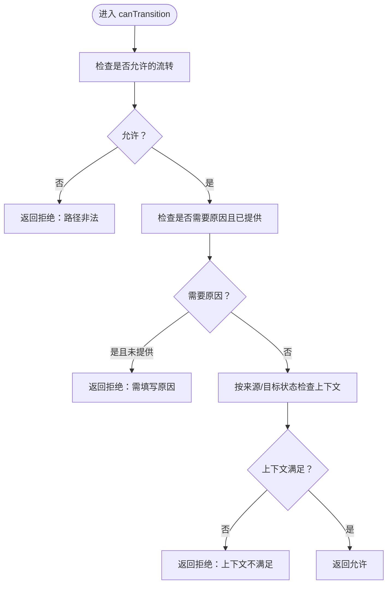
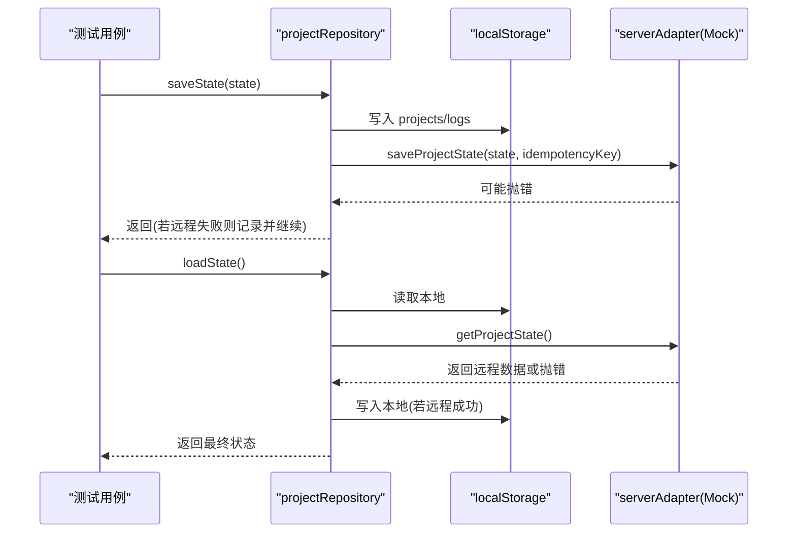
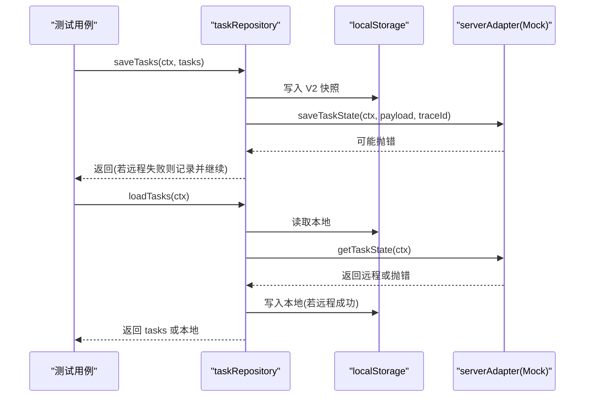
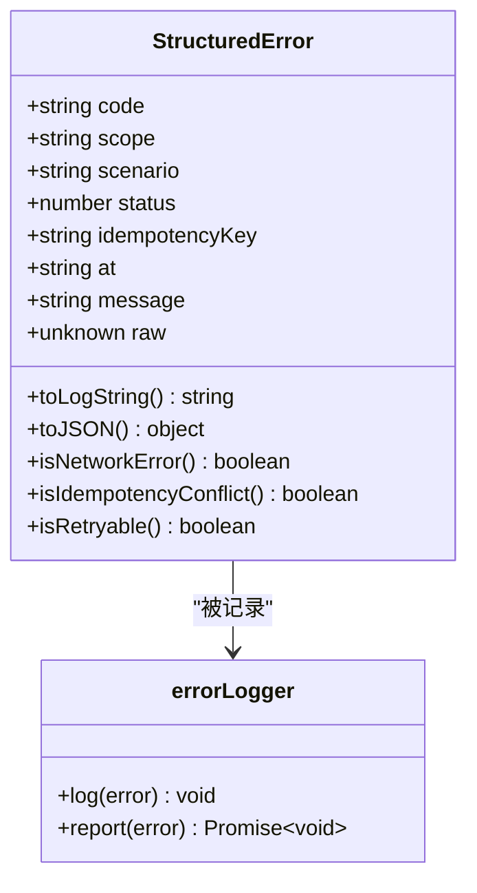
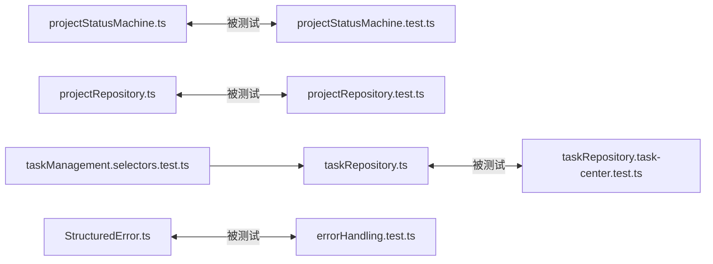

# 测试策略

<cite>
**本文引用的文件**
- [vitest.config.ts](file://vitest.config.ts)
- [package.json](file://package.json)
- [.github/workflows/ci.yml](file://.github/workflows/ci.yml)
- [src/test/setup.ts](file://src/test/setup.ts)
- [src/domain/projectStatusMachine.ts](file://src/domain/projectStatusMachine.ts)
- [src/domain/__tests__/projectStatusMachine.test.ts](file://src/domain/__tests__/projectStatusMachine.test.ts)
- [src/services/repositories/projectRepository.ts](file://src/services/repositories/projectRepository.ts)
- [src/services/__tests__/projectRepository.test.ts](file://src/services/__tests__/projectRepository.test.ts)
- [src/services/repositories/taskRepository.ts](file://src/services/repositories/taskRepository.ts)
- [src/services/__tests__/taskRepository.task-center.test.ts](file://src/services/__tests__/taskRepository.task-center.test.ts)
- [src/services/errors/StructuredError.ts](file://src/services/errors/StructuredError.ts)
- [src/services/__tests__/errorHandling.test.ts](file://src/services/__tests__/errorHandling.test.ts)
- [src/components/task/__tests__/taskManagement.selectors.test.ts](file://src/components/task/__tests__/taskManagement.selectors.test.ts)
</cite>

## 目录

1. [简介](#简介)
2. [项目结构](#项目结构)
3. [核心组件](#核心组件)
4. [架构总览](#架构总览)
5. [详细组件分析](#详细组件分析)
6. [依赖关系分析](#依赖关系分析)
7. [性能考量](#性能考量)
8. [故障排查指南](#故障排查指南)
9. [结论](#结论)
10. [附录](#附录)

## 简介

本测试策略文档面向 CodeBuddy 项目，系统化阐述单元测试、集成测试与端到端测试的设计原则与实施方法；重点覆盖状态机测试、仓储层测试、错误处理测试与选择器测试；明确测试覆盖率与质量门禁；提供 Vitest 配置、测试环境与 CI/CD 集成指南，并总结最佳实践与常见问题。

## 项目结构

- 测试框架采用 Vitest，DOM 环境为 jsdom，全局启用测试工具能力，测试入口位于 src/test/setup.ts。
- 单元测试集中在各模块的 **tests** 目录，按功能域划分：领域层（状态机）、服务层（仓储与错误模型）、组件层（选择器）。
- 集成测试通过 Mock 服务器适配器与本地存储进行，覆盖远程调用降级、幂等键与审计日志等场景。
- CI 使用 GitHub Actions，包含代码质量门禁（ESLint 核心链路校验、文档齐备性、类型与构建）。

图表来源

- [vitest.config.ts:1-20](file://vitest.config.ts#L1-L20)
- [src/test/setup.ts:1-2](file://src/test/setup.ts#L1-L2)
- [src/domain/projectStatusMachine.ts:1-164](file://src/domain/projectStatusMachine.ts#L1-L164)
- [src/services/repositories/projectRepository.ts:1-90](file://src/services/repositories/projectRepository.ts#L1-L90)
- [src/services/repositories/taskRepository.ts:1-318](file://src/services/repositories/taskRepository.ts#L1-L318)
- [src/services/errors/StructuredError.ts:1-195](file://src/services/errors/StructuredError.ts#L1-L195)
- [src/components/task/**tests**/taskManagement.selectors.test.ts:1-102](file://src/components/task/__tests__/taskManagement.selectors.test.ts#L1-L102)

章节来源

- [vitest.config.ts:1-20](file://vitest.config.ts#L1-L20)
- [package.json:1-48](file://package.json#L1-L48)
- [.github/workflows/ci.yml:1-39](file://.github/workflows/ci.yml#L1-L39)

## 核心组件

- 状态机与守卫：项目状态机定义了状态集合、允许的流转、进入钩子与守卫条件，配套测试覆盖守卫判断、可用流转与原因要求。
- 仓储层：项目与任务仓储负责本地持久化（localStorage）与远程同步，包含降级逻辑、幂等键与审计日志。
- 错误模型：统一结构化错误，提供分类、序列化与可追踪日志字符串，配套测试验证错误构造与分类。
- 选择器：任务管理选择器对任务进行统计、筛选、排序与分页，测试覆盖关键指标与边界行为。

章节来源

- [src/domain/projectStatusMachine.ts:1-164](file://src/domain/projectStatusMachine.ts#L1-L164)
- [src/services/repositories/projectRepository.ts:1-90](file://src/services/repositories/projectRepository.ts#L1-L90)
- [src/services/repositories/taskRepository.ts:1-318](file://src/services/repositories/taskRepository.ts#L1-L318)
- [src/services/errors/StructuredError.ts:1-195](file://src/services/errors/StructuredError.ts#L1-L195)
- [src/components/task/**tests**/taskManagement.selectors.test.ts:1-102](file://src/components/task/__tests__/taskManagement.selectors.test.ts#L1-L102)

## 架构总览

测试架构围绕“本地存储 + 服务器适配器”双通道展开，远程失败时自动降级至本地缓存，保证可用性与一致性。Mock 服务器适配器用于隔离外部依赖，确保测试稳定与可重复。

图表来源

- [src/services/repositories/projectRepository.ts:54-88](file://src/services/repositories/projectRepository.ts#L54-L88)
- [src/services/repositories/taskRepository.ts:142-169](file://src/services/repositories/taskRepository.ts#L142-L169)
- [src/services/**tests**/taskRepository.task-center.test.ts:11-14](file://src/services/__tests__/taskRepository.task-center.test.ts#L11-L14)

## 详细组件分析

### 状态机测试（项目状态流转）

- 测试目标
  - 验证守卫条件：容器、审批、里程碑、任务树、标准绑定、关键任务、验收通过/反馈、整改闭环、结算完成等。
  - 验证可用流转：不同状态下的可选目标状态与标签，以及需要原因的流转标记。
  - 验证原因解析：非法流转与需要原因的守卫码。
- 关键点
  - 使用上下文对象驱动 canTransition 的多分支判断。
  - 使用 requiresReason 标记与守卫码区分“需要原因”与“路径非法”。

图表来源

- [src/domain/projectStatusMachine.ts:105-163](file://src/domain/projectStatusMachine.ts#L105-L163)

章节来源

- [src/domain/projectStatusMachine.ts:1-164](file://src/domain/projectStatusMachine.ts#L1-L164)
- [src/domain/**tests**/projectStatusMachine.test.ts:1-125](file://src/domain/__tests__/projectStatusMachine.test.ts#L1-L125)

### 仓储层测试（项目与任务）

- 项目仓储
  - 本地持久化：保存/加载项目列表与状态日志，键名固定，版本化存储。
  - 远程同步：优先远程，失败则降级本地；保存时同时写入本地与远程。
  - 幂等性：当前实现不支持幂等键参数，幂等键仅在远程调用中使用。
- 任务仓储
  - 本地快照：V2 结构写入，兼容旧版数组快照读取。
  - 操作日志：按任务维度维护最近 N 条操作日志。
  - 审计事件：批量追加模板审计事件，异步上报并忽略失败。
  - Mock 策略：通过 hoisted 与 vi.mock 对 serverAdapter 进行模块级 Mock，隔离网络依赖。

图表来源

- [src/services/repositories/projectRepository.ts:54-88](file://src/services/repositories/projectRepository.ts#L54-L88)
- [src/services/**tests**/projectRepository.test.ts:55-105](file://src/services/__tests__/projectRepository.test.ts#L55-L105)

图表来源

- [src/services/repositories/taskRepository.ts:142-169](file://src/services/repositories/taskRepository.ts#L142-L169)
- [src/services/**tests**/taskRepository.task-center.test.ts:45-70](file://src/services/__tests__/taskRepository.task-center.test.ts#L45-L70)

章节来源

- [src/services/repositories/projectRepository.ts:1-90](file://src/services/repositories/projectRepository.ts#L1-L90)
- [src/services/**tests**/projectRepository.test.ts:1-122](file://src/services/__tests__/projectRepository.test.ts#L1-L122)
- [src/services/repositories/taskRepository.ts:1-318](file://src/services/repositories/taskRepository.ts#L1-L318)
- [src/services/**tests**/taskRepository.task-center.test.ts:1-99](file://src/services/__tests__/taskRepository.task-center.test.ts#L1-L99)

### 错误处理测试（统一结构化错误）

- 测试目标
  - 验证错误模型字段完整性与可追踪性。
  - 验证错误分类（网络、业务、幂等冲突）与可重试性。
  - 验证日志字符串格式与关键字段。
- 关键点
  - 幂等冲突需同时满足错误码与存在幂等键。
  - 日志字符串包含作用域、场景、错误码、消息、HTTP 状态与幂等键。

图表来源

- [src/services/errors/StructuredError.ts:27-127](file://src/services/errors/StructuredError.ts#L27-L127)

章节来源

- [src/services/errors/StructuredError.ts:1-195](file://src/services/errors/StructuredError.ts#L1-L195)
- [src/services/**tests**/errorHandling.test.ts:1-128](file://src/services/__tests__/errorHandling.test.ts#L1-L128)

### 选择器测试（任务管理）

- 测试目标
  - 关键指标统计：总数、待分配、执行中、待提交、SLA 警告/逾期、阻塞、来源分布。
  - 高级筛选：阻塞与来源联合过滤。
  - 排序：风险等级从高到低。
  - 处理流水线：筛选+排序+分页单管道处理。
  - 分页边界：越界页码回落到有效页。
- 关键点
  - 使用构建函数统一构造任务样本，减少重复与偏差。
  - 断言关注输出顺序、数量与聚合值。

章节来源

- [src/components/task/**tests**/taskManagement.selectors.test.ts:1-102](file://src/components/task/__tests__/taskManagement.selectors.test.ts#L1-L102)

## 依赖关系分析

- 测试耦合
  - 状态机测试直接依赖领域模型，耦合度低，内聚性强。
  - 仓储测试通过 Mock serverAdapter 与 localStorage，避免真实网络与数据库依赖。
  - 错误处理测试独立于业务流程，仅依赖错误模型与日志器。
  - 选择器测试依赖组件类型与选择器函数，耦合度低。
- 外部依赖
  - Vitest 提供测试运行时与断言库。
  - jsdom 提供 DOM API 与事件循环。
  - @testing-library/jest-dom 提供 DOM 断言扩展。
- 潜在环路
  - 测试文件之间无直接导入环路；跨模块测试通过被测模块接口访问，未见循环依赖。

图表来源

- [src/domain/projectStatusMachine.ts:1-164](file://src/domain/projectStatusMachine.ts#L1-L164)
- [src/services/repositories/projectRepository.ts:1-90](file://src/services/repositories/projectRepository.ts#L1-L90)
- [src/services/repositories/taskRepository.ts:1-318](file://src/services/repositories/taskRepository.ts#L1-L318)
- [src/services/errors/StructuredError.ts:1-195](file://src/services/errors/StructuredError.ts#L1-L195)
- [src/components/task/**tests**/taskManagement.selectors.test.ts:1-102](file://src/components/task/__tests__/taskManagement.selectors.test.ts#L1-L102)

## 性能考量

- 测试性能
  - 使用 jsdom 减少浏览器启动开销；避免在单元测试中引入真实网络请求。
  - Mock serverAdapter 与 localStorage，避免磁盘 IO 与网络抖动影响测试稳定性。
- 覆盖率
  - Vitest 使用 v8 提供文本、JSON、HTML 报告；建议在 CI 中开启覆盖率收集与阈值门禁。
- 并行与隔离
  - 测试间尽量无共享状态；必要时使用 beforeEach 清理 localStorage 与 vi 清理。

## 故障排查指南

- 常见问题
  - 状态机断言失败：核对守卫上下文字段与原因参数是否正确传递。
  - 仓储读写异常：检查 localStorage 是否可写、键名是否一致、schema 版本是否兼容。
  - Mock 未生效：确认 vi.mock 在 import 之前 hoist 并注入；避免在被测模块中直接导入真实实现。
  - 错误分类误判：幂等冲突必须同时满足错误码与幂等键存在。
- 排查步骤
  - 启用 Vitest UI 查看失败用例与堆栈。
  - 打印关键中间态（如本地存储内容、serverAdapter 调用次数与参数）。
  - 在 CI 中开启覆盖率报告，定位未覆盖分支。

章节来源

- [src/services/**tests**/taskRepository.task-center.test.ts:45-51](file://src/services/__tests__/taskRepository.task-center.test.ts#L45-L51)
- [src/services/**tests**/errorHandling.test.ts:94-106](file://src/services/__tests__/errorHandling.test.ts#L94-L106)

## 结论

本测试策略以状态机、仓储与错误模型为核心，辅以选择器与 Mock 策略，形成覆盖全链路的测试体系。通过明确的断言模式、守卫条件测试与降级路径验证，保障业务正确性与系统韧性。建议在 CI 中强制覆盖率与质量门禁，持续提升测试质量与交付可靠性。

## 附录

### 测试用例编写规范

- 命名规范：describe 使用模块名，it 使用“应...”句式，清晰表达期望。
- 上下文构造：使用工厂函数或辅助构造器统一生成测试数据，减少重复。
- 边界与异常：覆盖空数据、越界页码、缺失原因、远程失败等边界场景。
- 断言模式：优先断言结果与副作用（如 localStorage 内容、serverAdapter 调用），避免断言语义模糊。

### Mock 策略

- 模块级 Mock：通过 vi.mock 与 hoisted 注入，确保被测模块导入的是 Mock 实现。
- 服务器适配器：为 save/get/appendAuditLog 等方法分别设置成功与失败场景。
- 本地存储：在 beforeEach 中清理 localStorage，避免跨用例污染。

### 断言模式

- 行为断言：断言函数调用次数、参数结构与返回值。
- 状态断言：断言本地存储键值、schema 版本与日志条数上限。
- 错误断言：断言错误码、作用域、场景与日志字符串格式。

### 集成测试方案

- 组件测试：针对选择器与 UI 逻辑，结合 jsdom 与 @testing-library/react。
- 服务层测试：通过 Mock serverAdapter 与 localStorage，验证远程降级与幂等键。
- 端到端测试：建议在 Playwright CLI 录制的基础上补充关键业务流程回归。

### 状态机测试特殊考虑

- 状态转换验证：覆盖所有允许路径与非法路径，断言守卫原因。
- 守卫条件测试：逐项验证上下文字段对流转的影响。
- 边界情况：越界页码、空日志、缺失原因、阻塞与来源联合过滤。

### 仓储层测试重点

- 数据持久化：验证键名、schema 版本与序列化格式。
- 缓存一致性：远程成功后本地写入，远程失败时降级本地。
- 错误场景：捕获并记录异常，保证流程不中断。

### 测试覆盖率与质量门禁

- 覆盖率：建议在 Vitest 中开启 v8 报告并在 CI 中设置阈值门禁。
- 质量门禁：ESLint 核心链路校验、文档齐备性、类型与构建通过。

### 测试工具配置指南

- Vitest 配置：启用 jsdom、全局测试工具、setupFiles 与覆盖率。
- 测试环境：通过 setup.ts 引入 jest-dom 扩展。
- CI/CD 集成：GitHub Actions 中执行 lint、文档校验、构建与测试脚本。

章节来源

- [vitest.config.ts:6-18](file://vitest.config.ts#L6-L18)
- [src/test/setup.ts:1-2](file://src/test/setup.ts#L1-L2)
- [package.json:13-15](file://package.json#L13-L15)
- [.github/workflows/ci.yml:26-38](file://.github/workflows/ci.yml#L26-L38)
