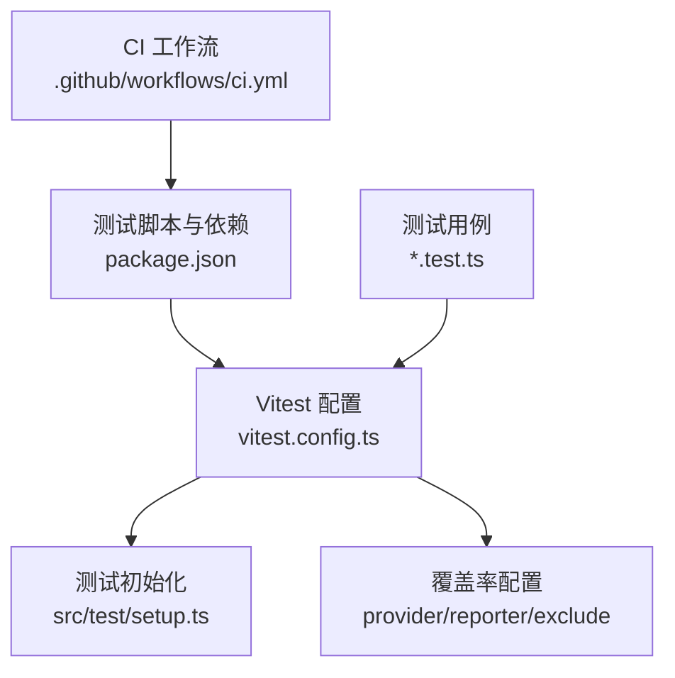
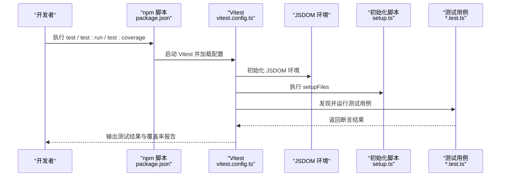
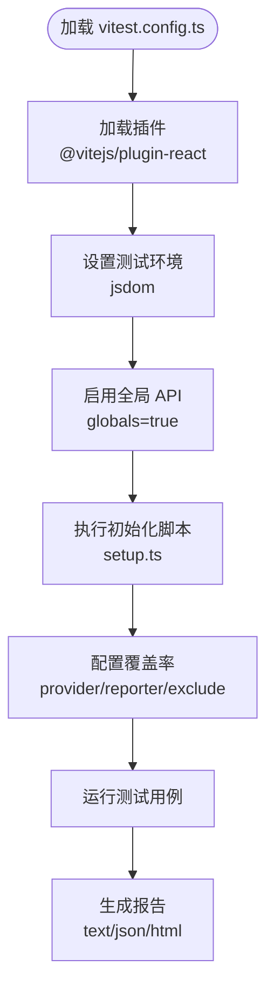
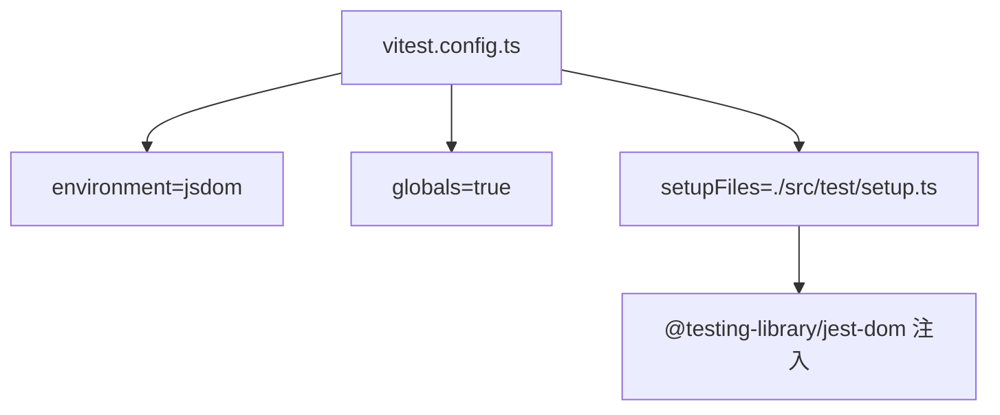
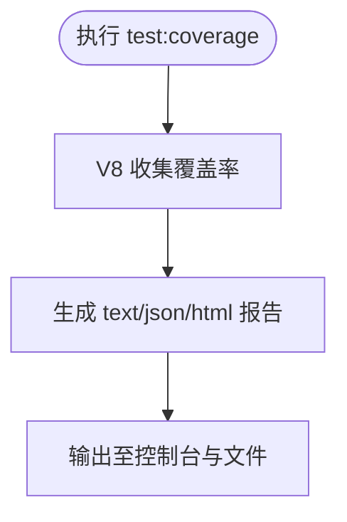
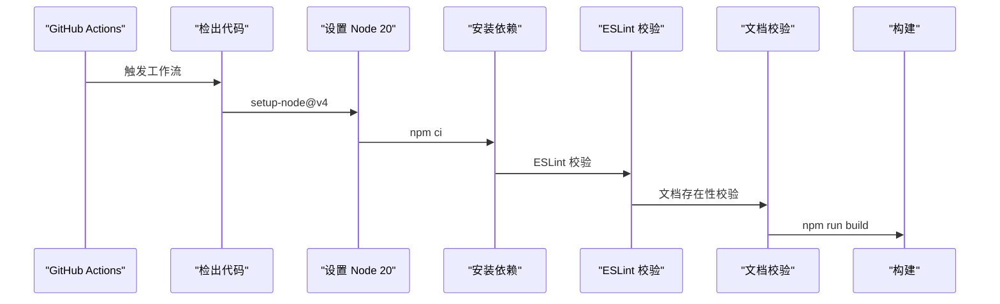
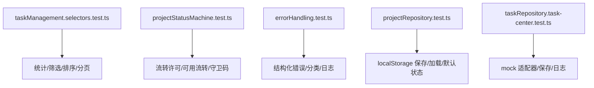
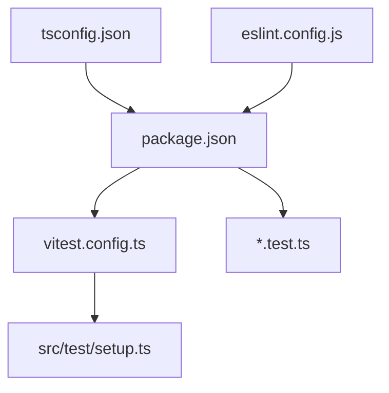

# 测试配置与工具

<cite>
**本文引用的文件**
- [vitest.config.ts](file://vitest.config.ts)
- [package.json](file://package.json)
- [.github/workflows/ci.yml](file://.github/workflows/ci.yml)
- [src/test/setup.ts](file://src/test/setup.ts)
- [src/components/task/__tests__/taskManagement.selectors.test.ts](file://src/components/task/__tests__/taskManagement.selectors.test.ts)
- [src/domain/__tests__/projectStatusMachine.test.ts](file://src/domain/__tests__/projectStatusMachine.test.ts)
- [src/services/__tests__/errorHandling.test.ts](file://src/services/__tests__/errorHandling.test.ts)
- [src/services/__tests__/projectRepository.test.ts](file://src/services/__tests__/projectRepository.test.ts)
- [src/services/__tests__/taskRepository.task-center.test.ts](file://src/services/__tests__/taskRepository.task-center.test.ts)
- [eslint.config.js](file://eslint.config.js)
- [tsconfig.json](file://tsconfig.json)
</cite>

## 目录

1. [简介](#简介)
2. [项目结构](#项目结构)
3. [核心组件](#核心组件)
4. [架构总览](#架构总览)
5. [详细组件分析](#详细组件分析)
6. [依赖关系分析](#依赖关系分析)
7. [性能考量](#性能考量)
8. [故障排查指南](#故障排查指南)
9. [结论](#结论)
10. [附录](#附录)

## 简介

本文件面向 CodeBuddy 项目的测试体系，系统性说明 Vitest 测试框架的配置与使用，涵盖测试环境搭建（JSDOM、全局设置、测试工具初始化）、覆盖率配置与报告、CI/CD 集成（GitHub Actions）、调试与性能分析建议，以及版本兼容性与升级要点。文档同时结合仓库内现有测试样例，帮助开发者快速上手并规范化测试实践。

## 项目结构

围绕测试的关键文件与目录如下：

- 测试运行与配置
  - vitest.config.ts：Vitest 主配置，含环境、全局变量、JSDOM 设置、覆盖率与排除规则、插件等
  - package.json：脚本命令（运行测试、覆盖率）、依赖（Vitest、JSDOM、@testing-library 等）
  - src/test/setup.ts：测试初始化入口，引入 @testing-library/jest-dom 扩展断言能力
- 测试用例
  - src/components/task/**tests**/taskManagement.selectors.test.ts
  - src/domain/**tests**/projectStatusMachine.test.ts
  - src/services/**tests**/errorHandling.test.ts
  - src/services/**tests**/projectRepository.test.ts
  - src/services/**tests**/taskRepository.task-center.test.ts
- CI/CD
  - .github/workflows/ci.yml：质量门禁流水线（Node 版本、依赖安装、ESLint、类型与构建）

**图示来源**

- [vitest.config.ts:1-20](file://vitest.config.ts#L1-L20)
- [src/test/setup.ts:1-2](file://src/test/setup.ts#L1-L2)
- [package.json:13-16](file://package.json#L13-L16)
- [.github/workflows/ci.yml:1-39](file://.github/workflows/ci.yml#L1-L39)

**章节来源**

- [vitest.config.ts:1-20](file://vitest.config.ts#L1-L20)
- [package.json:1-48](file://package.json#L1-L48)
- [src/test/setup.ts:1-2](file://src/test/setup.ts#L1-L2)
- [.github/workflows/ci.yml:1-39](file://.github/workflows/ci.yml#L1-L39)

## 核心组件

- 测试运行器与环境
  - 使用 Vitest 作为测试运行器，启用 JSDOM 作为浏览器仿真环境，提供 DOM API 与事件模拟能力
  - 开启全局断言与辅助函数，简化测试书写
- 测试初始化
  - 通过 setupFiles 引入 @testing-library/jest-dom，提供 matchesSelector、toHaveAttribute 等 DOM 断言
- 覆盖率
  - 使用 V8 提供者，输出文本、JSON、HTML 报告；排除 node_modules 与 src/test 目录
- 脚本与依赖
  - 提供 test、test:run、test:coverage 三个常用脚本；依赖包含 Vitest、JSDOM、@testing-library/react 与 jest-dom

**章节来源**

- [vitest.config.ts:6-18](file://vitest.config.ts#L6-L18)
- [src/test/setup.ts:1-2](file://src/test/setup.ts#L1-L2)
- [package.json:13-16](file://package.json#L13-L16)
- [package.json:22-46](file://package.json#L22-L46)

## 架构总览

下图展示测试运行的整体流程：开发者执行 npm 脚本 → Vitest 读取配置 → 初始化 JSDOM 与 setup 文件 → 运行测试用例 → 生成覆盖率报告。

**图示来源**

- [package.json:13-16](file://package.json#L13-L16)
- [vitest.config.ts:6-18](file://vitest.config.ts#L6-L18)
- [src/test/setup.ts:1-2](file://src/test/setup.ts#L1-L2)

## 详细组件分析

### Vitest 配置详解

- 插件与环境
  - 插件：集成 @vitejs/plugin-react，使测试可解析 JSX/TSX
  - 环境：environment=jsdom，提供浏览器常见 API（document、window、Event 等）
- 全局与初始化
  - globals=true，允许直接使用 describe、it、expect 等顶层 API
  - setupFiles 指向 src/test/setup.ts，用于注入 @testing-library/jest-dom
- 覆盖率
  - provider=v8，基于 V8 引擎收集覆盖率
  - reporter=text/json/html，便于控制台阅读、CI 可视化与 HTML 报告
  - exclude 排除 node_modules 与 src/test，避免污染覆盖率

**图示来源**

- [vitest.config.ts:5-19](file://vitest.config.ts#L5-L19)

**章节来源**

- [vitest.config.ts:1-20](file://vitest.config.ts#L1-L20)

### 测试环境搭建与初始化

- JSDOM 配置
  - 在 vitest.config.ts 中通过 environment='jsdom' 启用，满足 DOM 相关测试需求
- 全局设置
  - globals=true，无需手动导入即可使用顶层 API
- 初始化脚本
  - setup.ts 引入 @testing-library/jest-dom，增强断言能力（如屏幕查询、可见性判断等）

**图示来源**

- [vitest.config.ts:7-9](file://vitest.config.ts#L7-L9)
- [src/test/setup.ts:1-2](file://src/test/setup.ts#L1-L2)

**章节来源**

- [vitest.config.ts:6-10](file://vitest.config.ts#L6-L10)
- [src/test/setup.ts:1-2](file://src/test/setup.ts#L1-L2)

### 覆盖率工具配置与使用

- 提供者与报告
  - provider=v8，稳定且性能良好
  - reporter 包含 text、json、html，适合本地与 CI 场景
- 排除规则
  - 排除 node_modules 与 src/test，聚焦业务代码覆盖率
- 使用方式
  - 通过 npm 脚本 test:coverage 触发覆盖率收集与输出

**图示来源**

- [vitest.config.ts:10-17](file://vitest.config.ts#L10-L17)
- [package.json:15](file://package.json#L15)

**章节来源**

- [vitest.config.ts:10-17](file://vitest.config.ts#L10-L17)
- [package.json:15](file://package.json#L15)

### CI/CD 集成指南（GitHub Actions）

- 工作流概览
  - 触发：拉取请求与推送至 main 分支
  - 步骤：检出代码、设置 Node（版本 20）、安装依赖、ESLint 校验、文档校验、构建
- 与测试的关系
  - 当前工作流未包含 Vitest 测试步骤；建议在质量门禁阶段增加测试与覆盖率检查，以提升质量门槛

**图示来源**

- [.github/workflows/ci.yml:1-39](file://.github/workflows/ci.yml#L1-L39)

**章节来源**

- [.github/workflows/ci.yml:1-39](file://.github/workflows/ci.yml#L1-L39)

### 测试调试工具与方法

- Vitest UI
  - 项目包含 @vitest/ui 依赖，可在本地可视化运行与调试测试
- 断点调试
  - 在测试文件中使用 debugger 语句或 IDE 断点进行断点调试
- 日志输出
  - 使用 console.log/console.error 输出中间状态，便于定位问题
- 性能分析
  - 结合 Node 的 --inspect-brk 参数与 Vitest 的调试模式，对耗时测试进行性能剖析

**章节来源**

- [package.json:31](file://package.json#L31)

### 测试用例示例与最佳实践

- 选择器与统计逻辑
  - 通过构造任务数据，验证统计、筛选、排序与分页的组合处理是否符合预期
- 状态机转换
  - 验证不同上下文下的流转许可、可用流转集合与守卫码解析
- 错误模型
  - 验证结构化错误字段、分类判断与日志格式
- 仓储层
  - 验证本地存储的保存/加载、默认状态与幂等特性（当前实现不支持幂等键参数）
- 任务中心仓库
  - 使用 vi.mock 对服务适配器进行模拟，验证保存/加载与审计日志写入行为

**图示来源**

- [src/components/task/**tests**/taskManagement.selectors.test.ts:1-102](file://src/components/task/__tests__/taskManagement.selectors.test.ts#L1-L102)
- [src/domain/**tests**/projectStatusMachine.test.ts:1-125](file://src/domain/__tests__/projectStatusMachine.test.ts#L1-L125)
- [src/services/**tests**/errorHandling.test.ts:1-128](file://src/services/__tests__/errorHandling.test.ts#L1-L128)
- [src/services/**tests**/projectRepository.test.ts:1-122](file://src/services/__tests__/projectRepository.test.ts#L1-L122)
- [src/services/**tests**/taskRepository.task-center.test.ts:1-99](file://src/services/__tests__/taskRepository.task-center.test.ts#L1-L99)

**章节来源**

- [src/components/task/**tests**/taskManagement.selectors.test.ts:1-102](file://src/components/task/__tests__/taskManagement.selectors.test.ts#L1-L102)
- [src/domain/**tests**/projectStatusMachine.test.ts:1-125](file://src/domain/__tests__/projectStatusMachine.test.ts#L1-L125)
- [src/services/**tests**/errorHandling.test.ts:1-128](file://src/services/__tests__/errorHandling.test.ts#L1-L128)
- [src/services/**tests**/projectRepository.test.ts:1-122](file://src/services/__tests__/projectRepository.test.ts#L1-L122)
- [src/services/**tests**/taskRepository.task-center.test.ts:1-99](file://src/services/__tests__/taskRepository.task-center.test.ts#L1-L99)

## 依赖关系分析

- 测试运行链路
  - package.json 中的脚本驱动 Vitest；Vitest 读取 vitest.config.ts；setup.ts 注入 jest-dom；测试用例位于各模块 **tests** 目录
- 类型与规范
  - tsconfig.json 通过 references 组织应用与 Node 配置；eslint.config.js 定义语言规则与推荐配置

**图示来源**

- [package.json:13-16](file://package.json#L13-L16)
- [vitest.config.ts:5-19](file://vitest.config.ts#L5-L19)
- [src/test/setup.ts:1-2](file://src/test/setup.ts#L1-L2)
- [tsconfig.json:1-8](file://tsconfig.json#L1-L8)
- [eslint.config.js:1-24](file://eslint.config.js#L1-L24)

**章节来源**

- [package.json:1-48](file://package.json#L1-L48)
- [vitest.config.ts:1-20](file://vitest.config.ts#L1-L20)
- [src/test/setup.ts:1-2](file://src/test/setup.ts#L1-L2)
- [tsconfig.json:1-8](file://tsconfig.json#L1-L8)
- [eslint.config.js:1-24](file://eslint.config.js#L1-L24)

## 性能考量

- 覆盖率收集
  - V8 提供者性能稳定，建议在本地开启 text 报告快速反馈，CI 使用 html/json 便于归档与可视化
- 测试组织
  - 将大型测试拆分为更小的 describe/it，有助于并行执行与更快定位失败点
- 排除策略
  - 通过 exclude 精准控制覆盖率范围，避免第三方与测试文件干扰

[本节为通用指导，无需列出具体文件来源]

## 故障排查指南

- 环境与初始化
  - 若出现 DOM API 未定义，请确认 vitest.config.ts 的 environment 是否为 jsdom，setup.ts 是否被正确加载
- 覆盖率为空或异常
  - 检查 exclude 规则是否过于宽泛；确认 provider 与 reporter 配置正确
- CI 失败
  - 当前工作流未包含测试步骤，若需强制质量门禁，建议新增测试与覆盖率检查步骤
- 断点与日志
  - 使用 debugger 或 console.\* 输出中间状态；必要时配合 @vitest/ui 查看测试执行详情

**章节来源**

- [vitest.config.ts:6-18](file://vitest.config.ts#L6-L18)
- [.github/workflows/ci.yml:1-39](file://.github/workflows/ci.yml#L1-L39)

## 结论

本项目已具备基于 Vitest 的测试基础设施：JSDOM 环境、全局 API、初始化脚本与覆盖率配置。建议在 CI 中补充测试与覆盖率步骤，并结合现有测试用例模板持续完善核心领域与仓储层的测试覆盖，以提升代码质量与可维护性。

[本节为总结性内容，无需列出具体文件来源]

## 附录

### 版本兼容性与升级指南

- Vitest 与 Node 版本
  - Vitest 依赖声明要求 Node 版本为 ^20.0.0 || ^22.0.0 || >=24.0.0；当前 CI 使用 Node 20，建议保持一致
- 与 Vite 的兼容
  - Vitest peerDependencies 明确要求 vite 版本范围；请确保与当前项目使用的 Vite 版本兼容
- 升级建议
  - 升级前先运行 npm run test:run 与 npm run build，确认无破坏性变更
  - 关注 Vitest 新版本的 runner/spy/snapshot 等子包更新，必要时同步升级

**章节来源**

- [package.json:45](file://package.json#L45)
- [package.json:44](file://package.json#L44)
- [package.json:5149-5206](file://package.json#L5149-L5206)
