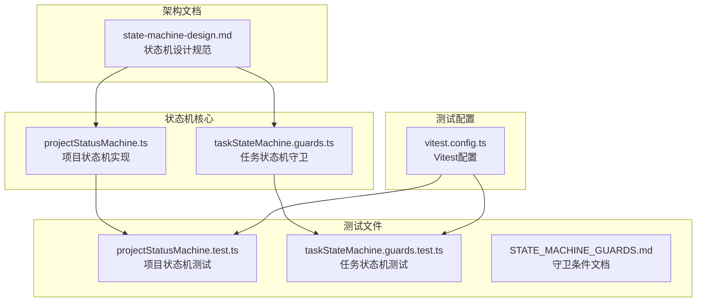
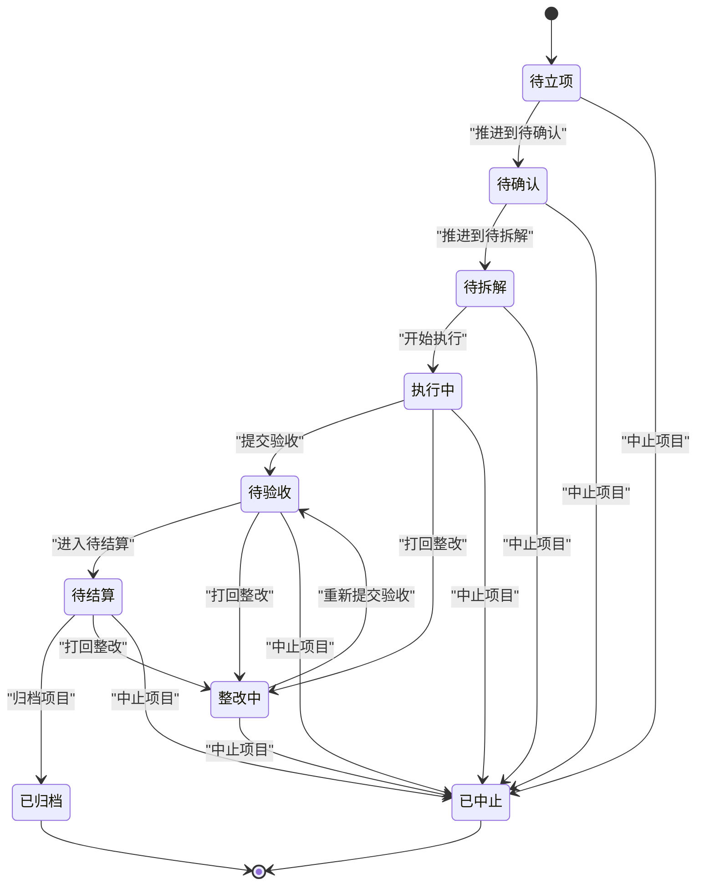
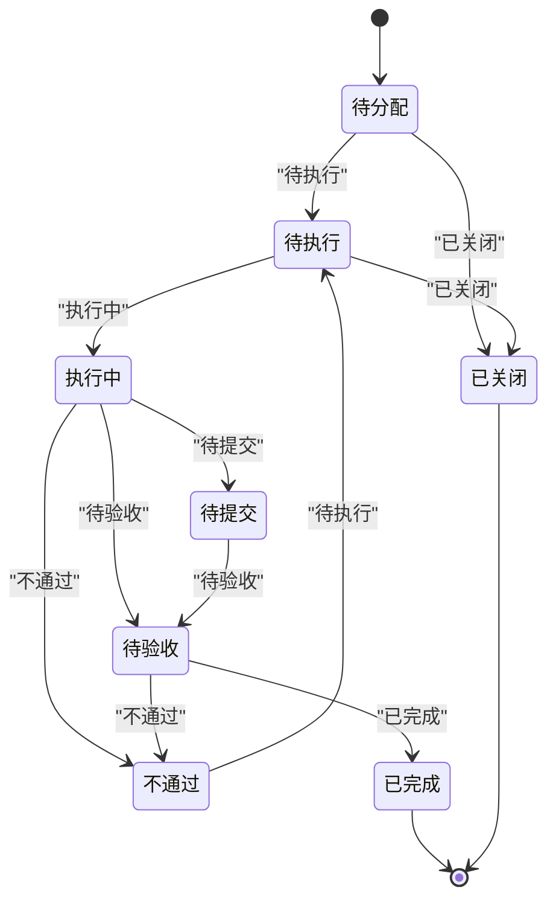
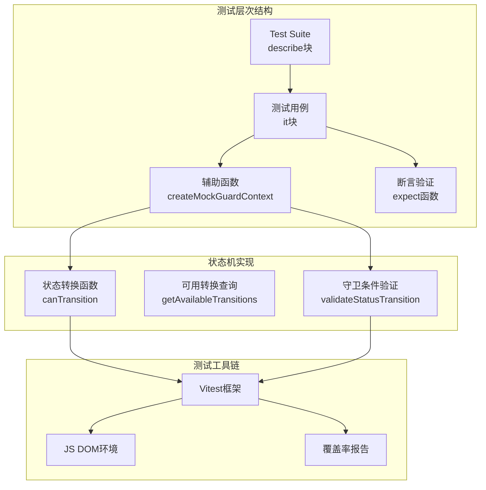
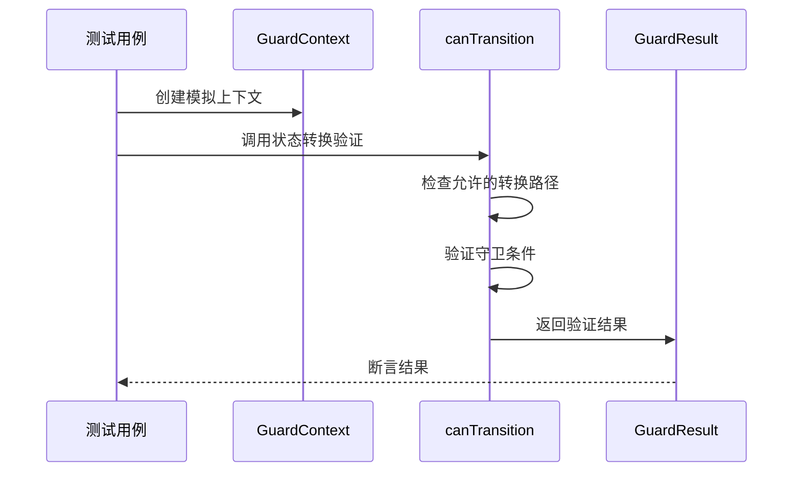
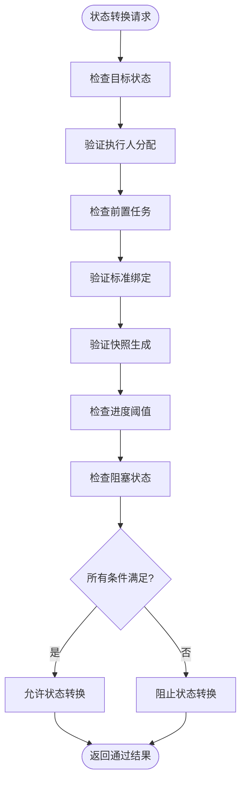
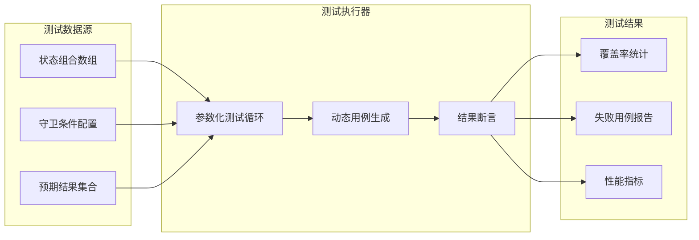
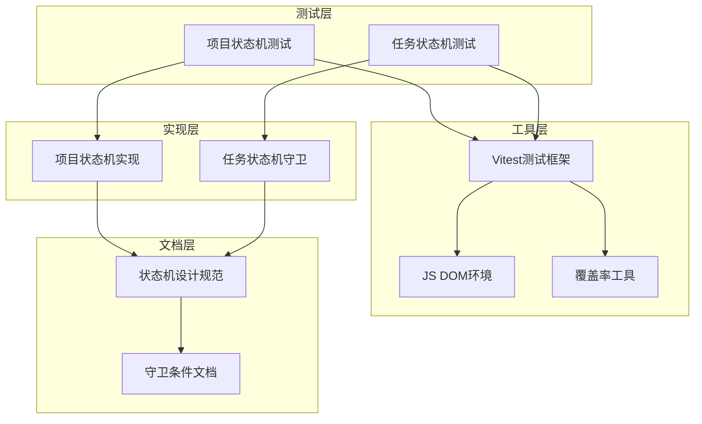
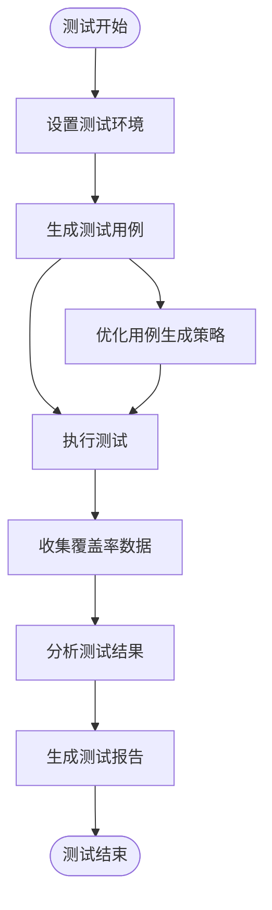

# 状态机测试

<cite>
**本文档引用的文件**
- [projectStatusMachine.ts](file://src/domain/projectStatusMachine.ts)
- [projectStatusMachine.test.ts](file://src/domain/__tests__/projectStatusMachine.test.ts)
- [state-machine-design.md](file://docs/02-architecture/state-machine-design.md)
- [taskStateMachine.guards.ts](file://src/components/task/taskStateMachine.guards.ts)
- [taskStateMachine.guards.test.ts](file://src/components/task/__tests__/taskStateMachine.guards.test.ts)
- [STATE_MACHINE_GUARDS.md](file://src/components/task/STATE_MACHINE_GUARDS.md)
- [vitest.config.ts](file://vitest.config.ts)
</cite>

## 目录

1. [简介](#简介)
2. [项目结构](#项目结构)
3. [核心组件](#核心组件)
4. [架构概览](#架构概览)
5. [详细组件分析](#详细组件分析)
6. [依赖分析](#依赖分析)
7. [性能考虑](#性能考虑)
8. [故障排除指南](#故障排除指南)
9. [结论](#结论)

## 简介

CodeBuddy项目采用统一的状态机设计来管理多个核心业务对象的生命周期，包括项目、任务、采购、验收、资产归档、结算、工单等。状态机测试是确保业务流程正确性和完整性的重要保障。

本文档专注于状态机测试的专门化方法，涵盖状态转换验证、守卫条件测试和边界情况处理。我们将深入解释状态机测试的特殊性和挑战，并提供系统性的测试策略和最佳实践。

## 项目结构

CodeBuddy项目的状态机测试主要分布在以下位置：

**图表来源**

- [projectStatusMachine.ts:1-164](file://src/domain/projectStatusMachine.ts#L1-L164)
- [projectStatusMachine.test.ts:1-125](file://src/domain/__tests__/projectStatusMachine.test.ts#L1-L125)
- [state-machine-design.md:1-896](file://docs/02-architecture/state-machine-design.md#L1-L896)

**章节来源**

- [projectStatusMachine.ts:1-164](file://src/domain/projectStatusMachine.ts#L1-L164)
- [projectStatusMachine.test.ts:1-125](file://src/domain/__tests__/projectStatusMachine.test.ts#L1-L125)
- [state-machine-design.md:1-896](file://docs/02-architecture/state-machine-design.md#L1-L896)

## 核心组件

### 项目状态机

项目状态机定义了项目生命周期的九个状态：待立项、待确认、待拆解、执行中、待验收、整改中、待结算、已归档、已中止。

**图表来源**

- [projectStatusMachine.ts:59-69](file://src/domain/projectStatusMachine.ts#L59-L69)

### 任务状态机

任务状态机提供了更细粒度的状态控制，包括待分配、待执行、执行中、待提交、待验收、不通过、已完成、已关闭等状态。

**图表来源**

- [state-machine-design.md:300-355](file://docs/02-architecture/state-machine-design.md#L300-L355)

**章节来源**

- [projectStatusMachine.ts:1-164](file://src/domain/projectStatusMachine.ts#L1-L164)
- [state-machine-design.md:199-296](file://docs/02-architecture/state-machine-design.md#L199-L296)

## 架构概览

状态机测试架构采用分层设计，确保测试的可维护性和可扩展性：

**图表来源**

- [projectStatusMachine.test.ts:9-124](file://src/domain/__tests__/projectStatusMachine.test.ts#L9-L124)
- [taskStateMachine.guards.test.ts:32-299](file://src/components/task/__tests__/taskStateMachine.guards.test.ts#L32-L299)

## 详细组件分析

### 项目状态机测试策略

#### 状态转换验证

项目状态机测试重点验证状态转换的有效性和守卫条件的正确性：

**图表来源**

- [projectStatusMachine.test.ts:24-78](file://src/domain/__tests__/projectStatusMachine.test.ts#L24-L78)

#### 守卫条件测试

项目状态机实现了复杂的守卫条件，包括：

1. **基本条件验证**：检查状态转换的合法性
2. **业务条件验证**：验证项目容器、审批、里程碑等业务要素
3. **原因验证**：确保需要原因的状态转换都有适当的说明
4. **状态完整性验证**：确认所有状态转换都被正确处理

#### 边界情况处理

测试覆盖了各种边界情况：

- **非法转换路径**：从待立项直接转换到已归档
- **条件缺失**：缺少必要的业务条件
- **原因缺失**：整改中和已中止状态缺少原因
- **状态完整性**：已归档状态不应有可用转换

**章节来源**

- [projectStatusMachine.test.ts:1-125](file://src/domain/__tests__/projectStatusMachine.test.ts#L1-L125)
- [projectStatusMachine.ts:105-163](file://src/domain/projectStatusMachine.ts#L105-L163)

### 任务状态机守卫测试

#### 守卫条件实现

任务状态机守卫条件实现了详细的业务规则：

**图表来源**

- [taskStateMachine.guards.ts:30-47](file://src/components/task/taskStateMachine.guards.ts#L30-L47)

#### 测试覆盖策略

任务状态机测试采用了全面的覆盖策略：

1. **路径覆盖**：测试所有主要状态转换路径
2. **条件覆盖**：验证每个守卫条件的正确性
3. **边界值测试**：测试进度阈值的边界情况
4. **组合测试**：测试多个条件同时满足的情况

**章节来源**

- [taskStateMachine.guards.test.ts:1-299](file://src/components/task/__tests__/taskStateMachine.guards.test.ts#L1-L299)
- [taskStateMachine.guards.ts:1-47](file://src/components/task/taskStateMachine.guards.ts#L1-L47)

### 数据驱动测试方法

#### 参数化测试用例

状态机测试采用了数据驱动的方法，通过参数化测试用例提高测试效率：

**图表来源**

- [projectStatusMachine.test.ts:10-22](file://src/domain/__tests__/projectStatusMachine.test.ts#L10-L22)
- [taskStateMachine.guards.test.ts:5-30](file://src/components/task/__tests__/taskStateMachine.guards.test.ts#L5-L30)

#### 测试用例生成策略

1. **状态空间探索**：系统性地遍历所有可能的状态组合
2. **转换路径覆盖**：确保所有允许的转换路径都被测试
3. **异常状态处理**：验证异常和边界情况的处理
4. **性能基准测试**：监控测试执行时间和覆盖率

**章节来源**

- [projectStatusMachine.test.ts:10-22](file://src/domain/__tests__/projectStatusMachine.test.ts#L10-L22)
- [taskStateMachine.guards.test.ts:5-30](file://src/components/task/__tests__/taskStateMachine.guards.test.ts#L5-L30)

## 依赖分析

状态机测试的依赖关系体现了清晰的分层架构：

**图表来源**

- [vitest.config.ts:4-19](file://vitest.config.ts#L4-L19)
- [state-machine-design.md:1-896](file://docs/02-architecture/state-machine-design.md#L1-L896)

**章节来源**

- [vitest.config.ts:1-20](file://vitest.config.ts#L1-L20)
- [state-machine-design.md:1-896](file://docs/02-architecture/state-machine-design.md#L1-L896)

## 性能考虑

### 测试执行性能

状态机测试在性能方面具有以下特点：

1. **快速执行**：状态机验证逻辑相对简单，测试执行速度快
2. **内存效率**：测试用例使用轻量级数据结构，内存占用低
3. **并行执行**：Vitest支持测试用例的并行执行，提高整体测试效率

### 覆盖率优化

**图表来源**

- [vitest.config.ts:10-17](file://vitest.config.ts#L10-L17)

## 故障排除指南

### 常见测试问题

#### 状态转换失败

当状态转换验证失败时，通常有以下原因：

1. **守卫条件不满足**：检查相关的业务条件是否满足
2. **状态上下文错误**：验证GuardContext的配置是否正确
3. **转换路径不合法**：确认状态转换是否在允许的路径中

#### 测试用例失败

针对测试用例失败的排查步骤：

1. **检查测试数据**：验证测试用例中使用的数据是否正确
2. **查看断言信息**：仔细阅读失败的断言信息
3. **调试验证逻辑**：逐步调试状态转换验证逻辑

### 调试技巧

1. **使用测试钩子**：利用Vitest的测试钩子进行调试
2. **打印中间状态**：在关键节点添加日志输出
3. **隔离测试**：将问题缩小到最小可重现的测试用例

**章节来源**

- [projectStatusMachine.test.ts:24-78](file://src/domain/__tests__/projectStatusMachine.test.ts#L24-L78)
- [taskStateMachine.guards.test.ts:32-299](file://src/components/task/__tests__/taskStateMachine.guards.test.ts#L32-L299)

## 结论

CodeBuddy项目的状态机测试体系展现了现代前端状态机测试的最佳实践。通过系统性的测试策略、全面的覆盖范围和严格的验证机制，确保了业务流程的正确性和可靠性。

### 主要成就

1. **完整的测试覆盖**：涵盖了所有主要状态转换路径和边界情况
2. **清晰的测试结构**：采用分层设计，便于维护和扩展
3. **高效的测试执行**：利用参数化测试和并行执行提高效率
4. **完善的文档支持**：详细的文档和注释便于理解和维护

### 未来改进方向

1. **增强并发测试**：增加对并发状态转换场景的测试
2. **扩展异常处理**：增加对异常状态和错误恢复的测试
3. **性能监控**：增加测试执行性能的监控和分析
4. **自动化回归**：建立自动化回归测试流程

通过持续改进和优化，CodeBuddy项目的状态机测试将继续为项目的稳定性和可靠性提供强有力的保障。
