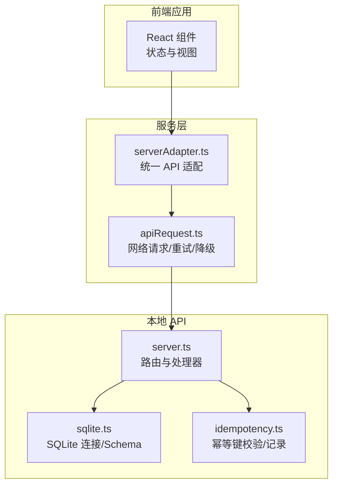
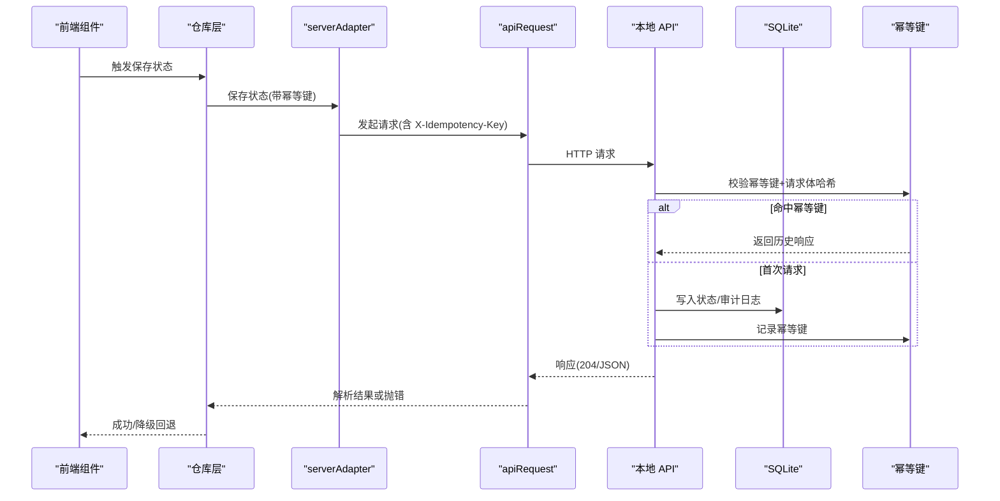
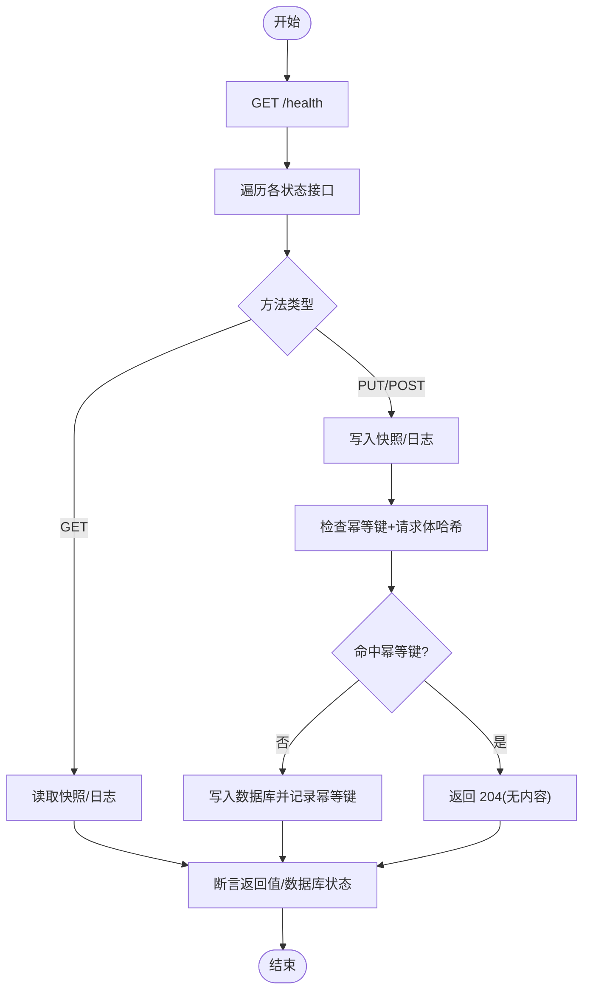
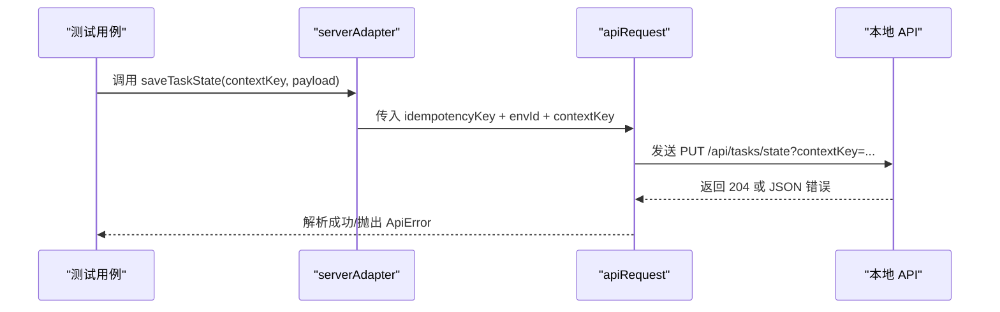
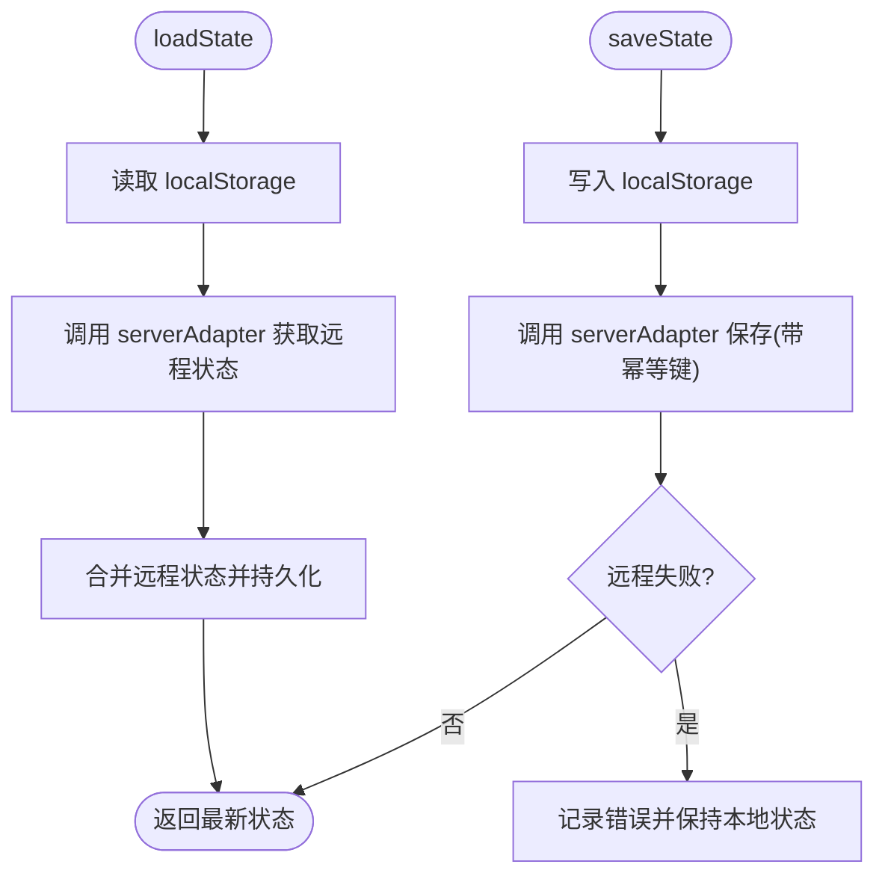
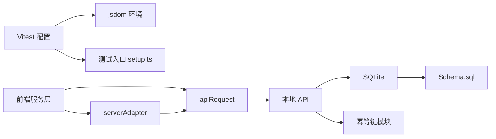

# 集成测试

<cite>
**本文引用的文件**
- [vite.config.ts](file://vite.config.ts)
- [vitest.config.ts](file://vitest.config.ts)
- [package.json](file://package.json)
- [src/test/setup.ts](file://src/test/setup.ts)
- [src/services/api/client.ts](file://src/services/api/client.ts)
- [src/services/api/serverAdapter.ts](file://src/services/api/serverAdapter.ts)
- [src/services/repositories/projectRepository.ts](file://src/services/repositories/projectRepository.ts)
- [src/services/repositories/taskRepository.ts](file://src/services/repositories/taskRepository.ts)
- [src/services/__tests__/projectRepository.test.ts](file://src/services/__tests__/projectRepository.test.ts)
- [src/services/__tests__/taskRepository.task-center.test.ts](file://src/services/__tests__/taskRepository.task-center.test.ts)
- [src/services/__tests__/errorHandling.test.ts](file://src/services/__tests__/errorHandling.test.ts)
- [local-api/server.ts](file://local-api/server.ts)
- [local-api/store/sqlite.ts](file://local-api/store/sqlite.ts)
- [local-api/store/schema.sql](file://local-api/store/schema.sql)
- [local-api/store/idempotency.ts](file://local-api/store/idempotency.ts)
- [.github/workflows/ci.yml](file://.github/workflows/ci.yml)
</cite>

## 目录

1. [简介](#简介)
2. [项目结构](#项目结构)
3. [核心组件](#核心组件)
4. [架构总览](#架构总览)
5. [详细组件分析](#详细组件分析)
6. [依赖关系分析](#依赖关系分析)
7. [性能考量](#性能考量)
8. [故障排查指南](#故障排查指南)
9. [结论](#结论)
10. [附录](#附录)

## 简介

本文件面向 CodeBuddy 项目的集成测试设计与实施，覆盖组件集成测试、服务层集成测试与 API 集成测试方法论；阐述测试环境搭建与配置（含本地 API、SQLite 测试数据库、幂等机制与 Mock）、端到端测试流程（用户交互模拟、状态管理与数据流验证）、复杂业务流程与数据持久化的测试示例，并给出性能优化与并行执行策略及常见问题与解决方案。

## 项目结构

- 测试框架采用 Vitest，使用 jsdom 环境，全局启用测试工具，设置统一的测试入口脚本以注入 DOM 扩展。
- 本地 API 提供五类状态接口与审计日志接口，基于 better-sqlite3 的内存/文件数据库，内置幂等键去重能力。
- 服务层通过 serverAdapter 将前端请求封装为统一调用，结合 apiRequest 实现重试、降级与幂等键透传。
- 仓库层负责状态读取/持久化，优先远程，失败则回退本地 localStorage；同时负责触发幂等写入。

图表来源

- [src/services/api/serverAdapter.ts:44-86](file://src/services/api/serverAdapter.ts#L44-L86)
- [src/services/api/client.ts:83-171](file://src/services/api/client.ts#L83-L171)
- [local-api/server.ts:338-386](file://local-api/server.ts#L338-L386)
- [local-api/store/sqlite.ts:18-42](file://local-api/store/sqlite.ts#L18-L42)
- [local-api/store/idempotency.ts:23-58](file://local-api/store/idempotency.ts#L23-L58)

章节来源

- [vitest.config.ts:1-20](file://vitest.config.ts#L1-L20)
- [src/test/setup.ts:1-2](file://src/test/setup.ts#L1-L2)
- [package.json:6-16](file://package.json#L6-L16)

## 核心组件

- 本地 API 服务：提供健康检查、项目/任务/验收/结算状态查询与写入，以及审计日志写入；支持 CORS 与幂等键。
- SQLite 存储：初始化数据库、执行 Schema、清理过期幂等键、重置数据库（测试场景）。
- 幂等键模块：对请求体进行哈希比对，命中则返回历史响应，避免重复副作用。
- 服务适配器：封装各状态接口的 GET/PUT/POST 请求，自动附加 envId 查询参数与幂等键。
- API 客户端：统一 fetch 请求，支持重试、错误解析、降级事件派发与本地兜底提示。
- 仓库层：优先远程拉取/推送，失败回退本地缓存；保存时携带幂等键。

章节来源

- [local-api/server.ts:1-414](file://local-api/server.ts#L1-L414)
- [local-api/store/sqlite.ts:1-99](file://local-api/store/sqlite.ts#L1-L99)
- [local-api/store/idempotency.ts:1-100](file://local-api/store/idempotency.ts#L1-L100)
- [src/services/api/serverAdapter.ts:1-87](file://src/services/api/serverAdapter.ts#L1-L87)
- [src/services/api/client.ts:1-172](file://src/services/api/client.ts#L1-L172)
- [src/services/repositories/projectRepository.ts:1-90](file://src/services/repositories/projectRepository.ts#L1-L90)

## 架构总览

下图展示了从前端到本地 API 的完整链路，以及幂等键在写入路径上的作用点。

图表来源

- [src/services/repositories/projectRepository.ts:76-88](file://src/services/repositories/projectRepository.ts#L76-L88)
- [src/services/api/serverAdapter.ts:44-86](file://src/services/api/serverAdapter.ts#L44-L86)
- [src/services/api/client.ts:83-171](file://src/services/api/client.ts#L83-L171)
- [local-api/server.ts:68-129](file://local-api/server.ts#L68-L129)
- [local-api/store/idempotency.ts:23-58](file://local-api/store/idempotency.ts#L23-L58)

## 详细组件分析

### 本地 API 服务集成测试

目标

- 验证路由分发、CORS、健康检查、各状态接口的 GET/PUT 行为与幂等键处理。
- 验证审计日志写入与查询。
- 验证幂等键命中时返回 204 且不重复写入。

测试要点

- 启动本地 API 服务，访问 /health 确认可用。
- 对 /api/projects/state、/api/tasks/state、/api/acceptance/state、/api/settlement/state、/api/audit/logs 分别进行 GET/PUT/POST 测试。
- 使用相同 X-Idempotency-Key 重复提交同一负载，验证幂等重放行为。
- 断言数据库中对应表的数据一致性与更新时间戳。

图表来源

- [local-api/server.ts:338-386](file://local-api/server.ts#L338-L386)
- [local-api/store/idempotency.ts:23-58](file://local-api/store/idempotency.ts#L23-L58)
- [local-api/store/sqlite.ts:85-98](file://local-api/store/sqlite.ts#L85-L98)

章节来源

- [local-api/server.ts:1-414](file://local-api/server.ts#L1-L414)
- [local-api/store/schema.sql:1-72](file://local-api/store/schema.sql#L1-L72)
- [local-api/store/sqlite.ts:1-99](file://local-api/store/sqlite.ts#L1-L99)
- [local-api/store/idempotency.ts:1-100](file://local-api/store/idempotency.ts#L1-L100)

### 服务层集成测试（serverAdapter + apiRequest）

目标

- 验证 serverAdapter 对外暴露的接口签名与参数拼装（envId、contextKey、projectCode）。
- 验证 apiRequest 的重试逻辑、错误解析与降级事件派发。
- 验证幂等键在服务层的生成与透传。

测试要点

- 使用 serverAdapter 的各接口方法构造请求，断言最终请求 URL 包含 envId。
- 对于任务状态接口，断言 contextKey 查询参数正确编码。
- 对于验收状态接口，断言 projectCode 查询参数正确编码。
- 模拟网络异常与 5xx 响应，验证重试与降级事件派发。
- 断言幂等键生成规则与请求头透传。

图表来源

- [src/services/api/serverAdapter.ts:53-63](file://src/services/api/serverAdapter.ts#L53-L63)
- [src/services/api/client.ts:83-171](file://src/services/api/client.ts#L83-L171)

章节来源

- [src/services/api/serverAdapter.ts:1-87](file://src/services/api/serverAdapter.ts#L1-L87)
- [src/services/api/client.ts:1-172](file://src/services/api/client.ts#L1-L172)

### 仓库层集成测试（localStorage 与远程协同）

目标

- 验证仓库层在远程可用时优先拉取/推送，失败时回退本地缓存。
- 验证保存时携带幂等键，读取时合并远程与本地状态。
- 验证本地持久化键名与结构。

测试要点

- 在 localStorage 中预置旧版数组快照，验证读取兼容性。
- 保存状态后断言 localStorage 中的键值与版本号。
- 模拟远程失败，验证回退到本地缓存的行为。
- 断言远程保存时携带幂等键。

图表来源

- [src/services/repositories/projectRepository.ts:54-88](file://src/services/repositories/projectRepository.ts#L54-L88)
- [src/services/repositories/taskRepository.ts:1-99](file://src/services/repositories/taskRepository.ts#L1-L99)

章节来源

- [src/services/repositories/projectRepository.ts:1-90](file://src/services/repositories/projectRepository.ts#L1-L90)
- [src/services/repositories/taskRepository.ts:1-99](file://src/services/repositories/taskRepository.ts#L1-L99)
- [src/services/**tests**/projectRepository.test.ts:1-122](file://src/services/__tests__/projectRepository.test.ts#L1-L122)
- [src/services/**tests**/taskRepository.task-center.test.ts:1-99](file://src/services/__tests__/taskRepository.task-center.test.ts#L1-L99)

### 端到端测试流程（用户交互模拟、状态管理与数据流）

目标

- 模拟真实用户操作：打开页面、修改状态、保存、刷新查看一致性。
- 验证状态在 localStorage 与本地 API 之间的双向同步。
- 验证幂等键在多次点击保存时不会产生重复副作用。

流程建议

- 页面加载：触发仓库层 loadState，若远程可用则拉取最新状态。
- 用户操作：修改项目/任务状态，触发保存。
- 保存流程：仓库层先写本地，再调用 serverAdapter 保存，携带幂等键。
- 刷新/重载：再次 loadState，确认与本地一致且远程已更新。
- 多次保存：使用相同幂等键重复提交，验证幂等重放。

章节来源

- [src/services/repositories/projectRepository.ts:54-88](file://src/services/repositories/projectRepository.ts#L54-L88)
- [src/services/api/serverAdapter.ts:44-86](file://src/services/api/serverAdapter.ts#L44-L86)
- [local-api/server.ts:68-129](file://local-api/server.ts#L68-L129)

### 复杂业务流程与数据持久化示例

示例一：项目状态流转与日志记录

- 场景：项目从“待立项”到“执行中”，同时写入状态快照与状态变更日志。
- 流程：仓库层保存状态 -> 本地 API 写入 project_state 表 -> 记录幂等键 -> 审计日志写入 audit_logs。
- 断言：数据库中对应记录存在，幂等键表中存在历史响应记录。

示例二：任务状态多上下文隔离

- 场景：模板/项目/子任务三种上下文的任务快照需要隔离存储。
- 流程：使用不同的 contextKey 作为联合主键的一部分，确保不同上下文互不影响。
- 断言：不同 contextKey 下的任务列表独立，更新互不干扰。

章节来源

- [local-api/store/schema.sql:4-51](file://local-api/store/schema.sql#L4-L51)
- [local-api/store/sqlite.ts:85-98](file://local-api/store/sqlite.ts#L85-L98)
- [local-api/server.ts:132-197](file://local-api/server.ts#L132-L197)

## 依赖关系分析

- 前端测试运行时依赖 jsdom 与 @testing-library/jest-dom。
- 本地 API 依赖 better-sqlite3 与本地 Schema 文件。
- 幂等键依赖 Node.js crypto 模块生成 SHA-256 哈希。
- CI 通过 GitHub Actions 执行测试脚本。

图表来源

- [vitest.config.ts:1-20](file://vitest.config.ts#L1-L20)
- [src/test/setup.ts:1-2](file://src/test/setup.ts#L1-L2)
- [src/services/api/serverAdapter.ts:1-87](file://src/services/api/serverAdapter.ts#L1-L87)
- [src/services/api/client.ts:1-172](file://src/services/api/client.ts#L1-L172)
- [local-api/server.ts:1-414](file://local-api/server.ts#L1-L414)
- [local-api/store/sqlite.ts:1-99](file://local-api/store/sqlite.ts#L1-L99)
- [local-api/store/schema.sql:1-72](file://local-api/store/schema.sql#L1-L72)
- [local-api/store/idempotency.ts:1-100](file://local-api/store/idempotency.ts#L1-L100)

章节来源

- [package.json:1-48](file://package.json#L1-L48)
- [vitest.config.ts:1-20](file://vitest.config.ts#L1-L20)
- [local-api/server.ts:1-414](file://local-api/server.ts#L1-L414)

## 性能考量

- 并发与吞吐
  - SQLite 启用 WAL 模式以提升并发读写性能。
  - 幂等键清理定期执行，避免历史数据膨胀影响写入性能。
- 重试与降级
  - apiRequest 对 408/429/500/502/503/504 等状态进行指数退避重试，降低瞬时抖动影响。
  - 重试耗尽后触发降级事件，前端可感知并提示用户切换本地模式。
- 测试并行
  - Vitest 默认支持并发测试执行，建议将数据库重置与幂等键清理放在独立测试套件中串行，避免跨用例污染。
  - 对于本地 API 的集成测试，建议使用独立进程或容器，避免端口冲突与共享状态。

章节来源

- [local-api/store/sqlite.ts:32-33](file://local-api/store/sqlite.ts#L32-L33)
- [src/services/api/client.ts:32-35](file://src/services/api/client.ts#L32-L35)
- [src/services/api/client.ts:142-155](file://src/services/api/client.ts#L142-L155)

## 故障排查指南

常见问题与解决

- 网络错误与重试
  - 现象：请求失败或超时，触发重试。
  - 处理：检查服务端可达性、超时阈值与重试次数；必要时调整环境变量或网络策略。
- 幂等冲突
  - 现象：重复提交相同幂等键但请求体不一致，导致幂等校验失败。
  - 处理：确保幂等键与请求体一一对应；对于动态内容需稳定化或更换幂等键范围。
- 本地回退
  - 现象：远程失败后回退本地缓存，前端收到降级事件。
  - 处理：记录降级原因与状态码，引导用户检查网络或稍后重试。
- 数据库锁定/竞态
  - 现象：高并发写入导致锁等待或死锁。
  - 处理：使用 WAL 模式；拆分写入批次；在测试中避免跨用例共享数据库连接。
- 环境未配置
  - 现象：envId 为 unset-env，直接触发本地模式。
  - 处理：在测试中显式设置环境变量或使用本地 API 替代云端。

章节来源

- [src/services/api/client.ts:54-81](file://src/services/api/client.ts#L54-L81)
- [src/services/api/client.ts:103-121](file://src/services/api/client.ts#L103-L121)
- [src/services/api/client.ts:142-155](file://src/services/api/client.ts#L142-L155)
- [src/services/api/client.ts:162-171](file://src/services/api/client.ts#L162-L171)
- [local-api/store/idempotency.ts:47-51](file://local-api/store/idempotency.ts#L47-L51)
- [local-api/store/sqlite.ts:57-63](file://local-api/store/sqlite.ts#L57-L63)

## 结论

本集成测试体系以本地 API 为核心，结合服务层适配与前端仓库层，形成“远程优先、本地兜底”的稳健数据流。通过幂等键保障重复提交的安全性，通过重试与降级提升鲁棒性。建议在 CI 中并行执行单元与集成测试，在本地开发中通过本地 API 快速验证端到端流程。

## 附录

### 测试环境搭建与配置

- 启动本地 API
  - 使用脚本启动本地 HTTP 服务，监听端口并输出健康检查地址。
- 初始化测试数据库
  - 通过 SQLite 初始化 Schema 并执行清理过期幂等键。
- Mock 与隔离
  - 使用 Vitest 的 hoist 与 vi.mock 对 serverAdapter 进行隔离，避免真实网络调用。
- 测试入口
  - 在 Vitest 中启用 jsdom 环境与全局测试工具，确保 DOM API 可用。

章节来源

- [local-api/server.ts:390-414](file://local-api/server.ts#L390-L414)
- [local-api/store/sqlite.ts:18-42](file://local-api/store/sqlite.ts#L18-L42)
- [local-api/store/sqlite.ts:68-80](file://local-api/store/sqlite.ts#L68-L80)
- [vitest.config.ts:6-17](file://vitest.config.ts#L6-L17)
- [src/test/setup.ts:1-2](file://src/test/setup.ts#L1-L2)

### 示例：项目状态保存集成测试

- 准备阶段：清空 localStorage，构造项目与日志数据。
- 执行阶段：调用仓库层保存状态，断言 localStorage 中存在序列化数据。
- 验证阶段：再次加载状态，断言与保存一致；远程保存时携带幂等键。

章节来源

- [src/services/**tests**/projectRepository.test.ts:55-83](file://src/services/__tests__/projectRepository.test.ts#L55-L83)
- [src/services/repositories/projectRepository.ts:76-88](file://src/services/repositories/projectRepository.ts#L76-L88)

### 示例：任务状态多上下文测试

- 准备阶段：构造不同 contextKey 的任务集合。
- 执行阶段：分别保存与加载，断言 localStorage 中键名包含 contextKey。
- 验证阶段：不同上下文间互不影响，旧版数组快照仍可兼容读取。

章节来源

- [src/services/**tests**/taskRepository.task-center.test.ts:53-80](file://src/services/__tests__/taskRepository.task-center.test.ts#L53-L80)
- [src/services/repositories/taskRepository.ts:1-99](file://src/services/repositories/taskRepository.ts#L1-L99)

### 示例：幂等键与降级事件

- 幂等键校验：相同 key + 相同请求体应命中历史响应。
- 降级事件：网络异常或重试耗尽时，前端应收到降级事件并提示本地模式。

章节来源

- [local-api/store/idempotency.ts:23-58](file://local-api/store/idempotency.ts#L23-L58)
- [src/services/api/client.ts:54-81](file://src/services/api/client.ts#L54-L81)
- [src/services/api/client.ts:162-171](file://src/services/api/client.ts#L162-L171)
