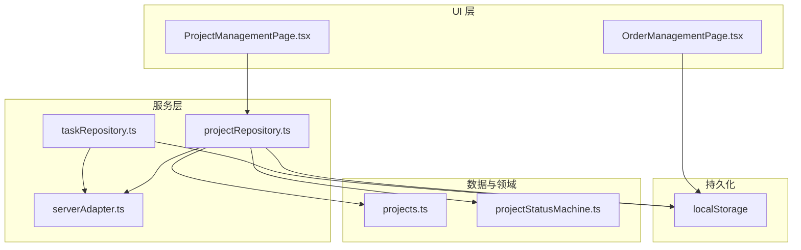
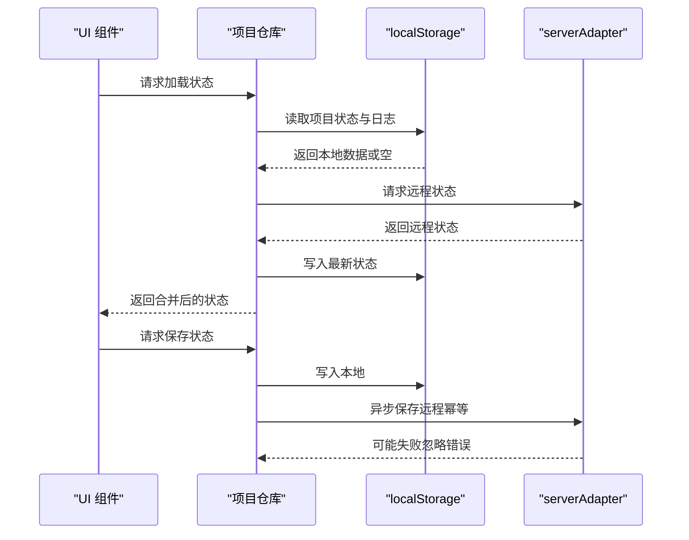
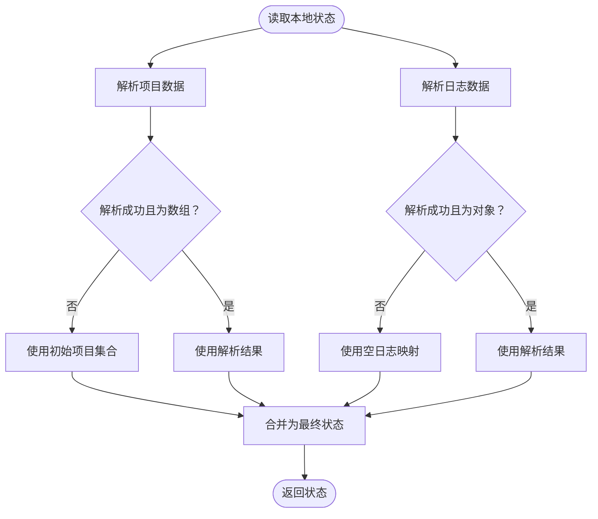
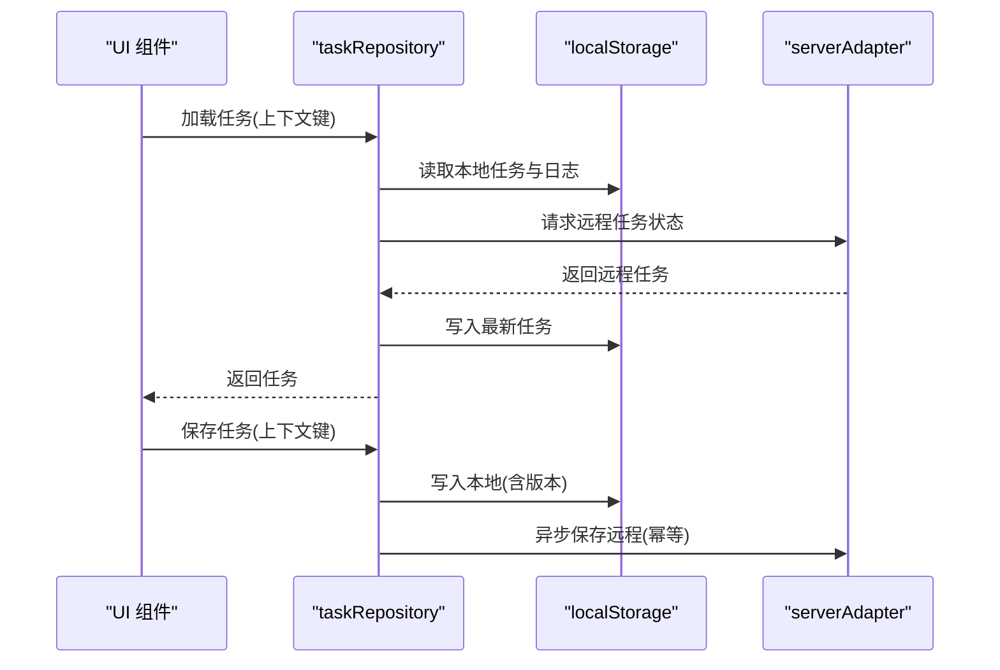
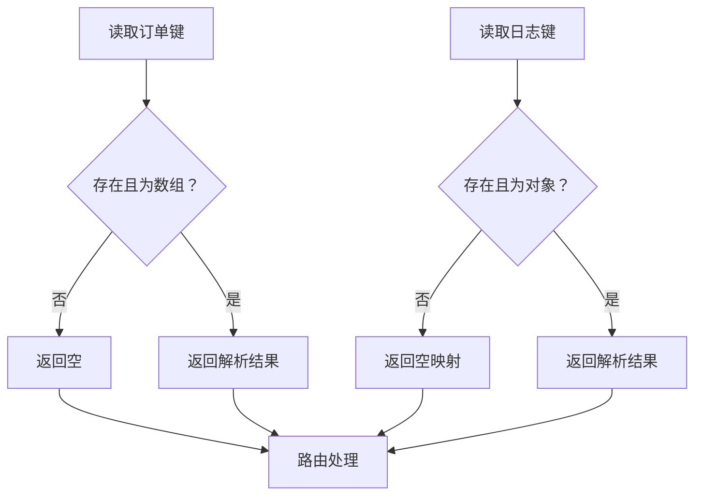
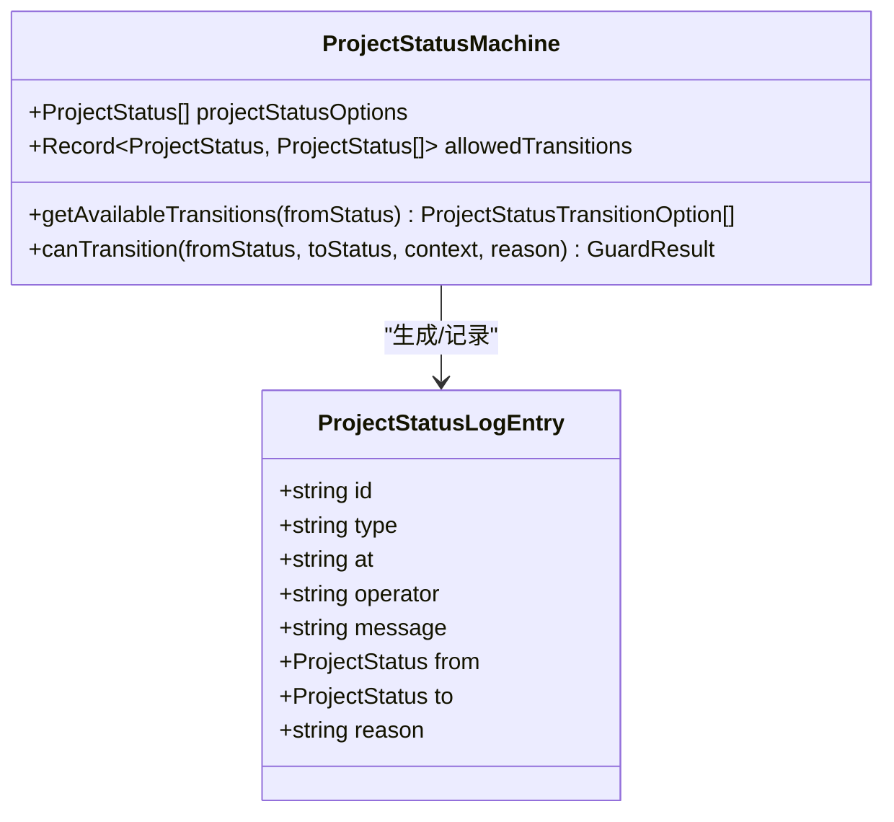
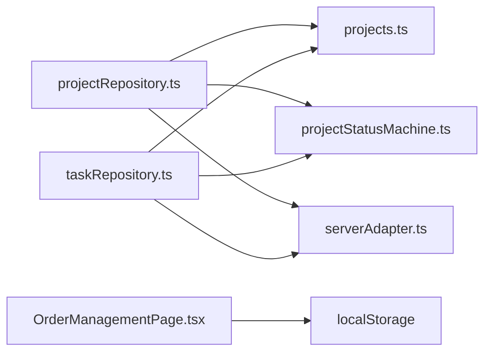

# 全局状态设计

<cite>
**本文引用的文件**
- [src/services/repositories/projectRepository.ts](file://src/services/repositories/projectRepository.ts)
- [src/data/projects.ts](file://src/data/projects.ts)
- [src/domain/projectStatusMachine.ts](file://src/domain/projectStatusMachine.ts)
- [src/services/repositories/taskRepository.ts](file://src/services/repositories/taskRepository.ts)
- [src/services/api/serverAdapter.ts](file://src/services/api/serverAdapter.ts)
- [src/components/orders/OrderManagementPage.tsx](file://src/components/orders/OrderManagementPage.tsx)
- [src/services/__tests__/projectRepository.test.ts](file://src/services/__tests__/projectRepository.test.ts)
- [src/components/project/ProjectManagementPage.tsx](file://src/components/project/ProjectManagementPage.tsx)
</cite>

## 目录

1. [简介](#简介)
2. [项目结构](#项目结构)
3. [核心组件](#核心组件)
4. [架构总览](#架构总览)
5. [详细组件分析](#详细组件分析)
6. [依赖分析](#依赖分析)
7. [性能考虑](#性能考虑)
8. [故障排查指南](#故障排查指南)
9. [结论](#结论)
10. [附录](#附录)

## 简介

本文件系统性阐述 CodeBuddy 项目的全局状态设计，涵盖以下方面：

- 全局状态结构定义：项目状态数组、状态日志对象与路由状态的组织方式
- 状态初始化机制：从 localStorage 读取初始状态、默认值处理与状态恢复策略
- 状态更新机制：变更触发条件、更新函数实现模式与一致性保障
- 状态持久化策略：localStorage 使用、序列化/反序列化与数据完整性校验
- 状态与 UI 组件的绑定关系：状态传递模式、组件订阅机制与性能优化
- 最佳实践与常见问题解决方案

## 项目结构

围绕全局状态的关键代码分布在服务层仓库、领域模型与 UI 组件之间，形成“数据层 → 领域 → UI”的分层结构。

图表来源

- [src/components/project/ProjectManagementPage.tsx:1-200](file://src/components/project/ProjectManagementPage.tsx#L1-L200)
- [src/components/orders/OrderManagementPage.tsx:216-261](file://src/components/orders/OrderManagementPage.tsx#L216-L261)
- [src/services/repositories/projectRepository.ts:1-90](file://src/services/repositories/projectRepository.ts#L1-L90)
- [src/services/repositories/taskRepository.ts:1-318](file://src/services/repositories/taskRepository.ts#L1-L318)
- [src/services/api/serverAdapter.ts:1-87](file://src/services/api/serverAdapter.ts#L1-L87)
- [src/data/projects.ts:1-451](file://src/data/projects.ts#L1-L451)
- [src/domain/projectStatusMachine.ts:1-164](file://src/domain/projectStatusMachine.ts#L1-L164)

章节来源

- [src/services/repositories/projectRepository.ts:1-90](file://src/services/repositories/projectRepository.ts#L1-L90)
- [src/services/repositories/taskRepository.ts:1-318](file://src/services/repositories/taskRepository.ts#L1-L318)
- [src/services/api/serverAdapter.ts:1-87](file://src/services/api/serverAdapter.ts#L1-L87)
- [src/data/projects.ts:1-451](file://src/data/projects.ts#L1-L451)
- [src/domain/projectStatusMachine.ts:1-164](file://src/domain/projectStatusMachine.ts#L1-L164)
- [src/components/project/ProjectManagementPage.tsx:1-200](file://src/components/project/ProjectManagementPage.tsx#L1-L200)
- [src/components/orders/OrderManagementPage.tsx:216-261](file://src/components/orders/OrderManagementPage.tsx#L216-L261)

## 核心组件

- 项目状态仓库：负责项目状态与日志的本地持久化、远程同步与降级策略
- 任务状态仓库：负责任务上下文状态、操作日志与审计事件的本地持久化与远程同步
- 服务器适配器：统一对外 API 请求，提供幂等键生成与环境注入
- 项目数据与状态机：提供初始项目集合、状态枚举与状态转换规则
- UI 组件：项目管理页面与订单管理页面作为状态消费方，负责渲染与交互

章节来源

- [src/services/repositories/projectRepository.ts:1-90](file://src/services/repositories/projectRepository.ts#L1-L90)
- [src/services/repositories/taskRepository.ts:1-318](file://src/services/repositories/taskRepository.ts#L1-L318)
- [src/services/api/serverAdapter.ts:1-87](file://src/services/api/serverAdapter.ts#L1-L87)
- [src/data/projects.ts:1-451](file://src/data/projects.ts#L1-L451)
- [src/domain/projectStatusMachine.ts:1-164](file://src/domain/projectStatusMachine.ts#L1-L164)
- [src/components/project/ProjectManagementPage.tsx:1-200](file://src/components/project/ProjectManagementPage.tsx#L1-L200)
- [src/components/orders/OrderManagementPage.tsx:216-261](file://src/components/orders/OrderManagementPage.tsx#L216-L261)

## 架构总览

全局状态采用“本地优先 + 远程兜底”的双写策略：本地使用 localStorage 存储，远程通过 serverAdapter 同步；当网络异常时，优先使用本地缓存，确保可用性与一致性。

图表来源

- [src/services/repositories/projectRepository.ts:54-88](file://src/services/repositories/projectRepository.ts#L54-L88)
- [src/services/api/serverAdapter.ts:44-52](file://src/services/api/serverAdapter.ts#L44-L52)

章节来源

- [src/services/repositories/projectRepository.ts:54-88](file://src/services/repositories/projectRepository.ts#L54-L88)
- [src/services/api/serverAdapter.ts:44-52](file://src/services/api/serverAdapter.ts#L44-L52)

## 详细组件分析

### 项目状态仓库（ProjectRepository）

- 结构定义
  - 状态类型：包含项目数组与按项目代码索引的日志映射
  - 键名：分别对应项目数据与日志的 localStorage 键
- 初始化与恢复
  - 从 localStorage 读取项目与日志；若解析失败或格式不正确，则回退到初始项目集合与空日志
  - 无数据时返回非空初始项目列表，避免 UI 空状态
- 远程同步与降级
  - 优先拉取远程状态，成功后写入本地；远程失败则返回本地缓存
  - 保存时先写本地，再异步尝试远程保存，失败仅记录错误
- 测试验证
  - 单测覆盖保存/加载、无数据回退、幂等键行为等场景

图表来源

- [src/services/repositories/projectRepository.ts:14-38](file://src/services/repositories/projectRepository.ts#L14-L38)
- [src/data/projects.ts:333-344](file://src/data/projects.ts#L333-L344)

章节来源

- [src/services/repositories/projectRepository.ts:1-90](file://src/services/repositories/projectRepository.ts#L1-L90)
- [src/data/projects.ts:1-451](file://src/data/projects.ts#L1-L451)
- [src/services/**tests**/projectRepository.test.ts:50-121](file://src/services/__tests__/projectRepository.test.ts#L50-L121)

### 任务状态仓库（TaskRepository）

- 上下文键管理
  - 以“前缀:上下文键”形式存储任务状态，支持按项目代码检索相关上下文键
  - 任务状态包含 schema 版本号，便于未来演进
- 日志与审计
  - 任务操作日志按任务编码聚合，保留最近若干条
  - 审计事件批量追加至 localStorage，并异步上报远程
- 保存策略
  - 本地持久化包含 schema 版本；远程保存同样采用幂等键，失败不阻塞 UI

图表来源

- [src/services/repositories/taskRepository.ts:141-195](file://src/services/repositories/taskRepository.ts#L141-L195)
- [src/services/api/serverAdapter.ts:53-63](file://src/services/api/serverAdapter.ts#L53-L63)

章节来源

- [src/services/repositories/taskRepository.ts:1-318](file://src/services/repositories/taskRepository.ts#L1-L318)
- [src/services/api/serverAdapter.ts:1-87](file://src/services/api/serverAdapter.ts#L1-L87)

### 订单状态与路由状态（OrderManagementPage）

- 本地状态
  - 订单数据与流程日志分别以独立键存储于 localStorage
  - 解析失败或格式不合法时，返回空或空映射，避免崩溃
- 路由状态
  - 通过 hash 切换路由，保证刷新后仍能回到指定锚点位置

图表来源

- [src/components/orders/OrderManagementPage.tsx:216-261](file://src/components/orders/OrderManagementPage.tsx#L216-L261)

章节来源

- [src/components/orders/OrderManagementPage.tsx:216-261](file://src/components/orders/OrderManagementPage.tsx#L216-L261)

### 项目状态机与日志（Domain）

- 状态枚举与转换
  - 定义项目状态集合与允许的转换关系
  - 提供守卫条件与提示文案，用于 UI 控制按钮可用性与输入校验
- 日志结构
  - 包含时间戳、操作者、消息、状态来源/去向与原因等字段
  - 用于追踪状态变更轨迹与审计

图表来源

- [src/domain/projectStatusMachine.ts:1-164](file://src/domain/projectStatusMachine.ts#L1-L164)

章节来源

- [src/domain/projectStatusMachine.ts:1-164](file://src/domain/projectStatusMachine.ts#L1-L164)

### UI 绑定与状态传递

- 项目管理页面
  - 通过 props 注入项目数据与回调，内部维护过滤器、视图模式、分页等本地状态
  - 使用 useMemo 优化计算结果，减少不必要的重渲染
- 订单管理页面
  - 通过本地方法读取 localStorage 并进行解析，保证 UI 在无网络时也能正常展示

章节来源

- [src/components/project/ProjectManagementPage.tsx:1-200](file://src/components/project/ProjectManagementPage.tsx#L1-L200)
- [src/components/orders/OrderManagementPage.tsx:216-261](file://src/components/orders/OrderManagementPage.tsx#L216-L261)

## 依赖分析

- 仓库对领域与数据的依赖
  - 项目仓库依赖初始项目集合与状态机日志类型
  - 任务仓库依赖类型定义与审计事件类型
- 仓库对服务层的依赖
  - 通过 serverAdapter 统一发起请求，支持幂等键与环境注入
- 仓库对持久化的依赖
  - localStorage 作为唯一持久化介质，承担读写与降级职责

图表来源

- [src/services/repositories/projectRepository.ts:1-90](file://src/services/repositories/projectRepository.ts#L1-L90)
- [src/services/repositories/taskRepository.ts:1-318](file://src/services/repositories/taskRepository.ts#L1-L318)
- [src/services/api/serverAdapter.ts:1-87](file://src/services/api/serverAdapter.ts#L1-L87)
- [src/data/projects.ts:1-451](file://src/data/projects.ts#L1-L451)
- [src/domain/projectStatusMachine.ts:1-164](file://src/domain/projectStatusMachine.ts#L1-L164)
- [src/components/orders/OrderManagementPage.tsx:216-261](file://src/components/orders/OrderManagementPage.tsx#L216-L261)

章节来源

- [src/services/repositories/projectRepository.ts:1-90](file://src/services/repositories/projectRepository.ts#L1-L90)
- [src/services/repositories/taskRepository.ts:1-318](file://src/services/repositories/taskRepository.ts#L1-L318)
- [src/services/api/serverAdapter.ts:1-87](file://src/services/api/serverAdapter.ts#L1-L87)
- [src/data/projects.ts:1-451](file://src/data/projects.ts#L1-L451)
- [src/domain/projectStatusMachine.ts:1-164](file://src/domain/projectStatusMachine.ts#L1-L164)
- [src/components/orders/OrderManagementPage.tsx:216-261](file://src/components/orders/OrderManagementPage.tsx#L216-L261)

## 性能考虑

- 本地优先策略
  - 读取与保存均优先本地，降低网络抖动对 UI 的影响
- 懒加载与降级
  - 远程失败不阻塞 UI，直接返回本地缓存，保证流畅体验
- 计算优化
  - UI 中广泛使用 useMemo 缓存计算结果，避免重复渲染
- 日志截断
  - 任务操作日志限制数量，防止 localStorage 膨胀

章节来源

- [src/services/repositories/projectRepository.ts:54-88](file://src/services/repositories/projectRepository.ts#L54-L88)
- [src/services/repositories/taskRepository.ts:171-195](file://src/services/repositories/taskRepository.ts#L171-L195)
- [src/components/project/ProjectManagementPage.tsx:66-78](file://src/components/project/ProjectManagementPage.tsx#L66-L78)

## 故障排查指南

- 本地数据损坏
  - 现象：解析失败或格式异常
  - 处理：仓库会回退到初始项目集合与空日志映射；建议清理 localStorage 对应键后重试
- 无数据返回
  - 现象：首次访问或清空缓存后
  - 处理：仓库保证返回非空初始项目列表；等待远程数据拉取
- 远程保存失败
  - 现象：网络异常或服务端错误
  - 处理：本地已持久化，不影响当前使用；稍后重试或检查网络
- 审计事件丢失
  - 现象：批量审计事件未及时上报
  - 处理：事件先写本地，再异步上报；重启后可继续上报

章节来源

- [src/services/repositories/projectRepository.ts:26-37](file://src/services/repositories/projectRepository.ts#L26-L37)
- [src/services/repositories/taskRepository.ts:281-316](file://src/services/repositories/taskRepository.ts#L281-L316)
- [src/services/**tests**/projectRepository.test.ts:98-104](file://src/services/__tests__/projectRepository.test.ts#L98-L104)

## 结论

本设计以 localStorage 为核心持久化介质，结合 serverAdapter 的远程同步与幂等键，实现了“本地优先、远程兜底”的稳健全局状态方案。通过严格的初始化与降级策略、清晰的状态结构与日志体系，以及 UI 层的计算优化与订阅模式，整体具备良好的可用性、一致性和可维护性。

## 附录

- 最佳实践
  - 本地状态必须包含默认值与容错逻辑
  - 远程失败时务必降级到本地缓存
  - 使用幂等键避免重复提交
  - 对日志与大对象进行截断与版本化
  - UI 中使用 useMemo 与细粒度状态拆分
- 常见问题
  - 解析失败：回退到默认值
  - 无数据：等待远程拉取或检查键名
  - 网络异常：继续使用本地缓存
  - 审计事件堆积：分批上报并限制数量
