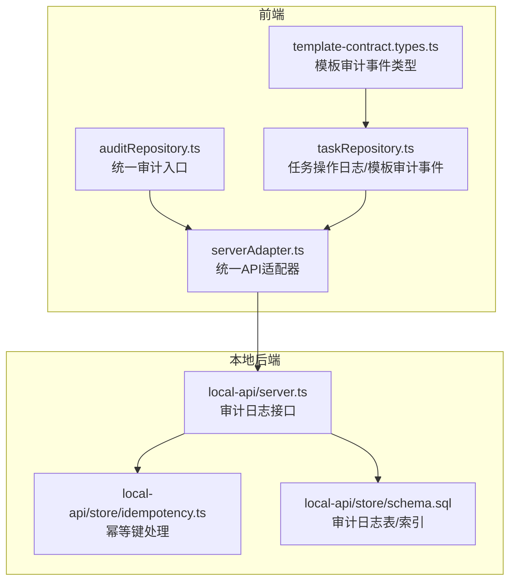
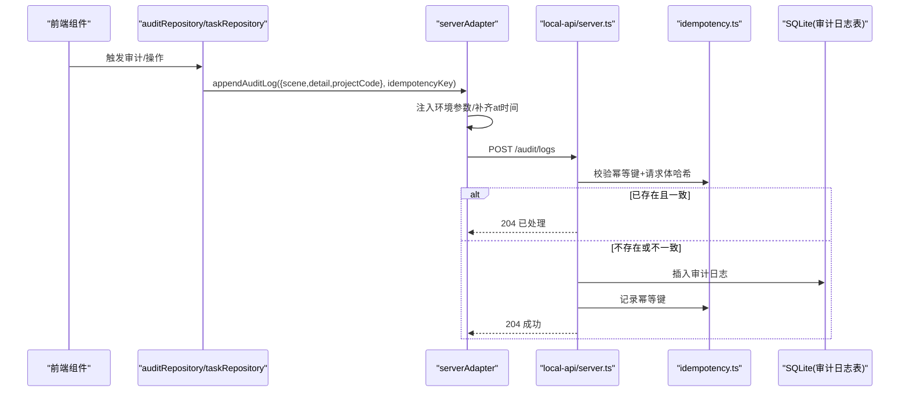
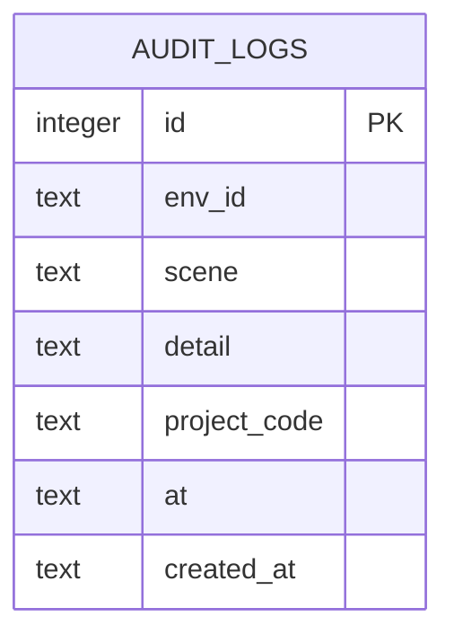
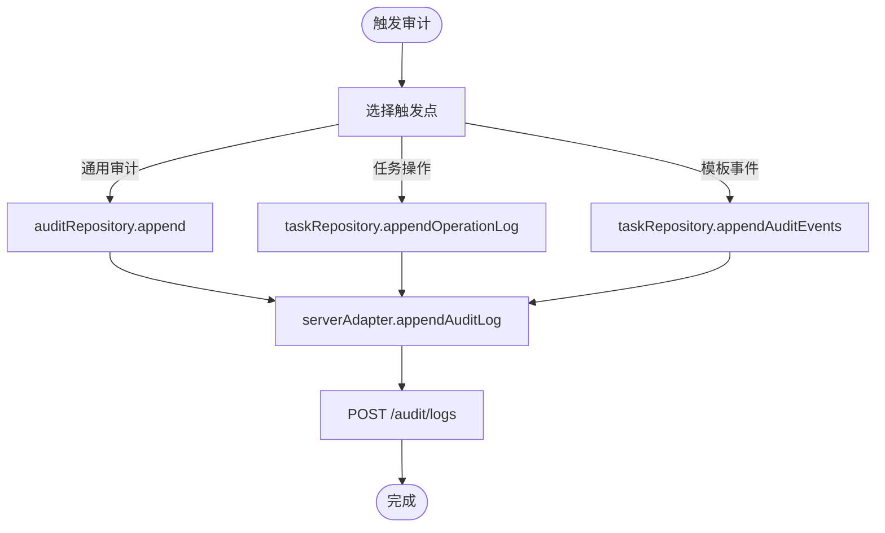
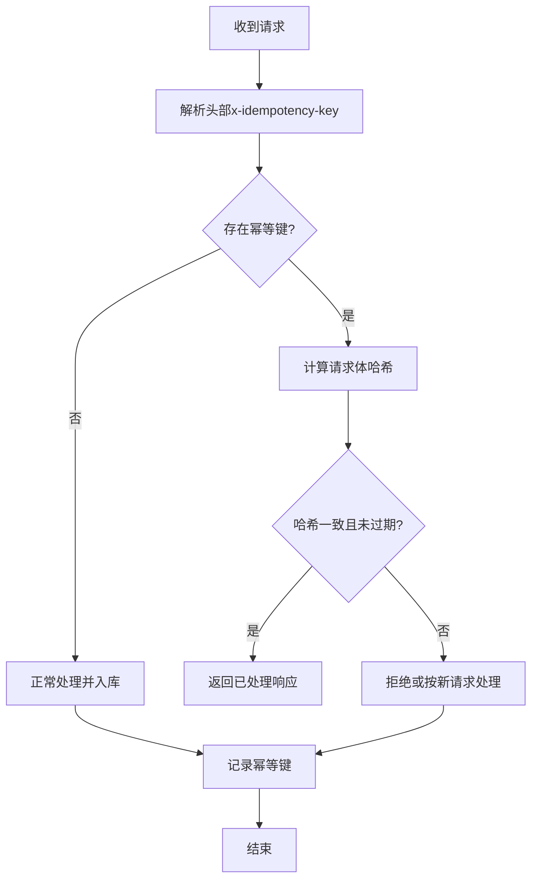
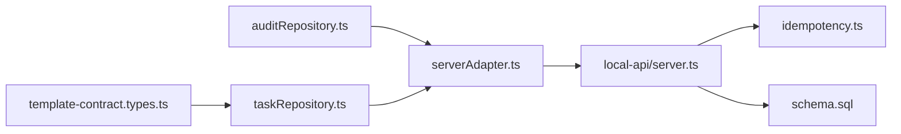

# 状态变更日志

<cite>
**本文引用的文件**
- [src/services/repositories/auditRepository.ts](file://src/services/repositories/auditRepository.ts)
- [src/services/repositories/taskRepository.ts](file://src/services/repositories/taskRepository.ts)
- [src/services/api/serverAdapter.ts](file://src/services/api/serverAdapter.ts)
- [local-api/server.ts](file://local-api/server.ts)
- [local-api/store/schema.sql](file://local-api/store/schema.sql)
- [local-api/store/idempotency.ts](file://local-api/store/idempotency.ts)
- [src/components/standard/template-contract.types.ts](file://src/components/standard/template-contract.types.ts)
</cite>

## 目录

1. [简介](#简介)
2. [项目结构](#项目结构)
3. [核心组件](#核心组件)
4. [架构总览](#架构总览)
5. [详细组件分析](#详细组件分析)
6. [依赖关系分析](#依赖关系分析)
7. [性能考量](#性能考量)
8. [故障排查指南](#故障排查指南)
9. [结论](#结论)
10. [附录](#附录)

## 简介

本文件面向CodeBuddy项目的状态变更日志系统，系统性阐述其设计理念、数据结构、触发机制、分类与过滤、存储与检索、监控与清理策略，并给出可操作的运维建议。该系统以“可审计、可追溯、可合规”为目标，覆盖项目状态、任务状态、验收与结算状态以及模板标准相关的审计事件，确保关键业务动作具备完整的时间线与证据链。

## 项目结构

围绕状态变更日志的关键代码分布在前端仓库与本地后端两部分：

- 前端层：封装审计写入入口、任务操作日志与模板审计事件聚合，负责构造审计场景与明细，并通过统一适配器向本地后端发起幂等写入。
- 本地后端：提供审计日志写入接口，内置幂等性保障与索引优化；数据库层定义审计日志表及索引，支持按环境、项目、场景维度检索。

图表来源

- [src/services/repositories/auditRepository.ts:1-26](file://src/services/repositories/auditRepository.ts#L1-L26)
- [src/services/repositories/taskRepository.ts:1-318](file://src/services/repositories/taskRepository.ts#L1-L318)
- [src/services/api/serverAdapter.ts:1-87](file://src/services/api/serverAdapter.ts#L1-L87)
- [local-api/server.ts:282-334](file://local-api/server.ts#L282-L334)
- [local-api/store/idempotency.ts:1-100](file://local-api/store/idempotency.ts#L1-L100)
- [local-api/store/schema.sql:42-56](file://local-api/store/schema.sql#L42-L56)
- [src/components/standard/template-contract.types.ts:208-235](file://src/components/standard/template-contract.types.ts#L208-L235)

章节来源

- [src/services/repositories/auditRepository.ts:1-26](file://src/services/repositories/auditRepository.ts#L1-L26)
- [src/services/repositories/taskRepository.ts:1-318](file://src/services/repositories/taskRepository.ts#L1-L318)
- [src/services/api/serverAdapter.ts:1-87](file://src/services/api/serverAdapter.ts#L1-L87)
- [local-api/server.ts:282-334](file://local-api/server.ts#L282-L334)
- [local-api/store/schema.sql:42-56](file://local-api/store/schema.sql#L42-L56)
- [local-api/store/idempotency.ts:1-100](file://local-api/store/idempotency.ts#L1-L100)
- [src/components/standard/template-contract.types.ts:208-235](file://src/components/standard/template-contract.types.ts#L208-L235)

## 核心组件

- 审计仓库（auditRepository）：对外暴露统一的审计追加能力，自动构造幂等键并调用后端接口，异常时记录结构化错误，保证主流程不被阻断。
- 任务仓库（taskRepository）：负责两类审计：
  - 任务操作日志：在本地持久化最近若干条操作日志，并同时向后端发送审计事件。
  - 模板审计事件：聚合模板实例化、覆盖应用、快照创建、不匹配检测等事件，先本地缓存再批量上报。
- 服务器适配器（serverAdapter）：封装所有后端接口调用，统一注入环境参数与幂等键，审计接口会自动补齐时间戳字段。
- 本地后端（local-api/server.ts）：实现审计日志POST接口，进行幂等检查、入库与幂等键记录。
- 数据库与幂等（schema.sql、idempotency.ts）：定义审计日志表结构与索引，提供幂等键校验与记录能力，支持过期清理。

章节来源

- [src/services/repositories/auditRepository.ts:1-26](file://src/services/repositories/auditRepository.ts#L1-L26)
- [src/services/repositories/taskRepository.ts:171-195](file://src/services/repositories/taskRepository.ts#L171-L195)
- [src/services/repositories/taskRepository.ts:281-316](file://src/services/repositories/taskRepository.ts#L281-L316)
- [src/services/api/serverAdapter.ts:76-86](file://src/services/api/serverAdapter.ts#L76-L86)
- [local-api/server.ts:282-334](file://local-api/server.ts#L282-L334)
- [local-api/store/schema.sql:42-71](file://local-api/store/schema.sql#L42-L71)
- [local-api/store/idempotency.ts:20-99](file://local-api/store/idempotency.ts#L20-L99)

## 架构总览

下图展示从前端到本地后端的审计写入全链路，包含幂等性控制与索引优化：

图表来源

- [src/services/repositories/auditRepository.ts:7-24](file://src/services/repositories/auditRepository.ts#L7-L24)
- [src/services/repositories/taskRepository.ts:183-194](file://src/services/repositories/taskRepository.ts#L183-L194)
- [src/services/api/serverAdapter.ts:76-86](file://src/services/api/serverAdapter.ts#L76-L86)
- [local-api/server.ts:288-329](file://local-api/server.ts#L288-L329)
- [local-api/store/idempotency.ts:23-58](file://local-api/store/idempotency.ts#L23-L58)

## 详细组件分析

### 审计数据模型与字段

- 表：audit_logs
  - 字段：id、env_id、scene、detail、project_code、at、created_at
  - 索引：按 env_id、project_code、scene 建立索引，便于多维检索
- 关键字段说明
  - scene：审计场景，如“task_operation”、“acceptance”、“template_instance_created”等
  - detail：审计明细，承载具体事件描述或上下文信息
  - project_code：关联项目编码，便于按项目聚合
  - at：事件发生时间（由前端适配器补齐），用于排序与统计
  - created_at：入库时间（由数据库默认值填充）

图表来源

- [local-api/store/schema.sql:42-51](file://local-api/store/schema.sql#L42-L51)

章节来源

- [local-api/store/schema.sql:42-56](file://local-api/store/schema.sql#L42-L56)

### 审计场景与事件类型

- 场景枚举（前端仓库）：project、task、acceptance、settlement、system
- 任务操作日志场景：task_operation
- 模板审计事件类型（前端类型定义）：
  - template_instance_created：模板实例化
  - template_override_applied：模板覆盖应用
  - standard_snapshot_created：标准快照创建
  - template_mismatch_detected：模板不匹配检测

章节来源

- [src/services/repositories/auditRepository.ts:4](file://src/services/repositories/auditRepository.ts#L4)
- [src/services/repositories/taskRepository.ts:186](file://src/services/repositories/taskRepository.ts#L186)
- [src/components/standard/template-contract.types.ts:208-235](file://src/components/standard/template-contract.types.ts#L208-L235)

### 触发机制与调用链

- 统一入口
  - auditRepository.append：面向通用审计场景
  - taskRepository.appendOperationLog：面向任务操作日志
  - taskRepository.appendAuditEvents：面向模板审计事件聚合
- 入口共同特征
  - 使用 createIdempotencyKey 生成幂等键
  - 通过 serverAdapter.appendAuditLog 发起请求
  - 异常时记录结构化错误，不阻断主流程

图表来源

- [src/services/repositories/auditRepository.ts:7-24](file://src/services/repositories/auditRepository.ts#L7-L24)
- [src/services/repositories/taskRepository.ts:183-194](file://src/services/repositories/taskRepository.ts#L183-L194)
- [src/services/repositories/taskRepository.ts:281-316](file://src/services/repositories/taskRepository.ts#L281-L316)
- [src/services/api/serverAdapter.ts:76-86](file://src/services/api/serverAdapter.ts#L76-L86)

章节来源

- [src/services/repositories/auditRepository.ts:1-26](file://src/services/repositories/auditRepository.ts#L1-L26)
- [src/services/repositories/taskRepository.ts:171-195](file://src/services/repositories/taskRepository.ts#L171-L195)
- [src/services/repositories/taskRepository.ts:281-316](file://src/services/repositories/taskRepository.ts#L281-L316)
- [src/services/api/serverAdapter.ts:38-42](file://src/services/api/serverAdapter.ts#L38-L42)

### 幂等性与一致性

- 幂等键生成：基于 scope、目标标识、时间戳与随机串组合
- 幂等检查：命中幂等键且请求体哈希一致时直接返回成功，避免重复写入
- 过期清理：幂等记录带过期时间，定期清理释放空间

图表来源

- [src/services/api/serverAdapter.ts:38-42](file://src/services/api/serverAdapter.ts#L38-L42)
- [local-api/server.ts:294-306](file://local-api/server.ts#L294-L306)
- [local-api/store/idempotency.ts:23-58](file://local-api/store/idempotency.ts#L23-L58)
- [local-api/store/idempotency.ts:63-86](file://local-api/store/idempotency.ts#L63-L86)

章节来源

- [local-api/server.ts:288-329](file://local-api/server.ts#L288-L329)
- [local-api/store/idempotency.ts:10-18](file://local-api/store/idempotency.ts#L10-L18)
- [local-api/store/idempotency.ts:23-58](file://local-api/store/idempotency.ts#L23-L58)
- [local-api/store/idempotency.ts:63-86](file://local-api/store/idempotency.ts#L63-L86)

### 本地缓存与回退策略

- 任务操作日志：优先写入浏览器localStorage，随后异步上报后端；若后端不可用，仍保留本地历史
- 模板审计事件：先本地缓存上限（示例为200条），再批量上报，避免丢失关键事件
- 通用审计：若网络异常，记录结构化错误，不影响主流程

章节来源

- [src/services/repositories/taskRepository.ts:64-83](file://src/services/repositories/taskRepository.ts#L64-L83)
- [src/services/repositories/taskRepository.ts:286-293](file://src/services/repositories/taskRepository.ts#L286-L293)
- [src/services/repositories/auditRepository.ts:17-24](file://src/services/repositories/auditRepository.ts#L17-L24)

### 存储与检索

- 存储：SQLite（本地后端），审计日志表含索引
- 查询：按 env_id、project_code、scene 三类维度检索，适合多环境、多项目、多场景的审计报表
- 性能：索引覆盖常见查询维度；幂等键表也建立索引，降低重复请求成本

章节来源

- [local-api/store/schema.sql:53-55](file://local-api/store/schema.sql#L53-L55)
- [local-api/store/schema.sql:69-71](file://local-api/store/schema.sql#L69-L71)

## 依赖关系分析

- 前端依赖
  - auditRepository 依赖 serverAdapter 与结构化错误记录
  - taskRepository 依赖 serverAdapter、本地存储与模板审计事件类型
- 后端依赖
  - 本地后端依赖 SQLite 与幂等模块
  - 幂等模块依赖数据库与哈希算法

图表来源

- [src/components/standard/template-contract.types.ts:208-235](file://src/components/standard/template-contract.types.ts#L208-L235)
- [src/services/repositories/auditRepository.ts:1-2](file://src/services/repositories/auditRepository.ts#L1-L2)
- [src/services/repositories/taskRepository.ts:1-3](file://src/services/repositories/taskRepository.ts#L1-L3)
- [src/services/api/serverAdapter.ts:5-6](file://src/services/api/serverAdapter.ts#L5-L6)
- [local-api/server.ts:282-334](file://local-api/server.ts#L282-L334)
- [local-api/store/idempotency.ts:6-8](file://local-api/store/idempotency.ts#L6-L8)
- [local-api/store/schema.sql:1-2](file://local-api/store/schema.sql#L1-L2)

章节来源

- [src/services/repositories/auditRepository.ts:1-26](file://src/services/repositories/auditRepository.ts#L1-L26)
- [src/services/repositories/taskRepository.ts:1-318](file://src/services/repositories/taskRepository.ts#L1-L318)
- [src/services/api/serverAdapter.ts:1-87](file://src/services/api/serverAdapter.ts#L1-L87)
- [local-api/server.ts:282-334](file://local-api/server.ts#L282-L334)
- [local-api/store/schema.sql:1-72](file://local-api/store/schema.sql#L1-L72)
- [local-api/store/idempotency.ts:1-100](file://local-api/store/idempotency.ts#L1-L100)
- [src/components/standard/template-contract.types.ts:208-235](file://src/components/standard/template-contract.types.ts#L208-L235)

## 性能考量

- 幂等性减少重复写入，提升吞吐与一致性
- 索引覆盖常用查询维度，降低检索成本
- 本地缓存与异步上报降低前端阻塞
- 建议
  - 对高频场景增加批量上报策略
  - 定期清理过期幂等记录与审计日志，控制表规模
  - 在前端侧限制单次上报事件数量，避免峰值抖动

## 故障排查指南

- 审计写入失败
  - 现象：网络异常或后端不可用导致审计未生效
  - 处理：系统会记录结构化错误，前端仍保留本地缓存；建议检查网络与后端健康状态
- 幂等键冲突
  - 现象：重复请求被识别为幂等，直接返回成功
  - 处理：确认请求体是否被意外修改；若非预期，请更换幂等键或等待过期
- 查询无结果
  - 现象：按项目或场景查询不到数据
  - 处理：确认 env_id、project_code、scene 是否正确；检查索引是否生效

章节来源

- [src/services/repositories/auditRepository.ts:17-24](file://src/services/repositories/auditRepository.ts#L17-L24)
- [local-api/server.ts:294-306](file://local-api/server.ts#L294-L306)
- [local-api/store/idempotency.ts:46-55](file://local-api/store/idempotency.ts#L46-L55)

## 结论

CodeBuddy 的状态变更日志体系以“统一入口、幂等保障、索引优化、本地缓存”为核心设计，既满足审计与合规需求，又兼顾性能与可用性。通过明确的场景划分与事件类型，系统能够为项目、任务、验收、结算与标准模板等关键环节提供完整的证据链，支撑后续的统计分析与监管审查。

## 附录

### 日志分类与过滤建议

- 分类维度
  - 场景：project、task、acceptance、settlement、system、task_operation、模板事件类型
  - 项目：project_code
  - 时间：at、created_at
- 过滤策略
  - 前端：按场景与项目筛选，支持时间范围
  - 后端：利用索引进行高效检索

章节来源

- [local-api/store/schema.sql:42-56](file://local-api/store/schema.sql#L42-L56)

### 清理与保留策略

- 幂等记录：按固定TTL（天级）清理，释放存储空间
- 审计日志：结合合规要求设定保留周期，定期归档或删除

章节来源

- [local-api/store/idempotency.ts:10](file://local-api/store/idempotency.ts#L10)
- [local-api/store/idempotency.ts:73](file://local-api/store/idempotency.ts#L73)
