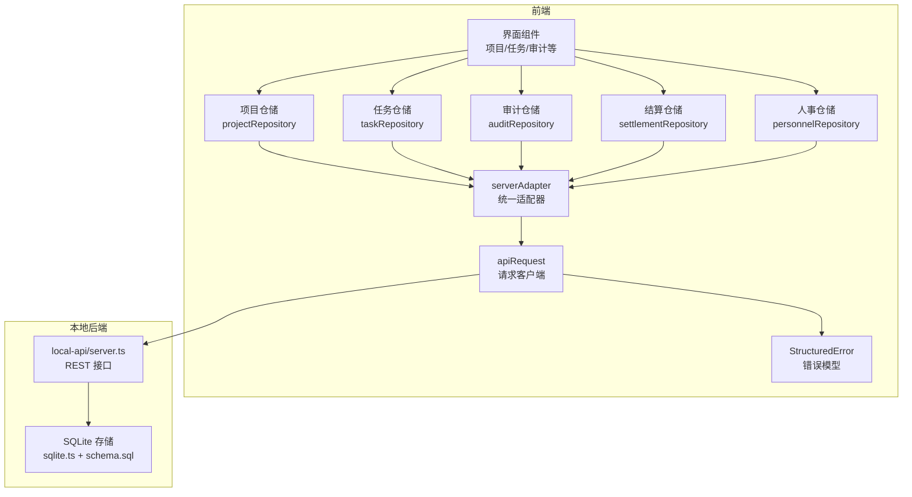
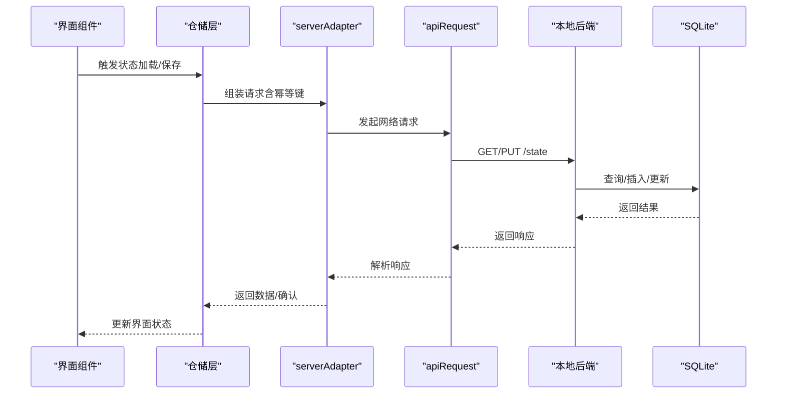
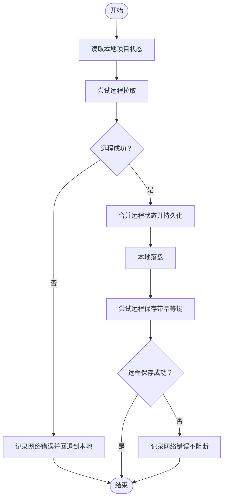
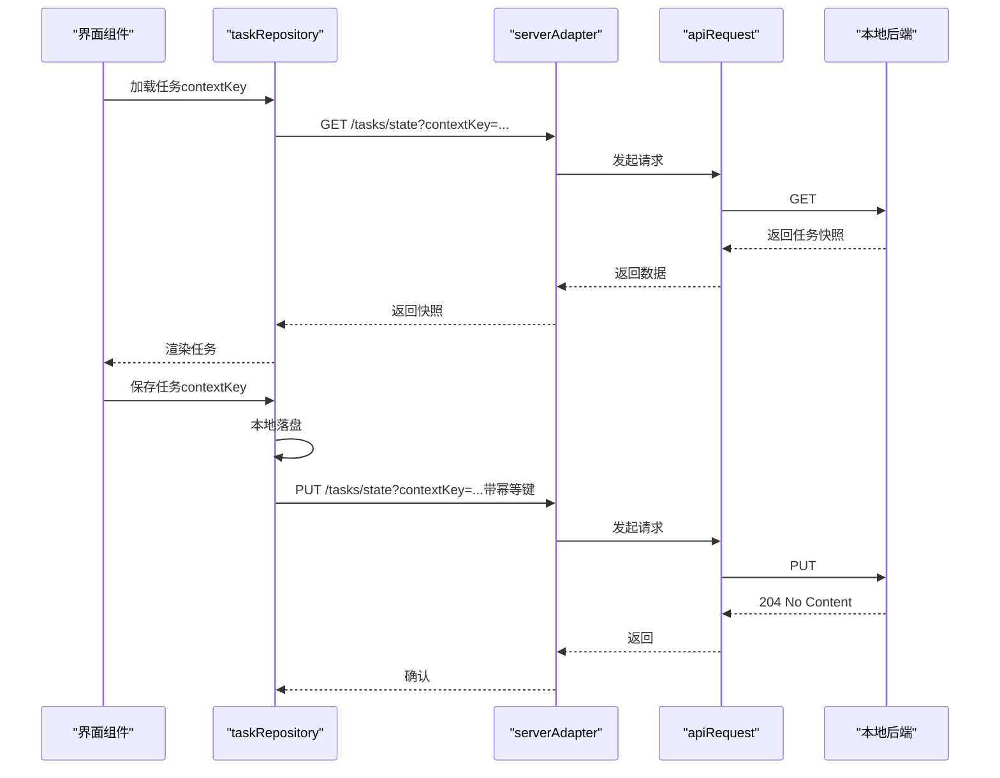
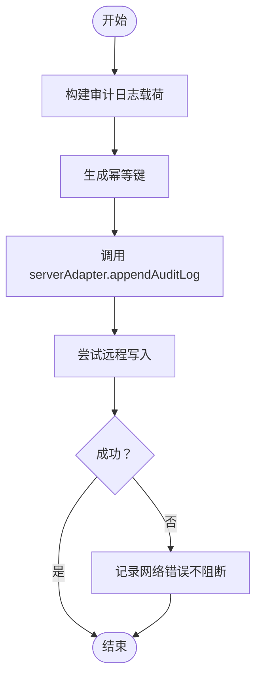
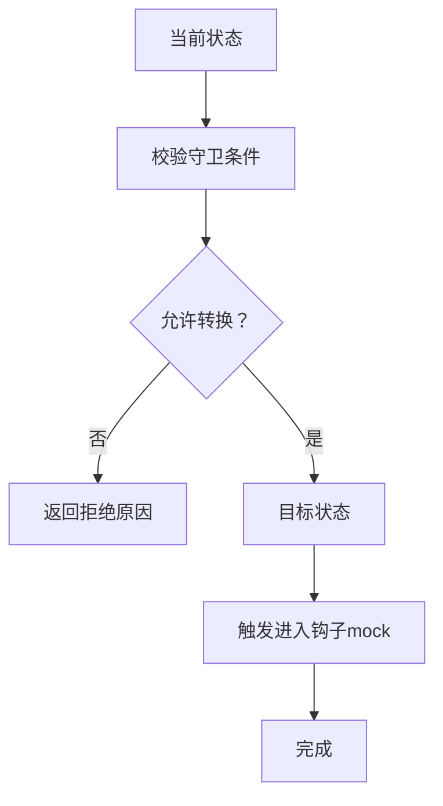
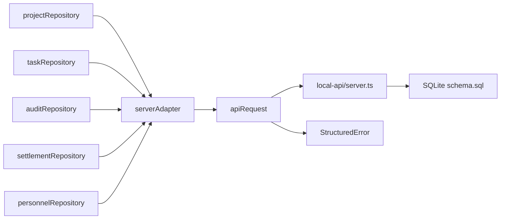
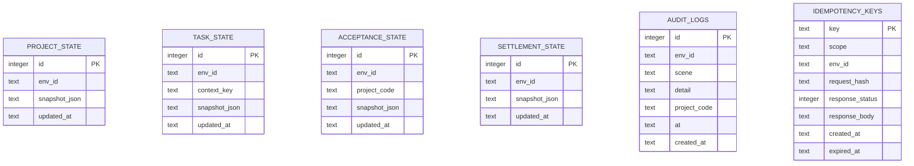

# 状态同步机制

<cite>
**本文引用的文件**
- [src/domain/projectStatusMachine.ts](file://src/domain/projectStatusMachine.ts)
- [src/services/repositories/projectRepository.ts](file://src/services/repositories/projectRepository.ts)
- [src/services/repositories/taskRepository.ts](file://src/services/repositories/taskRepository.ts)
- [src/services/repositories/auditRepository.ts](file://src/services/repositories/auditRepository.ts)
- [src/services/repositories/settlementRepository.ts](file://src/services/repositories/settlementRepository.ts)
- [src/services/repositories/personnelRepository.ts](file://src/services/repositories/personnelRepository.ts)
- [src/services/api/serverAdapter.ts](file://src/services/api/serverAdapter.ts)
- [src/services/api/client.ts](file://src/services/api/client.ts)
- [src/services/errors/StructuredError.ts](file://src/services/errors/StructuredError.ts)
- [local-api/store/sqlite.ts](file://local-api/store/sqlite.ts)
- [local-api/store/schema.sql](file://local-api/store/schema.sql)
- [local-api/server.ts](file://local-api/server.ts)
- [src/data/projects.ts](file://src/data/projects.ts)
- [src/App.tsx](file://src/App.tsx)
</cite>

## 目录

1. [简介](#简介)
2. [项目结构](#项目结构)
3. [核心组件](#核心组件)
4. [架构总览](#架构总览)
5. [详细组件分析](#详细组件分析)
6. [依赖关系分析](#依赖关系分析)
7. [性能考虑](#性能考虑)
8. [故障排查指南](#故障排查指南)
9. [结论](#结论)
10. [附录](#附录)

## 简介

本文件系统性阐述 CodeBuddy 项目中的“状态同步机制”，涵盖本地状态与远程状态的协调方式、触发时机、数据传输协议、冲突解决策略、一致性保障（版本控制、并发控制、数据校验）、实现细节（项目状态、任务状态、审计日志、结算建议等）、远程服务降级策略、性能优化（增量同步、批量处理、网络优化）以及监控与排障方法。目标是帮助开发者与运维人员全面理解并高效维护该机制。

## 项目结构

围绕状态同步的关键模块分布如下：

- 领域模型与状态机：定义项目状态、状态转换规则与守卫条件
- 仓储层：封装本地持久化（localStorage/SQLite）与远程调用（serverAdapter）
- API 层：统一请求客户端与幂等键生成
- 本地后端：SQLite 存储与 REST 接口，支持幂等与重放
- 错误体系：结构化错误模型与日志记录
- UI 事件：远程降级告警与用户提示

**图表来源**

- [src/services/repositories/projectRepository.ts:53-89](file://src/services/repositories/projectRepository.ts#L53-L89)
- [src/services/repositories/taskRepository.ts:141-317](file://src/services/repositories/taskRepository.ts#L141-L317)
- [src/services/repositories/auditRepository.ts:6-25](file://src/services/repositories/auditRepository.ts#L6-L25)
- [src/services/repositories/settlementRepository.ts:20-31](file://src/services/repositories/settlementRepository.ts#L20-L31)
- [src/services/repositories/personnelRepository.ts:44-57](file://src/services/repositories/personnelRepository.ts#L44-L57)
- [src/services/api/serverAdapter.ts:44-86](file://src/services/api/serverAdapter.ts#L44-L86)
- [src/services/api/client.ts:83-171](file://src/services/api/client.ts#L83-L171)
- [local-api/server.ts:68-244](file://local-api/server.ts#L68-L244)
- [local-api/store/sqlite.ts:18-98](file://local-api/store/sqlite.ts#L18-L98)
- [local-api/store/schema.sql:4-71](file://local-api/store/schema.sql#L4-L71)

**章节来源**

- [src/services/repositories/projectRepository.ts:14-89](file://src/services/repositories/projectRepository.ts#L14-L89)
- [src/services/repositories/taskRepository.ts:22-317](file://src/services/repositories/taskRepository.ts#L22-L317)
- [src/services/repositories/auditRepository.ts:6-25](file://src/services/repositories/auditRepository.ts#L6-L25)
- [src/services/repositories/settlementRepository.ts:9-31](file://src/services/repositories/settlementRepository.ts#L9-L31)
- [src/services/repositories/personnelRepository.ts:13-57](file://src/services/repositories/personnelRepository.ts#L13-L57)
- [src/services/api/serverAdapter.ts:7-86](file://src/services/api/serverAdapter.ts#L7-L86)
- [src/services/api/client.ts:32-171](file://src/services/api/client.ts#L32-L171)
- [local-api/store/sqlite.ts:18-98](file://local-api/store/sqlite.ts#L18-L98)
- [local-api/store/schema.sql:4-71](file://local-api/store/schema.sql#L4-L71)

## 核心组件

- 项目状态机与守卫：定义项目状态集合、允许的转换、进入钩子、守卫条件与错误码
- 项目仓储：负责项目列表与状态日志的本地/远程同步，带降级策略
- 任务仓储：按上下文键隔离的任务状态与操作日志，支持整改任务创建与审计事件批量上报
- 审计仓储：统一审计日志写入，幂等键去重
- 结算仓储：本地建议与远程建议的合并策略
- 人事仓储：本地人员状态持久化
- 服务器适配器：统一远程接口调用，注入幂等键
- 请求客户端：统一网络请求、重试、错误分类与降级事件派发
- 本地后端：SQLite 存储与 REST 接口，支持幂等键去重与重放
- 错误模型：结构化错误码、作用域、场景、重试判断等

**章节来源**

- [src/domain/projectStatusMachine.ts:1-164](file://src/domain/projectStatusMachine.ts#L1-L164)
- [src/services/repositories/projectRepository.ts:9-89](file://src/services/repositories/projectRepository.ts#L9-L89)
- [src/services/repositories/taskRepository.ts:141-317](file://src/services/repositories/taskRepository.ts#L141-L317)
- [src/services/repositories/auditRepository.ts:6-25](file://src/services/repositories/auditRepository.ts#L6-L25)
- [src/services/repositories/settlementRepository.ts:20-31](file://src/services/repositories/settlementRepository.ts#L20-L31)
- [src/services/repositories/personnelRepository.ts:13-57](file://src/services/repositories/personnelRepository.ts#L13-L57)
- [src/services/api/serverAdapter.ts:38-86](file://src/services/api/serverAdapter.ts#L38-L86)
- [src/services/api/client.ts:32-171](file://src/services/api/client.ts#L32-L171)
- [local-api/store/sqlite.ts:18-98](file://local-api/store/sqlite.ts#L18-L98)
- [local-api/store/schema.sql:4-71](file://local-api/store/schema.sql#L4-L71)

## 架构总览

状态同步采用“前端本地优先 + 远程兜底”的双轨策略：

- 读取：优先从远程拉取最新快照，成功后落盘；失败则回退到本地缓存
- 写入：先本地落盘，再异步或同步尝试远程写入；失败记录结构化错误，不阻塞主流程
- 幂等：通过 X-Idempotency-Key 防止重复提交与重放攻击
- 降级：当网络异常或服务不可用时，触发 UI 降级告警并继续使用本地数据

**图表来源**

- [src/services/repositories/projectRepository.ts:54-88](file://src/services/repositories/projectRepository.ts#L54-L88)
- [src/services/api/serverAdapter.ts:44-86](file://src/services/api/serverAdapter.ts#L44-L86)
- [src/services/api/client.ts:83-171](file://src/services/api/client.ts#L83-L171)
- [local-api/server.ts:68-244](file://local-api/server.ts#L68-L244)
- [local-api/store/sqlite.ts:18-98](file://local-api/store/sqlite.ts#L18-L98)

## 详细组件分析

### 项目状态同步（项目仓储）

- 本地存储键：项目列表与状态日志分别存储，避免相互影响
- 加载流程：先读本地，再尝试远程；远程成功则覆盖本地并持久化
- 保存流程：先本地落盘，再尝试远程；远程失败记录结构化错误
- 降级策略：网络错误时保留本地状态，不阻断用户操作
- 幂等键：每次保存生成唯一键，防止重复写入

**图表来源**

- [src/services/repositories/projectRepository.ts:54-88](file://src/services/repositories/projectRepository.ts#L54-L88)
- [src/services/errors/StructuredError.ts:27-127](file://src/services/errors/StructuredError.ts#L27-L127)

**章节来源**

- [src/services/repositories/projectRepository.ts:14-89](file://src/services/repositories/projectRepository.ts#L14-L89)
- [src/services/api/serverAdapter.ts:44-52](file://src/services/api/serverAdapter.ts#L44-L52)
- [src/services/api/client.ts:83-171](file://src/services/api/client.ts#L83-L171)
- [src/services/errors/StructuredError.ts:179-194](file://src/services/errors/StructuredError.ts#L179-L194)

### 任务状态同步（任务仓储）

- 上下文隔离：按 contextKey 将任务状态与操作日志分片存储
- 任务状态：支持 schema 版本，兼容迁移
- 操作日志：本地缓存最近若干条，异步上报审计
- 整改任务：基于验收节点自动生成整改任务，去重并持久化
- 审计事件：模板审计事件批量上报，幂等键逐条生成

**图表来源**

- [src/services/repositories/taskRepository.ts:141-169](file://src/services/repositories/taskRepository.ts#L141-L169)
- [src/services/api/serverAdapter.ts:53-63](file://src/services/api/serverAdapter.ts#L53-L63)
- [src/services/api/client.ts:83-171](file://src/services/api/client.ts#L83-L171)
- [local-api/server.ts:149-196](file://local-api/server.ts#L149-L196)

**章节来源**

- [src/services/repositories/taskRepository.ts:22-317](file://src/services/repositories/taskRepository.ts#L22-L317)
- [src/services/api/serverAdapter.ts:12-63](file://src/services/api/serverAdapter.ts#L12-L63)
- [local-api/server.ts:149-196](file://local-api/server.ts#L149-L196)

### 审计日志同步（审计仓储）

- 统一入口：按场景（项目/任务/验收/结算/系统）写入审计日志
- 幂等键：每个写入携带唯一键，避免重复上报
- 降级策略：远程失败不影响主流程，记录结构化错误

**图表来源**

- [src/services/repositories/auditRepository.ts:6-25](file://src/services/repositories/auditRepository.ts#L6-L25)
- [src/services/api/serverAdapter.ts:76-85](file://src/services/api/serverAdapter.ts#L76-L85)
- [src/services/api/client.ts:83-171](file://src/services/api/client.ts#L83-L171)

**章节来源**

- [src/services/repositories/auditRepository.ts:6-25](file://src/services/repositories/auditRepository.ts#L6-L25)
- [src/services/api/serverAdapter.ts:76-85](file://src/services/api/serverAdapter.ts#L76-L85)
- [src/services/errors/StructuredError.ts:179-194](file://src/services/errors/StructuredError.ts#L179-L194)

### 结算建议同步（结算仓储）

- 本地建议：基于项目状态构造本地建议
- 远程建议：优先使用远程建议，若为空则回退到本地
- 降级策略：远程失败不影响展示，回退到本地建议

**章节来源**

- [src/services/repositories/settlementRepository.ts:9-31](file://src/services/repositories/settlementRepository.ts#L9-L31)
- [src/data/projects.ts:26-45](file://src/data/projects.ts#L26-L45)

### 人事状态同步（人事仓储）

- 本地持久化：人员列表本地存储，初始化默认值
- 降级策略：本地读写失败时回退到初始状态

**章节来源**

- [src/services/repositories/personnelRepository.ts:13-57](file://src/services/repositories/personnelRepository.ts#L13-L57)

### 项目状态机与守卫（领域模型）

- 状态集合：定义项目生命周期各阶段
- 允许转换：二维映射限制非法跳转
- 进入钩子：状态进入时触发联动逻辑（注释为 mock）
- 守卫条件：根据上下文字段（容器/审批/里程碑/任务树/标准绑定/关键任务/验收/整改闭环/结算）判定是否可转换
- 错误码：针对不同拒绝原因返回明确错误码

**图表来源**

- [src/domain/projectStatusMachine.ts:59-163](file://src/domain/projectStatusMachine.ts#L59-L163)

**章节来源**

- [src/domain/projectStatusMachine.ts:1-164](file://src/domain/projectStatusMachine.ts#L1-L164)

## 依赖关系分析

- 仓储层依赖 serverAdapter，后者封装 apiRequest
- apiRequest 依赖环境变量与本地后端，负责重试、错误分类与降级事件派发
- 本地后端依赖 SQLite 存储，提供幂等键去重与重放能力
- 错误模型贯穿前端与本地后端，统一错误语义与日志格式

**图表来源**

- [src/services/repositories/projectRepository.ts:3-4](file://src/services/repositories/projectRepository.ts#L3-L4)
- [src/services/repositories/taskRepository.ts](file://src/services/repositories/taskRepository.ts#L3)
- [src/services/repositories/auditRepository.ts](file://src/services/repositories/auditRepository.ts#L1)
- [src/services/repositories/settlementRepository.ts](file://src/services/repositories/settlementRepository.ts#L2)
- [src/services/repositories/personnelRepository.ts](file://src/services/repositories/personnelRepository.ts#L3)
- [src/services/api/serverAdapter.ts](file://src/services/api/serverAdapter.ts#L5)
- [src/services/api/client.ts](file://src/services/api/client.ts#L5)
- [local-api/server.ts:68-244](file://local-api/server.ts#L68-L244)
- [local-api/store/schema.sql:4-71](file://local-api/store/schema.sql#L4-L71)
- [src/services/errors/StructuredError.ts:27-127](file://src/services/errors/StructuredError.ts#L27-L127)

**章节来源**

- [src/services/repositories/projectRepository.ts:3-4](file://src/services/repositories/projectRepository.ts#L3-L4)
- [src/services/repositories/taskRepository.ts](file://src/services/repositories/taskRepository.ts#L3)
- [src/services/repositories/auditRepository.ts](file://src/services/repositories/auditRepository.ts#L1)
- [src/services/repositories/settlementRepository.ts](file://src/services/repositories/settlementRepository.ts#L2)
- [src/services/repositories/personnelRepository.ts](file://src/services/repositories/personnelRepository.ts#L3)
- [src/services/api/serverAdapter.ts](file://src/services/api/serverAdapter.ts#L5)
- [src/services/api/client.ts](file://src/services/api/client.ts#L5)
- [local-api/server.ts:68-244](file://local-api/server.ts#L68-L244)
- [local-api/store/schema.sql:4-71](file://local-api/store/schema.sql#L4-L71)
- [src/services/errors/StructuredError.ts:27-127](file://src/services/errors/StructuredError.ts#L27-L127)

## 性能考虑

- 增量同步
  - 任务状态按 contextKey 分片，避免全量拉取
  - 项目状态与审计日志按场景写入，减少无关数据传输
- 批量处理
  - 模板审计事件批量上报，Promise.allSettled 控制并发与容错
  - 任务操作日志本地缓存最近若干条，避免无限增长
- 网络优化
  - 请求客户端内置指数退避重试（可配置），仅对可重试状态码重试
  - 未配置云端环境时直接降级到本地模式，避免无效网络开销
- 并发控制
  - 本地后端使用 SQLite 并发模型（WAL 模式）提升读写吞吐
  - 幂等键去重避免重复写入与网络浪费
- 数据校验
  - 本地存储读取失败回退到初始状态，确保 UI 可用
  - 任务状态带 schema 版本，支持后续迁移

**章节来源**

- [src/services/repositories/taskRepository.ts:281-316](file://src/services/repositories/taskRepository.ts#L281-L316)
- [src/services/repositories/taskRepository.ts:171-195](file://src/services/repositories/taskRepository.ts#L171-L195)
- [src/services/api/client.ts:32-35](file://src/services/api/client.ts#L32-L35)
- [src/services/api/client.ts:142-155](file://src/services/api/client.ts#L142-L155)
- [local-api/store/sqlite.ts:32-41](file://local-api/store/sqlite.ts#L32-L41)
- [local-api/store/sqlite.ts:68-80](file://local-api/store/sqlite.ts#L68-L80)
- [src/services/repositories/taskRepository.ts:14-17](file://src/services/repositories/taskRepository.ts#L14-L17)

## 故障排查指南

- 常见错误类型
  - 网络错误：请求失败、超时、重试耗尽
  - 幂等冲突：重复请求被本地后端识别并忽略
  - 业务错误：状态转换守卫拒绝、参数校验失败
- 诊断步骤
  - 查看控制台日志：StructuredError 的 toLogString 与 JSON 输出
  - 检查本地后端响应：确认幂等键是否正确传递与记录
  - 核对环境变量：VITE_API_BASE_URL 与 envId 是否正确
  - 观察 UI 降级告警：窗口弹窗提示“云端服务暂时不可用，已启用本地兜底”
- 常见场景
  - 项目状态加载失败：回退到本地缓存，检查网络与本地后端
  - 任务保存失败：本地已落盘，远程失败记录结构化错误
  - 审计日志上报失败：不影响主流程，检查幂等键与后端日志

**章节来源**

- [src/services/errors/StructuredError.ts:57-88](file://src/services/errors/StructuredError.ts#L57-L88)
- [src/services/errors/StructuredError.ts:179-194](file://src/services/errors/StructuredError.ts#L179-L194)
- [src/services/api/client.ts:54-81](file://src/services/api/client.ts#L54-L81)
- [src/services/api/client.ts:123-159](file://src/services/api/client.ts#L123-L159)
- [src/App.tsx:367-389](file://src/App.tsx#L367-L389)

## 结论

CodeBuddy 的状态同步机制以“本地优先、远程兜底”为核心原则，结合幂等键、重试与降级策略，在保证用户体验的同时确保数据一致性与可恢复性。通过分片存储、批量处理与网络优化，系统在复杂业务场景下仍能保持稳定与高效。建议持续完善监控指标与自动化排障流程，进一步提升可观测性与可维护性。

## 附录

### 数据模型（SQLite）

**图表来源**

- [local-api/store/schema.sql:4-71](file://local-api/store/schema.sql#L4-L71)
