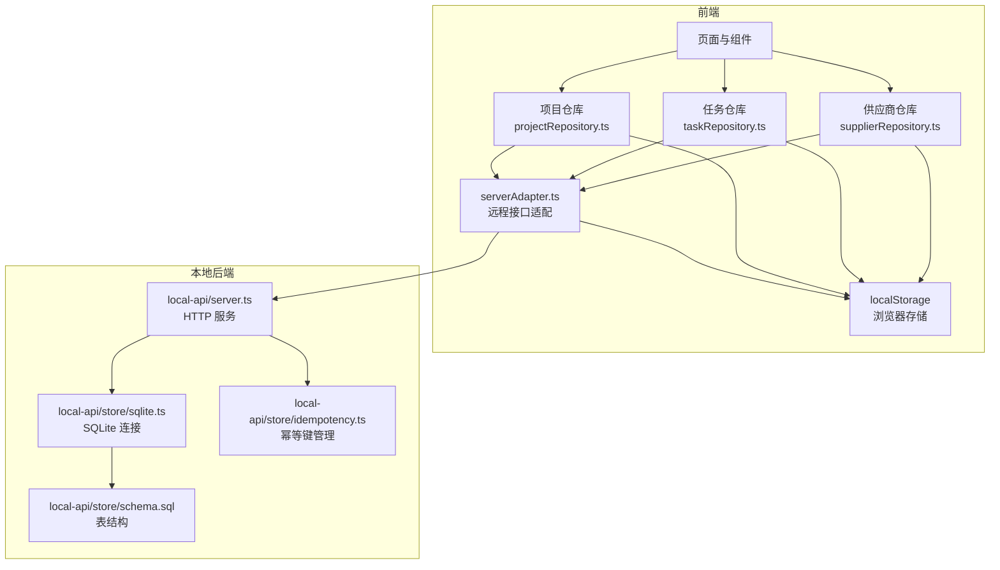
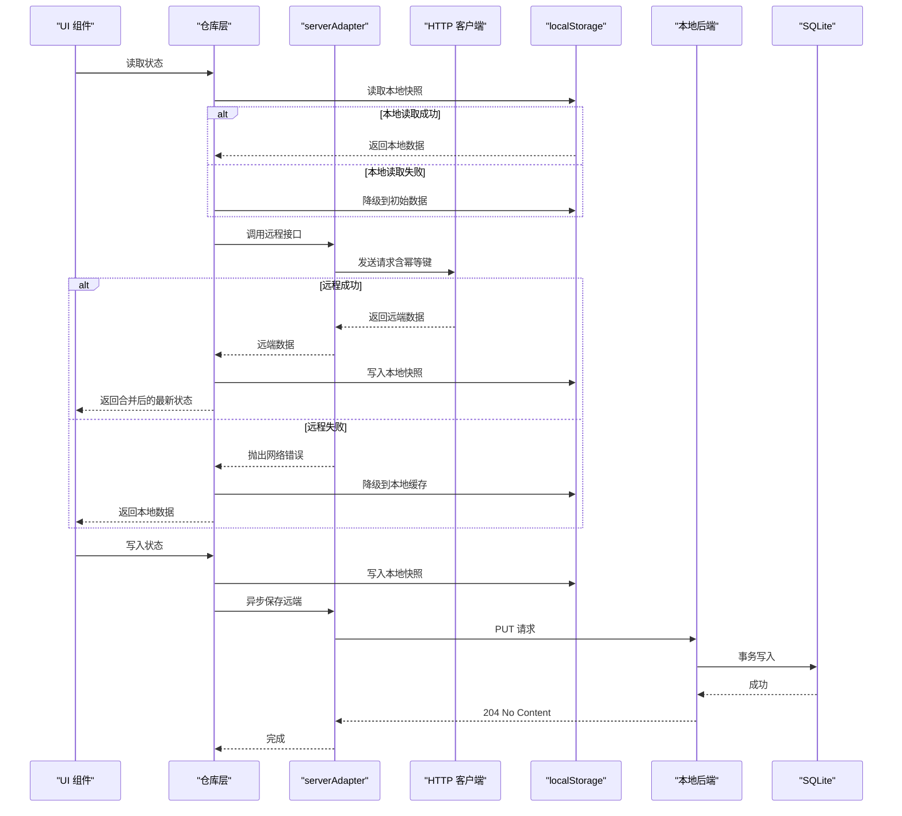
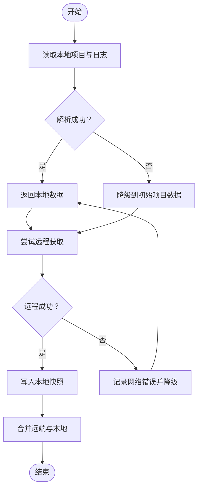
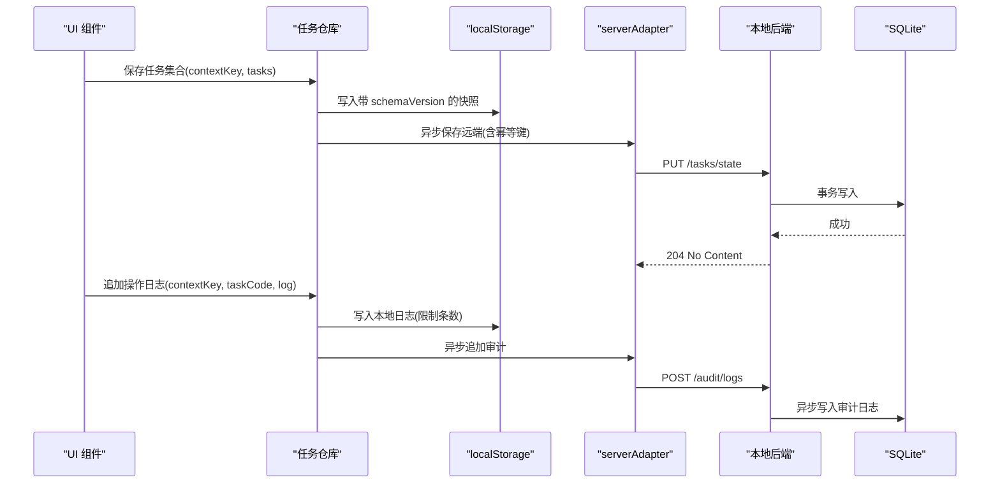
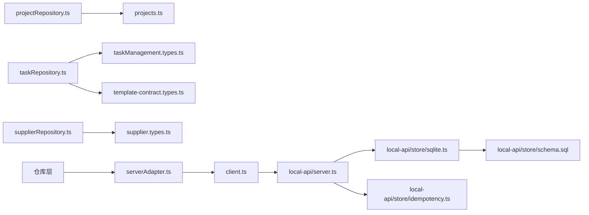
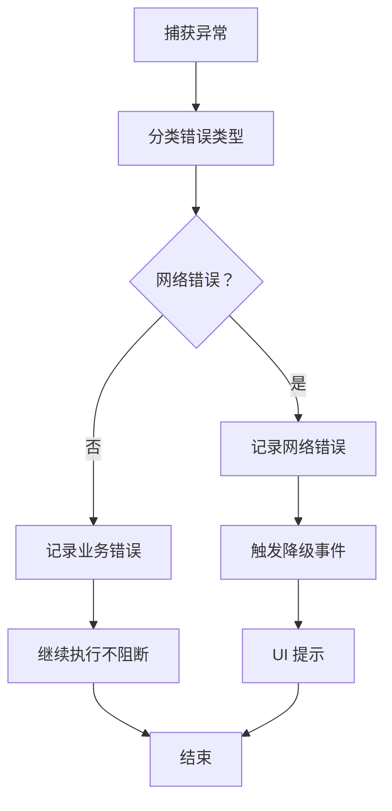

# 状态持久化策略

<cite>
**本文引用的文件**
- [projectRepository.ts](file://src/services/repositories/projectRepository.ts)
- [taskRepository.ts](file://src/services/repositories/taskRepository.ts)
- [supplierRepository.ts](file://src/services/repositories/supplierRepository.ts)
- [serverAdapter.ts](file://src/services/api/serverAdapter.ts)
- [client.ts](file://src/services/api/client.ts)
- [StructuredError.ts](file://src/services/errors/StructuredError.ts)
- [sqlite.ts](file://local-api/store/sqlite.ts)
- [schema.sql](file://local-api/store/schema.sql)
- [idempotency.ts](file://local-api/store/idempotency.ts)
- [server.ts](file://local-api/server.ts)
- [projectRepository.test.ts](file://src/services/__tests__/projectRepository.test.ts)
- [taskRepository.task-center.test.ts](file://src/services/__tests__/taskRepository.task-center.test.ts)
- [projects.ts](file://src/data/projects.ts)
- [App.tsx](file://src/App.tsx)
- [OrderManagementPage.tsx](file://src/components/orders/OrderManagementPage.tsx)
</cite>

## 目录

1. [简介](#简介)
2. [项目结构](#项目结构)
3. [核心组件](#核心组件)
4. [架构概览](#架构概览)
5. [详细组件分析](#详细组件分析)
6. [依赖关系分析](#依赖关系分析)
7. [性能考量](#性能考量)
8. [故障排查指南](#故障排查指南)
9. [结论](#结论)
10. [附录](#附录)

## 简介

本文件系统性阐述 CodeBuddy 项目的状态持久化策略，覆盖本地存储实现（localStorage）、数据结构设计、序列化与反序列化、版本管理与迁移、触发条件与降级机制、性能优化与清理策略，以及备份恢复与故障处理方案。文档基于仓库中的实际实现进行分析，确保内容可追溯且可落地。

## 项目结构

状态持久化相关代码分布在以下层次：

- 服务层仓库：负责状态读取、写入与降级策略
- API 层适配器：统一远程接口契约与幂等键生成
- 本地后端：SQLite 存储与幂等键管理
- 前端页面与组件：直接使用 localStorage 的场景
- 测试用例：验证持久化行为与兼容性

**图表来源**

- [projectRepository.ts:53-89](file://src/services/repositories/projectRepository.ts#L53-L89)
- [taskRepository.ts:141-317](file://src/services/repositories/taskRepository.ts#L141-L317)
- [supplierRepository.ts:43-56](file://src/services/repositories/supplierRepository.ts#L43-L56)
- [serverAdapter.ts:44-86](file://src/services/api/serverAdapter.ts#L44-L86)
- [client.ts:94-171](file://src/services/api/client.ts#L94-L171)
- [server.ts:159-197](file://local-api/server.ts#L159-L197)
- [sqlite.ts:18-42](file://local-api/store/sqlite.ts#L18-L42)
- [schema.sql:4-51](file://local-api/store/schema.sql#L4-L51)
- [idempotency.ts](file://local-api/store/idempotency.ts)

**章节来源**

- [projectRepository.ts:1-90](file://src/services/repositories/projectRepository.ts#L1-L90)
- [taskRepository.ts:1-318](file://src/services/repositories/taskRepository.ts#L1-L318)
- [supplierRepository.ts:1-56](file://src/services/repositories/supplierRepository.ts#L1-L56)
- [serverAdapter.ts:1-87](file://src/services/api/serverAdapter.ts#L1-L87)
- [client.ts:94-171](file://src/services/api/client.ts#L94-L171)
- [sqlite.ts:1-63](file://local-api/store/sqlite.ts#L1-L63)
- [schema.sql:1-51](file://local-api/store/schema.sql#L1-L51)
- [idempotency.ts](file://local-api/store/idempotency.ts)

## 核心组件

- 项目仓库（ProjectRepository）
  - 使用 localStorage 存储项目列表与状态日志
  - 读取失败时降级到初始数据，保证可用性
  - 写入失败时记录结构化错误，不影响主流程
- 任务仓库（TaskRepository）
  - 任务状态采用带 schemaVersion 的对象结构，兼容旧版数组快照
  - 任务操作日志限制最近 N 条，避免无限增长
  - 支持按 contextKey 分区存储，便于多项目隔离
- 供应商仓库（SupplierRepository）
  - 供应商列表直接持久化，读取失败回退到初始模板数据
- API 适配器（ServerAdapter）
  - 统一远程接口契约，生成幂等键，支持重试与降级
- 本地后端（Local API）
  - SQLite 存储项目/任务/验收/结算建议/审计日志
  - 幂等键表支持 TTL 清理，保障存储容量

**章节来源**

- [projectRepository.ts:14-51](file://src/services/repositories/projectRepository.ts#L14-L51)
- [taskRepository.ts:22-83](file://src/services/repositories/taskRepository.ts#L22-L83)
- [supplierRepository.ts:12-32](file://src/services/repositories/supplierRepository.ts#L12-L32)
- [serverAdapter.ts:38-86](file://src/services/api/serverAdapter.ts#L38-L86)
- [sqlite.ts:18-42](file://local-api/store/sqlite.ts#L18-L42)
- [schema.sql:4-51](file://local-api/store/schema.sql#L4-L51)

## 架构概览

前端通过仓库层读写 localStorage，同时调用 serverAdapter 发起远程请求。当远程不可用时，仓库层自动降级到本地缓存；当远程可用时，优先拉取远端最新状态并回写本地。本地后端提供 SQLite 存储与幂等键管理，支持审计日志异步写入。

**图表来源**

- [projectRepository.ts:54-88](file://src/services/repositories/projectRepository.ts#L54-L88)
- [taskRepository.ts:142-169](file://src/services/repositories/taskRepository.ts#L142-L169)
- [serverAdapter.ts:44-86](file://src/services/api/serverAdapter.ts#L44-L86)
- [client.ts:94-171](file://src/services/api/client.ts#L94-L171)
- [server.ts:159-197](file://local-api/server.ts#L159-L197)

## 详细组件分析

### 项目仓库（ProjectRepository）

- 存储键
  - 项目列表：固定键
  - 状态日志：固定键
- 读取策略
  - 尝试解析 localStorage；失败则降级到初始项目数据
  - 日志键缺失或格式异常时返回空对象
- 写入策略
  - 本地写入失败记录结构化错误
  - 远程保存失败同样记录错误并降级
- 触发条件
  - 页面加载时读取
  - 状态变更时写入

**图表来源**

- [projectRepository.ts:14-88](file://src/services/repositories/projectRepository.ts#L14-L88)

**章节来源**

- [projectRepository.ts:14-88](file://src/services/repositories/projectRepository.ts#L14-L88)
- [projectRepository.test.ts:55-105](file://src/services/__tests__/projectRepository.test.ts#L55-L105)

### 任务仓库（TaskRepository）

- 存储键与命名空间
  - 任务快照：带前缀与 contextKey 的分区键
  - 操作日志：带前缀与 contextKey 的分区键
  - 审计事件：固定键
- 版本管理
  - 本地快照包含 schemaVersion 字段
  - 读取时兼容旧版数组快照，自动降级为新结构
- 日志策略
  - 每个任务保留最近 N 条操作日志（测试用例显示上限）
- 触发条件
  - 加载任务时优先读取本地，失败则降级
  - 写入任务时本地立即持久化，异步保存远端
  - 追加操作日志时本地写入并异步上报审计

**图表来源**

- [taskRepository.ts:50-83](file://src/services/repositories/taskRepository.ts#L50-L83)
- [taskRepository.ts:154-195](file://src/services/repositories/taskRepository.ts#L154-L195)
- [serverAdapter.ts:57-85](file://src/services/api/serverAdapter.ts#L57-L85)
- [server.ts:159-197](file://local-api/server.ts#L159-L197)

**章节来源**

- [taskRepository.ts:22-83](file://src/services/repositories/taskRepository.ts#L22-L83)
- [taskRepository.ts:141-195](file://src/services/repositories/taskRepository.ts#L141-L195)
- [taskRepository.task-center.test.ts:53-98](file://src/services/__tests__/taskRepository.task-center.test.ts#L53-L98)

### 供应商仓库（SupplierRepository）

- 存储键：固定键
- 读取策略：解析失败或格式异常时回退到初始模板数据
- 写入策略：本地持久化，忽略存储异常

**章节来源**

- [supplierRepository.ts:12-32](file://src/services/repositories/supplierRepository.ts#L12-L32)

### 前端直接使用 localStorage 的场景

- 项目页面早期读取：从 localStorage 读取项目与日志，解析失败回退到初始数据
- 订单管理页面：订单列表与流程日志直接从 localStorage 读取，解析失败返回空值或空对象

**章节来源**

- [App.tsx:180-206](file://src/App.tsx#L180-L206)
- [OrderManagementPage.tsx:216-240](file://src/components/orders/OrderManagementPage.tsx#L216-L240)

## 依赖关系分析

- 仓库层依赖
  - 项目仓库依赖初始项目数据与状态机日志类型
  - 任务仓库依赖任务类型与审计事件类型
  - 供应商仓库依赖供应商类型
- API 层依赖
  - serverAdapter 统一生成幂等键并发起请求
  - client 提供网络重试、错误分类与降级事件
- 本地后端依赖
  - SQLite 初始化与 WAL 模式
  - 幂等键表与审计日志表结构
  - 事务写入与 TTL 清理

**图表来源**

- [projectRepository.ts:1-4](file://src/services/repositories/projectRepository.ts#L1-L4)
- [taskRepository.ts:1-3](file://src/services/repositories/taskRepository.ts#L1-L3)
- [supplierRepository.ts:1-2](file://src/services/repositories/supplierRepository.ts#L1-L2)
- [serverAdapter.ts:1-5](file://src/services/api/serverAdapter.ts#L1-L5)
- [client.ts:94-171](file://src/services/api/client.ts#L94-L171)
- [sqlite.ts:18-42](file://local-api/store/sqlite.ts#L18-L42)
- [schema.sql:4-51](file://local-api/store/schema.sql#L4-L51)
- [idempotency.ts](file://local-api/store/idempotency.ts)

**章节来源**

- [projects.ts:1-451](file://src/data/projects.ts#L1-L451)
- [serverAdapter.ts:1-87](file://src/services/api/serverAdapter.ts#L1-L87)
- [client.ts:94-171](file://src/services/api/client.ts#L94-L171)
- [sqlite.ts:18-42](file://local-api/store/sqlite.ts#L18-L42)
- [schema.sql:4-51](file://local-api/store/schema.sql#L4-L51)

## 性能考量

- 存储容量控制
  - 任务操作日志限制最近 N 条，避免无限增长
  - 供应商与项目列表为小体量数据，通常不会成为瓶颈
- 清理策略
  - 本地后端提供幂等键清理函数，定期删除过期键
  - 建议在应用启动时或定时任务中调用清理函数
- 内存管理
  - 读取失败时回退到初始数据，避免空引用
  - 写入失败记录错误但不抛出异常，保证 UI 流畅
- 并发与一致性
  - 本地后端使用 SQLite 事务写入，保障原子性
  - 幂等键集中管理，避免重复写入

**章节来源**

- [taskRepository.ts:175-181](file://src/services/repositories/taskRepository.ts#L175-L181)
- [sqlite.ts:65-80](file://local-api/store/sqlite.ts#L65-L80)
- [idempotency.ts](file://local-api/store/idempotency.ts)

## 故障排查指南

- 错误分类与日志
  - 使用结构化错误模型记录错误码、作用域、场景、状态码与幂等键
  - 错误日志包含可追踪字符串与 JSON 结构，便于定位
- 降级机制
  - 远程请求失败时自动降级到本地缓存
  - 本地读取失败时回退到初始数据
- 幂等冲突处理
  - 生成幂等键并在服务端校验，避免重复写入
  - 冲突时返回特定错误码并记录幂等键
- 网络异常
  - 客户端提供重试与降级事件，失败后触发用户提示

**图表来源**

- [StructuredError.ts:27-52](file://src/services/errors/StructuredError.ts#L27-L52)
- [client.ts:94-171](file://src/services/api/client.ts#L94-L171)
- [projectRepository.ts:66-73](file://src/services/repositories/projectRepository.ts#L66-L73)

**章节来源**

- [StructuredError.ts:1-195](file://src/services/errors/StructuredError.ts#L1-L195)
- [client.ts:94-171](file://src/services/api/client.ts#L94-L171)
- [projectRepository.ts:66-88](file://src/services/repositories/projectRepository.ts#L66-L88)

## 结论

CodeBuddy 的状态持久化策略以 localStorage 为基础，结合结构化错误与幂等键管理，实现了可靠的本地缓存与远程同步。通过版本化快照与兼容读取，保证了数据演进的平滑过渡；通过降级与清理策略，提升了系统的鲁棒性与性能。本地后端进一步增强了事务一致性与审计能力，为后续扩展提供了坚实基础。

## 附录

- 数据序列化与反序列化
  - 所有本地存储均采用 JSON 转换
  - 解析失败时进行类型校验与回退
- 版本管理与迁移
  - 任务快照引入 schemaVersion 字段
  - 读取时兼容旧版数组快照，自动迁移
- 触发条件与策略
  - 加载：优先本地，失败降级
  - 保存：本地立即持久化，远端异步写入
  - 手动触发：页面加载与状态变更时调用仓库方法
- 备份与恢复
  - 建议定期导出 localStorage 中的关键键值
  - 本地后端可作为远端备份的替代方案
- 故障处理
  - 本地异常记录并降级
  - 远程异常触发 UI 提示与重试
