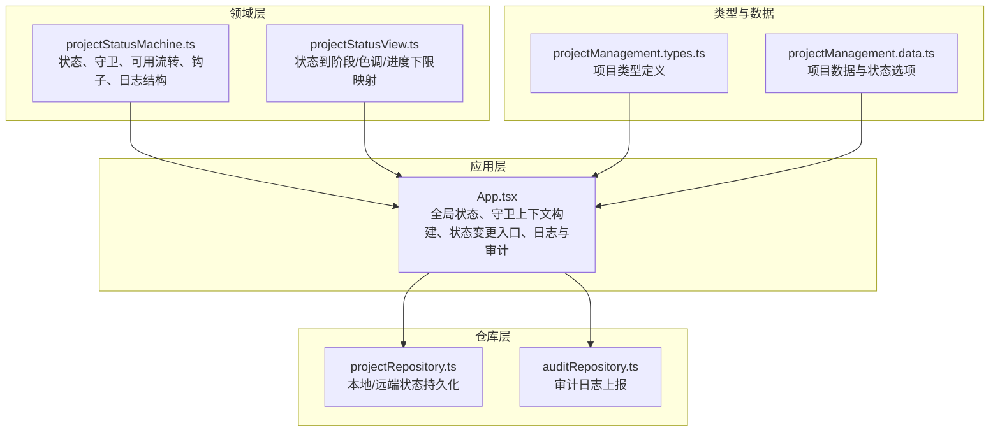
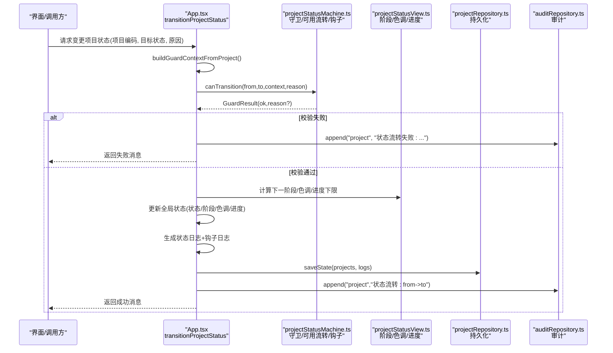
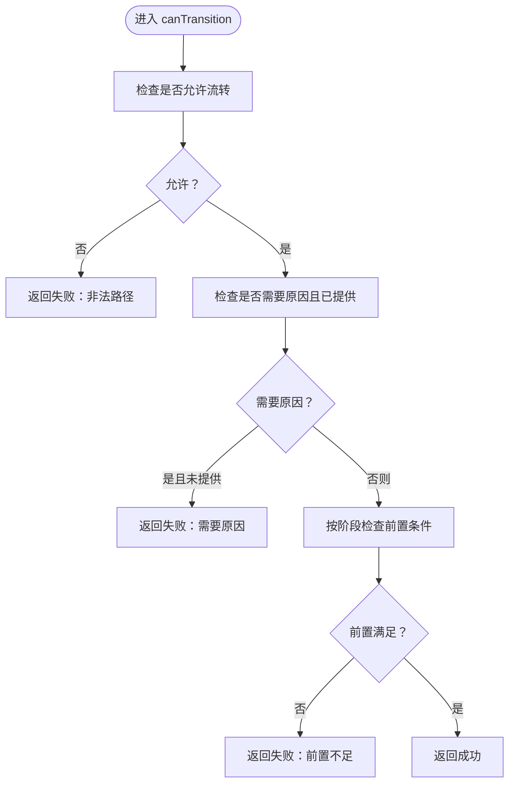
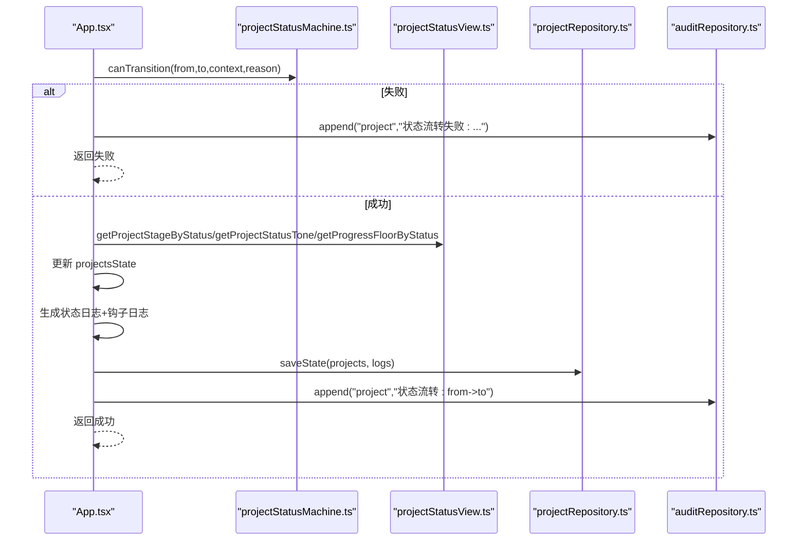
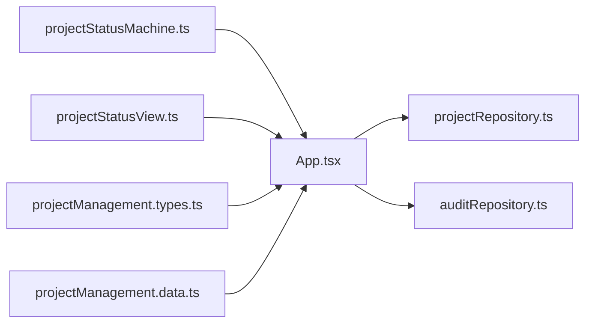

# 状态机集成

<cite>
**本文引用的文件**
- [projectStatusMachine.ts](file://src/domain/projectStatusMachine.ts)
- [projectStatusView.ts](file://src/domain/projectStatusView.ts)
- [App.tsx](file://src/App.tsx)
- [projectRepository.ts](file://src/services/repositories/projectRepository.ts)
- [auditRepository.ts](file://src/services/repositories/auditRepository.ts)
- [projectStatusMachine.test.ts](file://src/domain/__tests__/projectStatusMachine.test.ts)
- [projectManagement.types.ts](file://src/components/personnel/projectManagement.types.ts)
- [projectManagement.data.ts](file://src/components/personnel/projectManagement.data.ts)
- [state-machine-design.md](file://docs/02-architecture/state-machine-design.md)
- [CODEBUDDY.md](file://CODEBUDDY.md)
</cite>

## 目录

1. [简介](#简介)
2. [项目结构](#项目结构)
3. [核心组件](#核心组件)
4. [架构总览](#架构总览)
5. [详细组件分析](#详细组件分析)
6. [依赖关系分析](#依赖关系分析)
7. [性能考量](#性能考量)
8. [故障排查指南](#故障排查指南)
9. [结论](#结论)
10. [附录](#附录)

## 简介

本文件面向 CodeBuddy 项目的“状态机集成”，系统性阐述项目状态机在状态管理中的核心作用，包括：

- 状态转换验证与守卫条件执行
- 守卫上下文的构建与使用
- 状态钩子（进入状态时的自动处理）与副作用管理
- 状态日志与审计追踪
- 与全局状态的集成方式（状态转换函数调用、状态验证逻辑、错误处理）
- 最佳实践与性能优化建议

## 项目结构

项目状态机位于领域层（src/domain），并与应用层（src/App.tsx）、仓库层（src/services/repositories）及视图工具（src/domain/projectStatusView.ts）协作，形成“状态定义—守卫校验—状态变更—日志与审计—持久化”的闭环。

图表来源

- [projectStatusMachine.ts:1-164](file://src/domain/projectStatusMachine.ts#L1-L164)
- [projectStatusView.ts:1-89](file://src/domain/projectStatusView.ts#L1-L89)
- [App.tsx:207-224](file://src/App.tsx#L207-L224)
- [projectRepository.ts:1-90](file://src/services/repositories/projectRepository.ts#L1-L90)
- [auditRepository.ts:1-26](file://src/services/repositories/auditRepository.ts#L1-L26)
- [projectManagement.types.ts:1-168](file://src/components/personnel/projectManagement.types.ts#L1-L168)
- [projectManagement.data.ts:1-313](file://src/components/personnel/projectManagement.data.ts#L1-L313)

章节来源

- [projectStatusMachine.ts:1-164](file://src/domain/projectStatusMachine.ts#L1-L164)
- [projectStatusView.ts:1-89](file://src/domain/projectStatusView.ts#L1-L89)
- [App.tsx:207-224](file://src/App.tsx#L207-L224)
- [projectRepository.ts:1-90](file://src/services/repositories/projectRepository.ts#L1-L90)
- [auditRepository.ts:1-26](file://src/services/repositories/auditRepository.ts#L1-L26)
- [projectManagement.types.ts:1-168](file://src/components/personnel/projectManagement.types.ts#L1-L168)
- [projectManagement.data.ts:1-313](file://src/components/personnel/projectManagement.data.ts#L1-L313)

## 核心组件

- 状态与守卫
  - 状态枚举、可用流转、守卫上下文、守卫结果、状态日志条目结构
  - 守卫函数：基于“允许流转矩阵 + 业务规则 + 原因必填约束”进行校验
- 视图工具
  - 将状态映射为阶段、色调、进度下限，提供状态归一化与进度计算
- 应用入口
  - 全局状态（项目主数据、状态日志）与守卫上下文构建
  - 统一的状态变更入口（transitionProjectStatus），负责更新状态、阶段、色调、进度，生成日志与钩子日志，并写入审计
- 仓库与持久化
  - 本地/远端状态持久化（localStorage 与服务端适配器）
  - 审计日志上报（网络异常时降级记录结构化错误）

章节来源

- [projectStatusMachine.ts:1-164](file://src/domain/projectStatusMachine.ts#L1-L164)
- [projectStatusView.ts:1-89](file://src/domain/projectStatusView.ts#L1-L89)
- [App.tsx:439-504](file://src/App.tsx#L439-L504)
- [projectRepository.ts:1-90](file://src/services/repositories/projectRepository.ts#L1-L90)
- [auditRepository.ts:1-26](file://src/services/repositories/auditRepository.ts#L1-L26)

## 架构总览

状态机驱动的项目状态变更流程如下：

图表来源

- [App.tsx:439-504](file://src/App.tsx#L439-L504)
- [projectStatusMachine.ts:105-163](file://src/domain/projectStatusMachine.ts#L105-L163)
- [projectStatusView.ts:4-88](file://src/domain/projectStatusView.ts#L4-L88)
- [projectRepository.ts:76-89](file://src/services/repositories/projectRepository.ts#L76-L89)
- [auditRepository.ts:7-24](file://src/services/repositories/auditRepository.ts#L7-L24)

## 详细组件分析

### 状态与守卫（projectStatusMachine.ts）

- 状态与可用流转
  - 定义项目二级状态集合与允许的单向流转矩阵
  - 提供“可用流转选项”（含标签与“是否需要原因”标记）
- 守卫上下文与结果
  - 守卫上下文包含项目关键条件（容器、审批、里程碑、任务树、标准绑定、关键任务完成率、验收结果、整改闭环、结算完成等）
  - 守卫结果包含布尔开关与可选原因
- 守卫代码解析
  - 对“整改中/已中止”等需要原因的流转，解析为“REASON_REQUIRED”或“from->to”
- 核心守卫逻辑
  - 非法路径直接拒绝
  - “整改中/已中止”必须提供原因
  - 各阶段前置条件（如“待确认->待拆解”需审批完成；“待拆解->执行中”需里程碑/任务树/标准绑定齐全等）

图表来源

- [projectStatusMachine.ts:105-163](file://src/domain/projectStatusMachine.ts#L105-L163)

章节来源

- [projectStatusMachine.ts:1-164](file://src/domain/projectStatusMachine.ts#L1-L164)
- [projectStatusMachine.test.ts:1-125](file://src/domain/__tests__/projectStatusMachine.test.ts#L1-L125)

### 视图工具（projectStatusView.ts）

- 状态到阶段映射：将二级状态归入“启动/计划/执行/监控/收尾”
- 状态色调：根据状态映射为蓝色/黄色/绿色/红色，用于界面提示
- 归一化：将历史/兼容状态字符串映射到二级状态
- 进度下限：为“状态变更”提供进度下限策略（如“已归档”强制100%，其他状态取当前进度与状态下限的最大值）

章节来源

- [projectStatusView.ts:1-89](file://src/domain/projectStatusView.ts#L1-L89)

### 应用入口与全局状态集成（App.tsx）

- 守卫上下文构建
  - 从项目实体（里程碑/任务进度、模板ID、阶段、风险级别、进度等）解析守卫上下文
- 统一状态变更入口
  - transitionProjectStatus：校验守卫、计算下一阶段/色调/进度、更新全局状态
  - 生成“状态变更日志”和“进入状态钩子日志”，限制日志长度
  - 写入审计（无论成功/失败均记录）
- 持久化与降级
  - 本地持久化（localStorage）与远端同步，网络异常时降级并记录结构化错误

图表来源

- [App.tsx:439-504](file://src/App.tsx#L439-L504)
- [projectStatusMachine.ts:105-163](file://src/domain/projectStatusMachine.ts#L105-L163)
- [projectStatusView.ts:4-88](file://src/domain/projectStatusView.ts#L4-L88)
- [projectRepository.ts:76-89](file://src/services/repositories/projectRepository.ts#L76-L89)
- [auditRepository.ts:7-24](file://src/services/repositories/auditRepository.ts#L7-L24)

章节来源

- [App.tsx:207-224](file://src/App.tsx#L207-L224)
- [App.tsx:439-504](file://src/App.tsx#L439-L504)
- [projectRepository.ts:1-90](file://src/services/repositories/projectRepository.ts#L1-L90)
- [auditRepository.ts:1-26](file://src/services/repositories/auditRepository.ts#L1-L26)

### 仓库与持久化（projectRepository.ts）

- 本地状态结构：项目主数据与项目状态日志
- 加载策略：优先远端，失败则降级本地；成功后同步至本地
- 保存策略：本地持久化后尝试远端同步，失败记录结构化错误

章节来源

- [projectRepository.ts:1-90](file://src/services/repositories/projectRepository.ts#L1-L90)

### 审计与日志（auditRepository.ts）

- 审计接口：scene（项目/任务/验收/结算/系统）、detail、projectCode
- 错误降级：网络异常时记录结构化错误，不阻断主流程

章节来源

- [auditRepository.ts:1-26](file://src/services/repositories/auditRepository.ts#L1-L26)

### 类型与数据（projectManagement.types.ts、projectManagement.data.ts）

- 类型定义：项目实体、阶段、状态、风险级别、任务/里程碑/阶段/成员等
- 数据：项目列表、状态选项、模板选项等

章节来源

- [projectManagement.types.ts:1-168](file://src/components/personnel/projectManagement.types.ts#L1-L168)
- [projectManagement.data.ts:1-313](file://src/components/personnel/projectManagement.data.ts#L1-L313)

## 依赖关系分析

- 领域层对应用层的依赖
  - App.tsx 导入状态机与视图工具，调用守卫与可用流转函数
- 应用层对仓库层的依赖
  - 通过 projectRepository.ts 读写全局状态；通过 auditRepository.ts 写审计
- 仓库层对错误处理的依赖
  - 使用结构化错误记录器，保证异常可追踪

图表来源

- [projectStatusMachine.ts:1-164](file://src/domain/projectStatusMachine.ts#L1-L164)
- [projectStatusView.ts:1-89](file://src/domain/projectStatusView.ts#L1-L89)
- [App.tsx:26-37](file://src/App.tsx#L26-L37)
- [projectRepository.ts:1-90](file://src/services/repositories/projectRepository.ts#L1-L90)
- [auditRepository.ts:1-26](file://src/services/repositories/auditRepository.ts#L1-L26)
- [projectManagement.types.ts:1-168](file://src/components/personnel/projectManagement.types.ts#L1-L168)
- [projectManagement.data.ts:1-313](file://src/components/personnel/projectManagement.data.ts#L1-L313)

章节来源

- [App.tsx:26-37](file://src/App.tsx#L26-L37)
- [projectStatusMachine.ts:1-164](file://src/domain/projectStatusMachine.ts#L1-L164)
- [projectStatusView.ts:1-89](file://src/domain/projectStatusView.ts#L1-L89)
- [projectRepository.ts:1-90](file://src/services/repositories/projectRepository.ts#L1-L90)
- [auditRepository.ts:1-26](file://src/services/repositories/auditRepository.ts#L1-L26)
- [projectManagement.types.ts:1-168](file://src/components/personnel/projectManagement.types.ts#L1-L168)
- [projectManagement.data.ts:1-313](file://src/components/personnel/projectManagement.data.ts#L1-L313)

## 性能考量

- 守卫计算复杂度
  - 守卫函数为常数时间检查（数组包含、简单条件判断），复杂度 O(1)
- 日志与钩子
  - 日志写入为 O(n)（n 为状态变更次数），但限制保留最近 N 条，避免无限增长
- 持久化
  - 本地持久化为 JSON 序列化/反序列化，整体 O(k)（k 为项目数量）
- 建议
  - 对高频状态变更，可考虑节流/去抖（例如在 UI 层限制点击频率）
  - 对大量项目列表，避免在渲染路径重复计算守卫上下文，可在组件外层 memo 化
  - 对日志上限可根据业务规模调整，确保内存占用可控

[本节为通用性能讨论，无需特定文件引用]

## 故障排查指南

- 常见问题
  - “整改中/已中止”未填写原因导致流转失败
  - “待确认->待拆解”审批未完成
  - “待拆解->执行中”缺少里程碑/任务树/标准绑定
  - “待验收->待结算”验收未通过或整改未闭环
  - “待结算->已归档”结算未完成
- 定位方法
  - 查看守卫返回的原因字符串
  - 检查守卫上下文构建逻辑（里程碑/任务进度、模板ID、阶段、风险级别、进度）
  - 核对可用流转选项与标签
- 审计与日志
  - 审计记录包含场景、详情与项目编码
  - 状态日志包含时间戳、操作者、来源状态、目标状态、原因与消息
- 降级与容错
  - 远端加载/保存失败会降级到本地缓存，并记录结构化错误

章节来源

- [projectStatusMachine.ts:105-163](file://src/domain/projectStatusMachine.ts#L105-L163)
- [App.tsx:439-504](file://src/App.tsx#L439-L504)
- [projectRepository.ts:54-89](file://src/services/repositories/projectRepository.ts#L54-L89)
- [auditRepository.ts:7-24](file://src/services/repositories/auditRepository.ts#L7-L24)

## 结论

CodeBuddy 的项目状态机通过“清晰的状态定义 + 严格的守卫校验 + 可观测的日志与审计 + 本地/远端双持久化”实现了可演进、可追溯、可降级的状态管理闭环。应用层以统一入口承载状态变更，既保证了业务规则的一致性，也为后续扩展（如联动规则、通知与事件）提供了稳定基座。

[本节为总结性内容，无需特定文件引用]

## 附录

### 状态机设计原则与规范（摘自架构文档）

- 单一真实状态、动作触发流转、条件校验先行、关键节点留痕、人工兜底受控、对象状态分离、兼容 Agent
- 适用范围：项目、任务、采购、验收、资产归档、结算、工单、Agent 执行记录
- 事件、通知与副作用：统一事件类型、标准化通知模板、常见副作用（站内通知、待办、SLA、Agent、检查项、整改任务、风险重算、日志）
- 权限与人工干预：区分查看与流转权限、显式支持人工动作、干预需原因与记录

章节来源

- [state-machine-design.md:22-800](file://docs/02-architecture/state-machine-design.md#L22-L800)

### 项目状态机在系统中的角色与边界（摘自 CODEBUDDY.md）

- App.tsx 持有项目主数据与状态日志，分别持久化到 localStorage
- 状态机驱动流程主线：状态定义、合法流转、守卫校验、统一入口更新、日志与钩子、审计

章节来源

- [CODEBUDDY.md:34-52](file://CODEBUDDY.md#L34-L52)
