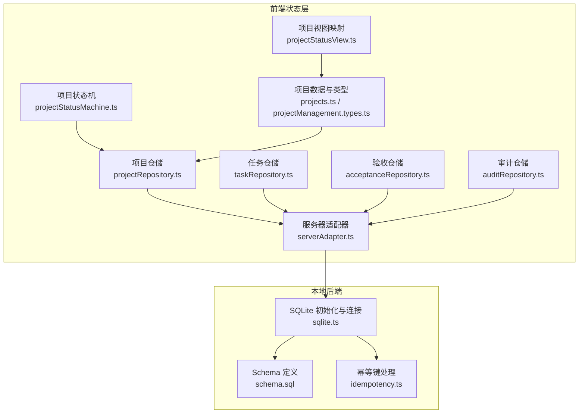
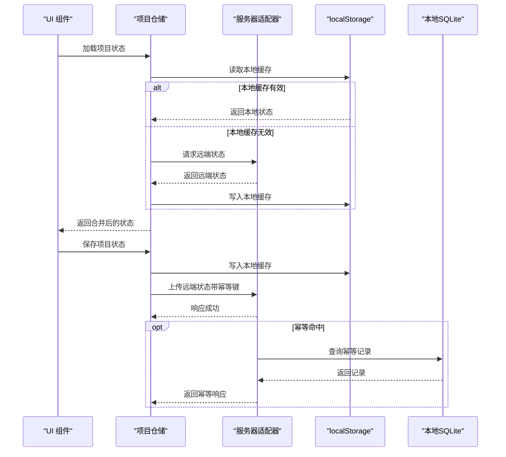
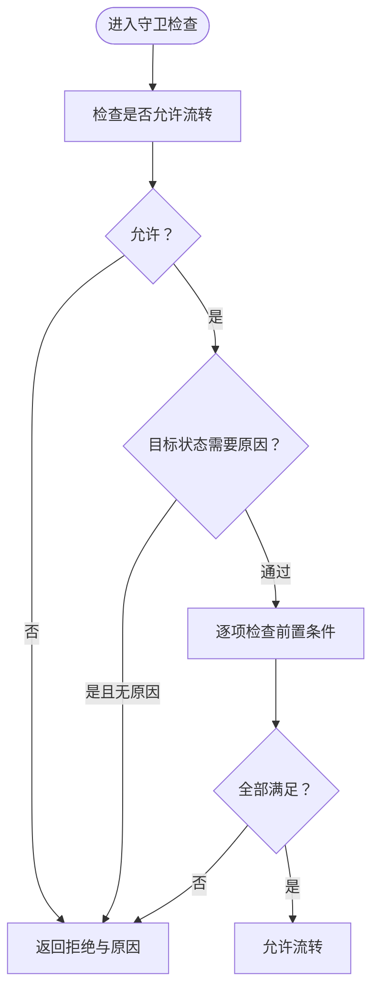
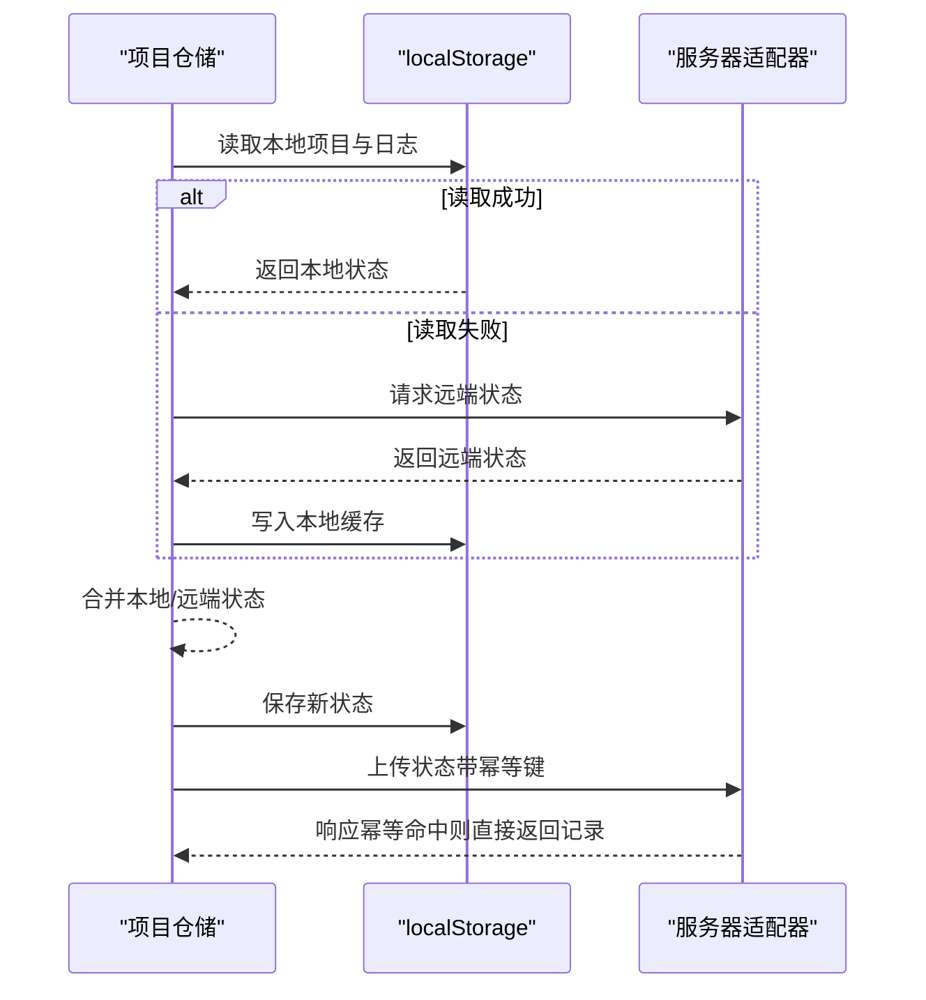
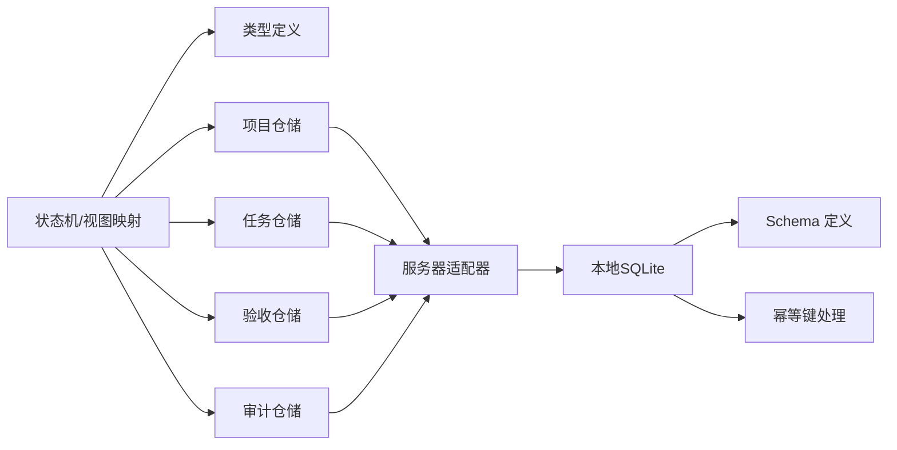

# 状态管理

<cite>
**本文引用的文件**
- [src/domain/projectStatusMachine.ts](file://src/domain/projectStatusMachine.ts)
- [src/domain/projectStatusView.ts](file://src/domain/projectStatusView.ts)
- [src/data/projects.ts](file://src/data/projects.ts)
- [src/services/repositories/projectRepository.ts](file://src/services/repositories/projectRepository.ts)
- [src/services/repositories/taskRepository.ts](file://src/services/repositories/taskRepository.ts)
- [src/services/repositories/acceptanceRepository.ts](file://src/services/repositories/acceptanceRepository.ts)
- [src/services/repositories/auditRepository.ts](file://src/services/repositories/auditRepository.ts)
- [src/services/api/serverAdapter.ts](file://src/services/api/serverAdapter.ts)
- [src/services/errors/StructuredError.ts](file://src/services/errors/StructuredError.ts)
- [src/components/personnel/projectManagement.types.ts](file://src/components/personnel/projectManagement.types.ts)
- [src/components/personnel/projectManagement.selectors.ts](file://src/components/personnel/projectManagement.selectors.ts)
- [local-api/store/sqlite.ts](file://local-api/store/sqlite.ts)
- [local-api/store/schema.sql](file://local-api/store/schema.sql)
- [local-api/store/idempotency.ts](file://local-api/store/idempotency.ts)
- [src/domain/__tests__/projectStatusMachine.test.ts](file://src/domain/__tests__/projectStatusMachine.test.ts)
</cite>

## 目录

1. [简介](#简介)
2. [项目结构](#项目结构)
3. [核心组件](#核心组件)
4. [架构总览](#架构总览)
5. [详细组件分析](#详细组件分析)
6. [依赖关系分析](#依赖关系分析)
7. [性能考量](#性能考量)
8. [故障排查指南](#故障排查指南)
9. [结论](#结论)
10. [附录](#附录)

## 简介

本文件系统性梳理 CodeBuddy 项目的“状态管理”实现，涵盖全局状态设计模式、状态结构与更新机制、本地与远程状态同步与持久化策略、状态变更日志与审计、状态机驱动的状态转换与守卫、以及状态管理与仓储层的集成方式。文档同时提供最佳实践、性能优化建议与调试排障指南，帮助开发者在复杂项目场景下保持状态一致性与可观测性。

## 项目结构

围绕状态管理的关键文件分布如下：

- 领域层：项目状态机与视图映射
- 数据层：项目初始数据与类型定义
- 仓储层：项目、任务、验收、审计状态的本地/远程读写
- 适配层：统一 API 请求与幂等键生成
- 本地后端：SQLite 存储与幂等键清理
- 测试与工具：状态机行为测试与错误结构化

图表来源

- [src/domain/projectStatusMachine.ts:1-164](file://src/domain/projectStatusMachine.ts#L1-L164)
- [src/domain/projectStatusView.ts:1-89](file://src/domain/projectStatusView.ts#L1-L89)
- [src/data/projects.ts:1-451](file://src/data/projects.ts#L1-L451)
- [src/services/repositories/projectRepository.ts:1-90](file://src/services/repositories/projectRepository.ts#L1-L90)
- [src/services/repositories/taskRepository.ts:1-318](file://src/services/repositories/taskRepository.ts#L1-L318)
- [src/services/repositories/acceptanceRepository.ts:1-56](file://src/services/repositories/acceptanceRepository.ts#L1-L56)
- [src/services/repositories/auditRepository.ts:1-26](file://src/services/repositories/auditRepository.ts#L1-L26)
- [src/services/api/serverAdapter.ts:1-87](file://src/services/api/serverAdapter.ts#L1-L87)
- [local-api/store/sqlite.ts:1-99](file://local-api/store/sqlite.ts#L1-L99)
- [local-api/store/schema.sql:1-72](file://local-api/store/schema.sql#L1-L72)
- [local-api/store/idempotency.ts:1-100](file://local-api/store/idempotency.ts#L1-L100)

章节来源

- [src/domain/projectStatusMachine.ts:1-164](file://src/domain/projectStatusMachine.ts#L1-L164)
- [src/domain/projectStatusView.ts:1-89](file://src/domain/projectStatusView.ts#L1-L89)
- [src/data/projects.ts:1-451](file://src/data/projects.ts#L1-L451)
- [src/services/repositories/projectRepository.ts:1-90](file://src/services/repositories/projectRepository.ts#L1-L90)
- [src/services/repositories/taskRepository.ts:1-318](file://src/services/repositories/taskRepository.ts#L1-L318)
- [src/services/repositories/acceptanceRepository.ts:1-56](file://src/services/repositories/acceptanceRepository.ts#L1-L56)
- [src/services/repositories/auditRepository.ts:1-26](file://src/services/repositories/auditRepository.ts#L1-L26)
- [src/services/api/serverAdapter.ts:1-87](file://src/services/api/serverAdapter.ts#L1-L87)
- [local-api/store/sqlite.ts:1-99](file://local-api/store/sqlite.ts#L1-L99)
- [local-api/store/schema.sql:1-72](file://local-api/store/schema.sql#L1-L72)
- [local-api/store/idempotency.ts:1-100](file://local-api/store/idempotency.ts#L1-L100)

## 核心组件

- 项目状态机与守卫：定义状态枚举、允许流转、守卫条件与提示文案，并提供“可用流转”列表与“进入状态钩子”。
- 项目视图映射：将状态映射为阶段、色调与进度底限，支持规范化输入状态。
- 项目数据与类型：定义项目实体、阶段、里程碑、任务树、风险与成员等扩展字段。
- 仓储层：封装本地 localStorage 与远端服务的读写，提供降级策略与幂等键保障。
- 服务器适配器：统一封装 GET/PUT 请求、环境参数注入与幂等键传递。
- 本地后端：SQLite 表结构与幂等键清理，支撑审计日志与状态快照持久化。
- 错误结构化：统一错误模型与日志格式，便于排障与监控。

章节来源

- [src/domain/projectStatusMachine.ts:1-164](file://src/domain/projectStatusMachine.ts#L1-L164)
- [src/domain/projectStatusView.ts:1-89](file://src/domain/projectStatusView.ts#L1-L89)
- [src/data/projects.ts:1-451](file://src/data/projects.ts#L1-L451)
- [src/services/repositories/projectRepository.ts:1-90](file://src/services/repositories/projectRepository.ts#L1-L90)
- [src/services/repositories/taskRepository.ts:1-318](file://src/services/repositories/taskRepository.ts#L1-L318)
- [src/services/repositories/acceptanceRepository.ts:1-56](file://src/services/repositories/acceptanceRepository.ts#L1-L56)
- [src/services/repositories/auditRepository.ts:1-26](file://src/services/repositories/auditRepository.ts#L1-L26)
- [src/services/api/serverAdapter.ts:1-87](file://src/services/api/serverAdapter.ts#L1-L87)
- [local-api/store/sqlite.ts:1-99](file://local-api/store/sqlite.ts#L1-L99)
- [local-api/store/schema.sql:1-72](file://local-api/store/schema.sql#L1-L72)
- [local-api/store/idempotency.ts:1-100](file://local-api/store/idempotency.ts#L1-L100)
- [src/services/errors/StructuredError.ts:1-195](file://src/services/errors/StructuredError.ts#L1-L195)

## 架构总览

前端状态管理采用“领域状态机 + 仓储层 + 本地/远程双持久化”的架构。状态机负责约束流转合法性，仓储层负责读取/写入本地与远端，服务器适配器统一请求与幂等键，本地后端提供 SQLite 存储与幂等键校验，审计仓储负责事件记录。

图表来源

- [src/services/repositories/projectRepository.ts:54-88](file://src/services/repositories/projectRepository.ts#L54-L88)
- [src/services/api/serverAdapter.ts:44-86](file://src/services/api/serverAdapter.ts#L44-L86)
- [local-api/store/idempotency.ts:23-58](file://local-api/store/idempotency.ts#L23-L58)
- [local-api/store/sqlite.ts:18-42](file://local-api/store/sqlite.ts#L18-L42)

## 详细组件分析

### 项目状态机与守卫

- 状态枚举与允许流转：定义项目状态集合与状态间的允许转换矩阵，确保业务流程合规。
- 可用流转与标签：根据当前状态返回可选目标状态及展示标签，部分流转需要填写原因。
- 进入状态钩子：在进入特定状态时触发联动动作（示例：任务树初始化、风险重算、验收摘要生成）。
- 守卫条件：基于 GuardContext 的多项前置条件判断，如容器、审批、里程碑、任务树、标准绑定、关键任务完成、验收结果、整改闭环、结算完成等；对“整改中”“已中止”等状态强制要求原因。
- 日志条目：提供状态流转与钩子的审计条目结构，包含操作者、时间戳、消息与必要上下文。

图表来源

- [src/domain/projectStatusMachine.ts:105-163](file://src/domain/projectStatusMachine.ts#L105-L163)

章节来源

- [src/domain/projectStatusMachine.ts:1-164](file://src/domain/projectStatusMachine.ts#L1-L164)
- [src/domain/**tests**/projectStatusMachine.test.ts:1-125](file://src/domain/__tests__/projectStatusMachine.test.ts#L1-L125)

### 项目视图映射与状态规范化

- 阶段映射：将状态映射为“启动/计划/执行/监控/收尾”，用于界面分组与看板布局。
- 色调映射：根据状态映射为蓝色/黄色/绿色/红色，用于状态标签与进度可视化。
- 进度底限：不同状态对应不同的进度底限，用于进度计算与展示。
- 状态规范化：将非标准状态文本映射为标准状态，增强兼容性。

章节来源

- [src/domain/projectStatusView.ts:1-89](file://src/domain/projectStatusView.ts#L1-L89)

### 项目数据与类型

- 项目实体扩展：在基础实体上扩展预算、团队规模、日期范围、派单/执行/验收/结算状态、待办数量与阶段/里程碑/任务树/风险/成员等字段。
- 类型定义：统一导出项目阶段、状态、风险等级、分页与过滤等类型，支撑 UI 与仓储层契约。

章节来源

- [src/data/projects.ts:1-451](file://src/data/projects.ts#L1-L451)
- [src/components/personnel/projectManagement.types.ts:1-168](file://src/components/personnel/projectManagement.types.ts#L1-L168)

### 项目仓储：状态结构、更新与持久化

- 状态结构：包含项目列表与按项目维度的日志映射。
- 本地持久化：使用 localStorage 存储项目列表与日志，键名区分版本。
- 远程同步：优先读取远端最新状态，成功后写回本地；失败则回退到本地缓存。
- 保存策略：先写本地，再尝试写远端；远端失败同样回退，保证离线可用。
- 错误降级：通过结构化错误记录异常，避免阻断主流程。

图表来源

- [src/services/repositories/projectRepository.ts:54-88](file://src/services/repositories/projectRepository.ts#L54-L88)
- [src/services/api/serverAdapter.ts:44-86](file://src/services/api/serverAdapter.ts#L44-L86)
- [local-api/store/idempotency.ts:23-58](file://local-api/store/idempotency.ts#L23-L58)

章节来源

- [src/services/repositories/projectRepository.ts:1-90](file://src/services/repositories/projectRepository.ts#L1-L90)
- [src/services/errors/StructuredError.ts:1-195](file://src/services/errors/StructuredError.ts#L1-L195)

### 任务仓储：上下文隔离与操作日志

- 上下文键隔离：任务状态按 contextKey 分离，支持多项目/多场景并行。
- 本地 Schema 版本：任务状态包含 schemaVersion，便于后续迁移。
- 操作日志：维护每个任务的操作日志队列，限制长度并支持远端审计上报。
- 整改任务生成：基于验收节点自动生成整改任务，保留来源任务关键属性并写入本地与远端审计。

章节来源

- [src/services/repositories/taskRepository.ts:1-318](file://src/services/repositories/taskRepository.ts#L1-L318)

### 验收仓储：项目维度状态快照

- 项目维度存储：按 projectCode 维度存储验收节点、里程碑与汇总信息。
- 本地/远端同步：优先远端，失败回退本地；保存时合并汇总信息并写入远端。

章节来源

- [src/services/repositories/acceptanceRepository.ts:1-56](file://src/services/repositories/acceptanceRepository.ts#L1-L56)

### 审计仓储：事件记录与幂等

- 场景化审计：支持 project/task/acceptance/settlement/system 等场景。
- 幂等键：为审计写入生成幂等键，避免重复上报。
- 异常降级：远端失败不影响主流程，记录结构化错误。

章节来源

- [src/services/repositories/auditRepository.ts:1-26](file://src/services/repositories/auditRepository.ts#L1-L26)
- [src/services/api/serverAdapter.ts:76-85](file://src/services/api/serverAdapter.ts#L76-L85)

### 服务器适配器：统一请求与幂等键

- 环境注入：自动附加 envId 参数。
- 幂等键生成：按 scope 与 target 生成唯一键，支持重试与去重。
- 请求封装：统一 GET/PUT/POST，支持 idempotencyKey 透传。

章节来源

- [src/services/api/serverAdapter.ts:1-87](file://src/services/api/serverAdapter.ts#L1-L87)

### 本地后端：SQLite 与幂等键

- 数据库初始化：启用 WAL 提升并发，按 schema.sql 初始化表结构。
- 幂等键清理：定期清理过期幂等键（默认 7 天）。
- 幂等记录：校验请求体一致性，命中则直接返回记录，保证重放一致性。

章节来源

- [local-api/store/sqlite.ts:1-99](file://local-api/store/sqlite.ts#L1-L99)
- [local-api/store/schema.sql:1-72](file://local-api/store/schema.sql#L1-L72)
- [local-api/store/idempotency.ts:1-100](file://local-api/store/idempotency.ts#L1-L100)

## 依赖关系分析

- 领域层依赖 UI 类型与视图映射，确保状态与界面一致。
- 仓储层依赖服务器适配器与本地存储，形成“远端优先、本地兜底”的策略。
- 服务器适配器依赖本地后端进行幂等键校验与记录。
- 错误结构化贯穿仓储与审计，统一日志格式与可追踪性。

图表来源

- [src/domain/projectStatusMachine.ts:1-164](file://src/domain/projectStatusMachine.ts#L1-L164)
- [src/domain/projectStatusView.ts:1-89](file://src/domain/projectStatusView.ts#L1-L89)
- [src/components/personnel/projectManagement.types.ts:1-168](file://src/components/personnel/projectManagement.types.ts#L1-L168)
- [src/services/repositories/projectRepository.ts:1-90](file://src/services/repositories/projectRepository.ts#L1-L90)
- [src/services/repositories/taskRepository.ts:1-318](file://src/services/repositories/taskRepository.ts#L1-L318)
- [src/services/repositories/acceptanceRepository.ts:1-56](file://src/services/repositories/acceptanceRepository.ts#L1-L56)
- [src/services/repositories/auditRepository.ts:1-26](file://src/services/repositories/auditRepository.ts#L1-L26)
- [src/services/api/serverAdapter.ts:1-87](file://src/services/api/serverAdapter.ts#L1-L87)
- [local-api/store/sqlite.ts:1-99](file://local-api/store/sqlite.ts#L1-L99)
- [local-api/store/schema.sql:1-72](file://local-api/store/schema.sql#L1-L72)
- [local-api/store/idempotency.ts:1-100](file://local-api/store/idempotency.ts#L1-L100)

## 性能考量

- 本地优先策略：优先读取 localStorage，减少网络抖动对首屏的影响。
- 并发与一致性：启用 SQLite WAL 模式，提升并发写入性能；幂等键避免重复写入。
- 缓存与降级：远端失败回退本地缓存，保证可用性；错误结构化记录便于定位瓶颈。
- 日志与审计：限制操作日志长度，避免内存膨胀；审计异步上报，不阻塞主流程。
- 类型与选择器：纯函数式的选择器与分页逻辑，避免不必要的重渲染。

## 故障排查指南

- 状态不可流转
  - 检查守卫条件是否满足（容器/审批/里程碑/任务树/标准绑定/关键任务/验收/整改闭环/结算完成）。
  - 对需要原因的状态，确认是否提供了合理原因。
- 本地状态不同步
  - 确认 localStorage 是否被清理或损坏；查看项目仓储读取/写入逻辑。
  - 检查远端接口是否可用，观察服务器适配器返回与幂等键记录。
- 审计日志缺失
  - 确认审计仓储调用是否抛错；查看结构化错误日志。
  - 检查幂等键是否命中，避免重复上报导致的异常。
- 幂等冲突
  - 检查幂等键是否一致；核对请求体哈希是否匹配。
  - 查看本地 SQLite 中幂等记录，确认过期时间与 TTL 设置。

章节来源

- [src/services/errors/StructuredError.ts:1-195](file://src/services/errors/StructuredError.ts#L1-L195)
- [src/services/repositories/projectRepository.ts:54-88](file://src/services/repositories/projectRepository.ts#L54-L88)
- [src/services/repositories/auditRepository.ts:1-26](file://src/services/repositories/auditRepository.ts#L1-L26)
- [local-api/store/idempotency.ts:23-58](file://local-api/store/idempotency.ts#L23-L58)

## 结论

CodeBuddy 的状态管理以“状态机驱动 + 仓储层 + 本地/远程双持久化 + 幂等键”为核心，既保证了业务流程的合规性与可观测性，又兼顾了离线可用与性能。通过清晰的类型定义、严格的守卫条件与完善的审计体系，能够在复杂的项目管理场景中维持状态一致性与可追溯性。

## 附录

- 最佳实践
  - 在 UI 层仅暴露“可用流转”选项，减少非法状态变更。
  - 使用 GuardContext 明确前置条件，避免隐式依赖。
  - 为关键状态变更添加审计日志，记录操作者、原因与时间戳。
  - 对写操作统一使用幂等键，避免重放与重复提交。
  - 本地缓存与远端状态分离版本号，便于演进与回滚。
- 性能优化建议
  - 将大型状态切片化（如任务树、风险列表），按需加载。
  - 使用选择器进行纯函数式数据处理，减少计算开销。
  - 合理设置审计日志与操作日志上限，避免内存压力。
  - 定期清理过期幂等键，保持数据库健康。
