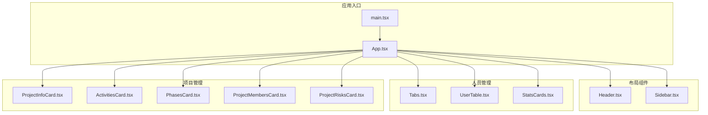
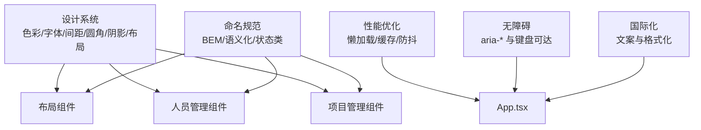
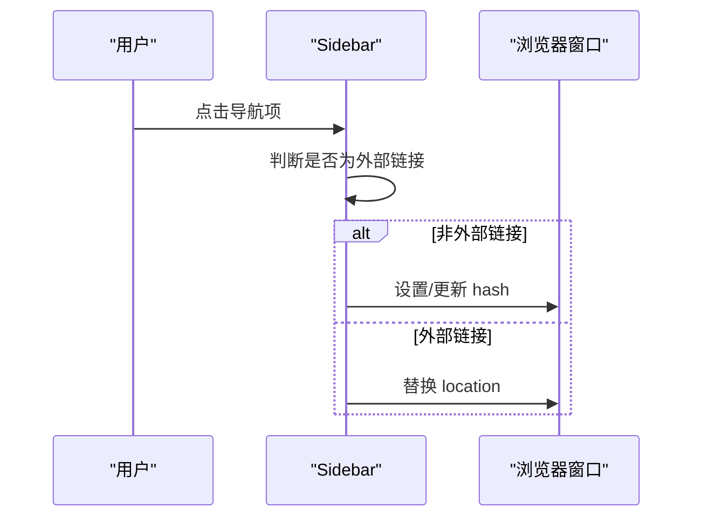
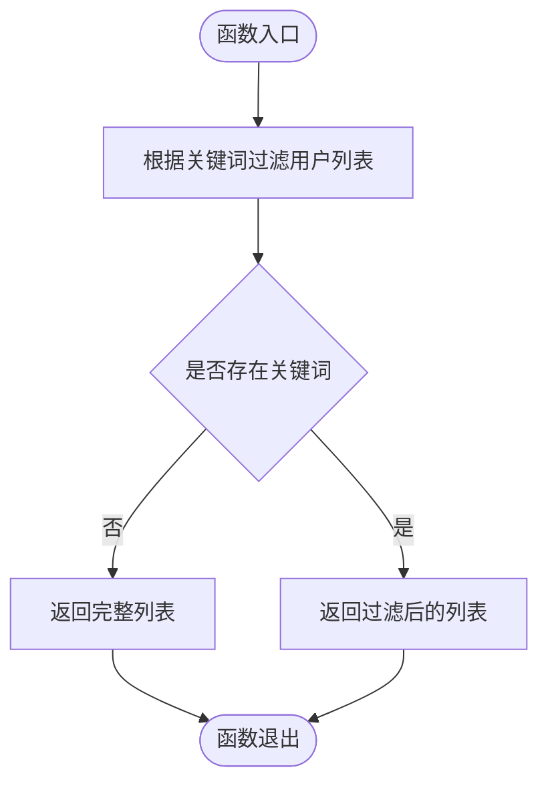
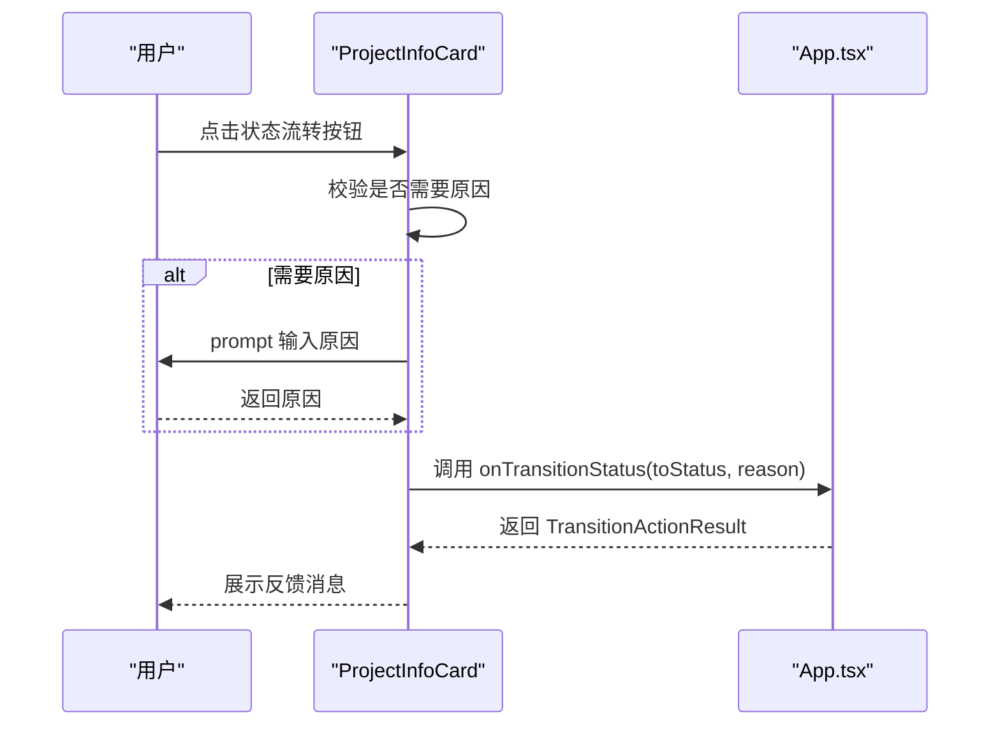
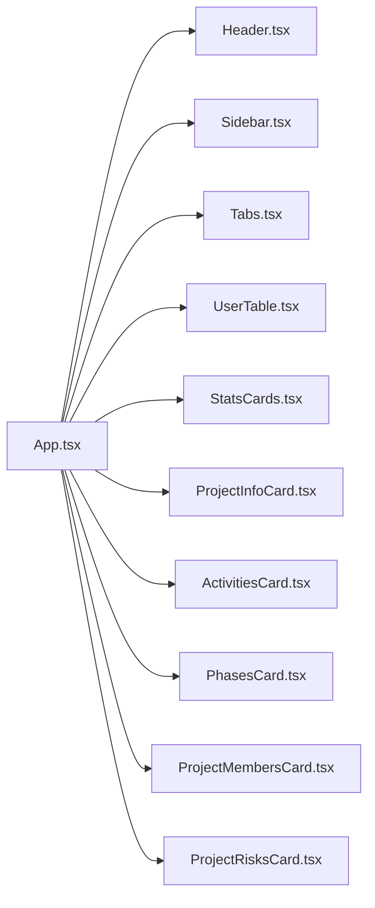

# 共享组件规范

<cite>
**本文引用的文件**
- [DESIGN_SPECIFICATION.md](file://DESIGN_SPECIFICATION.md)
- [docs/00-governance/design-specification.md](file://docs/00-governance/design-specification.md)
- [docs/02-architecture/structured-standard-library.md](file://docs/02-architecture/structured-standard-library.md)
- [src/App.tsx](file://src/App.tsx)
- [src/main.tsx](file://src/main.tsx)
- [src/components/layout/Header.tsx](file://src/components/layout/Header.tsx)
- [src/components/layout/Sidebar.tsx](file://src/components/layout/Sidebar.tsx)
- [src/components/personnel/Tabs.tsx](file://src/components/personnel/Tabs.tsx)
- [src/components/personnel/UserTable.tsx](file://src/components/personnel/UserTable.tsx)
- [src/components/personnel/StatsCards.tsx](file://src/components/personnel/StatsCards.tsx)
- [src/components/project/ProjectInfoCard.tsx](file://src/components/project/ProjectInfoCard.tsx)
- [src/components/project/ActivitiesCard.tsx](file://src/components/project/ActivitiesCard.tsx)
- [src/components/project/PhasesCard.tsx](file://src/components/project/PhasesCard.tsx)
- [src/components/project/ProjectMembersCard.tsx](file://src/components/project/ProjectMembersCard.tsx)
- [src/components/project/ProjectRisksCard.tsx](file://src/components/project/ProjectRisksCard.tsx)
</cite>

## 目录

1. [简介](#简介)
2. [项目结构](#项目结构)
3. [核心组件](#核心组件)
4. [架构总览](#架构总览)
5. [详细组件分析](#详细组件分析)
6. [依赖分析](#依赖分析)
7. [性能考量](#性能考量)
8. [故障排查指南](#故障排查指南)
9. [结论](#结论)
10. [附录](#附录)

## 简介

本规范旨在为 CodeBuddy 项目提供一套统一的共享组件设计原则、实现标准与最佳实践，确保组件在命名、属性接口、事件处理、可复用性、样式与主题、无障碍与国际化、测试与性能等方面保持一致性与高质量。本文档以设计系统与架构文档为权威依据，结合现有组件实现进行提炼与扩展，帮助开发者高效构建与维护可复用的前端组件。

## 项目结构

- 设计系统与规范
  - 设计系统基础：色彩、字体、间距、圆角、阴影、布局与组件规范
  - 响应式设计：断点与适配规则
  - 组件开发 SOP：命名规范、开发流程与工具使用
- 组件分布
  - 布局组件：Header、Sidebar
  - 人员管理：Tabs、UserTable、StatsCards
  - 项目管理：ProjectInfoCard、ActivitiesCard、PhasesCard、ProjectMembersCard、ProjectRisksCard
- 应用入口与路由
  - 应用入口负责全局状态与路由解析，按需懒加载页面组件，提升首屏性能

**图表来源**

- [src/main.tsx:1-11](file://src/main.tsx#L1-L11)
- [src/App.tsx:1-800](file://src/App.tsx#L1-L800)
- [src/components/layout/Header.tsx:1-37](file://src/components/layout/Header.tsx#L1-L37)
- [src/components/layout/Sidebar.tsx:1-108](file://src/components/layout/Sidebar.tsx#L1-L108)
- [src/components/personnel/Tabs.tsx:1-22](file://src/components/personnel/Tabs.tsx#L1-L22)
- [src/components/personnel/UserTable.tsx:1-540](file://src/components/personnel/UserTable.tsx#L1-L540)
- [src/components/personnel/StatsCards.tsx:1-41](file://src/components/personnel/StatsCards.tsx#L1-L41)
- [src/components/project/ProjectInfoCard.tsx:1-159](file://src/components/project/ProjectInfoCard.tsx#L1-L159)
- [src/components/project/ActivitiesCard.tsx:1-65](file://src/components/project/ActivitiesCard.tsx#L1-L65)
- [src/components/project/PhasesCard.tsx:1-132](file://src/components/project/PhasesCard.tsx#L1-L132)
- [src/components/project/ProjectMembersCard.tsx:1-165](file://src/components/project/ProjectMembersCard.tsx#L1-L165)
- [src/components/project/ProjectRisksCard.tsx:1-161](file://src/components/project/ProjectRisksCard.tsx#L1-L161)

**章节来源**

- [src/main.tsx:1-11](file://src/main.tsx#L1-L11)
- [src/App.tsx:1-800](file://src/App.tsx#L1-L800)

## 核心组件

- 布局组件
  - Header：标题、副标题、搜索框、通知、快捷操作、用户信息
  - Sidebar：导航项、激活态、哈希路由跳转
- 人员管理
  - Tabs：标签页容器与按钮
  - UserTable：用户列表、搜索、筛选、排序、新增/编辑弹窗、状态切换、分页
  - StatsCards：统计卡片（图标、标签、数值、主题色）
- 项目管理
  - ProjectInfoCard：项目概要、状态、进度、主链路、状态流转、编辑与跳转
  - ActivitiesCard：状态日志与动态合并展示
  - PhasesCard：阶段与里程碑可视化
  - ProjectMembersCard：成员列表、角色排序、联系方式
  - ProjectRisksCard：风险统计与列表、等级与状态

这些组件均遵循统一的类名体系与设计系统变量，具备良好的可复用性与可扩展性。

**章节来源**

- [src/components/layout/Header.tsx:1-37](file://src/components/layout/Header.tsx#L1-L37)
- [src/components/layout/Sidebar.tsx:1-108](file://src/components/layout/Sidebar.tsx#L1-L108)
- [src/components/personnel/Tabs.tsx:1-22](file://src/components/personnel/Tabs.tsx#L1-L22)
- [src/components/personnel/UserTable.tsx:1-540](file://src/components/personnel/UserTable.tsx#L1-L540)
- [src/components/personnel/StatsCards.tsx:1-41](file://src/components/personnel/StatsCards.tsx#L1-L41)
- [src/components/project/ProjectInfoCard.tsx:1-159](file://src/components/project/ProjectInfoCard.tsx#L1-L159)
- [src/components/project/ActivitiesCard.tsx:1-65](file://src/components/project/ActivitiesCard.tsx#L1-L65)
- [src/components/project/PhasesCard.tsx:1-132](file://src/components/project/PhasesCard.tsx#L1-L132)
- [src/components/project/ProjectMembersCard.tsx:1-165](file://src/components/project/ProjectMembersCard.tsx#L1-L165)
- [src/components/project/ProjectRisksCard.tsx:1-161](file://src/components/project/ProjectRisksCard.tsx#L1-L161)

## 架构总览

- 设计系统为所有组件提供统一的视觉与交互基线，包括色彩、字体、间距、圆角、阴影与布局
- 组件命名与类名采用 BEM 与语义化风格，确保可读性与可维护性
- 应用通过路由与懒加载优化首屏性能，组件间通过 props 传递数据与回调，事件处理遵循无障碍与国际化要求

**图表来源**

- [docs/00-governance/design-specification.md:24-472](file://docs/00-governance/design-specification.md#L24-L472)
- [src/App.tsx:1-800](file://src/App.tsx#L1-L800)

**章节来源**

- [docs/00-governance/design-specification.md:24-472](file://docs/00-governance/design-specification.md#L24-L472)
- [src/App.tsx:1-800](file://src/App.tsx#L1-L800)

## 详细组件分析

### 布局组件

- Header
  - 属性接口：title、subtitle
  - 事件处理：搜索框输入、通知按钮、快捷操作按钮、用户下拉
  - 无障碍：按钮提供 aria-label
  - 样式：使用设计系统变量，遵循卡片与输入框规范
- Sidebar
  - 属性接口：无（内部维护导航项与激活态）
  - 事件处理：点击导航项触发哈希路由跳转；支持当前路径激活态判断
  - 无障碍：按钮与禁用态提供 aria-disabled
  - 性能：使用哈希路由避免整页刷新

**图表来源**

- [src/components/layout/Sidebar.tsx:25-37](file://src/components/layout/Sidebar.tsx#L25-L37)

**章节来源**

- [src/components/layout/Header.tsx:1-37](file://src/components/layout/Header.tsx#L1-L37)
- [src/components/layout/Sidebar.tsx:1-108](file://src/components/layout/Sidebar.tsx#L1-L108)

### 人员管理组件

- Tabs
  - 属性接口：无（内部定义标签数组）
  - 事件处理：按钮 role="tab"、aria-selected 控制激活态
- UserTable
  - 属性接口：searchQuery、onSearchChange、onUserOpen
  - 状态管理：本地 useState 管理用户列表、表单草稿、反馈消息、分页
  - 事件处理：新增/编辑弹窗、状态切换、分页、搜索过滤
  - 无障碍：select、button 提供 aria-label
  - 性能：useMemo 过滤用户列表，避免重复渲染
- StatsCards
  - 属性接口：icon、label、value、tone
  - 主题：通过 tone 映射不同色系

**图表来源**

- [src/components/personnel/UserTable.tsx:132-143](file://src/components/personnel/UserTable.tsx#L132-L143)

**章节来源**

- [src/components/personnel/Tabs.tsx:1-22](file://src/components/personnel/Tabs.tsx#L1-L22)
- [src/components/personnel/UserTable.tsx:1-540](file://src/components/personnel/UserTable.tsx#L1-L540)
- [src/components/personnel/StatsCards.tsx:1-41](file://src/components/personnel/StatsCards.tsx#L1-L41)

### 项目管理组件

- ProjectInfoCard
  - 属性接口：project、transitionOptions、onTransitionStatus、onEditBasicInfo、onNavigateTasks
  - 事件处理：状态流转按钮、编辑与跳转
  - 无障碍：按钮组 role="group"、按钮 aria-label
- ActivitiesCard
  - 属性接口：transitionLogs
  - 事件处理：合并日志与默认活动
- PhasesCard
  - 属性接口：phases、milestones
  - 事件处理：空状态展示
- ProjectMembersCard
  - 属性接口：members、onMemberClick
  - 事件处理：键盘 Enter/Space 支持、电话/邮件快捷操作
- ProjectRisksCard
  - 属性接口：risks、onRiskClick
  - 事件处理：键盘 Enter/Space 支持、等级与状态排序

**图表来源**

- [src/components/project/ProjectInfoCard.tsx:35-49](file://src/components/project/ProjectInfoCard.tsx#L35-L49)
- [src/App.tsx:439-504](file://src/App.tsx#L439-L504)

**章节来源**

- [src/components/project/ProjectInfoCard.tsx:1-159](file://src/components/project/ProjectInfoCard.tsx#L1-L159)
- [src/components/project/ActivitiesCard.tsx:1-65](file://src/components/project/ActivitiesCard.tsx#L1-L65)
- [src/components/project/PhasesCard.tsx:1-132](file://src/components/project/PhasesCard.tsx#L1-L132)
- [src/components/project/ProjectMembersCard.tsx:1-165](file://src/components/project/ProjectMembersCard.tsx#L1-L165)
- [src/components/project/ProjectRisksCard.tsx:1-161](file://src/components/project/ProjectRisksCard.tsx#L1-L161)

## 依赖分析

- 组件依赖
  - 布局组件依赖设计系统变量与类名
  - 人员与项目组件依赖数据模型与仓库（如 personnelRepository、projectRepository）
  - App.tsx 作为全局状态与路由中枢，协调组件间的数据流与事件
- 耦合与内聚
  - 组件通过 props 传递数据与回调，降低耦合
  - 共享样式与主题通过设计系统集中管理，提高内聚

**图表来源**

- [src/App.tsx:1-800](file://src/App.tsx#L1-L800)
- [src/components/layout/Header.tsx:1-37](file://src/components/layout/Header.tsx#L1-L37)
- [src/components/layout/Sidebar.tsx:1-108](file://src/components/layout/Sidebar.tsx#L1-L108)
- [src/components/personnel/Tabs.tsx:1-22](file://src/components/personnel/Tabs.tsx#L1-L22)
- [src/components/personnel/UserTable.tsx:1-540](file://src/components/personnel/UserTable.tsx#L1-L540)
- [src/components/personnel/StatsCards.tsx:1-41](file://src/components/personnel/StatsCards.tsx#L1-L41)
- [src/components/project/ProjectInfoCard.tsx:1-159](file://src/components/project/ProjectInfoCard.tsx#L1-L159)
- [src/components/project/ActivitiesCard.tsx:1-65](file://src/components/project/ActivitiesCard.tsx#L1-L65)
- [src/components/project/PhasesCard.tsx:1-132](file://src/components/project/PhasesCard.tsx#L1-L132)
- [src/components/project/ProjectMembersCard.tsx:1-165](file://src/components/project/ProjectMembersCard.tsx#L1-L165)
- [src/components/project/ProjectRisksCard.tsx:1-161](file://src/components/project/ProjectRisksCard.tsx#L1-L161)

**章节来源**

- [src/App.tsx:1-800](file://src/App.tsx#L1-L800)

## 性能考量

- 懒加载与路由
  - App.tsx 使用 React.lazy 与 Suspense 按需加载页面组件，减少首包体积
- 渲染优化
  - UserTable 使用 useMemo 过滤用户列表，避免不必要的重渲染
  - 组件内部状态局部化，减少全局状态波动
- 资源与样式
  - 统一使用设计系统变量，减少重复样式定义
  - 图标与资源通过统一前缀管理，便于缓存与替换

**章节来源**

- [src/App.tsx:1-800](file://src/App.tsx#L1-L800)
- [src/components/personnel/UserTable.tsx:128-143](file://src/components/personnel/UserTable.tsx#L128-L143)

## 故障排查指南

- 布局错乱
  - 检查父容器 display、flex/grid 配置与 max/min 宽度
  - 使用浏览器开发者工具核对实际渲染尺寸
- 样式不一致
  - 提取公共样式到设计系统，使用 CSS 变量统一颜色与间距
  - 避免内联样式，优先使用类名与主题变量
- 响应式问题
  - 使用媒体查询适配断点，使用 minmax 与 clamp 实现弹性布局
  - 在多个断点测试布局表现
- 无障碍问题
  - 确保交互元素提供 aria-label 或 aria-labelledby
  - 键盘可达：按钮支持 Enter/Space 触发，必要时提供 role 与 aria-selected
- 国际化问题
  - 文案与日期格式统一通过格式化函数处理，避免硬编码
  - 数值与货币单位按地区格式化

**章节来源**

- [docs/00-governance/design-specification.md:428-460](file://docs/00-governance/design-specification.md#L428-L460)

## 结论

通过统一的设计系统、清晰的命名与接口规范、完善的事件与无障碍处理、以及性能优化策略，CodeBuddy 的共享组件能够在功能与体验上保持一致性和可维护性。建议在后续迭代中持续遵循本文规范，逐步完善测试与国际化支持，确保组件在多场景下的稳定与可用。

## 附录

### 组件命名约定

- 页面组件：\*Page.tsx（如 ProjectDetailPage）
- 卡片组件：\*Card.tsx（如 ProjectInfoCard）
- 视图组件：\*View.tsx（如 ProjectGanttView）
- 基础组件：直接命名（如 Button）

**章节来源**

- [docs/00-governance/design-specification.md:387-401](file://docs/00-governance/design-specification.md#L387-L401)

### 属性接口设计与事件处理模式

- 标准模式
  - 通过 props 传递数据与回调
  - 事件处理函数以 onXxx 命名，返回值用于反馈（如 TransitionActionResult）
- 无障碍与国际化
  - 提供 aria-label、role、aria-selected 等属性
  - 文案与日期/数字格式化统一处理

**章节来源**

- [src/components/project/ProjectInfoCard.tsx:15-21](file://src/components/project/ProjectInfoCard.tsx#L15-L21)
- [src/components/personnel/UserTable.tsx:9-13](file://src/components/personnel/UserTable.tsx#L9-L13)
- [src/components/layout/Sidebar.tsx:79-100](file://src/components/layout/Sidebar.tsx#L79-L100)

### 样式规范与主题定制

- 使用设计系统变量统一颜色、字体、间距、圆角与阴影
- 卡片、按钮、输入框等基础组件遵循规范样式类
- 主题定制通过 CSS 变量与类名组合实现

**章节来源**

- [docs/00-governance/design-specification.md:24-472](file://docs/00-governance/design-specification.md#L24-L472)

### 测试策略与最佳实践

- 单元测试
  - 对纯函数与工具函数进行断言测试
  - 对组件行为（如过滤、状态切换）编写测试用例
- 集成测试
  - 使用路由与懒加载场景验证组件挂载与交互
- 性能测试
  - 使用 React Profiler 与浏览器性能面板检测重渲染与内存泄漏
- 可访问性测试
  - 使用自动化工具与手动键盘导航验证无障碍属性与交互

**章节来源**

- [src/App.tsx:1-800](file://src/App.tsx#L1-L800)
- [src/components/personnel/UserTable.tsx:128-143](file://src/components/personnel/UserTable.tsx#L128-L143)
