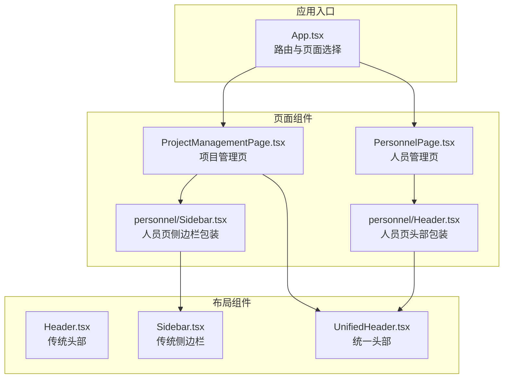
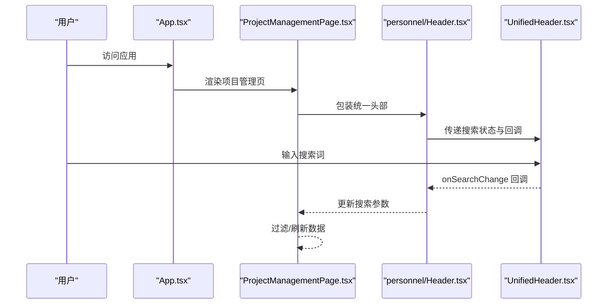
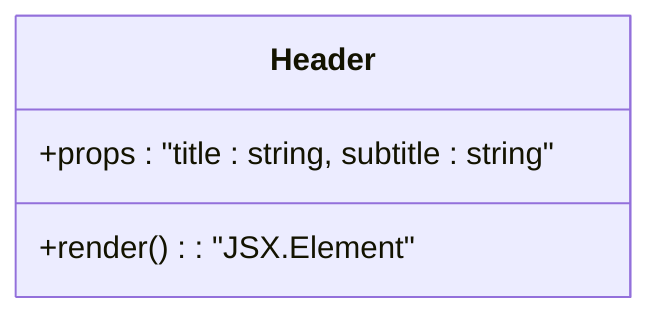
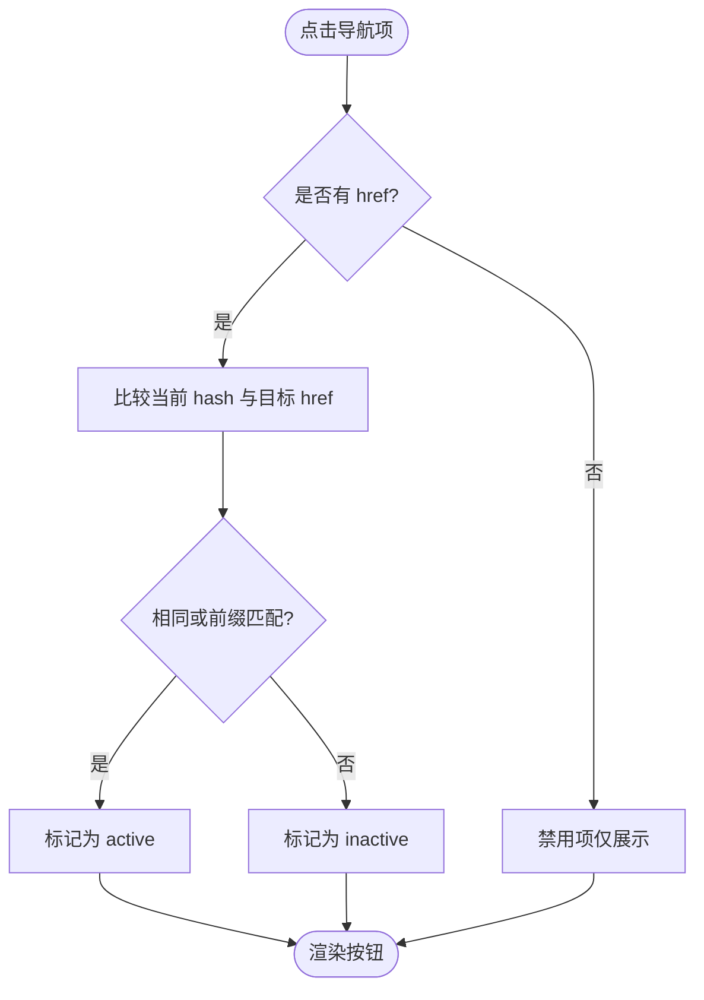
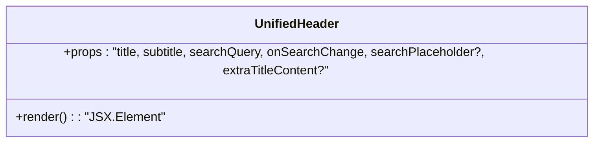
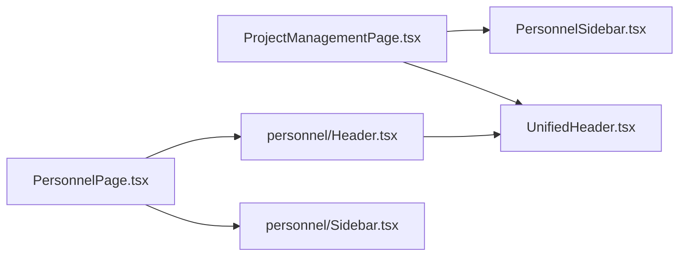
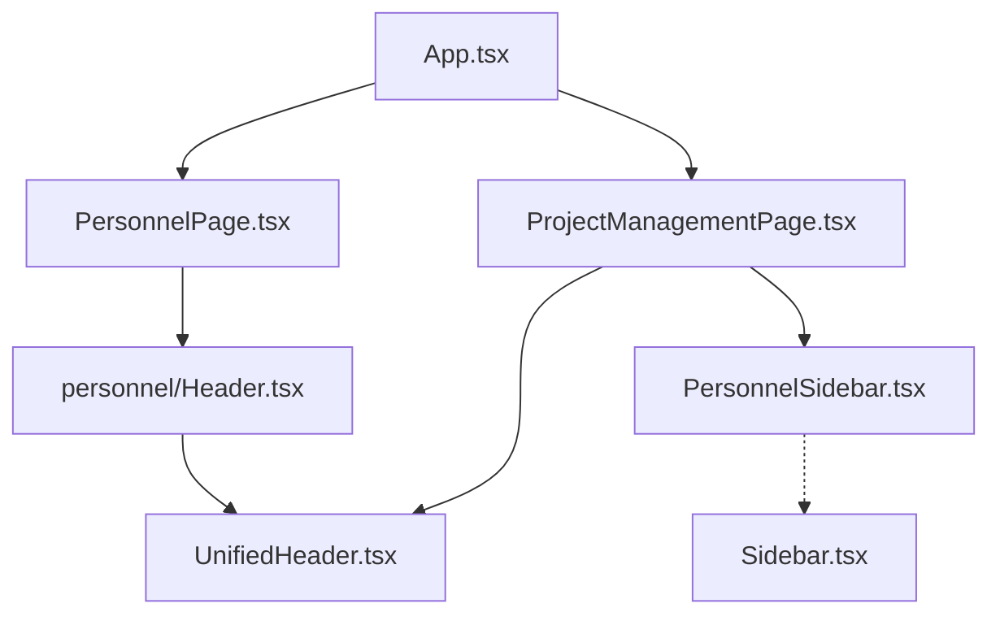

# 布局组件设计

<cite>
**本文引用的文件**
- [src/components/layout/Header.tsx](file://src/components/layout/Header.tsx)
- [src/components/layout/Sidebar.tsx](file://src/components/layout/Sidebar.tsx)
- [src/components/layout/UnifiedHeader.tsx](file://src/components/layout/UnifiedHeader.tsx)
- [src/components/personnel/Header.tsx](file://src/components/personnel/Header.tsx)
- [src/components/personnel/Sidebar.tsx](file://src/components/personnel/Sidebar.tsx)
- [src/components/project/ProjectManagementPage.tsx](file://src/components/project/ProjectManagementPage.tsx)
- [src/components/personnel/PersonnelPage.tsx](file://src/components/personnel/PersonnelPage.tsx)
- [src/App.tsx](file://src/App.tsx)
- [src/App.css](file://src/App.css)
- [docs/00-governance/design-specification.md](file://docs/00-governance/design-specification.md)
</cite>

## 目录

1. [简介](#简介)
2. [项目结构](#项目结构)
3. [核心组件](#核心组件)
4. [架构总览](#架构总览)
5. [组件详解](#组件详解)
6. [依赖关系分析](#依赖关系分析)
7. [性能考量](#性能考量)
8. [故障排查指南](#故障排查指南)
9. [结论](#结论)
10. [附录](#附录)

## 简介

本文件聚焦于 CodeBuddy 项目的布局组件设计，系统梳理并深入解析以下核心布局组件：

- Header（传统头部）
- Sidebar（传统侧边栏）
- UnifiedHeader（统一头部）

同时阐明它们在项目中的职责边界、属性接口、样式规范、响应式实现、复用策略与扩展机制，并说明与页面组件的交互模式与数据流。文末提供最佳实践与常见问题解决方案。

## 项目结构

布局组件主要位于 src/components/layout 下，配合页面组件（如项目管理页、人员管理页）共同构成应用的骨架。路由与页面切换由 App.tsx 负责，页面内部再组合布局组件与业务区域。

**图表来源**

- [src/App.tsx:346-879](file://src/App.tsx#L346-L879)
- [src/components/project/ProjectManagementPage.tsx:124-266](file://src/components/project/ProjectManagementPage.tsx#L124-L266)
- [src/components/personnel/PersonnelPage.tsx:12-34](file://src/components/personnel/PersonnelPage.tsx#L12-L34)
- [src/components/layout/Header.tsx:8-34](file://src/components/layout/Header.tsx#L8-L34)
- [src/components/layout/Sidebar.tsx:39-105](file://src/components/layout/Sidebar.tsx#L39-L105)
- [src/components/layout/UnifiedHeader.tsx:14-54](file://src/components/layout/UnifiedHeader.tsx#L14-L54)

**章节来源**

- [src/App.tsx:346-879](file://src/App.tsx#L346-L879)
- [src/components/project/ProjectManagementPage.tsx:124-266](file://src/components/project/ProjectManagementPage.tsx#L124-L266)
- [src/components/personnel/PersonnelPage.tsx:12-34](file://src/components/personnel/PersonnelPage.tsx#L12-L34)

## 核心组件

- Header（传统头部）
  - 职责：展示标题、副标题、搜索框、通知按钮、快捷操作按钮、用户资料区。
  - 接口：接收 title、subtitle 字符串。
  - 样式：基于 topbar、topbar-title-group、topbar-actions 等类名组织。
- Sidebar（传统侧边栏）
  - 职责：提供导航项集合，支持激活态高亮、点击跳转、收起按钮。
  - 接口：无显式 props；通过 window.location.hash 控制激活态与导航。
  - 样式：基于 sidebar、sidebar-nav、nav-item 等类名组织。
- UnifiedHeader（统一头部）
  - 职责：提供可复用的头部结构，支持外部搜索输入绑定与占位文案。
  - 接口：接收 title、subtitle、searchQuery、onSearchChange、searchPlaceholder、extraTitleContent。
  - 样式：基于 pm-header、pm-header-title、pm-header-actions、pm-search-box 等类名组织。

**章节来源**

- [src/components/layout/Header.tsx:1-37](file://src/components/layout/Header.tsx#L1-L37)
- [src/components/layout/Sidebar.tsx:1-108](file://src/components/layout/Sidebar.tsx#L1-L108)
- [src/components/layout/UnifiedHeader.tsx:1-57](file://src/components/layout/UnifiedHeader.tsx#L1-L57)

## 架构总览

布局组件与页面组件采用“组合”而非“继承”的方式协作。页面组件负责业务数据与交互，布局组件负责统一的视觉与交互形态。App.tsx 作为顶层路由分发器，决定渲染哪个页面组件；页面组件内部再组合布局组件与业务区域。

**图表来源**

- [src/App.tsx:866-876](file://src/App.tsx#L866-L876)
- [src/components/project/ProjectManagementPage.tsx:133-139](file://src/components/project/ProjectManagementPage.tsx#L133-L139)
- [src/components/personnel/Header.tsx:8-16](file://src/components/personnel/Header.tsx#L8-L16)
- [src/components/layout/UnifiedHeader.tsx:14-54](file://src/components/layout/UnifiedHeader.tsx#L14-L54)

## 组件详解

### Header（传统头部）

- 设计理念
  - 简洁明确的标题与副标题信息层。
  - 搜索、通知、快捷操作、用户资料的右侧操作区。
  - 使用固定资产路径承载图标资源，便于统一管理。
- 属性接口
  - title: string
  - subtitle: string
- 样式规范
  - 使用 topbar、topbar-title-group、topbar-actions 等类名组织布局。
- 交互与数据流
  - 该组件为纯展示型，不参与状态管理；若需要搜索联动，建议上提至页面组件或使用上下文。

**图表来源**

- [src/components/layout/Header.tsx:1-37](file://src/components/layout/Header.tsx#L1-L37)

**章节来源**

- [src/components/layout/Header.tsx:1-37](file://src/components/layout/Header.tsx#L1-L37)

### Sidebar（传统侧边栏）

- 设计理念
  - 以导航项数组驱动，支持激活态判断与点击跳转。
  - 支持“收起”按钮与品牌标识。
  - 通过 window.location.hash 实现无刷新导航与激活态同步。
- 属性接口
  - 无显式 props；内部通过 window.location.hash 判断当前激活项。
- 样式规范
  - 使用 sidebar、sidebar-nav、nav-item 等类名组织布局。
- 交互与数据流
  - 点击导航项触发 navigateByHash，根据目标 hash 判断是否需要重新赋值或跳转。
  - 激活态计算覆盖多模块路径前缀匹配，确保导航高亮准确。

**图表来源**

- [src/components/layout/Sidebar.tsx:25-77](file://src/components/layout/Sidebar.tsx#L25-L77)
- [src/components/layout/Sidebar.tsx:90-100](file://src/components/layout/Sidebar.tsx#L90-L100)

**章节来源**

- [src/components/layout/Sidebar.tsx:1-108](file://src/components/layout/Sidebar.tsx#L1-L108)

### UnifiedHeader（统一头部）

- 设计理念
  - 将头部通用结构抽象为可复用组件，支持外部搜索状态绑定与占位文案定制。
  - 适合在不同页面中快速复用，降低重复实现成本。
- 属性接口
  - title: string
  - subtitle: string
  - searchQuery: string
  - onSearchChange: (query: string) => void
  - searchPlaceholder?: string
  - extraTitleContent?: ReactNode
- 样式规范
  - 使用 pm-header、pm-header-title、pm-header-actions、pm-search-box 等类名组织布局。
- 交互与数据流
  - 输入框受控，onChange 通过 onSearchChange 回调上抛，由页面组件统一处理过滤与刷新。

**图表来源**

- [src/components/layout/UnifiedHeader.tsx:3-10](file://src/components/layout/UnifiedHeader.tsx#L3-L10)
- [src/components/layout/UnifiedHeader.tsx:14-54](file://src/components/layout/UnifiedHeader.tsx#L14-L54)

**章节来源**

- [src/components/layout/UnifiedHeader.tsx:1-57](file://src/components/layout/UnifiedHeader.tsx#L1-L57)

### 页面组件中的布局集成

- 项目管理页（ProjectManagementPage）
  - 内部组合 PersonnelSidebar 与 UnifiedHeader，形成“人员风格”的统一布局。
  - 通过 handleSearchChange 将搜索状态回传给页面组件，实现数据自上而下的流动。
- 人员管理页（PersonnelPage）
  - 内部组合 personnel/Header（对 UnifiedHeader 的轻量封装）与 personnel/Sidebar。
  - 通过 PersonnelHeader 透传搜索状态，简化页面组件的头部实现。

**图表来源**

- [src/components/project/ProjectManagementPage.tsx:129-139](file://src/components/project/ProjectManagementPage.tsx#L129-L139)
- [src/components/personnel/PersonnelPage.tsx:20-24](file://src/components/personnel/PersonnelPage.tsx#L20-L24)
- [src/components/personnel/Header.tsx:8-16](file://src/components/personnel/Header.tsx#L8-L16)

**章节来源**

- [src/components/project/ProjectManagementPage.tsx:124-266](file://src/components/project/ProjectManagementPage.tsx#L124-L266)
- [src/components/personnel/PersonnelPage.tsx:12-34](file://src/components/personnel/PersonnelPage.tsx#L12-L34)
- [src/components/personnel/Header.tsx:1-20](file://src/components/personnel/Header.tsx#L1-L20)

## 依赖关系分析

- 组件耦合
  - 页面组件对布局组件为单向依赖（组合），布局组件之间无直接依赖。
  - Sidebar 与 App.tsx 的路由逻辑存在间接耦合（通过 hash 判断激活态）。
- 外部依赖
  - 图标资源通过固定资产路径加载，便于统一管理与替换。
  - 样式采用类名组织，遵循 BEM 与语义化命名，利于复用与维护。

**图表来源**

- [src/App.tsx:346-879](file://src/App.tsx#L346-L879)
- [src/components/project/ProjectManagementPage.tsx:129-139](file://src/components/project/ProjectManagementPage.tsx#L129-L139)
- [src/components/personnel/PersonnelPage.tsx:20-24](file://src/components/personnel/PersonnelPage.tsx#L20-L24)
- [src/components/layout/Sidebar.tsx:39-105](file://src/components/layout/Sidebar.tsx#L39-L105)

**章节来源**

- [src/App.tsx:346-879](file://src/App.tsx#L346-L879)
- [src/components/layout/Sidebar.tsx:1-108](file://src/components/layout/Sidebar.tsx#L1-L108)

## 性能考量

- 路由与页面切换
  - App.tsx 使用 hashchange 事件监听路由变化，避免不必要的重渲染。
  - 页面组件采用懒加载（React.lazy）与 Suspense 占位，降低首屏压力。
- 导航激活态计算
  - Sidebar 对激活态的判断集中在渲染阶段，注意在大量导航项时避免重复计算，必要时可引入 memo 缓存。
- 图标资源
  - 统一从固定资产路径加载，建议结合 CDN 与缓存策略提升加载性能。

[本节为通用性能建议，无需具体文件分析]

## 故障排查指南

- 激活态不正确
  - 症状：点击导航后高亮不生效或错误高亮。
  - 排查：检查 Sidebar 中的激活态判断逻辑与目标 hash 前缀匹配规则。
  - 参考路径：[src/components/layout/Sidebar.tsx:54-77](file://src/components/layout/Sidebar.tsx#L54-L77)
- 导航跳转无效
  - 症状：点击导航无反应。
  - 排查：确认 navigateByHash 的目标 hash 是否以 "#/" 开头，以及当前 hash 与目标 hash 的差异。
  - 参考路径：[src/components/layout/Sidebar.tsx:25-37](file://src/components/layout/Sidebar.tsx#L25-L37)
- 搜索功能异常
  - 症状：输入框无法响应或搜索结果不更新。
  - 排查：确认页面组件是否正确将 searchQuery 与 onSearchChange 传递给 UnifiedHeader。
  - 参考路径：[src/components/layout/UnifiedHeader.tsx:33-38](file://src/components/layout/UnifiedHeader.tsx#L33-L38)、[src/components/project/ProjectManagementPage.tsx:90-93](file://src/components/project/ProjectManagementPage.tsx#L90-L93)
- 响应式布局异常
  - 症状：在某些屏幕尺寸下布局错乱。
  - 排查：参考设计规范中的断点与媒体查询规则，确保类名与样式一致。
  - 参考路径：[docs/00-governance/design-specification.md:301-359](file://docs/00-governance/design-specification.md#L301-L359)

**章节来源**

- [src/components/layout/Sidebar.tsx:25-77](file://src/components/layout/Sidebar.tsx#L25-L77)
- [src/components/layout/UnifiedHeader.tsx:33-38](file://src/components/layout/UnifiedHeader.tsx#L33-L38)
- [src/components/project/ProjectManagementPage.tsx:90-93](file://src/components/project/ProjectManagementPage.tsx#L90-L93)
- [docs/00-governance/design-specification.md:301-359](file://docs/00-governance/design-specification.md#L301-L359)

## 结论

- Header、Sidebar、UnifiedHeader 三者分别承担“信息展示”、“导航控制”和“统一头部复用”的职责，形成清晰的分工。
- 页面组件通过组合布局组件实现高复用与低耦合，数据流自上而下，交互通过回调上抛，保证了可维护性。
- 响应式设计遵循统一断点规范，配合 BEM 命名与类名组织，便于跨页面一致性维护。
- 建议在大型导航场景下对激活态计算进行优化，并持续完善媒体查询与断点测试。

[本节为总结性内容，无需具体文件分析]

## 附录

### 响应式设计与断点

- 断点系统
  - Mobile: 768px
  - Tablet: 1024px
  - Desktop: 1360px
  - Large Desktop: 1920px
- 关键规则
  - 1360px：侧边栏宽度收缩至 72px。
  - 1024px：导航项文字隐藏，项目信息两列布局。
  - 768px：顶部栏换行，项目信息单列布局。

**章节来源**

- [docs/00-governance/design-specification.md:301-359](file://docs/00-governance/design-specification.md#L301-L359)

### 样式与类名规范

- 布局组件常用类名
  - Header: topbar、topbar-title-group、topbar-actions
  - Sidebar: sidebar、sidebar-nav、nav-item
  - UnifiedHeader: pm-header、pm-header-title、pm-header-actions、pm-search-box
- 页面组件常用类名
  - 项目管理页: pm-app、pm-workspace、pm-main、pm-body
  - 人员管理页: pm-app、pm-workspace、pm-main、pm-body

**章节来源**

- [src/components/layout/Header.tsx:10-32](file://src/components/layout/Header.tsx#L10-L32)
- [src/components/layout/Sidebar.tsx:43-102](file://src/components/layout/Sidebar.tsx#L43-L102)
- [src/components/layout/UnifiedHeader.tsx:23-52](file://src/components/layout/UnifiedHeader.tsx#L23-L52)
- [src/components/project/ProjectManagementPage.tsx:125-244](file://src/components/project/ProjectManagementPage.tsx#L125-L244)
- [src/components/personnel/PersonnelPage.tsx:16-32](file://src/components/personnel/PersonnelPage.tsx#L16-L32)
