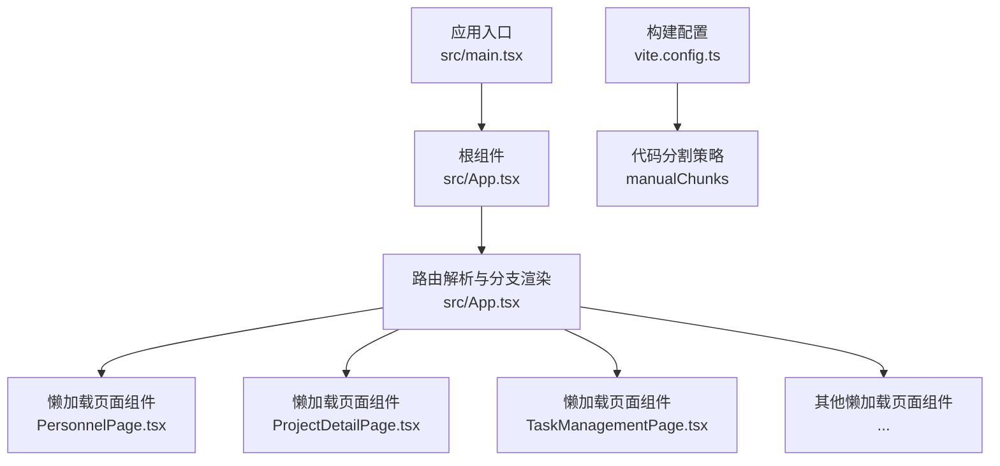
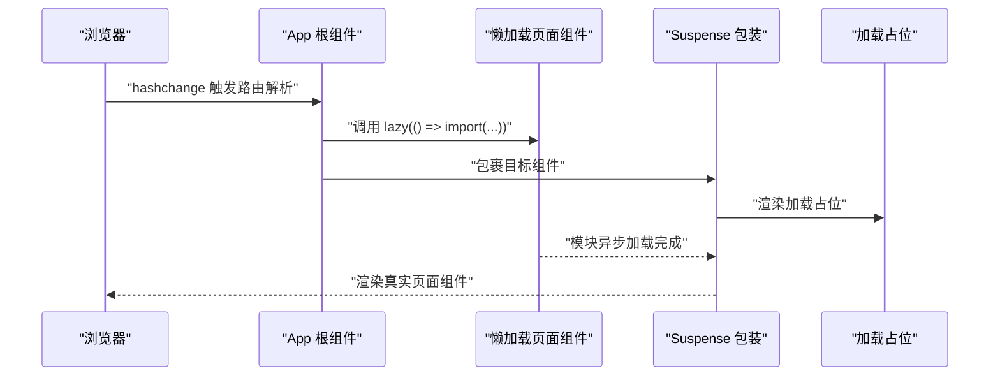
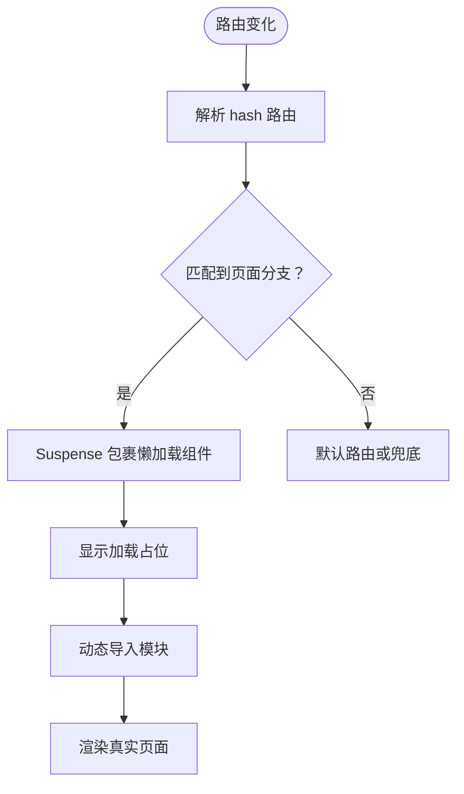
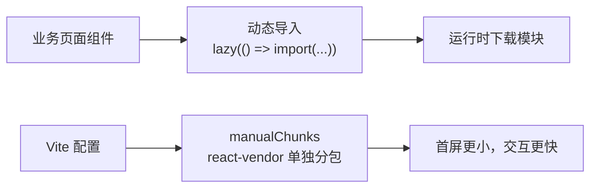
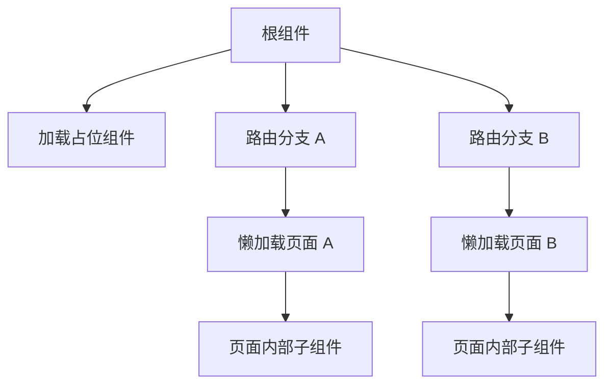
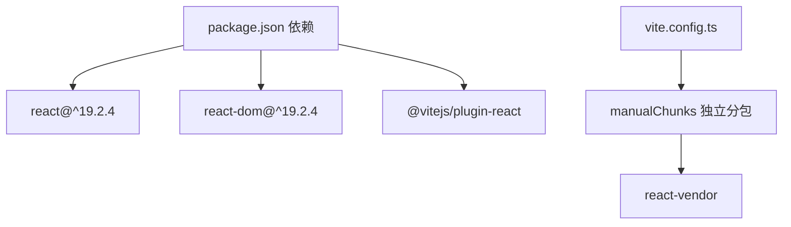

# 懒加载策略实现

<cite>
**本文引用的文件**
- [src/App.tsx](file://src/App.tsx)
- [src/main.tsx](file://src/main.tsx)
- [vite.config.ts](file://vite.config.ts)
- [package.json](file://package.json)
- [src/components/personnel/PersonnelPage.tsx](file://src/components/personnel/PersonnelPage.tsx)
- [src/components/project/ProjectDetailPage.tsx](file://src/components/project/ProjectDetailPage.tsx)
- [src/components/task/TaskManagementPage.tsx](file://src/components/task/TaskManagementPage.tsx)
- [src/components/layout/Header.tsx](file://src/components/layout/Header.tsx)
</cite>

## 目录

1. [简介](#简介)
2. [项目结构](#项目结构)
3. [核心组件](#核心组件)
4. [架构概览](#架构概览)
5. [详细组件分析](#详细组件分析)
6. [依赖分析](#依赖分析)
7. [性能考虑](#性能考虑)
8. [故障排查指南](#故障排查指南)
9. [结论](#结论)
10. [附录](#附录)

## 简介

本文件系统性梳理 CodeBuddy 项目中的懒加载策略实现，重点覆盖以下方面：

- React.lazy 与 Suspense 的使用方式与性能优化效果
- 动态导入的实现机制与代码分割策略
- 懒加载组件的错误边界处理与加载状态管理
- 路由级别的懒加载实现与预加载策略
- 懒加载对应用启动性能的影响与优化方案
- 懒加载组件的调试技巧与性能监控方法
- 具体的懒加载实现示例与最佳实践指导
- 懒加载与路由导航的集成模式与用户体验优化

## 项目结构

CodeBuddy 使用基于 hash 的前端路由与 React.lazy 实现按需加载，核心入口在应用根组件中集中声明懒加载页面组件，并在路由分支中包裹 Suspense 提供统一的加载占位。

**图表来源**

- [src/main.tsx:1-11](file://src/main.tsx#L1-L11)
- [src/App.tsx:1-20](file://src/App.tsx#L1-L20)
- [src/App.tsx:715-876](file://src/App.tsx#L715-L876)
- [vite.config.ts:15-34](file://vite.config.ts#L15-L34)

**章节来源**

- [src/main.tsx:1-11](file://src/main.tsx#L1-L11)
- [src/App.tsx:1-20](file://src/App.tsx#L1-L20)
- [src/App.tsx:715-876](file://src/App.tsx#L715-L876)
- [vite.config.ts:15-34](file://vite.config.ts#L15-L34)

## 核心组件

- 应用根组件：集中声明所有懒加载页面组件，使用 React.lazy 包裹，路由命中后通过 Suspense 提供统一加载占位。
- 页面组件：如 PersonnelPage、ProjectDetailPage、TaskManagementPage 等，作为被懒加载的业务页面。
- 构建配置：Vite 的 rollupOptions.manualChunks 将 React 生态核心库独立打包，配合懒加载进一步降低首屏体积。

**章节来源**

- [src/App.tsx:1-20](file://src/App.tsx#L1-L20)
- [src/App.tsx:715-876](file://src/App.tsx#L715-L876)
- [vite.config.ts:15-34](file://vite.config.ts#L15-L34)

## 架构概览

下图展示从路由到页面渲染的懒加载流程，包括动态导入、Suspense 渲染与加载占位。

**图表来源**

- [src/App.tsx:226-344](file://src/App.tsx#L226-L344)
- [src/App.tsx:715-876](file://src/App.tsx#L715-L876)

## 详细组件分析

### 懒加载与路由集成

- 在根组件中集中声明所有懒加载页面组件，避免在路由分支内重复定义。
- 路由命中后，通过 Suspense 包裹对应页面组件，确保在模块加载期间显示统一的加载占位。
- 加载占位组件在根组件内定义，保证所有分支共享一致的加载体验。

**图表来源**

- [src/App.tsx:226-344](file://src/App.tsx#L226-L344)
- [src/App.tsx:715-876](file://src/App.tsx#L715-L876)

**章节来源**

- [src/App.tsx:226-344](file://src/App.tsx#L226-L344)
- [src/App.tsx:715-876](file://src/App.tsx#L715-L876)

### 动态导入与代码分割

- 动态导入通过 React.lazy 的工厂函数实现，按需触发模块下载。
- Vite 构建配置中使用 manualChunks 将 React 生态核心库（react、react-dom）独立打包，结合懒加载显著降低首屏体积与加载时间。
- 通过提升 chunkSizeWarningLimit，缓解因懒加载导致的 chunk 大小告警。

**图表来源**

- [src/App.tsx:1-20](file://src/App.tsx#L1-L20)
- [vite.config.ts:15-34](file://vite.config.ts#L15-L34)

**章节来源**

- [src/App.tsx:1-20](file://src/App.tsx#L1-L20)
- [vite.config.ts:15-34](file://vite.config.ts#L15-L34)

### 加载状态管理与用户体验

- 统一的加载占位组件在根组件内定义，确保所有分支加载状态一致。
- 页面组件内部可按需引入子组件（如 PersonnelPage 引入 Header、Sidebar 等），这些子组件属于业务逻辑而非路由级懒加载范畴，有助于保持页面内部结构清晰。

**图表来源**

- [src/App.tsx:715-876](file://src/App.tsx#L715-L876)
- [src/components/personnel/PersonnelPage.tsx:1-37](file://src/components/personnel/PersonnelPage.tsx#L1-L37)

**章节来源**

- [src/App.tsx:715-876](file://src/App.tsx#L715-L876)
- [src/components/personnel/PersonnelPage.tsx:1-37](file://src/components/personnel/PersonnelPage.tsx#L1-L37)

### 错误边界处理

- 当前实现未显式声明错误边界组件。建议在 Suspense 上层增加错误边界，以捕获懒加载过程中的网络或模块错误，提供更友好的降级提示与重试机制。
- 可结合现有远程兜底事件监听机制，将错误边界与本地兜底策略联动，提升稳定性与可恢复性。

**章节来源**

- [src/App.tsx:366-389](file://src/App.tsx#L366-L389)

### 预加载策略

- 可在用户空闲或即将导航时，提前触发关键页面的动态导入，缩短首次渲染等待时间。
- 对于高频访问的页面（如 PersonnelPage、ProjectDetailPage），可在路由进入前进行预热，结合缓存策略减少二次加载开销。

**章节来源**

- [src/App.tsx:1-20](file://src/App.tsx#L1-L20)

### 性能优化与监控

- 代码分割：通过 manualChunks 将 react-vendor 独立分包，降低首屏体积。
- 加载占位：统一的加载占位提升感知性能，改善用户体验。
- 监控建议：在动态导入前后埋点，统计模块下载耗时、渲染延迟与错误率，持续优化关键路径。

**章节来源**

- [vite.config.ts:15-34](file://vite.config.ts#L15-L34)
- [src/App.tsx:715-720](file://src/App.tsx#L715-L720)

## 依赖分析

- React 版本：19.2.4，支持 Suspense 与 lazy 的稳定特性。
- Vite 插件：@vitejs/plugin-react 提供开发与构建支持。
- 构建工具链：rollupOptions.manualChunks 控制代码分割策略。

**图表来源**

- [package.json:17-21](file://package.json#L17-L21)
- [package.json:30-31](file://package.json#L30-L31)
- [vite.config.ts:15-34](file://vite.config.ts#L15-L34)

**章节来源**

- [package.json:17-21](file://package.json#L17-L21)
- [package.json:30-31](file://package.json#L30-L31)
- [vite.config.ts:15-34](file://vite.config.ts#L15-L34)

## 性能考虑

- 启动性能：通过懒加载与代码分割显著降低首屏 JS 体积，提升 TTI（可交互时间）。
- 缓存策略：利用浏览器缓存与模块联邦（如后续引入）提升二次加载速度。
- 用户感知：加载占位与骨架屏设计提升感知性能，减少“白屏”带来的挫败感。
- 监控与告警：建立动态导入耗时与错误率监控，及时发现并修复性能瓶颈。

## 故障排查指南

- 模块加载失败：检查动态导入路径是否正确，确认网络请求与模块导出。
- 加载占位不消失：确认 Suspense 是否包裹目标组件，以及组件是否正确导出默认或具名导出。
- 首屏体积过大：检查 manualChunks 配置与第三方依赖是否被正确拆分。
- 错误边界缺失：建议增加错误边界组件，捕获并上报懒加载异常，提供重试与降级策略。

**章节来源**

- [src/App.tsx:715-876](file://src/App.tsx#L715-L876)
- [vite.config.ts:15-34](file://vite.config.ts#L15-L34)

## 结论

CodeBuddy 的懒加载策略通过 React.lazy 与 Suspense 的组合，结合 Vite 的代码分割配置，有效降低了首屏体积与加载时间。建议在现有基础上完善错误边界、预加载与性能监控体系，持续优化用户体验与应用稳定性。

## 附录

- 示例实现位置参考：
  - 懒加载页面声明与路由分支：[src/App.tsx:1-20](file://src/App.tsx#L1-L20)，[src/App.tsx:715-876](file://src/App.tsx#L715-L876)
  - 动态导入与代码分割：[src/App.tsx:1-20](file://src/App.tsx#L1-L20)，[vite.config.ts:15-34](file://vite.config.ts#L15-L34)
  - 页面内部子组件引用：[src/components/personnel/PersonnelPage.tsx:1-37](file://src/components/personnel/PersonnelPage.tsx#L1-L37)
  - 应用入口与渲染：[src/main.tsx:1-11](file://src/main.tsx#L1-L11)
