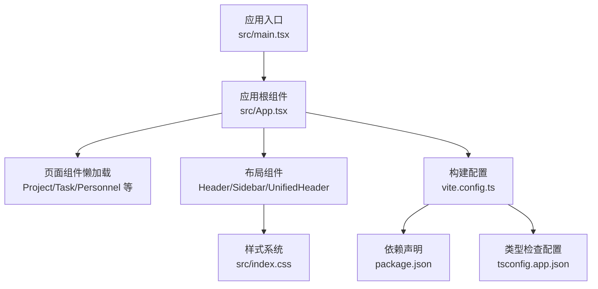
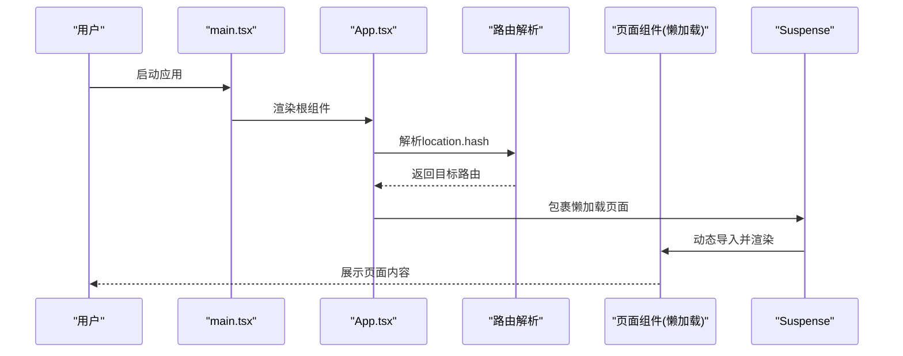
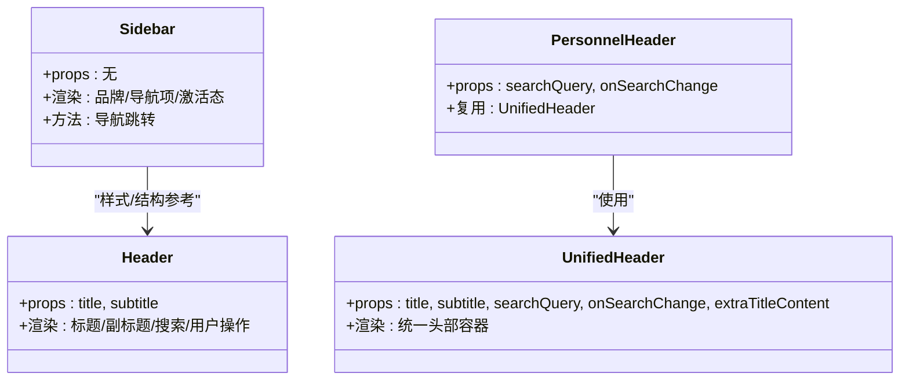
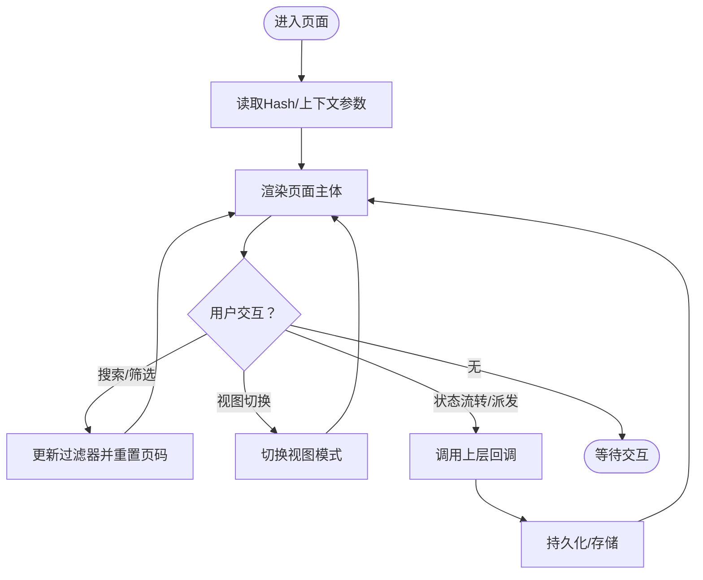
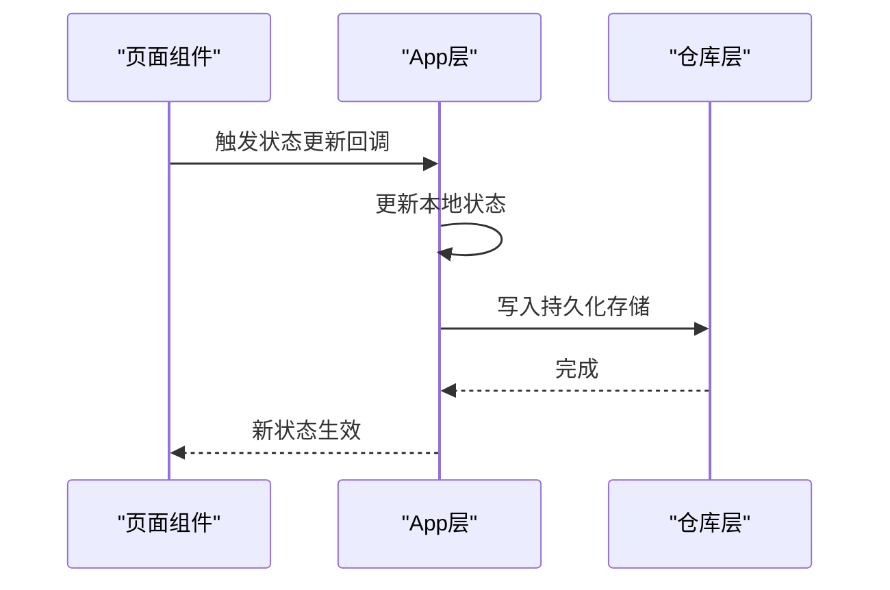
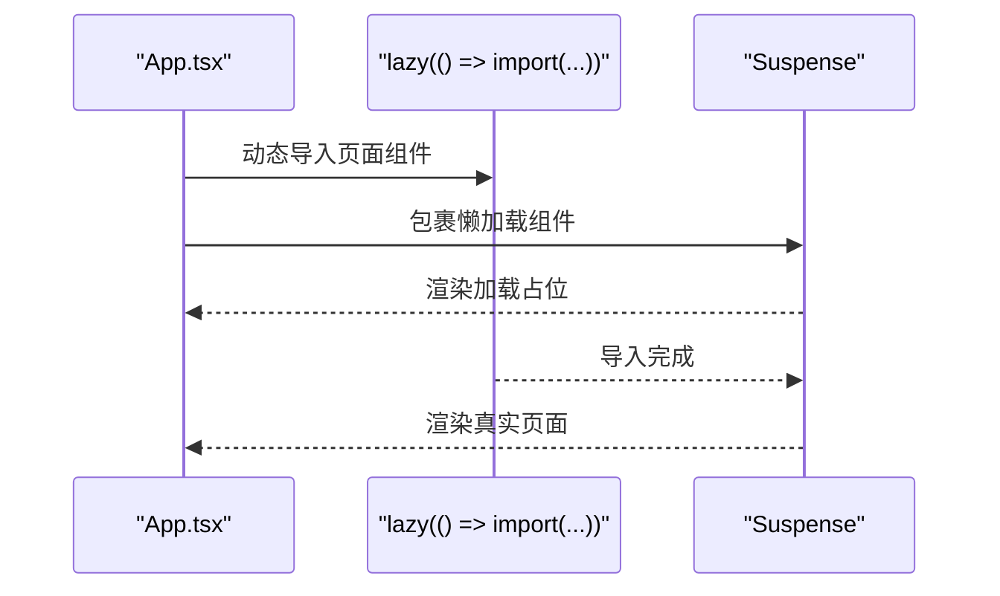
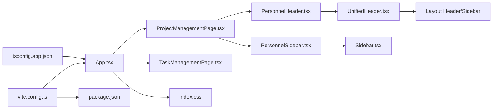

# 组件架构

<cite>
**本文引用的文件**
- [src/App.tsx](file://src/App.tsx)
- [src/main.tsx](file://src/main.tsx)
- [src/components/layout/Header.tsx](file://src/components/layout/Header.tsx)
- [src/components/layout/Sidebar.tsx](file://src/components/layout/Sidebar.tsx)
- [src/components/layout/UnifiedHeader.tsx](file://src/components/layout/UnifiedHeader.tsx)
- [src/components/personnel/Header.tsx](file://src/components/personnel/Header.tsx)
- [src/components/personnel/Sidebar.tsx](file://src/components/personnel/Sidebar.tsx)
- [src/components/personnel/PersonnelPage.tsx](file://src/components/personnel/PersonnelPage.tsx)
- [src/components/project/ProjectManagementPage.tsx](file://src/components/project/ProjectManagementPage.tsx)
- [src/components/task/TaskManagementPage.tsx](file://src/components/task/TaskManagementPage.tsx)
- [src/index.css](file://src/index.css)
- [vite.config.ts](file://vite.config.ts)
- [package.json](file://package.json)
- [tsconfig.app.json](file://tsconfig.app.json)
</cite>

## 目录

1. [简介](#简介)
2. [项目结构](#项目结构)
3. [核心组件](#核心组件)
4. [架构总览](#架构总览)
5. [组件详解](#组件详解)
6. [依赖关系分析](#依赖关系分析)
7. [性能考量](#性能考量)
8. [故障排查指南](#故障排查指南)
9. [结论](#结论)
10. [附录](#附录)

## 简介

本文件面向UI开发者，系统化梳理CodeBuddy项目的组件架构与实现细节，覆盖布局组件、页面组件与功能组件的职责划分，统一的共享组件规范，组件间通信机制，以及基于路由的懒加载与Suspense优化策略。文档同时给出响应式设计与无障碍访问支持的要点，并提供组件组合的最佳实践。

## 项目结构

项目采用“按功能域分层”的组织方式：

- 布局层：统一的Header、Sidebar与UnifiedHeader，支撑多页面复用
- 页面层：各功能域的页面组件（如项目管理、任务管理、人员管理等），负责承载业务视图与交互
- 功能层：通用工具、数据选择器、类型定义与仓库封装，支撑页面逻辑
- 样式层：以CSS变量与Tailwind类为主，提供主题与响应式能力
- 构建层：Vite + React插件，配合代码分割与代理配置

**图表来源**

- [src/main.tsx:1-11](file://src/main.tsx#L1-L11)
- [src/App.tsx:1-879](file://src/App.tsx#L1-L879)
- [src/index.css:1-8023](file://src/index.css#L1-L8023)
- [vite.config.ts:1-35](file://vite.config.ts#L1-L35)
- [package.json:1-48](file://package.json#L1-L48)
- [tsconfig.app.json:1-29](file://tsconfig.app.json#L1-L29)

**章节来源**

- [src/main.tsx:1-11](file://src/main.tsx#L1-L11)
- [src/App.tsx:1-879](file://src/App.tsx#L1-L879)
- [src/index.css:1-8023](file://src/index.css#L1-L8023)
- [vite.config.ts:1-35](file://vite.config.ts#L1-L35)
- [package.json:1-48](file://package.json#L1-L48)
- [tsconfig.app.json:1-29](file://tsconfig.app.json#L1-L29)

## 核心组件

- 布局组件
  - Header：顶部标题与副标题展示，带搜索框与用户操作区
  - Sidebar：导航菜单与品牌区，支持激活态与折叠按钮
  - UnifiedHeader：统一的头部容器，支持外部传入搜索回调与额外标题内容
- 页面组件
  - 项目管理页：聚合统计卡片、工具栏、多种视图（列表/网格/Kanban/日历/地图占位）
  - 任务管理页：任务列表、详情、派发与验收流程、SLA提醒与日志
  - 人员管理页：侧边栏、头部、标签页、统计卡片与用户表格
- 共享规范
  - 统一的头部与侧边样式前缀（pm-），便于跨页面复用
  - 统一的图标与资产路径前缀，降低耦合

**章节来源**

- [src/components/layout/Header.tsx:1-37](file://src/components/layout/Header.tsx#L1-L37)
- [src/components/layout/Sidebar.tsx:1-108](file://src/components/layout/Sidebar.tsx#L1-L108)
- [src/components/layout/UnifiedHeader.tsx:1-57](file://src/components/layout/UnifiedHeader.tsx#L1-L57)
- [src/components/project/ProjectManagementPage.tsx:1-270](file://src/components/project/ProjectManagementPage.tsx#L1-L270)
- [src/components/task/TaskManagementPage.tsx:1-800](file://src/components/task/TaskManagementPage.tsx#L1-L800)
- [src/components/personnel/PersonnelPage.tsx:1-37](file://src/components/personnel/PersonnelPage.tsx#L1-L37)

## 架构总览

应用通过Hash路由驱动页面切换，使用React.lazy与Suspense实现按需加载与加载占位，结合Vite的manualChunks策略进行代码分割，提升首屏性能与模块复用效率。

**图表来源**

- [src/main.tsx:1-11](file://src/main.tsx#L1-L11)
- [src/App.tsx:1-879](file://src/App.tsx#L1-L879)

**章节来源**

- [src/App.tsx:1-879](file://src/App.tsx#L1-L879)
- [vite.config.ts:15-33](file://vite.config.ts#L15-L33)

## 组件详解

### 布局组件设计与复用策略

- Header
  - 职责：展示主标题与副标题，提供搜索输入与用户操作区
  - 设计：使用固定资产路径，保证图标一致性
- Sidebar
  - 职责：提供导航项与品牌区，根据当前Hash计算激活态
  - 设计：内置导航项数组与激活判断逻辑，支持点击跳转
- UnifiedHeader
  - 职责：作为统一头部容器，接收搜索查询与变更回调，支持额外标题内容
  - 复用：被各页面头部组件（如人员管理页）直接复用

**图表来源**

- [src/components/layout/Header.tsx:1-37](file://src/components/layout/Header.tsx#L1-L37)
- [src/components/layout/Sidebar.tsx:1-108](file://src/components/layout/Sidebar.tsx#L1-L108)
- [src/components/layout/UnifiedHeader.tsx:1-57](file://src/components/layout/UnifiedHeader.tsx#L1-L57)
- [src/components/personnel/Header.tsx:1-20](file://src/components/personnel/Header.tsx#L1-L20)

**章节来源**

- [src/components/layout/Header.tsx:1-37](file://src/components/layout/Header.tsx#L1-L37)
- [src/components/layout/Sidebar.tsx:1-108](file://src/components/layout/Sidebar.tsx#L1-L108)
- [src/components/layout/UnifiedHeader.tsx:1-57](file://src/components/layout/UnifiedHeader.tsx#L1-L57)
- [src/components/personnel/Header.tsx:1-20](file://src/components/personnel/Header.tsx#L1-L20)

### 页面组件与功能组件

- 项目管理页
  - 职责：聚合统计、过滤与分页、多视图切换、创建与状态流转
  - 通信：通过props向下传递状态与回调，向上通过回调触发App层状态更新
- 任务管理页
  - 职责：任务列表、详情、派发/接单/拒单、SLA提醒、日志与快照
  - 通信：通过URL Hash上下文传递模板/项目/来源类型等参数
- 人员管理页
  - 职责：侧边栏、头部、标签页、统计卡片与用户表格
  - 通信：通过回调与上层App共享状态

**图表来源**

- [src/components/project/ProjectManagementPage.tsx:1-270](file://src/components/project/ProjectManagementPage.tsx#L1-L270)
- [src/components/task/TaskManagementPage.tsx:1-800](file://src/components/task/TaskManagementPage.tsx#L1-L800)
- [src/components/personnel/PersonnelPage.tsx:1-37](file://src/components/personnel/PersonnelPage.tsx#L1-L37)

**章节来源**

- [src/components/project/ProjectManagementPage.tsx:1-270](file://src/components/project/ProjectManagementPage.tsx#L1-L270)
- [src/components/task/TaskManagementPage.tsx:1-800](file://src/components/task/TaskManagementPage.tsx#L1-L800)
- [src/components/personnel/PersonnelPage.tsx:1-37](file://src/components/personnel/PersonnelPage.tsx#L1-L37)

### 组件通信机制

- 父子组件通信
  - 页面组件通过props接收状态与回调，如项目管理页接收搜索查询与状态更新回调
- 兄弟组件通信
  - 通过共同父组件下发的回调与状态实现协作，如统计卡片与表格之间的联动
- 全局状态管理
  - 应用层集中维护路由、项目状态与日志，页面组件通过回调触发更新
  - 任务管理页通过仓库层持久化任务与日志，避免刷新丢失

**图表来源**

- [src/App.tsx:346-504](file://src/App.tsx#L346-L504)
- [src/components/task/TaskManagementPage.tsx:304-310](file://src/components/task/TaskManagementPage.tsx#L304-L310)

**章节来源**

- [src/App.tsx:346-504](file://src/App.tsx#L346-L504)
- [src/components/task/TaskManagementPage.tsx:304-310](file://src/components/task/TaskManagementPage.tsx#L304-L310)

### 懒加载策略与Suspense

- 懒加载实现
  - 使用React.lazy对页面组件进行按需导入
  - 在App层通过Suspense包裹，提供加载占位
- 性能优化
  - Vite配置manualChunks将React生态库独立打包，提升缓存命中率
  - 代码分割与按需加载显著降低首屏包体

**图表来源**

- [src/App.tsx:3-20](file://src/App.tsx#L3-L20)
- [src/App.tsx:715-747](file://src/App.tsx#L715-L747)
- [vite.config.ts:15-33](file://vite.config.ts#L15-L33)

**章节来源**

- [src/App.tsx:3-20](file://src/App.tsx#L3-L20)
- [src/App.tsx:715-747](file://src/App.tsx#L715-L747)
- [vite.config.ts:15-33](file://vite.config.ts#L15-L33)

### 共享组件规范

- 命名约定
  - 布局组件：Header、Sidebar、UnifiedHeader
  - 页面组件：领域名词+Page（如ProjectManagementPage）
  - 功能组件：领域名词+功能（如ProjectListView、TaskDetailPage）
- 属性接口设计
  - 统一使用Props后缀的接口命名，明确输入输出
  - 对外暴露受控属性与回调，便于上层控制
- 事件处理模式
  - 通过onXxx回调向上传递事件，避免直接修改上层状态
  - 对于搜索/筛选等高频操作，采用节流或防抖策略（可在上层实现）

**章节来源**

- [src/components/layout/UnifiedHeader.tsx:3-10](file://src/components/layout/UnifiedHeader.tsx#L3-L10)
- [src/components/project/ProjectManagementPage.tsx:31-36](file://src/components/project/ProjectManagementPage.tsx#L31-L36)
- [src/components/personnel/Header.tsx:3-6](file://src/components/personnel/Header.tsx#L3-L6)

### 响应式设计与无障碍访问

- 响应式设计
  - 通过CSS媒体查询适配不同屏幕尺寸，侧边栏在窄屏下可收缩
- 无障碍访问
  - 为交互元素提供aria-label，确保读屏器可识别
  - 使用语义化HTML结构，保持键盘可访问性

**章节来源**

- [src/index.css:793-8023](file://src/index.css#L793-L8023)
- [src/components/layout/Header.tsx:20-29](file://src/components/layout/Header.tsx#L20-L29)
- [src/components/layout/UnifiedHeader.tsx:40-50](file://src/components/layout/UnifiedHeader.tsx#L40-L50)

## 依赖关系分析

- 组件依赖
  - 页面组件依赖布局组件与功能组件（如工具栏、表格、卡片）
  - 布局组件之间存在样式与结构上的参考关系
- 外部依赖
  - React与React DOM为核心运行时
  - Vite提供开发与构建能力，Tailwind用于样式
- 类型与配置
  - TypeScript严格模式与bundler解析，确保类型安全与模块解析正确

**图表来源**

- [src/App.tsx:1-879](file://src/App.tsx#L1-L879)
- [src/components/project/ProjectManagementPage.tsx:1-270](file://src/components/project/ProjectManagementPage.tsx#L1-L270)
- [src/components/task/TaskManagementPage.tsx:1-800](file://src/components/task/TaskManagementPage.tsx#L1-L800)
- [src/components/personnel/Header.tsx:1-20](file://src/components/personnel/Header.tsx#L1-L20)
- [src/components/personnel/Sidebar.tsx:1-95](file://src/components/personnel/Sidebar.tsx#L1-L95)
- [src/components/layout/UnifiedHeader.tsx:1-57](file://src/components/layout/UnifiedHeader.tsx#L1-L57)
- [src/components/layout/Sidebar.tsx:1-108](file://src/components/layout/Sidebar.tsx#L1-L108)
- [src/index.css:1-8023](file://src/index.css#L1-L8023)
- [vite.config.ts:1-35](file://vite.config.ts#L1-L35)
- [package.json:1-48](file://package.json#L1-L48)
- [tsconfig.app.json:1-29](file://tsconfig.app.json#L1-L29)

**章节来源**

- [src/App.tsx:1-879](file://src/App.tsx#L1-L879)
- [src/index.css:1-8023](file://src/index.css#L1-L8023)
- [vite.config.ts:1-35](file://vite.config.ts#L1-L35)
- [package.json:1-48](file://package.json#L1-L48)
- [tsconfig.app.json:1-29](file://tsconfig.app.json#L1-L29)

## 性能考量

- 代码分割
  - 将React生态库独立打包，提升浏览器缓存命中率
- 懒加载
  - 页面组件按需加载，减少首屏渲染压力
- 样式与资源
  - 使用CSS变量与Tailwind类，避免重复样式定义
  - 图标与资源采用统一前缀，便于CDN与缓存策略

**章节来源**

- [vite.config.ts:15-33](file://vite.config.ts#L15-L33)
- [src/App.tsx:3-20](file://src/App.tsx#L3-L20)
- [src/index.css:1-8023](file://src/index.css#L1-L8023)

## 故障排查指南

- 页面空白或长时间加载
  - 检查Suspense占位是否正确显示，确认动态导入路径有效
- 路由不生效或Hash异常
  - 校验App层路由解析函数与Hash变化监听
- 侧边导航激活态不正确
  - 检查当前Hash与导航项href的匹配逻辑
- 任务/项目状态更新未持久化
  - 确认仓库层保存逻辑与存储键名一致

**章节来源**

- [src/App.tsx:226-344](file://src/App.tsx#L226-L344)
- [src/components/layout/Sidebar.tsx:25-37](file://src/components/layout/Sidebar.tsx#L25-L37)
- [src/components/task/TaskManagementPage.tsx:304-310](file://src/components/task/TaskManagementPage.tsx#L304-L310)

## 结论

本项目通过清晰的组件分层与统一的布局规范，实现了高复用与可维护的前端架构。结合懒加载与代码分割策略，有效提升了性能与用户体验。建议在后续迭代中进一步完善全局状态管理方案与测试覆盖，持续优化交互细节与无障碍访问体验。

## 附录

- 最佳实践清单
  - 使用受控组件与回调模式，避免直接修改上层状态
  - 统一命名与接口设计，提升可读性与可维护性
  - 在高频交互处加入节流/防抖，提升性能
  - 为所有交互元素提供aria-label，确保可访问性
  - 利用CSS变量与Tailwind类，保持样式一致性
