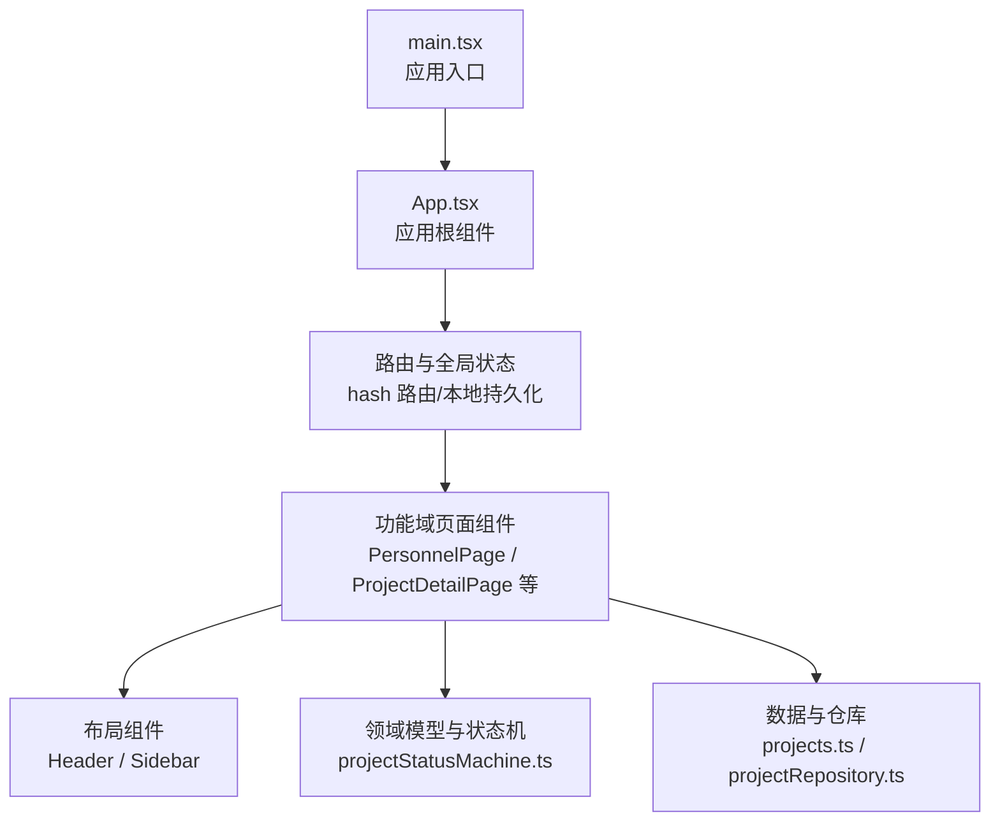
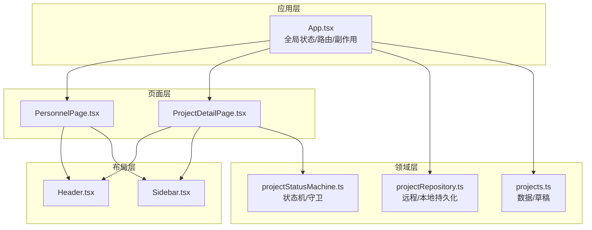
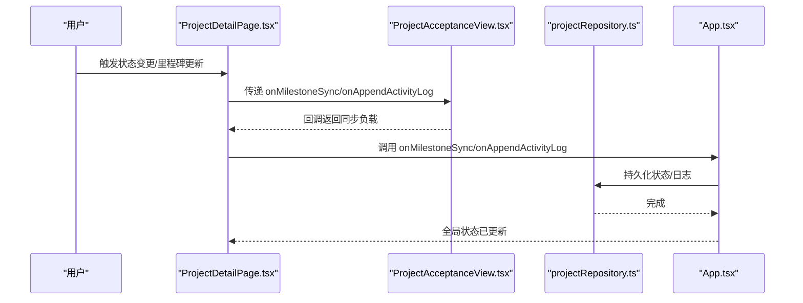
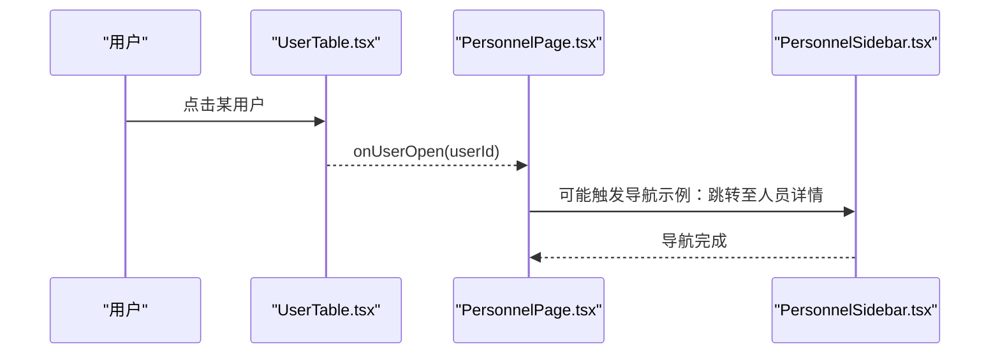
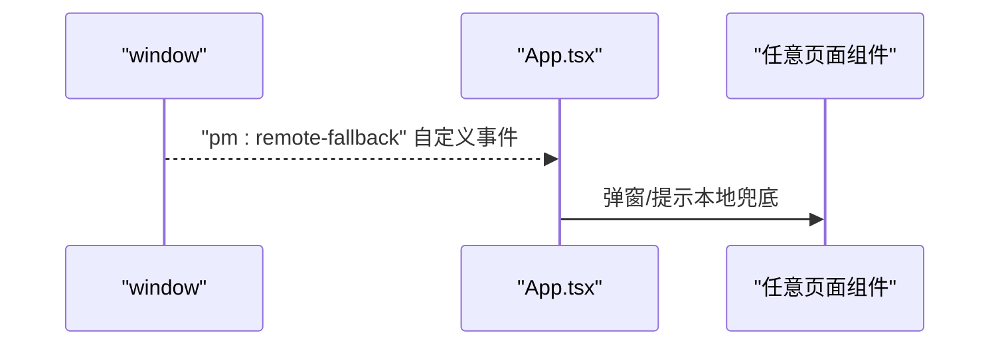
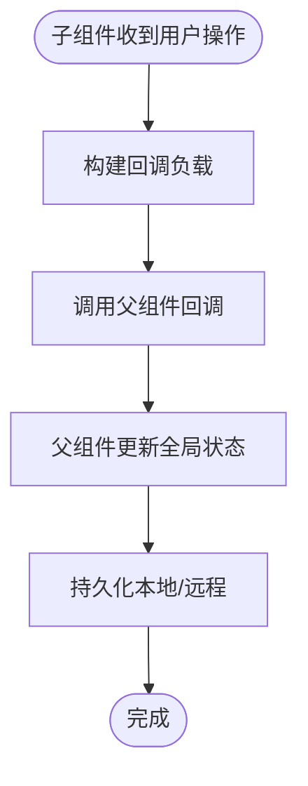
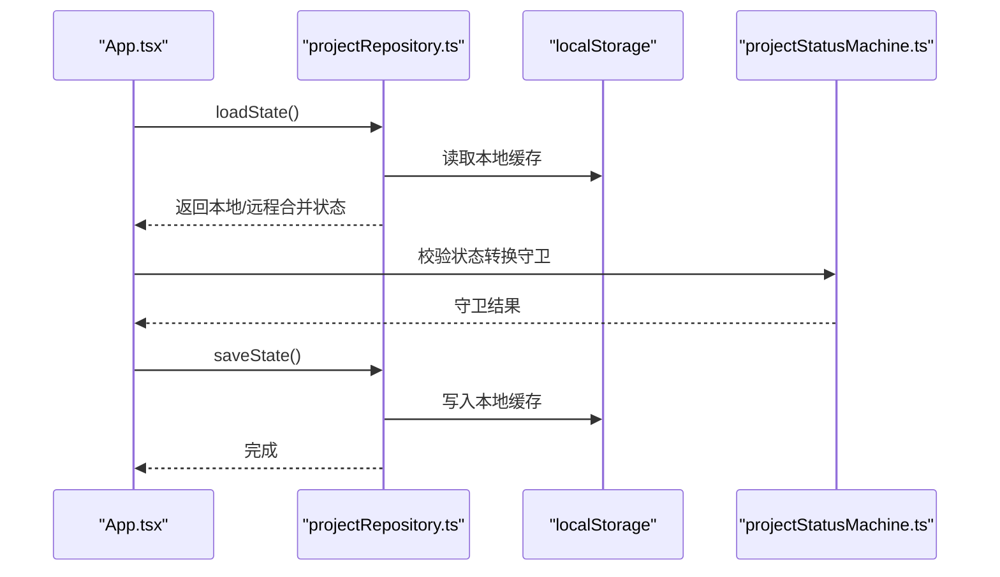
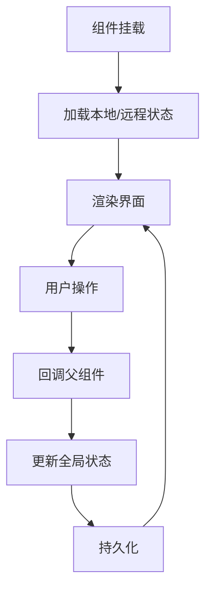
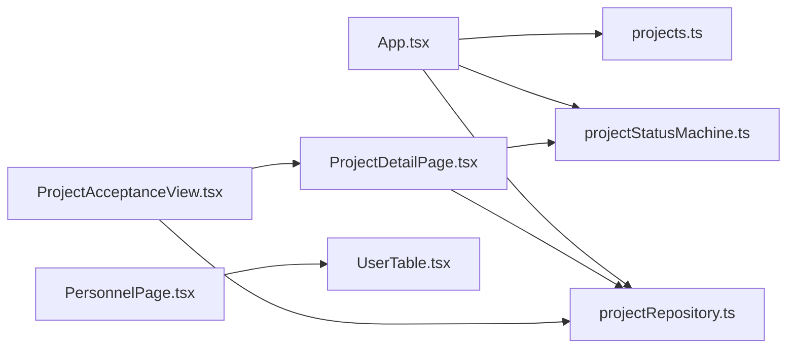

# 组件通信机制

<cite>
**本文引用的文件**
- [src/App.tsx](file://src/App.tsx)
- [src/main.tsx](file://src/main.tsx)
- [src/components/layout/Header.tsx](file://src/components/layout/Header.tsx)
- [src/components/layout/Sidebar.tsx](file://src/components/layout/Sidebar.tsx)
- [src/components/personnel/PersonnelPage.tsx](file://src/components/personnel/PersonnelPage.tsx)
- [src/components/personnel/UserTable.tsx](file://src/components/personnel/UserTable.tsx)
- [src/components/personnel/Tabs.tsx](file://src/components/personnel/Tabs.tsx)
- [src/components/personnel/Sidebar.tsx](file://src/components/personnel/Sidebar.tsx)
- [src/components/personnel/Header.tsx](file://src/components/personnel/Header.tsx)
- [src/components/project/ProjectDetailPage.tsx](file://src/components/project/ProjectDetailPage.tsx)
- [src/components/project/ProjectAcceptanceView.tsx](file://src/components/project/ProjectAcceptanceView.tsx)
- [src/components/project/ProjectTaskAndWbsView.tsx](file://src/components/project/ProjectTaskAndWbsView.tsx)
- [src/services/repositories/projectRepository.ts](file://src/services/repositories/projectRepository.ts)
- [src/data/projects.ts](file://src/data/projects.ts)
- [src/domain/projectStatusMachine.ts](file://src/domain/projectStatusMachine.ts)
</cite>

## 目录

1. [简介](#简介)
2. [项目结构](#项目结构)
3. [核心组件](#核心组件)
4. [架构总览](#架构总览)
5. [详细组件分析](#详细组件分析)
6. [依赖关系分析](#依赖关系分析)
7. [性能考量](#性能考量)
8. [故障排查指南](#故障排查指南)
9. [结论](#结论)
10. [附录](#附录)

## 简介

本文件系统性梳理 CodeBuddy 前端的组件通信机制，覆盖父子组件、兄弟组件与跨层级通信的实现方式；解释状态提升、回调函数传递、事件总线等模式的应用场景；阐述全局状态管理在组件通信中的作用与策略；描述数据流与状态同步机制；解释生命周期与异步数据处理；并给出最佳实践、性能优化与解耦指导。

## 项目结构

项目采用按功能域分层的目录组织方式，前端入口位于 main.tsx，应用根组件 App.tsx 负责路由解析、全局状态与副作用管理；各功能域（人员、项目、任务等）在 components 下独立组织，配合 services 层的仓库与 domain 层的状态机逻辑，形成清晰的职责边界。

图表来源

- [src/main.tsx:1-11](file://src/main.tsx#L1-L11)
- [src/App.tsx:346-800](file://src/App.tsx#L346-L800)
- [src/components/personnel/PersonnelPage.tsx:1-37](file://src/components/personnel/PersonnelPage.tsx#L1-L37)
- [src/components/project/ProjectDetailPage.tsx:103-115](file://src/components/project/ProjectDetailPage.tsx#L103-L115)
- [src/domain/projectStatusMachine.ts:105-164](file://src/domain/projectStatusMachine.ts#L105-L164)
- [src/services/repositories/projectRepository.ts:53-90](file://src/services/repositories/projectRepository.ts#L53-L90)

章节来源

- [src/main.tsx:1-11](file://src/main.tsx#L1-L11)
- [src/App.tsx:346-800](file://src/App.tsx#L346-L800)

## 核心组件

- 应用根组件 App.tsx：负责路由解析（hash）、全局状态（项目列表、日志、活动）、副作用（远程降级事件监听、本地持久化）、状态机守卫与状态流转、里程碑进度同步等。
- 功能域页面组件：如 PersonnelPage、ProjectDetailPage，承载具体业务页面的展示与交互。
- 布局组件：Header、Sidebar，提供统一的导航与标题区域。
- 仓库与数据：projectRepository 负责远程/本地状态读写；projects.ts 提供项目数据与草稿构建；projectStatusMachine.ts 提供状态机与守卫逻辑。

章节来源

- [src/App.tsx:346-800](file://src/App.tsx#L346-L800)
- [src/components/personnel/PersonnelPage.tsx:1-37](file://src/components/personnel/PersonnelPage.tsx#L1-L37)
- [src/components/project/ProjectDetailPage.tsx:103-115](file://src/components/project/ProjectDetailPage.tsx#L103-L115)
- [src/services/repositories/projectRepository.ts:53-90](file://src/services/repositories/projectRepository.ts#L53-L90)
- [src/data/projects.ts:381-451](file://src/data/projects.ts#L381-L451)
- [src/domain/projectStatusMachine.ts:105-164](file://src/domain/projectStatusMachine.ts#L105-L164)

## 架构总览

组件通信遵循“自顶向下数据流 + 向上传递回调”的模式，结合事件总线（window.CustomEvent）与本地持久化实现跨层级通信与全局状态管理。

图表来源

- [src/App.tsx:346-800](file://src/App.tsx#L346-L800)
- [src/components/personnel/PersonnelPage.tsx:1-37](file://src/components/personnel/PersonnelPage.tsx#L1-L37)
- [src/components/project/ProjectDetailPage.tsx:103-115](file://src/components/project/ProjectDetailPage.tsx#L103-L115)
- [src/components/layout/Header.tsx:1-37](file://src/components/layout/Header.tsx#L1-L37)
- [src/components/layout/Sidebar.tsx:1-108](file://src/components/layout/Sidebar.tsx#L1-L108)
- [src/domain/projectStatusMachine.ts:105-164](file://src/domain/projectStatusMachine.ts#L105-L164)
- [src/services/repositories/projectRepository.ts:53-90](file://src/services/repositories/projectRepository.ts#L53-L90)
- [src/data/projects.ts:381-451](file://src/data/projects.ts#L381-L451)

## 详细组件分析

### 父子组件通信（以项目详情为例）

- 父组件 ProjectDetailPage 将项目对象、活动日志、状态选项、回调函数等作为 props 传递给子组件（如 InfoCard、TaskTreeView、AcceptanceView 等）。
- 子组件通过回调向上游传递用户操作（如状态变更、里程碑同步、活动日志追加），父组件在 App.tsx 中集中处理并更新全局状态。

图表来源

- [src/components/project/ProjectDetailPage.tsx:103-115](file://src/components/project/ProjectDetailPage.tsx#L103-L115)
- [src/components/project/ProjectAcceptanceView.tsx:244-257](file://src/components/project/ProjectAcceptanceView.tsx#L244-L257)
- [src/services/repositories/projectRepository.ts:76-88](file://src/services/repositories/projectRepository.ts#L76-L88)
- [src/App.tsx:596-670](file://src/App.tsx#L596-L670)

章节来源

- [src/components/project/ProjectDetailPage.tsx:103-115](file://src/components/project/ProjectDetailPage.tsx#L103-L115)
- [src/components/project/ProjectAcceptanceView.tsx:244-257](file://src/components/project/ProjectAcceptanceView.tsx#L244-L257)
- [src/App.tsx:596-670](file://src/App.tsx#L596-L670)

### 兄弟组件通信（以人员管理为例）

- PersonnelPage 作为容器，向其子组件（Header、Tabs、UserTable、Sidebar）传递回调与状态。
- UserTable 通过 onUserOpen 将用户点击事件回传给 PersonnelPage，再由 PersonnelPage 决策是否打开详情或跳转至其他页面。

图表来源

- [src/components/personnel/UserTable.tsx:367-422](file://src/components/personnel/UserTable.tsx#L367-L422)
- [src/components/personnel/PersonnelPage.tsx:8-10](file://src/components/personnel/PersonnelPage.tsx#L8-L10)
- [src/components/personnel/Sidebar.tsx:21-95](file://src/components/personnel/Sidebar.tsx#L21-L95)

章节来源

- [src/components/personnel/UserTable.tsx:367-422](file://src/components/personnel/UserTable.tsx#L367-L422)
- [src/components/personnel/PersonnelPage.tsx:8-10](file://src/components/personnel/PersonnelPage.tsx#L8-L10)
- [src/components/personnel/Sidebar.tsx:21-95](file://src/components/personnel/Sidebar.tsx#L21-L95)

### 跨层级组件通信（事件总线与路由）

- 事件总线：App.tsx 监听 window 上的自定义事件（pm:remote-fallback），用于云端不可用时的本地兜底提示，避免层层传递。
- 路由与导航：Sidebar 与 Header 使用 window.location.hash 实现跨页面导航，无需中间组件透传。

图表来源

- [src/App.tsx:367-389](file://src/App.tsx#L367-L389)

章节来源

- [src/App.tsx:367-389](file://src/App.tsx#L367-L389)
- [src/components/layout/Sidebar.tsx:25-37](file://src/components/layout/Sidebar.tsx#L25-L37)
- [src/components/layout/Header.tsx:1-37](file://src/components/layout/Header.tsx#L1-L37)

### 状态提升与回调传递

- 状态提升：App.tsx 将全局状态（项目列表、日志）与操作方法（状态流转、基本信息更新、里程碑同步）提升至根组件，子组件通过 props 获取并调用。
- 回调传递：子组件通过 onMilestoneSync、onAppendActivityLog、onTransitionStatus 等回调向上游传递用户意图与数据负载。

图表来源

- [src/components/project/ProjectDetailPage.tsx:103-115](file://src/components/project/ProjectDetailPage.tsx#L103-L115)
- [src/App.tsx:596-670](file://src/App.tsx#L596-L670)
- [src/services/repositories/projectRepository.ts:76-88](file://src/services/repositories/projectRepository.ts#L76-L88)

章节来源

- [src/components/project/ProjectDetailPage.tsx:103-115](file://src/components/project/ProjectDetailPage.tsx#L103-L115)
- [src/App.tsx:596-670](file://src/App.tsx#L596-L670)
- [src/services/repositories/projectRepository.ts:76-88](file://src/services/repositories/projectRepository.ts#L76-L88)

### 全局状态管理与数据流

- 全局状态：App.tsx 维护 projectsState、projectStatusLogs，并通过 localStorage 与远程接口双向同步。
- 数据流：读取 → 合并远程/本地 → 渲染 → 用户操作 → 回调 → 更新 → 持久化。
- 状态机：projectStatusMachine 提供守卫与状态转换规则，确保状态变更合法。

图表来源

- [src/App.tsx:391-420](file://src/App.tsx#L391-L420)
- [src/services/repositories/projectRepository.ts:54-88](file://src/services/repositories/projectRepository.ts#L54-L88)
- [src/domain/projectStatusMachine.ts:105-164](file://src/domain/projectStatusMachine.ts#L105-L164)

章节来源

- [src/App.tsx:391-420](file://src/App.tsx#L391-L420)
- [src/services/repositories/projectRepository.ts:54-88](file://src/services/repositories/projectRepository.ts#L54-L88)
- [src/domain/projectStatusMachine.ts:105-164](file://src/domain/projectStatusMachine.ts#L105-L164)

### 生命周期与异步数据处理

- App.tsx 在挂载时读取本地状态、监听 hashchange、注册远程降级事件；在状态变化时持久化。
- AcceptanceView 在挂载时拉取验收状态并持续监听节点/里程碑变化，计算并同步里程碑进度。

图表来源

- [src/App.tsx:391-420](file://src/App.tsx#L391-L420)
- [src/components/project/ProjectAcceptanceView.tsx:212-257](file://src/components/project/ProjectAcceptanceView.tsx#L212-L257)

章节来源

- [src/App.tsx:391-420](file://src/App.tsx#L391-L420)
- [src/components/project/ProjectAcceptanceView.tsx:212-257](file://src/components/project/ProjectAcceptanceView.tsx#L212-L257)

### 错误处理策略

- 本地存储读写失败与远程请求失败均被结构化捕获并记录，同时降级到本地缓存，保证可用性。
- 事件总线用于云端不可用时的兜底提示，避免层层透传。

章节来源

- [src/services/repositories/projectRepository.ts:26-37](file://src/services/repositories/projectRepository.ts#L26-L37)
- [src/services/repositories/projectRepository.ts:65-73](file://src/services/repositories/projectRepository.ts#L65-L73)
- [src/App.tsx:367-389](file://src/App.tsx#L367-L389)

## 依赖关系分析

- 组件依赖：页面组件依赖布局组件与领域模型；项目详情依赖状态机与仓库；人员管理依赖仓库与数据。
- 外部依赖：window.location.hash、localStorage、CustomEvent。

图表来源

- [src/App.tsx:346-800](file://src/App.tsx#L346-L800)
- [src/components/project/ProjectDetailPage.tsx:103-115](file://src/components/project/ProjectDetailPage.tsx#L103-L115)
- [src/components/project/ProjectAcceptanceView.tsx:244-257](file://src/components/project/ProjectAcceptanceView.tsx#L244-L257)
- [src/components/personnel/PersonnelPage.tsx:1-37](file://src/components/personnel/PersonnelPage.tsx#L1-L37)
- [src/components/personnel/UserTable.tsx:119-130](file://src/components/personnel/UserTable.tsx#L119-L130)
- [src/services/repositories/projectRepository.ts:53-90](file://src/services/repositories/projectRepository.ts#L53-L90)
- [src/data/projects.ts:381-451](file://src/data/projects.ts#L381-L451)
- [src/domain/projectStatusMachine.ts:105-164](file://src/domain/projectStatusMachine.ts#L105-L164)

章节来源

- [src/App.tsx:346-800](file://src/App.tsx#L346-L800)
- [src/components/project/ProjectDetailPage.tsx:103-115](file://src/components/project/ProjectDetailPage.tsx#L103-L115)
- [src/components/project/ProjectAcceptanceView.tsx:244-257](file://src/components/project/ProjectAcceptanceView.tsx#L244-L257)
- [src/components/personnel/PersonnelPage.tsx:1-37](file://src/components/personnel/PersonnelPage.tsx#L1-L37)
- [src/components/personnel/UserTable.tsx:119-130](file://src/components/personnel/UserTable.tsx#L119-L130)
- [src/services/repositories/projectRepository.ts:53-90](file://src/services/repositories/projectRepository.ts#L53-L90)
- [src/data/projects.ts:381-451](file://src/data/projects.ts#L381-L451)
- [src/domain/projectStatusMachine.ts:105-164](file://src/domain/projectStatusMachine.ts#L105-L164)

## 性能考量

- 路由懒加载：App.tsx 对页面组件使用懒加载，降低首屏体积与初次渲染压力。
- 本地持久化：通过 localStorage 缓存项目状态与日志，减少远程请求次数。
- 计算缓存：useMemo 用于过滤与统计（如验收节点统计、任务树扁平化），避免重复计算。
- 异步降级：远程失败时快速降级到本地缓存，保证 UI 可用性。

章节来源

- [src/App.tsx:4-20](file://src/App.tsx#L4-L20)
- [src/App.tsx:411-420](file://src/App.tsx#L411-L420)
- [src/components/project/ProjectAcceptanceView.tsx:194-208](file://src/components/project/ProjectAcceptanceView.tsx#L194-L208)
- [src/components/project/ProjectDetailPage.tsx:145-160](file://src/components/project/ProjectDetailPage.tsx#L145-L160)

## 故障排查指南

- 云端不可用：监听 pm:remote-fallback 事件，弹窗提示并启用本地兜底。
- 本地存储异常：读写失败会被结构化记录并降级，检查浏览器存储权限与容量。
- 状态流转失败：依据守卫返回的原因文案定位缺失条件（如缺少里程碑、任务树、验收反馈等）。

章节来源

- [src/App.tsx:367-389](file://src/App.tsx#L367-L389)
- [src/services/repositories/projectRepository.ts:26-37](file://src/services/repositories/projectRepository.ts#L26-L37)
- [src/domain/projectStatusMachine.ts:115-160](file://src/domain/projectStatusMachine.ts#L115-L160)

## 结论

CodeBuddy 的组件通信以“自顶向下数据流 + 向上传递回调”为核心，结合事件总线与本地持久化实现跨层级通信与全局状态管理。通过状态机守卫与计算缓存，系统在保证一致性的同时兼顾性能与可用性。建议在新增组件时遵循状态提升与回调传递的原则，尽量减少跨层级耦合，必要时使用事件总线或共享仓库。

## 附录

- 最佳实践
  - 父子通信：props 传递 + 回调向上，避免跨层级直接访问。
  - 兄弟通信：通过共同父组件中转，或使用事件总线。
  - 跨层级通信：优先使用事件总线或共享仓库，避免深层嵌套。
  - 状态提升：将共享状态提升至最近公共祖先，必要时引入全局仓库。
  - 回调命名：语义化命名（如 onTransitionStatus、onMilestoneSync），便于理解与维护。
  - 错误处理：统一结构化错误记录与降级策略，保障用户体验。
- 性能优化
  - 使用 useMemo/useCallback 缓存计算结果与回调。
  - 懒加载页面组件，减少首屏负担。
  - 本地持久化与远程降级，提升稳定性与响应速度。
- 解耦与模块化
  - 布局组件与业务组件分离，提高复用性。
  - 领域模型与仓库分离，便于测试与替换实现。
