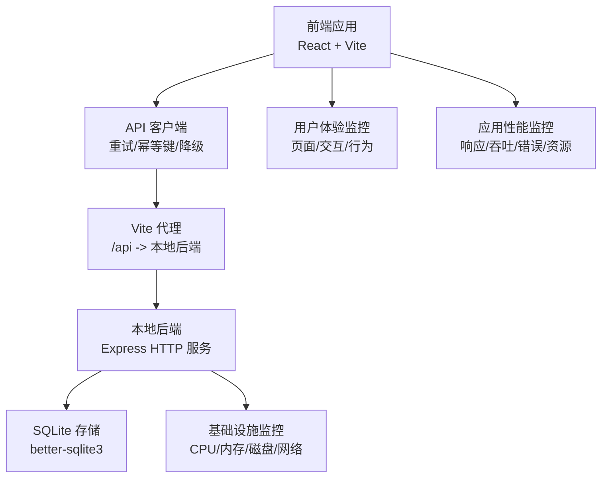
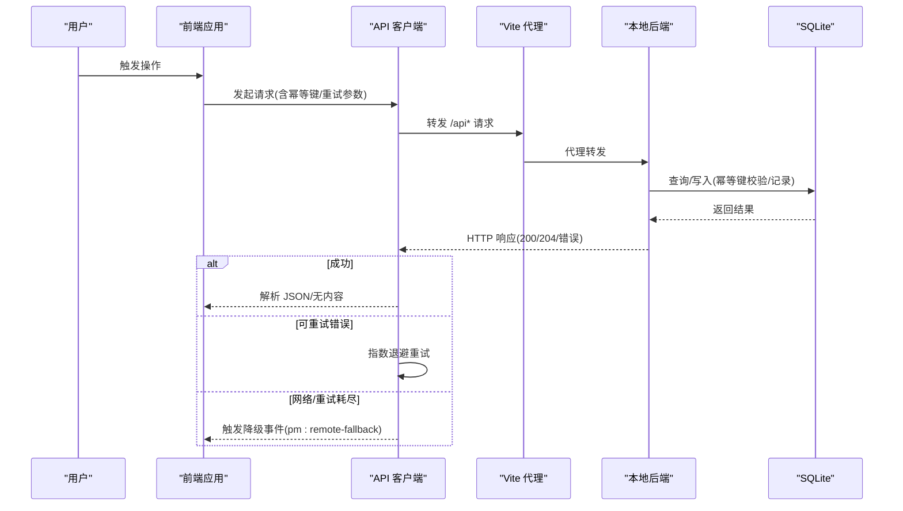
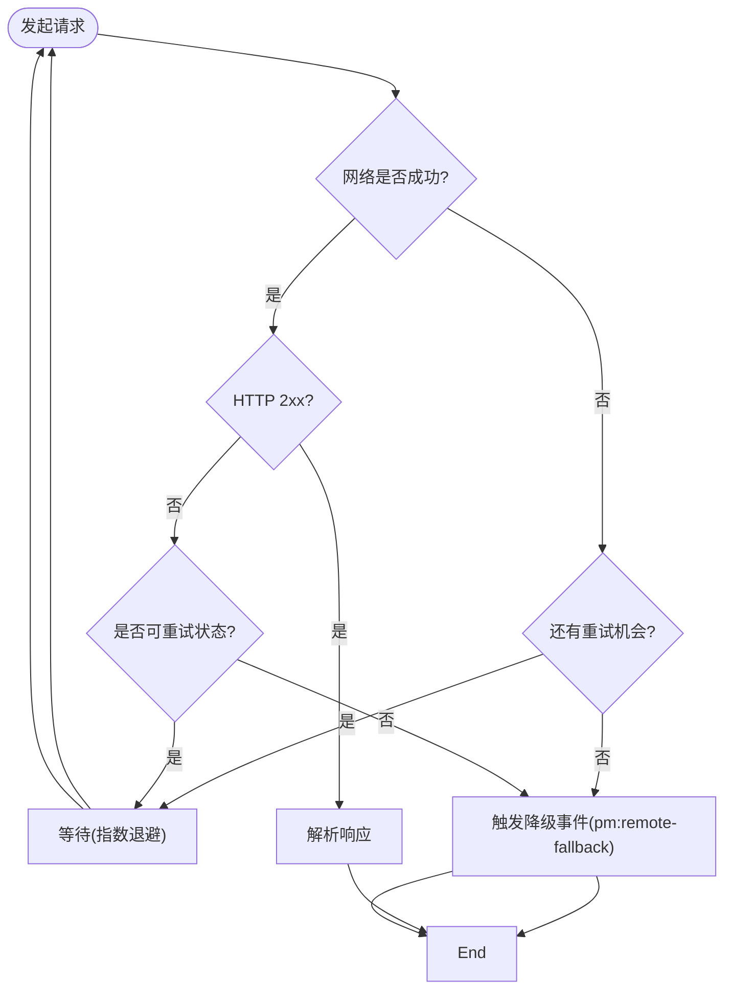
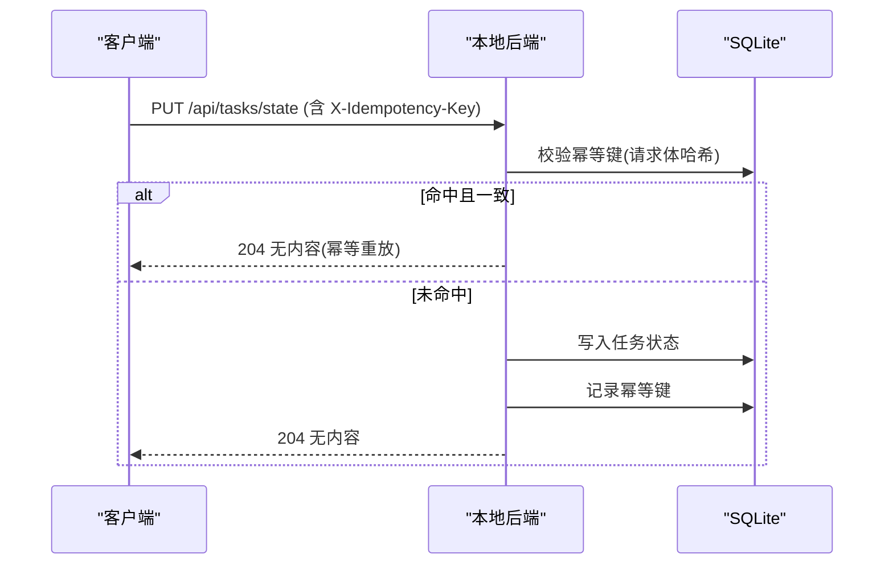
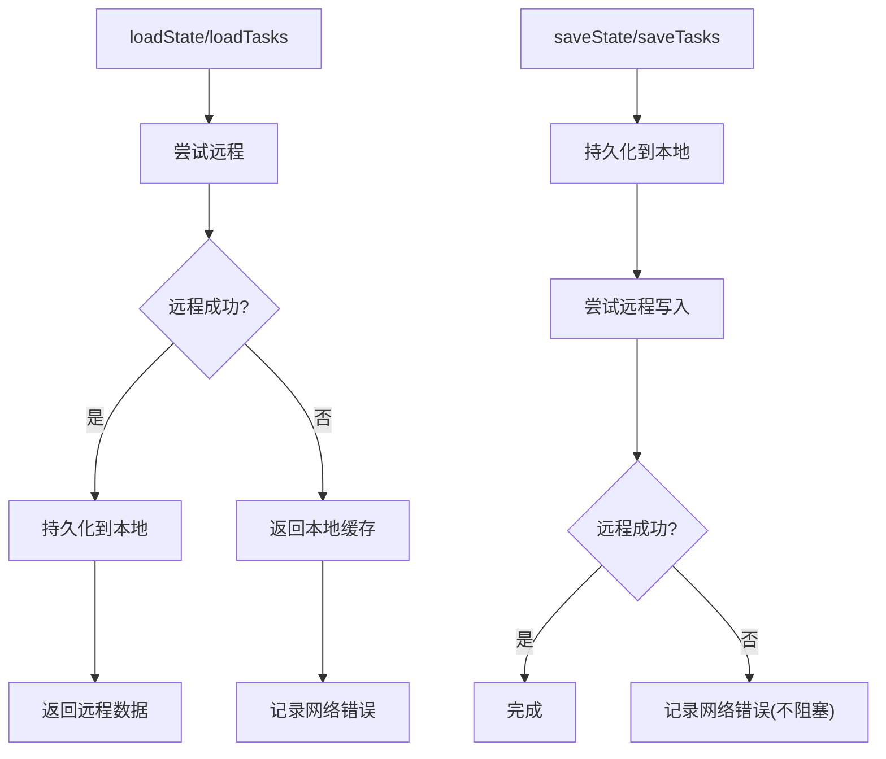
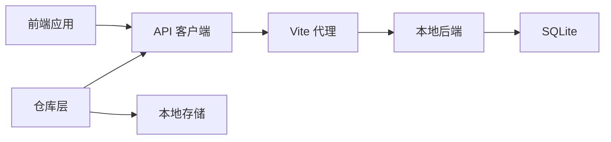

# 性能监控

<cite>
**本文引用的文件**
- [README.md](file://README.md)
- [package.json](file://package.json)
- [vite.config.ts](file://vite.config.ts)
- [local-api/server.ts](file://local-api/server.ts)
- [local-api/store/sqlite.ts](file://local-api/store/sqlite.ts)
- [local-api/store/idempotency.ts](file://local-api/store/idempotency.ts)
- [src/services/api/client.ts](file://src/services/api/client.ts)
- [src/services/errors/StructuredError.ts](file://src/services/errors/StructuredError.ts)
- [src/services/repositories/projectRepository.ts](file://src/services/repositories/projectRepository.ts)
- [src/services/repositories/taskRepository.ts](file://src/services/repositories/taskRepository.ts)
</cite>

## 目录

1. [简介](#简介)
2. [项目结构](#项目结构)
3. [核心组件](#核心组件)
4. [架构总览](#架构总览)
5. [详细组件分析](#详细组件分析)
6. [依赖关系分析](#依赖关系分析)
7. [性能考量](#性能考量)
8. [故障排查指南](#故障排查指南)
9. [结论](#结论)
10. [附录](#附录)

## 简介

本文件面向 CodeBuddy 项目，系统化梳理应用性能监控与用户体验监控方案，覆盖响应时间、吞吐量、错误率与资源利用率等应用层指标；同时给出用户体验监控策略（页面加载时间、交互延迟、用户行为分析）、基础设施监控建议（服务器性能、网络状况、存储容量）、告警机制设计（阈值、级别、通知渠道）、数据分析方法（趋势分析、异常检测、容量规划）以及监控仪表板与自定义指标配置指引，并总结监控工具集成与数据可视化最佳实践。

## 项目结构

- 前端采用 React + Vite + TypeScript，使用按需加载与代码分割策略，构建产物按模块拆分，降低主包体积与首屏加载压力。
- 本地后端为 Node.js + better-sqlite3 的轻量 HTTP 服务，提供五类状态接口与审计日志接口，支持幂等键去重与健康检查。
- 前端通过统一 API 客户端发起请求，内置重试、幂等键透传、网络错误降级与事件通知机制，确保在网络不稳定或后端不可用时仍可提供可用体验。

**章节来源**

- [README.md: 55-90:55-90](file://README.md#L55-L90)
- [vite.config.ts: 1-35:1-35](file://vite.config.ts#L1-L35)
- [local-api/server.ts: 1-414:1-414](file://local-api/server.ts#L1-L414)

## 核心组件

- API 客户端与重试/降级
  - 支持重试、幂等键透传、网络错误降级、可追踪日志与事件通知，便于构建可观测性与韧性。
- 本地后端与 SQLite
  - 提供项目/任务/验收/结算状态与审计日志接口，启用 WAL 模式以提升并发写入性能，具备幂等键去重与过期清理能力。
- 仓库层与本地缓存
  - 读写分离：优先远程，失败则回退本地缓存；写操作同样先落本地再异步同步远程，保证一致性与可用性。
- 错误模型与日志
  - 统一结构化错误模型，包含作用域、场景、状态码、幂等键等上下文，便于聚合与分析。

**章节来源**

- [src/services/api/client.ts: 1-172:1-172](file://src/services/api/client.ts#L1-L172)
- [local-api/server.ts: 1-414:1-414](file://local-api/server.ts#L1-L414)
- [local-api/store/sqlite.ts: 1-99:1-99](file://local-api/store/sqlite.ts#L1-L99)
- [local-api/store/idempotency.ts: 1-100:1-100](file://local-api/store/idempotency.ts#L1-L100)
- [src/services/repositories/projectRepository.ts: 1-90:1-90](file://src/services/repositories/projectRepository.ts#L1-L90)
- [src/services/repositories/taskRepository.ts: 1-318:1-318](file://src/services/repositories/taskRepository.ts#L1-L318)
- [src/services/errors/StructuredError.ts: 1-195:1-195](file://src/services/errors/StructuredError.ts#L1-L195)

## 架构总览

下图展示从前端到本地后端再到存储的典型调用链路，标注了可注入监控的关键节点（请求/响应、错误、降级、幂等键命中/记录）。

**图表来源**

- [src/services/api/client.ts: 83-172:83-172](file://src/services/api/client.ts#L83-L172)
- [vite.config.ts: 7-14:7-14](file://vite.config.ts#L7-L14)
- [local-api/server.ts: 338-386:338-386](file://local-api/server.ts#L338-L386)
- [local-api/store/sqlite.ts: 18-42:18-42](file://local-api/store/sqlite.ts#L18-L42)
- [local-api/store/idempotency.ts: 23-86:23-86](file://local-api/store/idempotency.ts#L23-L86)

**章节来源**

- [src/services/api/client.ts: 83-172:83-172](file://src/services/api/client.ts#L83-L172)
- [local-api/server.ts: 338-386:338-386](file://local-api/server.ts#L338-L386)
- [local-api/store/sqlite.ts: 18-42:18-42](file://local-api/store/sqlite.ts#L18-L42)
- [local-api/store/idempotency.ts: 23-86:23-86](file://local-api/store/idempotency.ts#L23-L86)

## 详细组件分析

### API 客户端与重试/降级机制

- 关键点
  - 默认重试次数与可重试状态集合；指数退避等待；网络异常与非 2xx 响应的区分处理。
  - 降级事件：当网络失败或重试耗尽时，派发 pm:remote-fallback 自定义事件，携带 scope、scenario、reason、status、idempotencyKey 等上下文。
  - 幂等键透传：自动在请求头注入 X-Idempotency-Key，配合后端幂等键校验与记录。
- 监控建议
  - 指标：请求成功率、平均/分位响应时间、重试次数分布、降级事件频次、幂等键命中率。
  - 告警：连续降级事件激增、重试耗尽比例上升、特定场景失败率异常。

**图表来源**

- [src/services/api/client.ts: 83-172:83-172](file://src/services/api/client.ts#L83-L172)

**章节来源**

- [src/services/api/client.ts: 1-172:1-172](file://src/services/api/client.ts#L1-L172)

### 本地后端与 SQLite 存储

- 关键点
  - 提供项目/任务/验收/结算状态与审计日志接口；CORS 预检与健康检查；幂等键校验与记录；WAL 模式提升并发写入。
  - 幂等键 TTL 与过期清理；数据库初始化与重置。
- 监控建议
  - 指标：接口 QPS、P95/P99 延迟、错误码分布、SQL 慢查询、幂等键命中/冲突、数据库连接/事务状态。
  - 告警：接口错误率突增、慢查询占比上升、幂等冲突频繁、数据库连接池耗尽。

**图表来源**

- [local-api/server.ts: 132-197:132-197](file://local-api/server.ts#L132-L197)
- [local-api/store/idempotency.ts: 23-86:23-86](file://local-api/store/idempotency.ts#L23-L86)

**章节来源**

- [local-api/server.ts: 1-414:1-414](file://local-api/server.ts#L1-L414)
- [local-api/store/sqlite.ts: 1-99:1-99](file://local-api/store/sqlite.ts#L1-L99)
- [local-api/store/idempotency.ts: 1-100:1-100](file://local-api/store/idempotency.ts#L1-L100)

### 仓库层与本地缓存

- 关键点
  - 读：优先远程，失败回退本地；写：先落本地，再异步远程同步。
  - 本地缓存键命名与版本化，避免脏读。
- 监控建议
  - 指标：远程/本地读写比例、回退次数、缓存命中率、状态不一致窗口时长。
  - 告警：回退次数持续升高、本地与远端差异窗口过大。

**图表来源**

- [src/services/repositories/projectRepository.ts: 54-88:54-88](file://src/services/repositories/projectRepository.ts#L54-L88)
- [src/services/repositories/taskRepository.ts: 142-169:142-169](file://src/services/repositories/taskRepository.ts#L142-L169)

**章节来源**

- [src/services/repositories/projectRepository.ts: 1-90:1-90](file://src/services/repositories/projectRepository.ts#L1-L90)
- [src/services/repositories/taskRepository.ts: 1-318:1-318](file://src/services/repositories/taskRepository.ts#L1-L318)

### 错误模型与日志

- 关键点
  - 结构化错误包含 code、scope、scenario、status、idempotencyKey、at 等字段，便于聚合与检索。
  - 日志记录器支持控制台输出与未来上报扩展。
- 监控建议
  - 指标：各作用域/场景错误分布、幂等冲突占比、网络错误占比。
  - 告警：特定场景错误率飙升、幂等冲突激增。

**章节来源**

- [src/services/errors/StructuredError.ts: 1-195:1-195](file://src/services/errors/StructuredError.ts#L1-L195)

## 依赖关系分析

- 前端对本地后端的依赖通过 Vite 代理实现，简化跨域与开发调试。
- 本地后端对 SQLite 的依赖稳定可靠，适合小规模数据与开发联调。
- 仓库层对 API 客户端与本地存储的依赖，形成“远程优先、本地兜底”的韧性架构。

**图表来源**

- [vite.config.ts: 7-14:7-14](file://vite.config.ts#L7-L14)
- [local-api/server.ts: 1-414:1-414](file://local-api/server.ts#L1-414)
- [src/services/api/client.ts: 1-172:1-172](file://src/services/api/client.ts#L1-L172)
- [src/services/repositories/projectRepository.ts: 1-90:1-90](file://src/services/repositories/projectRepository.ts#L1-L90)
- [src/services/repositories/taskRepository.ts: 1-318:1-318](file://src/services/repositories/taskRepository.ts#L1-L318)

**章节来源**

- [vite.config.ts: 1-35:1-35](file://vite.config.ts#L1-L35)
- [local-api/server.ts: 1-414:1-414](file://local-api/server.ts#L1-L414)
- [src/services/api/client.ts: 1-172:1-172](file://src/services/api/client.ts#L1-L172)
- [src/services/repositories/projectRepository.ts: 1-90:1-90](file://src/services/repositories/projectRepository.ts#L1-L90)
- [src/services/repositories/taskRepository.ts: 1-318:1-318](file://src/services/repositories/taskRepository.ts#L1-L318)

## 性能考量

- 响应时间
  - 前端：通过按需加载与代码分割降低首屏体积与加载时间；本地后端接口短路径、幂等键快速命中可减少往返。
  - 后端：WAL 模式提升写入并发；幂等键校验与记录避免重复写入。
- 吞吐量
  - 本地后端接口简单、无复杂业务逻辑，适合高并发小体量数据；SQLite 适配开发/联调场景。
- 错误率
  - API 客户端内置重试与降级，显著降低用户感知错误；结构化错误模型便于定位与统计。
- 资源利用率
  - 前端主包体积与首屏体积已优化；后端进程与数据库连接数可控，适合本地开发与联调。

**章节来源**

- [README.md: 156-166:156-166](file://README.md#L156-L166)
- [local-api/store/sqlite.ts: 32-33:32-33](file://local-api/store/sqlite.ts#L32-L33)
- [src/services/api/client.ts: 32-35:32-35](file://src/services/api/client.ts#L32-L35)

## 故障排查指南

- 网络请求失败
  - 检查本地后端是否启动、Vite 代理配置是否正确、请求头是否包含幂等键。
- 状态流转失败
  - 检查守卫条件与项目里程碑/任务树/验收结果等字段；查看控制台日志与本地缓存一致性。
- 本地缓存不一致
  - 清空 localStorage 并刷新页面；核对仓库层 load/save 行为与幂等键记录。
- 幂等冲突
  - 检查幂等键是否一致、请求体哈希是否匹配；关注幂等键过期清理与 TTL 设置。

**章节来源**

- [README.md: 227-243:227-243](file://README.md#L227-L243)
- [local-api/store/idempotency.ts: 47-51:47-51](file://local-api/store/idempotency.ts#L47-L51)
- [local-api/store/sqlite.ts: 68-80:68-80](file://local-api/store/sqlite.ts#L68-L80)

## 结论

本项目已具备良好的韧性与可观测性基础：前端统一 API 客户端、幂等键与降级事件、仓库层远程优先与本地兜底、结构化错误模型与日志记录。结合本文提出的监控指标、用户体验策略、基础设施监控、告警机制、数据分析方法与仪表板配置建议，可进一步完善 CodeBuddy 的全链路性能监控体系，支撑从开发联调到生产运维的持续演进。

## 附录

### 应用性能监控指标建议

- 响应时间
  - 接口 P50/P90/P95/P99；前端页面首屏/路由切换时间；关键交互延迟（点击到反馈）。
- 吞吐量
  - QPS、并发连接数、每接口请求数。
- 错误率
  - 全局错误率、按接口/场景/作用域细分错误率、幂等冲突率。
- 资源利用率
  - 前端：主包体积、首屏体积、缓存命中率；后端：CPU、内存、数据库连接数、慢查询。

### 用户体验监控策略

- 页面加载时间
  - Navigation Timing API 或 PerformanceObserver 记录首屏、路由切换、关键元素渲染时间。
- 交互延迟
  - 记录点击到响应的时延，识别卡顿与重渲染热点。
- 用户行为分析
  - 埋点关键路径（状态推进、任务创建/修改、审计事件），结合本地缓存一致性与降级事件进行归因。

### 基础设施监控方案

- 服务器性能
  - CPU、内存、负载、线程/连接数；进程健康检查与重启策略。
- 网络状况
  - 延迟、丢包、带宽；代理与上游连通性。
- 存储容量
  - SQLite 文件大小、WAL 文件增长、磁盘空间；定期清理与备份策略。

### 监控告警机制

- 阈值设置
  - 响应时间：P95 超过 2s；错误率：单接口错误率超过 1%；QPS：异常波动超过 3σ。
- 告警级别
  - 严重：接口不可用、错误率异常、数据库连接耗尽；警告：慢查询占比上升、缓存命中率下降。
- 通知渠道
  - 钉钉/企业微信机器人、邮件、电话（严重级别）。

### 监控数据分析方法

- 趋势分析
  - 按日/周/月对比关键指标，识别回归与优化效果。
- 异常检测
  - 统计模型（3σ、IQR）与机器学习（孤立森林）结合，识别离群点。
- 容量规划
  - 基于历史峰值与增长趋势，评估 CPU/内存/存储扩容与数据库优化策略。

### 仪表板配置与自定义指标

- 仪表板
  - 分层视图：全局概览（错误率/QPS）、接口明细（延迟/错误）、用户体验（首屏/交互）、基础设施（CPU/内存/存储）。
- 自定义指标
  - 降级事件计数、幂等键命中率、远程回退次数、慢查询 TopN、审计事件速率。

### 监控工具集成与数据可视化最佳实践

- 工具选择
  - 前端：埋点 SDK（如自研或开源方案）+ APM（如自建或云服务）；后端：Prometheus + Grafana。
- 最佳实践
  - 统一日志格式与标签（traceId/spanId/scenario/scope），支持跨层关联；将结构化错误模型映射到指标与告警；对敏感信息脱敏；定期演练告警与恢复流程。
