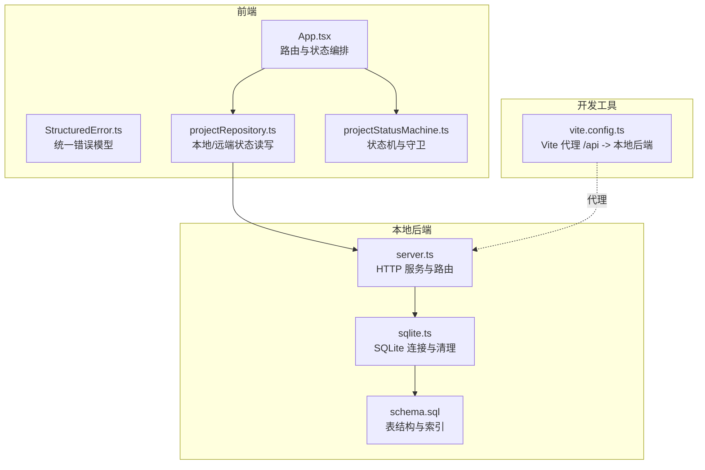
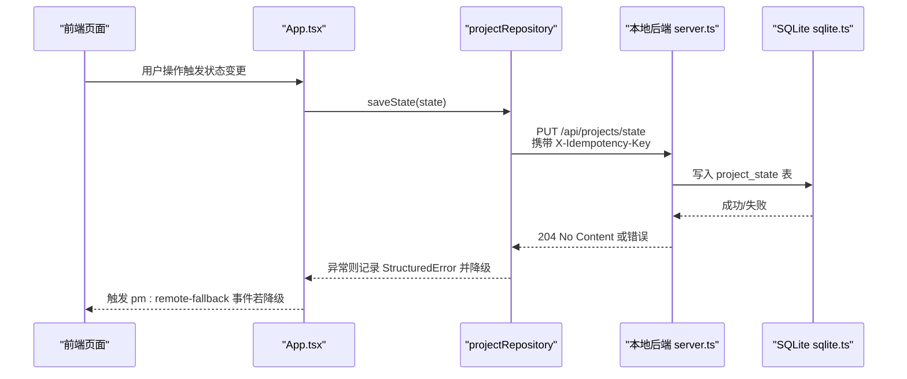
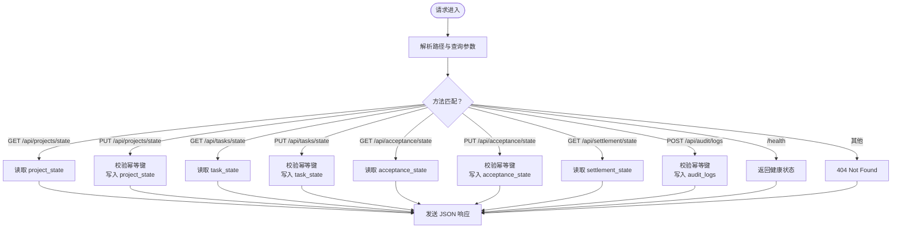
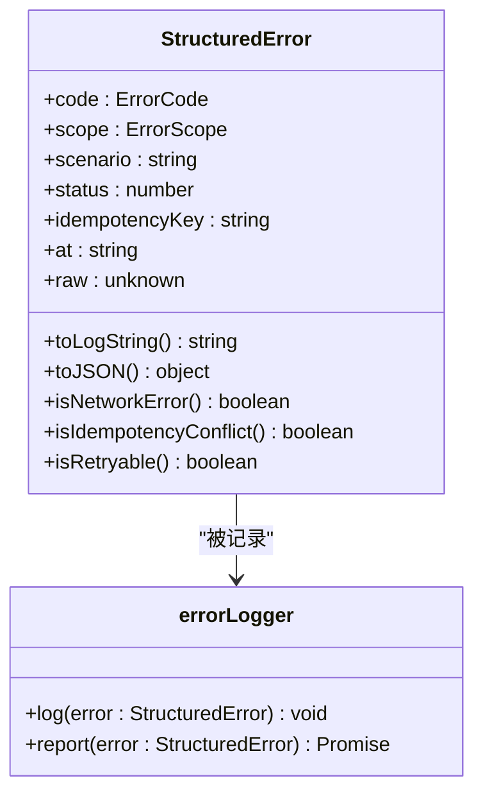
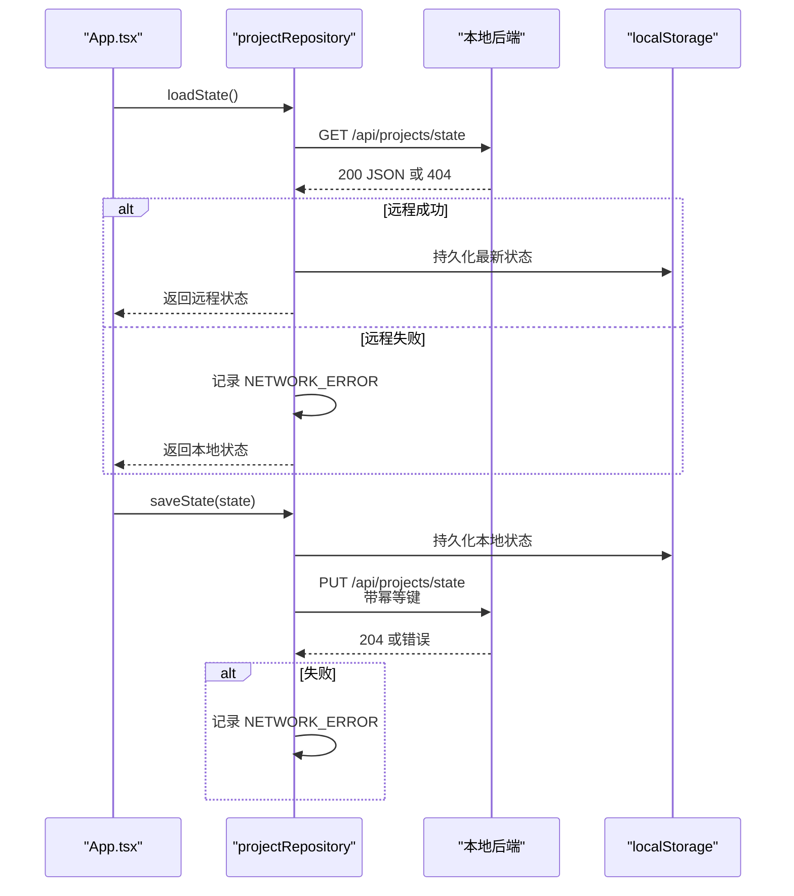
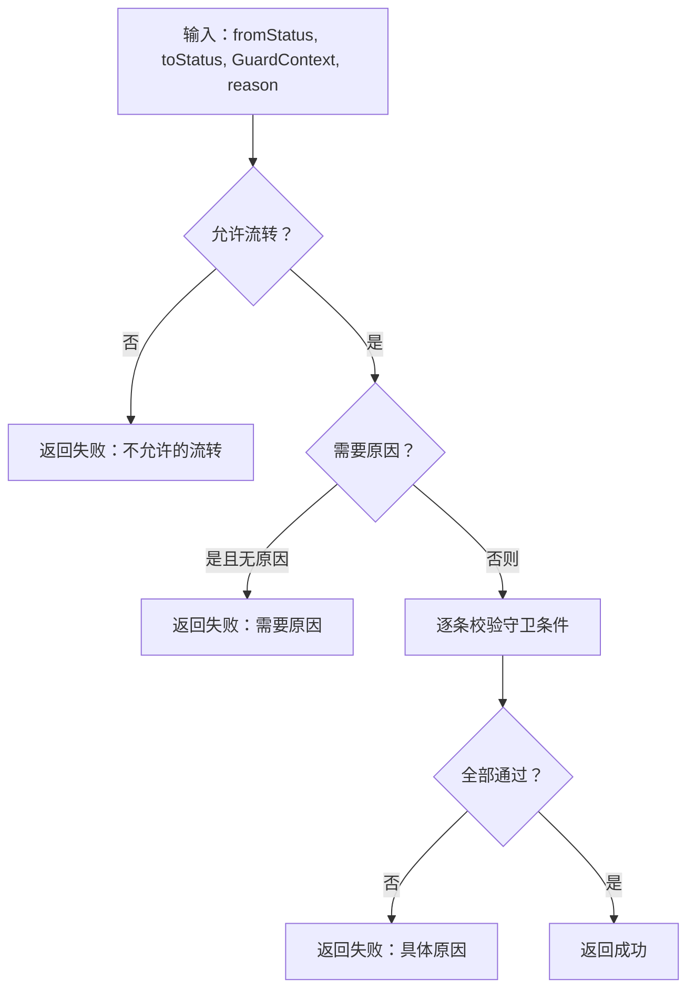
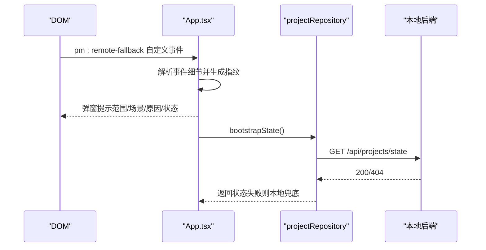
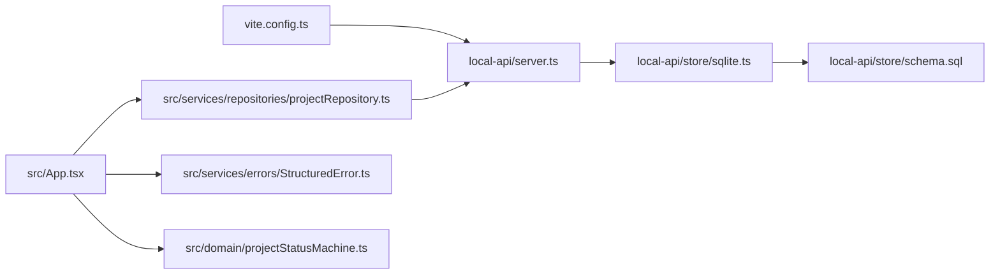
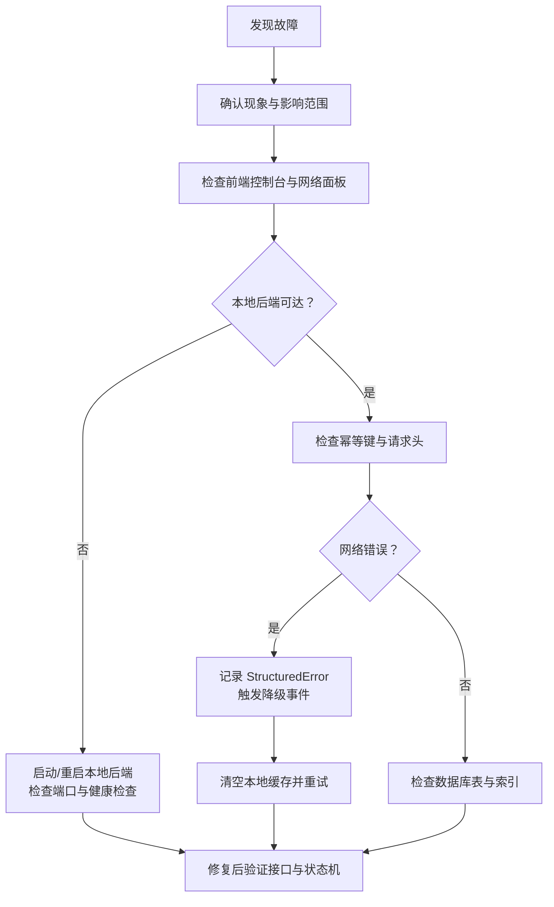

# 故障排查

<cite>
**本文引用的文件**
- [README.md](file://README.md)
- [CODEBUDDY.md](file://CODEBUDDY.md)
- [DESIGN_SPECIFICATION.md](file://DESIGN_SPECIFICATION.md)
- [vite.config.ts](file://vite.config.ts)
- [local-api/server.ts](file://local-api/server.ts)
- [local-api/store/sqlite.ts](file://local-api/store/sqlite.ts)
- [local-api/store/schema.sql](file://local-api/store/schema.sql)
- [src/services/errors/StructuredError.ts](file://src/services/errors/StructuredError.ts)
- [src/services/repositories/projectRepository.ts](file://src/services/repositories/projectRepository.ts)
- [src/domain/projectStatusMachine.ts](file://src/domain/projectStatusMachine.ts)
- [src/App.tsx](file://src/App.tsx)
</cite>

## 目录

1. [简介](#简介)
2. [项目结构](#项目结构)
3. [核心组件](#核心组件)
4. [架构总览](#架构总览)
5. [详细组件分析](#详细组件分析)
6. [依赖关系分析](#依赖关系分析)
7. [性能考量](#性能考量)
8. [故障排查指南](#故障排查指南)
9. [结论](#结论)
10. [附录](#附录)

## 简介

本指南面向运维工程师与开发工程师，围绕 CodeBuddy 项目在本地联调与演示环境下的常见故障类型与处置流程进行系统化梳理。重点覆盖以下方面：

- 故障类型：系统崩溃、性能下降、数据异常
- 诊断方法：问题定位、根因分析、解决方案制定
- 日志分析：日志收集、过滤与模式识别
- 恢复流程：数据恢复、系统重启、配置修复
- 紧急响应：故障分级、响应时间、责任分工
- 案例研究与经验总结：结合项目实际实现给出可操作的排障步骤
- 预防性维护与风险控制：幂等性、降级策略、健康检查
- 实用工具与技巧：本地后端、代理配置、错误模型与降级事件

## 项目结构

项目采用“前端单入口 + Hash 路由 + 本地后端 + 浏览器本地存储”的轻量架构：

- 前端：React + Vite + TypeScript，使用 Hash 路由与懒加载优化首屏
- 本地后端：Express 风格的本地 HTTP 服务，提供五类状态接口与审计日志接口，使用 SQLite 存储
- 数据持久化：前端 localStorage 作为“数据后端”，同时后端 SQLite 作为权威存储
- 错误治理：统一 StructuredError 错误模型，支持幂等键与降级事件

**图示来源**

- [src/App.tsx:1-879](file://src/App.tsx#L1-L879)
- [src/services/errors/StructuredError.ts:1-195](file://src/services/errors/StructuredError.ts#L1-L195)
- [src/services/repositories/projectRepository.ts:1-90](file://src/services/repositories/projectRepository.ts#L1-L90)
- [src/domain/projectStatusMachine.ts:1-164](file://src/domain/projectStatusMachine.ts#L1-L164)
- [local-api/server.ts:1-414](file://local-api/server.ts#L1-L414)
- [local-api/store/sqlite.ts:1-99](file://local-api/store/sqlite.ts#L1-L99)
- [local-api/store/schema.sql:1-72](file://local-api/store/schema.sql#L1-L72)
- [vite.config.ts:1-35](file://vite.config.ts#L1-L35)

**章节来源**

- [README.md:55-113](file://README.md#L55-L113)
- [CODEBUDDY.md:23-90](file://CODEBUDDY.md#L23-L90)
- [vite.config.ts:7-14](file://vite.config.ts#L7-L14)

## 核心组件

- 统一错误模型：提供结构化错误字段与日志字符串格式，支持幂等键、HTTP 状态、时间戳等，便于日志追踪与上报
- 仓储层：封装本地 localStorage 与远程后端的读写，支持网络失败时的本地降级
- 项目状态机：定义状态与守卫条件，提供可用流转选项与钩子日志
- 本地后端：提供项目/任务/验收/结算/审计日志接口，支持幂等键与健康检查
- 前端应用：集中路由与状态编排，监听远程降级事件并弹窗提示

**章节来源**

- [src/services/errors/StructuredError.ts:7-127](file://src/services/errors/StructuredError.ts#L7-L127)
- [src/services/repositories/projectRepository.ts:53-89](file://src/services/repositories/projectRepository.ts#L53-L89)
- [src/domain/projectStatusMachine.ts:47-163](file://src/domain/projectStatusMachine.ts#L47-L163)
- [local-api/server.ts:70-329](file://local-api/server.ts#L70-L329)
- [src/App.tsx:366-389](file://src/App.tsx#L366-L389)

## 架构总览

本地联调链路的关键路径：

- 前端通过 Vite 代理将 /api 请求转发到本地后端（默认 3100 端口）
- 本地后端使用 SQLite 存储五类状态与审计日志，并对写操作进行幂等性校验
- 前端在 localStorage 中持久化项目状态与日志，网络异常时自动降级

**图示来源**

- [src/App.tsx:391-420](file://src/App.tsx#L391-L420)
- [src/services/repositories/projectRepository.ts:76-88](file://src/services/repositories/projectRepository.ts#L76-L88)
- [local-api/server.ts:70-129](file://local-api/server.ts#L70-L129)
- [local-api/store/sqlite.ts:18-42](file://local-api/store/sqlite.ts#L18-L42)

## 详细组件分析

### 组件A：本地后端服务（server.ts）

- 职责：提供五类状态接口与审计日志接口，支持幂等键与健康检查
- 关键点：
  - GET/PUT 项目状态接口，支持 envId 查询参数
  - GET/PUT 任务状态接口，支持 envId + contextKey
  - PUT 验收状态接口，支持 envId + projectCode
  - GET 结算状态接口
  - POST 审计日志接口，支持 envId + 场景 + 详情 + 项目编码 + 时间戳
  - 幂等键：通过 X-Idempotency-Key 校验，避免重复提交
  - 健康检查：/health 返回服务状态
  - CORS：允许 OPTIONS 预检与指定头

**图示来源**

- [local-api/server.ts:338-386](file://local-api/server.ts#L338-L386)
- [local-api/server.ts:70-329](file://local-api/server.ts#L70-L329)

**章节来源**

- [local-api/server.ts:18-66](file://local-api/server.ts#L18-L66)
- [local-api/server.ts:70-329](file://local-api/server.ts#L70-L329)

### 组件B：错误模型与日志记录（StructuredError.ts）

- 职责：统一错误结构，提供 toLogString 与 toJSON，支持幂等键、HTTP 状态、时间戳
- 关键点：
  - 错误码枚举：网络错误、验证错误、业务错误、幂等冲突、未授权、禁止、未找到、限流、服务器错误、重试耗尽
  - 错误作用域：api、repository、domain、ui
  - 工厂函数：便捷创建各类错误
  - 日志记录器：控制台输出与未来上报扩展

**图示来源**

- [src/services/errors/StructuredError.ts:27-127](file://src/services/errors/StructuredError.ts#L27-L127)
- [src/services/errors/StructuredError.ts:179-194](file://src/services/errors/StructuredError.ts#L179-L194)

**章节来源**

- [src/services/errors/StructuredError.ts:7-127](file://src/services/errors/StructuredError.ts#L7-L127)
- [src/services/errors/StructuredError.ts:179-194](file://src/services/errors/StructuredError.ts#L179-L194)

### 组件C：仓储层与降级策略（projectRepository.ts）

- 职责：读取/写入本地状态，尝试远程同步，失败时降级到本地缓存
- 关键点：
  - 本地存储键：pm-projects-state-v1、pm-project-logs-v1
  - 远程加载失败：记录 NETWORK_ERROR，返回本地状态
  - 远程保存失败：记录 NETWORK_ERROR，继续使用本地状态
  - 幂等键：写入时附加 X-Idempotency-Key

**图示来源**

- [src/services/repositories/projectRepository.ts:54-88](file://src/services/repositories/projectRepository.ts#L54-L88)
- [local-api/server.ts:70-129](file://local-api/server.ts#L70-L129)

**章节来源**

- [src/services/repositories/projectRepository.ts:14-51](file://src/services/repositories/projectRepository.ts#L14-L51)
- [src/services/repositories/projectRepository.ts:53-89](file://src/services/repositories/projectRepository.ts#L53-L89)

### 组件D：项目状态机与守卫（projectStatusMachine.ts）

- 职责：定义状态集合、允许的流转、守卫条件与进入状态钩子
- 关键点：
  - 状态集合与允许流转映射
  - 守卫上下文：容器、审批、里程碑、任务树、标准绑定、关键任务完成度、验收通过/反馈、整改闭环、结算完成
  - 可用流转选项与禁用原因
  - 状态进入钩子日志

**图示来源**

- [src/domain/projectStatusMachine.ts:105-163](file://src/domain/projectStatusMachine.ts#L105-L163)

**章节来源**

- [src/domain/projectStatusMachine.ts:47-95](file://src/domain/projectStatusMachine.ts#L47-L95)
- [src/domain/projectStatusMachine.ts:105-163](file://src/domain/projectStatusMachine.ts#L105-L163)

### 组件E：前端应用与降级事件（App.tsx）

- 职责：集中路由与状态编排，监听 pm:remote-fallback 事件并弹窗提示
- 关键点：
  - 初始化加载与持久化
  - 监听远程降级事件，去重告警指纹
  - 状态流转与日志记录

**图示来源**

- [src/App.tsx:366-389](file://src/App.tsx#L366-L389)
- [src/services/repositories/projectRepository.ts:54-74](file://src/services/repositories/projectRepository.ts#L54-L74)

**章节来源**

- [src/App.tsx:346-420](file://src/App.tsx#L346-L420)
- [src/App.tsx:366-389](file://src/App.tsx#L366-L389)

## 依赖关系分析

- 前端依赖本地后端：通过 Vite 代理将 /api 请求转发到本地 3100 端口
- 本地后端依赖 SQLite：初始化数据库、执行 schema、写入/读取状态与审计日志
- 仓储层依赖错误模型：统一错误记录与幂等键
- 应用层依赖状态机：守卫校验与日志生成

**图示来源**

- [vite.config.ts:7-14](file://vite.config.ts#L7-L14)
- [local-api/server.ts:1-414](file://local-api/server.ts#L1-L414)
- [local-api/store/sqlite.ts:1-99](file://local-api/store/sqlite.ts#L1-L99)
- [local-api/store/schema.sql:1-72](file://local-api/store/schema.sql#L1-L72)
- [src/services/repositories/projectRepository.ts:1-90](file://src/services/repositories/projectRepository.ts#L1-L90)
- [src/services/errors/StructuredError.ts:1-195](file://src/services/errors/StructuredError.ts#L1-L195)
- [src/domain/projectStatusMachine.ts:1-164](file://src/domain/projectStatusMachine.ts#L1-L164)
- [src/App.tsx:1-879](file://src/App.tsx#L1-L879)

**章节来源**

- [vite.config.ts:7-14](file://vite.config.ts#L7-L14)
- [local-api/store/schema.sql:4-71](file://local-api/store/schema.sql#L4-L71)

## 性能考量

- 首屏与包体：通过懒加载与手动分包策略降低首屏体积，构建产物按需加载
- 本地后端并发：SQLite 启用 WAL 模式以提升并发读写
- 本地存储：localStorage 读写在前端，避免频繁网络往返

**章节来源**

- [README.md:156-166](file://README.md#L156-L166)
- [local-api/store/sqlite.ts:32-33](file://local-api/store/sqlite.ts#L32-L33)
- [CODEBUDDY.md:73-85](file://CODEBUDDY.md#L73-L85)

## 故障排查指南

### 一、常见故障类型与诊断方法

1. 系统崩溃

- 现象：页面白屏、路由失效、组件渲染异常
- 诊断步骤：
  - 检查浏览器控制台是否有 JavaScript 错误
  - 确认前端路由是否正确（Hash 路由）
  - 检查本地后端是否启动（端口 3100）
  - 检查 Vite 代理配置是否生效（/api -> localhost:3100）
- 相关实现参考：
  - 前端路由与懒加载：[src/App.tsx:1-879](file://src/App.tsx#L1-L879)
  - Vite 代理配置：[vite.config.ts:7-14](file://vite.config.ts#L7-L14)
  - 本地后端启动与健康检查：[local-api/server.ts:390-414](file://local-api/server.ts#L390-L414)

2. 性能下降

- 现象：首屏加载慢、页面切换卡顿、任务中心渲染缓慢
- 诊断步骤：
  - 检查构建产物与分包情况，确认按需加载生效
  - 检查 localStorage 读写是否频繁导致阻塞
  - 检查 SQLite 写入是否频繁（状态保存）
- 相关实现参考：
  - 构建与分包策略：[vite.config.ts:15-33](file://vite.config.ts#L15-L33)
  - 本地存储读写：[src/services/repositories/projectRepository.ts:14-51](file://src/services/repositories/projectRepository.ts#L14-L51)
  - 写入路径幂等与响应：[local-api/server.ts:86-125](file://local-api/server.ts#L86-L125)

3. 数据异常

- 现象：项目状态不一致、日志缺失、本地缓存与后端不一致
- 诊断步骤：
  - 清空 localStorage 对应键（pm-projects-state-v1、pm-project-logs-v1）并刷新
  - 检查后端 SQLite 表内容（project_state、task_state、acceptance_state、settlement_state、audit_logs）
  - 检查幂等键是否过期或冲突
- 相关实现参考：
  - 本地存储键与读写：[src/services/repositories/projectRepository.ts:6-51](file://src/services/repositories/projectRepository.ts#L6-L51)
  - SQLite 初始化与清理：[local-api/store/sqlite.ts:18-80](file://local-api/store/sqlite.ts#L18-L80)
  - 表结构与索引：[local-api/store/schema.sql:4-71](file://local-api/store/schema.sql#L4-L71)

**章节来源**

- [src/App.tsx:346-420](file://src/App.tsx#L346-L420)
- [vite.config.ts:7-14](file://vite.config.ts#L7-L14)
- [local-api/server.ts:390-414](file://local-api/server.ts#L390-L414)
- [src/services/repositories/projectRepository.ts:6-51](file://src/services/repositories/projectRepository.ts#L6-L51)
- [local-api/store/sqlite.ts:18-80](file://local-api/store/sqlite.ts#L18-L80)
- [local-api/store/schema.sql:4-71](file://local-api/store/schema.sql#L4-L71)

### 二、故障排查流程

**图示来源**

- [src/services/errors/StructuredError.ts:179-194](file://src/services/errors/StructuredError.ts#L179-L194)
- [src/App.tsx:366-389](file://src/App.tsx#L366-L389)
- [local-api/server.ts:390-414](file://local-api/server.ts#L390-L414)
- [local-api/store/schema.sql:4-71](file://local-api/store/schema.sql#L4-L71)

### 三、日志分析技术

- 日志收集
  - 前端：StructuredError.toLogString 输出结构化日志，包含作用域、场景、错误码、HTTP 状态、幂等键
  - 后端：控制台输出请求处理日志（含幂等重放提示）
- 日志过滤
  - 前端：根据作用域（api/repository/domain/ui）、场景、错误码过滤
  - 后端：根据 envId、scene、projectCode 等字段过滤审计日志
- 模式识别
  - 网络错误模式：NETWORK_ERROR + 重试策略
  - 幂等冲突模式：IDEMPOTENCY_CONFLICT + 幂等键冲突
  - 降级事件模式：pm:remote-fallback + 去重指纹

**章节来源**

- [src/services/errors/StructuredError.ts:57-73](file://src/services/errors/StructuredError.ts#L57-L73)
- [src/services/errors/StructuredError.ts:179-194](file://src/services/errors/StructuredError.ts#L179-L194)
- [local-api/server.ts:99-101](file://local-api/server.ts#L99-L101)
- [local-api/store/schema.sql:43-55](file://local-api/store/schema.sql#L43-L55)

### 四、恢复流程

- 数据恢复
  - 清空 localStorage 对应键并刷新，强制从后端拉取最新状态
  - 重置后端数据库（测试用途）：删除各状态表与幂等键表数据
- 系统重启
  - 重启本地后端服务，确保健康检查返回正常
  - 重启前端开发服务器，确认代理配置有效
- 配置修复
  - 检查 Vite 代理配置是否指向本地后端
  - 检查请求头是否包含 X-Idempotency-Key（幂等键）

**章节来源**

- [src/services/repositories/projectRepository.ts:14-51](file://src/services/repositories/projectRepository.ts#L14-L51)
- [local-api/store/sqlite.ts:85-98](file://local-api/store/sqlite.ts#L85-L98)
- [local-api/server.ts:390-414](file://local-api/server.ts#L390-L414)
- [vite.config.ts:7-14](file://vite.config.ts#L7-L14)

### 五、紧急响应机制

- 故障分级（建议）
  - P0：本地后端不可用、前端白屏、核心接口 5xx
  - P1：网络抖动、幂等冲突、性能严重下降
  - P2：UI 卡顿、日志缺失、本地缓存不一致
- 响应时间（建议）
  - P0：10 分钟内响应，30 分钟内恢复
  - P1：30 分钟内响应，2 小时内恢复
  - P2：2 小时内响应，1 天内恢复
- 责任分工（建议）
  - 前端：路由、状态、降级事件、本地存储
  - 后端：接口可用性、数据库、幂等键、健康检查
  - 运维：代理配置、端口占用、进程管理

### 六、故障案例研究与经验总结

- 案例1：网络请求失败
  - 现象：前端控制台显示 NETWORK_ERROR，状态流转失败
  - 根因：本地后端未启动或代理配置错误
  - 处置：启动本地后端，检查 /health，确认 Vite 代理
  - 预防：在 CI 中增加健康检查与代理连通性校验
- 案例2：状态流转失败
  - 现象：点击推进按钮无效果，控制台日志显示守卫条件不满足
  - 根因：里程碑、任务树、验收结果等前置条件未满足
  - 处置：补齐前置数据，再次推进；必要时清空本地缓存重试
- 案例3：本地缓存不一致
  - 现象：页面显示旧状态
  - 根因：localStorage 异常或被污染
  - 处置：清空 pm-projects-state-v1、pm-project-logs-v1，刷新页面

**章节来源**

- [README.md:227-243](file://README.md#L227-L243)
- [src/App.tsx:439-504](file://src/App.tsx#L439-L504)
- [src/services/repositories/projectRepository.ts:14-51](file://src/services/repositories/projectRepository.ts#L14-L51)

### 七、预防性维护与风险控制

- 幂等性保障
  - 写操作统一携带 X-Idempotency-Key，后端校验并记录幂等键
  - 定期清理过期幂等键（默认 7 天）
- 降级策略
  - 网络失败自动降级到本地缓存，触发 pm:remote-fallback 事件
  - UI 层弹窗提示范围、场景、原因与状态
- 健康检查
  - 本地后端提供 /health 接口，支持定时探测
- 数据一致性
  - 本地后端 WAL 模式提升并发写入稳定性
  - 审计日志表建立索引，便于查询与分析

**章节来源**

- [README.md:153-154](file://README.md#L153-L154)
- [local-api/server.ts:92-125](file://local-api/server.ts#L92-L125)
- [local-api/store/sqlite.ts:68-80](file://local-api/store/sqlite.ts#L68-L80)
- [src/App.tsx:366-389](file://src/App.tsx#L366-L389)
- [local-api/store/schema.sql:53-71](file://local-api/store/schema.sql#L53-L71)

### 八、实用工具与技巧

- 本地后端启动与健康检查
  - 启动命令：参考根 README 的本地后端启动说明
  - 健康检查：访问 http://localhost:3100/health
- 代理配置验证
  - 确认 vite.config.ts 中 /api 代理指向本地后端
- 幂等键调试
  - 在请求头中设置 X-Idempotency-Key，观察后端幂等重放日志
- 本地缓存清理
  - 清空 localStorage 中 pm-projects-state-v1、pm-project-logs-v1 键
- 错误日志定位
  - 使用 StructuredError.toLogString 输出的结构化日志进行过滤与分析

**章节来源**

- [README.md:141-154](file://README.md#L141-L154)
- [vite.config.ts:7-14](file://vite.config.ts#L7-L14)
- [local-api/server.ts:92-125](file://local-api/server.ts#L92-L125)
- [src/services/errors/StructuredError.ts:57-73](file://src/services/errors/StructuredError.ts#L57-L73)

## 结论

本指南基于 CodeBuddy 项目的本地联调架构，提供了系统化的故障排查方法与恢复流程。通过统一错误模型、幂等性保障、降级策略与健康检查，能够在多数情况下快速定位并解决问题。建议在团队内固化故障分级与响应流程，并持续完善日志与监控，以提升系统的可观测性与韧性。

## 附录

### A. 关键接口一览

- 项目状态
  - GET /api/projects/state?envId=...
  - PUT /api/projects/state（携带 X-Idempotency-Key）
- 任务状态
  - GET /api/tasks/state?envId=...&contextKey=...
  - PUT /api/tasks/state（携带 X-Idempotency-Key）
- 验收状态
  - GET /api/acceptance/state?envId=...&projectCode=...
  - PUT /api/acceptance/state（携带 X-Idempotency-Key）
- 结算状态
  - GET /api/settlement/state?envId=...
- 审计日志
  - POST /api/audit/logs（携带 X-Idempotency-Key）

**章节来源**

- [README.md:146-151](file://README.md#L146-L151)
- [local-api/server.ts:70-329](file://local-api/server.ts#L70-L329)

### B. 数据库表与索引

- project_state、task_state、acceptance_state、settlement_state、audit_logs
- 幂等键表 idempotency_keys
- 审计日志索引：env_id、project_code、scene

**章节来源**

- [local-api/store/schema.sql:4-71](file://local-api/store/schema.sql#L4-L71)
