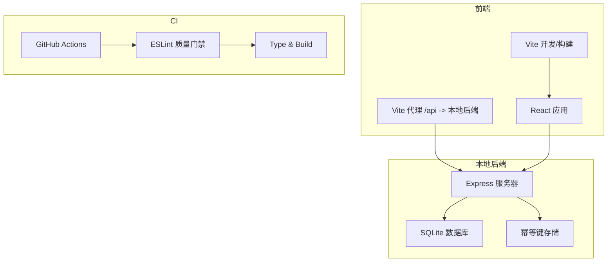
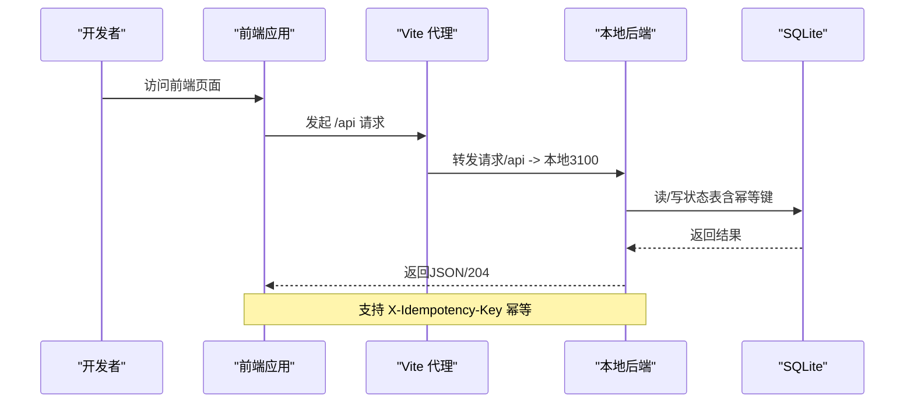
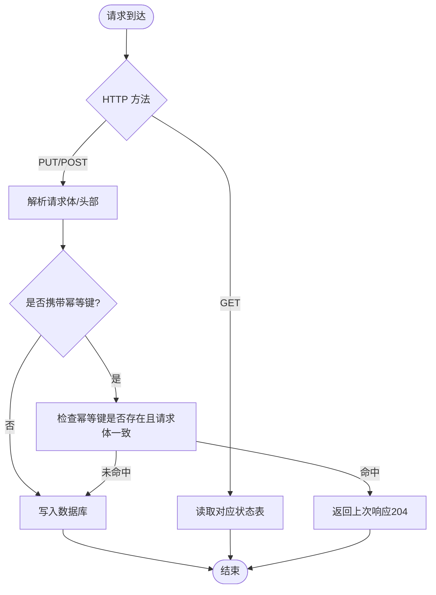
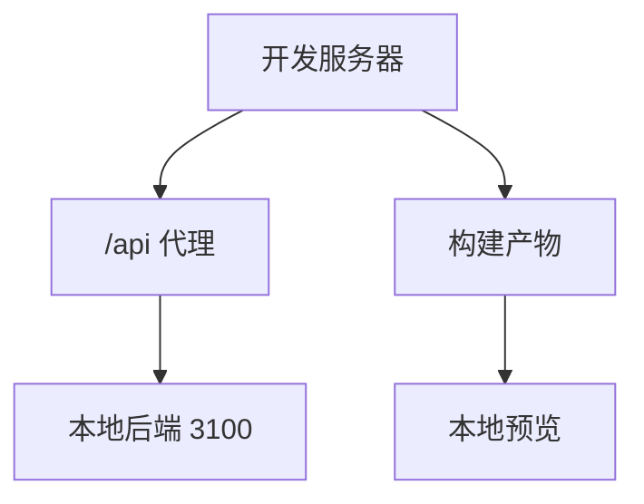
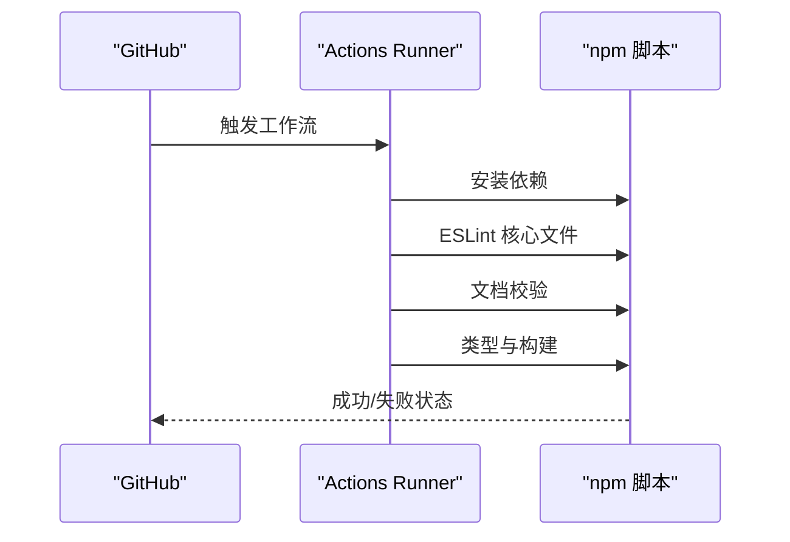
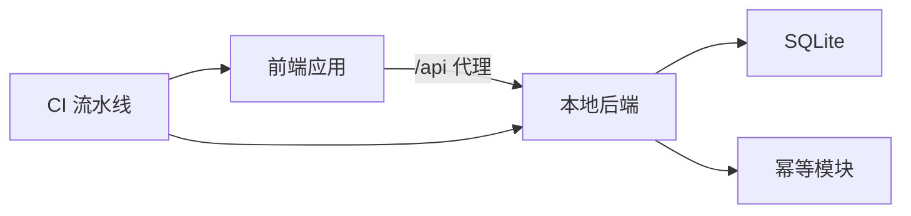
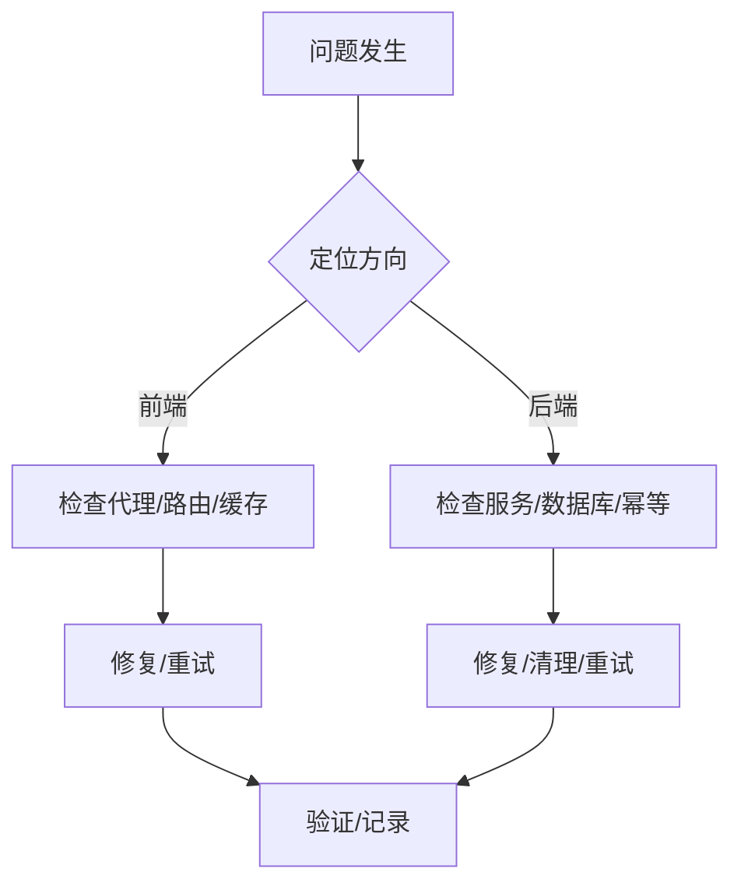

# 运维文档

<cite>
**本文引用的文件**
- [README.md](file://README.md)
- [CODEBUDDY.md](file://CODEBUDDY.md)
- [package.json](file://package.json)
- [vite.config.ts](file://vite.config.ts)
- [.github/workflows/ci.yml](file://.github/workflows/ci.yml)
- [local-api/server.ts](file://local-api/server.ts)
- [local-api/store/sqlite.ts](file://local-api/store/sqlite.ts)
- [local-api/store/schema.sql](file://local-api/store/schema.sql)
- [local-api/store/idempotency.ts](file://local-api/store/idempotency.ts)
- [local-api/test-api.sh](file://local-api/test-api.sh)
- [docs/04-operations/phase3/cloudbase-e2e-checklist.md](file://docs/04-operations/phase3/cloudbase-e2e-checklist.md)
- [docs/04-operations/phase3/weekly-governance-metrics.md](file://docs/04-operations/phase3/weekly-governance-metrics.md)
- [docs/04-operations/phase4/phase3-retrospective-and-phase4-proposal-2026-04-16.md](file://docs/04-operations/phase4/phase3-retrospective-and-phase4-proposal-2026-04-16.md)
</cite>

## 目录

1. [简介](#简介)
2. [项目结构](#项目结构)
3. [核心组件](#核心组件)
4. [架构总览](#架构总览)
5. [详细组件分析](#详细组件分析)
6. [依赖关系分析](#依赖关系分析)
7. [性能考虑](#性能考虑)
8. [故障排查指南](#故障排查指南)
9. [版本发布管理](#版本发布管理)
10. [运维自动化与CI/CD](#运维自动化与cicd)
11. [运维最佳实践与安全加固](#运维最佳实践与安全加固)
12. [团队职责与应急响应](#团队职责与应急响应)
13. [结论](#结论)
14. [附录](#附录)

## 简介

本运维文档面向CodeBuddy项目，聚焦于前端与本地后端的部署、监控、故障响应、性能指标、版本发布、自动化与安全加固，以及团队职责与应急流程。文档以仓库现有文件为依据，结合本地API与CI配置，提供可落地的操作指南与流程图示。

## 项目结构

项目采用React + Vite + TypeScript技术栈，前端通过Hash路由组织页面，本地后端使用Express + SQLite提供五条核心接口，并通过幂等键保障写操作一致性。CI流水线在PR/Push时进行质量门禁与构建验证。

**图示来源**

- [vite.config.ts:1-35](file://vite.config.ts#L1-L35)
- [local-api/server.ts:1-414](file://local-api/server.ts#L1-L414)
- [local-api/store/sqlite.ts:1-99](file://local-api/store/sqlite.ts#L1-L99)
- [.github/workflows/ci.yml:1-39](file://.github/workflows/ci.yml#L1-L39)

**章节来源**

- [README.md:55-113](file://README.md#L55-L113)
- [CODEBUDDY.md:23-90](file://CODEBUDDY.md#L23-L90)
- [vite.config.ts:1-35](file://vite.config.ts#L1-L35)
- [.github/workflows/ci.yml:1-39](file://.github/workflows/ci.yml#L1-L39)

## 核心组件

- 前端应用与路由：Hash路由驱动，页面组件按需加载，构建时对React生态进行手动分包。
- 本地后端服务：提供项目/任务/验收/结算/审计五类状态接口，支持幂等键与CORS，内置健康检查。
- SQLite存储：初始化Schema、WAL模式、索引与幂等键清理。
- CI流水线：PR/Push触发，执行ESLint、文档校验与构建。

**章节来源**

- [README.md:55-155](file://README.md#L55-L155)
- [local-api/server.ts:1-414](file://local-api/server.ts#L1-L414)
- [local-api/store/sqlite.ts:1-99](file://local-api/store/sqlite.ts#L1-L99)
- [local-api/store/schema.sql:1-72](file://local-api/store/schema.sql#L1-L72)
- [.github/workflows/ci.yml:1-39](file://.github/workflows/ci.yml#L1-L39)

## 架构总览

前端通过Vite代理将/api请求转发至本地后端，本地后端使用better-sqlite3访问SQLite数据库，幂等键表确保写操作的重放一致性。CI在PR/Push时进行质量门禁与构建验证。

**图示来源**

- [vite.config.ts:7-14](file://vite.config.ts#L7-L14)
- [local-api/server.ts:338-386](file://local-api/server.ts#L338-L386)
- [local-api/store/sqlite.ts:18-42](file://local-api/store/sqlite.ts#L18-L42)

## 详细组件分析

### 本地后端服务（Express + SQLite）

- 接口清单与行为
  - 项目状态：GET/PUT，支持envId查询与幂等写入。
  - 任务状态：GET/PUT，支持envId+contextKey查询与幂等写入。
  - 验收状态：GET/PUT，支持envId+projectCode查询与幂等写入。
  - 结算状态：GET，返回建议或空集。
  - 审计日志：POST，支持envId与幂等写入。
  - 健康检查：/health。
- 幂等机制
  - 通过X-Idempotency-Key识别请求，记录请求体哈希与响应状态，7天TTL。
  - 幂等命中时返回204，避免重复副作用。
- 数据持久化
  - WAL模式提升并发；索引覆盖审计日志与幂等键。
  - 启动时清理过期幂等键，定期维护。
- 错误处理
  - 统一错误响应结构，按HTTP语义返回400/404/405等。

**图示来源**

- [local-api/server.ts:70-329](file://local-api/server.ts#L70-L329)
- [local-api/store/idempotency.ts:23-86](file://local-api/store/idempotency.ts#L23-L86)

**章节来源**

- [local-api/server.ts:1-414](file://local-api/server.ts#L1-L414)
- [local-api/store/sqlite.ts:1-99](file://local-api/store/sqlite.ts#L1-L99)
- [local-api/store/schema.sql:1-72](file://local-api/store/schema.sql#L1-L72)
- [local-api/store/idempotency.ts:1-100](file://local-api/store/idempotency.ts#L1-L100)

### 前端代理与构建

- 代理配置：将/api转发至本地3100端口，便于联调。
- 代码分割：React生态库独立打包为react-vendor，降低缓存失效影响。
- 构建与预览：先类型检查再打包，支持本地预览验证。

**图示来源**

- [vite.config.ts:7-33](file://vite.config.ts#L7-L33)
- [package.json:6-16](file://package.json#L6-L16)

**章节来源**

- [vite.config.ts:1-35](file://vite.config.ts#L1-L35)
- [package.json:1-48](file://package.json#L1-L48)

### CI流水线（质量门禁与构建）

- 触发：PR与push到main。
- 步骤：检出、Node设置、依赖安装、ESLint核心文件、文档校验、类型与构建。
- 产出：通过构建即代表前端产物可被预览与部署。

**图示来源**

- [.github/workflows/ci.yml:1-39](file://.github/workflows/ci.yml#L1-L39)

**章节来源**

- [.github/workflows/ci.yml:1-39](file://.github/workflows/ci.yml#L1-L39)

## 依赖关系分析

- 前端对本地后端的耦合通过代理实现，便于开发与联调。
- 本地后端对better-sqlite3与自定义幂等模块存在直接依赖。
- CI对ESLint与构建脚本存在直接依赖。

**图示来源**

- [vite.config.ts:7-14](file://vite.config.ts#L7-L14)
- [local-api/server.ts:1-414](file://local-api/server.ts#L1-L414)
- [local-api/store/idempotency.ts:1-100](file://local-api/store/idempotency.ts#L1-L100)
- [.github/workflows/ci.yml:1-39](file://.github/workflows/ci.yml#L1-L39)

**章节来源**

- [vite.config.ts:1-35](file://vite.config.ts#L1-L35)
- [local-api/server.ts:1-414](file://local-api/server.ts#L1-L414)
- [local-api/store/idempotency.ts:1-100](file://local-api/store/idempotency.ts#L1-L100)
- [.github/workflows/ci.yml:1-39](file://.github/workflows/ci.yml#L1-L39)

## 性能考虑

- 前端性能
  - 懒加载：14+页面组件按需加载。
  - 代码分割：React vendor独立chunk，主包体积优化显著。
  - 首屏体积与构建产物按需加载，减少初始传输。
- 本地后端性能
  - SQLite启用WAL模式，提升并发读写。
  - 幂等键清理与索引优化，降低重复写入与查询成本。
- 监控建议
  - 前端：首屏加载时间、主包体积、页面切换延迟、错误率。
  - 后端：请求延迟分布、数据库锁等待、幂等命中率、健康检查成功率。
  - 基础设施：CPU/内存/磁盘IO、网络往返、进程存活。

**章节来源**

- [README.md:156-175](file://README.md#L156-L175)
- [local-api/store/sqlite.ts:32-42](file://local-api/store/sqlite.ts#L32-L42)
- [docs/04-operations/phase3/weekly-governance-metrics.md:14-48](file://docs/04-operations/phase3/weekly-governance-metrics.md#L14-L48)

## 故障排查指南

- 本地后端常见问题
  - 服务未启动：确认端口占用与进程信号处理。
  - 幂等重放：检查X-Idempotency-Key是否一致，观察日志提示。
  - 数据不一致：检查envId/contextKey/projectCode参数，必要时清理幂等键。
- 前端联调问题
  - 代理不通：确认Vite代理配置与本地后端端口。
  - 状态流转失败：检查项目里程碑/任务树/验收结果等守卫条件。
  - 本地缓存不一致：清空localStorage并刷新页面。
- 回退与可观测性
  - 远端失败触发回退事件，前端应可见化提示并记录上下文。

**图示来源**

- [README.md:227-243](file://README.md#L227-L243)
- [local-api/server.ts:338-386](file://local-api/server.ts#L338-L386)
- [local-api/store/sqlite.ts:68-80](file://local-api/store/sqlite.ts#L68-L80)

**章节来源**

- [README.md:227-243](file://README.md#L227-L243)
- [local-api/server.ts:1-414](file://local-api/server.ts#L1-L414)
- [local-api/store/sqlite.ts:1-99](file://local-api/store/sqlite.ts#L1-L99)

## 版本发布管理

- 发布策略
  - 基于PR/Push触发CI，通过ESLint与构建作为质量门禁。
  - 本地后端接口变更需同步幂等与Schema，确保兼容性。
- 回滚机制
  - 前端：回滚到上一个稳定构建版本。
  - 后端：回滚到上一个已知可用的数据库Schema与幂等策略。
- 变更影响评估
  - 评估范围：新增/修改接口、幂等键策略、数据库Schema、代理规则。
  - 验收清单：接口回归、幂等验证、异常场景、回退可见化。

**章节来源**

- [.github/workflows/ci.yml:1-39](file://.github/workflows/ci.yml#L1-L39)
- [docs/04-operations/phase3/cloudbase-e2e-checklist.md:20-61](file://docs/04-operations/phase3/cloudbase-e2e-checklist.md#L20-L61)
- [docs/04-operations/phase4/phase3-retrospective-and-phase4-proposal-2026-04-16.md:64-110](file://docs/04-operations/phase4/phase3-retrospective-and-phase4-proposal-2026-04-16.md#L64-L110)

## 运维自动化与CI/CD

- 自动化脚本
  - 本地API测试脚本：覆盖健康检查、五接口读写与幂等重放。
- CI配置
  - 质量门禁：ESLint核心文件、文档校验、类型与构建。
- 建议扩展
  - 集成覆盖率与端到端测试（如Playwright）。
  - 将测试脚本纳入CI，确保每次提交的可验证性。

**章节来源**

- [local-api/test-api.sh:1-156](file://local-api/test-api.sh#L1-L156)
- [.github/workflows/ci.yml:1-39](file://.github/workflows/ci.yml#L1-L39)

## 运维最佳实践与安全加固

- 最佳实践
  - 保持代理与后端端口一致，避免跨域与重定向问题。
  - 使用幂等键标识关键写操作，确保重试安全。
  - 定期清理过期幂等键，避免数据库膨胀。
- 安全加固
  - 本地开发默认允许CORS，生产环境需限制来源与方法。
  - 严格控制X-Idempotency-Key的生成与传播，避免滥用。
  - 对审计日志进行脱敏与合规存储，遵守数据最小化原则。

**章节来源**

- [local-api/server.ts:45-66](file://local-api/server.ts#L45-L66)
- [local-api/store/idempotency.ts:10-18](file://local-api/store/idempotency.ts#L10-L18)
- [local-api/store/sqlite.ts:68-80](file://local-api/store/sqlite.ts#L68-L80)

## 团队职责与应急响应

- 职责分工
  - 前端：负责路由、懒加载、代理与错误可见化。
  - 后端：负责接口实现、幂等策略、数据库Schema与健康检查。
  - 运维：负责CI质量门禁、构建与发布、监控与告警。
- 应急响应
  - 鉴权阻断：CloudBase Token失效时，按“5分钟版”恢复步骤重登。
  - 真链路阻断：五主链远端回归证据缺失时，优先补齐证据。
  - 发布阻断：飞书CLI未授权时，优先完成授权并发送周计划。

**章节来源**

- [docs/04-operations/phase4/phase3-retrospective-and-phase4-proposal-2026-04-16.md:52-110](file://docs/04-operations/phase4/phase3-retrospective-and-phase4-proposal-2026-04-16.md#L52-L110)
- [docs/04-operations/phase3/cloudbase-e2e-checklist.md:14-68](file://docs/04-operations/phase3/cloudbase-e2e-checklist.md#L14-L68)

## 结论

本运维文档基于仓库现有文件，梳理了前端与本地后端的部署、监控、故障响应、性能指标、版本发布与自动化流程。建议在现有基础上完善远端真链路回归证据与发布自动化，持续收敛试点范围，确保“证据驱动”的阶段评审与扩面决策。

## 附录

- 本地后端接口清单与幂等策略详见本地API实现与Schema定义。
- CI质量门禁与构建流程详见GitHub Actions配置。
- 运维治理与周指标口径详见阶段3文档集合。
