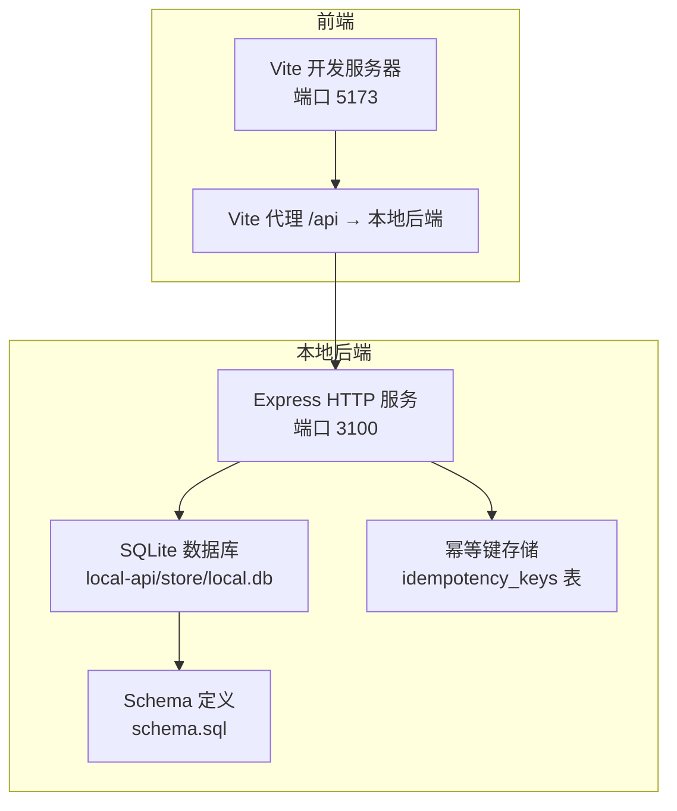
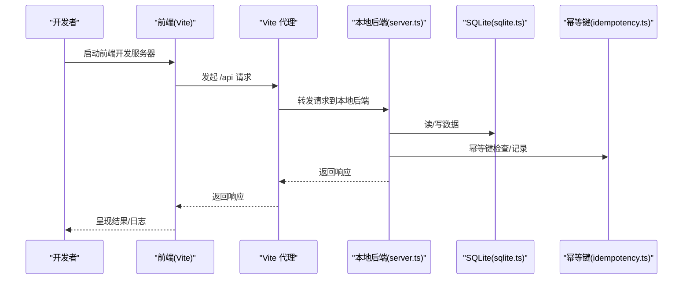
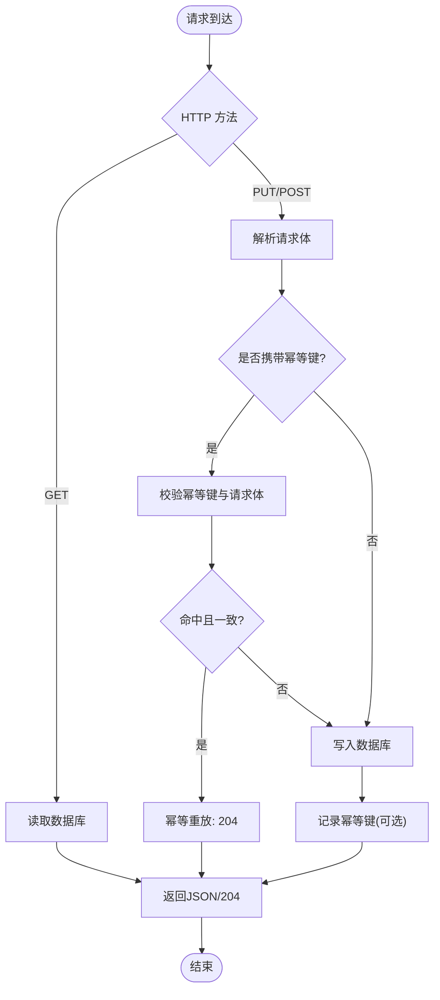
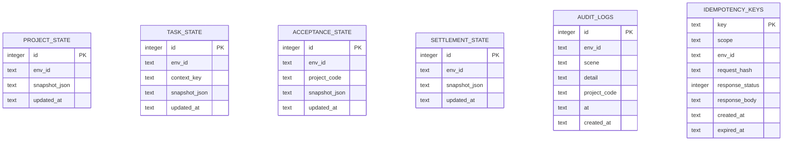
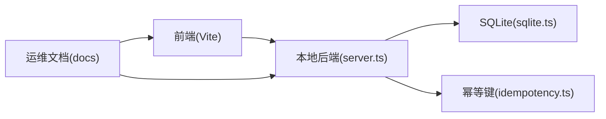

# 运维流程

<cite>
**本文引用的文件**
- [README.md](file://README.md)
- [CODEBUDDY.md](file://CODEBUDDY.md)
- [package.json](file://package.json)
- [vite.config.ts](file://vite.config.ts)
- [docs/04-operations/phase3/local-backend-feasibility.md](file://docs/04-operations/phase3/local-backend-feasibility.md)
- [docs/04-operations/phase3/cloudbase-e2e-checklist.md](file://docs/04-operations/phase3/cloudbase-e2e-checklist.md)
- [docs/04-operations/phase4/phase3-retrospective-and-phase4-proposal-2026-04-16.md](file://docs/04-operations/phase4/phase3-retrospective-and-phase4-proposal-2026-04-16.md)
- [docs/00-governance/document-governance.md](file://docs/00-governance/document-governance.md)
- [local-api/server.ts](file://local-api/server.ts)
- [local-api/store/sqlite.ts](file://local-api/store/sqlite.ts)
- [local-api/store/schema.sql](file://local-api/store/schema.sql)
- [local-api/store/idempotency.ts](file://local-api/store/idempotency.ts)
</cite>

## 目录

1. [简介](#简介)
2. [项目结构](#项目结构)
3. [核心组件](#核心组件)
4. [架构总览](#架构总览)
5. [详细组件分析](#详细组件分析)
6. [依赖关系分析](#依赖关系分析)
7. [性能考量](#性能考量)
8. [故障排查指南](#故障排查指南)
9. [结论](#结论)
10. [附录](#附录)

## 简介

本运维流程文档面向 CodeBuddy 项目，聚焦于日常运维操作与流程规范，涵盖系统监控、备份策略、健康检查、维护窗口管理；变更管理、发布流程、配置管理与权限控制；团队协作（值班、交接、跨部门协调）；文档治理（更新、版本控制、知识传承）；以及质量保证（流程审计、效果评估、持续改进）。文档以仓库内的实际运维文档与本地后端实现为基础，结合阶段3复盘与阶段4建议，提供可执行的操作步骤与流程图，帮助运维人员准确落地各项运维任务。

## 项目结构

- 运维相关文档集中于 docs/04-operations 目录，包含本地后端可行性文档、端到端回归清单、阶段3复盘与阶段4建议等。
- 本地后端服务位于 local-api，提供五条核心接口与 SQLite 持久化，支持幂等键与健康检查。
- 前端通过 Vite 代理将 /api 请求转发至本地后端，便于联调与验证。

**图示来源**

- [vite.config.ts:1-35](file://vite.config.ts#L1-L35)
- [local-api/server.ts:1-414](file://local-api/server.ts#L1-L414)
- [local-api/store/sqlite.ts:1-99](file://local-api/store/sqlite.ts#L1-L99)
- [local-api/store/schema.sql:1-72](file://local-api/store/schema.sql#L1-L72)
- [local-api/store/idempotency.ts:1-100](file://local-api/store/idempotency.ts#L1-L100)

**章节来源**

- [README.md:18-34](file://README.md#L18-L34)
- [package.json:6-16](file://package.json#L6-L16)
- [vite.config.ts:7-14](file://vite.config.ts#L7-L14)

## 核心组件

- 本地后端服务：提供项目状态、任务状态、验收状态、结算状态、审计日志五条核心接口，支持幂等键与健康检查。
- SQLite 存储：自动初始化表结构，启用 WAL 模式，支持幂等键过期清理与数据库重置。
- 前端代理：将 /api 请求转发至本地后端，便于联调与验证。
- 文档治理：统一文档域、状态模型与变更流程，确保运维文档可追溯、可审计。

**章节来源**

- [local-api/server.ts:70-329](file://local-api/server.ts#L70-L329)
- [local-api/store/sqlite.ts:18-80](file://local-api/store/sqlite.ts#L18-L80)
- [local-api/store/schema.sql:4-72](file://local-api/store/schema.sql#L4-L72)
- [docs/04-operations/phase3/local-backend-feasibility.md:80-98](file://docs/04-operations/phase3/local-backend-feasibility.md#L80-L98)
- [docs/00-governance/document-governance.md:30-62](file://docs/00-governance/document-governance.md#L30-L62)

## 架构总览

本地联调与端到端回归的整体架构如下：

**图示来源**

- [vite.config.ts:8-13](file://vite.config.ts#L8-L13)
- [local-api/server.ts:338-386](file://local-api/server.ts#L338-L386)
- [local-api/store/sqlite.ts:18-42](file://local-api/store/sqlite.ts#L18-L42)
- [local-api/store/idempotency.ts:23-86](file://local-api/store/idempotency.ts#L23-L86)

## 详细组件分析

### 本地后端服务（server.ts）

- 路由与接口
  - 健康检查：/health
  - 项目状态：GET/PUT /api/projects/state?envId={envId}
  - 任务状态：GET/PUT /api/tasks/state?contextKey={key}&envId={envId}
  - 验收状态：GET/PUT /api/acceptance/state?projectCode={code}&envId={envId}
  - 结算状态：GET /api/settlement/state?envId={envId}
  - 审计日志：POST /api/audit/logs?envId={envId}
- 幂等性
  - 写接口支持 X-Idempotency-Key 头部，服务端对请求体进行哈希比对，避免重复处理。
- 错误处理
  - 统一错误响应格式，包含 message、code、status 字段。
- 启动与优雅关闭
  - 启动时初始化数据库并清理过期幂等键；监听 SIGINT 信号优雅关闭。

**图示来源**

- [local-api/server.ts:70-329](file://local-api/server.ts#L70-L329)
- [local-api/store/idempotency.ts:23-86](file://local-api/store/idempotency.ts#L23-L86)

**章节来源**

- [local-api/server.ts:332-334](file://local-api/server.ts#L332-L334)
- [local-api/server.ts:354-356](file://local-api/server.ts#L354-L356)
- [local-api/server.ts:364-381](file://local-api/server.ts#L364-L381)
- [local-api/server.ts:403-411](file://local-api/server.ts#L403-L411)

### SQLite 存储与 Schema（sqlite.ts、schema.sql）

- 初始化
  - 自动创建数据库目录与文件，启用 WAL 模式，执行 schema.sql 初始化表结构。
- 幂等键清理
  - 启动时清理过期幂等键（默认7天）。
- 数据库重置
  - 支持清空所有状态表与审计日志，便于测试与重置。

**图示来源**

- [local-api/store/schema.sql:4-72](file://local-api/store/schema.sql#L4-L72)

**章节来源**

- [local-api/store/sqlite.ts:18-42](file://local-api/store/sqlite.ts#L18-L42)
- [local-api/store/sqlite.ts:68-80](file://local-api/store/sqlite.ts#L68-L80)
- [local-api/store/sqlite.ts:85-98](file://local-api/store/sqlite.ts#L85-L98)

### 前端代理与联调（vite.config.ts、local-backend-feasibility.md）

- 代理配置
  - 将 /api 前缀请求转发至本地后端地址，便于前端直连。
- 启动方式
  - 支持并行启动前端与本地后端，或分开启动。
- 健康检查
  - 通过 /health 接口验证服务可用性。

**章节来源**

- [vite.config.ts:8-13](file://vite.config.ts#L8-L13)
- [docs/04-operations/phase3/local-backend-feasibility.md:47-78](file://docs/04-operations/phase3/local-backend-feasibility.md#L47-L78)

### 文档治理与变更流程（document-governance.md）

- 文档域与职责
  - docs/ 作为唯一文档域，按治理/工程/运营分层管理。
- 状态模型
  - draft → active → deprecated → archived，确保单一事实源。
- 变更流程
  - 修改内容 → 更新 Frontmatter → 更新索引 → PR 检查 → 合并记录审计。

**章节来源**

- [docs/00-governance/document-governance.md:15-62](file://docs/00-governance/document-governance.md#L15-L62)

### 端到端回归与真链路验证（cloudbase-e2e-checklist.md、phase3-retrospective-and-phase4-proposal-2026-04-16.md）

- 回归清单
  - 五主链接口读写、幂等与重试验证、异常场景定位、回退可见化。
- 阶段3复盘
  - 体系已建成但远端真链路未收口，核心阻断为 CloudBase 鉴权与发布授权。
- 阶段4建议
  - 解除阻断、补齐远端真证据、建立试点范围与验收标准。

**章节来源**

- [docs/04-operations/phase3/cloudbase-e2e-checklist.md:20-68](file://docs/04-operations/phase3/cloudbase-e2e-checklist.md#L20-L68)
- [docs/04-operations/phase4/phase3-retrospective-and-phase4-proposal-2026-04-16.md:46-110](file://docs/04-operations/phase4/phase3-retrospective-and-phase4-proposal-2026-04-16.md#L46-L110)

## 依赖关系分析

- 前端依赖本地后端提供的 /api 接口，通过 Vite 代理实现。
- 本地后端依赖 SQLite 存储与幂等键模块，确保数据一致性与可回放性。
- 文档治理规范为运维流程提供统一的文档标准与变更路径。

**图示来源**

- [vite.config.ts:8-13](file://vite.config.ts#L8-L13)
- [local-api/server.ts:338-386](file://local-api/server.ts#L338-L386)
- [local-api/store/sqlite.ts:18-42](file://local-api/store/sqlite.ts#L18-L42)
- [docs/04-operations/phase3/local-backend-feasibility.md:80-98](file://docs/04-operations/phase3/local-backend-feasibility.md#L80-L98)

**章节来源**

- [package.json:6-16](file://package.json#L6-L16)
- [docs/04-operations/phase3/local-backend-feasibility.md:80-98](file://docs/04-operations/phase3/local-backend-feasibility.md#L80-L98)

## 性能考量

- 前端构建
  - 代码分割策略将 React 生态库独立打包，提升缓存与加载效率。
- 数据库
  - 启用 WAL 模式提升并发写入性能，降低锁竞争。
- 幂等键
  - 7天有效期的幂等键清理机制，避免长期占用存储空间。

**章节来源**

- [vite.config.ts:19-33](file://vite.config.ts#L19-L33)
- [local-api/store/sqlite.ts:32-33](file://local-api/store/sqlite.ts#L32-L33)
- [local-api/store/sqlite.ts:68-80](file://local-api/store/sqlite.ts#L68-L80)

## 故障排查指南

### 常见问题与处理

- 端口被占用
  - 查找占用进程并终止，或调整 LOCAL_API_PORT 环境变量。
- 前端 404
  - 检查本地后端是否启动、Vite 代理配置、请求路径是否包含 /api 前缀。
- 数据库锁定
  - SQLite 在高并发写入时可能出现锁定，建议启用 WAL 模式、降低并发或考虑升级数据库。
- 幂等键不生效
  - 确认请求头包含 X-Idempotency-Key、幂等键未过期、请求体完全一致。

**章节来源**

- [docs/04-operations/phase3/local-backend-feasibility.md:269-302](file://docs/04-operations/phase3/local-backend-feasibility.md#L269-L302)

### 健康检查与日志

- 健康检查
  - 通过 /health 接口验证服务可用性。
- 本地日志
  - 本地 API 输出数据库初始化、幂等键命中、请求处理与错误日志。
- 前端降级事件
  - API 请求失败时触发 pm:remote-fallback 事件，可在控制台查看。

**章节来源**

- [local-api/server.ts:332-334](file://local-api/server.ts#L332-L334)
- [docs/04-operations/phase3/local-backend-feasibility.md:303-330](file://docs/04-operations/phase3/local-backend-feasibility.md#L303-L330)

## 结论

本运维流程以本地后端为核心，结合文档治理与阶段复盘建议，形成了可执行的运维操作框架。通过健康检查、幂等性保障、数据库管理与前端代理配置，能够支撑日常联调与回归验证。建议在阶段4中优先解除阻断，补齐远端真证据，并建立试点范围与验收标准，确保运维流程可追溯、可审计、可持续改进。

## 附录

### 日常运维操作清单（示例）

- 系统监控
  - 定期检查 /health 健康状态。
  - 关注本地 API 日志中的错误与幂等键命中情况。
- 备份策略
  - 数据库文件 local.db 定期备份，变更前先备份。
- 健康检查
  - 启动后执行 curl /health，确认服务可用。
- 维护窗口管理
  - 通过环境变量 LOCAL_API_PORT 调整端口，避免冲突。
- 变更管理
  - 通过文档治理流程更新运维文档，确保 Frontmatter 完整。
- 发布流程
  - 阶段4建议优先打通 CloudBase 鉴权与飞书发布链路。
- 配置管理
  - Vite 代理与环境变量配置需与前端部署保持一致。
- 权限控制
  - 本地后端未内置鉴权，建议在生产环境接入鉴权与访问控制。
- 团队协作
  - 明确值班与交接流程，跨部门协调以阶段4建议为准。
- 文档管理
  - 文档更新需更新索引并通过 PR 检查，合并后记录审计。
- 质量保证
  - 以端到端回归清单为验收标准，形成每周证据包。

**章节来源**

- [docs/04-operations/phase3/local-backend-feasibility.md:235-266](file://docs/04-operations/phase3/local-backend-feasibility.md#L235-L266)
- [docs/04-operations/phase4/phase3-retrospective-and-phase4-proposal-2026-04-16.md:64-110](file://docs/04-operations/phase4/phase3-retrospective-and-phase4-proposal-2026-04-16.md#L64-L110)
- [docs/00-governance/document-governance.md:56-62](file://docs/00-governance/document-governance.md#L56-L62)
