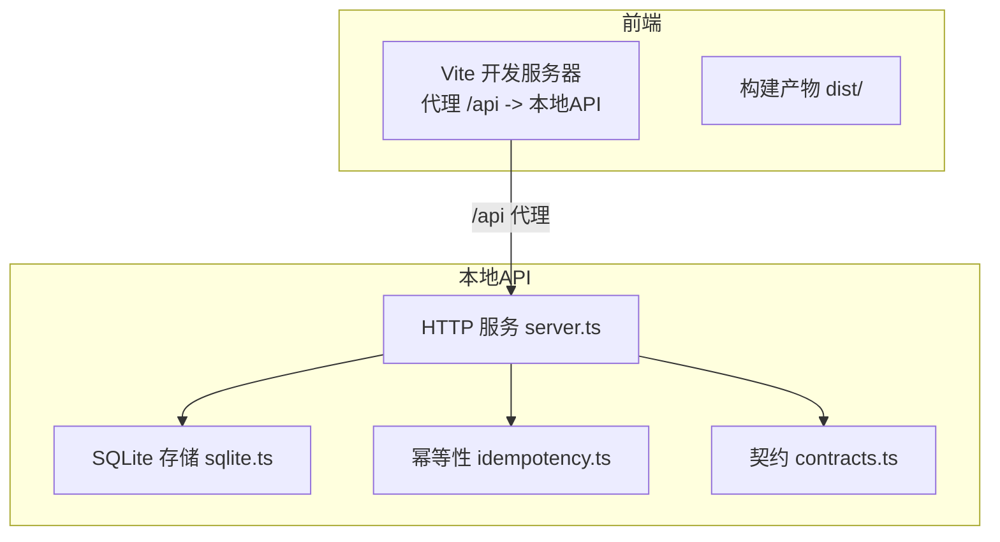
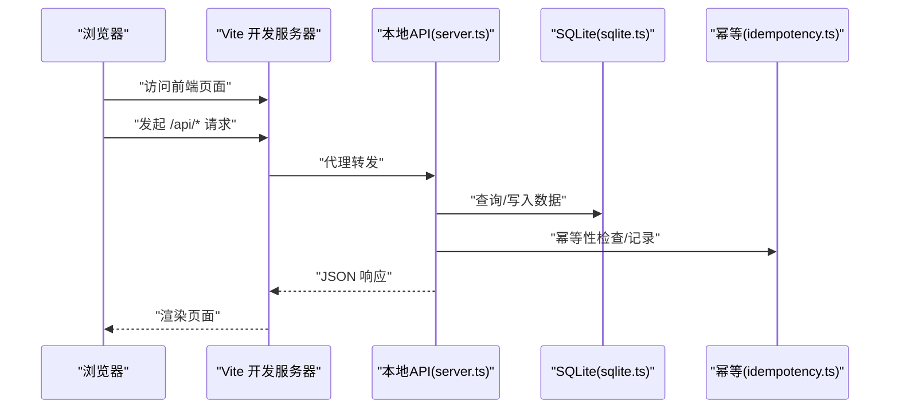
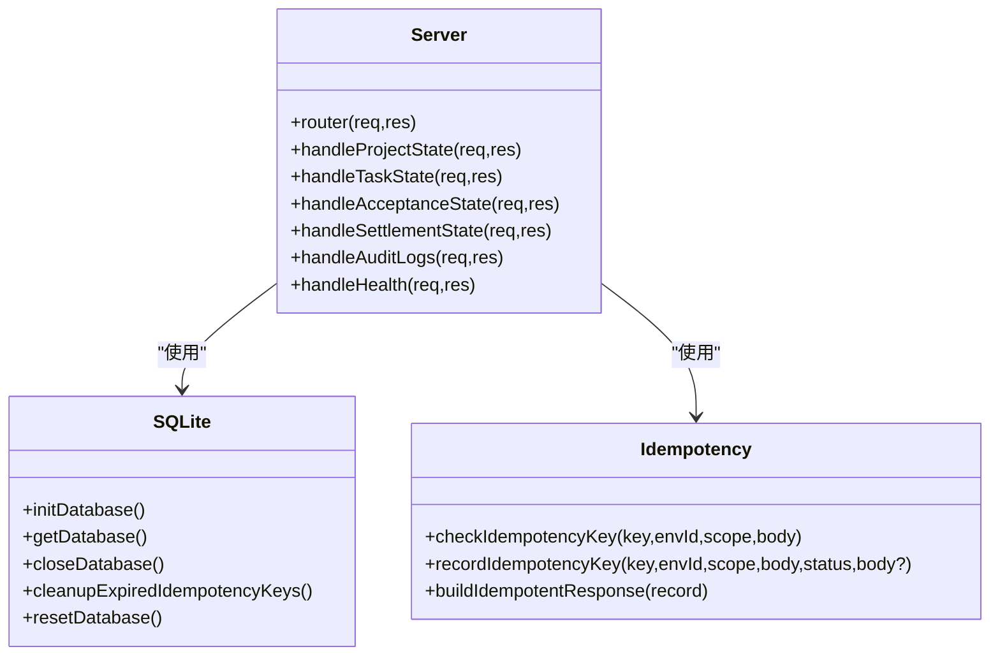
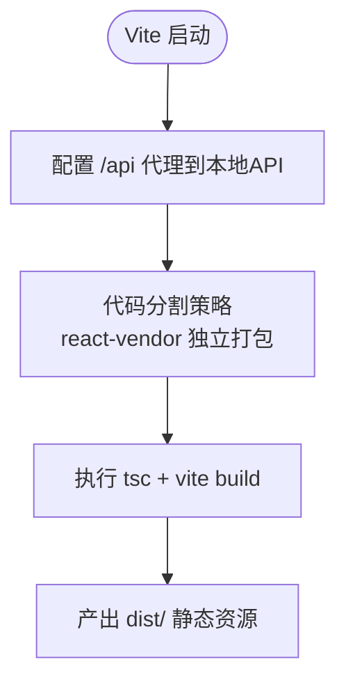
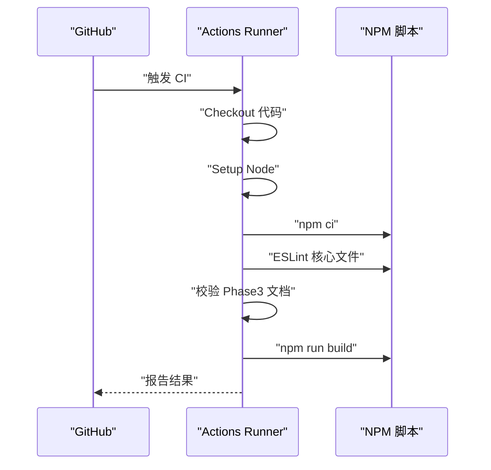
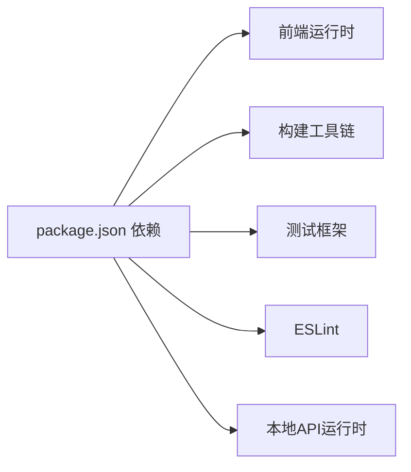

# 部署发布

<cite>
**本文引用的文件**
- [ci.yml](file://.github/workflows/ci.yml)
- [package.json](file://package.json)
- [CODEBUDDY.md](file://CODEBUDDY.md)
- [development-guide.md](file://docs/03-engineering/development-guide.md)
- [integration-guide.md](file://docs/03-engineering/integration-guide.md)
- [server.ts](file://local-api/server.ts)
- [sqlite.ts](file://local-api/store/sqlite.ts)
- [idempotency.ts](file://local-api/store/idempotency.ts)
- [contracts.ts](file://local-api/contracts.ts)
- [vite.config.ts](file://vite.config.ts)
</cite>

## 目录

1. [简介](#简介)
2. [项目结构](#项目结构)
3. [核心组件](#核心组件)
4. [架构总览](#架构总览)
5. [详细组件分析](#详细组件分析)
6. [依赖分析](#依赖分析)
7. [性能考虑](#性能考虑)
8. [故障排查指南](#故障排查指南)
9. [结论](#结论)
10. [附录](#附录)

## 简介

本文件面向CodeBuddy项目的发布与运维团队，提供一套可落地的部署发布方案与操作手册。结合当前仓库中的本地API、前端构建与CI配置，文档覆盖以下主题：

- 部署策略：蓝绿部署、滚动更新、金丝雀发布
- 版本发布管理：版本号规范、发布计划与发布检查清单
- 发布前准备：环境验证、数据迁移与依赖检查
- 发布过程监控：部署进度跟踪、健康检查与回滚准备
- 发布后验证：功能测试、性能验证与用户反馈收集
- 自动化部署脚本与CI/CD流水线配置
- 发布风险评估与应急预案
- 发布团队操作手册与质量保证流程

## 项目结构

CodeBuddy当前为前端React + TypeScript项目，配合本地HTTP API服务(local-api)进行联调与演示。前端通过Vite进行开发与构建，本地API基于better-sqlite3提供SQLite存储与幂等性保障。

**图表来源**

- [vite.config.ts:7-14](file://vite.config.ts#L7-L14)
- [server.ts:1-414](file://local-api/server.ts#L1-L414)
- [sqlite.ts:1-99](file://local-api/store/sqlite.ts#L1-L99)
- [idempotency.ts:1-100](file://local-api/store/idempotency.ts#L1-L100)
- [contracts.ts:1-89](file://local-api/contracts.ts#L1-L89)

**章节来源**

- [CODEBUDDY.md:23-90](file://CODEBUDDY.md#L23-L90)
- [development-guide.md:550-588](file://docs/03-engineering/development-guide.md#L550-L588)
- [integration-guide.md:41-91](file://docs/03-engineering/integration-guide.md#L41-L91)

## 核心组件

- 前端开发与构建
  - Vite开发服务器与代理配置，支持将/api请求转发至本地API。
  - 构建脚本通过tsc与vite完成类型检查与打包。
- 本地API服务
  - 提供项目状态、任务状态、验收状态、结算状态与审计日志等接口。
  - 基于SQLite存储，支持幂等性键去重与过期清理。
- CI流水线
  - GitHub Actions执行质量门禁、文档检查与构建。

**章节来源**

- [vite.config.ts:1-35](file://vite.config.ts#L1-L35)
- [package.json:6-16](file://package.json#L6-L16)
- [.github/workflows/ci.yml:1-39](file://.github/workflows/ci.yml#L1-L39)
- [server.ts:1-414](file://local-api/server.ts#L1-L414)
- [sqlite.ts:1-99](file://local-api/store/sqlite.ts#L1-L99)
- [idempotency.ts:1-100](file://local-api/store/idempotency.ts#L1-L100)

## 架构总览

下图展示了从浏览器到本地API的数据流与职责边界，以及与CI/CD的关系。

**图表来源**

- [vite.config.ts:7-14](file://vite.config.ts#L7-L14)
- [server.ts:338-386](file://local-api/server.ts#L338-L386)
- [sqlite.ts:18-42](file://local-api/store/sqlite.ts#L18-L42)
- [idempotency.ts:23-86](file://local-api/store/idempotency.ts#L23-L86)

## 详细组件分析

### 组件A：本地API服务（server.ts）

- 职责
  - 提供五类核心接口：项目状态、任务状态、验收状态、结算状态、审计日志。
  - 支持CORS与OPTIONS预检，便于前端开发代理。
  - 健康检查接口用于部署后可用性探测。
- 幂等性
  - 通过X-Idempotency-Key头进行请求去重，防止重复写入。
  - 幂等记录包含请求指纹、作用域、过期时间等。
- 数据持久化
  - 使用SQLite存储，WAL模式提升并发性能。
  - 提供过期幂等键清理与数据库重置工具。

**图表来源**

- [server.ts:338-386](file://local-api/server.ts#L338-L386)
- [sqlite.ts:18-98](file://local-api/store/sqlite.ts#L18-L98)
- [idempotency.ts:23-99](file://local-api/store/idempotency.ts#L23-L99)

**章节来源**

- [server.ts:1-414](file://local-api/server.ts#L1-L414)
- [sqlite.ts:1-99](file://local-api/store/sqlite.ts#L1-L99)
- [idempotency.ts:1-100](file://local-api/store/idempotency.ts#L1-L100)

### 组件B：前端构建与代理（vite.config.ts）

- 职责
  - 配置开发服务器代理，将/api请求转发至本地API。
  - 代码分割策略，将React生态核心库单独打包，优化首屏与缓存。
- 性能
  - 通过manualChunks与chunkSizeWarningLimit优化包体与警告阈值。

**图表来源**

- [vite.config.ts:7-34](file://vite.config.ts#L7-L34)

**章节来源**

- [vite.config.ts:1-35](file://vite.config.ts#L1-L35)
- [package.json:6-16](file://package.json#L6-L16)

### 组件C：CI流水线（ci.yml）

- 职责
  - 在PR与main分支推送时触发。
  - 执行质量门禁（ESLint）、文档检查、类型与构建。
- 价值
  - 保证提交质量与文档完整性，减少线上问题。

**图表来源**

- [.github/workflows/ci.yml:1-39](file://.github/workflows/ci.yml#L1-L39)

**章节来源**

- [.github/workflows/ci.yml:1-39](file://.github/workflows/ci.yml#L1-L39)

## 依赖分析

- 前端依赖
  - React、React DOM、Vite、TailwindCSS、TypeScript等。
- 本地API依赖
  - better-sqlite3、URL解析、Crypto哈希等。
- 构建与测试
  - tsc、vite、vitest、eslint等。

**图表来源**

- [package.json:17-46](file://package.json#L17-L46)
- [development-guide.md:17-17](file://docs/03-engineering/development-guide.md#L17-L17)

**章节来源**

- [package.json:1-48](file://package.json#L1-L48)

## 性能考虑

- 前端
  - 代码分割与懒加载有助于降低首屏体积与提升加载速度。
  - 构建产物体积与关键指标（FCP/LCP）建议纳入发布前性能验收。
- 本地API
  - SQLite WAL模式提升并发写入性能。
  - 幂等键清理降低历史冗余，维持查询效率。

**章节来源**

- [vite.config.ts:15-34](file://vite.config.ts#L15-L34)
- [sqlite.ts:32-80](file://local-api/store/sqlite.ts#L32-L80)
- [integration-guide.md:265-300](file://docs/03-engineering/integration-guide.md#L265-L300)

## 故障排查指南

- 接口调用失败
  - 检查本地API是否启动、Vite代理配置、浏览器Network标签。
- 状态流转失败
  - 查看控制台守卫日志，核对项目守卫条件字段与状态机逻辑。
- 本地缓存不一致
  - 清空localStorage并刷新页面。
- 幂等键冲突
  - 刷新页面生成新幂等键，或检查请求头一致性。

**章节来源**

- [integration-guide.md:303-365](file://docs/03-engineering/integration-guide.md#L303-L365)

## 结论

本文件基于仓库现有能力，给出了面向CodeBuddy的部署发布实践建议。当前项目以本地API为核心数据后端，前端通过Vite代理对接。建议在现有基础上逐步引入容器化与云平台部署，完善蓝绿/滚动/金丝雀策略与自动化监控告警，持续提升发布质量与稳定性。

## 附录

### A. 部署策略与实施方案

- 蓝绿部署
  - 准备两套环境：蓝环境与绿环境，使用反向代理或负载均衡器在两者间切换。
  - 发布流程：先在备用环境部署新版本并进行健康检查，通过后再切换流量，最后下线旧版本。
  - 优势：零停机、可快速回滚。
  - 适用场景：对可用性要求高、变更影响面广的功能迭代。

- 滚动更新
  - 将实例分批升级，每批替换完成后进行健康检查，再继续下一批。
  - 优势：渐进式发布，降低单批风险。
  - 适用场景：服务实例较多、可接受短暂停机窗口的场景。

- 金丝雀发布
  - 将少量流量导入新版本，结合关键指标（错误率、延迟、吞吐）动态扩大或收缩流量。
  - 优势：最小化风险，快速发现异常。
  - 适用场景：新功能上线、A/B测试或灰度验证。

- 版本发布管理
  - 版本号规范：语义化版本（MAJOR.MINOR.PATCH），变更记录与发布说明同步。
  - 发布计划：明确发布时间、负责人、回滚预案与沟通机制。
  - 发布检查清单：环境验证、数据迁移、依赖检查、健康检查、回滚准备、监控告警。

- 发布前准备
  - 环境验证：确认域名、证书、反向代理、数据库连接与权限。
  - 数据迁移：生成迁移脚本并预演，确保回滚路径可用。
  - 依赖检查：第三方依赖版本锁定、许可证合规与漏洞扫描。

- 发布过程监控
  - 部署进度跟踪：CI/CD流水线状态、实例健康状态、日志聚合。
  - 健康检查：存活探针、就绪探针、业务探针（如本地API健康接口）。
  - 回滚准备：镜像/制品版本标记、配置回滚脚本、数据库回滚脚本。

- 发布后验证
  - 功能测试：冒烟测试、端到端测试、回归测试。
  - 性能验证：首屏加载、关键路径延迟、并发压力测试。
  - 用户反馈收集：埋点与日志、用户反馈渠道、紧急问题响应。

- 自动化部署脚本与CI/CD流水线配置
  - 基于现有CI（ESLint、文档检查、构建）扩展发布阶段：
    - 构建镜像/制品包
    - 部署到目标环境（蓝/绿/滚动/金丝雀）
    - 健康检查与自动回滚
    - 通知与归档
  - 建议在CI中增加：
    - 安全扫描（依赖漏洞、配置扫描）
    - 性能回归检测（基准对比）
    - A/B分流与指标阈值告警

- 发布风险评估与应急预案
  - 风险评估：变更范围、影响面、失败概率与影响程度。
  - 应急预案：一键回滚、熔断降级、应急扩容、数据恢复、沟通预案。

- 发布团队操作手册与质量保证流程
  - 操作手册：标准化步骤、检查清单、常见问题处理。
  - 质量保证：测试策略、验收标准、发布后观察期与复盘。

### B. 与现有仓库的对应关系

- 本地API与前端代理
  - 本地API提供核心接口，前端通过Vite代理对接，便于联调与演示。
- CI质量门禁
  - ESLint、文档检查与构建，确保提交质量与文档完整性。
- 本地开发与预览
  - 本地API与前端开发服务器组合，支持离线与在线两种模式。

**章节来源**

- [development-guide.md:550-588](file://docs/03-engineering/development-guide.md#L550-L588)
- [integration-guide.md:41-91](file://docs/03-engineering/integration-guide.md#L41-L91)
- [.github/workflows/ci.yml:1-39](file://.github/workflows/ci.yml#L1-L39)
