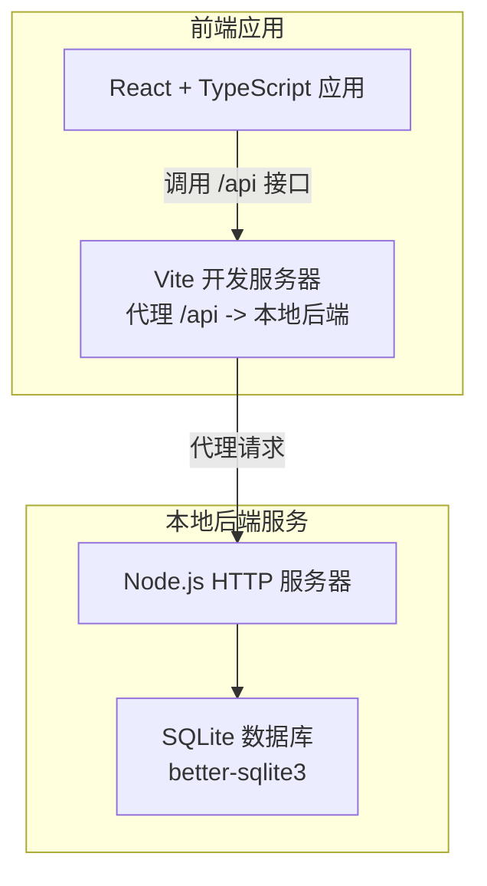
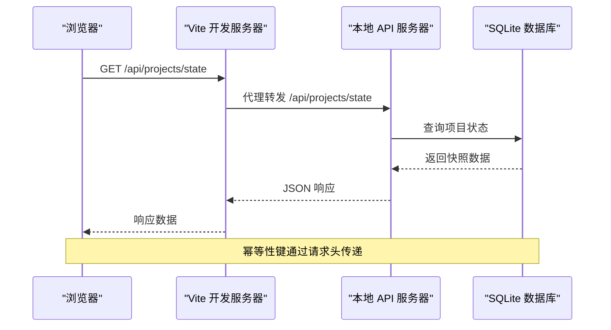
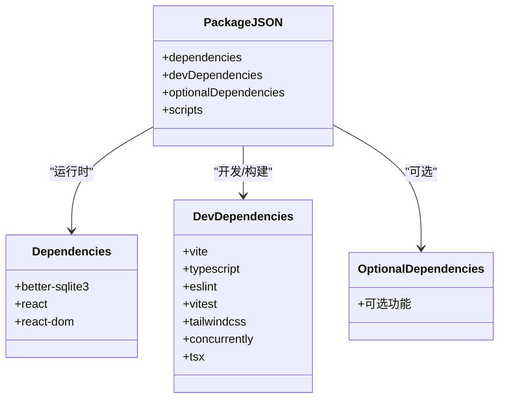
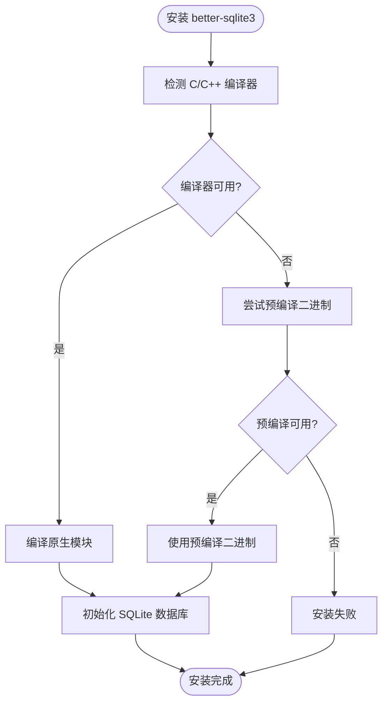
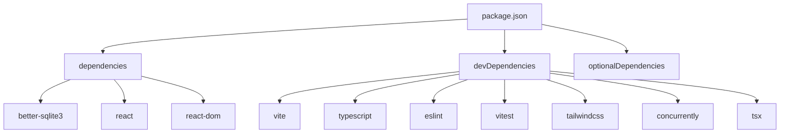

# 依赖安装

<cite>
**本文引用的文件**
- [package.json](file://package.json)
- [package-lock.json](file://package-lock.json)
- [README.md](file://README.md)
- [vite.config.ts](file://vite.config.ts)
- [local-api/server.ts](file://local-api/server.ts)
- [local-api/store/sqlite.ts](file://local-api/store/sqlite.ts)
- [local-api/store/schema.sql](file://local-api/store/schema.sql)
- [tsconfig.json](file://tsconfig.json)
</cite>

## 目录

1. [简介](#简介)
2. [项目结构](#项目结构)
3. [核心组件](#核心组件)
4. [架构总览](#架构总览)
5. [详细组件分析](#详细组件分析)
6. [依赖关系分析](#依赖关系分析)
7. [性能考虑](#性能考虑)
8. [故障排除指南](#故障排除指南)
9. [结论](#结论)
10. [附录](#附录)

## 简介

本指南面向 CodeBuddy 项目的开发者与运维人员，提供从零开始的依赖安装完整流程与最佳实践。内容涵盖 package.json 中依赖分类（dependencies、devDependencies、optionalDependencies）的作用与差异，以及 npm、yarn、pnpm 三种包管理器的安装选择与优势对比；重点说明本地 API 服务对 better-sqlite3 的编译要求与 C++ 编译器配置；解释依赖版本锁定机制与 package-lock.json 的作用；提供离线安装与私有仓库配置方法；包含依赖冲突解决策略与版本兼容性检查；最后给出验证依赖安装正确性与完整性的方法。

## 项目结构

CodeBuddy 是一个基于 React + Vite + TypeScript 的多模块项目管理平台，包含前端应用与本地后端服务两部分：

- 前端应用：使用 Vite 构建，React 19 + TypeScript，支持按需加载与代码分割。
- 本地后端服务：基于 Node.js HTTP 服务器与 SQLite 数据库，提供五条核心接口，支持幂等性保障与健康检查。
- 代理配置：Vite 将 /api 前缀代理到本地后端服务，便于前后端联调。

**图表来源**

- [vite.config.ts:1-35](file://vite.config.ts#L1-L35)
- [local-api/server.ts:1-414](file://local-api/server.ts#L1-L414)
- [local-api/store/sqlite.ts:1-99](file://local-api/store/sqlite.ts#L1-L99)

**章节来源**

- [README.md:55-113](file://README.md#L55-L113)
- [vite.config.ts:1-35](file://vite.config.ts#L1-L35)
- [local-api/server.ts:1-414](file://local-api/server.ts#L1-L414)

## 核心组件

- 依赖分类与作用
  - dependencies：运行时必需的生产依赖，如 React、React DOM、better-sqlite3。
  - devDependencies：开发与构建阶段使用的依赖，如 Vite、TypeScript、ESLint、测试框架等。
  - optionalDependencies：可选依赖，通常用于可选功能或平台特定优化，当前项目未定义该字段。
- 本地 API 服务
  - 使用 better-sqlite3 作为 SQLite 驱动，需要本地编译 C/C++ 插件。
  - 提供项目状态、任务状态、验收状态、结算状态、审计日志等接口。
  - 支持幂等性键（X-Idempotency-Key）防止重复提交。
- 版本锁定与一致性
  - 使用 package-lock.json 锁定精确版本，确保团队与 CI 环境的一致性。

**章节来源**

- [package.json:17-46](file://package.json#L17-L46)
- [local-api/server.ts:1-414](file://local-api/server.ts#L1-L414)
- [local-api/store/sqlite.ts:1-99](file://local-api/store/sqlite.ts#L1-L99)

## 架构总览

本地后端服务与前端应用通过 Vite 代理进行通信，前端通过 /api 前缀访问本地后端提供的 REST 接口。SQLite 数据库存储在本地文件系统中，better-sqlite3 负责数据库连接与查询。

**图表来源**

- [vite.config.ts:8-13](file://vite.config.ts#L8-L13)
- [local-api/server.ts:70-129](file://local-api/server.ts#L70-L129)
- [local-api/store/sqlite.ts:18-42](file://local-api/store/sqlite.ts#L18-L42)

## 详细组件分析

### 依赖分类详解

- dependencies（运行时依赖）
  - better-sqlite3：本地 SQLite 数据库驱动，用于本地 API 服务的数据持久化。
  - react、react-dom：前端运行时框架。
- devDependencies（开发与构建依赖）
  - Vite：快速开发与构建工具。
  - TypeScript 及相关类型声明：类型检查与开发体验。
  - ESLint 及插件：代码质量与风格检查。
  - Vitest 与 @testing-library：单元测试与集成测试。
  - Tailwind CSS：原子化样式框架。
  - concurrently、tsx：辅助开发脚本与本地 API 启动。
- optionalDependencies（可选依赖）
  - 当前项目未定义该字段，但某些依赖（如 esbuild、vite 等）声明了 optionalDependencies，用于可选功能或平台特定优化。

**图表来源**

- [package.json:17-46](file://package.json#L17-L46)

**章节来源**

- [package.json:17-46](file://package.json#L17-L46)

### 本地 API 服务与 better-sqlite3

- better-sqlite3 的编译要求
  - better-sqlite3 在安装时会执行原生模块编译，需要系统具备 C/C++ 编译环境。
  - 若系统缺少编译工具链，可能无法成功安装或运行。
- SQLite 数据库初始化
  - 本地 API 服务启动时会初始化数据库连接与表结构，确保 schema.sql 中定义的表存在。
  - 数据库文件位于本地文件系统，首次运行会自动创建目录与数据库文件。
- 幂等性保障
  - 本地 API 服务支持幂等键（X-Idempotency-Key），防止重复提交导致的状态不一致。

**图表来源**

- [local-api/store/sqlite.ts:18-42](file://local-api/store/sqlite.ts#L18-L42)
- [local-api/server.ts:70-129](file://local-api/server.ts#L70-L129)

**章节来源**

- [local-api/store/sqlite.ts:1-99](file://local-api/store/sqlite.ts#L1-L99)
- [local-api/server.ts:1-414](file://local-api/server.ts#L1-L414)

### 版本锁定与 package-lock.json

- package-lock.json 的作用
  - 锁定每个依赖的确切版本，确保团队与 CI 环境的一致性。
  - 记录依赖树的完整结构，避免因版本范围导致的不同安装结果。
- 版本范围与兼容性
  - dependencies 中的版本范围通常使用 Caret (^) 或波浪号 (~)，允许次要版本与补丁版本更新。
  - devDependencies 中的版本范围同样适用，但更关注开发与构建稳定性。
- 验证版本一致性
  - 通过比较 package.json 与 package-lock.json 中的版本号，确保依赖版本一致。
  - 使用包管理器的完整性检查命令验证安装结果。

**章节来源**

- [package-lock.json:1-800](file://package-lock.json#L1-L800)
- [package.json:17-46](file://package.json#L17-L46)

### 包管理器选择与优势

- npm（Node.js 默认包管理器）
  - 优点：无需额外安装，与 Node.js 紧密集成，生态成熟。
  - 适合：大多数场景，尤其是团队已使用 npm 的项目。
- yarn
  - 优点：更快的安装速度，稳定的依赖解析，离线缓存能力。
  - 适合：对安装速度与缓存有较高要求的团队。
- pnpm
  - 优点：磁盘空间占用少，安装速度快，硬链接共享依赖。
  - 适合：大型项目或磁盘空间有限的开发环境。
- 选择建议
  - 保持团队内一致性，避免混用不同包管理器。
  - 如需离线安装或私有仓库，优先考虑 yarn 或 pnpm 的离线缓存与私有源支持。

**章节来源**

- [README.md:12-16](file://README.md#L12-L16)

### 离线安装与私有仓库配置

- 离线安装
  - yarn：使用 yarn install --offline，利用本地缓存安装依赖。
  - pnpm：使用 pnpm install --frozen-lockfile，确保使用锁定文件进行安装。
  - npm：使用 npm ci，基于 package-lock.json 进行一次性安装。
- 私有仓库配置
  - npm：配置 .npmrc 文件，设置 registry 与认证信息。
  - yarn：配置 .yarnrc.yml 文件，设置 registry 与离线镜像。
  - pnpm：配置 .pnpm-store 与 .pnpmrc 文件，设置私有源与认证。
- 注意事项
  - 确保私有仓库的认证凭据安全存储。
  - 对于 better-sqlite3 等原生模块，需确保目标平台的二进制兼容性。

**章节来源**

- [package-lock.json:1-800](file://package-lock.json#L1-L800)

### 依赖冲突解决与版本兼容性检查

- 常见冲突场景
  - 不同包对同一依赖的版本要求不一致。
  - TypeScript 版本与相关插件版本不匹配。
  - React 与 React DOM 版本不一致。
- 解决策略
  - 使用包管理器的依赖解析工具（如 npm ls、yarn why、pnpm why）定位冲突来源。
  - 升级或降级相关包以满足共同依赖版本。
  - 使用 peerDependencies 与 engine 字段约束版本范围。
- 兼容性检查
  - 检查 Node.js 版本与包管理器版本是否满足项目要求。
  - 验证 TypeScript 与 React 版本组合的兼容性。
  - 对于 better-sqlite3，确保系统具备合适的 C/C++ 编译环境。

**章节来源**

- [README.md:7-11](file://README.md#L7-L11)
- [package.json:17-46](file://package.json#L17-L46)

### 验证依赖安装的正确性与完整性

- 基本验证步骤
  - 检查 node_modules 是否存在且包含关键依赖（如 react、better-sqlite3、vite）。
  - 运行 npm run dev 或 yarn dev，确认前端开发服务器启动成功。
  - 运行 npm run local-api 或 yarn local-api，确认本地 API 服务启动成功。
  - 访问 http://localhost:5173，确认前端页面加载正常。
  - 访问 http://localhost:3100/health，确认本地 API 健康检查返回 ok。
- 进一步验证
  - 检查 package-lock.json 是否与 package.json 一致。
  - 运行测试命令 npm run test 或 yarn test，确保测试通过。
  - 运行构建命令 npm run build 或 yarn build，确认构建成功。

**章节来源**

- [README.md:18-53](file://README.md#L18-L53)
- [local-api/server.ts:332-334](file://local-api/server.ts#L332-L334)

## 依赖关系分析

- 前端与本地后端的依赖关系
  - 前端通过 Vite 代理将 /api 请求转发到本地后端服务。
  - 本地后端依赖 better-sqlite3 进行数据库操作。
- 依赖树可视化
  - package.json 中的 dependencies 与 devDependencies 形成完整的依赖树。
  - package-lock.json 记录了依赖树的精确版本与子依赖关系。

**图表来源**

- [package.json:17-46](file://package.json#L17-L46)

**章节来源**

- [package.json:17-46](file://package.json#L17-L46)
- [package-lock.json:1-800](file://package-lock.json#L1-L800)

## 性能考虑

- 代码分割与懒加载
  - Vite 配置了手动分块策略，将 React 生态核心库独立打包，提升缓存命中率。
- 构建优化
  - 通过 Rollup 输出配置与分块大小警告阈值调整，平衡包体大小与加载性能。
- 依赖体积控制
  - 仅引入必要的依赖，避免引入冗余包，减少主包体积。

**章节来源**

- [vite.config.ts:15-33](file://vite.config.ts#L15-L33)

## 故障排除指南

- better-sqlite3 安装失败
  - 确认系统具备 C/C++ 编译环境（如 GCC、Clang 或 Visual Studio Build Tools）。
  - 尝试使用预编译二进制（若可用），或更换包管理器（yarn/pnpm）。
  - 检查 Node.js 版本与 better-sqlite3 的兼容性。
- 本地 API 服务启动异常
  - 检查端口 3100 是否被占用，可通过 LOCAL_API_PORT 环境变量修改端口。
  - 确认 SQLite 数据库文件与 schema.sql 是否存在且可读写。
  - 查看控制台输出的日志信息，定位具体错误。
- 前后端联调失败
  - 确认 Vite 代理配置正确，/api 请求是否转发到 http://localhost:3100。
  - 检查跨域响应头是否包含 X-Idempotency-Key。
  - 验证幂等键（X-Idempotency-Key）是否正确传递。

**章节来源**

- [local-api/server.ts:18-66](file://local-api/server.ts#L18-L66)
- [vite.config.ts:8-13](file://vite.config.ts#L8-L13)

## 结论

通过本指南，您可以在不同包管理器环境下完成 CodeBuddy 项目的依赖安装，并理解 package.json 中依赖分类的作用。针对本地 API 服务的特殊依赖 better-sqlite3，我们提供了编译要求与 C++ 编译器配置的详细说明。同时，文档涵盖了版本锁定机制、离线安装与私有仓库配置、依赖冲突解决策略与版本兼容性检查，以及验证依赖安装正确性与完整性的方法。建议团队在开发与部署过程中保持包管理器与依赖版本的一致性，确保项目稳定运行。

## 附录

- 环境要求
  - Node.js >= 18.0.0
  - npm >= 9.0.0
- 快速安装命令
  - npm install
  - yarn install
  - pnpm install
- 常用脚本
  - npm run dev：启动前端开发服务器
  - npm run dev:local：同时启动前端与本地后端
  - npm run local-api：启动本地 API 服务
  - npm run build：生产构建
  - npm run test：运行测试
  - npm run test:run：单次运行测试
  - npm run test:coverage：测试覆盖率

**章节来源**

- [README.md:7-53](file://README.md#L7-L53)
