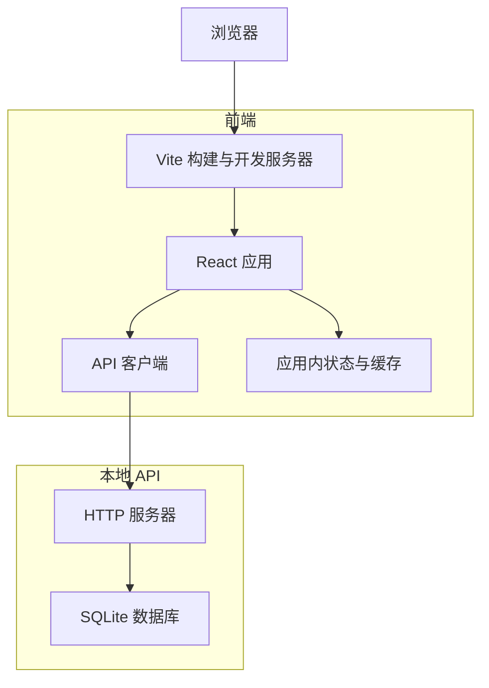
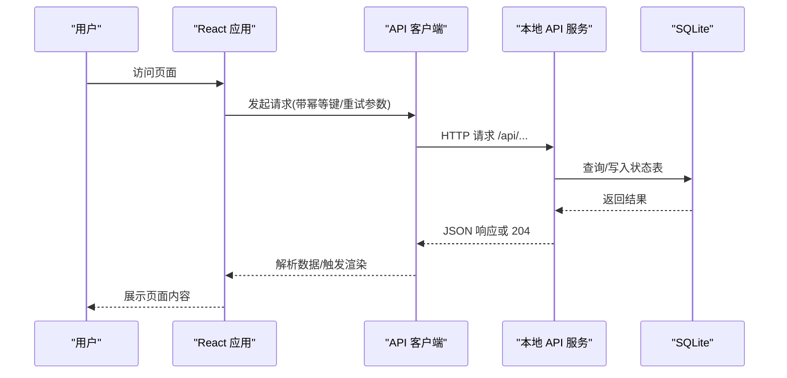
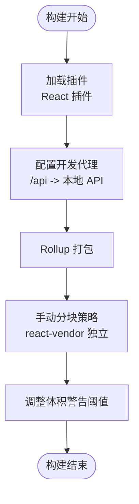
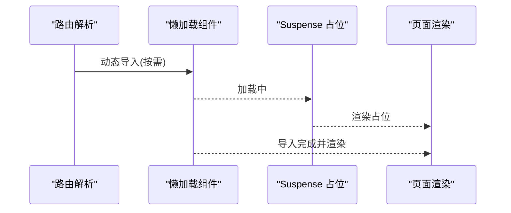
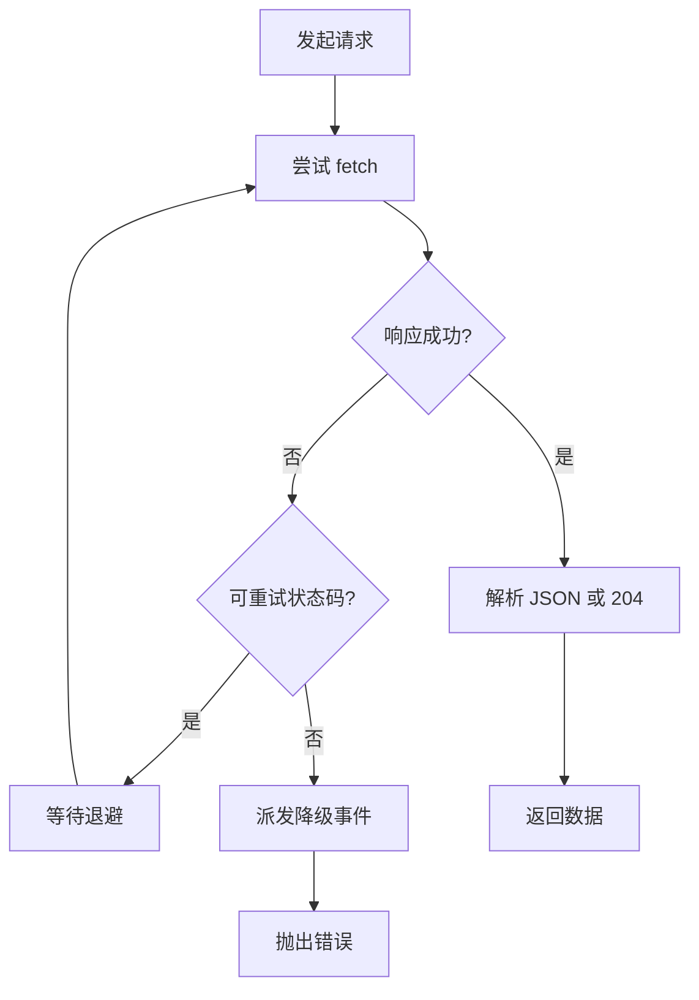
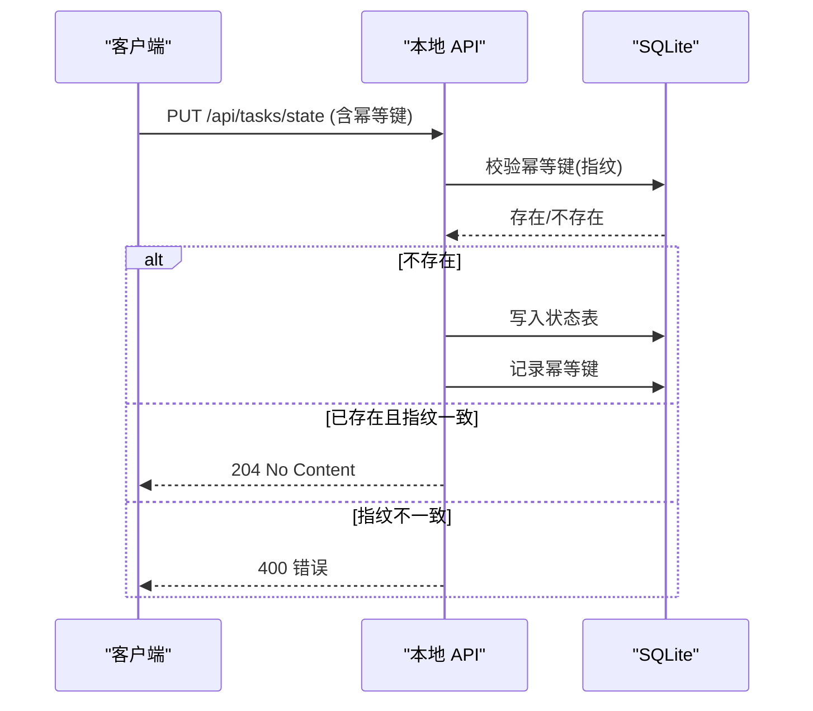
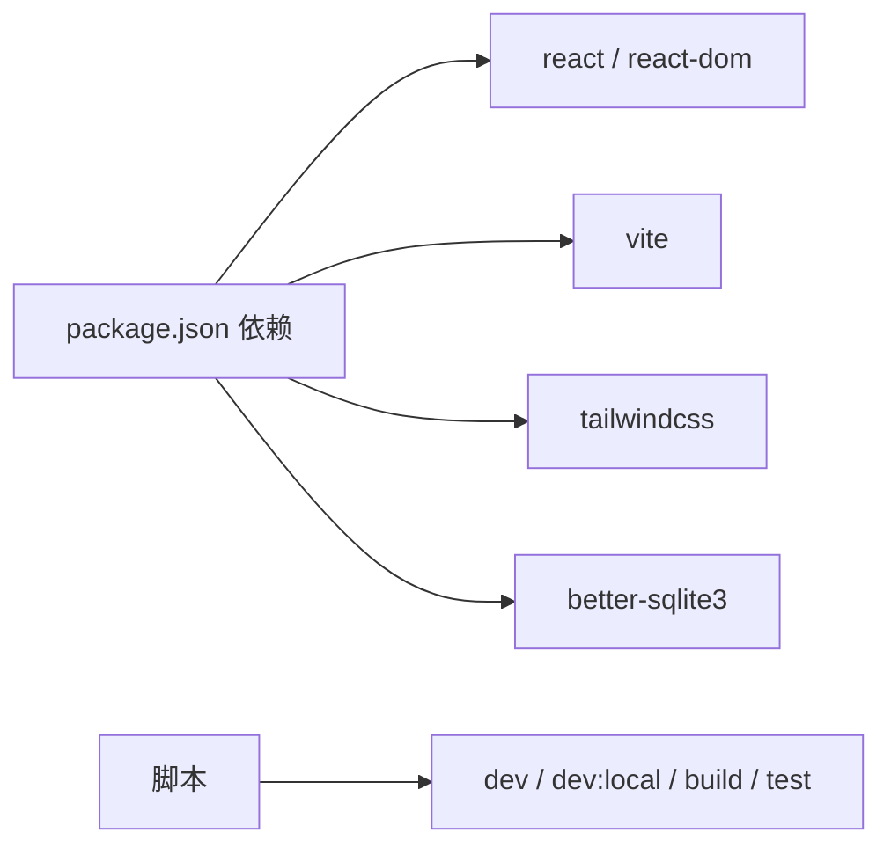

# 性能优化

<cite>
**本文引用的文件**
- [vite.config.ts](file://vite.config.ts)
- [package.json](file://package.json)
- [local-api/server.ts](file://local-api/server.ts)
- [local-api/store/sqlite.ts](file://local-api/store/sqlite.ts)
- [local-api/store/schema.sql](file://local-api/store/schema.sql)
- [local-api/store/idempotency.ts](file://local-api/store/idempotency.ts)
- [src/App.tsx](file://src/App.tsx)
- [src/services/api/client.ts](file://src/services/api/client.ts)
- [tailwind.config.js](file://tailwind.config.js)
- [src/components/layout/Header.tsx](file://src/components/layout/Header.tsx)
</cite>

## 目录

1. [简介](#简介)
2. [项目结构](#项目结构)
3. [核心组件](#核心组件)
4. [架构总览](#架构总览)
5. [详细组件分析](#详细组件分析)
6. [依赖关系分析](#依赖关系分析)
7. [性能考虑](#性能考虑)
8. [故障排查指南](#故障排查指南)
9. [结论](#结论)
10. [附录](#附录)

## 简介

本指南面向 CodeBuddy 前后端一体化开发场景，聚焦以下性能优化主题：

- Vite 构建优化：代码分割策略、懒加载实现、bundle 分析与体积控制
- 前端性能优化：图片与字体优化、CSS 体积与运行时性能
- 本地 API 服务性能调优：SQLite 优化、连接与事务、查询监控
- 缓存策略：浏览器缓存、CDN 缓存、应用内缓存
- 内存与 GC：内存使用优化与垃圾回收策略
- 性能监控与指标采集：埋点、可视化与告警
- 性能测试与基准：测试方法与工具使用
- 生产环境监控与告警：可观测性与告警配置

## 项目结构

项目采用前端 Vite + React + TypeScript，配合本地 HTTP API 服务（better-sqlite3），通过 Vite 反向代理对接本地后端，支持路由级懒加载与按需资源加载。

图示来源

- [vite.config.ts:1-35](file://vite.config.ts#L1-L35)
- [package.json:1-48](file://package.json#L1-L48)
- [local-api/server.ts:1-414](file://local-api/server.ts#L1-L414)
- [local-api/store/sqlite.ts:1-99](file://local-api/store/sqlite.ts#L1-L99)

章节来源

- [vite.config.ts:1-35](file://vite.config.ts#L1-L35)
- [package.json:1-48](file://package.json#L1-L48)
- [local-api/server.ts:1-414](file://local-api/server.ts#L1-L414)
- [local-api/store/sqlite.ts:1-99](file://local-api/store/sqlite.ts#L1-L99)

## 核心组件

- Vite 构建配置：定义插件、开发代理、手动分块策略与体积警告阈值
- React 懒加载：按路由级动态导入页面组件，结合 Suspense 提升首屏性能
- API 客户端：统一请求封装、幂等头、重试与降级事件派发
- 本地 API 服务：基于 better-sqlite3 的 HTTP 服务，支持健康检查、幂等写入与审计日志
- SQLite 存储：WAL 模式、索引、幂等键清理与连接管理

章节来源

- [vite.config.ts:15-33](file://vite.config.ts#L15-L33)
- [src/App.tsx:1-20](file://src/App.tsx#L1-L20)
- [src/services/api/client.ts:83-172](file://src/services/api/client.ts#L83-L172)
- [local-api/server.ts:70-329](file://local-api/server.ts#L70-L329)
- [local-api/store/sqlite.ts:18-42](file://local-api/store/sqlite.ts#L18-L42)

## 架构总览

前端通过 Vite 开发服务器运行，本地 API 作为独立进程启动并通过反向代理暴露到 /api。React 应用使用懒加载与 Suspense 控制首屏与交互延迟；本地 API 使用 better-sqlite3，启用 WAL 提升并发读写，并维护多张状态表与审计日志表。

图示来源

- [src/services/api/client.ts:83-172](file://src/services/api/client.ts#L83-L172)
- [local-api/server.ts:70-329](file://local-api/server.ts#L70-L329)
- [local-api/store/sqlite.ts:18-42](file://local-api/store/sqlite.ts#L18-L42)

## 详细组件分析

### Vite 构建优化

- 代码分割策略
  - 使用手动分块规则将 React 生态核心库（如 react、react-dom）单独打包为 vendor chunk，提升缓存命中率与二次加载性能
  - 为后续扩展图表库、UI 组件库预留分块入口
- 体积警告阈值
  - 提升 chunkSizeWarningLimit，配合懒加载降低误报
- 开发代理
  - 将 /api 前缀代理至本地 API 服务地址，便于联调与隔离

图示来源

- [vite.config.ts:5-33](file://vite.config.ts#L5-L33)

章节来源

- [vite.config.ts:15-33](file://vite.config.ts#L15-L33)
- [package.json:6-16](file://package.json#L6-L16)

### 路由级懒加载与 Suspense

- 页面组件按路由动态导入，减少首屏 bundle 体积
- 使用 Suspense 提供占位加载器，改善交互连续性
- 事件监听与兜底提示：当远程服务不可用时派发自定义事件，触发本地兜底提示

图示来源

- [src/App.tsx:1-20](file://src/App.tsx#L1-L20)
- [src/App.tsx:750-808](file://src/App.tsx#L750-L808)

章节来源

- [src/App.tsx:1-20](file://src/App.tsx#L1-L20)
- [src/App.tsx:362-392](file://src/App.tsx#L362-L392)

### API 客户端与重试、降级

- 统一请求封装：支持方法、JSON Body、幂等键头、自定义头部
- 重试机制：对特定状态码进行指数退避重试，避免瞬时抖动影响
- 降级事件：网络异常或重试耗尽时派发自定义事件，触发本地兜底提示
- 环境变量：支持通过 Vite 环境变量配置 API 基础路径

图示来源

- [src/services/api/client.ts:83-172](file://src/services/api/client.ts#L83-L172)

章节来源

- [src/services/api/client.ts:1-172](file://src/services/api/client.ts#L1-L172)

### 本地 API 服务与 SQLite 优化

- 连接与初始化
  - 初始化时启用 WAL 模式，提升并发读写能力
  - 读取 schema 并执行，确保表结构与索引就绪
- 路由与接口
  - 提供健康检查、项目/任务/验收/结算状态接口与审计日志接口
  - PUT 写入支持幂等键校验与记录，避免重复写入
- 幂等键
  - 生成请求指纹，校验请求体一致性，记录响应状态与主体
  - 定期清理过期幂等键，控制存储膨胀

图示来源

- [local-api/server.ts:132-197](file://local-api/server.ts#L132-L197)
- [local-api/store/idempotency.ts:23-58](file://local-api/store/idempotency.ts#L23-L58)

章节来源

- [local-api/server.ts:18-414](file://local-api/server.ts#L18-L414)
- [local-api/store/sqlite.ts:18-80](file://local-api/store/sqlite.ts#L18-L80)
- [local-api/store/schema.sql:1-72](file://local-api/store/schema.sql#L1-L72)
- [local-api/store/idempotency.ts:1-100](file://local-api/store/idempotency.ts#L1-L100)

### CSS 与样式优化

- Tailwind 配置：content 覆盖根 HTML 与 src 下所有模板文件，确保仅提取实际使用的类，减少未使用 CSS 体积
- 建议：结合 Purge/Tree-shaking 工具进一步裁剪，避免引入未使用样式

章节来源

- [tailwind.config.js:1-12](file://tailwind.config.js#L1-L12)

### 图片与字体优化

- 图片：优先使用现代格式（WebP/AVIF）、按需加载、设置合适的尺寸与密度，避免阻塞渲染
- 字体：预加载关键字体、使用字体子集化、设置字体回退与防抖动策略，避免 FOIT/FOFT

（本节为通用实践说明，不直接分析具体文件）

## 依赖关系分析

- 前端依赖
  - React 19、React DOM 19、Vite 8、Tailwind CSS 4
  - better-sqlite3 11（本地 API）
- 构建与脚本
  - dev/dev:local/build/preview/test 等脚本，支持本地 API 与前端联调

图示来源

- [package.json:17-46](file://package.json#L17-L46)

章节来源

- [package.json:1-48](file://package.json#L1-L48)

## 性能考虑

### Vite 构建与 Bundle 分析

- 代码分割
  - 使用手动分块将 react、react-dom 独立打包，提升浏览器缓存复用
  - 为后续第三方库预留分块入口，避免 vendor 混杂
- 体积控制
  - 提升 chunkSizeWarningLimit，结合懒加载减少误报
  - 使用 Vite 的预优化与依赖预构建，缩短冷启动时间
- Bundle 分析
  - 建议使用官方分析工具或第三方可视化工具查看产物构成，定位大体积依赖与重复模块

章节来源

- [vite.config.ts:15-33](file://vite.config.ts#L15-L33)

### 前端性能优化

- 图片与字体
  - 图片：使用合适尺寸与格式，懒加载非首屏图片，设置 width/height 避免布局偏移
  - 字体：关键字体预加载，使用字体显示回调与字体回退策略
- CSS 优化
  - Tailwind 自动裁剪未使用类，建议开启生产构建的 Tree-shaking
  - 避免深层嵌套与重复选择器，减少样式计算开销
- 交互体验
  - 使用 Suspense 占位与骨架屏，提升感知性能
  - 合理拆分长任务，避免主线程阻塞

章节来源

- [tailwind.config.js:1-12](file://tailwind.config.js#L1-L12)
- [src/components/layout/Header.tsx:6](file://src/components/layout/Header.tsx#L6)

### 本地 API 服务性能调优

- SQLite 优化
  - 启用 WAL 模式，提升并发读写吞吐
  - 为高频查询字段建立索引（如审计日志中的 env_id、project_code、scene）
  - 定期清理过期幂等键，控制表膨胀
- 连接与事务
  - 单例连接管理，避免频繁打开/关闭连接
  - 对批量写入使用事务，减少磁盘写放大
- 查询监控
  - 在关键接口增加日志与耗时统计，识别慢查询
  - 对幂等写入路径增加指纹校验与快速失败逻辑

章节来源

- [local-api/store/sqlite.ts:18-42](file://local-api/store/sqlite.ts#L18-L42)
- [local-api/store/schema.sql:53-71](file://local-api/store/schema.sql#L53-L71)
- [local-api/store/idempotency.ts:63-86](file://local-api/store/idempotency.ts#L63-L86)

### 缓存策略

- 浏览器缓存
  - 静态资源使用长效缓存策略，版本化文件名，合理设置 Cache-Control
- CDN 缓存
  - 对静态资源启用 CDN，结合边缘缓存与回源策略
- 应用内缓存
  - 本地 API 写入使用幂等键避免重复写入
  - 前端对热点数据进行短期缓存，结合失效策略与增量更新

章节来源

- [src/services/api/client.ts:43-48](file://src/services/api/client.ts#L43-L48)
- [local-api/store/idempotency.ts:23-58](file://local-api/store/idempotency.ts#L23-L58)

### 内存使用与垃圾回收

- 减少全局常驻对象，及时释放事件监听与定时器
- 避免闭包持有大对象导致无法回收
- React 中使用 useMemo/useCallback 缓存计算结果，减少重复渲染
- 本地 API 中避免一次性加载大量数据到内存，采用流式处理或分页

章节来源

- [src/App.tsx:362-392](file://src/App.tsx#L362-L392)

### 性能监控与指标采集

- 埋点与日志
  - API 客户端记录网络错误、重试与降级事件，便于问题定位
  - 本地 API 记录写入与幂等键命中情况
- 指标
  - 响应时间、错误率、缓存命中率、数据库慢查询数
- 可视化与告警
  - 建议接入指标系统与日志平台，设置阈值告警

章节来源

- [src/services/api/client.ts:104-121](file://src/services/api/client.ts#L104-L121)
- [src/services/api/client.ts:142-155](file://src/services/api/client.ts#L142-L155)
- [local-api/store/idempotency.ts:46-54](file://local-api/store/idempotency.ts#L46-L54)

### 性能测试与基准

- 单元与集成测试
  - 使用 Vitest 进行单元测试与覆盖率统计
- 基准测试
  - 对关键接口与渲染路径进行基准测试，记录 P50/P95 延迟
- 压力测试
  - 使用工具模拟并发请求，观察吞吐与延迟变化

章节来源

- [package.json:13-16](file://package.json#L13-L16)

### 生产环境监控与告警

- 健康检查
  - 提供 /health 接口，便于探活与编排层健康检查
- 日志与追踪
  - 统一结构化日志，关联请求 ID 与用户上下文
- 告警
  - 设置延迟、错误率、缓存命中率等阈值告警，联动值班流程

章节来源

- [local-api/server.ts:332-334](file://local-api/server.ts#L332-L334)

## 故障排查指南

- 前端请求失败
  - 检查 Vite 代理是否正确指向本地 API
  - 查看 API 客户端日志与重试行为，确认幂等键与环境变量配置
- 本地 API 写入异常
  - 检查幂等键指纹是否一致，确认数据库连接与 WAL 模式
  - 关注慢查询与索引缺失
- 性能问题
  - 使用构建分析工具定位大体积依赖
  - 检查 CSS 与图片是否过大，优化加载策略

章节来源

- [vite.config.ts:7-14](file://vite.config.ts#L7-L14)
- [src/services/api/client.ts:54-81](file://src/services/api/client.ts#L54-L81)
- [local-api/store/sqlite.ts:32](file://local-api/store/sqlite.ts#L32)

## 结论

通过合理的构建分块、路由级懒加载、SQLite WAL 与索引优化、幂等写入与降级策略，以及完善的监控与测试体系，CodeBuddy 可在开发与生产环境中获得稳定且可预期的性能表现。建议持续关注体积与延迟指标，迭代优化关键路径与缓存策略。

## 附录

- 快速检查清单
  - 构建：vendor 分块生效、体积警告阈值合理、预构建依赖正常
  - 前端：图片/字体优化、Tailwind 自动裁剪、Suspense 占位完善
  - 本地 API：WAL 启用、索引齐全、幂等键清理、健康检查可用
  - 监控：网络错误与重试日志、慢查询统计、告警阈值设定
